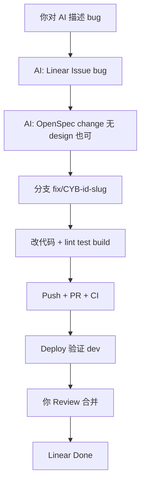
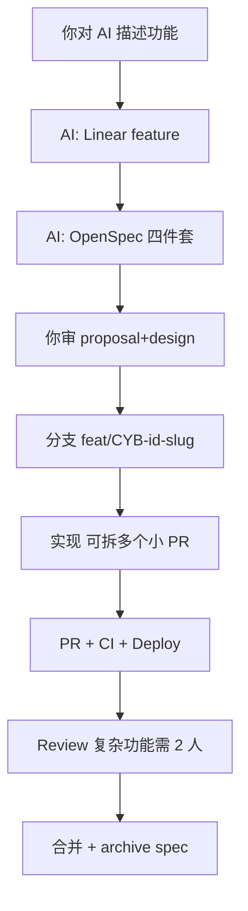

```
██████╗  █████╗ ████████╗ █████╗ ██████╗ ██████╗ ███████╗██╗    ██╗
██╔══██╗██╔══██╗╚══██╔══╝██╔══██╗██╔══██╗██╔══██╗██╔════╝██║    ██║
██║  ██║███████║   ██║   ███████║██████╔╝██████╔╝█████╗  ██║ █╗ ██║
██║  ██║██╔══██║   ██║   ██╔══██║██╔══██╗██╔══██╗██╔══╝  ██║███╗██║
██████╔╝██║  ██║   ██║   ██║  ██║██████╔╝██║  ██║███████╗╚███╔███╔╝
╚═════╝ ╚═╝  ╚═╝   ╚═╝   ╚═╝  ╚═╝╚═════╝ ╚═╝  ╚═╝╚══════╝ ╚══╝╚══╝
```

# cyber-databrew（data-platform）

面向视频 / 多模态**资产元数据、算法状态、检索与交付**的单进程后端 + Web / SDK 工程骨架；GitHub 主仓库为 [`CyberOrigin2077/cyber-databrew`](https://github.com/CyberOrigin2077/cyber-databrew)。

> 贡献流程见 [`CONTRIBUTING.md`](CONTRIBUTING.md)。

> **架构基线与评审文档**以 [`docs/review/README.md`](docs/review/README.md) 为准（当前 **2.0：PostgreSQL + Elasticsearch + BigQuery + Outbox CDC**）。本页只负责仓库导航与本地启动。

## Runtime snapshot

| 组件 | 状态 |
|------|------|
| 存储 | **PostgreSQL**（默认 `STORAGE_BACKEND=postgres`） |
| 服务 | Go 单进程（`backend/cmd/server`） |
| 检索 | **Elasticsearch**（Outbox relay/subscriber 驱动同步） |
| 湖仓 | **BigQuery + BigLake-managed Iceberg**（Cloud Run Job 入湖） |
| 异步同步 | **Outbox**：`asset_events` + relay/subscriber（Pub/Sub → ES） |
| 预览 | **mcap-preview** 服务（HEVC/H.264 转码 + fMP4 流式） |

## Repository layout

| 路径 | 说明 |
|------|------|
| `backend/` | Go API（assets / mcap / deliveries / algo / search / lakehouse / admin） |
| `services/mcap-preview/` | MCAP 预览服务（独立 Go 服务，HEVC/H.264 转码 + fMP4 流式） |
| `Frontend/` | React + TypeScript 前端（card view / facets / preview pane / dashboard） |
| `sdk/` | Python SDK（`cyber_databrew_sdk`，httpx + pydantic，CRUD 已完成，OpenAPI 类型生成待迭代）；见 [`sdk/README.md`](sdk/README.md) |
| `deploy/local/` | Docker Compose：最小依赖、全栈、Iceberg；说明见 [`deploy/local/README.md`](deploy/local/README.md) |
| `deploy/k8s/` | Kubernetes 清单（backend / frontend / mcap-preview / monitoring / gateway）；说明见 [`deploy/k8s/README.md`](deploy/k8s/README.md) |
| `deploy/cloudrun/` | Cloud Run 部署脚本与配置 |
| `deploy/iac/terraform/` | Terraform IaC（GCP 数据基础设施、Gateway、服务身份） |
| `.tekton/` | Tekton CI/CD 流水线（构建、部署、推送） |
| `schemas/` | SQL / 阶段 schema |
| `api/openapi.yaml` | HTTP 契约（与实现一致的源） |
| `docs/review/` | **评审与设计主文档包**（整体方案、schema 速查、API 指南、路线图） |
| `docs/repo-wiki/` | 仓库 Wiki（Markdown，按 cyber-annotation repo-wiki 模板组织） |
| `docs/agents/` | **AI 协作规范**（Cursor / Codex 共用，规则真相在此目录） |
| `openspec/` | **Spec 驱动开发**：当前系统规格 + 每次变更的 proposal/design/tasks |
| `docs/archive/` | 历史调研与旧版设计（仅供参考） |
| `scripts/` | 运维与冒烟测试脚本 |
| `CONTRIBUTING.md` | 贡献指南（分支 / 提交规范 / 测试 / 文档同步 / PR 流程） |

各子模块细节见对应目录内的 README。

## AI 协作开发（Cursor / Codex 等）

团队默认 **AI-first**：用 **Cursor 或 Codex**（或其它带 Agent 的 IDE）打开本仓库后，**直接描述你要做的事**即可。不必背诵流程，也不必先说「按规范准备环境」。

**Cursor 与 Codex 使用同一套流程**（没有「只有某一种 IDE 才做」的步骤）。打开仓库根目录后，Agent 会**自动**加载 [`docs/agents/AI-RULES.md`](docs/agents/AI-RULES.md) 并按其中规则执行，你无需手动打开各子目录或配置 Cursor 专用路径。

| 能力 | 文档 |
|------|------|
| 总规则 + 自动行为 | [`docs/agents/AI-RULES.md`](docs/agents/AI-RULES.md) |
| 环境检查、commit hook | [`docs/agents/SETUP.md`](docs/agents/SETUP.md) |
| Deploy 后再 commit | [`docs/agents/deploy-before-commit.md`](docs/agents/deploy-before-commit.md) |
| Deploy 后验证（含固定页面/API 清单） | [`docs/agents/deploy-verification.md`](docs/agents/deploy-verification.md) §六 |
| Bug / Feature / Hotfix | [`docs/agents/WORKFLOWS.md`](docs/agents/WORKFLOWS.md) |
| OpenSpec | [`openspec/`](openspec/) + [`spec-driven-workflow.md`](docs/agents/spec-driven-workflow.md) |

Codex 通过根目录 [`AGENTS.md`](AGENTS.md) 进入同一套规则；其它 Agent 工具同理，均以 `docs/agents/` 为准。

- **Agent 自动执行**：Linear Issue、OpenSpec 变更目录、分支命名、本地测试、deploy 验证、PR 模板字段。
- **CI 硬兜底**：缺 OpenSpec、分支无 `CYB-xxx`、commit 格式错误 → PR 无法合并。

---

### 一、首次使用：Clone 与一次性配置

#### 1.1 获取代码

```bash
git clone https://github.com/CyberOrigin2077/cyber-databrew.git
cd cyber-databrew
git checkout main   # 或你们约定的工作分支
```

用 **Cursor 或 Codex** 打开仓库**根目录**（不要只打开 `backend/` 等子目录）。规则会自动生效，流程一致。

#### 1.2 人需要做一次的环境项

| 项 | 是否必须 | 说明 |
|----|:--------:|------|
| 配置 **Linear MCP** | 建议 | 环境变量 `LINEAR_API_KEY`，供 AI 创建/查询 Issue（`CYB-xxx`） |
| **commit-msg hook** | 自动 | Agent 首次任务会执行 `git config core.hooksPath .githooks`（仅本仓库）；也可自行执行，见 [Commit 规范](#commit-规范) |
| **本地全栈**（Postgres + 后端 + 前端） | 按需 | 仅本地调试或 deploy 验证时需要，见下文 [Quick start](#quick-start) |
**OpenSpec 无需单独安装**：规格与变更全是仓库里的 Markdown（`openspec/`），`git clone` 即有。见下文 [三、OpenSpec 文档说明](#三openspec-文档说明)。

**Commit hook：** 一般由 Agent 在后台自动配置（见 [`docs/agents/SETUP.md`](docs/agents/SETUP.md)）。若本地 `git commit` 未校验格式，可手动执行下方 [Commit 规范](#commit-规范) 中的两条命令。PR 合并仍以 CI `commitlint` 为准。

**本地服务（需要调 API / 前端页面时）：**

```bash
make dev-up
cp backend/.env.example backend/.env   # 编辑 DB_*、DATABREW_TOKEN 等
make backend-run                       # 另开终端: make frontend-dev
```

#### 1.3 Agent 会在后台自动检查（无需你下指令）

打开 AI 对话后，Agent 会按 [`docs/agents/SETUP.md`](docs/agents/SETUP.md) 静默检查并尽量自行修复：

- Go / Node / Python 依赖是否可构建
- `.agents/skills/` 是否已安装
- Linear MCP 是否连通（仅缺 key 时会问你）

---

### 二、日常怎么开工（通用）

1. 在 AI 工具里 **新开对话**（Cursor / Codex 均可；复杂任务建议一功能一会话）。
2. **用自然语言说任务**（可带 Linear 号，也可不带——AI 会补建 Issue）。
3. **等 AI 走完流程**（见下文 Bug / Feature / Hotfix 分路径）。
4. **你负责**：审方案（Feature 建议）、Review PR、确认 deploy 验证通过、点合并。
5. **禁止在未 deploy 验证前 commit/push 运行时代码**（部署与验证步骤见 [`deploy-before-commit.md`](docs/agents/deploy-before-commit.md)、[`deploy-verification.md`](docs/agents/deploy-verification.md)）。

**示例话术：**

| 你想做 | 对 AI 说 |
|--------|----------|
| 修缺陷 | `修：BatchDelete 删标签后列表不刷新` |
| 已有工单 | `按 CYB-42 修 BatchDelete 删后列表不刷新` |
| 新功能 | `做 CYB-58：Lakehouse 报表导出 API` |
| 线上紧急 | `hotfix：生产 P0，xxx 接口 500，先修再补 spec` |
| 只改文档 | `只更新 README，不动运行时代码` |

---

### 三、OpenSpec 文档说明（全在仓库内，不用装 CLI）

OpenSpec 在本项目中 **不是** 需要全局安装的软件，而是 **`openspec/` 目录下的 Markdown**：

- 随 `git clone` 一起下来，和 `docs/`、`api/openapi.yaml` 一样进版本库
- Agent 在改代码前 **创建/编辑** `openspec/changes/CYB-xxx-.../*.md`
- CI 用 [`scripts/validate_openspec_change.sh`](scripts/validate_openspec_change.sh) 检查 PR 是否带了 change 目录
- 合并后把 delta **手工或让 AI 合进** `openspec/specs/`，见 [`docs/agents/spec-driven-workflow.md`](docs/agents/spec-driven-workflow.md)

凡改动 **运行时代码**（`backend/`、`Frontend/`、`sdk/`、`dagster/`），须先在 `openspec/changes/CYB-{号}-{描述}/` 落文档，**再写代码**。

#### 3.1 两类目录

| 目录 | 含义 | 何时更新 |
|------|------|----------|
| `openspec/specs/<模块>/spec.md` | 系统**当前**应具备的行为（真相库） | Feature 合并后 archive；或人工维护基线 |
| `openspec/changes/CYB-xxx-.../` | **本次**变更的提案 + 需求差分 | 开发过程中；PR 评审看这里 |

模块：`asset-management`、`delivery`、`lakehouse`、`search`（见 [`openspec/config.yaml`](openspec/config.yaml)）。

#### 3.2 单次变更里有哪些文件

| 文件 | Bug | Feature | Hotfix（先上线） | 内容 |
|------|:---:|:-------:|:----------------:|------|
| `proposal.md` | 必填 | 必填 | T+2 内补 | 背景、目标、范围、验收标准 |
| `design.md` | 可选 | **必填** | T+2 内补 | 技术方案、API/表/依赖、风险与回滚 |
| `tasks.md` | 必填 | 必填 | T+2 内补 | 实现步骤 checklist |
| `specs/<模块>/spec.md` | 必填 | 必填 | T+2 内补 | ADDED / MODIFIED / REMOVED 需求 delta |

示例（Feature）：

```
openspec/changes/CYB-58-lakehouse-report-export/
├── proposal.md
├── design.md
├── tasks.md
└── specs/lakehouse/spec.md
```

OpenSpec **不生成业务代码**；代码由 AI 按 `tasks.md` 编写。

---

### 四、Bug 修复（完整流程）

适用：缺陷、回归、行为不符合预期、报错等。



| 阶段 | 执行方 | 具体动作 |
|------|--------|----------|
| 1. 工单 | AI | Linear 创建/关联 `CYB-xxx`，label `bug`，写清复现步骤 |
| 2. 规格 | AI | `openspec/changes/CYB-xxx-.../`：`proposal.md` + `tasks.md` + 至少 1 个 `specs/*/spec.md` delta |
| 3. 分支 | AI | `git checkout -b fix/CYB-xxx-简短描述` |
| 4. 实现 | AI | 改代码；每步后 `npm run lint` / `go test` 等（见 AI-RULES） |
| 5. 提交 | AI | `fix(scope): 描述`，Conventional Commits |
| 6. PR | AI | 填 [PR 模板](.github/pull_request_template.md)：Linear ID、OpenSpec 路径、测试证据 |
| 7. CI | GitHub | `openspec-gate`、`commitlint`、`test-integration`、`pre-commit` 全绿 |
| 8. 部署验证 | AI + 你 | 部署 dev → 针对性 + 回归（见 [deploy-verification](docs/agents/deploy-verification.md)）；前端可用 Chrome DevTools MCP；**你确认 OK** |
| 9. 合并 | 你 | Squash merge；PR description 写清整体改动 |
| 10. 收尾 | AI | Linear 标 Done，comment 含 commit hash；可选 archive OpenSpec |

**你最少参与**：确认现象、Review PR、确认 deploy、点合并。

---

### 五、新功能 Feature（完整流程）

适用：新 API、新页面能力、跨模块能力等。

与 Bug 的差异：**必须有 `design.md`**；**编码前建议人审方案**；合并后 **必须** 把 spec delta 合入 `openspec/specs/`。



| 阶段 | 执行方 | 具体动作 |
|------|--------|----------|
| 1. 工单 | AI | Linear `feature`，描述目标与方案要点 |
| 2. 规格 | AI | `proposal.md` + **`design.md`** + `tasks.md` + spec delta |
| 3. 方案审 | **你** | 看 OpenSpec / Linear；复杂功能打 `needs-spec-review` → 通过后 `spec-approved` |
| 4. 分支 | AI | `feat/CYB-xxx-...`；单 PR 建议 &lt; 200 行，大了拆子 PR |
| 5. 实现 | AI | 若动 API：同步 `api/openapi.yaml`、`docs/review/api-guide.md`、SDK |
| 6. PR + CI | AI + GitHub | 同 Bug；若改 OpenAPI 注意契约一致性 |
| 7. 部署验证 | AI + 你 | 同 Bug（含 API 回归 smoke，见 deploy-verification） |
| 8. Review | 你 | 一般 ≥1 人；动 auth/migration/outbox 等禁区时 **≥2 人**（见 [CODEOWNERS](CODEOWNERS)） |
| 9. 合并 | 你 | Squash merge |
| 10. Archive | AI | 将 delta 合并进 `openspec/specs/`，删除或移走 `changes/`（**仓库内编辑**，不用 CLI） |
| 11. 收尾 | AI | Linear Done + 摘要 |

---

### 六、Hotfix 紧急修复（完整流程）

适用：生产 P0/P1，必须先恢复服务。

| 阶段 | 执行方 | 具体动作 |
|------|--------|----------|
| 1. 工单 | AI | Linear label **`hotfix-approved`** |
| 2. OpenSpec | — | **可先跳过**（PR 打标签后 `openspec-gate` 放行） |
| 3. 分支 | AI | `hotfix/CYB-xxx-...` |
| 4–8 | AI + 你 | 实现 → 测试 → PR → **仍须 deploy 验证** → 快速 Review |
| 9. 合并 | 你 | Squash merge |
| 10. 补票 | AI | **T+2 工作日内** 补 `openspec/changes/CYB-xxx-.../`（含 proposal + tasks + delta；建议补 design） |

Hotfix **不能**跳过：本地测试、deploy 验证、至少 1 人 Review。

---

### 七、仅文档 / 仅 CI（豁免 OpenSpec）

| 类型 | 你对 AI 说 | CI |
|------|------------|-----|
| 只改 `docs/`、`*.md` | `只改文档，label docs-only` | 跳过 `openspec-gate` |
| 只改 `.github/`、`.tekton/`、脚本 | `只改 CI，label infra-ci-only` | 跳过 `openspec-gate` |

仍建议关联 Linear Issue（团队规范：所有交付物有工单）。

---

### 八、PR 与 CI 检查清单

**PR 模板**：[`.github/pull_request_template.md`](.github/pull_request_template.md)

| 检查项 | 说明 |
|--------|------|
| 分支名含 `CYB-xxx` | 如 `fix/CYB-42-...`、`feat/CYB-58-...` |
| OpenSpec 目录存在 | `openspec/changes/CYB-xxx-.../`（hotfix 豁免） |
| `openspec-gate` | 校验 change 文件齐全 |
| `commitlint` | `feat`/`fix`/`docs` 等规范提交 |
| `test-integration` | 后端 test、前端 lint+build |
| `pre-commit` | 密钥扫描、Terraform 格式等 |
| 部署证据 | PR 中贴 Cloud Run revision + 验证命令/截图 |
| Gemini Review | High 优先级问题须回复处理或说明不采纳原因 |

在 GitHub **Branch protection / Rulesets** 中将上述 workflow 设为 **Required**（建议先 evaluate 一周再 active）。

---

### 九、角色分工速查

| 事项 | 人 | AI |
|------|:--:|:--:|
| Clone、配 Linear key、本地 docker | ✓ | |
| 描述任务 | ✓ | |
| 建 Issue、写 OpenSpec、开分支、写代码、跑测试 | | ✓ |
| Feature 方案审 | ✓ | |
| Deploy 验证确认 | ✓ | ✓ 执行 |
| Review / Merge | ✓ | |
| CI 拦截违规 PR | | （GitHub） |

---

### 十、延伸阅读

| 文档 | 用途 |
|------|------|
| [`docs/agents/AI-RULES.md`](docs/agents/AI-RULES.md) | Agent 自动行为与禁区 |
| [`docs/agents/SETUP.md`](docs/agents/SETUP.md) | 环境检查（Agent 静默执行） |
| [`docs/agents/WORKFLOWS.md`](docs/agents/WORKFLOWS.md) | 三条路径简表 |
| [`docs/agents/spec-driven-workflow.md`](docs/agents/spec-driven-workflow.md) | OpenSpec delta 写法与 archive |
| [`docs/agents/issue-tracker.md`](docs/agents/issue-tracker.md) | Linear MCP 约定 |
| [`docs/agents/SKILLS.md`](docs/agents/SKILLS.md) | 何时触发 diagnose / tdd 等 skill |
| [`docs/agents/MCP-POLICY.md`](docs/agents/MCP-POLICY.md) | MCP 权限与白名单 |
| [`docs/agents/deploy-before-commit.md`](docs/agents/deploy-before-commit.md) | 运行时代码须先 deploy 再 commit |
| [`docs/agents/deploy-verification.md`](docs/agents/deploy-verification.md) | 前端 UI / 后端 API 分层验证；§六 固定页面/API 回归清单 |

## Quick start

### 1) 本地依赖（最小：Postgres + 可选模拟器）

```bash
make dev-up
```

默认会拉起 **PostgreSQL**（及本地模拟器等可选依赖）。数据库会执行 `backend/migrations` 初始化。

### 2) 后端配置与启动

```bash
cp backend/.env.example backend/.env
# 按需编辑 DB_*、DATABREW_TOKEN、ELASTICSEARCH_URL 等
make backend-run
```

等价于 `cd backend && make run-server`。详见 [`backend/README.md`](backend/README.md)。

### 3) 全栈（Postgres + 后端 + 前端 + ES + Iceberg）

```bash
make all-up
```

- 前端: http://localhost:5173
- 后端: http://localhost:8080
- Elasticsearch: http://localhost:9200

停止：`make all-down`。

### 4) 湖仓脚手架（Iceberg + MinIO）

```bash
make iceberg-up
```

Notebook 与示例脚本在 `deploy/local/iceberg/notebooks/`。大规模本机数据示例（可选）：

```bash
ROW_COUNT=100000 BATCH_ID=scale_100k make pg-generate-scale
make iceberg-mvp-host
```

### 5) 前端

```bash
make frontend-install
make frontend-dev
```

## Environment

- 后端：`backend/.env.example` → `backend/.env`
- 前端：`Frontend/.env.example`
- 湖仓：`LAKEHOUSE_BACKEND`（`bigquery` / `none`）、`LAKEHOUSE_BQ_PROJECT`、`LAKEHOUSE_BQ_DATASET`

## Commit 规范

- 提交信息遵循 [Conventional Commits 1.0.0](https://www.conventionalcommits.org/en/v1.0.0/)：`<type>[optional scope]: <description>`
- 推荐类型：`feat`、`fix`、`docs`、`refactor`、`test`、`chore`
- 例如：`feat(backend): add delivery retry endpoint`

**两层校验：**

| 层级 | 机制 | 何时生效 |
|------|------|----------|
| 本地 | `.githooks/commit-msg` | 本机 `git commit` 时（Agent 首次任务会自动 `git config core.hooksPath .githooks`） |
| 远程 | CI [`.github/workflows/commitlint.yml`](.github/workflows/commitlint.yml) | PR / push `main` 时（**合并硬兜底**） |

手动启用本地 hook（可选，与 Agent 配置等价）：

```bash
git config core.hooksPath .githooks
chmod +x .githooks/commit-msg
```

仅作用于**当前仓库** clone，不修改全局 git 配置。

## 常用 Makefile 目标

| 目标 | 作用 |
|------|------|
| `make dev-up` / `dev-down` | 最小 compose：Postgres + PgBouncer + 模拟器 |
| `make all-up` / `all-down` | 全栈 compose（前后端、PG、ES、Iceberg、监控） |
| `make backend-run` | 启动 API |
| `make backend-test` | `go test ./...` |
| `make test` | 后端 + SDK 单测 |
| `make iceberg-up` / `iceberg-down` | 独立湖仓 compose |

## Current status（高层）

- [x] PostgreSQL 仓储与单进程路由（含算法 `start` / `finish` / `reset`、`asset_events` 写入）
- [x] Elasticsearch 资产搜索（Outbox relay/subscriber 驱动同步）
- [x] BigQuery 湖仓查询（PG→Bronze→Silver→Gold 增量入湖）
- [x] 前端资产发现工作台（card view / facets / preview pane / dashboard）
- [x] MCAP 预览服务（HEVC/H.264 转码 + fMP4 流式播放）
- [x] Outbox CDC 同步主线（`asset_events` → relay → Pub/Sub → ES）
- [ ] 生产级身份认证（当前 Phase 0：`X-Databrew-Token`）
