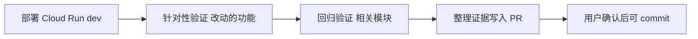

# Deploy 后验证指南（Frontend / Backend）

配合 [`deploy-before-commit.md`](deploy-before-commit.md)：先 **build → push → 部署 dev**，再按本页做**分层验证**，最后在 PR 中贴证据，并请用户确认「可以 commit」。

**原则：** 本地 `lint/test/build` 通过 ≠ dev 环境可用。验证必须针对**已部署的 revision**。

---

## 总流程（AI 自动执行）



| 阶段 | 目的 |
|------|------|
| **针对性验证** | 证明本次改动达到 Linear / OpenSpec 验收标准 |
| **回归验证** | 证明未破坏相邻页面、共享组件或其它 API |
| **证据归档** | PR 模板「测试证据」「部署验证」可复查 |

Agent 在验证完成前 **不得** `git commit` / `git push`（运行时代码）。

---

## 一、前端 UI 改动（`Frontend/` 有代码变更时）

本节适用于 **PR / commit diff 包含 `Frontend/` 运行时代码** 的场景。仅改 `backend/`、`sdk/` 等 **不需要** Chrome DevTools MCP 浏览器验收（走 [第二节](#二后端-api-改动)）。

### 1.1 推荐环境

| 方式 | 适用 |
|------|------|
| **Cloud Run dev**（与线上一致） | 合并前必做（deploy-before-commit） |
| 本地 `make frontend-dev` + 后端 | 开发中快速迭代；**不能替代** dev 部署验证 |

部署前端 dev（在已 build/push 镜像后）：

```bash
USE_EXISTING_IMAGE=true USE_CLOUD_BUILD=false bash deploy/cloudrun/frontend-dev.sh
```

记录 PR 证据：**image tag（git SHA）**、Cloud Run **revision**、服务 URL、验证时间。格式见 [`deploy-before-commit.md`](deploy-before-commit.md#image-tags-and-revision-record)。

### 1.2 验证维度（你提到的三点 + 补充）

#### A. 功能与交互（UX）是否符合预期

- 按 Linear / OpenSpec `tasks.md` 逐条操作（点击、输入、提交、取消、错误提示）。
- 覆盖：**主路径** + **至少 1 条失败路径**（空输入、权限不足、网络错误 mock 等）。
- 检查：文案、loading、禁用态、toast/弹窗、键盘可达性（Tab 焦点是否合理）。

**AI 做法（默认 — Chrome DevTools MCP）：**

1. 打开 dev 前端 URL（需已登录 / dev token 或 IAP，与团队 dev 环境一致）。
2. **导航 → 按 `tasks.md` 操作 → `take_screenshot` → `list_console_messages`**，截图可存 `openspec/changes/<id>/deploy-verify-*.png`。
3. 在 PR 中写清：**操作步骤 → 期望 → 实际**；附 revision 与截图路径。

**MCP 不可用：** 按 [`MCP-POLICY.md`](MCP-POLICY.md) **Chrome DevTools MCP — fallback**（唯一规范）。

#### B. 是否影响其它 UI 组件（回归）

改动集中在某目录时，按**影响面**扩测：

| 改动类型 | 建议回归范围 |
|----------|----------------|
| `components/assets/*` | 资产列表、详情、批量操作、标签相关弹窗 |
| `components/common/*`、layout | 全站顶栏/侧栏、表格、分页、筛选 |
| hooks / API client | 所有调用该 hook 的页面 |
| 全局样式 / theme | 至少 2 个不同模块页面（assets + 另一模块） |

**AI 检查清单：**

- [ ] `git diff` 列出被改组件的 **import 引用方**（ripgrep），每个引用方页面在 dev 上打开一次。
- [ ] 共享组件（Button、Modal、Table）改 props 时，抽查 2–3 个调用点。
- [ ] 无 console 报错（Chrome DevTools → Console；MCP 可读 console 时自动抓）。

自动化兜底（合并前仍建议人工 spot-check）：

```bash
cd Frontend && npm run lint && npm run build && npm run test -- --run
```

Vitest 覆盖到的组件会有单元级保护；**不能**替代跨页交互回归。

**团队固定页面清单**（11 条全站基线 + 按目录缩小范围）：见 [§六、固定回归清单](#六固定回归清单团队基线)。

#### C. 性能

| 检查项 | 做法 |
|--------|------|
| 首屏 / 路由切换 | DevTools Performance 或 Lighthouse（MCP 可辅助）；记录 LCP、长任务 |
| 大列表 / 表格 | 操作是否卡顿；是否多余 re-render（React Profiler） |
| 网络 | Network 面板：重复请求、过大 payload、未取消的轮询 |
| 构建体积 | `npm run build` 后看 chunk 大小是否异常增大 |

**通过标准（dev 环境参考，非硬指标）：**

- 无明显白屏 > 3s（dev 冷启动除外，注明即可）。
- 交互操作响应 < 1s（纯前端逻辑）；慢接口单独说明后端。

### 1.3 Chrome DevTools MCP（改 `Frontend/` 代码时 — Agent 必做）

当且仅当本次改动 **包含 `Frontend/` 路径下的代码** 时：部署 frontend dev 之后，**Agent 必须**用 **Chrome DevTools MCP** 完成 UI 验收（见 [`MCP-POLICY.md`](MCP-POLICY.md)）。**不得**把「请用户在浏览器里点一遍」当作默认交付。

**不适用：** 只改 backend / sdk / docs / CI，未改 `Frontend/` — 跳过本节，无需 MCP 浏览器操作。

Agent 在 dev 上应完成：

- 打开目标 URL（如 `/assets`）
- 按 `tasks.md` / 本次改动执行操作（筛选、点击、提交等）
- 截图存档（`openspec/changes/<CYB-id>-*/deploy-verify-*.png` 或 PR 描述）
- 读取 Console / Network（无新增 error）

**策略：**

- MCP 用于 **只读验证**（导航、截图、性能 trace、console），不用于改生产数据。
- **MCP 不可用：** [`MCP-POLICY.md`](MCP-POLICY.md) **Chrome DevTools MCP — fallback**.

**与 Vitest / Playwright 的分工：** 单元测试与 CI E2E **不能**替代「已部署 revision」上的 MCP 验收。

在 OpenSpec `design.md` 或 PR 中注明：验证环境 URL、账号/IAP 方式、浏览器版本（如有兼容性风险）。

---

## 二、后端 API 改动

### 2.0 Canonical dev API（固定入口 — Agent 必用）

**不要猜 URL。** 部署后验收 backend 时，默认使用 **Cloud Run dev**（`cyber-databrew-backend-dev`），不要用 `api-cyber-databrew-dev.cyberorigin.ai` 除非文档明确写了 Gateway 已切到同一 revision。

| 脚本 | 用途 |
|------|------|
| [`scripts/dev-backend-env.sh`](../../scripts/dev-backend-env.sh) | `source` 后得到 `BASE`、`DATABREW_TOKEN`、`CLOUDRUN_ID_TOKEN`、`API_HDR` |
| [`scripts/apply-migration-dev.sh`](../../scripts/apply-migration-dev.sh) | 对 dev PG 应用 `backend/migrations/*.sql`（GKE 工具 pod，可重复） |
| [`scripts/smoke-customers-dev.sh`](../../scripts/smoke-customers-dev.sh) | CYB-1014 类 customers/delivery 契约 smoke（需 `ASSET_ID`） |
| [`scripts/api-guide-smoke.sh`](../../scripts/api-guide-smoke.sh) | 全站 L2 契约回归（`source dev-backend-env.sh` 后设 `BASE`/`TOKEN`） |

```bash
# 1) 有 schema 变更时：先迁移，再 deploy backend
bash scripts/apply-migration-dev.sh backend/migrations/029_customers.sql

# 2) build / push / deploy（见 deploy-before-commit.md）

# 3) smoke
source scripts/dev-backend-env.sh
echo "BASE=$BASE"
bash scripts/smoke-customers-dev.sh   # 或 api-guide-smoke.sh
```

**顺序：** migration → deploy image → smoke against **new revision**（`gcloud run services describe … --format='value(status.latestReadyRevisionName)'`）。

### 2.1 推荐环境

部署 backend dev（在已 build/push 镜像后）：

```bash
USE_EXISTING_IMAGE=true USE_CLOUD_BUILD=false \
  DB_PASSWORD_SECRET=cyber-databrew-dev-postgres-password \
  bash deploy/cloudrun/backend-dev.sh
```

`BASE` 用 `source scripts/dev-backend-env.sh` 解析，不要手抄 URL。

### 2.2 验证维度

#### A. 本次改动接口（针对性）

- 对照 OpenSpec / api-guide：方法、路径、请求体、状态码、响应字段。
- 至少：**happy path** + **1 个错误 path**（400/404/409 等）。

示例（dev Cloud Run）：

```bash
source scripts/dev-backend-env.sh

# 本次新增/修改的接口（按实际填写）
curl -sfS "${API_HDR[@]}" -d '{"...": "..."}' "$BASE/api/v1/..."
```

#### B. 其它接口回归（你提到的「每次跑完其它接口也要复测」）

按改动**风险分级**，不必每次全量手工 curl 所有接口，但 **CI + 分层 smoke** 要有：

| 层级 | 何时跑 | 命令 / 脚本 |
|------|--------|-------------|
| **L0 必跑** | 任意 backend 改动 | `cd backend && go test ./...`（CI 也会跑） |
| **L1 核心 smoke** | 改动 handler/router/middleware/公共 model | `make smoke-local` 或 `DATABREW_TOKEN=... bash backend/scripts/smoke_actions_api.sh` |
| **L2 契约 smoke** | 改动 API 契约、auth、资产 CRUD、检索 | `BASE=... TOKEN=... bash scripts/api-guide-smoke.sh`（对齐 [`docs/review/api-guide.md`](../review/api-guide.md)） |
| **L3 集群内 smoke** | 改动仅在线上 Gateway/IAP 下才暴露的问题 | `make api-guide-smoke-incluster`（GKE dev） |

**AI 回归策略：**

1. 从 `git diff` 判断 touched packages（如 `internal/handler`、`internal/usecase`）。
2. 若动了 **router 注册 / middleware / auth / 公共 JSON 序列化** → 跑 **L1 + L2**。
3. 若仅动单个 usecase 且测试已覆盖 → 跑 **L0 + 该接口 curl + L1**。
4. 在 PR「测试证据」贴：**命令 + 关键输出**（通过条数、HTTP 码）。

**团队固定 API 清单**（L1 快速 curl + L2 `api-guide-smoke` 端点表 + 按包增量）：见 [§六、固定回归清单](#六固定回归清单团队基线)。

#### C. 数据与副作用

- 迁移脚本：dev 库是否应用成功；回滚路径是否在 `design.md` 写明。
- 写接口：是否产生脏数据；必要时用测试 asset id，避免污染共享数据。
- Outbox / ES 同步：若涉及 `asset_events`，按 [`docs/review/`](../review/README.md) 相关说明做延迟一致性 spot-check（如适用）。

### 2.3 API 契约同步（与 backend 同 PR — 强制）

**新增或修改 HTTP API 时**（不仅限于先改 OpenAPI），必须按 [`AI-RULES.md` § API contract sync](AI-RULES.md#api-contract-sync-mandatory) 逐项完成，不得「先合 handler 再补文档」。

| 必做 | 文件 |
|------|------|
| OpenAPI | `api/openapi.yaml` |
| 人工 curl 文档 | `docs/review/api-guide.md` |
| Dev smoke | `scripts/api-guide-smoke.sh` 或 `scripts/smoke-*-dev.sh` |
| SDK（公开 REST） | `sdk/src/cyber_databrew_sdk/*.py` + `client.py` |
| 行为 spec | `openspec/changes/CYB-*/specs/*/spec.md` |

验证：

- [ ] `cd sdk && uv run ruff check src/ && uv run pytest tests/unit/`（若 SDK 有改动）
- [ ] `source scripts/dev-backend-env.sh` + smoke 脚本 PASS
- [ ] PR 描述列出已更新的契约文件

---

## 三、全栈改动（Frontend + Backend）

1. 先部署 **backend dev**，跑 L0–L2 smoke。
2. 再部署 **frontend dev**（`VITE_API_BASE_URL` 指向 dev 后端）。
3. 浏览器走完整用户路径（Chrome MCP 或人工）。
4. PR 中分别贴 **API 证据** 与 **UI 证据**。

---

## 四、PR 里要写什么（证据模板）

```markdown
## 部署验证

- **环境**: Cloud Run dev
- **Revision**: backend `...` / frontend `...`
- **时间**: 2026-05-19

### 针对性验证
- [ ] CYB-42: BatchDelete 后列表刷新 — 步骤 … — 通过（附 MCP 截图路径）

### 回归
- [ ] 前端固定回归清单（§六）— __/11 通过
- [ ] 后端 L1/L2 固定回归（§六）— PASS
- [ ] Frontend vitest — 通过

### 性能 / Console（前端）
- [ ] 无新增 console error
- [ ] （可选）Lighthouse / Performance 备注

### 未覆盖 / 风险
- （如有）仅测 Chrome；Safari 待用户确认
```

---

## 五、Agent 自动行为摘要

| 改动类型 | 部署 | 针对性验证 | 回归 |
|----------|------|------------|------|
| Frontend UI（diff 含 `Frontend/`） | `frontend-dev.sh` | **Chrome DevTools MCP** 走 tasks + §6 | 引用方页面 + `npm run test` |
| Backend API（diff 含 `backend/` 等，无 `Frontend/`） | `backend-dev.sh` | curl 新接口 | smoke-local + api-guide-smoke；**无 MCP** |
| 全栈 | 两者 | E2E 路径 | 上两者合并 |

验证完成后：

1. 将证据写入 PR 描述。
2. 问用户：**「dev 部署已按上述验证，确认可以 commit 吗？」**
3. 用户肯定答复后，才 `git commit` / `git push`。

---

## 六、固定回归清单（团队基线）

**Agent discipline (before「可以 commit 吗？」):**

- [`verification-before-completion`](skills/verification-before-completion/SKILL.md) — run §6 commands, capture output, then claim pass/fail.
- [`systematic-debugging`](skills/systematic-debugging/SKILL.md) — if verification fails or bug found during deploy test, root cause before patching.

部署 **dev** 后，除「本次改动」的针对性验证外，按改动范围勾选下面清单。Agent 应默认执行对应层级，并在 PR 中勾选完成情况。必读路径见 change 内 `context-files.md`（若有）。

环境变量示例：

```bash
export FRONTEND_DEV_URL="https://<frontend-cloud-run-dev>"
export BASE="https://<backend-cloud-run-dev>"
export TOKEN="<DATABREW_TOKEN>"
export IAP_TOKEN="<若 Gateway/IAP 需要>"
```

---

### 6.1 前端固定页面回归（全站基线）

在 **已部署的 dev 前端** 上逐条打开（Chrome DevTools MCP 或人工）。每条：**能打开、无白屏、Console 无 error、核心区块有数据或合理空态**。

| # | 路径 | 冒烟检查（约 30s/页） |
|---|------|------------------------|
| 1 | `/dashboard` | 仪表盘加载；图表/卡片无报错 |
| 2 | `/assets` | 资产发现：列表/卡片、筛选、分页 |
| 3 | `/assets/:id` | 从列表进入详情：Tabs、元数据、操作区 |
| 4 | `/mcap-files` | MCAP 文件列表 |
| 5 | `/algo` | 算法处理页 |
| 6 | `/deliveries` | 交付列表 |
| 7 | `/deliveries/:id` | 从列表进入交付详情（有数据时） |
| 8 | `/registry` | 注册中心（算法/标签等） |
| 9 | `/metrics` | 指标搜索 |
| 10 | `/events` | 事件流/筛选 |
| 11 | `/settings` | 设置页 |

**按改动范围缩小（不必每次 11 页全跑）：**

| 改动位于 | 至少回归这些路径 |
|----------|------------------|
| `Frontend/src/components/assets/**`、`pages/AssetsPage`、`pages/AssetDetailPage` | **#2、#3** + **#1** + **#8**（标签/注册表常联动） |
| `Frontend/src/components/asset-detail/**` | **#3** + **#2** |
| `Frontend/src/pages/Deliveries*`、`components/deliveries/**` | **#6、#7** + **#2** |
| `Frontend/src/pages/McapFiles*` | **#4** + **#2** |
| `Frontend/src/pages/Algo*` | **#5** + **#2** |
| `Frontend/src/pages/Events*` | **#10** + **#2、#3** |
| `Frontend/src/components/common/**`、`AppLayout`、`hooks/`（全局） | **全表 11 页** |
| `Frontend/src/styles/**`、design tokens | **#1、#2、#3**（再加 #8） |

**共享组件改动时额外做：**

- [ ] 在 #2、#3 各完成一次「主路径操作」（筛选、打开详情、弹窗确认/取消）
- [ ] Console：无新增 `error` / 未捕获 Promise rejection
- [ ] （可选）Performance：列表滚动、打开详情无明显卡顿

---

### 6.2 后端固定 API 回归

#### L1 — 快速基线（**任意** backend 改动后必跑）

约 1–2 分钟。可在 dev 或本地 backend（须与本次部署 revision 一致时优先 **dev**）。

**首选（单一来源，与 api-guide 对齐）：**

```bash
export BASE="https://<backend-dev-url>"
export TOKEN="<DATABREW_TOKEN>"
# 可选: IAP_TOKEN=… 见 scripts/api-guide-smoke.sh 头部注释
bash scripts/api-guide-smoke.sh
# 期望: 末尾 0 failed（WARN 项在 PR 说明）
```

脚本覆盖 healthz、registry、queries/run 等 — **不要**在文档里再维护一份内联 curl JSON body。

**补充（单元测试 / 本地进程）：**

```bash
cd backend && go test ./...
make smoke-local   # 本地 backend；不等同于 dev 全量契约 smoke
```

#### L2 — 标准基线（改动 **handler / router / middleware / 公共 model** 时必跑）

与 [`docs/review/api-guide.md`](../review/api-guide.md) 对齐，跑完整 smoke：

```bash
BASE="$BASE" TOKEN="$TOKEN" IAP_TOKEN="${IAP_TOKEN:-}" bash scripts/api-guide-smoke.sh
```

脚本覆盖的 **固定端点**（PR 中应达到 `0 failed` 或说明 WARN 项）：

| 分组 | 方法 | 路径 |
|------|------|------|
| 健康 | GET | `/healthz` |
| Lakehouse | GET | `/api/v1/lakehouse/status`, `/tables`, `/report`（404 可接受若未部署 MVP） |
| Lakehouse（可选 WARN） | GET | `/training-assets`, `/recompute-candidates`, `/tag-timeline`, `/quality-distribution`, `/customer-replay` |
| 注册表 | GET | `/api/v1/algo-registry`, `/api/v1/tag-registry` |
| 资产/检索 | POST | `/api/v1/queries/run`（structured + keyword） |
| 交付/MCAP | GET | `/api/v1/deliveries`, `/api/v1/mcap-files` |
| 指标 | GET | `/api/v1/metrics/registry` |
| 资产详情 | GET | `/api/v1/assets/{id}`（从 list 解析首条 id） |

Gateway + IAP 场景：

```bash
make api-guide-smoke-incluster
```

#### L3 — 按模块增量（在 L1 基础上追加）

| 改动目录 / 包 | 除 L1 外必跑 |
|---------------|--------------|
| `backend/internal/handler` 或 `router`（全局） | **L2 全量** `api-guide-smoke` |
| `internal/middleware/auth*` | **L2 全量** + 抽 1 条需鉴权与 1 条非法 token（401/403） |
| assets / queries / search | L1 + `queries/run` + `GET /api/v1/assets/{id}` |
| deliveries | L1 + `GET /api/v1/deliveries` + 若有改动则 POST/GET 单条交付 |
| mcap-files | L1 + `GET /api/v1/mcap-files` |
| lakehouse | L1 + `lakehouse/status`, `tables`, `report` |
| algo / tags registry | L1 + 对应 registry GET；若改 start/finish 则 `SEG_ASSET_ID=... smoke_actions_api.sh` |
| outbox / ES 同步 | L2 + 按 review 文档做 PG↔ES spot-check（如适用） |
| `api/openapi.yaml` | **L2 全量** + `cd sdk && uv run pytest tests/unit/` |

**写接口回归（仅当本次 PR 含写接口或 `RUN_WRITES=1` 演练）：**

```bash
RUN_WRITES=1 BASE="$BASE" TOKEN="$TOKEN" bash scripts/api-guide-smoke.sh
```

仅在 dev 环境执行；禁止对 prod 跑写入 smoke。

---

### 6.3 全栈改动：合并清单

| 步骤 | 前端 | 后端 |
|------|------|------|
| 1 | 部署 backend dev | 部署 backend dev |
| 2 | — | L1 →（按需）L2 |
| 3 | 部署 frontend dev（API 指向 dev 后端） | — |
| 4 | §6.1 按模块勾选页面 | — |
| 5 | 针对性 UX 路径（tasks.md） | 针对性 curl 新接口 |
| 6 | Console/性能备注 | PR 贴 smoke 输出 |

---

## 七、相关脚本索引

| 脚本 / 目标 | 用途 |
|-------------|------|
| [`deploy/cloudrun/backend-dev.sh`](../../deploy/cloudrun/backend-dev.sh) | 部署后端 dev |
| [`deploy/cloudrun/frontend-dev.sh`](../../deploy/cloudrun/frontend-dev.sh) | 部署前端 dev |
| [`backend/scripts/smoke_actions_api.sh`](../../backend/scripts/smoke_actions_api.sh) | 轻量 API smoke |
| [`scripts/api-guide-smoke.sh`](../../scripts/api-guide-smoke.sh) | api-guide 对齐 curl 回归 |
| `make api-guide-smoke-incluster` | GKE 内回归（IAP 场景） |
| `cd Frontend && npm run test` | 前端单元/组件测试 |
| `cd backend && go test ./...` | 后端单元测试 |
