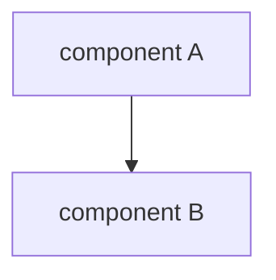

# Page conventions

The wiki follows the **Qoder repo-wiki layout** (the format produced by Qoder's
"repowiki" generator), in **English**, at a **deep level of detail** (target
250–700 lines per page). Every page is a self-contained, citation-and-diagram
heavy reference for one area of the codebase.

## The page template (use for EVERY page)

```markdown
# <Page Title>

<cite>
**Referenced Files in This Document**
- [relative/path/to/file.go](file://relative/path/to/file.go)
- [another/file.tsx](file://another/file.tsx)
</cite>

## Table of Contents
1. [Introduction](#introduction)
2. [Project Structure](#project-structure)
3. [Core Components](#core-components)
4. [Architecture Overview](#architecture-overview)
5. [Detailed Component Analysis](#detailed-component-analysis)
6. [Dependency Analysis](#dependency-analysis)
7. [Performance Considerations](#performance-considerations)
8. [Troubleshooting Guide](#troubleshooting-guide)
9. [Conclusion](#conclusion)
10. [Appendices](#appendices)

## Introduction
<prose: what this area is, why it exists, who uses it>

**Section sources**
- [path/to/file.go](file://path/to/file.go#L1-L52)

## Project Structure
<prose + bullets describing the relevant files/dirs>



**Diagram sources**
- [path/to/file.go](file://path/to/file.go#L36-L140)

**Section sources**
- [path/to/file.go](file://path/to/file.go#L1-L80)

## Core Components
<the main types/handlers/functions, with code-backed description>

## Architecture Overview
<how the pieces fit; almost always a mermaid diagram>

## Detailed Component Analysis
### <Sub-topic 1>
<deep dive; use classDiagram / sequenceDiagram / flowchart as appropriate>

**Diagram sources** / **Section sources** as relevant

### <Sub-topic 2>
...

## Dependency Analysis
<what this area depends on / what depends on it; a mermaid graph LR is common>

## Performance Considerations
<indexes, batching, caching, N+1 risks, pagination, hot paths>

## Troubleshooting Guide
<common failures for THIS area and how to diagnose them>

**Section sources**
- [path](file://path#L1-L40)

## Conclusion
<short wrap-up>

## Appendices
### <e.g. API definitions, enum tables, config keys>
```

## Hard rules for this layout

1. **`<cite>` block is mandatory** and lists every file the page cites, as
   `[relative/path](file://relative/path)`. Keep paths repo-relative.
2. **Citations use `file://` with line ranges**: `[file.go:L36-L140](file://file.go#L36-L140)`.
   - `**Section sources**` goes under each `##` section whose prose draws on code.
   - `**Diagram sources**` goes directly under each mermaid block.
   - **Line ranges must be real.** Open the file, find the actual lines, cite them.
     A fabricated range is a defect. If you cite a whole file, use its real length.
3. **Mermaid everywhere it helps**: `graph TB`/`graph LR` for structure and
   dependencies, `classDiagram` for models/types, `sequenceDiagram` for request
   and event flows, `flowchart TD` for state machines and decision logic,
   `erDiagram` for relational schema.
4. **English**, present tense, reference voice.
5. The standard section skeleton above is the default for every page. A page MAY
   add or rename `### Detailed Component Analysis` subsections to fit its area
   (e.g. an API page adds an "API definitions" appendix; a data-model page uses
   an `erDiagram`). It should NOT drop the core sections.
6. **Ground each page in the real source of truth, not a layer over it.** For a
   database/schema page that means the migration **DDL** (`backend/migrations/*.sql`)
   — tables, PK/FK/CHECK constraints, generated columns, partitions, indexes —
   with ORM/struct code (`internal/models`) cited as the *consumer*, not the
   definition. Lead the `erDiagram` and constraint tables from the actual DDL and
   cite the SQL line ranges. The same principle generalises: cite the artifact
   that defines the behaviour (config schema, proto/IDL, OpenAPI) ahead of code
   that merely reads it.

## The verify-against-code rule (unchanged, and stricter here)

Because pages cite line ranges, you MUST read the real file before writing the
citation. Workflow per page:

1. Read every file in the page's `sources:` (from `manifest.yaml`).
2. Build the `<cite>` block from the files you actually used.
3. Write each section; under it, cite the real lines you drew from.
4. Draw mermaid diagrams from the real types/flows — names and edges must match code.
5. Never invent endpoints, fields, flags, line numbers, or mermaid nodes.

## Scaffolding

`scripts/repo-wiki/scaffold.py` creates any missing page from `manifest.yaml`
with the `<cite>` block (pre-filled from `sources`), the Table of Contents, and
the empty section skeleton. Run it after editing the manifest; then fill each
page following this template. It never overwrites an existing page.

## Anti-patterns

- ❌ Skipping the `<cite>` block or the `**Section sources**` markers.
- ❌ Fabricated line ranges, endpoints, or mermaid nodes.
- ❌ Mermaid that doesn't match the real component names.
- ❌ A 60-line page where the reference would have 400 — this layout is *detailed*.
- ❌ Editing `docs/repo-wiki-site/` or `mkdocs.yml` (both generated).
