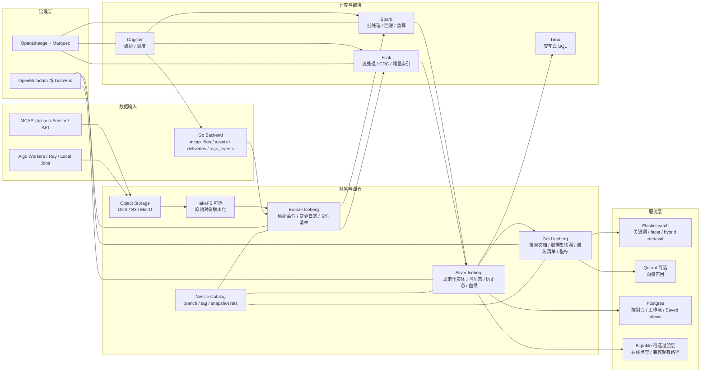

# cyber-databrew 开源湖仓目标架构

## 1. 结论

基于当前仓库的数据模型和你明确提出的能力诉求，`cyber-databrew` 需要一个湖仓作为长期数据底座，但不应该一上来就把现有 `Bigtable / Postgres` 服务层推倒重来。

当前仓库里已经有几个非常清晰的业务实体：

- `mcap_files`：原始 MCAP 文件元数据，对应文件级载体
- `assets`：真正的业务资产，对应 `mcap_file_id + [start_timestamp_ns, end_timestamp_ns]` 的 segment
- `deliveries` / `delivery_items`：交付批次与交付明细
- `asset_algo_events`：算法状态变更事件
- `Dagster`：现阶段的调度与编排骨架

这套模型很适合做湖仓的 `bronze -> silver -> gold` 主线。真正需要补的不是“再造一套业务模型”，而是把当前在线状态模型扩成一套支持以下目标的历史和分析底座：

- 版本化
- 历史回溯
- batch + streaming
- schema evolution
- 治理、血缘、审计
- 大规模重算
- 训练集构建和复现
- 强检索和强数据管理

我的建议是：

- `Bigtable` 保留为过渡期在线状态存储或点查加速层
- `Postgres` 继续承担控制面和事务型元数据
- `Iceberg + Nessie` 成为长期历史真相和可复现数据底座
- `Spark + Flink + Dagster` 承担批流一体加工和重算
- `Elasticsearch` 承担强检索
- `OpenMetadata/DataHub + OpenLineage/Marquez` 承担治理、血缘、审计

如果只回答一句话：你现在不是“要不要 Bigtable”，而是“要不要把 Bigtable 从唯一事实源降级为服务层”。答案是要。

---

## 2. 当前仓库事实与架构约束

以下判断都直接来自当前仓库：

- `backend/internal/models/asset.go`
  - `Asset` 已经是 segment 级业务对象，不是文件对象
  - `Files`、`AlgoResults`、`Tags`、`LifecycleMeta` 已经天然对应湖仓中的宽属性列
- `docs/sql.md`
  - 当前 `assets` 已经区分 `cf:meta`、`cf:algo`、`cf:tag`、`cf:files`
  - 这非常适合在湖仓里拆成规范化明细表和派生宽表
- `docs/review/algo-lifecycle-and-data-model.md`
  - 当前算法生命周期已经有 `pending / blocked / running / ok / failed`
  - 已经具备沉淀成事件流和算法运行历史表的基础
- `docs/archive/research/dagster-integration-guide.md`
  - 当前 Dagster 定位本来就是调度层
  - 后面只需要把它从“调 API”扩成“调 API + 调湖仓作业”
- `docs/archive/frontend/assets-discovery-ux-spec.md`
  - 当前前端目标已经不只是 CRUD 列表，而是检索工作台
  - 这意味着未来的发现与召回不应该依赖 Bigtable 全表扫

当前仓库的强项：

- 在线业务模型已经清晰
- Segment 粒度已经定下来了
- 算法状态机已经在后端落地
- 交付、标签、文件引用、生命周期字段都已经有雏形

当前仓库的缺口：

- `Version` 现在只是乐观锁版本，不是可回放历史版本
- 缺少全量 `asset mutation log`
- 缺少 `asset -> asset` 血缘
- 缺少数据集快照与训练清单模型
- 缺少把检索从业务库抽离出来的搜索投影层
- 缺少用于大规模回灌、重算、训练复现的统一历史表

---

## 3. 需求到能力的映射

| 目标能力 | 推荐承载层 | 核心组件 / 表 |
| --- | --- | --- |
| 版本化 | Lakehouse 元数据层 | `Iceberg snapshots` + `Nessie branches/tags` + `silver_assets_history` |
| 历史回溯 | Bronze / Silver | `bronze_asset_mutations` + `silver_assets_history` |
| batch + streaming | 计算与编排层 | `Spark` + `Flink` + `Dagster` |
| schema evolution | 表格式层 | `Iceberg schema evolution` |
| 治理、血缘、审计 | 治理层 + 事件层 | `OpenMetadata/DataHub` + `OpenLineage/Marquez` + `bronze_asset_algo_events` + `silver_asset_lineage` |
| 大规模重算 | Lakehouse + 编排 | `Spark backfill jobs` + `Nessie branch` + `gold_recompute_batches` |
| 训练集构建 | Gold 层 | `gold_dataset_snapshots` + `gold_dataset_snapshot_items` |
| 训练复现 | Gold + Catalog | `dataset snapshot ref` + `Iceberg snapshot id` + `training_manifest` |
| 强检索 | 搜索服务层 | `gold_asset_search_docs` -> `Elasticsearch`，可选 `Qdrant` |
| 数据管理 | Silver / Gold / Governance | 生命周期字段、血缘、审计、交付、治理目录 |

---

## 4. 推荐技术选型

### 4.1 首选方案

`Iceberg + Nessie + Spark + Flink + Trino + Dagster + Elasticsearch + OpenMetadata + OpenLineage/Marquez`

这是最贴近你当前仓库和未来需求的一套开源方案。

原因很简单：

- 你不是纯日志平台，也不是纯 OLTP 平台
- 你要处理的是 `raw MCAP -> segment asset -> algo outputs -> delivery -> dataset snapshot -> training manifest`
- 你既要在线业务 API，也要历史回溯、重算、训练复现
- 你未来很可能会跨引擎访问同一份资产数据

`Iceberg` 比较适合你现在的原因：

- 对 schema evolution、partition evolution 友好
- 对大表扫描、批量回灌、训练集导出更自然
- 和 `Spark / Flink / Trino` 兼容性好
- 对“segment 资产 + 宽属性 + 历史快照”这个模型适配度高

`Nessie` 比较适合你现在的原因：

- 你明确需要版本化、训练集复现、大规模重算
- dataset snapshot、recompute branch、实验分支都能映射到 catalog branch/tag
- 它解决的是“表级版本线”的问题，不是单纯对象版本

### 4.2 备选方案

| 方案 | 适用前提 | 不足 |
| --- | --- | --- |
| `Hudi + Spark/Flink` | 如果你后面最重的是 CDC 和高频 upsert | 对多引擎分析和训练复现心智不如 `Iceberg + Nessie` 清晰 |
| `Delta Lake OSS + Spark` | 如果团队极度 Spark-only | 开源 catalog/branching 组合不如 `Iceberg + Nessie` 自由 |
| `lakeFS + Parquet` | 如果你只想先做对象版本管理 | 这不是完整湖仓，无法替代表格式、治理和查询层 |

结论仍然是：你的主线更适合 `Iceberg`。

---

## 5. 目标架构图

### 5.1 这张图在当前仓库里的含义

- `Backend` 继续承担在线 API 和业务校验
- `Dagster` 从当前“算法调度骨架”升级为“湖仓作业编排器”
- `Bronze` 不直接给业务读，它是不可变事实层
- `Silver` 对应你的业务语义主表，是数据管理核心
- `Gold` 对应搜索、训练、交付和复现
- `Search` 负责资产发现，不让前台检索直接扫 Bigtable

---

## 6. 组件清单

### 6.1 核心必选组件

| 组件 | 选型 | 作用 | 是否必选 | 与当前仓库的关系 |
| --- | --- | --- | --- | --- |
| 对象存储 | `GCS / S3 / MinIO` | 存原始 MCAP、派生产物、缩略图、数据集导出 | 是 | 当前 `Files`、`raw_mcap`、`output_uri` 已经在用对象 URI |
| 表格式 | `Apache Iceberg` | 事实层、历史层、数据集层 | 是 | 承接 `mcap_files/assets/deliveries/algo_events` |
| Catalog | `Project Nessie` | 分支、Tag、时间点复现 | 强烈建议 | 解决训练集复现和大规模重算 |
| 批处理 | `Spark` | 回灌、重算、训练集构建、宽表加工 | 是 | 承接 Dagster 批作业 |
| 流处理 | `Flink` | CDC、增量索引、近实时同步 | 分阶段必选 | 用于增量搜索索引、事件投影 |
| 交互查询 | `Trino` | SQL 分析、运营查询、临时回溯 | 强烈建议 | 替代直接查线上库做分析 |
| 编排 | `Dagster` | 任务调度、依赖编排、回灌编排 | 是 | 当前仓库已有骨架 |
| 搜索 | `Elasticsearch` | facet、关键词、过滤、排序、混合召回 | 是 | 对应 `assets-discovery` 工作台 |
| 治理目录 | `OpenMetadata` 或 `DataHub` | 资产目录、owner、schema、数据集说明 | 强烈建议 | 把 segment/dataset/delivery 变成可治理资产 |
| 血缘审计 | `OpenLineage + Marquez` | 作业和表级血缘、运行审计 | 强烈建议 | 结合 Dagster/Spark/Flink |

### 6.2 可选增强组件

| 组件 | 选型 | 作用 | 什么时候加 |
| --- | --- | --- | --- |
| 对象版本层 | `lakeFS` | 原始 MCAP、导出包、预览文件版本化 | 当你开始频繁重导出、回滚对象内容时 |
| 向量检索 | `Qdrant` | 语义检索、相似 segment 召回 | 当你要做 embedding 检索时 |
| Serving Cache | `Bigtable` | 超大规模点查、宽行状态缓存 | 当线上写入/点查 QPS 明显高于 PG 可承载时 |

### 6.3 Bigtable 和 Postgres 的最终定位

| 系统 | 长期定位 | 不应该承担的职责 |
| --- | --- | --- |
| `Postgres` | 控制面、事务型工作流、幂等、Saved Views、轻量 serving | 长期海量历史回放、大规模训练集扫描 |
| `Bigtable` | 过渡期在线状态表、热点点查、宽行状态缓存 | 历史真相、检索、训练复现、治理主库 |
| `Lakehouse` | 历史真相、批流加工、训练集、治理、重算 | 高频交互式 OLTP 更新 |

---

## 7. 表分层设计

### 7.1 统一命名原则

- `bronze_*`：不可变、追加写、原始事实
- `silver_*`：规范化实体、当前态、历史态、明细态
- `gold_*`：面向搜索、交付、训练、指标的消费层

对 segment 资产，建议新增一个稳定标识：

`segment_locator = sha1(mcap_file_id + ":" + start_timestamp_ns + ":" + end_timestamp_ns)`

它不替代 `asset_id`，但解决三类问题：

- 原始 segment 是否同一片段
- 不同重跑或重建任务如何稳定对齐
- dataset snapshot 如何跨系统引用同一逻辑样本

`asset_id` 继续作为在线业务主键，`segment_locator` 作为湖仓与训练侧的稳定逻辑键。

---

### 7.2 Bronze 层

Bronze 的核心原则只有一条：只追加，不覆盖。

### 7.2.1 `bronze_mcap_file_events`

| 项 | 设计 |
| --- | --- |
| 粒度 | 1 行 = 1 次 `mcap_file` 创建或状态变更事件 |
| 来源 | Backend `mcap_files` 写入、对象存储 finalize 事件 |
| 主键 | `event_id` |
| 关键字段 | `mcap_file_id`, `event_type`, `mcap_uri`, `size_bytes`, `raw_hash_md5`, `ingest_state`, `process_state_json`, `event_time`, `source_system` |
| 用途 | 回放文件入湖过程、恢复 `silver_mcap_files_*` |

### 7.2.2 `bronze_asset_mutations`

这是最关键的一张表。

| 项 | 设计 |
| --- | --- |
| 粒度 | 1 行 = 1 次 asset 业务变更 |
| 来源 | `assets.create / update / delete / commitSegments / mergeCfAlgo / delivery summary update` |
| 主键 | `mutation_id` |
| 关键字段 | `asset_id`, `segment_locator`, `mcap_file_id`, `op_type`, `asset_version`, `meta_json`, `tags_json`, `algo_json`, `files_json`, `lifecycle_json`, `event_time`, `actor`, `source_backend` |
| 用途 | 历史回放、审计、重算输入、构建 `silver_assets_history` |

建议在当前后端加一个统一的 mutation outbox，把每次业务变更以 append-only 方式落到对象存储或消息流，再由流批作业入 Bronze。

### 7.2.3 `bronze_asset_algo_events`

| 项 | 设计 |
| --- | --- |
| 粒度 | 1 行 = 1 次算法状态跃迁 |
| 来源 | 当前 `asset_algo_events` |
| 主键 | `event_id` |
| 关键字段 | `asset_id`, `algo_key`, `prev_status`, `new_status`, `run_id`, `reason`, `created_at` |
| 用途 | 算法审计、失败分析、构建 `silver_asset_algo_runs` |

### 7.2.4 `bronze_delivery_events`

| 项 | 设计 |
| --- | --- |
| 粒度 | 1 行 = 1 次 delivery 状态或元数据变更 |
| 来源 | `deliveries` API |
| 主键 | `event_id` |
| 关键字段 | `delivery_id`, `event_type`, `customer_id`, `status`, `manifest_uri`, `payload_json`, `event_time` |
| 用途 | 交付历史、客户审计、召回追踪 |

### 7.2.5 `bronze_delivery_item_events`

| 项 | 设计 |
| --- | --- |
| 粒度 | 1 行 = 1 个 `delivery_id + asset_id` 关系变化 |
| 来源 | `delivery_items` |
| 主键 | `event_id` |
| 关键字段 | `delivery_id`, `asset_id`, `event_type`, `event_time` |
| 用途 | 回放某次交付到底包含哪些 segment |

### 7.2.6 `bronze_object_inventory`

| 项 | 设计 |
| --- | --- |
| 粒度 | 1 行 = 1 个对象文件清单记录 |
| 来源 | 对象存储 inventory / 生命周期扫描 |
| 主键 | `object_uri` + `inventory_date` |
| 关键字段 | `object_uri`, `bucket`, `prefix`, `size_bytes`, `etag`, `storage_class`, `last_modified_at`, `inventory_date` |
| 用途 | 存储治理、对象存在性校验、成本分析 |

---

### 7.3 Silver 层

Silver 负责把 Bronze 的原始事实整理成“能被业务和训练稳定理解”的表。

### 7.3.1 `silver_mcap_files_current`

| 项 | 设计 |
| --- | --- |
| 粒度 | 1 行 = 1 个当前生效的 MCAP 文件 |
| 主键 | `mcap_file_id` |
| 关键字段 | `mcap_file_id`, `mcap_uri`, `raw_hash_md5`, `size_bytes`, `ingest_state`, `channel_count`, `chunk_count`, `owner`, `created_at`, `updated_at` |
| 说明 | 对应当前 `models.McapFile` 的当前态 |

### 7.3.2 `silver_mcap_files_history`

| 项 | 设计 |
| --- | --- |
| 粒度 | 1 行 = 1 个 MCAP 文件在一个时间区间内的有效状态 |
| 主键 | `mcap_file_id + version_no` |
| 关键字段 | `mcap_file_id`, `version_no`, `valid_from`, `valid_to`, `state_json`, `source_event_id` |
| 说明 | 用于时间点回放和审计 |

### 7.3.3 `silver_assets_current`

这是 segment 主表，是 Silver 最重要的一张。

| 项 | 设计 |
| --- | --- |
| 粒度 | 1 行 = 1 个当前生效的 segment asset |
| 主键 | `asset_id` |
| 稳定逻辑键 | `segment_locator` |
| 关键字段 | `asset_id`, `segment_locator`, `mcap_file_id`, `start_timestamp_ns`, `end_timestamp_ns`, `duration_sec`, `status`, `owner`, `reviewer`, `seg_type`, `env`, `task`, `delivery_count`, `last_delivered_at`, `last_delivered_to`, `retention_tier`, `archive_after_days`, `delete_after_days`, `total_size_bytes`, `created_at`, `updated_at`, `current_version` |
| 说明 | 对应当前 `models.Asset` 的业务宽表 |

推荐的附加字段：

- `raw_mcap_uri`
- `preview_manifest_uri`
- `thumbnail_uri`
- `algo_summary_json`
- `tag_count`
- `has_failed_algo`
- `latest_dataset_refs`

### 7.3.4 `silver_assets_history`

这是历史回溯的核心表。

| 项 | 设计 |
| --- | --- |
| 粒度 | 1 行 = 1 个 asset 的一个历史版本 |
| 主键 | `asset_id + version_no` |
| 关键字段 | `asset_id`, `segment_locator`, `version_no`, `change_type`, `valid_from`, `valid_to`, `state_json`, `source_mutation_id`, `snapshot_ref` |
| 说明 | 支持“任意时刻看到 asset 当时长什么样” |

这里建议直接保留 `state_json`，不要过早把每次历史版本都完全扁平化。原因是：

- 你现在 schema 还在快速演进
- 历史回放比列式分析更重要
- `Iceberg + state_json + 必要索引字段` 的组合比强制全列化更稳

### 7.3.5 `silver_asset_tags`

| 项 | 设计 |
| --- | --- |
| 粒度 | 1 行 = 1 个 asset 的 1 个 tag |
| 主键 | `asset_id + tag_key` |
| 关键字段 | `asset_id`, `segment_locator`, `tag_key`, `tag_value`, `updated_at` |
| 说明 | 支持 facet、统计和 tag 治理 |

### 7.3.6 `silver_asset_files`

| 项 | 设计 |
| --- | --- |
| 粒度 | 1 行 = 1 个 asset 关联的 1 个逻辑文件 |
| 主键 | `asset_id + logical_name` |
| 关键字段 | `asset_id`, `segment_locator`, `logical_name`, `uri`, `file_type`, `size_bytes`, `checksum`, `produced_by_algo_key`, `produced_at` |
| 说明 | 对应当前 `Files` map 的规范化拆表 |

推荐逻辑名沿用当前仓库习惯：

- `raw_mcap`
- `<algo>@<version>`
- `thumbnail`
- `preview_manifest`
- `delivery_manifest`

### 7.3.7 `silver_asset_algo_latest`

| 项 | 设计 |
| --- | --- |
| 粒度 | 1 行 = 1 个 asset 上 1 个 algo_key 的当前状态 |
| 主键 | `asset_id + algo_key` |
| 关键字段 | `asset_id`, `segment_locator`, `algo_key`, `status`, `run_id`, `method`, `output_uri`, `reason`, `started_at`, `finished_at`, `result_size_bytes`, `extra_fields_json` |
| 说明 | 对应当前 `AlgoResults` 的规范化当前态 |

### 7.3.8 `silver_asset_algo_runs`

| 项 | 设计 |
| --- | --- |
| 粒度 | 1 行 = 1 次算法运行 |
| 主键 | `asset_id + algo_key + run_id` |
| 关键字段 | `asset_id`, `algo_key`, `run_id`, `status`, `started_at`, `finished_at`, `duration_ms`, `reason`, `method`, `output_uri` |
| 说明 | 用于失败率、耗时、回放、重试分析 |

### 7.3.9 `silver_deliveries`

| 项 | 设计 |
| --- | --- |
| 粒度 | 1 行 = 1 个交付批次当前态 |
| 主键 | `delivery_id` |
| 关键字段 | `delivery_id`, `customer_id`, `contract_id`, `status`, `delivered_at`, `accepted_at`, `rejected_at`, `recalled_at`, `manifest_uri`, `asset_count`, `total_size_bytes`, `owner`, `created_at`, `updated_at` |
| 说明 | 对应当前 `Delivery` 模型 |

### 7.3.10 `silver_delivery_items`

| 项 | 设计 |
| --- | --- |
| 粒度 | 1 行 = 1 个交付批次包含的 1 个 asset |
| 主键 | `delivery_id + asset_id` |
| 关键字段 | `delivery_id`, `asset_id`, `segment_locator`, `customer_id`, `delivered_at` |
| 说明 | 支持“这个客户收到过哪些 segment” |

### 7.3.11 `silver_asset_lineage`

这是你后面一定会需要的表。

| 项 | 设计 |
| --- | --- |
| 粒度 | 1 行 = 1 条 asset 到 asset 的血缘边 |
| 主键 | `source_asset_id + target_asset_id + relation_type` |
| 关键字段 | `source_asset_id`, `target_asset_id`, `relation_type`, `algo_key`, `created_at`, `lineage_meta_json` |
| 说明 | 支持 split / merge / trim / deface / derived dataset 追溯 |

`relation_type` 建议至少支持：

- `derived_from`
- `split_from`
- `merged_from`
- `preview_of`
- `training_sample_of`

---

### 7.4 Gold 层

Gold 不是事实源，而是给搜索、训练、交付、报表直接消费的层。

### 7.4.1 `gold_asset_search_docs`

这是检索最关键的一张表。

| 项 | 设计 |
| --- | --- |
| 粒度 | 1 行 = 1 个可检索的 asset 文档 |
| 主键 | `asset_id` |
| 关键字段 | `asset_id`, `segment_locator`, `title`, `search_text`, `owner`, `reviewer`, `status`, `env`, `task`, `seg_type`, `tag_json`, `algo_status_summary_json`, `delivery_flags_json`, `thumbnail_uri`, `preview_manifest_uri`, `raw_mcap_uri`, `created_at`, `updated_at` |
| 去向 | 同步到 `Elasticsearch` |

这里的关键原则：

- `gold_asset_search_docs` 是搜索投影，不是事实主表
- 任何搜索优化都优先做在这张表和 Elasticsearch mapping 上
- 不要把高级检索压回 Bigtable 或 Postgres 事务表

### 7.4.2 `gold_asset_embeddings`

| 项 | 设计 |
| --- | --- |
| 粒度 | 1 行 = 1 个 asset 的 1 套 embedding |
| 主键 | `asset_id + embedding_model + embedding_version + embedding_source` |
| 关键字段 | `asset_id`, `embedding_source`, `embedding_model`, `embedding_version`, `vector_uri`, `summary_text`, `generated_at` |
| 去向 | 同步到 `Qdrant` 或 `Elasticsearch Vector` |

`embedding_source` 可以是：

- `caption`
- `preview_frames`
- `algo_summary`
- `manual_description`

### 7.4.3 `gold_dataset_snapshots`

这是训练复现的核心抽象。

| 项 | 设计 |
| --- | --- |
| 粒度 | 1 行 = 1 个冻结数据集快照 |
| 主键 | `dataset_snapshot_id` |
| 关键字段 | `dataset_snapshot_id`, `dataset_name`, `dataset_version`, `selection_spec_json`, `source_branch`, `source_tag`, `source_snapshot_refs_json`, `created_by`, `created_at`, `feature_contract_version`, `export_uri`, `row_count` |
| 说明 | 记录“这个训练集到底从哪份资产状态选出来的” |

### 7.4.4 `gold_dataset_snapshot_items`

| 项 | 设计 |
| --- | --- |
| 粒度 | 1 行 = 1 个数据集快照里的 1 个样本 |
| 主键 | `dataset_snapshot_id + asset_id` |
| 关键字段 | `dataset_snapshot_id`, `asset_id`, `segment_locator`, `split`, `label_version`, `sample_weight`, `export_file_uri`, `manifest_row_num` |
| 说明 | 记录快照包含哪些 segment，以及如何被切分为 train/val/test |

### 7.4.5 `gold_training_manifests`

| 项 | 设计 |
| --- | --- |
| 粒度 | 1 行 = 1 次训练输入清单 |
| 主键 | `training_manifest_id` |
| 关键字段 | `training_manifest_id`, `dataset_snapshot_id`, `framework`, `format`, `code_ref`, `hyperparams_hash`, `export_uri`, `created_at` |
| 说明 | 解决“同一份训练到底用了哪份数据和哪版代码” |

### 7.4.6 `gold_recompute_batches`

| 项 | 设计 |
| --- | --- |
| 粒度 | 1 行 = 1 次大规模重算批次 |
| 主键 | `recompute_batch_id` |
| 关键字段 | `recompute_batch_id`, `algo_key`, `selection_spec_json`, `input_branch`, `input_snapshot_ref`, `status`, `created_by`, `created_at` |
| 说明 | 记录一次 backfill/recompute 的输入范围和状态 |

### 7.4.7 `gold_asset_quality_daily`

| 项 | 设计 |
| --- | --- |
| 粒度 | 1 行 = 1 天 x 1 维度聚合 |
| 主键 | `stat_date + dim_key + dim_value` |
| 关键字段 | `stat_date`, `dim_key`, `dim_value`, `asset_count`, `failed_algo_count`, `delivered_count`, `avg_duration_sec`, `total_size_bytes` |
| 说明 | 支撑运营与质量看板 |

---

### 7.5 分区、分桶与排序建议

表分层如果只有名字，没有物理布局建议，后面很容易退化成“大 Parquet 仓库”。

建议如下：

| 表 | 分区建议 | 排序建议 | 说明 |
| --- | --- | --- | --- |
| `bronze_mcap_file_events` | `days(event_time)` | `mcap_file_id, event_time` | 文件状态回放 |
| `bronze_asset_mutations` | `days(event_time)` + `bucket(64, asset_id)` | `asset_id, asset_version` | asset 历史回放和增量摄取 |
| `bronze_asset_algo_events` | `days(created_at)` + `bucket(64, asset_id)` | `algo_key, created_at` | 算法失败分析 |
| `silver_assets_current` | 优先少分区；大规模时用 `bucket(64, mcap_file_id)` | `mcap_file_id, start_timestamp_ns` | segment 常按源文件和时间范围查询 |
| `silver_assets_history` | `days(valid_from)` + `bucket(64, asset_id)` | `asset_id, version_no` | 资产版本回放 |
| `silver_asset_algo_runs` | `days(started_at)` + `bucket(32, algo_key)` | `algo_key, started_at` | 算法运行统计 |
| `silver_delivery_items` | `days(delivered_at)` | `customer_id, delivery_id, asset_id` | 客户交付追溯 |
| `gold_dataset_snapshot_items` | `dataset_snapshot_id` | `split, asset_id` | 训练集导出与复现 |

补充原则：

- 不要按 `owner`、`env`、`task`、`tag_value` 这种高基数业务字段直接分区
- `silver_assets_current` 优先靠排序和隐藏分区，不要把分区做得过细
- `gold_dataset_snapshot_items` 可以接受按 `dataset_snapshot_id` 分区，因为查询模式天然按快照读取

---

## 8. 检索侧设计

如果你的目标是“检索能力很强”，那必须把检索拆成三层，不要只盯数据库。

### 8.1 元数据过滤检索

由 `Elasticsearch` 负责。

主要字段来自 `gold_asset_search_docs`：

- `asset_id`
- `mcap_file_id`
- `segment_locator`
- `owner`
- `reviewer`
- `status`
- `env`
- `task`
- `seg_type`
- `tag.*`
- `algo_status_summary.*`
- `delivery_flags.*`
- `created_at`
- `updated_at`

字段白名单建议直接对齐当前后端的 `backend/internal/filter/assets_fields.go`，也就是先保证这些字段一定能在搜索侧被 filter 和 sort：

- 标量字段：`asset_id`, `mcap_file_id`, `status`, `start_timestamp_ns`, `end_timestamp_ns`, `duration_sec`, `owner`, `reviewer`, `type`, `env`, `task`
- 生命周期字段：`retention_tier`, `archive_after_days`, `delete_after_days`, `total_size_bytes`, `last_accessed_at`
- 动态字段：`tag.*`, `algo.*`, `files.*`

适用场景：

- facet filtering
- keyword match
- prefix search
- range filter
- 排序分页

### 8.2 语义检索

由 `gold_asset_embeddings` + `Qdrant` 或 `Elasticsearch Vector` 负责。

适用场景：

- 找相似 segment
- 通过自然语言描述找资产
- 基于 caption / algo summary / preview frames 做召回

### 8.3 混合检索

最终查询建议是：

- 先在 `Elasticsearch` 做结构化过滤
- 再在向量库做相似召回
- 最后做重排

这比直接把语义检索堆到业务主库上靠谱得多。

---

## 9. 为什么不是直接把所有东西继续堆在 Bigtable

继续只用 Bigtable 的问题不是“能不能存”，而是“能不能治理和复现”。

Bigtable 适合的事情：

- 高并发点查
- 宽行状态存储
- 在线热点访问

Bigtable 不适合单独承担的事情：

- 时间点历史回放
- 训练集冻结和复现
- 多引擎分析
- 强治理目录
- 大规模回灌
- 搜索和检索投影

如果你所有资产信息都继续只放在 Bigtable：

- 历史版本会很痛苦
- 大规模训练集抽取会变成服务层压力
- 搜索会逐渐演化成索引拼接地狱
- 审计和 lineage 会不断补洞

---

## 10. 分阶段落地建议

### Phase 1：先补不可变事实层

目标：

- 不改业务模型
- 先让历史开始积累

建议动作：

- 在 Backend 写路径上增加 `asset mutation outbox`
- 对现有 `Bigtable / Postgres` 做一次 bootstrap 导出，生成初始 Bronze 快照
- 把 `mcap_files`、`assets`、`deliveries`、`asset_algo_events` 统一落到 Bronze
- 为 segment 生成 `segment_locator`

### Phase 2：建立 Silver 主表和搜索投影

目标：

- 把当前在线模型复制成规范化湖仓表
- 把检索从线上库剥离

建议动作：

- 建 `silver_assets_current/history`
- 建 `silver_asset_tags/files/algo_latest/algo_runs`
- 建 `gold_asset_search_docs`
- 建 `Elasticsearch` 索引同步链路

### Phase 3：建立 dataset snapshot 与训练复现

目标：

- 支持稳定导出训练集
- 支持精确复现

建议动作：

- 建 `gold_dataset_snapshots`
- 建 `gold_dataset_snapshot_items`
- 建 `gold_training_manifests`
- 在导出任务里记录 `Nessie tag / Iceberg snapshot refs`

### Phase 4：补齐 lineage、治理和大规模重算

目标：

- 让平台具备真正的数据管理能力

建议动作：

- 建 `silver_asset_lineage`
- 接入 `OpenMetadata/DataHub`
- 接入 `OpenLineage/Marquez`
- 建 `gold_recompute_batches`

---

## 11. 最小可落地版本

如果你不想第一阶段就引入太多组件，最小闭环可以是：

- `Object Storage`
- `Iceberg`
- `Nessie`
- `Spark`
- `Dagster`
- `Elasticsearch`
- `Postgres`

这个版本已经能解决：

- 历史版本沉淀
- 搜索投影
- 数据集快照
- 大批量重算

第二阶段再加：

- `Flink`
- `OpenMetadata/DataHub`
- `OpenLineage/Marquez`
- `Qdrant`
- `lakeFS`

---

## 12. 对当前仓库的直接落地映射

| 当前仓库对象 | 湖仓目标对象 |
| --- | --- |
| `mcap_files` | `silver_mcap_files_current/history` |
| `assets` | `silver_assets_current/history` |
| `asset.Tags` | `silver_asset_tags` |
| `asset.Files` | `silver_asset_files` |
| `asset.AlgoResults` | `silver_asset_algo_latest` |
| `asset_algo_events` | `bronze_asset_algo_events` -> `silver_asset_algo_runs` |
| `deliveries` | `silver_deliveries` |
| `delivery_items` | `silver_delivery_items` |
| `Dagster sensor/job` | `Bronze/Silver/Gold` 编排和重算入口 |
| `Assets Discovery` | `gold_asset_search_docs` + `Elasticsearch` |

---

## 13. 最终判断

结合当前仓库，你需要的不是“一个更大的在线库”，而是“一套把在线状态、历史事实、搜索投影、训练快照分层处理的数据架构”。

对于 `cyber-databrew`，最合理的开源目标形态是：

- 服务层保留 `Backend + Postgres`
- 在线热点或过渡兼容层保留 `Bigtable`
- 历史和分析底座切到 `Iceberg + Nessie`
- 检索切到 `Elasticsearch`
- 编排统一到 `Dagster`
- 批流加工用 `Spark + Flink`
- 治理补上 `OpenMetadata/DataHub + OpenLineage/Marquez`

这套架构和你现在仓库里的 `mcap_files / assets / deliveries / algo_events / Dagster` 是顺接关系，不是重做关系。
