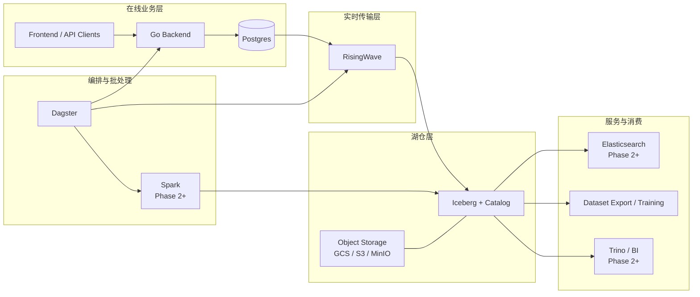

# Databricks4robot 当前阶段推荐架构

## 1. 结论

当前阶段，推荐你先落这套组合：

- `Postgres`：在线业务主库
- `RisingWave`：`Postgres -> Iceberg` 的实时传输和实时变换组件
- `Iceberg`：湖仓主存储，承接历史、回放、训练集、重算、检索投影
- `Dagster`：编排层
- `Spark`：暂不作为第一阶段必选组件，但为后续大规模 backfill / recompute / dataset export 预留

不建议当前阶段把 `Bigtable` 放进主链路。

原因不是 Bigtable 不能用，而是你当前仓库更需要：

- 快速迭代业务模型
- 保留完整事务能力
- 支持灵活查询和后台任务
- 尽快把历史与训练数据沉到湖仓

在这个阶段，`Postgres + RisingWave + Iceberg` 的复杂度和收益比更合适。

---

## 2. 为什么是这套，而不是别的

### 2.1 为什么先用 Postgres

你当前仓库里的后端已经原生支持 `postgres` 存储后端：

- `backend/cmd/server/main.go`

这意味着：

- 不需要先为业务开发引入 `Bigtable` 的运维复杂度
- 可以直接利用关系型事务、索引、约束、幂等表、后台任务表
- 更适合当前 `assets / mcap_files / deliveries / algo_events` 这种控制面 + 在线状态模型

### 2.2 为什么加 RisingWave

`RisingWave` 在这套架构里只做一件事：

**把 `Postgres` 的变更持续、实时地送进 `Iceberg`。**

它的价值在于：

- 原生支持 `PostgreSQL CDC`
- CDC 表必须定义主键，适合 current-state 表同步
- 可以在 CDC 表之上建 `TABLE / MATERIALIZED VIEW`
- 可以把结果持续 sink 到 `Iceberg`
- `Iceberg` sink 支持 `append-only` 和 `upsert`
- `Iceberg` sink 支持 exactly-once，但依赖 sink decoupling

所以它非常适合当：

- 传输组件
- 实时宽表构建组件
- `Bronze -> 轻量 Silver` 实时同步组件

它不适合当：

- 业务主库
- API 后端
- 大规模历史重算引擎
- 训练集导出主引擎

### 2.3 为什么当前不把 Bigtable 放进来

Bigtable 的强项是：

- 已知 row key 的低延迟点查
- 单行宽表状态写入
- 高吞吐 current-state serving

但你当前仓库最缺的不是“超大规模在线热点表”，而是：

- 一个简单稳定的业务主库
- 一条稳定的 CDC 入湖链路
- 一套能支撑训练集、重算、历史回放的湖仓

更重要的是，你当前仓库里的 Bigtable 查询能力还不够成熟：

- `README.md` 明确写了 `ListWithFilters Bigtable 性能优化（当前全表扫描）`

所以现在直接上 Bigtable，会让系统复杂度先上去，但核心收益未必立刻兑现。

---

## 3. 当前仓库的映射关系

### 3.1 后端

当前后端已经有双存储后端切换能力：

- `backend/cmd/server/main.go`

其中 `postgres` 分支已经接通：

- `AssetRepo`
- `AlgoEventRepo`
- `DeliveryRepo`
- `McapFileRepo`
- `IdempotencyRepo`

这说明第一阶段完全可以基于 `Postgres` 往下推进，而不需要先把 `Bigtable` 做成主路径。

### 3.2 Dagster

当前仓库已经有 `Dagster` 骨架：

- `dagster/README.md`
- `dagster/definitions.py`
- `dagster/jobs/`
- `dagster/assets/`
- `dagster/sensors/`

它现在更适合作为：

- ingest / export / backfill 的编排器
- 数据集快照与训练集导出的 job 管理器
- 后续触发 `Spark` 作业和维护作业的调度层

不建议把 `Dagster` 当 CDC 传输组件。

---

## 4. 目标架构图

---

## 5. 组件职责

### 5.1 Postgres

`Postgres` 是当前阶段的在线业务真相。

负责：

- `assets` 当前态
- `mcap_files` 当前态
- `deliveries / delivery_items`
- `asset_algo_events`
- `idempotency`
- 后台 job 状态
- saved views / 权限 / 配置 / 审计入口

不负责：

- 训练集冻结
- 大规模历史回放扫描
- 海量分析
- 搜索投影

### 5.2 RisingWave

`RisingWave` 是传输组件，不是主数据库。

负责：

- 读 `Postgres WAL`
- 把 `INSERT / UPDATE / DELETE` 实时 materialize 到 RisingWave table
- 在 CDC current-state 之上构建实时 `MV`
- sink 到 `Iceberg`

不负责：

- 代替 Go Backend
- 代替业务事务
- 代替 Dagster
- 代替 Spark 大规模回灌

### 5.3 Iceberg

`Iceberg` 是长期历史与数据集主存储。

负责：

- append-only 历史层
- current-state 宽表副本
- time travel
- schema evolution
- dataset snapshot
- dataset export manifest
- 训练复现
- 重算输入基线

不负责：

- 高频在线单行 patch
- 前端交互式事务写入

### 5.4 Dagster

`Dagster` 是调度层。

负责：

- ingest 编排
- export 编排
- backfill / recompute 作业编排
- 维护作业调度
- 搜索索引刷新任务

不负责：

- CDC 主传输
- 长时间驻留的 streaming 同步

### 5.5 Spark

`Spark` 是第二阶段引入的大规模批计算引擎。

负责：

- 从 `Iceberg` 大规模构建训练集
- 历史回灌
- 重算
- 特征归并
- 大表整理、rewrite、compaction 辅助

---

## 6. 数据流设计

### 6.1 在线写路径

1. `Frontend / SDK` 调用 `Go Backend`
2. `Backend` 把业务当前态写入 `Postgres`
3. `Backend` 可选写入一张 `asset_mutation_outbox`
4. `RisingWave` 从 `Postgres WAL` 持续读取变更
5. `RisingWave` 把变更写到 `Iceberg`

原则：

- API 成功与否，以 `Postgres` 提交为准
- 不要求 API 同步等待 Iceberg 完成
- `Iceberg` 是异步但持续的历史/分析层

### 6.2 入湖路径

建议拆成两条：

### A. current-state 路径

来源：

- `assets`
- `mcap_files`
- `deliveries`

形态：

- `Postgres CDC -> RisingWave Table -> RisingWave MV -> Iceberg upsert sink`

用途：

- 构建 `silver_*_current`

### B. 事件/历史路径

来源：

- `asset_algo_events`
- `asset_mutation_outbox`
- `delivery_events`

形态：

- `Postgres CDC -> RisingWave Table -> Iceberg append-only sink`

用途：

- 构建 `bronze_*`

---

## 7. 推荐的表分层

### 7.1 Postgres 在线表

建议保留以下在线表：

- `assets`
- `mcap_files`
- `deliveries`
- `delivery_items`
- `asset_algo_events`
- `idempotency_keys`
- `asset_mutation_outbox`

其中最关键的是：

- `assets`：业务当前态
- `asset_algo_events`：算法状态事件
- `asset_mutation_outbox`：应用级语义变更事件

### 7.2 Iceberg Bronze

建议先建：

- `bronze_asset_mutations`
- `bronze_asset_algo_events`
- `bronze_delivery_events`
- `bronze_mcap_file_events`

原则：

- 只追加
- 不做回写覆盖
- 用于历史真相、审计和重算输入

### 7.3 Iceberg Silver

建议先建：

- `silver_assets_current`
- `silver_mcap_files_current`
- `silver_deliveries_current`
- `silver_asset_algo_latest`

后续再扩：

- `silver_asset_tags`
- `silver_asset_files`
- `silver_assets_history`
- `silver_asset_lineage`

### 7.4 Iceberg Gold

第二阶段再建：

- `gold_asset_search_docs`
- `gold_dataset_snapshots`
- `gold_dataset_snapshot_items`
- `gold_training_manifests`
- `gold_recompute_batches`

---

## 8. 为什么要单独做 `asset_mutation_outbox`

只靠 `assets current row` 的 CDC 不够。

原因：

- current-state 只能告诉你“现在是什么”
- 很难稳定表达“为什么变成这样”
- 很难表达一次业务动作影响了哪些字段
- 对训练复现、审计、批量修正来说，语义不够强

所以建议你增加一张应用级 outbox：

### 8.1 推荐字段

| 字段 | 说明 |
| --- | --- |
| `mutation_id` | 事件主键 |
| `entity_type` | `asset` / `delivery` / `mcap_file` |
| `entity_id` | 业务实体 ID |
| `op_type` | `create` / `update` / `delete` / `start_algo` / `finish_algo` / `reset_algo` / `bulk_tag_patch` |
| `payload_json` | 变更内容 |
| `actor` | 谁触发的 |
| `created_at` | 事件时间 |

### 8.2 为什么它重要

它能让你稳定构建：

- `bronze_asset_mutations`
- `silver_assets_history`
- dataset snapshot 选择依据
- 审计和问题回放

---

## 9. RisingWave 侧推荐模式

官方建议可以概括成四个对象：

- `SOURCE`
- `TABLE`
- `MATERIALIZED VIEW`
- `SINK`

对你这套架构，建议按下面方式用：

### 9.1 CDC current-state 表

从 `Postgres` 建立共享 CDC source，再派生多个 table：

- `assets_rw`
- `mcap_files_rw`
- `deliveries_rw`
- `asset_algo_events_rw`
- `asset_mutation_outbox_rw`

这样做的好处是：

- 减少重复配置
- 保留跨表事务边界一致性

### 9.2 MV

在 current-state table 上建 MV：

- `mv_assets_current`
- `mv_deliveries_current`
- `mv_asset_algo_latest`

### 9.3 Sink

两类 sink：

- `append-only sink`
  - 写 `bronze_*`
- `upsert sink`
  - 写 `silver_*_current`

---

## 10. 实现边界与约束

### 10.1 主键要求

`PostgreSQL CDC` 在 `RisingWave` 里必须 materialize 成 table，并且 CDC table 需要主键。

所以你现在的在线表设计要保证：

- `assets.asset_id` 是主键
- `mcap_files.mcap_file_id` 是主键
- `deliveries.delivery_id` 是主键
- `delivery_items` 建议复合主键

### 10.2 Iceberg exactly-once

`RisingWave` 的 `Iceberg` sink 支持 exactly-once，但依赖：

- `is_exactly_once = true`
- sink decoupling 开启

这意味着：

- 传输延迟通常不是毫秒级
- 你要接受 `10s~60s` 级别的数据可见性延迟

这对湖仓层是合理的，对在线 API 不是问题，因为在线 API 真相在 `Postgres`。

### 10.3 不要把所有业务逻辑塞进 RisingWave SQL

`RisingWave` 适合：

- 轻量实时清洗
- 实时宽表投影
- 实时聚合

不适合：

- 复杂业务规则中心
- 大规模历史重放逻辑
- 训练集复杂拼接

这些事情仍然应该交给：

- `Backend`
- `Dagster`
- `Spark`

---

## 11. 推荐落地顺序

### Phase 1：切到 Postgres 主路径

目标：

- 把当前后端统一跑在 `postgres` 后端上
- 补齐必要索引、主键、幂等表

工作：

- 稳定 `assets / mcap_files / deliveries / asset_algo_events`
- 增加 `asset_mutation_outbox`

### Phase 2：接 RisingWave

目标：

- 打通 `Postgres CDC -> RisingWave`

工作：

- 建 shared source
- 建 CDC tables
- 建基础 MV

### Phase 3：接 Iceberg

目标：

- 打通 `RisingWave -> Iceberg bronze/silver`

工作：

- 建 `append-only` bronze sink
- 建 `upsert` silver sink

### Phase 4：把 Dagster 接上

目标：

- 把入湖维护、导出、回灌调度起来

工作：

- export jobs
- backfill jobs
- maintenance jobs

### Phase 5：第二阶段能力

目标：

- 搜索
- 训练集
- 重算
- 复现

工作：

- `gold_asset_search_docs`
- `gold_dataset_snapshots`
- `gold_training_manifests`
- 接 `Elasticsearch`
- 引入 `Spark`

---

## 12. 当前阶段的默认判断

如果你今天必须做一个工程决策，默认就按下面执行：

- 业务当前态：`Postgres`
- 传输组件：`RisingWave`
- 历史与湖仓：`Iceberg`
- 编排：`Dagster`
- 重算与训练集构建：后续加 `Spark`

不要现在就把 `Bigtable` 放进主链路。

只有在你明确出现以下症状时，再考虑把 `Bigtable` 加回来：

- `asset_id` 点查 QPS 非常高
- 单资产列更新吞吐已经明显超过 `Postgres` 可承受范围
- 你确实需要一个独立的超大规模 current-state serving 层

在那之前，`Postgres + RisingWave + Iceberg` 是更干净的主线。

---

## 13. 参考资料

官方文档：

- RisingWave PostgreSQL CDC pipeline  
  https://docs.risingwave.com/get-started/recipes/cdc-postgres
- RisingWave Source / Table / MV / Sink  
  https://docs.risingwave.com/get-started/source-table-mv-sink
- RisingWave data delivery overview  
  https://docs.risingwave.com/delivery/overview
- RisingWave Iceberg overview  
  https://docs.risingwave.com/iceberg/overview
- RisingWave lakehouse ingestion recipe  
  https://docs.risingwave.com/get-started/recipes/lakehouse-ingestion
- Apache Iceberg Spark writes  
  https://iceberg.apache.org/docs/latest/docs/spark-writes/

仓库内现状：

- `backend/cmd/server/main.go`
- `dagster/README.md`
- `docs/archive/research/open-source-lakehouse-target-architecture.md`
