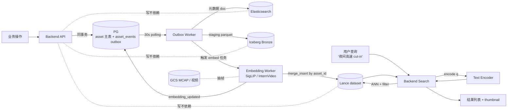
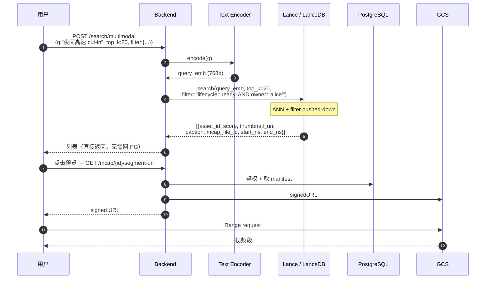
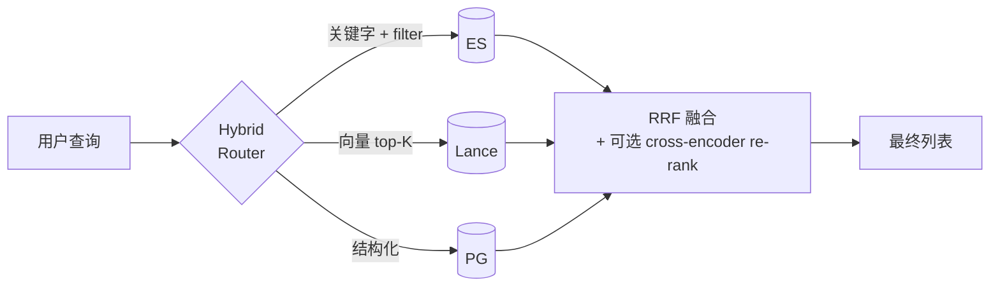
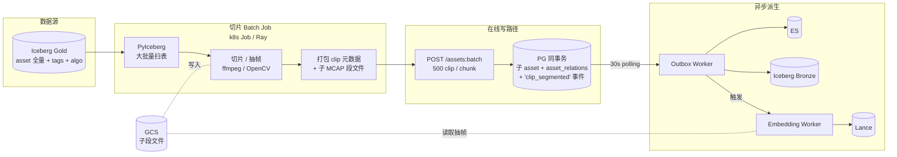

# 3.0 多模态检索架构（Lance 路线）

> **状态**：草稿 / 暂存。未启动，待 Phase 2 后期评估时间窗。
> **范围**：在 2.0 已有 PG + ES + Iceberg + outbox 架构基础上，引入 Lance 作为 ML 训练面 / 多模态检索加速层。
> **与主设计的关系**：本文档独立，不修改 `docs/review/data-platform-design.md`；落地启动时再合并相关章节进主设计或形成正式 ADR。当前所有 outbox 语义仍跟随 2.0 主线：**30s 纯轮询，无 LISTEN/NOTIFY**。

---

## 0. 业务起源

实际业务出现两个新需求：

1. **自然语言搜视频 / 图像** —— 用户想"按 '夜间高速 cut-in 急刹' 这样的自然语句找到资产"
2. **细粒度处理（可选）** —— 当前 asset 是整段视频，未来可能切成 30–60 s 的 clip

第 1 项是**必做**，决定了引入向量库；第 2 项是**可选**，影响数据模型粒度。本文档同时覆盖两条路径。

---

## 1. 设计原则

> **先资产、后异步向量、可重放可重建。**

| 原则 | 含义 | 给的能力 |
|------|------|--------|
| **先资产** | asset 写路径只跟 PG 强耦合，不依赖向量服务可用性 | 写路径 SLO 不被 embedding 拖累；Lance 挂了业务不停 |
| **后异步向量** | embedding 通过 outbox 触发独立 worker 生成，写入 Lance | 与业务解耦；可独立扩缩 GPU |
| **可重放可重建** | Lance 是纯派生层，可由 PG asset_id 列表 + GCS 抽帧 + 当前模型版本全量重建 | 容灾恢复 / 模型升级 / 局部修复都是同一套机制 |

### 必须满足的 4 条契约

| # | 契约 | 实现 |
|---|------|------|
| 1 | PG 是 asset 的唯一权威，Lance 任何字段不能比 PG 新 | 写路径只写 PG，事件驱动派生 |
| 2 | embedding 生成是纯函数（同 asset_id × 模型版本 × 输入内容 → 同结果） | 模型权重 pinned；deterministic 抽帧；Lance 行存 `input_fingerprint` |
| 3 | Lance upsert 幂等（重跑不产生重复行） | `merge_insert by asset_id` 用 Lance OCC |
| 4 | 重放路径独立可触发 | admin 接口：按 asset_id / event_seq / 全量 重发 embedding 事件 |

---

## 2. 选型：为什么 Lance

| 候选 | 评价 |
|------|------|
| **Lance + LanceDB（选用）** | ML 原生（多模态、随机访问、向量索引内置 IVF_PQ / HNSW）；OSS；GCS-friendly；多 embedding 版本共存 |
| pgvector | < 1B 向量小规模 OK；多模态扩展能力差；不存原始多模态字段 |
| Milvus / Qdrant / Vespa | 纯向量库，多模态字段管理弱；运维比 Lance 重 |
| Iceberg + Trino | 不适合向量召回；Iceberg 是分析事实层 |

**Lance 不替代 Iceberg 也不替代 ES**，它跟它们三层并存：

| 层 | 角色 |
|----|------|
| **PostgreSQL** | OLTP 主库 + outbox（业务权威）|
| **Elasticsearch** | 业务关键字 / 多维过滤 / facet |
| **Iceberg + Trino** | 分析 / dataset 元数据 / 长期归档 / 数据集物化的源 |
| **Lance + LanceDB** | ML 训练 + 向量召回 + 多模态字段（embedding / thumbnail / caption） |

---

## 3. 整体架构



---

## 4. 数据模型与粒度选择

### 4.1 默认：asset 级粒度

每个 asset 对应一个视频，1 行 Lance 记录。

```
1 个 asset (整段视频)
  ↓
1 行 Lance:
  asset_id, embedding_siglip_v2, thumbnail_uri, caption,
  冗余字段 (lifecycle / tags / mcap_file_id / start_ns / end_ns)
```

适用：当前 1000 个视频规模 / 直接以视频为检索单元。

### 4.2 可选：clip 子粒度（未来扩展）

如果未来要 30–60 s clip 级检索：clip = `asset_type='clip'` 的 asset，挂 parent。

```
父 asset (asset_type='drive')
   ↓ asset_relations(relation_type='clip')
N 个子 asset (asset_type='clip')
   ├── parent_asset_id = 父 asset
   ├── mcap_file_id    = 子段（GCS 新文件）
   ├── start_ns / end_ns
   └── 走完整 asset 链路（tags / events / embedding / lifecycle）
```

**复用现有 schema**：`assets.asset_type` 加枚举值 `'clip'`，`asset_relations` 已存在。**不建新表**。

> **Lance dataset 不按 asset_type 分库**：drive 和 clip 共存于同一个 `assets_multimodal.lance` dataset，通过 `asset_type` 列做 filter pushdown 区分。原因：Lance 的 filter pushdown 在列存上几乎零成本；分库会增加索引维护和跨库 join 复杂度。如果 clip 数量超过 10M 且检索延迟不达标，再评估按 `asset_type` 分 dataset。

### 4.3 PG vs Lance 字段切分

| 字段 | PG | Lance | 说明 |
|------|----|------|------|
| `asset_id` | ✅ PK | ✅ PK | 唯一连接键 |
| `lifecycle_state / owner / tags / asset_type` | ✅ 权威 | ✅ **冗余** | Lance 内做 filter，避免回 PG |
| `mcap_file_id / start_ns / end_ns` | ✅ | ✅ 冗余 | 命中后构造 segment-url 用 |
| `thumbnail_uri` | ✅ | ✅ 冗余 | 列表页缩略图 |
| `caption` (VLM 自动生成) | ✅ | ✅ 冗余 | 列表展示 |
| `embedding_siglip_v2` (vector 768) | ❌ | ✅ **唯一** | PG 不存向量 |
| `embedding_internvideo_v1` | ❌ | ✅ **唯一** | 多版本共存 |
| 完整 manifest / 长 JSONB / version | ✅ | ❌ | Lance 不存 |
| `created_at / updated_at` | ✅ 权威 | ✅ 冗余 | 排序用 |

冗余几个字段是值得的——避免 Lance 命中后回 PG join N 次。

---

## 5. Lance dataset 形态

### 5.1 物理结构

```
gs://your-bucket/lance/assets_multimodal.lance/
├── data/                        # parquet-like data files
│   ├── 0001.lance
│   └── ...
├── _versions/
│   └── v123.manifest            # Lance snapshot
└── _indices/
    └── embedding_siglip_v2_hnsw/
```

- 单 dataset 装到 1M 行没问题；不需要分区
- 周期 compact：`dataset.compact_files()` 周日凌晨
- 周期 expire：`dataset.cleanup_old_versions(older_than="7 days")`

### 5.2 写入逻辑（embedding worker 伪代码）

```python
# 收 asset_id batch（outbox NOTIFY 唤醒或 cron scan pending）
rows = []
for asset_id in batch:
    asset = pg.get_asset(asset_id)

    # deterministic 抽帧（保证可重建）
    frames = mcap.sample_frames(
        asset.mcap_file_id,
        start_ns=asset.start_ns,
        end_ns=asset.end_ns,
        n=16,
        seed=hash((asset_id, "siglip_v2"))
    )

    # encode
    frame_embs = siglip_model.encode_image(frames)   # [16, 768]
    asset_emb = frame_embs.mean(axis=0)               # [768]

    thumbnail_uri = upload_thumbnail(frames[8], asset_id)
    caption = vlm.caption(frames)  # 可选

    rows.append({
        "asset_id": asset_id,
        "embedding_siglip_v2": asset_emb,
        "input_fingerprint": fingerprint(asset, "siglip_v2"),
        "thumbnail_uri": thumbnail_uri,
        "caption": caption,
        "lifecycle_state": asset.lifecycle_state,
        "owner": asset.owner,
        "tags": asset.tags,
        "mcap_file_id": asset.mcap_file_id,
        "start_ns": asset.start_ns,
        "end_ns": asset.end_ns,
        "created_at": asset.created_at,
    })

ds.merge_insert("asset_id") \
  .when_matched_update_all() \
  .when_not_matched_insert_all() \
  .execute(rows)

pg.append_event("embedding_updated", asset_ids=batch)
```

### 5.3 索引选择（按规模）

| asset 规模 | 索引 | 召回延迟 |
|-----------|------|---------|
| < 10k | 不建索引，暴力扫 | < 50 ms |
| 10k – 1M | **HNSW**（推荐起步） | < 20 ms |
| 1M – 10M | HNSW（内存大）或 IVF_PQ | < 50 ms |
| > 10M | **IVF_PQ**（压缩 + 分区） | < 100 ms |

```python
ds.create_index(
    "embedding_siglip_v2",
    index_type="HNSW",
    M=16, ef_construction=200
)
```

---

## 6. 检索路径

### 6.1 自然语言搜 asset



**关键加速**：Lance 内置 SQL 风格 filter pushdown，一次调用拿到带 filter 的精确 top-K，不需要先 ANN 取大批再回 PG 过滤。

### 6.2 Hybrid 检索（关键字 + 向量 + 结构化）



`/search/multimodal` API 视入参决定走哪几路：
- 只有 `q` 文本 → Lance + ES 双路 + RRF 融合
- 只有 `embedding_ref=asset_id_xxx` → 纯 Lance 相似召回
- 只有 `filter=...` → 纯 ES（不上向量）

---

## 7. clip 切片批处理（可选 / 未来）

### 7.1 什么时候启动

仅当业务需求出现"30–60 s clip 级检索"时启动；否则保持 asset 级即可。

### 7.2 架构



### 7.3 三件事各自归属

| 步骤 | 跑在哪 | 凭什么 |
|------|------|------|
| 大批量读 | PyIceberg 跑在 k8s Job / Ray | Iceberg gold 是分析事实，OLAP 友好；PG 不背扫描 |
| 切片 + 抽帧 | k8s Job 容器（ffmpeg / OpenCV） | 不进 backend；输出小段 MCAP / mp4 写 GCS |
| clip 入库 | `POST /assets:batch`（已有 A2 接口） | 同事务追加事件，自动获得 outbox 链路 |
| embedding | 标准 algo worker（D2 路径），消费 `clip_segmented` 事件 | 与切片解耦，独立 GPU pool 调度 |

**没有新组件**，全部用平台已有抽象。

### 7.4 关键控制点

- 一次 INSERT 500 条（不要 50000 一锅）→ PG 不爆 + outbox 事件不堆积
- 父 asset 加 `clip_status` / `clip_strategy` 字段记录"切过没 / 用什么策略"，重跑幂等
- 切片策略版本化（`clip_strategy='v1'/'v2'`）→ 可"按 v2 重切"，老 v1 保留 archived

### 7.5 容量估算

| 维度 | 估算 |
|------|------|
| 1000 父 asset × 30 clip = 30k clip | 60 个 batch（500/批）→ ~30 min PG 写完 |
| Outbox 处理 30k 事件 | ES bulk 1k/批 → 几分钟 |
| Embedding 30k clip | 单 GPU SigLIP ~30 clip/s → ~17 min；4 GPU 并行 ~5 min |
| Lance 写入 30k 行 | merge_insert 几秒 |
| **整体冷启动** | < 1 小时 |

---

## 8. 重建 / 重放路径

把"重建" 做成一等公民——admin 端点统一形态：

| 端点 | 范围 | 用途 |
|------|------|------|
| `POST /admin/embedding/rebuild?asset_ids=` | 单条 / 列表 | 局部修复、单点 debug |
| `POST /admin/embedding/rebuild?from_seq=&to_seq=` | 区间 | 某段时间漏了 |
| `POST /admin/embedding/rebuild?model=siglip_v3&full=true` | 全量 | 模型升级 |
| `POST /admin/lance/rebuild?dataset=assets_multimodal` | 整库 | Lance 灾难恢复 |

实现都是同一套：
1. 重置 `embedding_versions` 中对应模型版本的 watermark
2. Outbox Worker 重新发 `embedding_updated` 事件
3. embedding worker 拉 pending → encode → upsert Lance
4. Grafana 看 lag 收敛到 0

跟主设计 §5.8.2 场景 6（SRE 重放重建 ES）是**同一套机制不同 sink**。

---

## 9. Phase 安排

| Phase | 内容 | 成本 | 触发 |
|-------|------|------|------|
| **Phase 1** 现在 | 仅 schema 预留：`assets.embedding_versions JSONB` / `thumbnail_uri` / `caption`；`asset_events` 加 `embedding_updated`；`asset_type` 留 `'clip'` 枚举 | schema 几行 | 不触发 |
| **Phase 2** 启动 Lance | 部署 Lance + LanceDB；写 Lance Sink；写 embedding worker（asset 级）；实现 `/search/multimodal` API；模型选型 ADR | 1–2 sprint | 业务需要"语言搜视频"时 |
| **Phase 2.x** 切片管道 | 切片 batch job + `clip_status / clip_strategy` 字段 + ffmpeg 镜像 + Ray on GKE 选型 | 1 sprint | 30–60 s clip 级检索需求出现时 |
| **Phase 3+** | cross-encoder re-rank；多模型版本管理；corner case 检索专用 dashboard；视频时序模型（VideoMAE / InternVideo） | — | 召回精度成为瓶颈时 |

---

## 10. 风险与边界

| 风险 | 缓解 |
|------|------|
| Trino 不能查 Lance | OK——Lance 不背 SQL 分析；想 SQL 查 Lance 用 LanceDB 内置 Datafusion |
| Lance 写并发冲突 | merge_insert 走 Lance 自带 OCC；多 worker 串行 commit；并发不高时无问题 |
| embedding 模型升级 | 多列共存（`embedding_siglip_v2 / v3`）+ algo replay；不破坏检索 |
| 跨云迁移 | Lance 文件在 GCS，跟 Iceberg 一起搬走即可 |
| LanceDB Cloud 锁定 | 不上 Cloud，用 OSS Lance + 自建 LanceDB on GKE |
| 视频 encoder 选择 | 起步 SigLIP（图像 + 抽帧 mean pool）够用；要更精的视频时序理解再上 InternVideo / VideoMAE，独立 ADR |
| GPU 资源紧张 | embedding worker 弹性 HPA + Spot 节点；attribute 排队不影响业务 |
| 文本/视觉 encoder 不在同一空间 | Phase 2 启动前做模型选型 PoC（SigLIP / InternVL / EVA-CLIP），出 ADR |
| clip 数量爆炸 | Lance IVF_PQ 处理大规模；ES 不进 clip 级，避免双重负担 |
| 重建时 embedding 飘移（抽帧随机性） | deterministic sampling + `input_fingerprint` 字段保证可比性 |

---

## 11. 一句话总结

**Lance 是 Outbox 的第三个 sink，主键 = asset_id，单 dataset 装满几十万 asset 没问题，embedding 用 SigLIP 抽帧 mean pool 起步。架构上 PG 仍权威，Iceberg 仍分析事实，Lance 是检索加速层，三个互不替代。先资产、后异步向量、可重放可重建——这是这套架构唯一正确的做法。**

---

## 附录 A：相关现有文档

- `docs/review/data-platform-design.md` —— 2.0 主设计（PG + ES + Iceberg + outbox）
- `docs/review/use-cases.md` —— 65 个 use case 全集
- `docs/review/schema-reference.md` —— 表 / 字段速查
- `docs/review/algo-lifecycle-and-data-model.md` —— 算法 worker 抽象（embedding 复用此路径）

## 附录 B：变更记录

| 日期 | 内容 |
|------|------|
| 2026-04-28 | 初稿。基于 Lance 选型讨论 + asset 级粒度需求 + 可选 clip 切片管道整理 |
