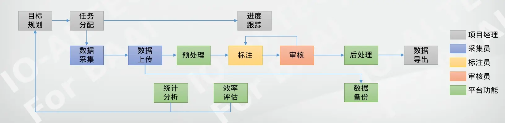

# Data as a Service

Source: https://io-ai.tech/platform/en/guides/DaaS/#delivery-content

- Data as a Service

# Data as a Service

If you only need large-scale training data for machine learning, we can provide professional embodied intelligence data collection services.

## Purchase Existing Data​

We have currently collected and annotated over 300TB of human and robot teleoperation data, covering a rich variety of production and life scenarios, enabling rapid delivery of trainable multimodal data.

Covered scenarios include:

- Home environments such as kitchens, living rooms, bedrooms, laundry rooms

- Indoor spaces like apartments, office buildings, shopping malls, warehouses

- Industrial scenarios including production lines, factories, laboratories

- Outdoor environments such as streets, campuses, parking lots, green spaces

- Industry application scenarios in healthcare, education, transportation, retail

Each scenario contains comprehensive multimodal data including images, point cloud depth, IMU sensors, finger tactile, and gripper data, meeting various model training requirements.

## Collect New Data​

We have a professional data collection and annotation operations team with experience serving multiple industry-leading companies. We can quickly set up scenarios according to specific customer requirements, providing personalized collection tasks and annotation solutions, delivering large-scale data for model training.

We support same-day collection, same-day annotation, and next-day upload delivery, enabling rapid data iteration.

## Delivery Methods​

### 1. Data Delivery via Cloud Services​

We recommend using cloud services for data transmission and storage, such as high-capacity, high-bandwidth cloud service providers like Tencent Cloud Object Storage.

### 2. Data Delivery via Hard Drives​

Data can also be delivered through customer-specified methods, such as express delivery of hard drives.

## Delivery Content​

Delivery formats can be flexibly adjusted based on raw data and customer requirements. We provide model-specific training format conversion services or tools.

The delivered data includes raw collected data (multi-channel images, IMU sensors, depth point clouds, finger tactile, etc.), time-aligned annotation data, and natural language cut by annotation time in various formats. Basic data formats can be referenced inData Format.

We can also deliver formats directly usable for model training, such as LeRobot datasets and RLDS datasets.

## Images on this page

- 
