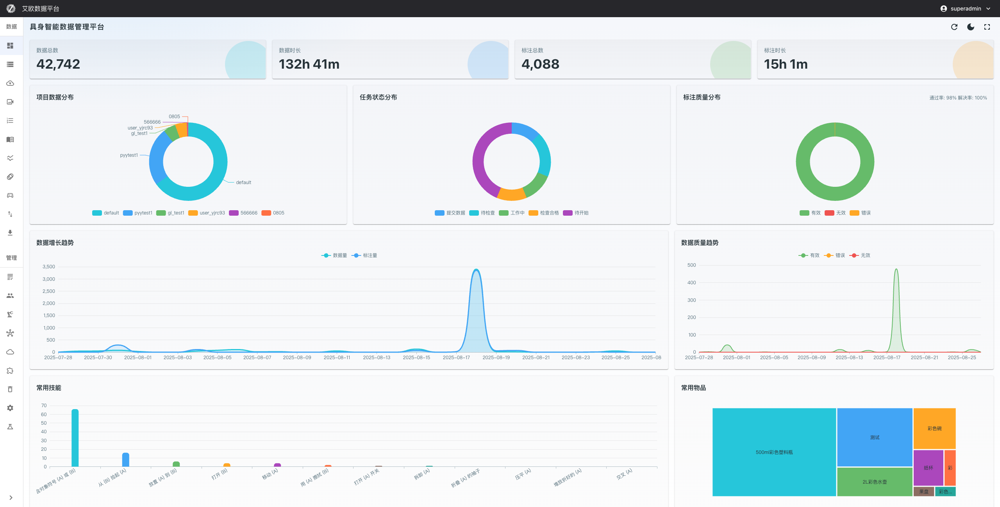
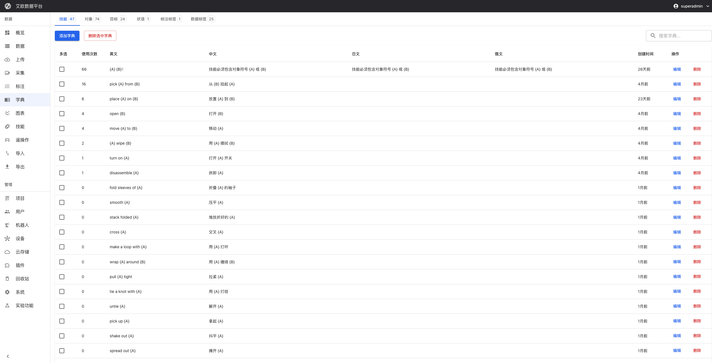
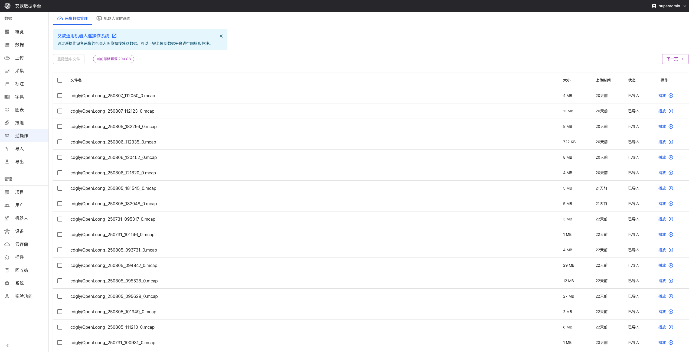
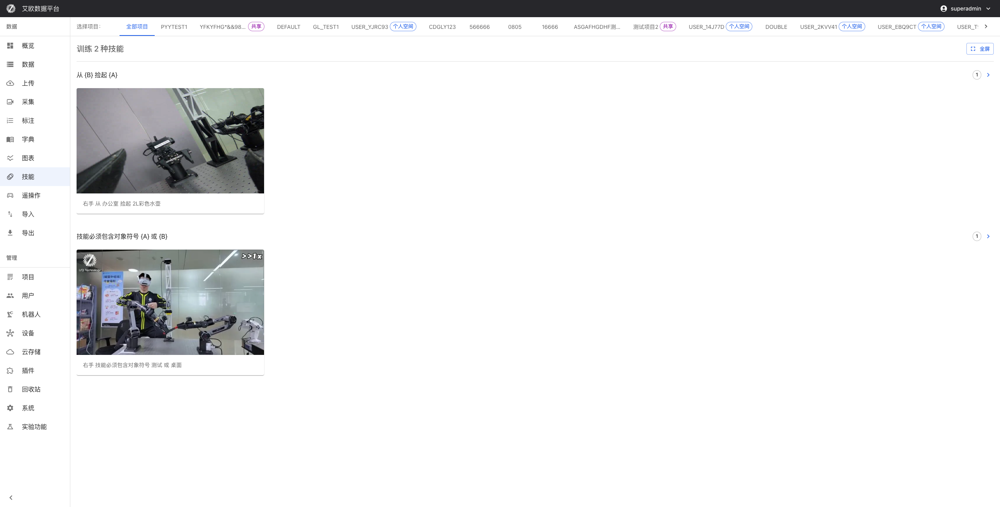
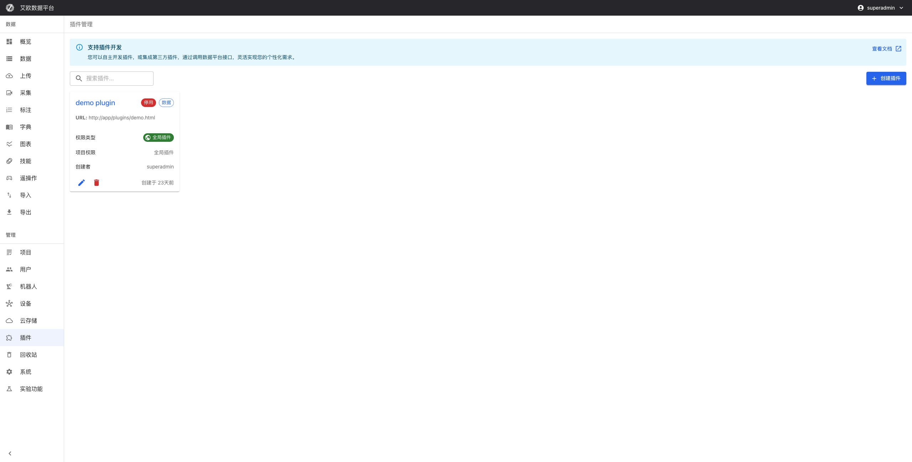
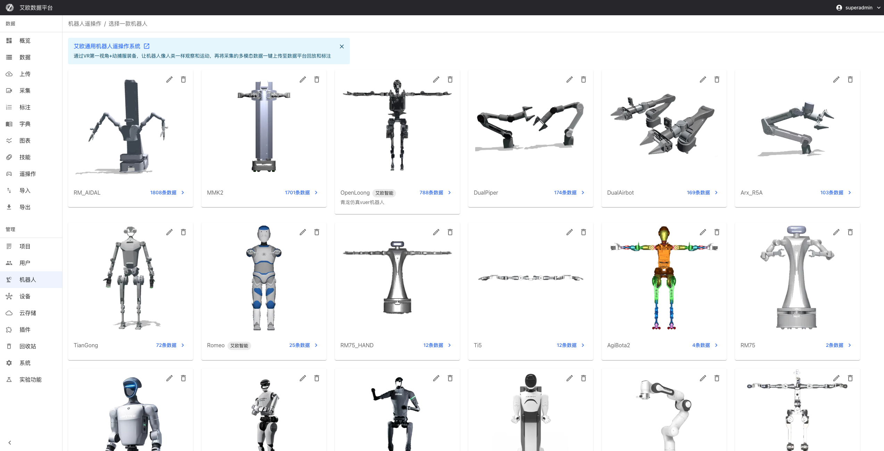
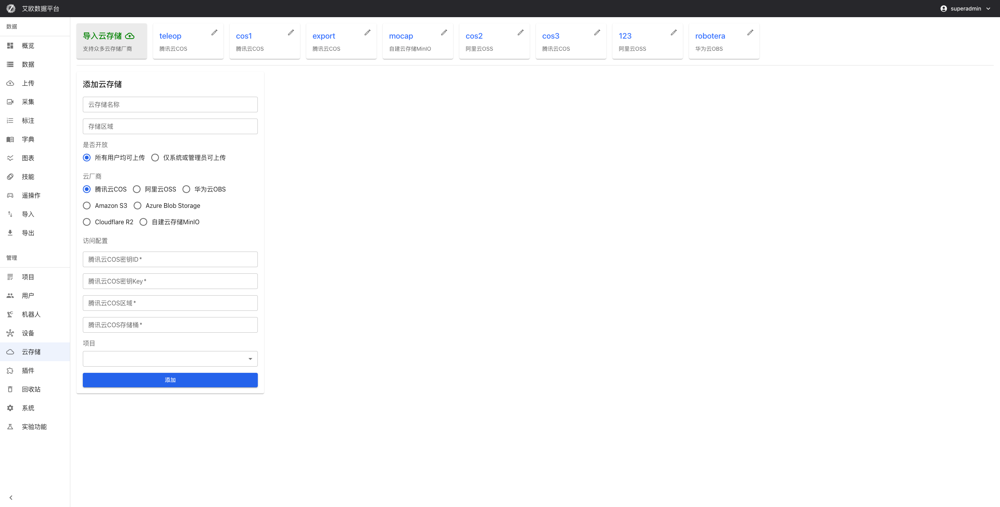
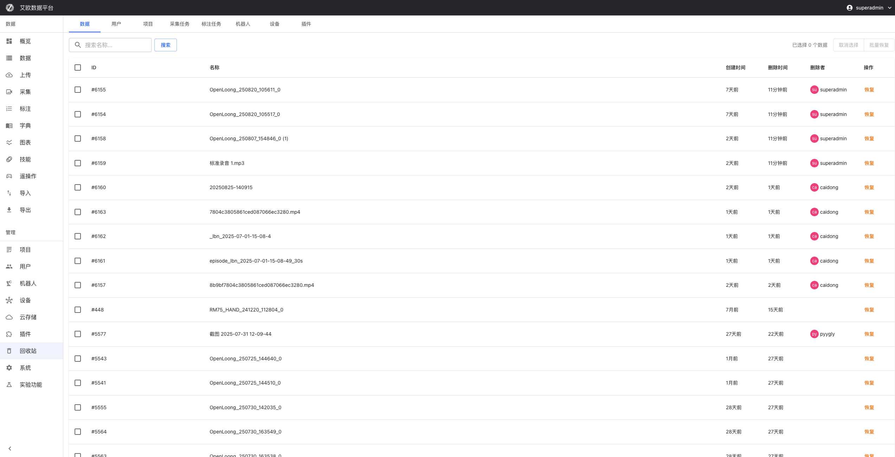
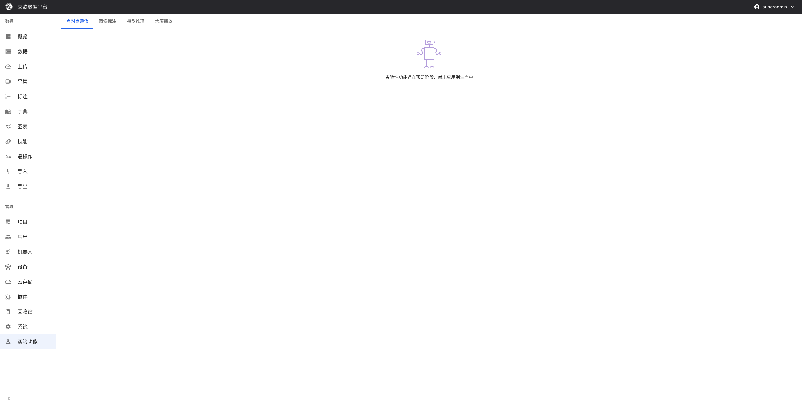
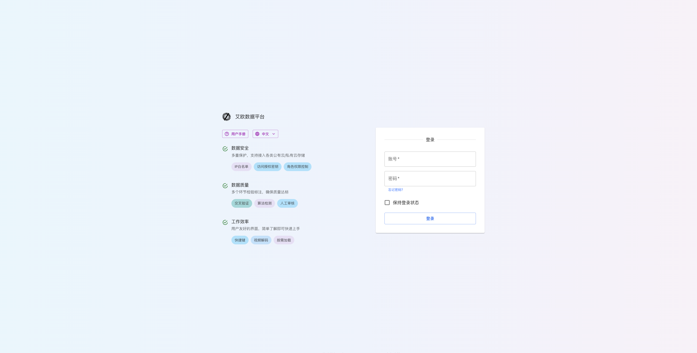

# Feature Modules

Source: https://io-ai.tech/platform/en/guides/Modules/#extensibility

- Feature Modules

# Feature Modules

The platform's capabilities are divided into two major categories:Data OperationsandGeneral Management, enabling efficient data processing and project management.

## Data Operations​

Covers the full workflow: data collection, upload, annotation, management, and analysis, supporting multi-role collaboration.

### Overview​

Access: Admin, Project Manager

Displays key indicators (dataset size, annotation duration, number of markers) and trend/distribution charts, helping you quickly grasp overall project health, with quick links to commonly used dictionaries.

Key features:

- Data statistics dashboard: Real-time metrics like total datasets, annotation duration, number of keypoints

- Quality monitoring: Distribution of annotation quality, including valid/invalid markers

- Project progress: Visualize data distribution and completion by project

- Recent activity: Track uploads and annotation activity in the last 7 days

- Common dictionaries: Quick access to frequently used labels and skill categories

### Data​

Access: Admin, Project Manager

Centralized data management and retrieval. Filter by name, robot, labels, etc. Supports batch operations (rename, statistics, annotation, labeling, deletion, import, robot association). Select data here to initiate annotation tasks with one click.

Key features:

- Dataset list: Filter/search by project, status, labels, etc.

- Data linking: Associate datasets with specific projects and robot devices

- Label management: Add custom labels for better categorization

- Data preview: Visualize Mcap data with keypoint views

- Batch operations: Bulk delete, rename, assign to projects

- Data QC (ROS recordings): Automatically checks frame rate, topics, time sync, and more against rules, withproject and global scope. After preprocessing, jobs are queued automatically (MCAPfirst today;bag/db3support rolling out). SeeQuality checks in the pipeline.

- Video QC: Multi-stream video diagnostics (frame drops, artifacts, BRISQUE), seeVideo QC.

### Upload​

Access: All roles

Upload video, audio, and ROS (BAG/MCAP) files and images to a selected project and cloud storage. Supports online transcoding to MCAP with progress and validation.

Key features:

- Multi-format support: Mcap, Bag, Mp4, audio, and other ROS standard formats

- Video conversion: Convert videos online to Mcap with quality, FPS, and audio settings

- Audio processing: Convert audio to Mcap for speech annotation

- Cloud integration: Multiple cloud backends with automatic sync

- Batch upload: Drag-and-drop and multi-file selection

- Progress monitoring: Real-time progress, speed, remaining time

- Format validation: Automatic format and integrity checks

### Collections​

Access: Admin, Project Manager, Collector, Auditor

Create and manage data collection tasks, assign collectors/devices, and track execution. Collected data automatically flows into the platform.

Key features:

- Task creation: Define objectives, requirements, and device assignments

- Assignment: Assign tasks to devices or collectors

- Progress tracking: Monitor execution status in real time

- Device management: Manage teleoperation devices and upload settings

- Batch ops: Create, edit, delete tasks in bulk

### Annotation Tasks​

Access: Admin, Project Manager, Annotator, Auditor

Manage all annotation tasks with status groups (To Start, In Progress, To Review, Approved, Submitted), with filtering and batch operations. To create a task, first select data on the "Data" page and click the bottom "Annotate" button.

Key features:

- Task management: Create, assign, and track annotation progress

- Status monitoring: Real-time stats for task states (Unassigned, In Progress, Completed, Reviewed)

- Batch operations: Bulk updates and assignments

- Filtering: Filter by project, status, creation time

- Access control: Different actions per role

- Progress stats: Visualize counts by state

### Dictionaries​

Access: Admin, Project Manager, Annotator, Auditor

Maintain unified dictionaries for skills, objects, goals, adverbs, annotation labels, and data tags. Ensure consistent naming across projects with multilingual and batch operations.

Key features:

- Label categories: Manage multiple label types

- Multilingual: Support for Chinese, English, etc.

- Hierarchy: Hierarchical classification and ordering

- Batch ops: Import, edit, delete in bulk

- Usage stats: Label usage frequency tracking

- Versioning: Version history and management

### Charts​

Access: Admin, Project Manager

Provide analyses like action planning, relationships, duration, dependencies, and annotation calendar to reveal structure and patterns, detect bottlenecks and anomalies.

Key features:

- Sankey analysis: Behavior flows and transitions

- Duration stats: Bar charts for action durations and comparisons

- Dependencies: Analyze inter-action dependencies and order

- Calendar heatmap: Time-wise distribution and intensity

- Subtree analysis: Deep dive into subtask structures

- Real-time updates: Live refresh and dynamic charts

### Teleoperation Data​

Access: Admin, Project Manager

Designed for teleoperation products, supporting viewing and importing teleoperation data to improve data management efficiency.

Key features:

- Device management

- Data playback

- Connection monitoring

- Upload configuration

- Robot management

- Dataset management

### Import​

Access: Admin

Integrated with local IO Agent software for bulk packaging, compression, and quality checks.

Key features:

- Local integration, bulk import, quality checks, format conversion, compression, progress monitoring

### Export​

Access: Admin

Export annotated data to JSON/CSV/HDF5 for further analysis and applications.

Key features:

- Multi-format export, selective export, batch export, history, quality report, custom parameters

### Skills​

Access: Admin, Project Manager

Manage robot skills: create, edit, categorize, and version control.

### Plugins​

Access: Admin, Project Manager

Extend platform capabilities via custom plugins: install, enable/disable, uninstall, and configure.

## General Management​

### Projects​

Access: Admin

Create, edit, and manage projects across their lifecycle.

### Users​

Access: Admin, Project Manager

Centralized user, permission, and project assignment management.

### Robots​

Access: Admin, Project Manager

Manage robot-related data for teleoperation products.

### Cloud Storage​

Access: Admin

Connect and configure cloud storage backends (Tencent COS, Aliyun OSS, Huawei OBS, Amazon S3, Azure Blob Storage, Cloudflare R2, MinIO).

### Trash​

Access: Admin

Centralized recycle bin for logical deletions with recovery options.

### System​

Access: Admin

System-level configuration and management to ensure platform stability.

### Labs​

Access: Admin, Project Manager

Experimental features for validating new capabilities.

### Sign In​

Access: All users

User authentication and login portal with multilingual UI.

## Technical Highlights​

### Internationalization​

- Chinese, English, Japanese

- Full i18n framework; all UI texts are translatable

- Users can switch the UI language

### Access Control​

- Role-based access control (RBAC)

- Fine-grained permissions

- Project-level data access control

### Real-time​

- WebSocket live updates

- Auto refresh and state sync

- Real-time progress and notifications

### Extensibility​

- Plugin architecture

- Open APIs for integration

- Modular design for customization

## Images on this page

- 
- 
- 
- 
- 
- 
- 
- 
- 
- 
- 
- 
- 
- 
- 
- 
- 
- 
- 
- 
