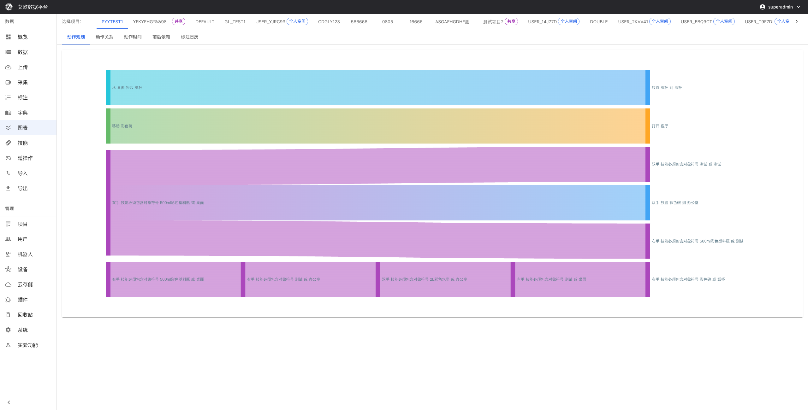

# Analytics Charts

Source: https://io-ai.tech/platform/en/guides/Modules/charts/#related-features

- Feature Modules

- Analytics Charts

# Analytics Charts

How to gain deep insights into data structure, annotation patterns, and work efficiency?

Typical scenarios:

- Need to analyze robot action execution sequences to optimize behavior planning

- Need to understand dependencies between actions to optimize execution strategies

- Need to analyze action execution time to identify performance bottlenecks

- Need to evaluate annotation work efficiency to optimize resource allocation

- Need to prepare project review reports with detailed data analysis

Analytics charts are designed to solve these problems. Through various visualization charts, they help administrators and project managers gain deep insights into data structure, annotation patterns, and work efficiency, providing data support for decision-making.

## Action Planning Analysis​

### Action Flow Diagram​

Use case: Visually see the complete sequence of robot actions to optimize behavior planning.

How to view:

- Go to the Analytics Charts page

- Select "Action Planning Analysis" > "Action Flow Diagram"

- View the complete sequence of actions and key nodes

- Analyze logical relationships between actions

Analysis points:

- Whether the action sequence is reasonable

- Whether there are redundant actions

- Whether the action path can be optimized

### Action Complexity Analysis​

Use case: Understand the difficulty level of actions to provide basis for training and optimization.

How to view:

- Select "Action Planning Analysis" > "Action Complexity Analysis"

- View the complexity scores of actions

- Analyze the distribution of actions with different difficulty levels

- View changes in action learning difficulty

Analysis points:

- Which actions have higher difficulty and need more training

- Whether the action difficulty distribution is reasonable

- Whether action design needs adjustment

## Action Relationship Analysis​

### Action Dependency Graph​

Use case: Understand logical relationships between actions to optimize execution strategies.

How to view:

- Select "Action Relationship Analysis" > "Action Dependency Graph"

- View dependencies between actions

- Analyze causal relationships of actions

- Identify actions that can be executed in parallel

Analysis points:

- Whether action dependencies are clear

- Whether there are circular dependencies

- Whether certain actions can be executed in parallel

### Action Similarity Analysis​

Use case: Discover patterns and anomalies in actions.

How to view:

- Select "Action Relationship Analysis" > "Action Similarity Analysis"

- View clustering results of similar actions

- Identify common action patterns

- Discover abnormal action combinations

Analysis points:

- Which action patterns are most common

- Whether there are abnormal action combinations

- Whether similar actions can be reused

## Action Time Analysis​

### Time Distribution Chart​

Use case: Understand temporal characteristics of actions to optimize execution efficiency.

How to view:

- Select "Action Time Analysis" > "Time Distribution Chart"

- View action execution time distribution

- Statistics on waiting time between actions

- Analyze action execution efficiency

Analysis points:

- Which actions take longer to execute

- Whether waiting time is reasonable

- Whether execution efficiency can be optimized

### Time Trend Analysis​

Use case: Identify performance bottlenecks and continuously improve action execution efficiency.

How to view:

- Select "Action Time Analysis" > "Time Trend Analysis"

- View trends in action time changes

- Identify performance bottlenecks

- Predict future execution time

Analysis points:

- Whether action execution time is continuously improving

- Whether there are performance bottlenecks

- Whether execution strategies need adjustment

## Forward-Backward Dependency Analysis​

### Dependency Graph​

Use case: Understand dependencies between actions to avoid execution conflicts.

How to view:

- Select "Forward-Backward Dependency Analysis" > "Dependency Graph"

- View prerequisites of actions

- Analyze subsequent impacts of actions

- Detect circular dependencies

Analysis points:

- Whether dependencies are reasonable

- Whether there are circular dependencies

- Whether dependencies can be simplified

### Dependency Optimization​

Use case: Improve overall execution efficiency.

Optimization methods:

- Simplify complex dependencies

- Optimize parallel execution strategies

- Adjust action execution order

- Identify bottlenecks in dependencies

## Annotation Calendar Analysis​

### Timeline View​

Use case: Get a comprehensive understanding of annotation work scheduling.

How to view:

- Select "Annotation Calendar Analysis" > "Timeline View"

- View the time progress of annotation work

- View task distribution on the timeline

- Mark important time nodes

Analysis points:

- Whether task scheduling is reasonable

- Whether there are time conflicts

- Whether time scheduling can be optimized

### Work Efficiency Analysis​

Use case: Understand team work efficiency to optimize resource allocation.

How to view:

- Select "Annotation Calendar Analysis" > "Work Efficiency Analysis"

- Analyze daily annotation workload

- Statistics on weekly work completion

- Evaluate monthly work results

Analysis points:

- Whether work efficiency is stable

- Whether there are efficiency fluctuations

- Whether resource allocation needs adjustment

## Data Quality Analysis​

### Quality Distribution Chart​

Use case: Get a comprehensive understanding of data quality status.

How to view:

- Select "Data Quality Analysis" > "Quality Distribution Chart"

- View data distribution by quality level

- Analyze quality changes over time

- Statistics on various quality issues

Analysis points:

- Whether data quality is stable

- Whether there are quality issues

- Whether quality control needs improvement

### Annotator Performance Analysis​

Use case: Improve overall team capabilities.

How to view:

- Select "Data Quality Analysis" > "Annotator Performance Analysis"

- Analyze individual annotator work performance

- Compare performance of different annotators

- Evaluate annotator skill levels

Analysis points:

- Which annotators perform excellently

- Which annotators need training

- Whether task allocation needs adjustment

## Project Progress Analysis​

### Progress Dashboard​

Use case: Provide comprehensive progress information for project management.

How to view:

- Select "Project Progress Analysis" > "Progress Dashboard"

- View overall project completion progress

- View completion status of each task

- Track key milestone progress

Analysis points:

- Whether project progress meets expectations

- Whether there are progress risks

- Whether plans need adjustment

### Resource Usage Analysis​

Use case: Optimize resource allocation and control project costs.

How to view:

- Select "Project Progress Analysis" > "Resource Usage Analysis"

- Analyze personnel resource utilization

- Statistics on equipment usage

- Monitor storage resource usage

Analysis points:

- Whether resource allocation is reasonable

- Whether there is resource waste

- Whether resource allocation needs adjustment

## Common Questions​

### How to export analytics charts?​

Export method:

- Click the export button on the chart page

- Select export format (image, PDF, etc.)

- Save to local

### How to customize analytics charts?​

Customization method:

- Select dimensions and metrics to analyze

- Set time range

- Adjust chart type and style

- Save custom configuration

## Applicable Roles​

### Administrator​

You can:

- Monitor overall platform operation status

- Optimize resource allocation and usage

- Control overall data quality

- Provide data support for management decisions

### Project Manager​

You can:

- Conduct in-depth analysis of project progress

- Identify problems and bottlenecks in projects

- Provide project optimization suggestions

- Prepare analysis data for upper-level reports

## Related Features​

After completing analytics charts, you may also need:

- Data Management: View detailed data lists

- Annotation Tasks: Manage annotation tasks

- Project Management: View project details

## Images on this page

- 
