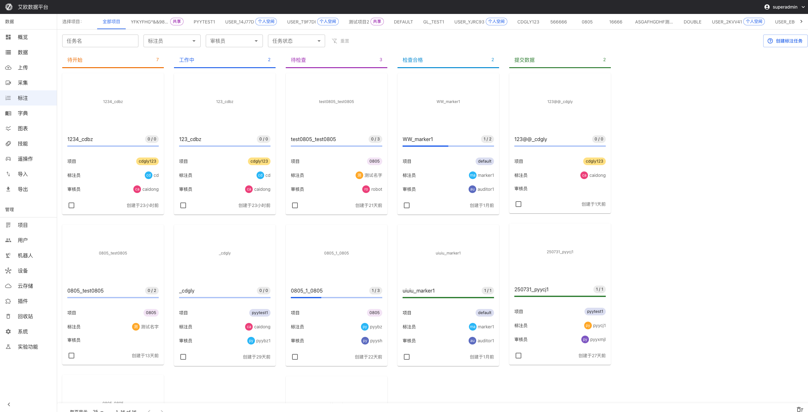

# Collection Tasks

Source: https://io-ai.tech/platform/en/guides/Modules/collections/#related-features

- Feature Modules

- Collection Tasks

# Collection Tasks

How to efficiently manage data collection work and ensure data is completed on time with high quality?

Typical scenarios:

- Need to create collection plans and assign collectors and equipment

- Need to track collection progress and discover and resolve issues in time

- Need to ensure collection quality meets project requirements

- Need to automatically aggregate collected data to reduce manual operations

Collection tasks are designed to solve these problems. By creating and managing data collection tasks, assigning collectors and equipment, and tracking execution status, collected data is automatically aggregated to the platform.

## Quick Start: Create Your First Collection Task​

### Step 1: Create Collection Plan​

- Go to the Collection Tasks page and click "New Collection Task"

- Fill in basic task information:Task Name: Clearly describe the collection task (e.g., "Project A - Scene 1 Data Collection")Collection Target: Specify the specific content and requirements for collectionSchedule: Set collection start and end timeLocation Planning: Specify collection location or area

- Task Name: Clearly describe the collection task (e.g., "Project A - Scene 1 Data Collection")

- Collection Target: Specify the specific content and requirements for collection

- Schedule: Set collection start and end time

- Location Planning: Specify collection location or area

- Set collection standards and quality requirements

- Save task

### Step 2: Allocate Resources​

- Select collectors:Match based on task requirements and personnel skillsCan assign multiple collectors

- Match based on task requirements and personnel skills

- Can assign multiple collectors

- Assign equipment:Select available collection equipmentEnsure equipment status is normal

- Select available collection equipment

- Ensure equipment status is normal

- Set priority and deadline

- Confirm allocation

### Step 3: Track Execution​

- View task list to understand task status

- Track collection progress in real time

- View progress and issues reported by collectors

- Handle exceptions in time

Collected data will be automatically uploaded to the platform.

## Task Creation and Planning​

### How to Create a Collection Plan?​

Plan content:

- Collection Target: Clearly specify the content and requirements for collection

- Schedule: Set collection start and end time

- Location Planning: Specify collection location or area

- Equipment Configuration: Determine required equipment and configuration

Planning suggestions:

- Create detailed collection plans based on project requirements

- Consider capabilities of collectors and equipment

- Reserve sufficient time to handle unexpected situations

- Set reasonable quality requirements

### How to Use Task Templates?​

Template features:

- Create and save commonly used collection task templates

- Include standardized collection processes, checklists, quality requirements, etc.

- Use templates to quickly create new tasks

Usage method:

- Select "Use Template" when creating a task

- Choose appropriate template

- Adjust template content based on actual situation

- Save as new task

Template management:

- Can create, edit, and delete templates

- Templates can be shared within projects or globally

### How to Allocate Resources?​

Resource allocation:

- Collectors: Match based on task requirements and personnel skills

- Equipment: Select available collection equipment

- Priority: Set task priority

- Deadline: Set task deadline

Allocation suggestions:

- Assign tasks based on collector skills and experience

- Ensure equipment status is normal

- Set priorities reasonably, important tasks first

- Reserve sufficient time to complete collection

## Task Execution Management​

### How to Track Collection Progress?​

Progress tracking:

- Completed Count: View number of completed collections

- Remaining Count: View number of collections still needed

- Estimated Completion Time: Predict completion time based on current progress

- Task Status: View current task status (pending, in progress, completed, etc.)

Tracking method:

- View task status in task list

- Click task to view detailed progress

- View progress information reported by collectors

- Compare planned progress with actual progress

### How to Perform Quality Control?​

Quality control:

- Collection Standards: Establish clear collection standards

- Quality Inspection: Perform quality inspection on collected data

- Issue Feedback: Provide timely feedback on quality issues

- Improvement Measures: Take improvement measures based on issues

Control method:

- Set quality requirements in tasks

- Sample inspect collected data

- Provide timely feedback to collectors when issues are found

- Continuously improve collection quality

### How to Handle Task Exceptions?​

Exception types:

- Equipment failure

- Collector unable to complete

- Collected data does not meet requirements

- Time delay

Handling method:

- Understand exception situations in time

- Adjust task allocation or schedule

- Provide necessary support and assistance

- Record exception situations for future improvement

## Data Aggregation​

### How to Automatically Upload Data?​

Automatic upload:

- Collected data can be automatically uploaded to the platform

- Support multiple upload methods:Real-time Upload: Upload immediately after collection is completedBatch Upload: Batch upload after collecting a certain amountScheduled Upload: Automatically upload at set times

- Real-time Upload: Upload immediately after collection is completed

- Batch Upload: Batch upload after collecting a certain amount

- Scheduled Upload: Automatically upload at set times

Configuration method:

- Set upload method in task

- Configure upload parameters

- Test upload functionality

- Monitor upload status

### How to Verify Collected Data?​

Data verification:

- Format Check: Check if data format is correct

- Completeness Verification: Check if data is complete

- Quality Assessment: Assess data quality

Verification method:

- System automatically verifies uploaded data

- View verification results

- Handle data that failed verification

- Record verification results

### How to Classify Collected Data?​

Data classification:

- Classify by project

- Classify by type

- Classify by time

- Classify by location

Classification method:

- Set classification rules in task

- System automatically classifies uploaded data

- Can manually adjust classification

- View classification results

## Common Questions​

### How to Modify Collection Tasks?​

Modification method:

- Click task in task list

- Click "Edit" button

- Modify task information

- Save changes

⚠️Note: Modifying tasks may affect assigned collectors and equipment, please operate with caution.

### How to Cancel Collection Tasks?​

Cancellation method:

- Click task in task list

- Click "Cancel" button

- Confirm cancellation operation

⚠️Note: Canceling tasks will stop data collection, collected data will not be deleted.

### How to View Collection History?​

Viewing method:

- Filter completed tasks in task list

- Click task to view detailed history

- View collected data and statistics

## Applicable Roles​

### Administrator​

You can:

- Create collection plans

- Assign personnel and equipment

- Track completion status

- Monitor overall collection work status

### Project Manager​

You can:

- Manage project-related collection tasks

- Create collection strategies

- Monitor collection progress

- Ensure collection quality

### Collector​

You can:

- Receive tasks and perform collection and upload according to plan

- View task details and requirements

- Report collection progress and issues

### Reviewer​

You can:

- Sample inspect or review collection results

- Evaluate collection quality

- Provide improvement suggestions

- Ensure collected data meets requirements

## Related Features​

After completing collection tasks, you may also need:

- Data Management: View collected data

- Device Management: Manage collection equipment

- Project Management: View project details

## Images on this page

- 
