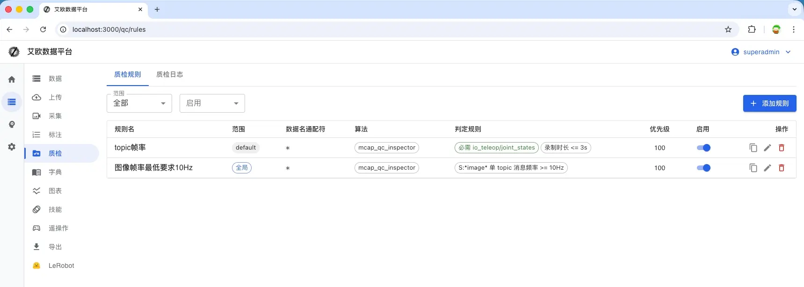
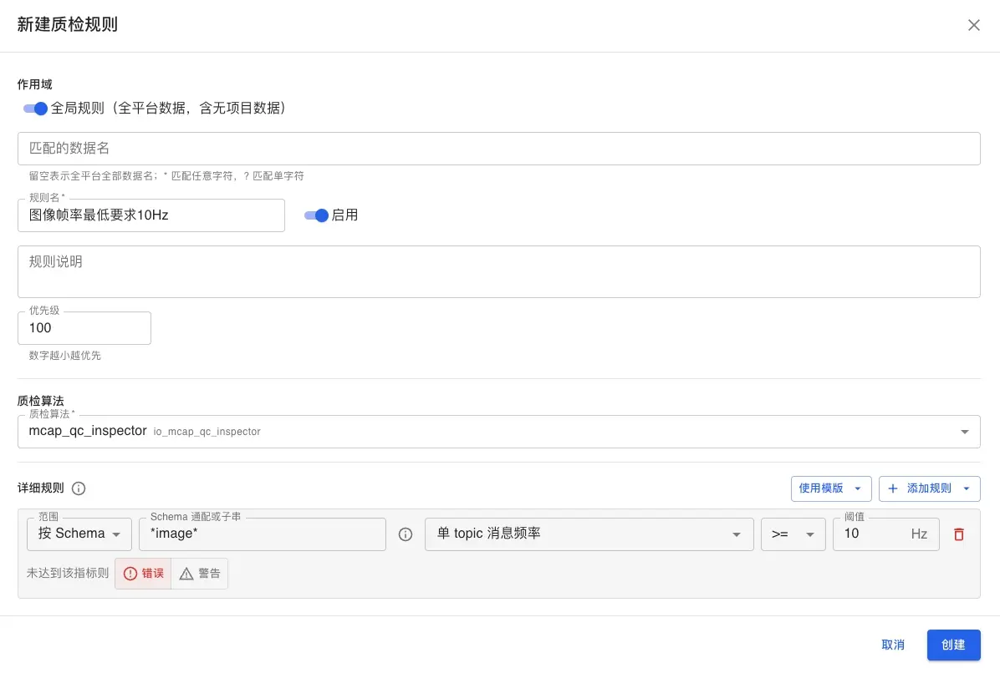
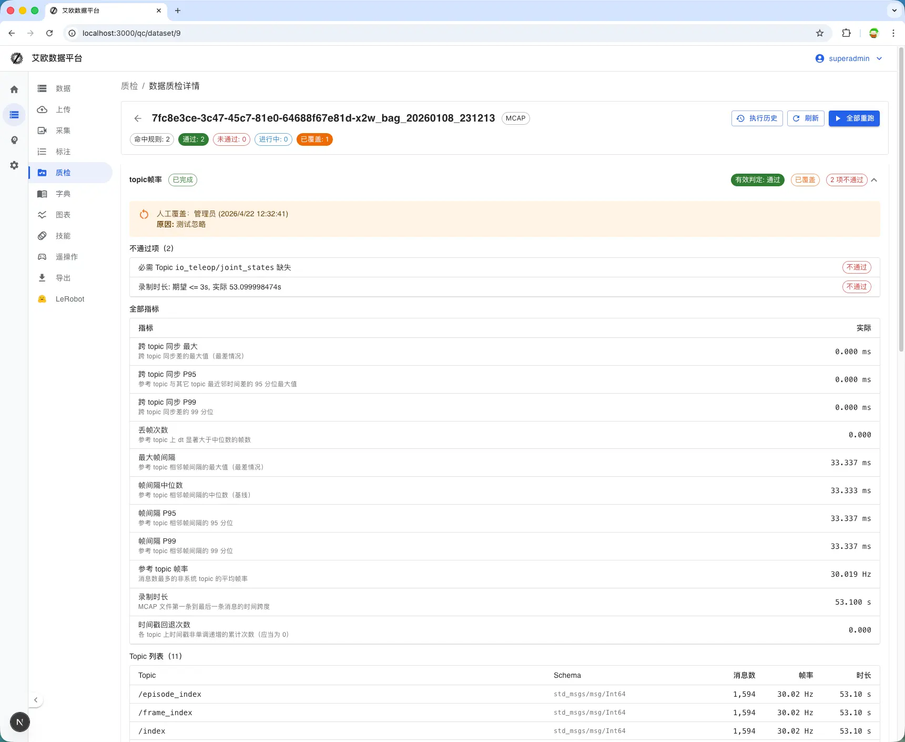

# Data QC

Source: https://io-ai.tech/platform/en/guides/Modules/data-qc/#see-also

- Feature Modules

- Data QC

# Data QC

How can large volumes ofROS recordingsbe checkedautomatically and consistentlybefore training and export—against baselines like frame rate, sensor topics, and time sync?

Typical needs

- Batch-filter data with low FPS, missing critical topics, or bad timestamps before training.

- Different thresholds per project, plus oneglobal“hard floor” for the whole platform.

- After rule changes,re-run QC on historical dataso conclusions match the latest rules.

- Manual overrideswhen a rule is right but a sample is exceptional, with an audit trail.

TheData QCmodule usesQC rules + background jobs: the platform scans astructured report per ROS recording, evaluates your UI assertions, and shows pass/fail on each dataset.

- Data QC (this page):Rule-basedchecks onROS trajectory / ROS recordings(MCAP, bag, db3, etc.)—numeric thresholds, required/forbidden topics—tied to preprocessing, export, and training.

- Video QC: Multi-streamDoctordiagnostics (drops, artifacts, BRISQUE)—seeVideo QC.

## Core concepts​

### QC rules​

Each rule bindsone QC algorithm(ROS recording inspection;MCAP reports are primary today; other containers/formats are rolling out), ascope, andseveral assertions.

Concept

Description

Scope

Project rule: only datasets in that project.Global rule: allROS recordingson the platform (including unassigned). Datasets in a project match both global and project rules; each produces its own runs.

Dataset name match

Glob ondataset.name(e.g.*arm*); blank meansallnames in that scope.

dataset.name

*arm*

Priority

Lower number runs first(display and scheduling); rules still judge independently when both match.

Enabled

Disabled rules do not match or auto-queue; enabling can trigger backfill on history.

### Assertion types​

Assertions are the conditions inside a rule:

- Numeric threshold: Comparator + threshold on a report metric (e.g.frame_rate >= 20); scope can limit to whole file or topic patterns (see UI for options).

frame_rate >= 20

- Required topic: Topic must appear in the report or the run fails.

- Forbidden topic: Topic must not appear or the run fails.

Severity:error(shown asblocking / failin the UI) fails the run when violated;warningis informational anddoes not by itself failthe run—handy to observe before tightening.

error

warning

## Permissions​

Action

Admin

Project manager

Other roles

View QC results / logs

Yes

Yes (within data access)

Collectors often see their own data

EditprojectQC rules

Yes

Yes (in project or public project)

Usually no

EditglobalQC rules

Yes

No

No

Only admins can create, edit, delete, or duplicateglobalrules; others may see them read-only.

## Flow overview​

## When QC runs automatically​

- After preprocessing: WhenROS recordingpreprocessing finishes, the platform enqueues QC for datasets thatmatch enabled rules(no need to click each row).Todayauto-queue is stillMCAP-first;bag/db3alignment with reports and rules is rolling out—follow release notes.

- On rule create/change: Saving or enabling a rule canasynchronously backfillmatching historical data (large queues may take time).

- Manual: From a dataset’s QC entry points you can trigger a run (exact button names follow the UI).

Data inunsupported formatsornot yet preprocessedmay not enter the auto QC queue.

## Reading results​

- Summary: On list or detail, see how many rules apply and pass / fail / running (exact chips follow the UI).

- Single run: Each rule has its own run with metrics and failed assertion details.

- System tags: Failures may add tags such asqc:failedfor filtering; export blocking depends on platform policy.

qc:failed

## Manual overrides​

When a rule is generally right but one sample is special (e.g. deliberate low FPS, later fixed in post), you canoverride that run(pass/fail + reason). Overrides feed theeffective verdictand tie into tags and export logic.

## Screenshots​

### Rule list​

### Create / edit rule​

### QC on dataset detail​

## See also​

- Quality checks in the pipeline

- Data export

- Model training

- Video QC

## Images on this page

- 
- 
- 
