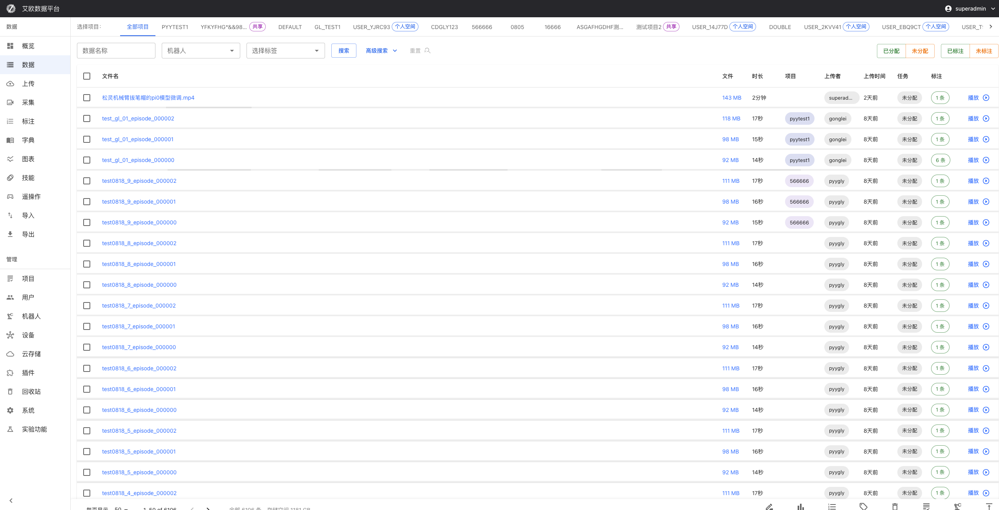
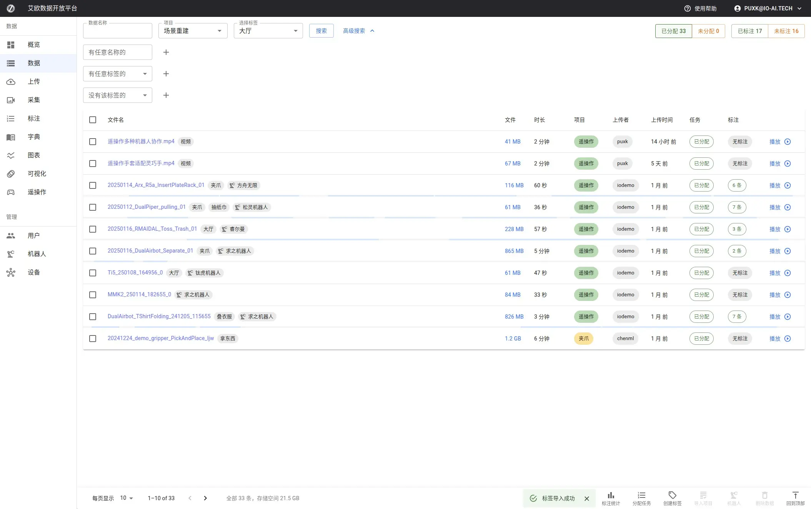
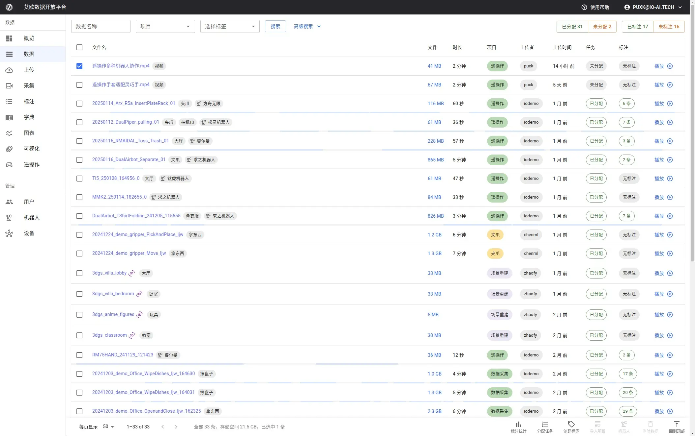
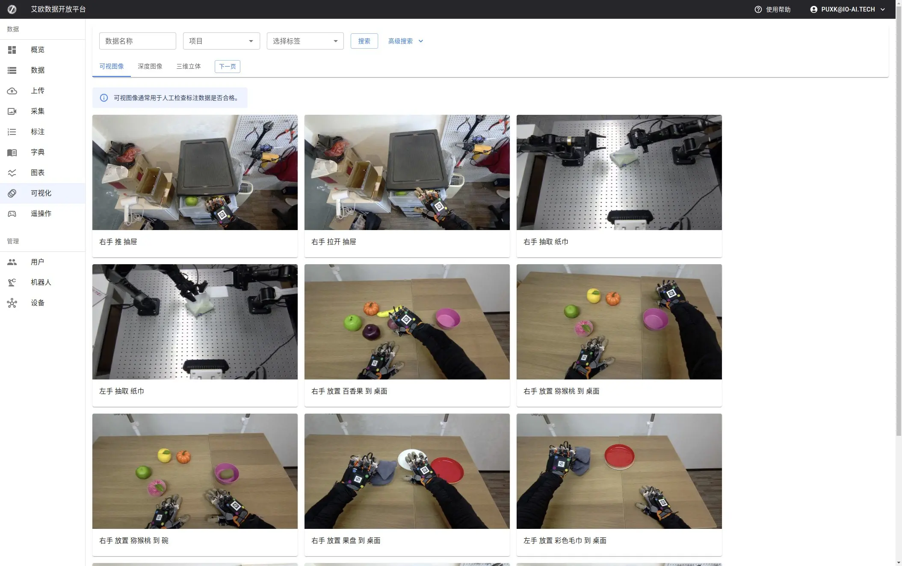
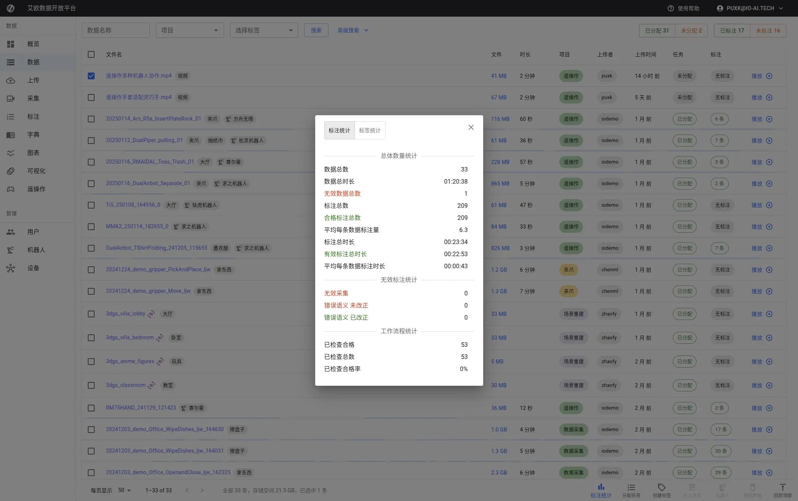

# Data Management

Source: https://io-ai.tech/platform/en/guides/Modules/dataset/#related-features

- Feature Modules

- Data Management

# Data Management

When hundreds or thousands of datasets have accumulated in the platform, how do you quickly find the one you need?

Common scenarios:

- Project managers need to find all unannotated data in a project to assign to annotators

- Annotators want to view their own annotation progress

- Administrators need to count data collected by a specific robot during a specific time period

- Training engineers need to export completed annotation data for model training

The Data Management page is designed to solve these problems. It provides powerful search, filtering, and batch operation capabilities, allowing you to quickly locate targets in massive data.

## Quick Start: 3 Steps to Find Target Data​

### Step 1: Select Project Scope​

The project selector at the top of the page lets you decide which data to view:

- All Projects: View all data you have permission to access (administrators and project managers)

- Specific Project: Only view data from a specific project, narrowing search scope

- Personal Space: View your personally uploaded private data

💡Tip: If data volume is large, selecting a specific project first can significantly improve loading speed.

### Step 2: Use Search and Filter​

Enter keywords in the search bar, and the system will search for matches in data names. Supports fuzzy matching, for example, entering "grasp" can find all datasets containing "grasp".

Quick Filter Buttons:

- Assigned/Unassigned: Quickly distinguish which data has been assigned to annotation tasks

- Annotated/Unannotated: View annotation completion status

Click buttons to toggle filter status, click again to cancel filter.

Advanced Search:

Click the expand button on the right side of the search bar to set more precise search conditions:

- Data Name: Supports fuzzy matching and exact search

- Source Robot: Filter by robot that collected the data

- Tag Filter: Filter by data tags (such as "high quality", "test data", etc.)

- Upload Time: Select time range, such as "last week", "last month"

- File Format: MCAP, BAG, video, audio, images, etc.

- Duration Range: Filter data with specific duration (in seconds)

These conditions can be combined. For example: Find "Robot A" collected "unannotated" "MCAP format" data from "last month".

### Step 3: Preview and Select Data​

In the data list, each dataset displays:

- Thumbnail: Quick preview of data content

- Basic Information: Name, size, duration, upload time

- Status Indicators: Whether assigned to task, whether annotated

- Tags: Data classification tags

Click dataset to view details, check checkbox to select multiple datasets for batch operations.

## Advanced Usage​

### How to Batch Manage Data?​

Scenario: You need to rename 50 datasets, or add tags to them uniformly.

Operation Steps:

- Use search and filter to find target datasets

- Check datasets that need operation (supports select all)

- Click corresponding button in bottom operation bar

Supported Batch Operations:

Operation

Use Case

Notes

Batch Rename

Unify naming standards

Will pop up dialog, can modify names one by one

View Statistics

Understand data overview

Display total size, total duration, annotation count, etc.

Manage Tags

Batch classify data

Can add or remove tags

Create Annotation Task

Quickly assign work

One-click task creation after selecting data

Append to Task

Supplement existing tasks

Add new data to existing annotation tasks

Delete Data

Clean up unnecessary data

Soft delete, can be recovered from trash

Associate Robot

Mark data source

Administrator permission, for data traceability

Update Metadata

Fix metadata errors

Re-extract file information

⚠️Note: Batch delete operations will go to trash and can be recovered. But deleting annotations is irreversible, please use with caution.

### How to View and Play Data?​

Online Preview:

Click dataset name or thumbnail to view detailed information:

- Basic Information: File size, duration, format, upload time

- Robot Information: Collection robot, collection parameters

- Annotation Statistics: Annotation count, annotation progress

- Task Association: Associated annotation tasks

Online Playback:

Supports online playback of multiple formats:

- Video Files: MP4, AVI, MOV, etc., support pause, fast forward, slow motion

- Audio Files: MP3, WAV, etc., support waveform display

- MCAP Data: Robot data visualization playback, support 3D scene rendering

The player provides complete control functions, allowing you to view data content without downloading.

### How to Handle Accidentally Deleted Data?​

The platform uses soft delete mechanism. Deleted data does not disappear immediately but goes to trash.

Recover Data:

- Go to "Trash" page

- Find accidentally deleted dataset

- Click "Recover" button

Recovered data will retain all historical information:

- ✅ Original annotation data

- ✅ Associated annotation tasks

- ✅ Data tags and metadata

- ✅ Access and operation logs

Re-upload Same Name Data:

If you re-upload a previously deleted dataset, the system will detect same name data:

- Recover Existing Dataset: Retain all historical information (recommended)

- Create New Dataset: Ignore historical data, create new record

💡Suggestion: If data was accidentally deleted, choosing "Recover Existing Dataset" can retain all annotations and task associations.

### How to Sync and Fix Metadata?​

When Do You Need to Sync Metadata?

- File information displayed incorrectly (such as duration, size)

- Metadata extraction failed after upload

- File was modified by external tools

Operation Steps:

- Select datasets that need sync (supports batch)

- Click "Update" button in bottom operation bar

- Select "Update Metadata" in dialog

- Confirm operation, system starts processing

Processing Status:

Dialog will display processing status of each dataset in real time:

- Pending: Waiting for queue processing

- Processing: Reading file and extracting metadata

- Completed: Metadata update successful

- Failed: File corrupted or format error

Error Handling:

If file is corrupted, system will mark as error status. Permanent errors (such as file corruption) will not auto-retry, need to fix file first.

### How to Create Annotation Tasks?​

Create from Data Management Page:

- Use search and filter to find data that needs annotation

- Check target datasets (can select across pages)

- Click "Annotate" button in bottom operation bar

- Fill in task information:Task name and descriptionSpecify annotators and reviewersSelect projectSet completion time

- Task name and description

- Specify annotators and reviewers

- Select project

- Set completion time

- Confirm creation

Append to Existing Task:

If annotation task already exists, can append new data:

- Select datasets to append

- Click "Append to Task"

- Select target task

- Confirm operation

💡Tip: Before creating task, recommend using filter function to confirm data status first, avoid re-assigning already annotated data.

### How to Export Data for Training?​

The Data Management page mainly provides data browsing and management functions. To export data for model training, please use theData Exportfunction.

On the Data Management page, you can:

- View Annotation Progress: Understand which data has been annotated

- Filter Annotated Data: Use "Annotated" filter button

- Batch Select: Select multiple annotated datasets

Then go to Data Export page and select these datasets for export.

## Data Quality Monitoring​

### View Statistics​

After selecting datasets, click "Statistics" button to view:

- Data Overview: Total size, total duration, dataset count

- Annotation Statistics: Annotated count, annotation completion rate

- Quality Metrics: Annotation pass rate, review status distribution

This information helps you understand overall data status.

### Quality Filtering​

Use "Annotated" filter button to quickly distinguish:

- Annotated Data: Annotation completed, can be used for training

- Unannotated Data: Need to assign annotation tasks

Combined with project filter, can view annotation completion status for specific projects.

## Common Questions​

### Why Can't I Find Data in Search?​

Possible reasons:

- Project Filter: Check if correct project scope is selected

- Permission Restrictions: Confirm you have permission to access that data

- Search Keywords: Try using broader keywords, or use advanced search

- Data Deleted: Check trash, data may have been accidentally deleted

### What to Do When Batch Operations Fail?​

If some datasets fail in batch operations:

- View error information in operation dialog

- For metadata sync failures, check if file is corrupted

- For annotation deletion failures, confirm dataset indeed has annotation data

- Can retry operation separately for failed datasets

### How to Improve Search Efficiency?​

Suggestions:

- Select Project First Then Search: Narrow search scope

- Use Tags: Add tags to data for easy filtering later

- Combine Filter Conditions: Use multiple filter conditions for precise matching

- Save Common Searches: Record common search conditions for direct use next time

### What to Do When Data List Loads Slowly?​

Optimization Suggestions:

- Select Specific Project: Don't view "All Projects"

- Use Filter Conditions: Reduce returned data volume

- Adjust Items Per Page: Reduce number of datasets loaded at once

- Check Network Connection: Ensure network is stable

If problem persists, contact administrator to check system performance.

## Applicable Roles​

### Administrator​

You can view and manage data from all projects, including:

- Cross-project data statistics and monitoring

- Data assignment and project association

- System maintenance and data cleanup

- Permission management and access control

### Project Manager​

You can manage data for responsible projects, including:

- View project data overview

- Create and assign annotation tasks

- Monitor annotation progress and quality

- Export data for training

### Annotator and Reviewer​

You can view and search data (with permission restrictions):

- View task data assigned to yourself

- Search datasets that need processing

- View data details and annotation results

## Related Features​

After completing data management, you may also need:

- Annotation Tasks: Create annotation tasks for data

- Data Export: Export annotated data for training

- Data Upload: Upload new data files

- Data Import: Import data from external systems

## Images on this page

- 
- 
- 
- 
- 
- 
- 
