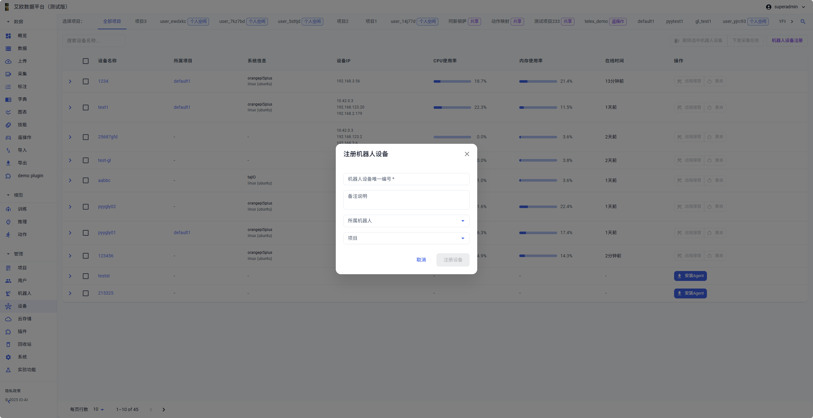
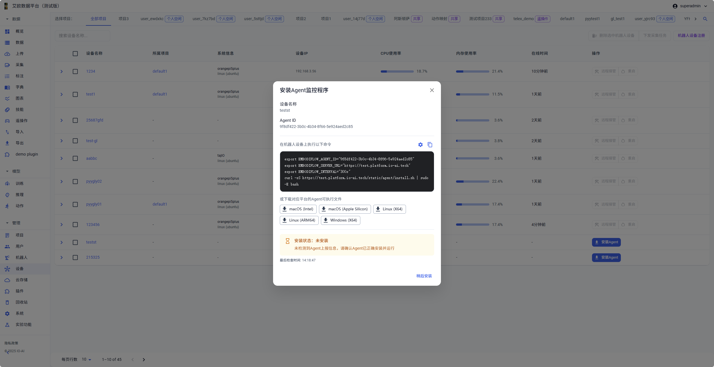
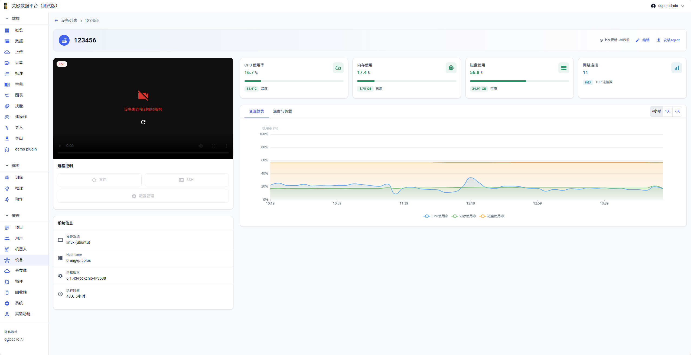

# Device Management

Source: https://io-ai.tech/platform/en/guides/Modules/devices/#related-features

- Feature Modules

- Device Management

# Device Management

How to efficiently manage distributed devices and ensure stable device operation?

Typical scenarios:

- Need to monitor device operation status in real time, discover device issues in time

- Need to remotely view device screens, understand device operation

- Need to remotely control devices, perform restart or configuration updates

- Need to manage device resources, optimize device usage

Device management is designed to solve these problems. Through Agent client programs, the platform can monitor device operation status and resource usage in real time, access video streams for remote visual monitoring, and provide remote takeover functionality.

## Quick Start: Register Your First Device​

### Step 1: Register Device​

- Go to Device Management page, click "Robot Device Registration" button

- Fill in device information:Device Unique ID: Used to identify device (required)Notes: Record device purpose, location and other information (optional)Associated Robot: Associate device with specific robot (optional)Project: Assign device to specific project (optional)

- Device Unique ID: Used to identify device (required)

- Notes: Record device purpose, location and other information (optional)

- Associated Robot: Associate device with specific robot (optional)

- Project: Assign device to specific project (optional)

- Click "Register Device" to complete registration

After successful registration, the system will generate a unique Agent ID for this device, used for subsequent Agent installation and identification.

### Step 2: Install Agent​

- Select device that needs Agent installation in device list

- Click "Install Agent" button to open installation dialog

- Copy installation command to target device terminal and execute

- System will automatically detect operating system and complete installation

- After installation completes, Agent will automatically start and begin reporting device information

Supported Platforms:

- macOS (Intel and Apple Silicon)

- Linux (X64 and ARM64)

- Windows (X64)

### Step 3: View Device Status​

- View device status in device list

- Click device name to enter device details page

- View real-time monitoring data and resource trends

- View video stream (if configured)

## Device Registration and Detection​

### How to Register Devices?​

Registration Process:

- Click "Robot Device Registration" button

- Fill in device unique ID (required)

- Fill in notes (optional)

- Select associated robot and project (optional)

- Click "Register Device" to complete registration

After Registration:

- Device will appear in device list

- System will generate unique Agent ID

- Can perform subsequent Agent installation and monitoring operations

### How to Detect Device Status?​

Detection Mechanism:

- System automatically checks device status every 5 minutes

- Determine device online status through Agent reported information

- Display last check time for easy understanding of device status updates

- For devices that haven't reported for a long time, system will mark as offline

Device Status:

- Not Installed: Device hasn't installed Agent, display installation guide

- Installed: Agent is installed and running, display last report time

- Offline: Agent is installed but hasn't reported for a long time, device may be offline or Agent abnormal

## Agent Client Installation​

### How to Install Agent?​

Installation Methods:

- Command Line Installation: One-click command line installation, suitable for Linux and macOS

- Executable File Download: Manually download and run executable file

Installation Steps:

- Select device that needs Agent installation on Device Management page

- Click "Install Agent" button

- Copy installation command to target device terminal and execute

- System will automatically detect operating system and complete installation

- After installation completes, Agent will automatically start and begin reporting device information

Environment Variables:
Installation command will automatically set necessary environment variables:

- EMBODIFLOW_AGENT_ID: Device's unique Agent ID

EMBODIFLOW_AGENT_ID

- EMBODIFLOW_SERVER_URL: Platform server address

EMBODIFLOW_SERVER_URL

- EMBODIFLOW_INTERVAL: Data report interval (default 300 seconds, i.e., 5 minutes)

EMBODIFLOW_INTERVAL

### How to View Installation Status?​

Installation Status:

- Not Installed: Device hasn't installed Agent, display installation guide

- Installed: Agent is installed and running, display last report time

- Offline: Agent is installed but hasn't reported for a long time, device may be offline or Agent abnormal

For devices in not installed or offline status, system will provide corresponding operation suggestions and troubleshooting guidance.

## Device List Management​

### How to View Device List?​

List Functions:

- Multi-Project Filter: Filter devices by project, support "All Projects" and specific projects

- Search Function: Quickly search devices by device name

- Status Filter: Filter by online status, Agent installation status, etc.

- Batch Operations: Support batch selection of devices for operations

Device Information:

- Device name and associated project

- System information and device IP

- CPU usage and memory usage

- Online time

### How to Perform Batch Operations?​

Batch Operations:

- Batch Delete: Delete selected devices (requires confirmation)

- Batch Assign Collection Tasks: Batch assign collection tasks to selected devices

- Batch Install Agent: Batch install Agent for multiple devices

## Device Details Page​

### How to View Device Details?​

Detailed Information:

- Real-Time Monitoring Cards: CPU usage and temperature, memory usage, disk usage, network connection status

- Resource Trend Charts: Support switching between "Resource Trends" and "Temperature and Load" views, can view 4 hours, 1 day, 7 days of historical data

- System Information: Complete system configuration information, device uptime, network configuration information

Operation Functions:

- Edit Device Information: Modify device name, notes and other information

- Install Agent: Install or reinstall Agent for device

- Remote Control: Execute restart, SSH, configuration management and other operations

- Video Monitoring: View device real-time video stream

## Resource Monitoring​

### How to Monitor Device Resources?​

Real-Time Monitoring:
Agent client will regularly collect device system resource usage, automatically report every 5 minutes:

- CPU Monitoring: CPU usage, CPU temperature, CPU core count and usage, CPU load trends

- Memory Monitoring: Memory usage, used memory, total memory capacity, memory usage trends

- Disk Monitoring: Disk usage, used disk space, available disk space, disk read/write speed

- Network Monitoring: Active TCP connections, network traffic statistics, network interface status

Resource Trend Analysis:
System provides resource usage trend charts, support viewing data from different time ranges:

- 4 Hours: View resource usage trends from last 4 hours

- 1 Day: View resource usage from last day

- 7 Days: View resource usage trends from last week

Trend charts display CPU, memory, disk usage changes in line chart format, helping:

- Identify resource usage peaks and valleys

- Discover abnormal resource usage patterns

- Predict resource needs, plan ahead

- Optimize device configuration and resource allocation

### How to View System Information?​

System Information:

- Operating System: Operating system type and version

- Hostname: Device hostname

- Kernel Version: System kernel version information

- Uptime: Device continuous operation time

- Device IP: Device network IP address (supports multiple IP display)

This information helps administrators quickly understand device's basic configuration and operation status.

## Video Stream Access and Monitoring​

### How to Access Video Streams?​

Video Stream Features:
Agent client supports pushing video streams from devices to platform, achieving remote visual monitoring:

- Real-time view of robot device camera perspectives

- Monitor device operation environment and status

- Remotely observe data collection process

- Discover device anomalies in time

Video Stream Characteristics:

- Support multiple video streams simultaneously

- Low latency real-time transmission

- Adaptive bitrate adjustment

- Automatic reconnection on disconnection

### How to View Video Streams?​

Video Monitoring Interface:

- Real-Time Player: Display device real-time video stream, support full-screen playback

- Connection Status: Display video stream connection status (connected/not connected)

- Refresh Function: Support manual refresh of video stream connection

- Playback Control: Support play, pause, volume control and other basic operations

When device is not connected to video service, system will display prompt information and provide refresh button to reconnect.

## Remote Takeover Functionality​

### How to Perform Remote Control?​

Remote Control Operations:

- Device Restart: Support remote device restart without physical contact. Safety check before restart to prevent misoperation. Agent connection and monitoring automatically restored after restart.

- SSH Connection: Provide SSH remote login functionality, support direct SSH connection to device through platform, convenient for advanced configuration and troubleshooting.

- Configuration Management: Remotely view and modify device configuration, support configuration file upload and download, configuration change history.

### Remote Takeover Scenarios​

Use Cases:

- Device Fault Handling: When device has anomalies, can remotely restart or diagnose

- Configuration Updates: Remotely update device configuration without on-site operation

- Data Collection Monitoring: Real-time monitor collection process through video stream, ensure data quality

- Device Maintenance: Remotely execute maintenance operations, improve maintenance efficiency

### Operation Permission Control​

Permission Management:

- Only administrators, project managers, collectors can use remote takeover functionality

- Different roles have different operation permissions

- All remote operations are recorded in operation logs

- Support operation approval process (optional)

## Common Questions​

### What to Do When Device Shows Offline?​

Troubleshooting Steps:

- Check if device network connection is normal

- Check if Agent is running normally

- Check if Agent configuration is correct

- Try reinstalling Agent

### How to Reinstall Agent?​

Reinstallation:

- Click "Install Agent" on device details page

- Copy installation command to target device and execute

- Wait for installation to complete and verify connection

### What to Do When Video Stream Cannot Connect?​

Troubleshooting Steps:

- Check if video service on device is running normally

- Check if network connection is normal

- Try refreshing video stream connection

- View device logs to understand detailed error information

## Applicable Roles​

### Administrator​

You can:

- Uniformly register devices

- Monitor operation health

- Audit remote operations

- Prioritize remote takeover or troubleshooting when anomalies occur

### Project Manager​

You can:

- View device resources by project dimension

- Coordinate collection task assignment

- Track resource usage trends

- Confirm collection quality combined with video streams

### Collector​

You can:

- Real-time view status and screens of assigned devices

- Provide timely feedback on anomalies

- Apply for remote assistance when needed (such as restart or configuration updates)

## Related Features​

After completing device management, you may also need:

- Collection Tasks: Assign collection tasks to devices

- Robots: Manage robot devices

- Project Management: View project device resources

## Images on this page

- 
- 
- 
- 
