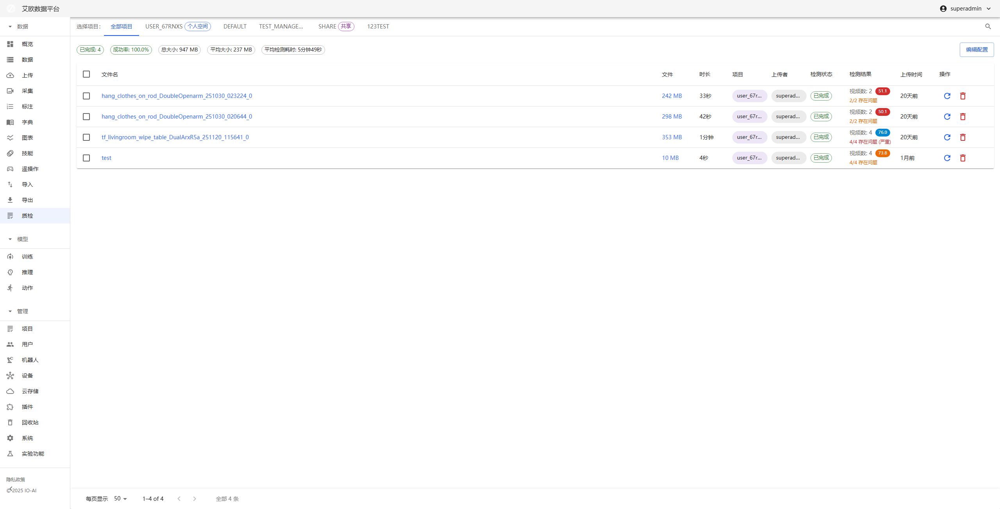
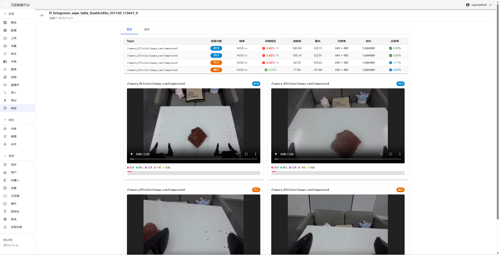
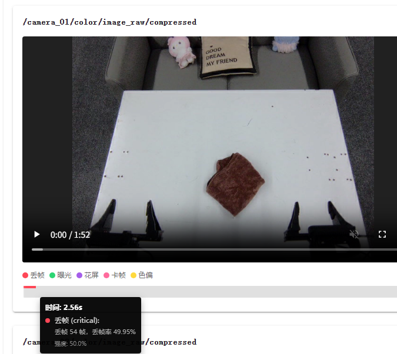
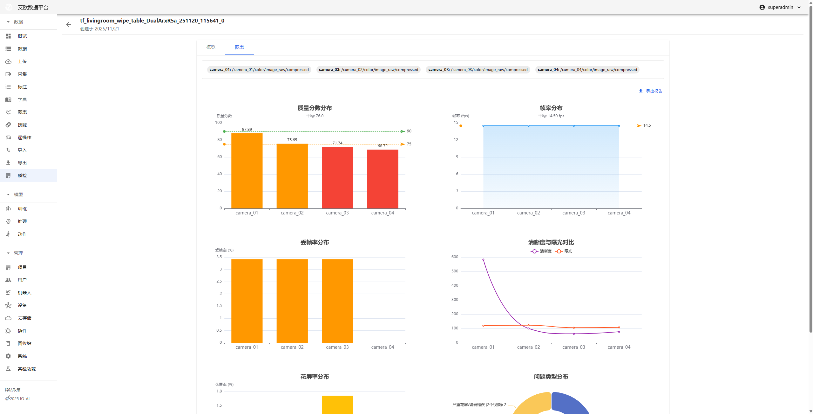

# Video Quality Inspection

Source: https://io-ai.tech/platform/en/guides/Modules/doctor/#related-features

- Feature Modules

- Video Quality Inspection

# Video Quality Inspection

This page coversmulti-stream video diagnostics (Doctor)for video inside MCAP: frame drops, artifacts, BRISQUE, etc. Forrule-based training-data QCon MCAP (frame rate, topics, sync, assertion rules), seeData QC.

How to efficiently locate video faults and ensure delivery quality?

Typical scenarios:

- Need to detect frame drops, stuttering, screen corruption and other issues in videos

- Need to evaluate video clarity, brightness, color and other quality metrics

- Need to quickly locate problem frames without watching entire video from start

- Need to generate quality inspection reports for team handoff and delivery acceptance

Thevideo quality inspectionmodule is designed to solve these problems. Through intelligent detection algorithms and interactive media playback, it helps teams efficiently locate video faults and ensure delivery quality.

## Detection Process​

## Quick Start: Inspect Your First Video​

### Step 1: Upload MCAP File​

- Go to the Video QC page, click "New Inspection Task"

- Upload MCAP file

- System automatically parses file and separates multiple video streams

- Wait for detection to complete

### Step 2: View Detection Results​

- Go to the Video QC details page

- View detection results overview

- Select video stream to view

- View anomaly event list

### Step 3: Review Anomalies​

- Click anomaly markers on timeline

- Player automatically jumps to problem frame

- Use frame-by-frame navigation to confirm issue

- Determine if it's algorithm false positive or real fault

## Intelligent Detection​

### Detection Types​

Smoothness and Integrity:

- Frame Drop: Detect frame loss in video, identify playback interruption

- Stutter: Detect still frames, identify freezing

- Screen Corruption: Detect mosaic, tearing, green screen and other screen anomalies

Frame Visibility:

- Blur: Detect blur caused by defocus

- Too Dark/Overexposed: Detect brightness anomalies affecting viewing

Color and Quality Assessment:

- Color Deviation: Detect overall color anomalies like red/green tint

- Quality Score: No-reference quality score (BRISQUE) based on human perception, quantifies video quality

### How to View Detection Results?​

Viewing Method:

- View detection results overview on the Video QC details page

- Select video stream to view

- View values of various detection metrics

- View visualization trend charts

Result Display:

- Detector Raw Data: Display values of various video metrics

- Visualization Trend Chart: Display quality trends of entire video through line charts

- Anomaly Event List: List all detected anomaly events

## Interactive Media Playback​

### How to Locate Anomaly Frames?​

Location Method:

- View anomaly markers (highlighted blocks) on timeline

- Click anomaly marker, player automatically jumps to problem frame

- Use frame-by-frame navigation for precise location

- Confirm if it's algorithm false positive or real fault

Playback Features:

- Anomaly Event Visualization: Mark anomaly time periods on timeline through highlighted blocks

- Precise Location: Click anomaly marker to directly jump to fault occurrence time

- Frame-by-Frame Navigation: Support frame-by-frame viewing for precise problem location

### How to Review Detection Results?​

Review Process:

- View anomaly event list

- Click anomaly event, jump to corresponding time point

- Watch video content, confirm issue

- Record review results

Review Points:

- Confirm if anomaly truly exists

- Assess impact of anomaly on video quality

- Determine if re-collection or processing is needed

## Visualization Data Analysis​

### How to View Quality Trends?​

Trend Analysis:

- Quality Trend Chart: Display quality changes of entire video through line charts

- Anomaly Distribution: View distribution of anomaly events on timeline

- Quality Fluctuation: Identify quality mutation points

Viewing Method:

- Select "Visualization Trend Chart" on the Video QC details page

- View trend charts of various metrics

- Identify quality mutation points

- Analyze reasons for quality fluctuations

### How to Export a Video QC Report?​

Report Content:

- Detection results overview

- Anomaly event list

- Quality metric charts

- Issue summary and suggestions

Export Method:

- Click "Export Report" on the Video QC details page

- Select export format (PDF)

- Wait for report generation

- Download report file

Report Uses:

- Team handoff and communication

- Delivery acceptance

- Issue archiving

- Quality improvement reference

## Detection Parameter Configuration​

### How to Adjust Detection Parameters?​

Parameter Types:

- Frame Drop Detection: Adjust timestamp tolerance, frame drop duration, etc.

- Screen Corruption Detection: Adjust color, structure, brightness anomaly thresholds

- Clarity Detection: Adjust blur threshold

- Brightness Detection: Adjust too dark/overexposed threshold

- Color Detection: Adjust color deviation intensity threshold

- Quality Assessment: Adjust quality score threshold

Adjustment Recommendations:

- High Quality Video Streams: Appropriately increase thresholds to reduce false positives

- Low Quality Video Streams: Appropriately decrease thresholds to improve detection rate

- Adjust parameters based on actual test results to find optimal balance

Configuration Method:

- Configure detection parameters in system settings

- Adjust parameters based on video quality characteristics

- Test detection effectiveness

- Optimize parameter configuration

## Common Questions​

### What to Do When Detection Results Are Inaccurate?​

Solution:

- Check if video file is complete

- Adjust detection parameters to adapt to video characteristics

- Review detection results to confirm if false positives

- Contact technical support for help

### How to Improve Detection Speed?​

Optimization Methods:

- Adjust frame sampling interval to reduce processed frames

- Select necessary detection types

- Use high-performance servers

- Process large videos in batches

### How to Batch Inspect Videos?​

Batch Method:

- Prepare multiple MCAP files

- Create batch inspection tasks

- System automatically processes all files

- View batch inspection results

## Applicable Roles​

### Administrator​

You can:

- Configure detection parameters

- Monitor inspection task execution status

- View overall quality statistics

- Develop quality improvement strategies

### Project Manager​

You can:

- View project video quality status

- Identify quality issues

- Coordinate issue handling

- Ensure delivery quality

### Video QC Specialist​

You can:

- Execute video inspection tasks

- Review detection results

- Generate video QC reports

- Provide quality issue feedback

## Related Features​

After completing video quality inspection, you may also need:

- Data Management: View inspected data

- Data Upload: Upload videos that need inspection

- System Settings: Configure detection parameters

## Images on this page

- 
- 
- 
- 
