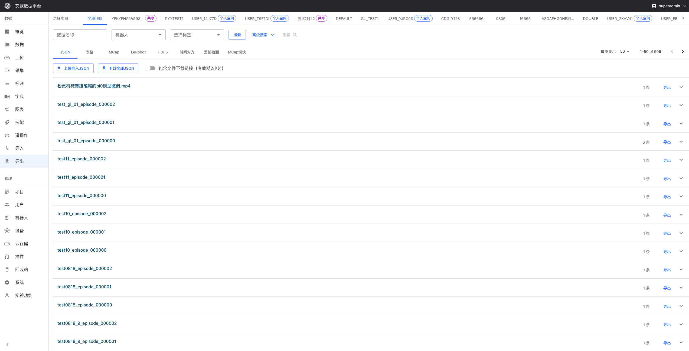

# Data Export

Source: https://io-ai.tech/platform/en/guides/Modules/export/#related-features

- Feature Modules

- Data Export

# Data Export

Annotated data needs to be exported in specific formats to be used for model training or data analysis. The platform supports multiple standard formats to meet the needs of different training frameworks and tools.

Typical use cases:

- Model Training: Export as LeRobot, HDF5 and other formats, directly used for training

- Data Analysis: Export as JSON, CSV formats, convenient for analysis and visualization

- Robot Playback: Export as MCap format, support complete data playback

- Image Annotation Training: Export as YOLO, COCO and other formats, adapt to mainstream detection frameworks

### Export Format to Trainable Model Mapping​

Choose export format based on target model: LeRobot format can be used directly for SmolVLA, ACT, Diffusion, etc.; LeRobot v2.1 with OpenPI for Pi0, Pi0.5. HDF5 suits other deep learning frameworks.

## Quick Start: Select Export Format​

### How to Choose Export Format?​

Choose appropriate format based on your use case:

Use Case

Recommended Format

Description

LeRobot Model Training

LeRobot

Support image/video mode, includes complete annotation information

Other Framework Training

HDF5

Universal scientific computing format, supports multimodal data

Data Analysis

JSON/CSV

Structured data, convenient for analysis and visualization

Robot Playback

MCap

ROS standard format, supports complete data playback

Image Object Detection

YOLO/COCO/VOC

Standard object detection formats, adapt to mainstream frameworks

Data Quality Analysis

Time Alignment/Frame Drop Detection

Time alignment and frame drop detection results

### Export Steps​

- Select Export Format: Select corresponding format tab at top of page

- Filter Data: Use project, time, annotator and other conditions to filter data to export

- Select Datasets: Check datasets that need to be exported

- Configure Parameters: Set export parameters according to format requirements (such as sampling frequency, image format, etc.)

- Start Export: Click export button, wait for processing to complete

- Download File: Download generated file after export completes

## Main Export Formats Explained​

### LeRobot Format Export​

Use Case: Use LeRobot framework for model training.

Export Configuration:

- Dataset Selection: Select datasets to export, supports multiple selection

- Image Format: Choose to export as image (jpg) or video (mp4) formatImage format: Each time point saved as separate image fileVideo format: Package data as video file, smaller file size

- Image format: Each time point saved as separate image file

- Video format: Package data as video file, smaller file size

- Sampling Frequency (hz): Control data sampling frequency, default 30HzLower frequency can reduce file sizeHigher frequency can get denser sampling

- Lower frequency can reduce file size

- Higher frequency can get denser sampling

- Strict Match: Whether to strictly match annotation time periods

- Face Blur(New in 3.3.0): Whether to blur face information during export, protect privacy

- Version Selection: Select export format version (latest or v2.1)

Export Quota:

- Display current user's export quota usage

- Display used count and total quota

- Cannot export when quota exceeded

Export Results:

- Exported LeRobot format data can be directly used for model training

- Support SmolVLA, ACT, Pi0 and other model training

- Files automatically packaged as tar.gz format

- Support direct download or use for training service

### HDF5 Format Export​

Use Case: Use other deep learning frameworks (such as PyTorch, TensorFlow) for training.

Export Configuration:

- Chunk Size: Set number of original files each HDF5 file containsSet to 1: Each original file corresponds to one HDF5 file (one-to-one)Set larger value: Merge multiple files into one HDF5 fileRecommend setting based on data volume and training needs

Chunk Size: Set number of original files each HDF5 file contains

- Set to 1: Each original file corresponds to one HDF5 file (one-to-one)

- Set larger value: Merge multiple files into one HDF5 file

- Recommend setting based on data volume and training needs

- Data Refresh Frequency (hz): Control number of data collections per second, affects file sizeDefault 30Hz, suitable for most scenariosCan lower frequency to reduce file sizeHigher frequency can get denser sampling

Data Refresh Frequency (hz): Control number of data collections per second, affects file size

- Default 30Hz, suitable for most scenarios

- Can lower frequency to reduce file size

- Higher frequency can get denser sampling

Export Statistics:

- Display number of selected datasets

- Display export quota usage

- Display export progress and estimated completion time

Export Results:

- Exported HDF5 files named by original file grouping (e.g.,chunk_001.hdf5)

chunk_001.hdf5

- Files automatically compressed as tar.gz format

- Support direct download or save to cloud storage

- Exported HDF5 files can be directly used for model training

HDF5 Export Details:

- For more information about HDF5 format and data structure, please refer to:HDF5 Dataset Documentation

- HDF5 files use hierarchical structure to organize data, support multimodal data storage

- Exported HDF5 files contain complete annotation information (task descriptions, action sequences, etc.)

### MCap Format Export​

Use Case: Need complete robot data playback, or integrate with other ROS systems.

Export Features:

- ROS standard multimodal data format

- Support complete data playback

- Maintain timestamp and message structure integrity

- Automatically compressed as tar.gz format

Export History and Progress:

- Display list of all MCap export tasks

- Real-time update of export task status (pending → processing → completed/failed)

- For tasks in progress, display real-time progress bar

- After export completes, can directly download generated MCap files

MCap Export Recommendations:

- When exporting large amounts of data, recommend batch export to improve success rate

- Can view previous export records through export history

- If export fails, can view error information and re-export

- Exported MCap files automatically compressed as tar.gz format to save space

### JSON/CSV Format Export​

Use Case: Data analysis, visualization, API integration.

JSON Format:

- Structured data format, suitable for programmatic processing

- Support API integration

- Convenient for data exchange

CSV Format:

- Table data format, suitable for analysis with Excel and other tools

- Convenient for data visualization

- Support large-scale data processing

### Image Annotation Export (New in 3.3.0)​

Use Case: Model training for image object detection, segmentation and other tasks.

Supported Annotation Types:

- BBOX: Bounding box annotation

- POINT: Point annotation

- POLYGON: Polygon annotation

- POLYLINE: Polyline annotation

- KEYPOINT: Keypoint annotation

- SEGMENTATION: Segmentation annotation

Export Formats:

- CSV: Table format, includes image paths and annotation coordinates

- YOLO: YOLO format, includes txt annotation files and class definitions

- COCO: COCO format, standard JSON format, supports object detection and segmentation

- Pascal VOC: VOC XML format, classic object detection format

- TAR: Complete package, includes all image files and annotation files

Usage Steps:

- Select project or dataset to filter annotation data

- Select annotation type (optional, export all types if not selected)

- Search and filter annotations to export

- Select export format

- Click export button, wait for processing to complete

- Download exported files

### Time Alignment Export​

Use Case: Data quality check, analyze time alignment of multiple sensor data.

Function Description:

- Analyze time alignment of multiple sensor data

- Export alignment results and statistics

- CSV format, convenient for data analysis

### Frame Drop Detection Export​

Use Case: Data quality assessment, detect frame drops in video files.

Function Description:

- Detect frame drops in video files

- Export frame drop time points and statistics

- CSV format, includes timestamps and frame drop information

### MCap Chunk Export​

Use Case: Split large MCap files into multiple small files for easy processing and management.

Function Description:

- Split MCap files by time or size

- Maintain data integrity and time continuity

- Split files can be used independently

## Export Management​

### How to Filter Data to Export?​

Filter Conditions:

- Project Filter: Select data from specific projects

- Time Range: Select data from specific time periods

- Annotator Filter: Select data annotated by specific annotators

- Quality Level: Filter data by annotation quality

- Dataset Selection: Directly check datasets that need to be exported

Preview Function:

Before export, can preview filter results to confirm exported data meets expectations, avoid unnecessary export operations.

### Export Task Queue​

Task Status:

- pending(Pending): Export task created, waiting for execution

- processing(Processing): Export task executing

- completed(Completed): Export task successfully completed, file generated

- failed(Failed): Export task execution failed, can view error information

Progress Monitoring:

- Real-time display of export progress percentage

- Display number of processed datasets and total number

- Display estimated remaining time

- Support automatic refresh of progress status

Batch Export:

- Support batch export of multiple datasets

- Can process multiple export tasks simultaneously

- Process large export requests in order through task queue

### Export History Management​

History Record Information:

- Export Time: Creation time, start time, completion time

- Export Format: Export data type (HDF5, LeRobot, MCAP, JSON, CSV, etc.)

- Data Volume: Number of included datasets and file size

- Operator: User information who executed export operation

- Export Status: Current export task status

- File Information: Export file name, size, storage location

History Record Functions:

- Support filtering export records by time, format, status and other conditions

- Support searching specific export tasks

- Display detailed information of export tasks, including list of included datasets

- Support viewing error information of export tasks (if failed)

- Support re-downloading exported files

## Export Quota Management​

### What is Export Quota?​

Export quota is used to control resource usage and ensure reasonable allocation of system resources.

Quota Types:

- User Quota: Each user has independent export quota limit

- Global Quota: System-level total quota limit (administrator configured)

- Quota Statistics: Real-time display of used quota and remaining quota

Quota Display:

- Export page displays current user's quota usage

- Display used count and total quota limit

- Display whether it's administrator-configured global quota

Quota Control:

- When quota exceeded, will prompt and block export operations

- Administrators can view and manage all users' quotas

- Support quota reset and adjustment (administrator permission)

### Quota Management Page (Administrator)​

Administrators can:

- View export quota usage of all users

- Configure global export quota limits

- Adjust individual user quotas

- View export history statistics

## Common Questions​

### How to Choose Appropriate Export Format?​

Selection Recommendations:

- Determine Training Framework: If using LeRobot, choose LeRobot format; if using other frameworks, choose HDF5

- Determine Data Purpose: If for data analysis, choose JSON/CSV; if for robot playback, choose MCap

- Determine Annotation Type: If image annotation, choose corresponding image format (YOLO/COCO/VOC)

- Consider File Size: Video format usually smaller than image format files, but processing may be more complex

### What to Do When Export Task Fails?​

Possible Causes:

- Data Volume Too Large: Try batch export

- Network Issues: Check network connection, retry export

- Insufficient Storage Space: Contact administrator to check storage space

- Format Error: Check if data format meets export requirements

Solution:

- View error information to understand failure reason

- Fix issues based on error information

- Retry export

- If problem persists, contact technical support

### How Long Does Export Take?​

Time Estimation:

Export time depends on:

- Data Volume: More data means longer export time

- Export Format: Some format conversions need more time

- System Load: May be slower when system is busy

General Cases:

- Small datasets (less than 10): 1-5 minutes

- Medium datasets (10-50): 5-15 minutes

- Large datasets (more than 50): More than 15 minutes

Recommendations:

- When exporting large amounts of data, recommend batch export

- Can view progress in export history

- Will receive notification after export completes

### How to View Export History?​

Viewing Method:

- Go to Data Export page

- View export history in corresponding format tab

- Can filter by time, status and other conditions

- Click history record to view detailed information

History Record Information:

- Export time, format, data volume

- Export status and progress

- File download link

- Error information (if failed)

## Applicable Roles​

### Administrator​

You can:

- Deliver training data or data needed for downstream analysis externally

- Manage export tasks, monitor export progress

- Control data export permissions

- Manage export quotas

### Project Manager​

You can:

- Export project-related data

- Prepare data for project delivery

- Monitor data usage

- Coordinate data export work

### Training Engineer​

You can:

- Export annotated data for model training

- Select export format suitable for training framework

- Configure export parameters to meet training needs

- Download exported training data

## Related Features​

After completing data export, you may also need:

- Data Management: View and manage data to export

- Annotation Tasks: View annotation task completion status

- Model Training: Use exported data for model training

## Images on this page

- 
