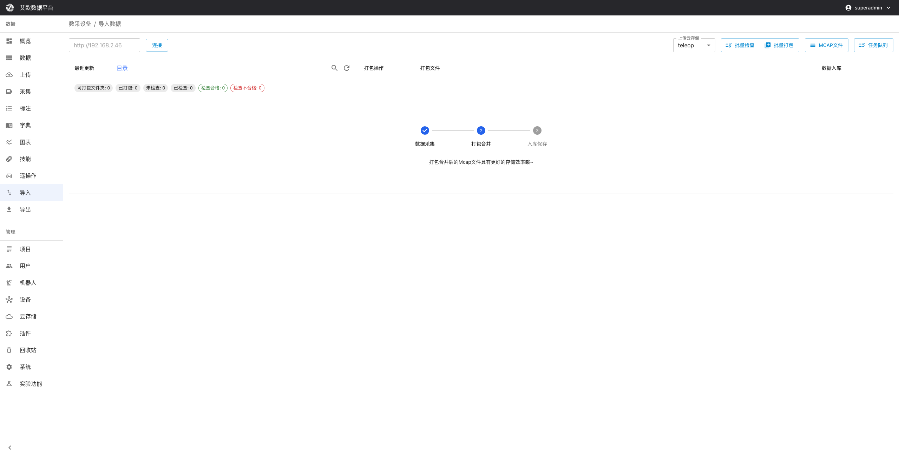

# Data Import

Source: https://io-ai.tech/platform/en/guides/Modules/import/#related-features

- Feature Modules

- Data Import

# Data Import

Data import is used to batch import data from external systems to the platform. Mainly supports two scenarios: importing MCap files from local IO-AI Agent devices, and importing LeRobot format datasets.

Typical use cases:

- Offline Collection Data Import: Batch import data from local collection devices

- External Dataset Import: Import LeRobot format datasets

- Data Migration: Migrate data from other systems to platform

### Data Ingestion Overview​

Data can enter the platform via IO Agent, LeRobot packages, or local upload; after ingestion or transcoding it appears in Data Management for annotation and export.

## Quick Start: Import Data from IO-AI Agent​

### What is IO-AI Agent?​

IO-AI Agent is software running on local devices, used to manage collected MCap files. Through data import functionality, these files can be batch imported to the platform.

### Import Steps​

Step 1: Configure Agent Address

- On import page, enter IO-AI Agent service address

- System will automatically detect Agent service status

- After connection succeeds, can browse files on Agent device

Step 2: Select Files to Import

- Browse MCap files on Agent device

- Display file size, creation time and other metadata

- Support search and filter files by name

- Check files that need to be imported

Step 3: Select Storage Method

Each file can choose two storage methods:

- Cloud: Download file and upload to cloud storage (recommended)File will be downloaded from Agent deviceThen uploaded to configured cloud storageSuitable for data that needs long-term storage

Cloud: Download file and upload to cloud storage (recommended)

- File will be downloaded from Agent device

- Then uploaded to configured cloud storage

- Suitable for data that needs long-term storage

- Local: Only create dataset record, file remains on Agent deviceDon't download file, only create metadataFile access depends on Agent device being onlineSuitable for temporary data or saving storage space

Local: Only create dataset record, file remains on Agent device

- Don't download file, only create metadata

- File access depends on Agent device being online

- Suitable for temporary data or saving storage space

Step 4: Start Import

- Click "Cloud" or "Local" button to start import

- System will display import progress

- After import completes, files will appear on Data Management page

### Batch Import​

Batch Operations:

- Can check multiple files for batch import

- Support batch select all files

- Batch import will process one by one in order

Import Queue:

- Import tasks will join queue, execute in order

- Can view import status of each file

- Support canceling ongoing import tasks

## LeRobot Format Import (New in 3.4.0)​

### What is LeRobot Format?​

LeRobot is a popular robot learning framework. If you have LeRobot format datasets, you can directly import them to the platform.

Supported Formats:

- LeRobot standard folder structure

- Includes images, videos and annotation data

- Support compressed package (tar.gz) format import

Format Requirements:

- Comply with LeRobot standard folder structure

- Include necessary metadata file (meta/info.json)

meta/info.json

- Annotation data format is correct

### Import Steps​

- Select Data Source: Select LeRobot format folder or compressed package

- Format Validation: System automatically identifies format and validates data integrity

- Data Parsing: Extract metadata and annotation information

- Create Dataset: Automatically create dataset and associate annotations

- Complete Import: After import completes, can view in data page

LeRobot Import Notes:

- Before import, ensure folder structure complies with LeRobot standards

- Support batch import of multiple folders

- Import process automatically validates data integrity

## Import Management​

### How to View Import Progress?​

Task Status:

- Pending: Task created, waiting for execution

- Processing: Downloading or uploading files

- Completed: File successfully imported, dataset created

- Failed: Error occurred during processing, can view error information

Progress Information:

- Real-time display of each file's processing status

- Display upload progress percentage

- Display number of processed files and total number

- Display estimated remaining time

### Import Task Queue​

Queue Functions:

- Display list of all import tasks

- Support filter by status (pending, processing, completed, failed)

- Support search specific tasks

- Display task creation time and processing progress

Task Operations:

- View Details: View task details and included files

- Cancel Task: Cancel ongoing tasks

- Retry Task: Retry failed tasks

- Delete Task: Delete completed tasks

### Error Handling​

Common Error Types:

- Network Error: Download or upload failed, support retry

- Format Error: File format incorrect, need to check file

- Storage Error: Cloud storage configuration issue, need to check configuration

- Data Error: Data corrupted or format incompatible

Error Recovery:

- Auto Retry: Temporary errors can auto recover

- Manual Retry: Failed tasks can be re-executed

- Error Logs: Record detailed error information for troubleshooting

## Common Questions​

### What to Do When Agent Connection Fails?​

Possible Causes:

- Address Error: Check if Agent service address is correct

- Network Unreachable: Confirm if browser can access Agent address

- Service Not Started: Confirm if IO-AI Agent software is running

- Firewall Blocking: Check firewall settings

Solution:

- Directly access Agent address in browser, confirm if accessible

- Check if Agent software is running normally

- Confirm network connection is normal

- If problem persists, contact technical support

### What to Do When Import Speed is Slow?​

Possible Causes:

- Network Bandwidth: Insufficient network bandwidth affects download and upload speed

- File Size: Large files need more time

- System Load: May be slower when system is busy

Optimization Recommendations:

- Check network connection, ensure sufficient bandwidth

- Large files recommend batch import

- Avoid system peak hours for import

- Using "Local" storage method can skip upload step

### What to Do When Import Fails?​

Handling Steps:

- View error information to understand failure reason

- Take corresponding measures based on error type:Network error: Check network connection then retryFormat error: Check if file format is correctStorage error: Check cloud storage configuration

- Network error: Check network connection then retry

- Format error: Check if file format is correct

- Storage error: Check cloud storage configuration

- Click "Retry" button to re-import

- If problem persists, contact technical support

### How to Know if File Has Been Imported?​

Check Method:

- On import page, imported files will show "Completed" status

- Search file name on Data Management page, confirm dataset has been created

- View import history records, confirm import success

Duplicate Import:

If file already exists, system will detect and prompt. Can choose:

- Skip: Don't duplicate import

- Overwrite: Re-import and overwrite existing data

## Applicable Roles​

### Administrator​

You can:

- Centrally import offline collection data

- Standardize data entry process

- Monitor import progress

- Handle issues during import process

- Configure Agent connection and cloud storage

### Project Manager​

You can:

- Import project-related data

- Manage import tasks

- Monitor import progress

- Ensure data quality

### Collector​

You can:

- Import data from collection devices

- Batch import data from collection tasks

- View import status and progress

- Handle import errors

## Related Features​

After completing data import, you may also need:

- Data Management: View and manage imported data

- Data Upload: Manually upload single files

- Annotation Tasks: Create annotation tasks for imported data

## Images on this page

- 
