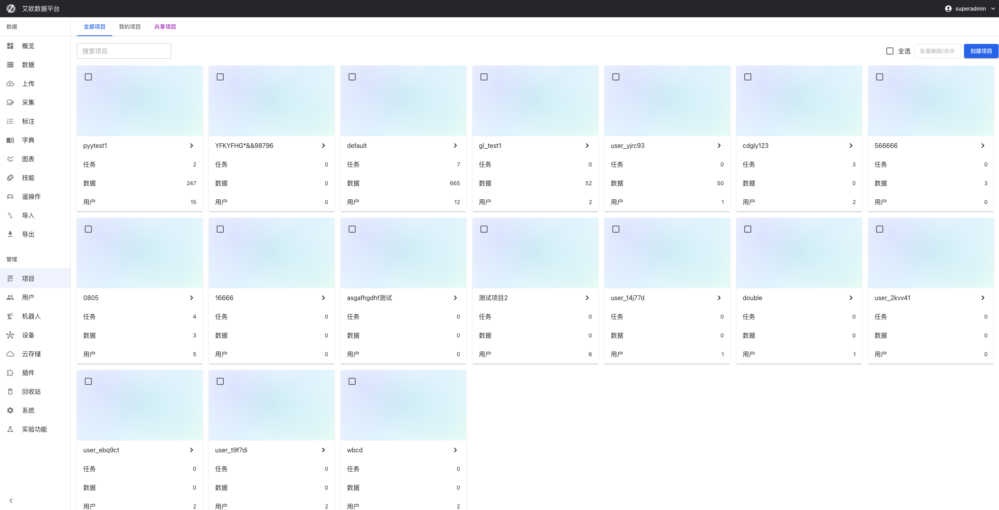
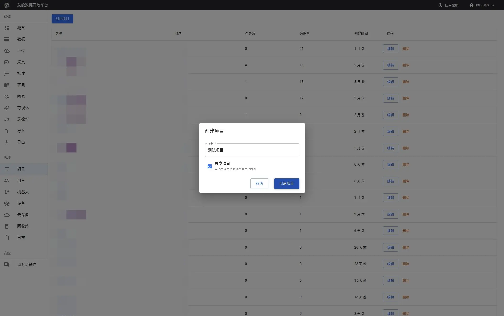
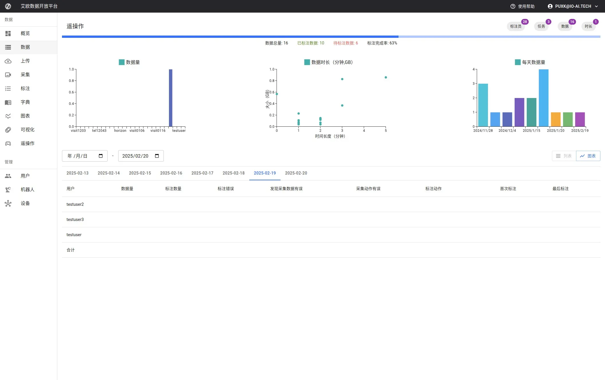

# Project Management

Source: https://io-ai.tech/platform/en/guides/Modules/projects/#related-features

- Feature Modules

- Project Management

# Project Management

When teams are working on multiple projects simultaneously, how do you ensure data, tasks, and members don't get confused?

Typical scenarios:

- Company working on multiple client projects simultaneously, need data isolation

- Different projects use different annotation standards and quality requirements

- Team members may participate in multiple projects, need clear permission management

- Need to count progress and quality by project for reporting

Project management is designed to solve these problems. Projects are the basic unit of permission and data isolation. All data, tasks, and members belong to specific projects.

## Quick Start: Create Your First Project​

### Step 1: Create Project​

- Go to Project Management page, click "New Project"

- Fill in project information:Project Name: Clearly describe project content (e.g., "Client A - Grasping Task")Project Description: Additional notes on project goals and scope (optional)Project Type: Select personal project, team project, or shared projectPublic Settings: Whether to make public, visible to all users after public

- Project Name: Clearly describe project content (e.g., "Client A - Grasping Task")

- Project Description: Additional notes on project goals and scope (optional)

- Project Type: Select personal project, team project, or shared project

- Public Settings: Whether to make public, visible to all users after public

- Confirm creation

### Step 2: Add Project Members​

After project is created, need to add members:

- Go to project details page

- Switch to "Members" tab

- Click "Add Member", select users

- Assign roles:Project Administrator: Full permission management for projectProject Manager: Daily project management and task assignmentAnnotator: Execute annotation tasksReviewer: Review annotation resultsObserver: View project information but no operation permissions

- Project Administrator: Full permission management for project

- Project Manager: Daily project management and task assignment

- Annotator: Execute annotation tasks

- Reviewer: Review annotation results

- Observer: View project information but no operation permissions

### Step 3: Configure Project Settings​

On project details page you can configure:

- Storage Quota: Set storage space available to project

- Annotation Standards: Set project annotation standards and processes

- Quality Requirements: Configure quality check rules and thresholds

## Project Views​

### How to View Projects?​

Project List View:

Page provides three views:

- My Projects: Only display projects you participate in

- Shared Projects: Display all public shared projects

- All Projects(Administrator): Display all platform projects

Project Card Information:

Each project card displays:

- Project name and description

- Project statistics: Data volume, task count, member count

- Project progress: Annotation completion status

- Project status: In progress, completed, archived

### Project Details Page​

Enter project details page, you can view:

Overview Information:

- Project basic information and statistics

- Total data volume, total tasks, member count

- Project progress and quality metrics

Function Tabs:

- Data: View all data associated with project

- Tasks: View all annotation tasks associated with project

- Members: Manage project members and permissions

- Statistics: View detailed project statistics

## Advanced Usage​

### How to Manage Project Members?​

Add Members:

- Go to project details page, switch to "Members" tab

- Click "Add Member"

- Select members to add from user list

- Assign roles and permissions

- Confirm addition

Role Description:

- Project Administrator: Can manage all project settings and members

- Project Manager: Can create tasks, assign work, view statistics

- Annotator: Can view tasks assigned to themselves and perform annotation

- Reviewer: Can review annotation results

- Observer: Can only view project information, cannot perform operations

Permission Control:

Different roles have different permissions:

- Data Access: Control which data members can access

- Operation Permissions: Control which operations members can perform

- Feature Modules: Control which features members can use

### How to Configure Project Storage?​

Storage Quota:

- Go to project details page

- Click "Storage Configuration"

- Select cloud storage and set storage quota

- Save configuration

Storage Quota Note:

- Each project can set independent storage quota

- Cannot upload new data when quota exceeded

- Administrators can adjust quota

### How to View Project Statistics?​

Statistics Information:

On project details page "Statistics" tab you can view:

- Data Statistics: Total data volume, type distribution, storage usage

- Task Statistics: Total tasks, completion status, quality metrics

- Member Statistics: Member workload and efficiency

- Progress Trends: Project progress changes over time

Statistics Reports:

- Project Progress Report: Detailed progress analysis

- Annotation Quality Report: Quality metrics and trends

- Resource Usage Report: Storage and computing resource usage

- Team Performance Report: Member work performance analysis

### How to Merge Projects?​

Batch Merge:

If multiple projects need to be merged:

- Select projects to merge in project list

- Click "Batch Merge"

- Select target project (project to keep)

- Confirm merge

⚠️Note: Merge operation will merge source projects' data, tasks, members into target project, source projects will be deleted. This operation is irreversible, please operate with caution.

## Project Collaboration​

### How to Organize Multi-Project Collaboration?​

Project Isolation:

Each project's data and tasks are completely isolated:

- Project A members cannot access Project B data

- Different projects can use different annotation standards

- Data between projects won't be confused

Cross-Project Collaboration:

If cross-project collaboration is needed:

- Can share data to other projects

- Can delegate permissions to other project administrators

- Can unify annotation standards and norms

### How to Manage Project Lifecycle?​

Project Startup:

- Create project and configure basic information

- Add project members

- Set annotation standards and quality requirements

Project Execution:

- Track project progress

- Monitor annotation quality

- Manage project resources

Project Closure:

- Accept project deliverables

- Archive project data

- Summarize project experience

## Common Questions​

### How to Choose Appropriate Project Type?​

Project Type Description:

- Personal Project: Only creator can access, suitable for personal use

- Team Project: Team members can access, suitable for team collaboration

- Shared Project: Visible to all users, suitable for public data

Selection Recommendations:

- Client projects recommend using team projects to ensure data isolation

- Personal experiments recommend using personal projects

- Public datasets recommend using shared projects

### How to Set Project Member Permissions?​

Permission Setting Recommendations:

- Project Administrator: Usually only 1-2 people, responsible for overall project management

- Project Manager: Responsible for daily management and task assignment

- Annotator: Add based on workload, usually 5-10 people

- Reviewer: Responsible for quality control, usually 1-3 people

### How to View Project Progress?​

Viewing Method:

- Go to project details page

- View progress statistics in overview information

- Switch to "Statistics" tab to view detailed reports

- View "Tasks" tab to understand task completion status

### Can Project Data Be Exported?​

Yes. Project data can be exported throughData Exportfunction:

- On Data Management page, select project filter

- Select data to export

- Use export function to export data

## Applicable Roles​

### Administrator​

You can:

- Create new projects and configure basic parameters

- Manage project member permissions

- Allocate storage and computing resources

- Monitor project operation status

- Merge or archive projects

### Project Manager​

You can:

- Manage project daily affairs

- Coordinate team member work

- Control project progress

- Control project quality

- View project statistics reports

## Related Features​

After completing project management, you may also need:

- User Management: Manage team members

- Data Management: View and manage project data

- Annotation Tasks: Create annotation tasks for projects

## Images on this page

- 
- 
- 
- 
- 
