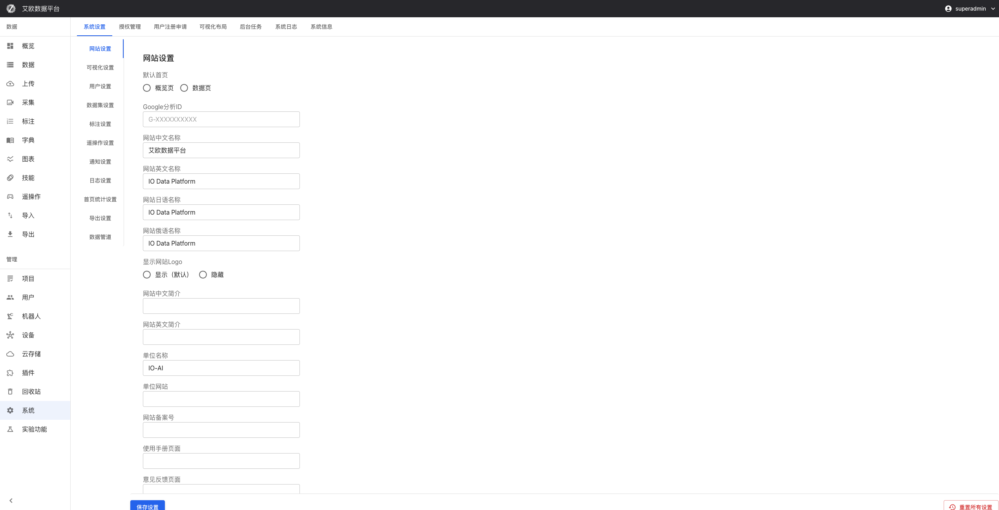

# System Settings

Source: https://io-ai.tech/platform/en/guides/Modules/system/#related-features

- Feature Modules

- System Settings

# System Settings

System settings are used to customize platform appearance, functionality, and behavior. Based on different use cases, you can configure brand information, interface styles, function parameters, etc.

Typical use cases:

- Brand Customization: Upload company logo, set theme colors, create exclusive platform

- Interface Simplification: Hide unnecessary menu items, focus on core functions

- Function Configuration: Set data formats, annotation standards, export rules, etc.

- System Maintenance: Configure logs, notifications, storage and other system parameters

## Brand Customization​

### How to Upload Logo?​

Use Case: Replace platform default logo, use company or organization logo.

Operation Steps:

- Go to "System Settings" > "Logo Settings"

- Click "Upload" button to select image file

- System will automatically validate format and size, and perform compression

- Takes effect immediately after successful upload, can preview effect on page

- To restore default logo, click "Delete" button

Format Requirements:

- Supported formats: PNG, JPEG, SVG

- File size limit: 2MB

- Automatic compression optimization to ensure best display effect

Logo will be displayed on login page, navigation bar and other locations.

### How to Customize Favicon? (New in 3.4.0)​

Use Case: Replace icon on browser tab.

Operation Steps:

- Go to "System Settings" > "Logo Settings"

- Click "Upload" in Favicon configuration section

- Select icon file

- Takes effect immediately after upload, no need to restart service

Format Requirements:

- Supported formats: PNG, JPEG, SVG, ICO

- Recommended size: 32x32 pixels

### How to Customize Theme? (New in 3.4.0)​

Use Case: Customize platform color scheme, create interface that matches corporate image.

Theme Features:

- Multi-Theme Support: Can create multiple custom themes, flexibly switch

- Dual-Mode Themes: Each theme includes light and dark modes

- Real-Time Preview: Real-time preview effect when uploading or editing themes

- Theme Management: Support enable/disable, set default theme, edit and delete operations

Upload Custom Theme:

- Go to "System Settings" > "Style Theme Settings"

- Click "Upload Theme" button

- Prepare theme configuration file (JSON format), must includelightanddarkconfiguration objects

light

dark

- Can upload via drag-and-drop or click to select file

- Fill in theme name and description

- Switch light/dark mode in preview area to view effect

- Click "Upload" to save after confirming no issues

Theme Configuration Format:
Theme configuration file is JSON format, structure as follows:

{"light":{"palette":{"mode":"light","primary":{"main":"#1976d2"},"secondary":{"main":"#dc004e"}}},"dark":{"palette":{"mode":"dark","primary":{"main":"#90caf9"},"secondary":{"main":"#f48fb1"}}}}

{"light":{"palette":{"mode":"light","primary":{"main":"#1976d2"},"secondary":{"main":"#dc004e"}}},"dark":{"palette":{"mode":"dark","primary":{"main":"#90caf9"},"secondary":{"main":"#f48fb1"}}}}

Theme Management Operations:

- Enable/Disable: Control theme availability through switch

- Set Default Theme: Click star icon to set theme as system default

- Edit Theme: Can modify theme name, description and configuration (built-in themes cannot be edited)

- Delete Theme: Delete unnecessary custom themes (built-in themes cannot be deleted)

- Download Template: Can download built-in themes as configuration reference

💡Recommendation: Download built-in themes as templates first, then modify based on them.

### How to Hide Menu Items? (New in 3.3.0)​

Use Case: Simplify interface, focus on core functions, hide temporarily unused function modules.

Operation Steps:

- Go to "System Settings" > "Menu Settings"

- Check menu items to hide

- Hidden menu items will not display in all users' menus

- System Settings page is not affected by this configuration, always visible

Menu Display Style:

- Level 1 and 2 Separated(Default): Level 1 and level 2 menus displayed separately, clear structure

- All Expanded: All menu items displayed flat, convenient for quick access

Can choose appropriate display method based on usage habits.

## Site Configuration​

### How to Set Site Name?​

Use Case: Configure independent site names for different languages, support multilingual users.

Operation Steps:

- Go to "System Settings" > "Website Settings"

- Configure site name:Chinese nameEnglish nameJapanese name (optional)

- Chinese name

- English name

- Japanese name (optional)

- Set default homepage (overview page or data page)

- Configure site description information (supports multiple languages)

### How to Configure Brand Information?​

Brand Information Configuration:

- Organization Name: Set enterprise or organization name

- Organization Website: Configure enterprise official website link

- Website ICP Record: Set ICP record information (applicable to domestic deployment)

- Hide Brand Introduction: When enabled, will hide all introduction copy about IO-AI related products, suitable for resale scenarios

### How to Configure External Links?​

External Link Configuration:

- User Manual Page: Configure custom user manual link

- Feedback Page: Configure feedback form link

These links will be displayed in corresponding positions on platform for user access.

## Function Configuration​

### Dataset Configuration​

Storage Configuration:

- Configure data storage related parameters

- Set capacity limits

- Configure backup strategies

Format Support:

- Configure supported data formats

- Set file size limits

- Configure conversion rules

Quality Control:

- Configure data quality control parameters

- Set validation rules

- Configure anomaly handling

### Annotation Configuration​

Annotation Standards:

- Configure annotation-related standard parameters

- Set annotation norms and quality requirements

- Define review processes

Tool Configuration:

- Configure annotation tool parameters

- Set tool types and functions

- Configure keyboard shortcuts

Workflow:

- Configure annotation workflows

- Set task assignment rules

- Configure progress tracking and quality control

### Export Configuration​

Export Formats:

- Configure supported data export formats (JSON, CSV, HDF5, etc.)

- Set export parameters and options

Export Permissions:

- Configure permission control for data export

- Set user permissions and data scope

- Configure operation restrictions

Export History:

- Configure export history management parameters

- Set record saving and query functions

- Configure cleanup strategies

### Data Pipeline Configuration​

Data Processing:

- Configure data processing workflows and parameters

- Set data cleaning, format conversion, quality check rules

Data Synchronization:

- Configure data synchronization related parameters

- Set synchronization frequency and scope

- Configure conflict handling rules

Data Monitoring:

- Configure data pipeline monitoring parameters

- Set performance monitoring and anomaly detection

- Configure alert settings

## System Configuration​

### User Management Configuration​

Authentication Settings:

- Configure user authentication related parameters

- Set password policies, login restrictions, session timeout

Permission Configuration:

- Configure user permission management parameters

- Set role definitions, permission assignment, access control

### Notification Configuration​

Notification Channels:

- Configure notification sending channels (email, SMS, system messages, etc.)

- Ensure notifications can be delivered in time

Notification Rules:

- Configure notification sending rules

- Set trigger conditions, sending frequency, content templates

User Preferences:

- Configure user notification preferences

- Set receiving methods, notification types, time settings

### Log Configuration​

Log Levels:

- Configure system log levels and content

- Set error logs, operation logs, performance logs

Log Storage:

- Configure log storage methods

- Set storage location, retention time, compression strategies

Log Analysis:

- Configure log analysis related parameters

- Set analysis rules, report generation, alert settings

### Homepage Statistics Configuration​

Statistics Metrics:

- Configure statistics metrics displayed on homepage

- Set data volume, user count, task count, etc.

Chart Settings:

- Configure statistics chart display parameters

- Set chart types, time ranges, data sources

Refresh Frequency:

- Configure statistics data refresh frequency

- Set real-time updates, scheduled refresh, manual refresh

### Teleoperation Configuration​

Device Management:

- Configure teleoperation device management parameters

- Set device types, connection methods, status monitoring

Data Collection:

- Configure data collection related parameters

- Set collection frequency, data format, storage methods

Security Control:

- Configure teleoperation security control parameters

- Set access permissions, operation restrictions, security monitoring

## Common Questions​

### How to Restore Default Configuration?​

Restore Method:

- Go to "System Settings" page

- Click "Reset Configuration" button

- Confirm reset operation

⚠️Note: Reset operation will restore all configurations to factory settings, this operation is irreversible.

### When Do Configuration Changes Take Effect?​

Effective Time:

- Logo and Favicon: Takes effect immediately after upload

- Theme Configuration: Takes effect immediately after upload

- Menu Settings: Takes effect immediately after save

- Other Configurations: Takes effect immediately after save, some configurations may need page refresh

### How to Backup System Configuration?​

Backup Method:

- Export system configuration (if supported)

- Or record values of key configuration items

- Regular backup for easy recovery

## Applicable Roles​

### Administrator​

You can:

- Perform system initialization

- Configure all system parameters

- Monitor system operation status

- Handle system issues

- Customize platform appearance and functionality

## Related Features​

After completing system settings, you may also need:

- Project Management: Configure project-related settings

- User Management: Configure user permission rules

## Images on this page

- 
