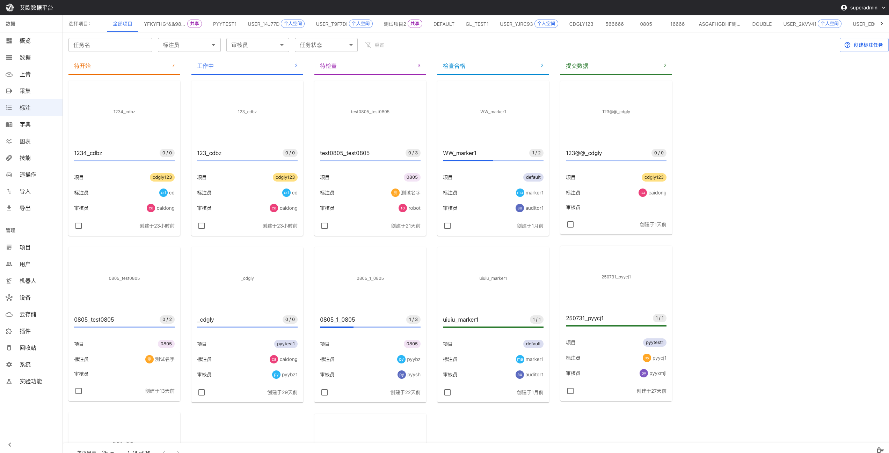
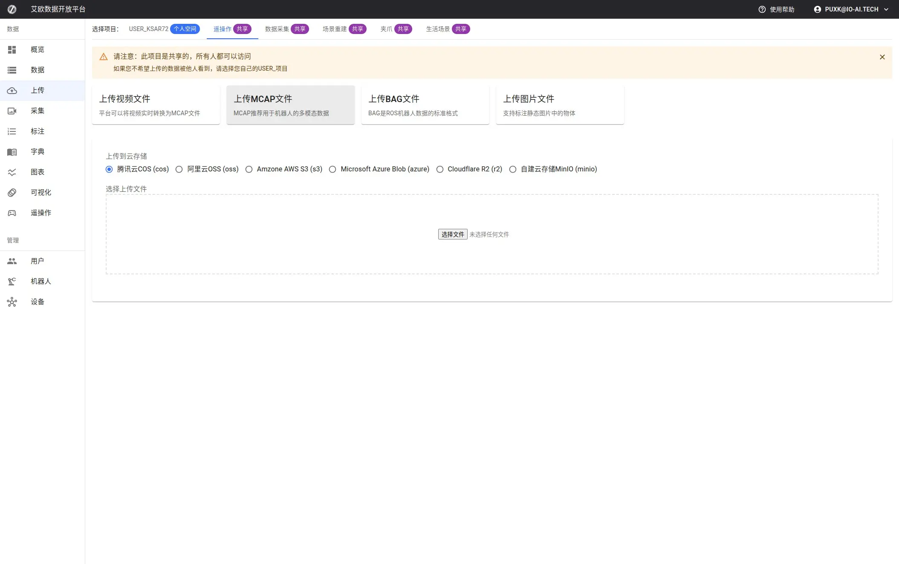

# Data Upload

Source: https://io-ai.tech/platform/en/guides/Modules/upload/#related-features

- Feature Modules

- Data Upload

# Data Upload

Manual Upload Usually Not Needed

IO-AI data collection devices support one-click batch automatic upload. If you're using IO-AI collection devices, data will automatically sync to platform without manual operation.

When Do You Need Manual Upload?

- Data files obtained from external systems

- Data collected using other devices

- Data downloaded from public datasets

- Need to re-upload previously deleted data

If manual upload is frequently needed, can contact IO-AI for integration adaptation to achieve automated upload process.

When you need to import external data into the platform, the Data Upload function provides a complete solution. The platform supports multiple formats and can automatically convert to standard formats, so you don't need to worry about technical details.

### Data Ingestion Overview​

Local upload supports MCAP, BAG, video, audio, LeRobot, and other formats; video and audio are converted to MCAP in the browser. After upload, data appears in Data Management for annotation and export.

## Quick Start: Complete Upload in 3 Steps​

### Step 1: Select Project and Storage​

At top of page, select:

- Project: Which project data will belong to (or personal space)

- Cloud Storage: Where data will be stored (if multiple cloud storage configured)

💡Tip: If only one cloud storage, system will automatically select, no need to manually set.

### Step 2: Select File Type​

Based on your data format, select corresponding file type:

- MCAP: Robot multimodal data standard format (recommended)

- BAG: ROS robot data (will automatically convert to MCAP)

- Video: MP4, AVI, MOV, etc. (will convert to MCAP in browser)

- Audio: MP3, WAV, etc. (will convert to MCAP)

- Images: JPG, PNG, etc.

- HDF5: Scientific computing data format

- LeRobot: LeRobot format dataset folder (New in 3.4.0)

After selecting file type, system will display corresponding upload interface.

### Step 3: Upload Files​

Drag and Drop Upload:

Directly drag and drop files or folders to upload area. Supports:

- Single file upload

- Multiple files upload simultaneously

- Entire folder upload (LeRobot format)

Click Upload:

Click upload area, select files from file picker.

After upload starts, system will display real-time progress, including:

- Upload speed (e.g., 5MB/s)

- Uploaded size and total size

- Estimated remaining time

## Format Conversion Explained​

### How Are Video Files Converted to MCAP?​

Why Do We Need Conversion?

MCAP is the standard format for robot data. Unified format facilitates subsequent annotation, export and training. After video files are converted to MCAP, they can be normally played and processed in the platform.

Conversion Process:

- Select Video File: Support mainstream formats like MP4, AVI, MOV, MKV, etc.

- Configure Conversion Parameters(Optional):Image Quality: 20%, 50%, 70%, 100% (default 70%)Higher quality means larger file and longer conversion time70% quality balances quality and sizeVideo Frame Rate: Auto, 10 FPS, 15 FPS, 30 FPS (default auto)Auto mode will select based on original video frame rateLower frame rate can reduce file sizeInclude Audio: Whether to retain audio track in video

- Image Quality: 20%, 50%, 70%, 100% (default 70%)Higher quality means larger file and longer conversion time70% quality balances quality and size

- Higher quality means larger file and longer conversion time

- 70% quality balances quality and size

- Video Frame Rate: Auto, 10 FPS, 15 FPS, 30 FPS (default auto)Auto mode will select based on original video frame rateLower frame rate can reduce file size

- Auto mode will select based on original video frame rate

- Lower frame rate can reduce file size

- Include Audio: Whether to retain audio track in video

- Start Conversion: System converts in real time in browser, no server processing needed

- Automatic Upload: Automatically uploads to cloud storage after conversion completes

Conversion Time Estimation:

- 1 minute video, 70% quality: About 30 seconds

- 5 minute video, 70% quality: About 2-3 minutes

- 10 minute video, 70% quality: About 5-6 minutes

💡Recommendation: If video is very long, can lower quality and frame rate first, decide if high-quality version needed after upload.

Browser Compatibility:

Video conversion requires browser support for MediaStreamTrackProcessor API. Currently only Chrome 94+ and Edge 94+ support.

If using Firefox or Safari, system will display clear error prompt. Recommendations:

- Use Chrome or Edge browser

- Or convert video to MCAP format first then upload

- Contact technical support for other solutions

### How Are Audio Files Converted to MCAP?​

Audio files are automatically converted to ROS standard AudioData message format:

- Supported Formats: MP3, WAV, AAC, OGG, etc.

- Automatic Metadata Extraction: Sample rate, channel count, format, etc.

- Message Frequency: Fixed at 10Hz, ensures synchronization with robot data

- Multi-Channel Support: Automatically handles multi-channel audio

Conversion process completes in browser, no additional configuration needed.

### How Are BAG Files Converted to MCAP?​

BAG files are standard format for ROS robot data. After uploading BAG files:

- Automatic Recognition: System automatically recognizes ROS1 or ROS2 format

- Extract Topics: Extract all topics and messages

- Maintain Integrity: Timestamps and message structure completely preserved

- Background Conversion: Conversion happens in server background, no need to wait

Converted MCAP files can be normally used in platform, all functions same as native MCAP files.

### How to Upload LeRobot Format? (New in 3.4.0)​

LeRobot is a popular robot learning framework. If you have LeRobot format datasets:

Upload Steps:

- Select "LeRobot" file type

- Select entire dataset folder (not single file)

- System will automatically validate format:Check ifmeta/info.jsonfile existsVerify if dataset structure is correctDisplay dataset feature summary

- Check ifmeta/info.jsonfile exists

meta/info.json

- Verify if dataset structure is correct

- Display dataset feature summary

- After validation passes, system will package as tar file and upload

Format Requirements:

LeRobot v2/v3 format needs to include:

- meta/info.json: Dataset metadata

meta/info.json

- data/: Data file directory

data/

- Other necessary configuration files

Notes:

- Hidden files (starting with.) will be automatically excluded

.

- Folder size recommend not exceeding 50GB

- Uploading large folders may take longer

## Advanced Usage​

### How to Handle Upload Failures?​

Common Failure Reasons:

- Network Interruption: Network disconnected during uploadSolution: System supports resumable upload, automatically continues after network recovers

Network Interruption: Network disconnected during upload

- Solution: System supports resumable upload, automatically continues after network recovers

- File Corruption: File format error or file incompleteSolution: Check if file is complete, re-download or repair file

File Corruption: File format error or file incomplete

- Solution: Check if file is complete, re-download or repair file

- Insufficient Storage Space: Cloud storage space fullSolution: Contact administrator to clean space or expand capacity

Insufficient Storage Space: Cloud storage space full

- Solution: Contact administrator to clean space or expand capacity

- Format Not Supported: File format not in supported listSolution: View supported format list, or contact technical support

Format Not Supported: File format not in supported list

- Solution: View supported format list, or contact technical support

Retry Upload:

If upload fails, you can:

- View error information to understand failure reason

- After fixing problem, click "Retry" button

- System will continue from breakpoint, won't repeat already uploaded parts

### How to Recover Accidentally Deleted Data?​

If you re-upload a previously deleted (soft deleted) dataset, system will detect same name data:

Recovery Options:

- Recover Existing Dataset: Retain all historical information (recommended)✅ Retain original annotation data✅ Retain task associations✅ Retain data tags and metadata✅ Retain access and operation logs

Recover Existing Dataset: Retain all historical information (recommended)

- ✅ Retain original annotation data

- ✅ Retain task associations

- ✅ Retain data tags and metadata

- ✅ Retain access and operation logs

- Create New Dataset: Ignore historical data, create new recordSuitable for newly uploaded data filesWon't retain any historical information

Create New Dataset: Ignore historical data, create new record

- Suitable for newly uploaded data files

- Won't retain any historical information

💡Recommendation: If data was accidentally deleted, choosing "Recover Existing Dataset" can retain all annotations and task associations.

### How to Batch Upload?​

Batch Upload Mode:

- Select "Batch Upload" mode on upload page

- Select multiple files or folders

- System will create upload queue, process one by one

Queue Management:

- View Progress: Real-time view of each file's upload progress

- Pause/Resume: Can pause or resume upload tasks

- Cancel Tasks: Cancel unnecessary upload tasks

- View History: View all upload history records

Batch Upload Recommendations:

- Don't upload too many files at once (recommend no more than 100)

- Large files recommend uploading separately to avoid blocking queue

- When network is unstable, using batch upload can auto-retry

### Upload History Records​

System records all upload history, including:

Record Information:

- File Information: File name, size, format, upload time

- Processing Status: Pending, converting, uploading, completed, failed

- Progress Information: Real-time display of upload and conversion progress percentage

- Result Information: Created dataset ID and link (after successful upload)

- Error Information: If failed, display detailed error reason

Status Description:

- pending(Pending): File selected, waiting to start processing

- processing(Processing): Converting or uploading

- converting(Converting): Video/audio files converting to MCAP format

- uploading(Uploading): File uploading to cloud storage

- completed(Completed): File upload successful, dataset created

- error(Error): Error occurred during processing

- cancelled(Cancelled): User actively cancelled upload

View Dataset:

After successful upload, you can:

- Click "View Dataset" to quickly jump to created dataset page

- Search dataset name on Data Management page to find it

## Common Questions​

### Why Is Video Conversion Slow?​

Video conversion speed depends on:

- Video Length: Longer video means longer conversion time

- Video Resolution: Higher resolution means longer conversion time

- Quality Settings: Higher quality means longer conversion time

- Browser Performance: Chrome performance usually better than Edge

Optimization Recommendations:

- Lower quality settings (e.g., from 100% to 70%)

- Lower frame rate (e.g., from 30 FPS to 15 FPS)

- Use better performing browser

- For very long videos, consider editing first then uploading

### What to Note When Uploading Large Files?​

File Size Limits:

- Single file recommend not exceeding 50GB

- If file is very large, system will automatically use chunked upload

Upload Time Estimation:

- 1GB file, 10MB/s network speed: About 2 minutes

- 10GB file, 10MB/s network speed: About 20 minutes

- 50GB file, 10MB/s network speed: About 1.5 hours

Recommendations:

- Ensure network is stable, avoid disconnection midway

- Don't close browser tab when uploading large files

- If network is unstable, can upload smaller files multiple times

- Use batch upload function, system will automatically handle resumable upload

### How to Know if File Upload Succeeded?​

Success Indicators:

- Upload progress shows 100%

- Status shows "Completed"

- Shows "View Dataset" link

- Can search for dataset on Data Management page

Verification Method:

- Click "View Dataset" link to confirm dataset created

- Search dataset name on Data Management page

- Check if dataset information is correct (size, duration, etc.)

### What Happens When Uploading Same File Again?​

System will detect duplicate uploads:

- Same Name File: If uploading same name file, system will prompt whether to overwrite

- Same Content: If file content is same, system will detect and prompt

- Deleted Data: If data was previously deleted, system will prompt whether to recover

Recommendations:

- Check if same data exists before upload

- If data was accidentally deleted, choose "Recover Existing Dataset"

- If new data, choose "Create New Dataset"

## Applicable Roles​

### Administrator​

You can:

- Configure cloud storage and upload parameters

- Manage configurations of different cloud storage

- Monitor upload status and storage usage

- Set upload permissions for different users

### Project Manager​

You can:

- Upload project-related data

- Organize uploaded data by project

- Ensure quality of uploaded data

- Guide team members to correctly upload data

### Collector​

You can:

- Upload collected raw data

- Batch upload data from collection tasks

- Convert collection data to standard format

- Update collection task status

### Annotator​

You can:

- Upload data that needs annotation

- Upload annotation reference data

- Upload annotation result data

## Related Features​

After completing data upload, you may also need:

- Data Management: View and manage uploaded data

- Data Import: Batch import data from external systems

- Annotation Tasks: Create annotation tasks for uploaded data

## Images on this page

- 
- 
