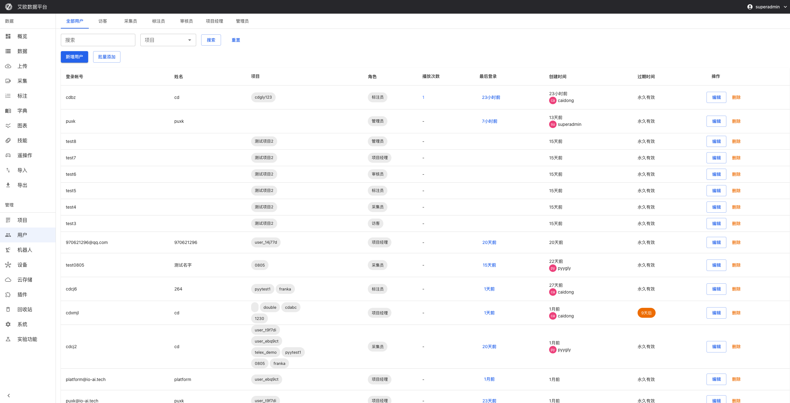
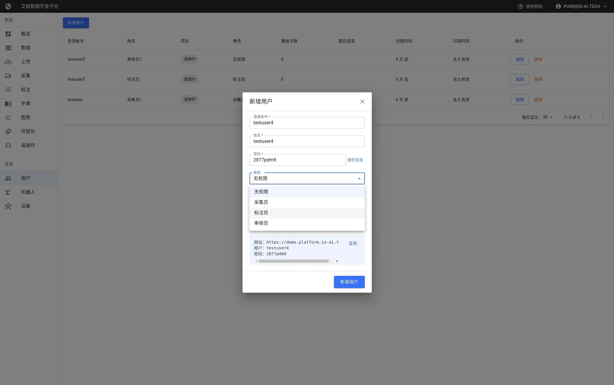

# User Management

Source: https://io-ai.tech/platform/en/guides/Modules/users/#related-features

- Feature Modules

- User Management

# User Management

When a team has multiple members, how do you ensure each person can only access the data and features they need?

Typical scenarios:

- New employees join, need to create accounts and assign permissions

- Annotators can only see tasks assigned to themselves, cannot access other projects' data

- Project managers need to manage team members, assign different roles and permissions

- Temporary employees need account expiration time set, automatically expire when due

User management is designed to solve these problems. Through role and permission management, it ensures each user can only access and operate data and features within their permission scope.

## Quick Start: Create Your First User​

### Step 1: Create User Account​

- Go to User Management page, click "Create User"

- Fill in user information:Username: Login account (usually email)Password: Set initial password (users can modify after first login)Role: Select user role (Administrator, Project Manager, Annotator, Reviewer, etc.)Project Affiliation: Select projects user belongs to (optional, can add later)

- Username: Login account (usually email)

- Password: Set initial password (users can modify after first login)

- Role: Select user role (Administrator, Project Manager, Annotator, Reviewer, etc.)

- Project Affiliation: Select projects user belongs to (optional, can add later)

- Confirm creation

### Step 2: Assign Roles and Permissions​

Role Description:

- Administrator: Has all permissions, can manage all projects and users

- Project Manager: Can manage projects, create tasks, view statistics

- Annotator: Can view tasks assigned to themselves and perform annotation

- Reviewer: Can review annotation results

- Visitor: Can only view public information, cannot perform operations

Permission Control:

Different roles have different permissions:

- Data Access: Control which data users can access

- Operation Permissions: Control which operations users can perform

- Feature Modules: Control which features users can use

### Step 3: Set Project Affiliation​

After user is created, can add them to projects:

- Edit user information

- Select projects to join in "Project Affiliation"

- Save changes

After users join projects, they can access data and tasks from those projects.

## Advanced Usage​

### How to Batch Create Users?​

Batch Creation Scenarios:

- New project starts, need to create multiple users at once

- Team expansion, need to batch add new members

- Migrate user data from other systems

Operation Steps:

- Click "Batch Add" button

- Prepare CSV file, format requirements:First column: UsernameSecond column: PasswordThird column: RoleFourth column: Project name (optional)

- First column: Username

- Second column: Password

- Third column: Role

- Fourth column: Project name (optional)

- Upload CSV file or paste content directly

- System will validate format and display preview

- Confirm to batch create

CSV Format Example:

username,password,role,projectuser1@example.com,password123,ANNOTATOR,Project Auser2@example.com,password123,REVIEWER,Project Auser3@example.com,password123,ANNOTATOR,Project B

username,password,role,projectuser1@example.com,password123,ANNOTATOR,Project Auser2@example.com,password123,REVIEWER,Project Auser3@example.com,password123,ANNOTATOR,Project B

### How to Manage User Permissions?​

View User List:

Page provides filtering by role:

- All Users: Display all users

- Administrator: Only display administrators

- Project Manager: Only display project managers

- Annotator: Only display annotators

- Reviewer: Only display reviewers

Edit User Information:

- Click user in user list

- Modify user information:Modify roleAdd or remove project affiliationModify account status

- Modify role

- Add or remove project affiliation

- Modify account status

- Save changes

Account Status Management:

- Active: User can use normally

- Disabled: Temporarily disable account, user cannot login

- Locked: Account is locked, requires administrator to unlock

- Deleted: Permanently delete user account

⚠️Note: Deleting users will also delete user-related data, please operate with caution.

### How to Set Account Expiration Time?​

Use Cases:

- Temporary employees or interns, need to set account expiration time

- Trial accounts, set trial period

- Accounts requiring periodic renewal

Operation Steps:

- When creating or editing user, set "Expiration Time"

- Select expiration date

- Save settings

Expiration Handling:

- Before account expires, system will send reminder notifications

- After account expires, users cannot login

- Administrators can extend expiration time or reactivate account

### How to View User Activity?​

User Information:

In user list you can see:

- User basic information and role

- Project affiliation list

- Account status and expiration time

- Last login time

User Details:

Click user to view:

- User detailed information

- Participating project list

- Task statistics and workload

- Operation logs (if needed)

## Common Questions​

### How to Choose Appropriate Role?​

Role Selection Recommendations:

- Administrator: Usually only 1-2 people, responsible for overall platform management

- Project Manager: Responsible for project management and task assignment, 1-2 people per project

- Annotator: Add based on workload, usually 5-10 people per project

- Reviewer: Responsible for quality control, usually 1-3 people per project

### Can Users Belong to Multiple Projects?​

Yes. Users can be added to multiple projects:

- Select multiple projects when creating user

- Or add project affiliation when editing user

After users join multiple projects, they can access data and tasks from all affiliated projects.

### How to Reset User Password?​

Reset Method:

- Edit user information

- Modify password field

- Save changes

Users will use new password on next login.

### Will Deleting Users Affect Project Data?​

Deletion Impact:

- Deleting users will not delete project data

- But will delete annotation data created by users (if associated)

- Will remove user-project association relationships

Recommendations:

- Before deletion, confirm if user has associated data

- Can disable account first, confirm no impact then delete

- Important users recommend backing up data first

## Applicable Roles​

### Administrator​

You can:

- Create and manage all user accounts

- Configure system permissions and roles

- Monitor user activity

- Batch create and manage users

- Set account expiration time

### Project Manager​

You can:

- View project member list

- Add or remove members in projects

- Adjust project member permissions

- View member work statistics

## Related Features​

After completing user management, you may also need:

- Project Management: Add users to projects

- Annotation Tasks: Assign annotation tasks to users

- System Settings: Configure system permission rules

## Images on this page

- 
- 
