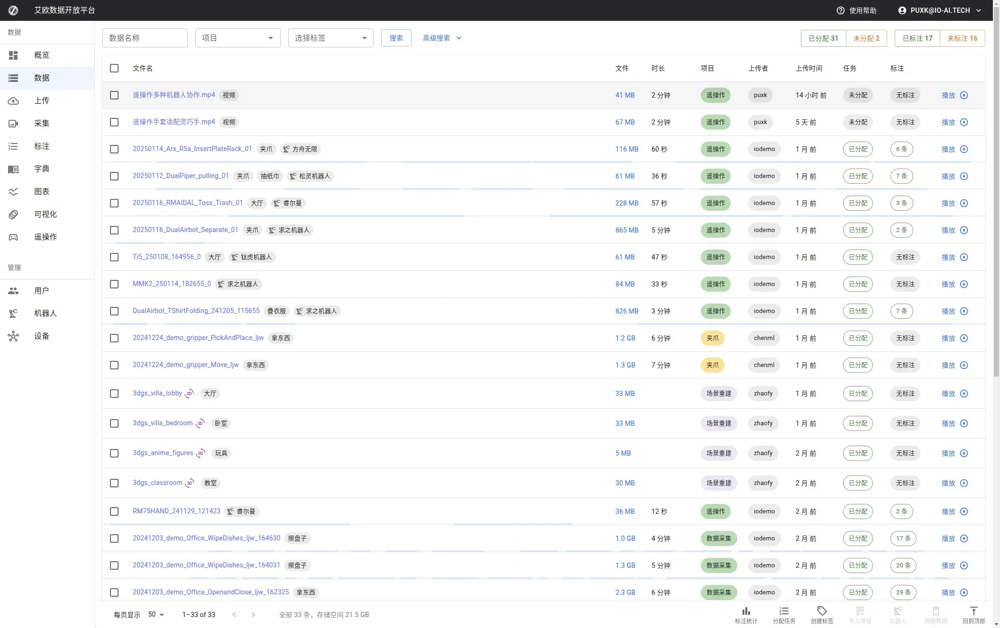
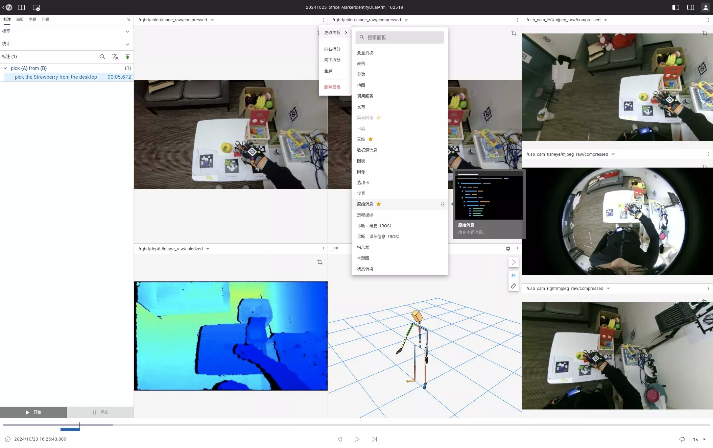
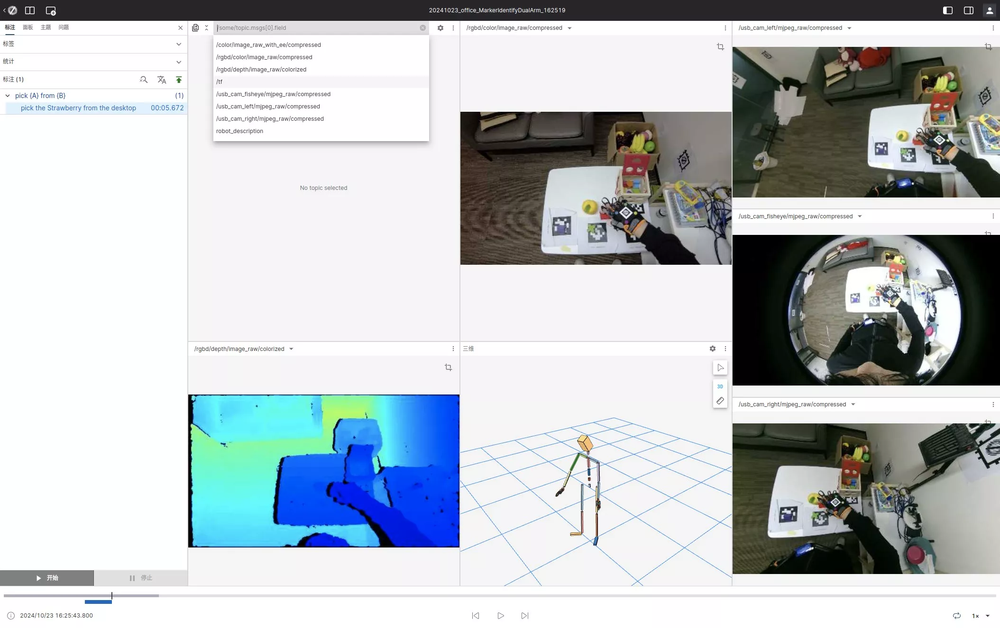
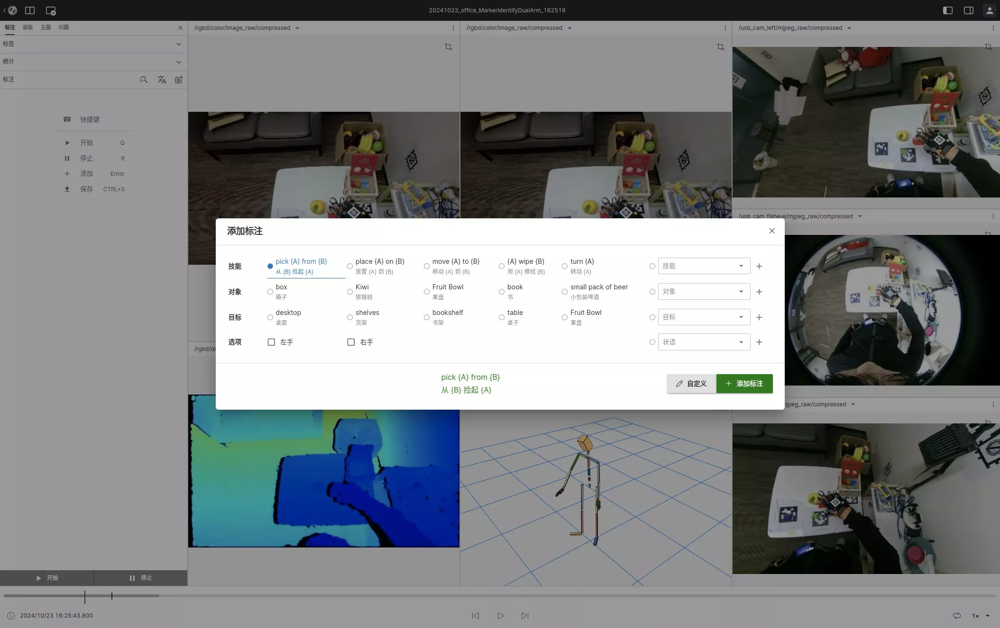
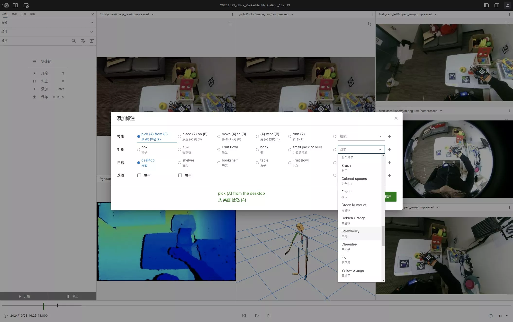
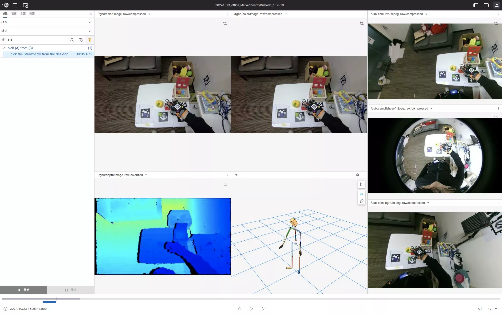
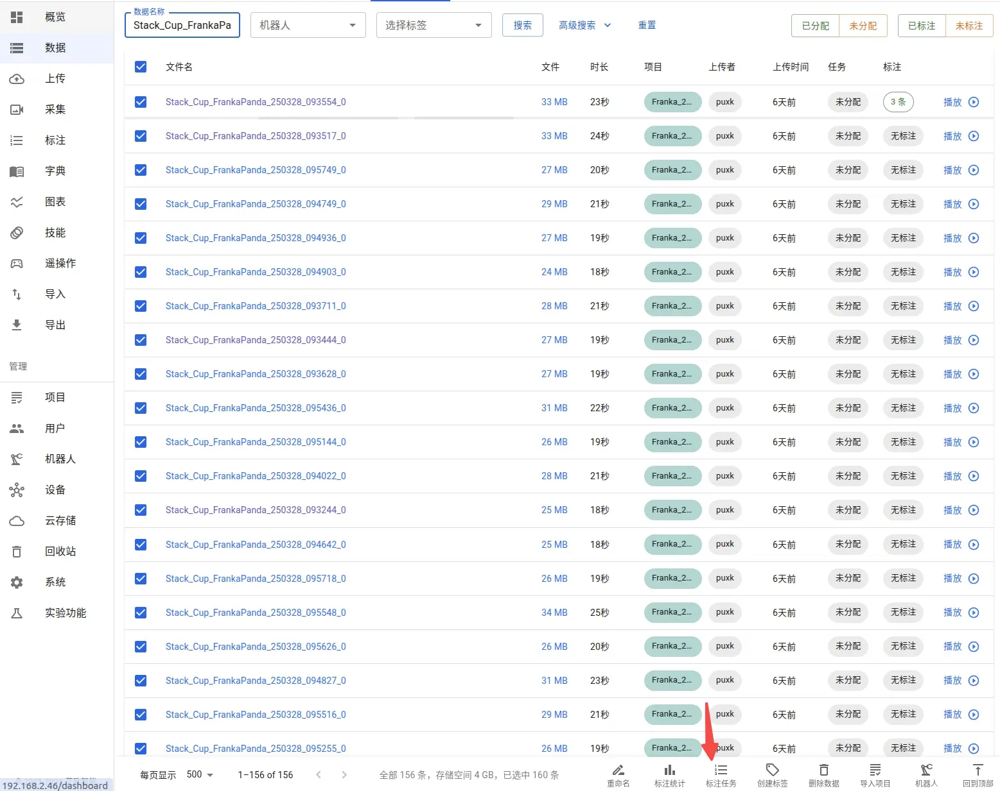
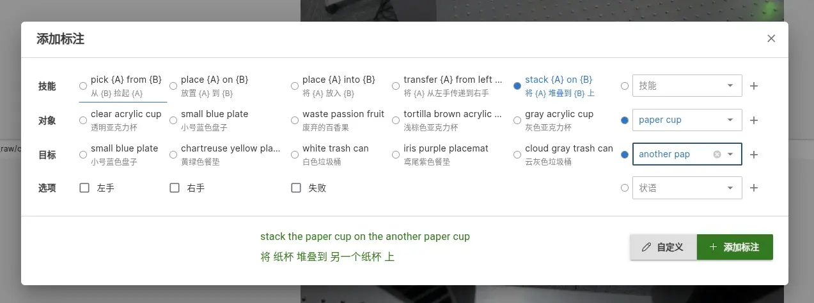
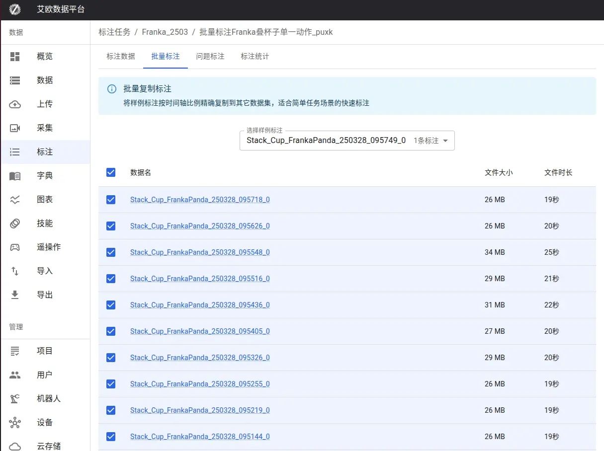

# Data Annotation

Source: https://io-ai.tech/platform/en/guides/Pipeline/Annotation/#batch-annotation-workflow

- Data Pipeline

- Data Annotation

# Data Annotation

The core purpose of data annotation is to enable subsequent trained models to accurately understand the meaning of each action segment, so that the robot can correctly map human natural language instructions to specific actions. For example, when receiving an instruction like "clear the table", the robot can clearly identify the corresponding operation steps and involved items, achieving intelligent task execution.

### Annotation Flow Overview​

After selecting data on the Data page, you can follow either fine-grained or batch annotation; both paths end by saving to the server.

Platform supports two annotation methods:

- Fine-grained Annotation

- You can collect 10 minutes or even longer data and annotate each action time segment in this data.

- Supports grouped, nested, and overlapping annotations, marking both what actions were done and what things were achieved.

- Batch Annotation

- You can collect 100 pieces of data for the same action and annotate all these data with the same natural language at once.

- Supports automatic adaptation to tasks of different durations by time segments, such as marking what to do during the 10%-30% time segment.

## Data Viewing​

Enter theDatapage and click on the corresponding file name link to start data viewing and annotation. The data page displays all available datasets, and you can quickly find the data you need through search and filtering functions.

### Panels​

A Panel is the rendering unit of data, equivalent to a camera perspective (Topic).

Each piece of data typically contains multiple camera perspectives, consisting of multiple panels. You can flexibly adjust the size, position, and number of panels to browse data in the best form. The flexible layout of panels allows you to view data from different angles simultaneously, significantly improving annotation efficiency.

### Switching Rendering Panels​

You can easily change the display content of any panel:

- Click the settings button in the upper left corner of the panel

- Select the desired panel type from the dropdown menu

This allows you to quickly switch between different data views according to current task requirements.

### Changing Subscription Messages​

You can also change the data source displayed by the panel:

- Click the settings button in the upper left corner of the panel

- Select the Topic message source you want to switch to in the popup settings menu

This allows you to view different data streams to meet the needs of various annotation scenarios.

## Fine-grained Annotation​

The annotation method in this section is suitable for segmented annotation containing multiple atomic actions, especially suitable for scenarios where one piece of data contains multiple tasks. Fine-grained annotation allows you to mark multiple different actions or events in a single data stream.

For annotation task workflow, please refer to:

- Administrator creates annotation tasks

- Annotator executes annotation tasks

### Start Annotation​

Click the "Start" button (or press shortcut keyQ) to mark the start time point of an action or event. The system will record the current timestamp as the starting point of the annotation.

You can:

- Auto play (press spacebar)

- Manually navigate forward and backward (press left and right arrow keys)

- Control navigation speed (press CTRL to accelerate or ALT to decelerate)

These flexible playback controls allow you to precisely locate the time points that need annotation.

### End Annotation​

When the action or event ends, click the "End" button (or press shortcut keyR) to end the current annotation. The system will record the current timestamp as the end point of the annotation, thus determining the complete time range.

### Add Semantic Information​

After marking the time period, you need to add semantic information to the annotation:

- Fill in the form information

- Select the corresponding natural language description or add new dictionary items

- Save the information

Detailed semantic descriptions help with subsequent data training and analysis.

### Add Annotation​

After completing the above steps, click the "Add Annotation" button (or pressEnter) to add this annotation to the annotation list of the current data. If you need to annotate multiple actions, repeat the above steps.

### Save Annotation​

After completing all annotations, click the yellow upload button in the upper right corner to save the annotations to the server. Please make sure to save your work before leaving the page to prevent data loss.

## Batch Annotation​

This function allows you to apply the annotation results of one piece of data to multiple homogeneous similar data, significantly saving annotation time.

For single task scenarios (such as 100 pieces of data all being the same action), the batch annotation function can greatly improve efficiency.

### Batch Annotation Workflow​

- Select Sample Data: Batch select homogeneous data from the data list

Select Sample Data: Batch select homogeneous data from the data list

- Create Annotation Task: Create a new annotation task for this data

Create Annotation Task: Create a new annotation task for this data

- Start Annotation: View and start executing the annotation task

Start Annotation: View and start executing the annotation task

- Complete Sample Annotation: Complete the annotation of one sample according to the fine-grained annotation process

Complete Sample Annotation: Complete the annotation of one sample according to the fine-grained annotation process

- Save Sample: Save the completed sample annotation

Save Sample: Save the completed sample annotation

- Select Template: Return to the task page and select the annotated sample data as a template

Select Template: Return to the task page and select the annotated sample data as a template

- Batch Copy: Start batch copying annotations to other data

Batch Copy: Start batch copying annotations to other data

- Confirm Success: Confirm that the copy operation has been successfully completed

Confirm Success: Confirm that the copy operation has been successfully completed

- View Results: View the final results of batch annotation

View Results: View the final results of batch annotation

Through the batch annotation function, you can quickly apply standardized annotations to large amounts of data, especially suitable for processing large-scale homogeneous datasets, greatly improving work efficiency.

## Images on this page

- 
- 
- 
- 
- 
- 
- 
- 
- 
- 
- 
- 
- 
- 
- 
- 
- 
- 
- 
