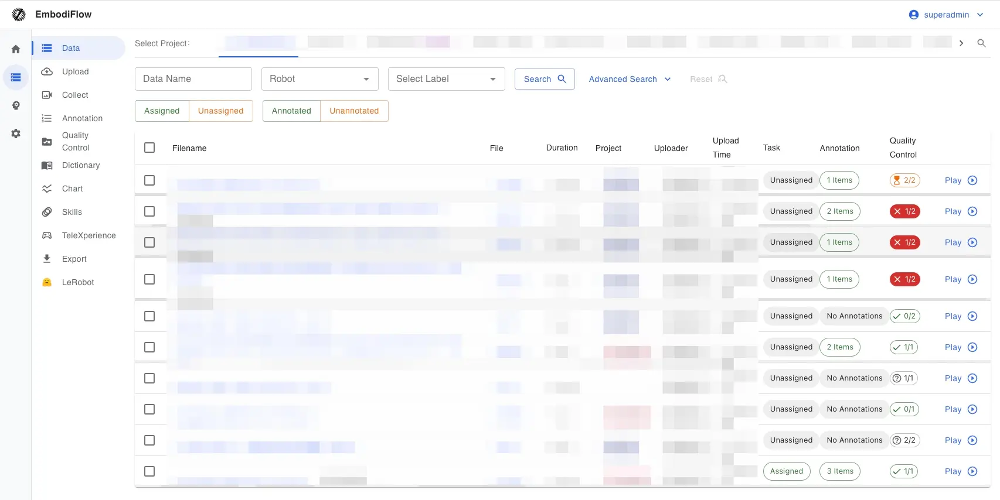
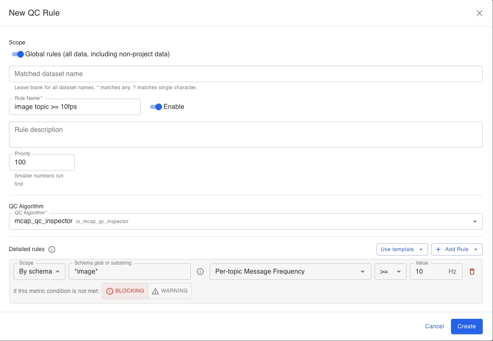
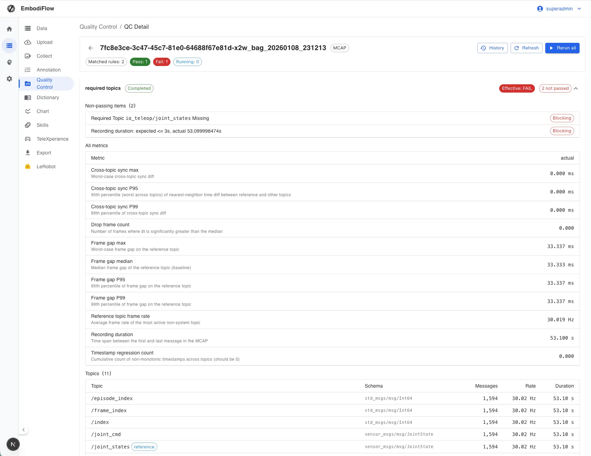
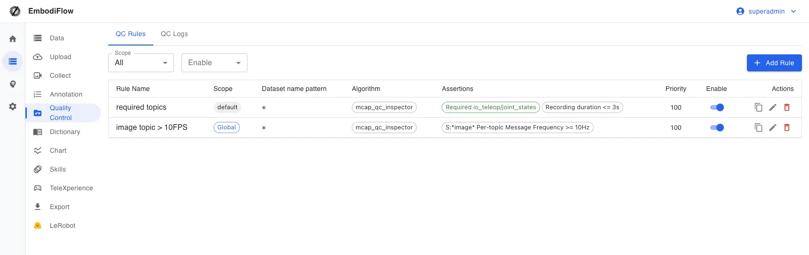

# Quality checks

Source: https://io-ai.tech/platform/en/guides/Pipeline/DataQuality/#see-also

- Data Pipeline

- Quality checks

# Quality checks

When training models, issues like low frame rate, missing sensor topics, or poor time alignment often surface halfway through training—wasting compute and making root cause hard.Quality checksrunafter preprocessingandbefore export or training: a configurable standard scans eachROS recording(e.g..mcap,.bag,.db3) and marks itpassorfail.

.mcap

.bag

.db3

The platform turns this into a product feature. Admins and project managers configure rules in the QC UI; the system queues scans and shows results on the dataset list and detail pages—no custom scan scripts required.

SeeData QCfor priorities, dataset name globs, and how this differs from video QC. This page focuseswhere QC sits in the end-to-end pipeline.

## Quick start​

### When QC runs​

Data must bepreprocessedinto aQC-ready ROS recording formatbefore QC applies. After preprocessing, if your rules match, the systemqueues scans automatically; you can alsorun again manuallyfrom a dataset’s detail page.

### Rule scope​

- Project rules: Apply only to datasets in the project you pick—good for per-project standards.

- Global rules: Apply toall ROS recordingson the platform (including datasets not yet in a project)—good for org-wide baselines.

The same dataset can match multiple rules; each rule is evaluated independently.

### Human review of results​

When the machine marks a run as failed,admins or project managers(with permission) canoverridea result (e.g. confirm a false positive). Lists, tags, and export behavior use theeffective verdict—manual override wins over the machine. Admins can also turn on policies such asblock export when QC failsto tie QC to export.

## Where this sits in the pipeline​

From upload to training, the flow is roughly below. QC sits right after preprocessing to filter clearly bad data before filtering, export, and training.

## What you can configure in rules​

In the rule editor you typically see three kinds of settings (labels follow the UI):

Numeric thresholdsPick a metric (e.g. frame rate, duration, multi-stream time alignment), a comparator (≥, ≤, etc.), and a threshold. Use for whole-file or per-sensor baselines.

Topic presencee.g. “must include/joint_states” or “must not include a debug topic”. Use to ensure critical sensors were recorded.

/joint_states

Severity: blocking vs warning

- Blocking (fail): If this condition fails, thewhole QC runis marked failed.

- Warning: Shown in detail for awareness;a warning alone does not fail the whole run—good to observe distributions before tightening.

Usuallyall conditions in one rulemust pass for that run to pass. For new rules, start withwarnings, then switch critical items toblockingwhen you are ready to enforce them.

After you create, enable, or edit a rule, the platformre-scans historical datathat already matched that rule so results match the latest definition. This runs in the background—you do not need to watch the page.

## Common metrics (for the UI)​

The two tables mirror names in the UI and help you choose upper vs lower bounds. Forhigher is better, use≥as a floor; forlower is better, use≤as a ceiling.

### Whole file / main stream​

Metric

Meaning

Unit

Direction

Typical use

Recording duration

Time from first to last message in the file

s

Higher better

Drop too-short clips

Timestamp regressions

How often time “goes backward”

count

Lower better (0 ideal)

Timeline anomalies

Cross-topic sync (P95 / P99 / max)

Multi-sensor time alignment error

ms

Lower better

Sync SLAs

Reference frame rate

Main stream average message rate

Hz

Higher better

Minimum FPS

Frame gaps (median / P95 / P99 / max)

Time between adjacent frames—jitter & stalls

ms

Lower better

Rhythm & freezes

Drop-frame count

Segments much longer than normal rhythm

count

Lower better

Gaps / packet loss

Sharpness (high percentile)

Image sharpness score

score

Higher better

Blur / focus

Exposure outlier ratio

Share of frames with abnormal brightness

ratio

Lower better

Unstable exposure

### Per topic or per type​

These are computedfor each matching topic. Scope must be “by topic name” or “by message type”; globs are supported. Ifanymatched row fails, that assertion fails.

Metric

Meaning

Unit

Direction

Typical use

Per-topic message rate

Approximate Hz for that stream

Hz

Higher better

Minimum camera FPS

Per-topic max frame gap

Worst pause on that stream

ms

Lower better

Worst single-stream stall

Per-topic message count

Number of messages

count

Higher better

Avoid “almost empty” streams

Per-topic span

Time from first to last message on that topic

s

Higher better

Mid-recording dropouts

Per-topic first / last time

Position on the file timeline

s

Task-dependent

Advanced

## Example setups (tune numbers on site)​

- Org baseline: Global rule—main rate ≥ 15 Hz, duration ≥ 5 s, severity blocking.

- Clean timeline: Timestamp regressions ≤ 0.

- Multi-sensor sync: Cross-topic sync P99 ≤ 100 ms; usemaxif you care about spikes.

- Must-have topics: “Required topic” with real names (e.g./joint_states).

/joint_states

- Multi-camera: Scope matches image topics; per stream rate ≥ 10 Hz and max frame gap ≤ 500 ms.

- Overall sharpness: Scope “all”; sharpness high percentile ≥ 40 (calibrate yourself).

- Drop frames: Drop count ≤ 10; usewarningif you only want visibility, not blocking export.

- No debug streams: “Forbidden topic” for streams that must not enter training bundles.

## Suggested workflow​

- Maintain rules on theData QCpage (project or global; dataset name globs as needed).

- Check summaries on the dataset list or detail; open QC history for each run’s detail.

- For false positives, override with a clear reason; for real defects, fix upstream or re-preprocess and re-run.

- Export:Data export; training:Model training.

Admins or project managers can override a case and set the effective verdict to pass.

## See also​

- Data QC

- Data export

- Model training

## Images on this page

- 
- 
- 
- 
