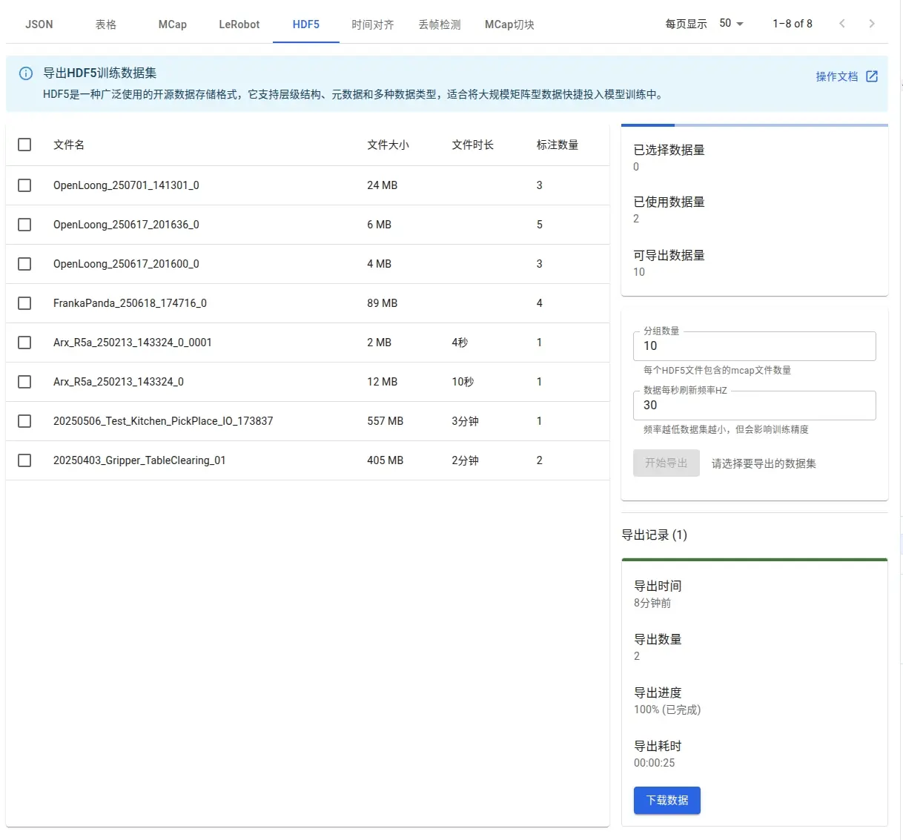

# HDF5 Dataset

Source: https://io-ai.tech/platform/en/guides/Pipeline/HDF5/#robot-training

- Data Pipeline

- HDF5 Dataset

# HDF5 Dataset

HDF5 (Hierarchical Data Format v5) is an efficient, flexible storage format widely used in embodied AI. Its hierarchical groups/datasets make it easy to organize multimodal data, with fast I/O and cross‑platform sharing.

## Import​

Device vendors may use different folder/naming conventions. The platform supports common external collectors (e.g., SenseTime Piper). If your schema isn’t supported yet, contact us with the structure and we’ll adapt quickly.

## Export​

You can export annotated mcap/bag/hdf5 inputs as HDF5 for ML training. Annotation associates actions with NL instructions so VLA models learn to follow language.

See:Annotation

After annotation, select subsets to export.

- Group size: how many raw files per HDF5 (set 1 for one‑to‑one)

- Refresh rate: sampling frequency per second (affects size)

After export, view results on the page:

Downloaded data:

## Structure​

Exported files are grouped (e.g.,chunk_001.hdf5) and follow a tree layout:

chunk_001.hdf5

- Root/

/

- Subgroups like/data,/meta/datacontains subgroups per episode (episode_001,episode_002, ...)

/data

/meta

- /datacontains subgroups per episode (episode_001,episode_002, ...)

/data

episode_001

episode_002

- Datasets under each/data/episode_xxxinclude:Attributestask(EN instruction)task_zh(ZH instruction)score(quality score)Stored dataaction(joint commands, ND array)observation.images.*(compressed images)observation.state(sensor states)observation.gripper(gripper state)

/data/episode_xxx

- Attributestask(EN instruction)task_zh(ZH instruction)score(quality score)

- task(EN instruction)

task

- task_zh(ZH instruction)

task_zh

- score(quality score)

score

- Stored dataaction(joint commands, ND array)observation.images.*(compressed images)observation.state(sensor states)observation.gripper(gripper state)

- action(joint commands, ND array)

action

- observation.images.*(compressed images)

observation.images.*

- observation.state(sensor states)

observation.state

- observation.gripper(gripper state)

observation.gripper

Example:

HDF5 "./chunk_001.hdf5" {FILE_CONTENTS {group      /group      /datagroup      /data/episode_001dataset    /data/episode_001/actiondataset    /data/episode_001/observation.gripperdataset    /data/episode_001/observation.images.camera_01dataset    /data/episode_001/observation.images.camera_02dataset    /data/episode_001/observation.images.camera_03dataset    /data/episode_001/observation.images.camera_04dataset    /data/episode_001/observation.stategroup      /data/episode_002dataset    /data/episode_002/actiondataset    /data/episode_002/observation.gripperdataset    /data/episode_002/observation.images.camera_01dataset    /data/episode_002/observation.images.camera_02dataset    /data/episode_002/observation.images.camera_03dataset    /data/episode_002/observation.images.camera_04dataset    /data/episode_002/observation.state......group      /meta}}

HDF5 "./chunk_001.hdf5" {FILE_CONTENTS {group      /group      /datagroup      /data/episode_001dataset    /data/episode_001/actiondataset    /data/episode_001/observation.gripperdataset    /data/episode_001/observation.images.camera_01dataset    /data/episode_001/observation.images.camera_02dataset    /data/episode_001/observation.images.camera_03dataset    /data/episode_001/observation.images.camera_04dataset    /data/episode_001/observation.stategroup      /data/episode_002dataset    /data/episode_002/actiondataset    /data/episode_002/observation.gripperdataset    /data/episode_002/observation.images.camera_01dataset    /data/episode_002/observation.images.camera_02dataset    /data/episode_002/observation.images.camera_03dataset    /data/episode_002/observation.images.camera_04dataset    /data/episode_002/observation.state......group      /meta}}

## Read example​

Using Pythonh5py:

importh5pywithh5py.File('chunk_001.hdf5','r')asf:print('top:',list(f.keys()))episode_001=f['/data/episode_001']print('episode_001 datasets:',list(episode_001.keys()))action=episode_001['action'][:]print('action:',action)

importh5pywithh5py.File('chunk_001.hdf5','r')asf:print('top:',list(f.keys()))episode_001=f['/data/episode_001']print('episode_001 datasets:',list(episode_001.keys()))action=episode_001['action'][:]print('action:',action)

## When to use HDF5​

- Scalable multimodal storage (images, sensors, etc.)

- Built‑in compression

- Cross‑platform sharing/migration

- Flexible hierarchy for complex tasks

## Robot training​

Exported HDF5 can be used for imitation learning, RL, and VLA models.

See training details:HDF5 for robot training

## Images on this page

- 
- 
