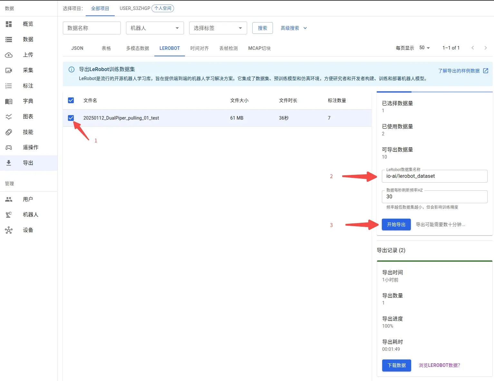
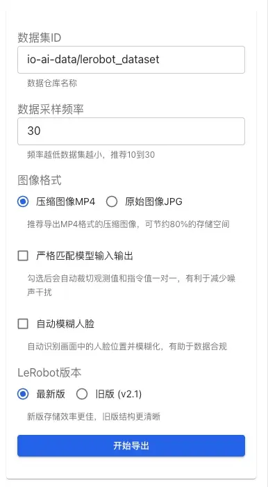

# LeRobot Dataset

Source: https://io-ai.tech/platform/en/guides/Pipeline/LeRobot/#community-resources

- Data Pipeline

- LeRobot Dataset

# LeRobot Dataset

LeRobot is an open-source robotic learning data standardization framework by Hugging Face, specifically designed for robotic learning and reinforcement learning scenarios. It provides a unified data format specification, enabling researchers to more easily share, compare, and reproduce robotic learning experiments, significantly reducing the cost of data format conversion between different research projects.

## Exporting Data​

The diagram below summarizes the path from annotated data to model training: choose export format, configure parameters, export and download, then use with LeRobot or OpenPI to train Pi0, SmolVLA, ACT, and other models.

The EmbodiFlow platform fully supports exporting data in the LeRobot standard format, which can be directly used in the training workflow for VLA (Vision-Language-Action) models. The exported data contains complete multi-modal information of robot operations: visual perception data, natural language instructions, and corresponding action sequences, forming a complete perception-understanding-execution closed-loop data mapping.

Exporting data in LeRobot format requires high computational resources. The free version of the EmbodiFlow platform has reasonable limits on the number of exports per user, while the paid version offers unlimited export services and is equipped with GPU acceleration to significantly speed up the process.

### 1. Selecting Data for Export​

Data annotation must be completed before exporting. The annotation process creates a precise mapping between the robot's action sequences and corresponding natural language instructions, which is a prerequisite for training VLA models. Through this mapping, the model learns to understand language commands and translate them into accurate robot control actions.

For detailed workflows and batch annotation tips, please refer to theData Annotation Guide.

Once annotation is complete, you can view all annotated datasets in the export interface. The system supports flexible data subset selection, allowing you to choose specific data for export based on your needs.

Dataset naming supports custom settings. If you plan to publish the dataset to the Hugging Face platform, it is recommended to use the standard repository naming format (e.g.,myproject/myrepo1), which facilitates subsequent model sharing and collaboration.

myproject/myrepo1

#### Export Configuration Options​

In the configuration panel on the right side of the export interface, you can set the following export parameters:

Data Sampling Frequency: Controls the frequency of data sampling (recommended 10-30 Hz). Lower frequencies result in smaller datasets but may lose some detailed information.

Image Format:

- MP4 (Recommended): Compressed image format, saving about 80% of storage space, suitable for large-scale dataset exports.

- JPG: Original image format, preserving full image quality but with larger file sizes.

Strictly Match Model Input/Output: When enabled, the system automatically crops observations and instructions to ensure a one-to-one correspondence, helping reduce noise interference and improving training data quality.

Auto Blur Faces: When enabled, the system automatically identifies face positions in the frames and applies blurring. This feature helps:

- Protect personal privacy and comply with data compliance requirements.

- Suitable for datasets containing footage of operators.

- Automatically handles face information in all exported images.

Larger data volumes take longer to export. It is recommended to export by task type to avoid processing all data at once. Batch exporting not only speeds up processing but also facilitates subsequent data management, version control, and targeted model training.

### 2. Downloading and Unzipping Exported Files​

The time required for export depends on the scale of data and current system load, typically taking tens of minutes. The page will automatically update the progress status; you can return later to check the results.

Once the export is complete, aDownload Databutton will appear in theExport Historyarea on the right side of the page. Clicking it will provide a.tar.gzcompressed file package.

.tar.gz

It is recommended to create a dedicated directory locally (e.g.,~/Downloads/mylerobot3) to unzip the files to avoid confusion with other data:

~/Downloads/mylerobot3

The unzipped files strictly follow the LeRobot dataset standard format specifications, containing complete multi-modal data: visual perception data, robot state information, and action labels, etc.:

### 3. Custom Topic Mapping​

When exporting a LeRobot dataset, the system needs to map ROS/ROS2 topics to theobservation.stateandactionfields in the LeRobot standard format. Understanding topic mapping rules is crucial for correctly exporting custom datasets.

observation.state

action

#### Default Topic Mapping Rules​

The EmbodiFlow platform uses an automatic recognition mechanism based on topic name suffixes:

Observation (observation.state) Mapping Rules:

- When a topic name ends with/joint_stateor/joint_states, the system automatically recognizes itspositionfield value as an observation and maps it to theobservation.statefield.

/joint_state

/joint_states

position

observation.state

- For example:io_teleop/joint_states,/arm/joint_state, etc., will be recognized as observations.

io_teleop/joint_states

/arm/joint_state

Action (action) Mapping Rules:

- When a topic name ends with/joint_cmdor/joint_command, the system automatically recognizes itspositionfield value as an action command and maps it to theactionfield.

/joint_cmd

/joint_command

position

action

- For example:io_teleop/joint_cmd,/arm/joint_command, etc., will be recognized as action values.

io_teleop/joint_cmd

/arm/joint_command

To ensure data can be exported correctly, it is recommended to follow the naming conventions above when recording data. If your robot system uses a different naming style, you can contact the technical support team for adaptation.

#### Custom Topic Support​

If you have built custom topics that do not follow the default rules above, you can handle them in the following ways:

- Rename Topics: During the data recording phase, rename custom topics to names that comply with the default rules (e.g.,/joint_statesor/joint_command).

Rename Topics: During the data recording phase, rename custom topics to names that comply with the default rules (e.g.,/joint_statesor/joint_command).

/joint_states

/joint_command

- Contact Technical Support: If topic names cannot be modified, you can contact the EmbodiFlow technical support team. We will adapt to your specific naming style to ensure data can be correctly mapped to the LeRobot format.

Contact Technical Support: If topic names cannot be modified, you can contact the EmbodiFlow technical support team. We will adapt to your specific naming style to ensure data can be correctly mapped to the LeRobot format.

The current version does not support specifying custom topic mappings directly in the export interface. If you have special requirements, it is recommended to communicate with the technical support team in advance, and we will complete the corresponding configuration adaptation before export.

## Data Visualization and Verification​

To help users quickly understand and verify data content, LeRobot provides various data visualization solutions. Each has its own application scenarios and unique advantages, withLeRobot Studio being the recommended choice on the EmbodiFlow platform:

Usage Scenario

Visualization Solution

Key Advantages

Quick Privacy Preview (Recommended)

LeRobot Studio (Web)

No installation, no upload, privacy-first, drag & drop; Dataset health panel validates v2.1/v3.0 structure

Local Development & Debugging

Rerun SDK Local View

Full functionality, highly interactive, offline available

Public Sharing & Showcase

Hugging Face Online View

Community collaboration, easy sharing, accessible anytime

### 1. Online Visualization with LeRobot Studio (Recommended)​

The EmbodiFlow platform provides a natively integrated LeRobot visualization tool —LeRobot Studio. This is currently the most convenient data preview solution. Youdo not need to install any local environmentorupload data to Hugging Face. You can complete rapid visualization and verification of local data directly in your browser.

Online Experience Address:https://io-ai.tech/lerobot/

#### Core Advantages​

- Zero barrier: No Python or Rerun SDK setup required.

- Privacy & security: Drag-and-drop local files; data stays in the browser and is not uploaded to the cloud.

- Feature complete: Standard LeRobot multi-modal playback (images, state, actions).

- Dataset health: After load, the sidebar shows aDataset healthpanel that validates v2.1/v3.0 layout (meta/info, features, episode counts and lengths, etc.) so you can quickly confirm exports are complete and spec-compliant.

meta/info

- Integrated workflow: Works with EmbodiFlow export and visualization flows out of the box.

#### Usage​

- OpenLeRobot Studio.

- ClickSelect fileor drag your exported.tar.gz(or the unzipped folder) into the window.

.tar.gz

- After parsing, use interactive playback.

### 2. Local Visualization with Rerun SDK​

After installinglerobotlocally, use thelerobot-dataset-vizcommand (maps tolerobot.scripts.lerobot_dataset_viz) with theRerun SDKfor timeline-based multi-modal visualization of images, state, and actions—the most flexible local option.

lerobot

lerobot-dataset-viz

lerobot.scripts.lerobot_dataset_viz

#### Environment and dependencies​

Use Python 3.10+:

# Install Rerun SDKpython3 -m pip install rerun-sdk==0.23.1# Clone the official LeRobot repogit clone https://github.com/huggingface/lerobot.gitcd lerobot# Install LeRobot in editable modepip install -e .

# Install Rerun SDKpython3 -m pip install rerun-sdk==0.23.1# Clone the official LeRobot repogit clone https://github.com/huggingface/lerobot.gitcd lerobot# Install LeRobot in editable modepip install -e .

#### Start visualization​

lerobot-dataset-viz \--repo-id local/mylerobot3 \--root ~/Downloads/mylerobot3 \--episode-index 0

lerobot-dataset-viz \--repo-id local/mylerobot3 \--root ~/Downloads/mylerobot3 \--episode-index 0

Parameters:

- --repo-id: Hugging Face dataset id or local placeholder (e.g.io-ai-data/lerobot_dataset,local/mylerobot3)

--repo-id

io-ai-data/lerobot_dataset

local/mylerobot3

- --root: Local dataset root (must containmeta/info.json,data/,videos/, etc.); omit when loading from the Hub

--root

meta/info.json

data/

videos/

- --episode-index: Episode index to visualize (0-based)

--episode-index

#### Save an offline.rrdfile​

.rrd

lerobot-dataset-viz \--repo-id local/mylerobot3 \--root ~/Downloads/mylerobot3 \--episode-index 0 \--save 1 \--output-dir ./rrd_out# View offline (exact filename follows script output, e.g. lerobot_<repo_id>_episode_<index>.rrd)rerun ./rrd_out/lerobot_local_mylerobot3_episode_0.rrd

lerobot-dataset-viz \--repo-id local/mylerobot3 \--root ~/Downloads/mylerobot3 \--episode-index 0 \--save 1 \--output-dir ./rrd_out# View offline (exact filename follows script output, e.g. lerobot_<repo_id>_episode_<index>.rrd)rerun ./rrd_out/lerobot_local_mylerobot3_episode_0.rrd

#### Remote visualization (gRPC streaming)​

For viewing on your laptop while the dataset lives on a server, use streaming mode.--ws-portis deprecated; use--grpc-port(default 9876):

--ws-port

--grpc-port

# On the serverlerobot-dataset-viz \--repo-id local/mylerobot3 \--root /path/to/dataset \--episode-index 0 \--mode distant \--grpc-port 9876# On your machine (replace SERVER_IP)rerun rerun+http://SERVER_IP:9876/proxy

# On the serverlerobot-dataset-viz \--repo-id local/mylerobot3 \--root /path/to/dataset \--episode-index 0 \--mode distant \--grpc-port 9876# On your machine (replace SERVER_IP)rerun rerun+http://SERVER_IP:9876/proxy

### 3. Online Visualization with Hugging Face Spaces​

If you don't want to install a local environment, LeRobot provides an online visualization tool based on Hugging Face Spaces that can be used without any local dependencies. This method is especially suitable for quickly previewing data or sharing dataset content with a team.

The online visualization feature requires uploading data to a Hugging Face online repository. Note that free Hugging Face accounts only support visualization for public repositories, meaning your data will be publicly accessible. If your data contains sensitive information and needs to remain private, it is recommended to use the local visualization solution.

#### Operation Workflow​

- Visit the online visualization tool:https://huggingface.co/spaces/lerobot/visualize_dataset

- Enter your dataset identifier in the Dataset Repo ID field (e.g.,io-intelligence/piper_uncap_pen).

io-intelligence/piper_uncap_pen

- Select the task number to view in the left panel (e.g.,Episode 0).

Episode 0

- Multiple playback options are provided at the top of the page for you to choose the most suitable view.

## Model Training Guide​

The important part is not to try every framework at once, but to pick a training path that matches your target model. For most readers, the fastest route is to use aready-made training image, mount your dataset, get a run working, then tune hyperparameters.

Examples below use image names onDocker Hubunder theioaitechorganization (e.g.ioaitech/train_act:cuda,ioaitech/train_openpi:pi0).

ioaitech

ioaitech/train_act:cuda

ioaitech/train_openpi:pi0

### Model Selection Strategy​

Current mainstream VLA models include:

Model Type

Application Scenario

Key Features

Recommended Use

smolVLA

Single-GPU environment, rapid prototyping

Moderate parameters, efficient training

Consumer GPUs, Proof of Concept

Pi0 / Pi0.5

Complex tasks, multi-modal fusion

OpenPI training stack, strong fine-tuning path

Complex interactions, higher generalization needs

ACT

Single-task optimization

Straightforward image-based workflow

Specific tasks, high-frequency control

Diffusion

Smooth action generation

Diffusion model-based, high trajectory quality

Tasks requiring smooth trajectories

VQ-BeT

Action discretization

Vector quantization, fast inference

Real-time control scenarios

TDMPC

Model Predictive Control

High sample efficiency, online learning

Data-scarce scenarios

We recommendfine-tuningPi0 / Pi0.5 with theOpenPIstack and the published images:

- ioaitech/train_openpi:pi0

ioaitech/train_openpi:pi0

- ioaitech/train_openpi:pi05

ioaitech/train_openpi:pi05

One-command fine-tuning and argument details:Pi0 and Pi0.5 model fine-tuning guide.

### smolVLA Training Details (Recommended for Beginners)​

smolVLA is a VLA model optimized for consumer-grade/single-GPU environments. Instead of training from scratch, it is highly recommended to fine-tune based on official pre-trained weights, which can significantly shorten training time and improve final results.

LeRobot training commands use the following parameter format:

- Policy Type:--policy.type smolvla(specifies which model to use)

--policy.type smolvla

- Parameter Values: Separated by spaces, e.g.,--batch_size 64(not--batch_size=64)

--batch_size 64

--batch_size=64

- Boolean Values: Usetrue/false, e.g.,--save_checkpoint true

true

false

--save_checkpoint true

- List Values: Separated by spaces, e.g.,--policy.down_dims 512 1024 2048

--policy.down_dims 512 1024 2048

- Model Upload: By default, add--policy.push_to_hub falseto disable automatic upload to Hugging Face Hub.

--policy.push_to_hub false

#### Environment Preparation​

# Clone LeRobot repositorygit clone https://github.com/huggingface/lerobot.gitcd lerobot# Install full environment supporting smolVLApip install -e ".[smolvla]"

# Clone LeRobot repositorygit clone https://github.com/huggingface/lerobot.gitcd lerobot# Install full environment supporting smolVLApip install -e ".[smolvla]"

#### Dataset version vs.lerobottag (important)​

lerobot

codebase_versioninmeta/info.jsonmust match thelerobotcheckout you train with:

codebase_version

meta/info.json

lerobot

Dataset format

Recommendedlerobotcode

lerobot

Notes

v2.1

v2.1

v0.3.x

v0.3.x

Legacy layout; many older workflows still use it

v3.0

v3.0

v0.4+(includingv0.5.x)

v0.4+

v0.5.x

New layout; as oflerobot v0.5.0the dataset generation is stillv3.0

lerobot v0.5.0

v3.0

Check out the matching tag before installing:

# v2.1 datasetgit checkout v0.3.3pip install -e ".[all]"# v3.0 datasetgit checkout v0.5.0pip install -e ".[all]"

# v2.1 datasetgit checkout v0.3.3pip install -e ".[all]"# v3.0 datasetgit checkout v0.5.0pip install -e ".[all]"

Two layers of versioning:

- v2.1/v3.0=LeRobotDataset format version

v2.1

v3.0

- v0.4.0/v0.5.0=lerobotlibrary releases

v0.4.0

v0.5.0

lerobot

As oflerobot v0.5.0, the dataset format line is stillLeRobotDataset v3.0. To standardize on modern tooling, convertv2.1data tov3.0before training.

lerobot v0.5.0

v2.1

v3.0

#### Fine-tuning Training (Recommended Solution)​

- Prefer local rootswhen data is large:--dataset.repo_id local/xxx--dataset.root /path/to/dataset(should includemeta/info.json,data/,meta/episodes/, etc.)

- --dataset.repo_id local/xxx

--dataset.repo_id local/xxx

- --dataset.root /path/to/dataset(should includemeta/info.json,data/,meta/episodes/, etc.)

--dataset.root /path/to/dataset

meta/info.json

data/

meta/episodes/

- Already on Hugging Face Hub: set--dataset.repo_id your-name/your-repoonly and drop--dataset.root.

--dataset.repo_id your-name/your-repo

--dataset.root

Local dataset fine-tuning (recommended)

# Example: local tree with meta/info.json, data/, etc.DATASET_ROOT=~/Downloads/mylerobot3lerobot-train \--policy.type smolvla \--policy.pretrained_path lerobot/smolvla_base \--dataset.repo_id local/mylerobot3 \--dataset.root ${DATASET_ROOT} \--output_dir /data/lerobot_smolvla_finetune \--batch_size 64 \--steps 20000 \--policy.optimizer_lr 1e-4 \--policy.device cuda \--policy.push_to_hub false \--save_checkpoint true \--save_freq 5000

# Example: local tree with meta/info.json, data/, etc.DATASET_ROOT=~/Downloads/mylerobot3lerobot-train \--policy.type smolvla \--policy.pretrained_path lerobot/smolvla_base \--dataset.repo_id local/mylerobot3 \--dataset.root ${DATASET_ROOT} \--output_dir /data/lerobot_smolvla_finetune \--batch_size 64 \--steps 20000 \--policy.optimizer_lr 1e-4 \--policy.device cuda \--policy.push_to_hub false \--save_checkpoint true \--save_freq 5000

Practical Recommendations:

- Data Preparation: It is recommended to record 50+ task demonstration clips to ensure coverage of different object positions, poses, and environmental changes.

- Training Resources: Training 20k steps on a single A100 takes about 4 hours; consumer-grade GPUs can lowerbatch_sizeor enable gradient accumulation.

batch_size

- Hyperparameter tuning: Start withbatch_size=64,steps=20k, learning rate1e-4for fine-tuning.

batch_size=64

steps=20k

1e-4

- When to train from scratch: Only consider training from scratch with--policy.type=smolvlaif you have a massive dataset (thousands of hours).

--policy.type=smolvla

#### Training from Scratch (Advanced Users)​

# Training from scratch (local dataset example)DATASET_ROOT=~/Downloads/mylerobot3lerobot-train \--policy.type smolvla \--dataset.repo_id local/mylerobot3 \--dataset.root ${DATASET_ROOT} \--output_dir /data/lerobot_smolvla_fromscratch \--batch_size 64 \--steps 200000 \--policy.optimizer_lr 1e-4 \--policy.device cuda \--policy.push_to_hub false \--save_checkpoint true \--save_freq 10000

# Training from scratch (local dataset example)DATASET_ROOT=~/Downloads/mylerobot3lerobot-train \--policy.type smolvla \--dataset.repo_id local/mylerobot3 \--dataset.root ${DATASET_ROOT} \--output_dir /data/lerobot_smolvla_fromscratch \--batch_size 64 \--steps 200000 \--policy.optimizer_lr 1e-4 \--policy.device cuda \--policy.push_to_hub false \--save_checkpoint true \--save_freq 10000

#### Performance Optimization Tips​

VRAM Optimization:

# Add the following parameters to optimize VRAM usage--policy.use_amp true \--num_workers 2 \--batch_size 32  # Reduce batch size

# Add the following parameters to optimize VRAM usage--policy.use_amp true \--num_workers 2 \--batch_size 32  # Reduce batch size

Training Monitoring:

- Configure Weights & Biases (W&B) to monitor training curves and evaluation metrics.

- Set reasonable validation intervals and early stopping strategies.

- Periodically save checkpoints to prevent training interruption.

### ACT Model Training Guide​

ACT (Action Chunking Transformer) targets single-task or short-horizon policies. If you already have clean LeRobot data and want the most direct training path, prefer the published imageioaitech/train_act:cuda.

ioaitech/train_act:cuda

When training ACT insideLeRobot(lerobot-train),policy.n_action_stepsmust be ≤policy.chunk_size. Setting both to the same value (e.g. 100) avoids misconfiguration. TheDocker imagepath uses thetrain_actCLI instead; see the dedicated guide for flags.

lerobot-train

policy.n_action_steps

policy.chunk_size

train_act

#### Data preprocessing (general)​

Trajectory processing:

- Keep clip lengths and time alignment consistent.

- Normalize actions to a consistent scale.

- Keep observations consistent (camera intrinsics and viewpoints).

One-command training (recommended)

docker run --rm --gpus all \-v /path/to/lerobot_dataset:/data/input \-v /path/to/output:/data/output \ioaitech/train_act:cuda \--run_name act_demo \--task_name demo_task \--num_epochs 12000 \--batch_size 64 \--learning_rate 5e-5 \--chunk_size 100 \--kl_weight 10

docker run --rm --gpus all \-v /path/to/lerobot_dataset:/data/input \-v /path/to/output:/data/output \ioaitech/train_act:cuda \--run_name act_demo \--task_name demo_task \--num_epochs 12000 \--batch_size 64 \--learning_rate 5e-5 \--chunk_size 100 \--kl_weight 10

Full parameters, outputs, and troubleshooting:ACT model training guide.

#### Performance tuning strategies​

Handling Overfitting:

- Increase diversity in data collection.

- Apply appropriate regularization techniques.

- Implement early stopping strategies.

Handling Underfitting:

- Increase training steps.

- Adjust learning rate schedules.

- Check data quality and consistency.

## Frequently Asked Questions (FAQ)​

### Data Export Related​

Q: How long does LeRobot data export take?

A: Export time primarily depends on data scale and current system load. Typically, it takes 3-5 minutes of processing time per GB of data. For better efficiency, it is recommended to export in batches by task type instead of processing an oversized dataset at once.

Q: What are the export limits for the free version?

A: The free version has reasonable limits on the number and frequency of exports per user, which are displayed in the export interface. For large-scale data export, it is recommended to upgrade to the paid version to enjoy unlimited exports and GPU acceleration.

Q: How can I verify the integrity of exported data?

A: There is currentlyno standalonevalidate_datasetCLIin the official repo. Recommended options:

validate_dataset

- Recommended: Open the export inLeRobot Studio(drag.tar.gzor the unzipped folder). The sidebarDataset healthpanel reports v2.1/v3.0 checks (layout,meta/info.json, features, episodes, etc.); errors and warnings are listed explicitly.

.tar.gz

meta/info.json

- Optional (local Python): After installinglerobot, load the folder withLeRobotDataset; missing or invalid structure raises exceptions and can be scripted:

lerobot

LeRobotDataset

fromlerobot.datasetsimportLeRobotDatasetds=LeRobotDataset("local/myrepo",root="/path/to/unzipped/dataset")# Successful load means meta/data layout is recognized

fromlerobot.datasetsimportLeRobotDatasetds=LeRobotDataset("local/myrepo",root="/path/to/unzipped/dataset")# Successful load means meta/data layout is recognized

Q: What if the exported dataset is too large?

A: Try: lower sampling rate (e.g. 30 fps → 10–15 fps); split exports by time window or task; compress imagery where quality allows.

### Data Visualization Related​

Q: What if Rerun SDK installation fails?

A: Please check the following conditions:

- Ensure Python version ≥ 3.10.

- Check if the network connection is stable.

- Try installing in a virtual environment:python -m venv rerun_env && source rerun_env/bin/activate.

python -m venv rerun_env && source rerun_env/bin/activate

- Use a local mirror:pip install -i https://pypi.tuna.tsinghua.edu.cn/simple rerun-sdk==0.23.1.

pip install -i https://pypi.tuna.tsinghua.edu.cn/simple rerun-sdk==0.23.1

Q: Does online visualization require data to be public?

A: Yes. Hugging Face Spaces can only reachpublicdatasets, so data becomes visible. For sensitive data use EmbodiFlowLeRobot Studioor local Rerun/lerobot-dataset-viz.

lerobot-dataset-viz

Q: How do I upload data to Hugging Face?

A: Use the official CLI tool:

# Install Hugging Face CLIpip install -U huggingface_hub# Login to accounthuggingface-cli login# (Optional) Create a dataset repositoryhuggingface-cli repo create your-username/dataset-name --type dataset# Upload dataset (repo_type specified as dataset)huggingface-cli upload your-username/dataset-name /path/to/dataset --repo-type dataset --path-in-repo .

# Install Hugging Face CLIpip install -U huggingface_hub# Login to accounthuggingface-cli login# (Optional) Create a dataset repositoryhuggingface-cli repo create your-username/dataset-name --type dataset# Upload dataset (repo_type specified as dataset)huggingface-cli upload your-username/dataset-name /path/to/dataset --repo-type dataset --path-in-repo .

### Model Training Related​

Q: What are the supported model types?

A: LeRobot data supports many VLAs, includingsmolVLA(single-GPU / fast iteration),Pi0 / Pi0.5(complex multi-modal; we recommend theOpenPIimagesioaitech/train_openpi:pi0andioaitech/train_openpi:pi05), andACT(single-task; we recommendioaitech/train_act:cuda). See the guides linked from this page.

ioaitech/train_openpi:pi0

ioaitech/train_openpi:pi05

ioaitech/train_act:cuda

Q: Pi0 showsAttributeError: 'GemmaForCausalLM' object has no attribute 'embed_tokens'or'layers'?

AttributeError: 'GemmaForCausalLM' object has no attribute 'embed_tokens'

'layers'

A: That comes from olderLeRobotPi0 code paths. The docs recommendioaitech/train_openpi:pi0orioaitech/train_openpi:pi05instead of manuallerobotpatches. Commands:Pi0 and Pi0.5 model fine-tuning guide.

ioaitech/train_openpi:pi0

ioaitech/train_openpi:pi05

lerobot

Q: Pi0 with v3 data + lerobot v0.4.3 raisesValueError: An incorrect transformer version is used?

ValueError: An incorrect transformer version is used

A: Same class of legacyLeRobotPi0 compatibility issues. For a reproducible fine-tuning path, use theOpenPIimages rather than patchingtransformersby hand.

transformers

Q: What should I do if I encounter out-of-memory errors during training?

A: Try the following optimization strategies:

- Reduce batch size:--batch_size 1or smaller.

--batch_size 1

- Enable mixed-precision training:--policy.use_amp true.

--policy.use_amp true

- Reduce data loading threads:--num_workers 1.

--num_workers 1

- Reduce observation steps:--policy.n_obs_steps 1.

--policy.n_obs_steps 1

- Clear GPU cache: addtorch.cuda.empty_cache()in the training script.

torch.cuda.empty_cache()

Q: How do I choose the right model?

A: Choose based on your specific needs:

- Rapid prototyping: smolVLA.

- Complex multi-modal: Pi0 / Pi0.5 (OpenPI images).

- Limited resources, prioritize stability: ACT.

- Single specialized task: ACT.

Q: How is training effectiveness evaluated?

A: LeRobot provides various evaluation methods:

- Quantitative Metrics: Action error (MAE/MSE), trajectory similarity (DTW).

- Qualitative Evaluation: Success rate on real robot tests, behavior analysis.

- Platform Evaluation: EmbodiFlow platform provides visualized model quality assessment tools.

Q: How long does training take?

A: Training time depends on several factors:

- Data Scale: 50 demonstration clips typically take 2-8 hours.

- Hardware Configuration: A100 is 3-5 times faster than consumer-grade GPUs.

- Model Selection: smolVLA trains faster than ACT.

- Training Strategy: Fine-tuning is 5-10 times faster than training from scratch.

### Technical Support​

Q: How can I get help with technical issues?

A: You can get support through the following channels:

- Refer to official LeRobot documentation:https://huggingface.co/docs/lerobot

- Submit an issue on GitHub:https://github.com/huggingface/lerobot/issues

- Contact the EmbodiFlow platform technical support team.

- Participate in LeRobot community discussions.

Q: Does the EmbodiFlow platform support automatic model deployment?

A: Yes, the EmbodiFlow platform supports automatic deployment services for mainstream models such as Pi0 (OpenPI framework), smolVLA, ACT, etc. Please contact the technical support team for deployment solutions and pricing information.

## Related Resources​

### Official Resources​

- LeRobot Studio (EmbodiFlow Online Visualization):https://io-ai.tech/lerobot/

- LeRobot Project Homepage:https://github.com/huggingface/lerobot

- LeRobot Model Collection:https://huggingface.co/lerobot

- LeRobot Official Documentation:https://huggingface.co/docs/lerobot

- Hugging Face Online Visualization Tool:https://huggingface.co/spaces/lerobot/visualize_dataset

### Tools and Frameworks​

- Rerun Visualization Platform:https://www.rerun.io/

- Hugging Face Hub:https://huggingface.co/docs/huggingface_hub

### Academic Resources​

- Pi0 Original Paper:https://arxiv.org/abs/2410.24164

- ACT Paper:Learning Fine-Grained Bimanual Manipulation with Low-Cost Hardware

- VLA Review Paper:Vision-Language-Action Models for Robotic Manipulation

### OpenPI Related Resources​

- OpenPI Project Homepage:https://github.com/Physical-Intelligence/openpi

- Physical Intelligence:https://www.physicalintelligence.company/

### Community Resources​

- LeRobot GitHub Discussions:https://github.com/huggingface/lerobot/discussions

- Hugging Face Robotic Learning Community:https://huggingface.co/spaces/lerobot

This document will be continuously updated to reflect the latest developments and best practices in the LeRobot ecosystem. If you have any questions or suggestions, please contact us through the EmbodiFlow platform technical support channels.

## Images on this page

- 
- 
