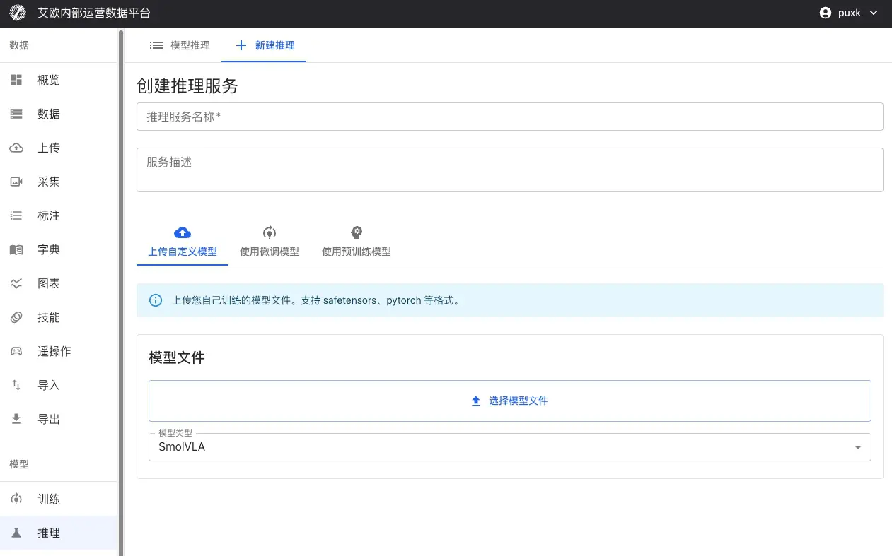
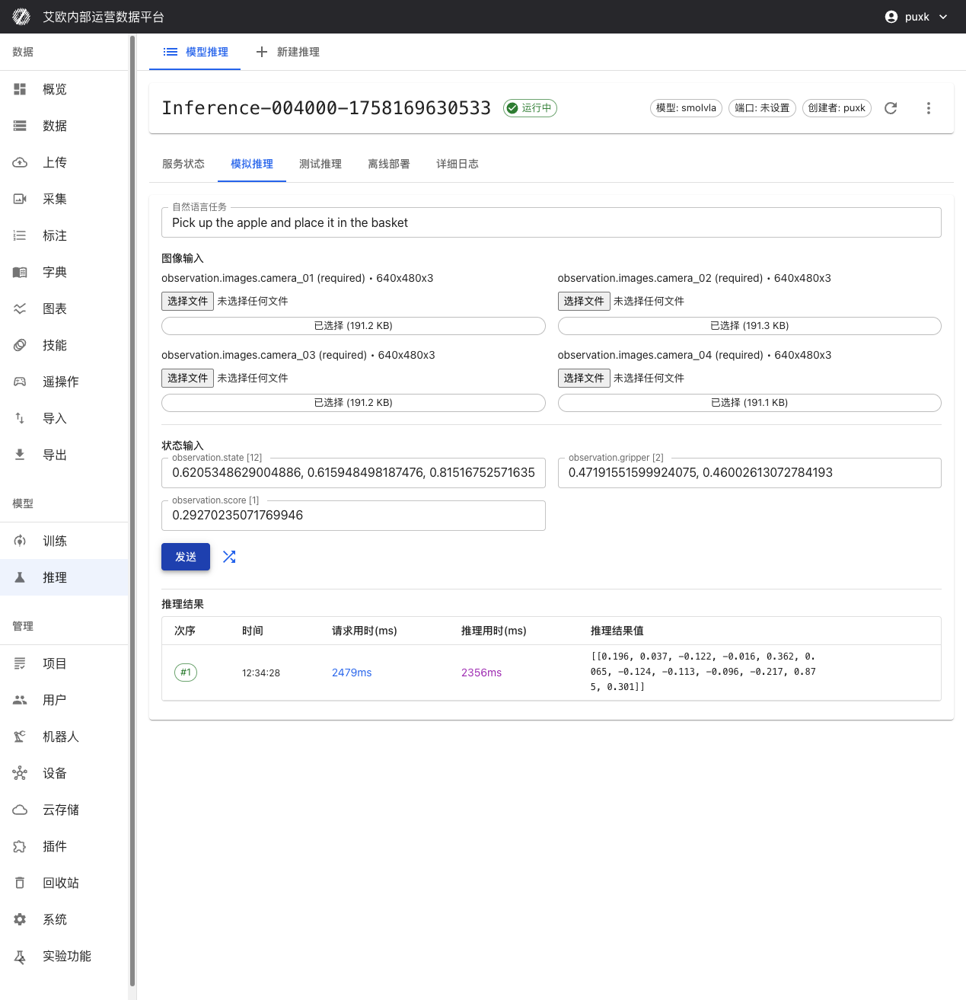
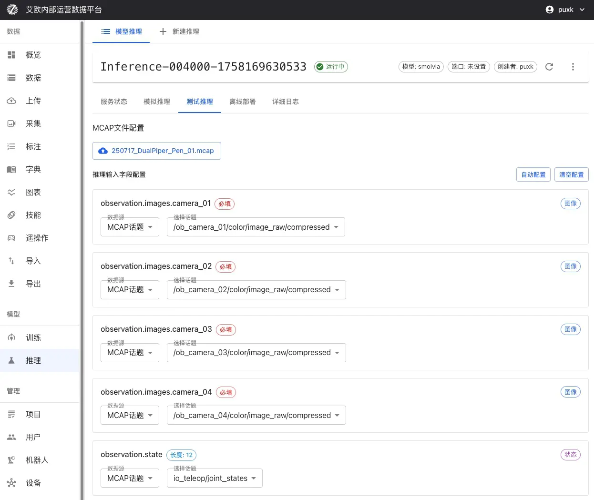
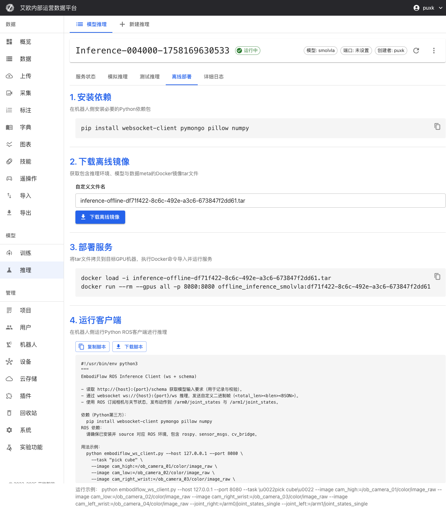
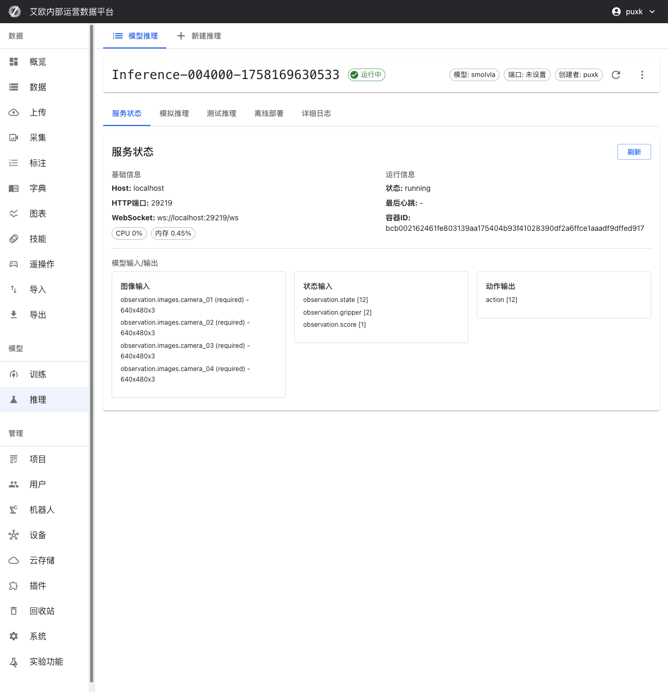

# Model Inference

Source: https://io-ai.tech/platform/en/guides/Pipeline/ModelInference/#related-features

- Data Pipeline

- Model Inference

# Model Inference

Trained models need to be deployed as inference services to be used in actual scenarios. Traditional deployment methods require configuring environments, writing code, handling network communication, etc., which is complex and error-prone.

The platform provides a productized inference deployment process. No code writing needed, you can complete the full operation from model deployment to production application through the web interface. You just need to select the model, configure parameters, then click deploy.

## Quick Start: Deploy Inference Service in 3 Steps​

### Step 1: Select Model​

Use Fine-Tuned Model(Recommended):

- Select completed model from training tasks

- Select checkpoint (recommend using "last" or "best")

- System automatically inherits model configuration and parameters from training

- No additional configuration needed, can deploy directly

Other Model Sources:

- Upload Custom Model: Support SafeTensors, PyTorch (.pth, .pt), ONNX and other formats

- Use Pretrained Model: Select validated base models from model repository, such as Pi0, SmolVLA, GR00T, etc.

### Step 2: Configure Service​

Basic Information:

- Service Name: Set an easily identifiable name for inference service

- Service Description: Optional, add service purpose or description

- Project: Associate service with specific project for easy management

- Model Type: Select model type, system will automatically adapt

Inference Parameters:

- Inference Precision: Choose bfloat16 or float32 (affects speed and precision)

- Batch Size: Batch size for batch inference

- Max Sequence Length: For models supporting sequences, limit max sequence length

Computing Resources:

- Automatically detect available GPU resources

- Support selecting specific GPU or multi-GPU deployment

- Support CUDA, MPS (Apple Silicon) and other platforms

- Auto fallback to CPU when no GPU (lower performance)

### Step 3: Deploy Service​

After clicking "Deploy" button:

- System automatically creates Docker container

- Loads model weights and configuration

- Starts inference service (takes about 20-30 seconds)

- Automatically performs health check to ensure service is normal

After deployment completes, inference service will automatically start and maintain running status, can immediately perform inference testing.

## Inference Testing Methods​

The platform provides three inference testing methods to meet different scenario needs:

Inference Method

Use Case

Description

Simulation Inference Test

Quick Verification

Use random data or custom input to quickly verify model inference functionality and performance

MCAP File Test

Real Data Validation

Use recorded robot demonstration data to verify model inference effectiveness in real scenarios

Offline Edge Deployment

Production Environment Application

Deploy inference service to robot local GPU for low-latency real-time control

### Simulation Inference Test​

When to Use?

- Quickly verify if model service started normally

- Test if model input/output format is correct

- Evaluate inference service response speed

- Verify natural language instruction processing capability

How to Use?

- Go to inference service details page, switch to "Simulation Inference" tab

- Enter natural language task instruction, such as "Pick up the apple and place it in the basket"

- Click "Random Fill" to auto-generate test data, or manually enter data

- Click "Send" button, immediately get model inference results

Performance Metrics:

- Request Time: Total time from sending request to receiving response (including network transmission)

- Inference Time: Actual model inference computation time

- Data Transfer Time: Data upload and download time

These metrics help you evaluate model performance and system latency.

### MCAP File Test​

When to Use?

- Evaluate model performance in real scenarios

- Compare inference results with expert demonstrations

- Verify model effectiveness on complete action sequences

- Select best model checkpoint

How to Use?

- Go to inference service details page, switch to "Test Inference" tab

- Select MCAP File:Directly select from platform datasetsOr upload MCAP file locally

- Directly select from platform datasets

- Or upload MCAP file locally

- Configure Input Mapping:Select which camera topics in MCAP map to model inputsConfigure mapping for joint state, gripper state and other dataSet natural language task description for entire sequence

- Select which camera topics in MCAP map to model inputs

- Configure mapping for joint state, gripper state and other data

- Set natural language task description for entire sequence

- Set Inference Range:Select start and end frames for inferenceCan set to skip certain frames to improve inference speed

- Select start and end frames for inference

- Can set to skip certain frames to improve inference speed

- Start Inference: Click "Start Inference", system will perform continuous inference on complete sequence

Effect Comparison Analysis:

After inference completes, system provides:

- Action Comparison: Compare differences between inferred actions and expert demonstration actions

- Trajectory Visualization: Visualize predicted trajectories and real trajectories

- Error Statistics: Calculate action errors, position errors and other statistical metrics

- Performance Evaluation: Evaluate model performance on real data

💡Recommendation: Use MCAP files from scenes similar to training data for testing, focus on action errors and trajectory consistency.

### Offline Edge Deployment​

When Do You Need Offline Deployment?

- Real-time robot control in production environments

- Network unstable or restricted environments

- Application scenarios with extremely high latency requirements

- Security-sensitive scenarios requiring data localization

Deployment Steps:

- Environment Preparation:Install Docker and nvidia-docker2 on robot controller (if using GPU)Ensure sufficient storage space to download Docker image and model files

Environment Preparation:

- Install Docker and nvidia-docker2 on robot controller (if using GPU)

- Ensure sufficient storage space to download Docker image and model files

- Download Deployment Package:Switch to "Offline Deployment" tab on inference service details pageDownload complete Docker image containing inference environment, model weights and configurationDownload model weight files and configuration files

Download Deployment Package:

- Switch to "Offline Deployment" tab on inference service details page

- Download complete Docker image containing inference environment, model weights and configuration

- Download model weight files and configuration files

- Start Service:Use provided Docker command to start inference service locallySupport GPU acceleration (if hardware supports)Automatically configure ports and network

Start Service:

- Use provided Docker command to start inference service locally

- Support GPU acceleration (if hardware supports)

- Automatically configure ports and network

- Client Connection:Run ROS client script provided by platformEstablish real-time communication with inference service (WebSocket + BSON protocol)Subscribe to sensor topics, publish joint control commands

Client Connection:

- Run ROS client script provided by platform

- Establish real-time communication with inference service (WebSocket + BSON protocol)

- Subscribe to sensor topics, publish joint control commands

- Verification Test:Run test script to verify service is normalCheck inference latency and accuracyConfirm ROS topic subscription and publishing are normal

Verification Test:

- Run test script to verify service is normal

- Check inference latency and accuracy

- Confirm ROS topic subscription and publishing are normal

Offline Deployment Advantages:

- Low Latency: Inference executes on robot locally, completely eliminates network latency

- Offline Available: Doesn't depend on external network connection, ensures availability in offline environments

- Data Security: Data doesn't leave robot local, meets data security requirements

- Real-Time Control: Supports high-frequency inference (2-10Hz), meets real-time control needs

## Service Management​

### How to View Service Status?​

Service Information:

On inference service details page you can view:

- Host Address and Port: HTTP and WebSocket access addresses for inference API

- Service Status: Real-time display of service running status (running, stopped, error, etc.)

- Container Information: Docker container ID and running status

- Creation Time: Service creation and last update time

Resource Monitoring:

- CPU Usage: Real-time display of CPU usage

- Memory Usage: Display memory usage and peak

- GPU Usage: If using GPU, display GPU utilization and memory usage

- Network IO: Display network traffic statistics

### How to Control Service?​

Service Control:

- Start/Stop: Can start or stop inference service anytime

- Restart Service: Restart service to apply configuration changes

- Delete Service: Delete unnecessary inference services to free resources

💡Recommendation: After deployment, recommend waiting 20-30 seconds to ensure service fully starts. Services unused for long time can be stopped to free resources.

### Model Input/Output Specifications​

Inference service has intelligent adaptation capability, can automatically identify and adapt to different models' input/output requirements:

Input:

- Image Input: Intelligently adapt to camera count (1 or multiple views) and resolution (auto scaling)

- State Input: observation.state [12], observation.gripper [2], observation.score [1]

Output:

- Action Output: action [12] robot joint control commands

System automatically handles data format conversion, you just need to provide data according to model requirements.

## Inference Quota Management​

### What is Inference Quota?​

Inference quota is used to control resource usage and ensure reasonable allocation of system resources.

Quota Types:

- User Quota: Each user has independent inference quota limit

- Global Quota: System-level total quota limit (administrator configured)

- Quota Statistics: Real-time display of used quota and remaining quota

Quota Display:

- Inference page displays current user's quota usage

- Display used count and total quota limit

- Cannot create new inference services when quota exceeded

Quota Management(Administrator):

Administrators can:

- View inference quota usage of all users

- Configure global inference quota limits

- Adjust individual user quotas

## Common Questions​

### How to Choose Appropriate Model?​

Selection Recommendations:

- Use Fine-Tuned Model: First deployment recommend using fine-tuned model to ensure model matches training data

- Quick Testing: If need quick testing, can use pretrained models

- Custom Model: Custom models need to ensure format compatibility and configuration correctness

### What to Do When Inference Service Fails to Start?​

Possible Causes:

- Insufficient GPU Resources: Check if GPU is occupied by other services

- Model File Error: Check if model file is complete and format is correct

- Configuration Error: Check if inference parameter configuration is reasonable

- Container Startup Failure: View detailed logs to understand specific errors

Solution:

- View service logs to understand failure reason

- Fix issues based on error information

- Redeploy service

### How to Improve Inference Speed?​

Optimization Recommendations:

- Use GPU: GPU inference is much faster than CPU

- Lower Precision: Using bfloat16 can improve speed but may slightly reduce precision

- Adjust Batch Size: Adjust batch size based on actual situation

- Use Offline Deployment: Local inference can eliminate network latency

### How to Verify Inference Results?​

Verification Methods:

- Simulation Inference: Use random data to quickly verify if service is normal

- MCAP Test: Use real data to verify model effectiveness

- Comparison Analysis: Compare inference results with expert demonstrations

- Actual Testing: Test inference effectiveness on real robots

## Related Features​

After completing inference service deployment, you may also need:

- Model Training: Train new models

- Action Retargeting: Adapt actions to different robots

- Data Export: Export more training data

## Images on this page

- 
- 
- 
- 
- 
