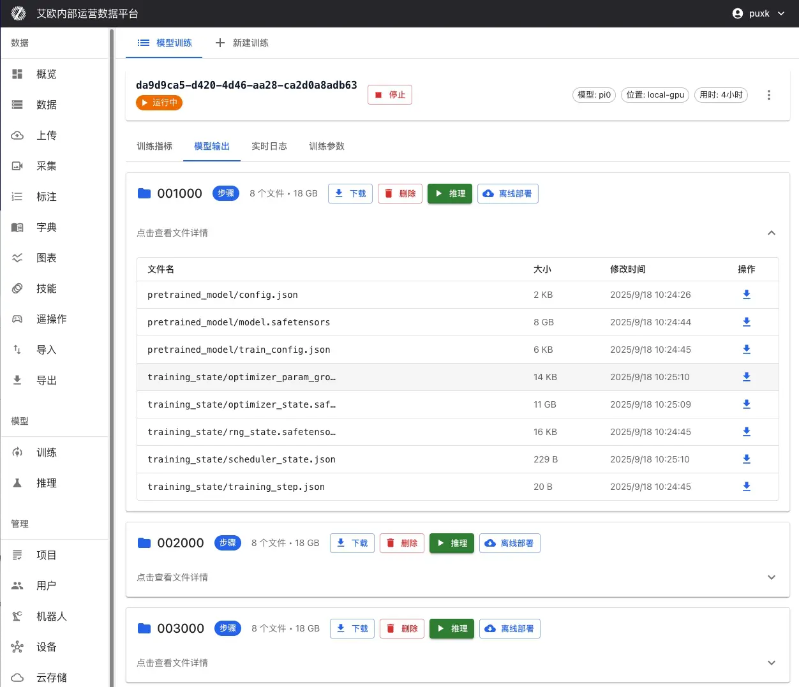

# Model Training

Source: https://io-ai.tech/platform/en/guides/Pipeline/ModelTraining/#related-features

- Data Pipeline

- Model Training

# Model Training

Training robot learning models usually requires multiple steps: processing data, configuring environments, writing training scripts, monitoring training process, etc. For non-technical personnel, this process is complex and error-prone.

The platform provides a productized training process. No code writing needed, you can complete the full operation from data preparation to model deployment through the web interface. You just need to select data, select model, configure parameters, then click start training.

## Quick Start: Start Training in 3 Steps​

### Step 1: Prepare Training Data​

Training data can come from multiple sources. ForROS recordingsalready in the platform (e.g.MCAP;bag/db3coming later), we recommend finishingquality checks—rule setup and reviewing results—before export or training (runs automatically after preprocessing; supports global and project scope) to reduce bad data entering training.

Platform Exported Data(Recommended):

- OnData Exportpage, select annotated datasets

- Select LeRobot or HDF5 format for export

- After export completes, select "Platform Exported Data" on training page

- Select corresponding export record from export history

Other Data Sources:

- External Dataset: Import public datasets through URL links

- Local Data Upload: Support standard formats like HDF5, LeRobot

- HuggingFace Dataset: Directly get public data from HuggingFace Hub

### Step 2: Select Model and Computing Resources​

Select Model Type:

Choose appropriate model based on your task requirements:

Task Type

Recommended Model

Description

Understand Natural Language Instructions

SmolVLA, OpenVLA, Pi0

Robot can understand instructions like "Please organize the desk" and execute

Imitate Expert Demonstrations

ACT, Pi0, Pi0.5

Learn operation skills by learning from expert demonstrations

Complex Operation Sequences

Diffusion Policy

Learn tasks requiring precise control like assembly, cooking

Dynamic Environment Adaptation

SAC, TDMPC

Learn optimal control strategies in dynamic environments

Select Computing Resources:

- Local GPU: Use local data center GPU serversSupport multi-GPU parallel trainingReal-time display of GPU status (memory usage, temperature, utilization)Suitable for large-scale datasets and long training

Local GPU: Use local data center GPU servers

- Support multi-GPU parallel training

- Real-time display of GPU status (memory usage, temperature, utilization)

- Suitable for large-scale datasets and long training

- Public Cloud Resources: Rent computing power from cloud providers on demandRunPod, AWS EC2/SageMaker, Tencent Cloud, Alibaba Cloud, etc.Billed by actual training durationSuitable for temporary training tasks or resource expansion needs

Public Cloud Resources: Rent computing power from cloud providers on demand

- RunPod, AWS EC2/SageMaker, Tencent Cloud, Alibaba Cloud, etc.

- Billed by actual training duration

- Suitable for temporary training tasks or resource expansion needs

### Step 3: Configure Parameters and Start Training​

Basic Parameters:

- batch_size(Batch Size): Recommend range 1-32, adjust based on GPU memory

- steps(Training Steps): Recommend starting from 10000, adjust based on validation results

- eval_freq(Evaluation Frequency): How many steps between evaluations, recommend 10% of total steps

Learning Rate Settings:

- optimizer_lr(Learning Rate): Recommend range 1e-4 to 1e-5

- Too large causes training instability, too small converges slowly

- For pretrained model fine-tuning, recommend lowering learning rate (1e-5)

Model-Specific Parameters:

Different models have their own specific parameters. System will display corresponding parameter configuration items based on selected model.

After configuration completes, click "Start Training".

## Supported Model Types​

The platform supports mainstream learning models in robotics field, covering multiple technical approaches:

### Vision-Language-Action Models​

SmolVLA: Lightweight multimodal model that performs end-to-end learning of natural language instructions, visual perception and robot actions. Suitable for resource-constrained scenarios, real-time response, resource-friendly.

OpenVLA: Large-scale pretrained vision-language-action model, supports complex scene understanding and operation planning. Suitable for tasks requiring strong understanding capabilities.

GR00T: Multimodal GR00T policy, supports vision and language joint planning, has strong general operation capabilities.

### Imitation Learning Models​

ACT (Action Chunking Transformer): Action chunking model based on Transformer architecture, decomposes continuous action sequences into discrete chunks for learning. Suitable for tasks with expert demonstration data.

Pi0: Physical Intelligence's open-source flagship VLA model, fine-tuned through OpenPI framework, has extremely strong general operation capabilities. See details:Pi0 Fine-Tuning Guide

Pi0.5: Enhanced Pi model with better generalization and open-world adaptability, supports more complex operation tasks.

### Policy Learning Models​

Diffusion Policy: Policy learning based on diffusion process, generates continuous robot action trajectories through denoising process. Generated actions are smooth and natural.

VQBET: Vector Quantized Behavior Transformer, discretizes continuous action space then models using Transformer.

### Reinforcement Learning Models​

SAC (Soft Actor-Critic): Maximum entropy reinforcement learning algorithm, balances exploration and exploitation in continuous action space.

TDMPC: Temporal Difference Model Predictive Control, combines advantages of model-based planning and model-free learning.

### Reward Learning Models​

Reward Classifier: Reward function learning model, learns reward signals from annotated data, used for reinforcement learning training.

## Training Workflow​

The platform covers the complete process from data collection to model deployment:

## Advanced Usage​

### How to Configure Training Parameters?​

General Training Parameters:

- batch_size(Batch Size): Control number of samples used per training iterationRecommend range: 1-32Larger batches improve training stability but need more memoryAdjust based on GPU memory size to avoid memory overflow

batch_size(Batch Size): Control number of samples used per training iteration

- Recommend range: 1-32

- Larger batches improve training stability but need more memory

- Adjust based on GPU memory size to avoid memory overflow

- steps(Training Steps): Total number of training steps for modelRecommend starting from 10000Adjust based on validation results to avoid overfitting or underfitting

steps(Training Steps): Total number of training steps for model

- Recommend starting from 10000

- Adjust based on validation results to avoid overfitting or underfitting

- seed(Random Seed): Ensure training result reproducibilityRecommend using fixed values like 1000, 42

seed(Random Seed): Ensure training result reproducibility

- Recommend using fixed values like 1000, 42

- eval_freq(Evaluation Frequency): How many steps between model evaluationsRecommend 10% of total stepsToo frequent evaluation affects training speed

eval_freq(Evaluation Frequency): How many steps between model evaluations

- Recommend 10% of total steps

- Too frequent evaluation affects training speed

- save_freq(Save Frequency): How many steps between checkpoint savesRecommend 30% of total stepsToo frequent saving occupies storage space

save_freq(Save Frequency): How many steps between checkpoint saves

- Recommend 30% of total steps

- Too frequent saving occupies storage space

Optimizer Parameters:

- optimizer_lr(Learning Rate): Control parameter update magnitudeRecommend range: 1e-4 to 1e-5Too large causes training instability, too small converges slowlyFor pretrained model fine-tuning, recommend lowering learning rate (1e-5)

optimizer_lr(Learning Rate): Control parameter update magnitude

- Recommend range: 1e-4 to 1e-5

- Too large causes training instability, too small converges slowly

- For pretrained model fine-tuning, recommend lowering learning rate (1e-5)

- optimizer_weight_decay(Weight Decay): Regularization parameter to prevent overfittingRecommend range: 0.0 to 0.01

optimizer_weight_decay(Weight Decay): Regularization parameter to prevent overfitting

- Recommend range: 0.0 to 0.01

- optimizer_grad_clip_norm(Gradient Clipping Threshold): Prevent gradient explosionRecommend set to 1.0

optimizer_grad_clip_norm(Gradient Clipping Threshold): Prevent gradient explosion

- Recommend set to 1.0

Model-Specific Parameters:

Different models support their own specific parameters:

ACT Model:

- chunk_size(Action Chunk Size): Length of action sequence predicted at once, recommend range 10-50

chunk_size

- n_action_steps(Execution Steps): Actual action steps executed, usually equals chunk_size

n_action_steps

- vision_backbone(Vision Backbone): Optional resnet18/34/50/101/152

vision_backbone

Diffusion Policy Model:

- horizon(Prediction Time Span): Action prediction length for diffusion model, recommend 16

horizon

- num_inference_steps(Inference Steps): Sampling steps, recommend 10

num_inference_steps

SmolVLA/OpenVLA Model:

- max_input_seq_len(Max Input Sequence Length): Limit input token count, recommend 256-512

max_input_seq_len

- freeze_lm_head(Freeze Language Model Head): Recommend enable during fine-tuning

freeze_lm_head

- freeze_vision_encoder(Freeze Vision Encoder): Recommend enable during fine-tuning

freeze_vision_encoder

💡Parameter Setting Recommendations:

- First training recommend using default parameters to ensure training proceeds normally

- Adjust batch_size based on GPU memory size

- For pretrained model fine-tuning, recommend lowering learning rate and freezing some layers

- Regularly view training logs, adjust learning rate based on loss curves

### How to Monitor Training Process?​

Training Metrics Visualization:

On training details page you can view in real time:

- Loss Function Curves: Real-time display of training loss and validation loss, convenient for judging model convergence

- Validation Accuracy Metrics: Display model performance on validation set

- Learning Rate Changes: Visualize execution of learning rate scheduling strategy

- Training Progress: Display completed steps, total steps, estimated remaining time and other information

Resource Monitoring:

- Real-time monitoring of GPU utilization and memory usage

- Tracking of CPU and memory usage

- Monitoring of network IO and disk IO (if applicable)

System Logs:

- Detailed training log records, including detailed information of each training step

- Real-time display of errors and warnings for quick problem location

- Support real-time streaming of logs, can view latest training status anytime

### How to Manage Training Tasks?​

Process Control:

- Pause Training: Temporarily pause training task, retain current progress

- Resume Training: Resume from pause point, seamlessly continue

- Stop Training: Safely stop training task, save current checkpoint

- Restart Training: Restart training task

Checkpoint Management:

During and after training, all saved checkpoints will be displayed on training details page:

Checkpoint Information:

- Checkpoint Name: Auto-generated or custom checkpoint name (e.g., "step_1000", "last", etc.)

- Training Steps: Training steps corresponding to this checkpoint

- Save Time: Timestamp when checkpoint was saved

- File Size: Size of checkpoint file

- Performance Metrics: Performance of this checkpoint on validation set

Checkpoint Operations:

- View Details: View detailed information and evaluation results of checkpoint

- Download Checkpoint: Download checkpoint file to local for offline deployment or further analysis

- Mark as Best: Mark checkpoint with best performance as best model

- Deploy Inference: One-click deploy as inference service directly from checkpoint

Checkpoint Notes:

- last: Last saved checkpoint, usually latest model state

- best: Checkpoint with best performance on validation set, usually used for production deployment

- step_xxx: Checkpoints saved by training steps, can be used to analyze training process

Task Operations:

- Parameter Adjustment: Can view and adjust some training parameters during training (use with caution)

- Task Copy: Quickly create new task based on successful training configuration, reuse best configuration

- Task Delete: Delete unnecessary training tasks to free storage space

### How to Recover from Failed Training?​

If training task fails:

- View Error Information: View detailed error logs on training details page

- Analyze Failure Reason: Common reasons include:Insufficient memory: Lower batch_size or use larger GPUData format error: Check if data format meets requirementsParameter configuration error: Check if parameter settings are reasonable

- Insufficient memory: Lower batch_size or use larger GPU

- Data format error: Check if data format meets requirements

- Parameter configuration error: Check if parameter settings are reasonable

- Modify Parameters: Click "Modify Parameters" on training details page, adjust configuration then retrain

- Resume from Checkpoint: If checkpoints were saved before, can continue training from checkpoint

💡Recommendation: Regularly save checkpoints to avoid data loss from training interruption.

## Training Quota Management​

### What is Training Quota?​

Training quota is used to control resource usage and ensure reasonable allocation of system resources.

Quota Types:

- User Quota: Each user has independent training quota limit

- Global Quota: System-level total quota limit (administrator configured)

- Quota Statistics: Real-time display of used quota and remaining quota

Quota Display:

- Training page displays current user's quota usage

- Display used count and total quota limit

- Cannot create new training tasks when quota exceeded

Quota Management(Administrator):

Administrators can:

- View training quota usage of all users

- Configure global training quota limits

- Adjust individual user quotas

## Common Questions​

### How to Choose Appropriate Model?​

Selection Recommendations:

- Determine Task Type: Is it instruction understanding, imitation learning or reinforcement learning?

- View Model Description: Each model has detailed description, understand applicable scenarios

- Reference Application Cases: View model application cases, choose model closest to your task

- Start Small Scale: Test with small dataset first, confirm model effectiveness before large-scale training

### How Long Does Training Take?​

Time Estimation:

Training time depends on:

- Data Volume: More data means longer training time

- Model Complexity: Complex models need longer time

- Computing Resources: Better GPU performance means faster training

- Training Steps: More steps means longer training time

General Cases:

- Small dataset (less than 1000): 1-3 hours

- Medium dataset (1000-10000): 3-12 hours

- Large dataset (more than 10000): More than 12 hours

Optimization Recommendations:

- Using multi-GPU parallel training can significantly shorten time

- Appropriately lowering batch_size can speed up single step

- Using more powerful GPU can improve training speed

### How to Judge if Training is Normal?​

Normal Training Indicators:

- Loss Decreases: Training loss should gradually decrease

- Validation Metrics Improve: Performance on validation set should gradually improve

- Stable Resources: GPU utilization should remain stable, won't fluctuate frequently

- No Error Logs: Logs shouldn't have large amounts of error information

Abnormal Situations:

- Loss Not Decreasing: May be learning rate too large or too small, need adjustment

- Loss Oscillation: May be batch_size too small, need to increase

- Memory Overflow: Need to lower batch_size or use larger GPU

- Training Stuck: Check if data loading is normal, if network is stable

### What to Do When Training Fails?​

Handling Steps:

- View Error Logs: View detailed error information on training details page

- Analyze Failure Reason: Judge if it's data problem, parameter problem or resource problem based on error information

- Fix Problem: Take corresponding measures based on reason

- Retrain: Create new training task after fixing

Common Errors:

- Insufficient Memory: Lower batch_size or use larger GPU

- Data Format Error: Check if data format meets requirements

- Parameter Configuration Error: Check if parameter settings are reasonable

- Network Problem: Check if network connection is stable

## Related Features​

After completing model training, you may also need:

- Inference Service: Deploy trained model for inference

- Data Export: Export training data

- Action Retargeting: Adapt actions to different robots

## Images on this page

- 
- 
- 
- 
- 
