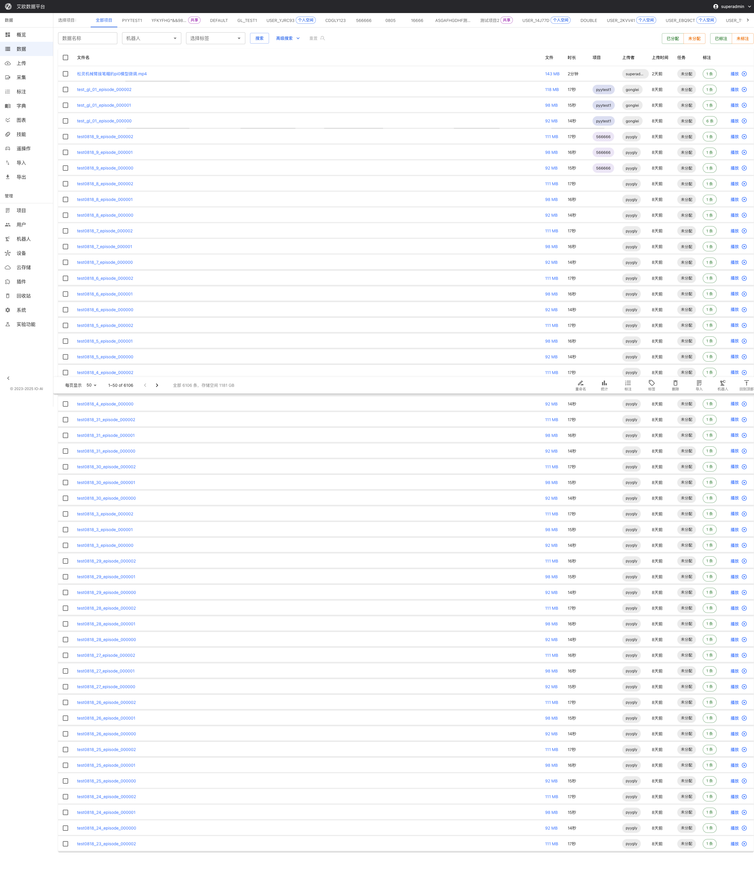
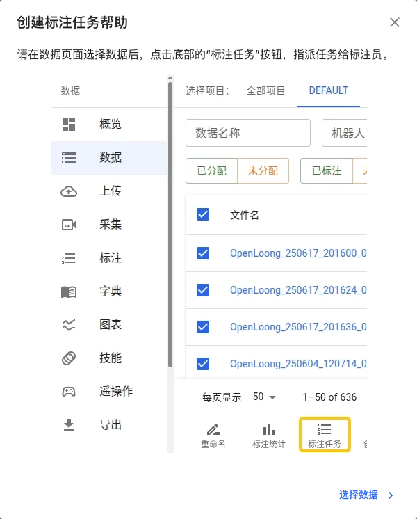
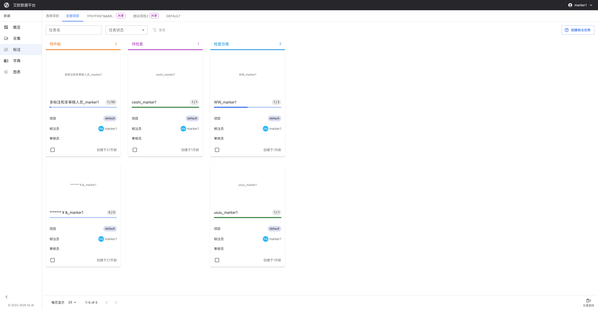
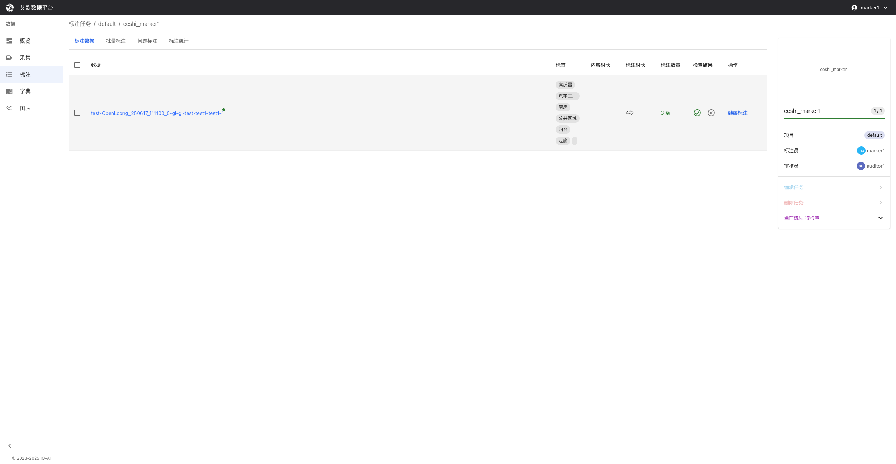
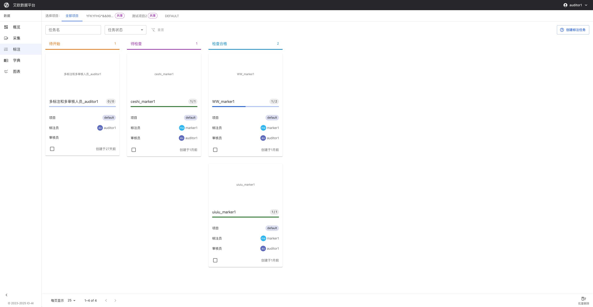
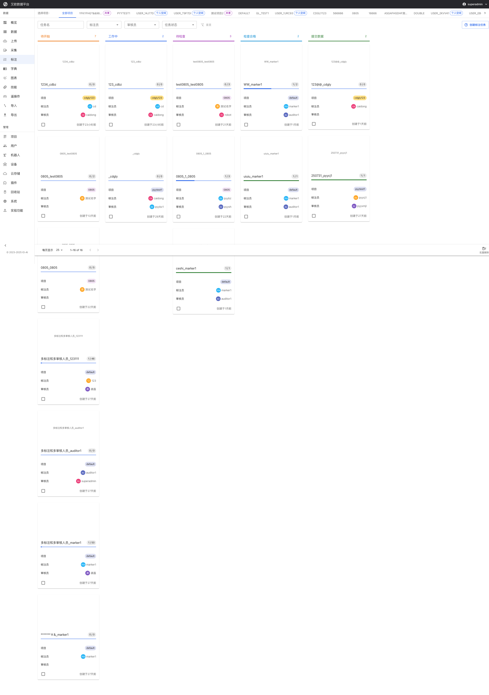

# Workflow

Source: https://io-ai.tech/platform/en/guides/Workflow/#steps-4

- Workflow

# Workflow

## Roles and Flow Overview​

The diagram below summarizes each role’s responsibilities in the main flow: Admin creates projects and members, configures, and exports; Project Manager selects data and creates tasks, assigns annotation/audit; Annotator performs annotation; Auditor checks quality; Collector completes collection and upload.

## Role Playbooks​

### Admin​

#### Responsibilities​

Project, user, and system configuration; export trainable data; ensure security and compliance.

#### Steps​

- Create projects and membersGo to "Projects" to add a project and set name/visibilityIn "Users", create/import accounts and assign roles and projects

Create projects and members

- Go to "Projects" to add a project and set name/visibility

- In "Users", create/import accounts and assign roles and projects

- Configure cloud storage and system parametersConnect object storage (COS/OSS/S3/MinIO) in "Cloud Storage"Configure unified policies for annotation/export/visualization in "System Settings"

Configure cloud storage and system parameters

- Connect object storage (COS/OSS/S3/MinIO) in "Cloud Storage"

- Configure unified policies for annotation/export/visualization in "System Settings"

- Monitor quality and export dataView quality and progress in "Charts/Overview"Filter and export data in "Export" (JSON/CSV/HDF5/LeRobot/MCap)

Monitor quality and export data

- View quality and progress in "Charts/Overview"

- Filter and export data in "Export" (JSON/CSV/HDF5/LeRobot/MCap)

### Project Manager​

#### Responsibilities​

Select data, create tasks, assign annotation/review, and drive progress.

#### Steps​

- Create tasks from selected data (Core)Open "Data", filter and select targets (support batch selection)Click bottom "Annotate" → fill task name, project, annotators, auditors → "Create Task"Screenshots:

Create tasks from selected data (Core)

- Open "Data", filter and select targets (support batch selection)

- Click bottom "Annotate" → fill task name, project, annotators, auditors → "Create Task"

Screenshots:

- Follow up tasksIn "Annotation Tasks", track by state (To Start/In Progress/To Review/Approved)Click task name to enter task detail page and view detailed information and tab contentUse "Dictionaries" to standardize labels if needed

Follow up tasks

- In "Annotation Tasks", track by state (To Start/In Progress/To Review/Approved)

- Click task name to enter task detail page and view detailed information and tab content

- Use "Dictionaries" to standardize labels if needed

- Batch manage tasksMulti-select tasks in task list and use batch delete functionalityView task annotation data, batch annotation, invalid annotations, and annotation statistics through task detail page

Batch manage tasks

- Multi-select tasks in task list and use batch delete functionality

- View task annotation data, batch annotation, invalid annotations, and annotation statistics through task detail page

### Annotator​

#### Responsibilities​

Claim tasks, open data to annotate, submit for review.

#### Steps​

- View tasks in "Annotation Tasks" and open task detail

View tasks in "Annotation Tasks" and open task detail

- In task detail page you can view:Annotation Data tab: View all datasets associated with the taskBatch Annotation tab: Use batch annotation functionality to improve efficiencyInvalid Annotations tab: View annotations marked as invalidAnnotation Statistics tab: View annotation data statistics and analysis

In task detail page you can view:

- Annotation Data tab: View all datasets associated with the task

- Batch Annotation tab: Use batch annotation functionality to improve efficiency

- Invalid Annotations tab: View annotations marked as invalid

- Annotation Statistics tab: View annotation data statistics and analysis

- In task detail, click "Continue Annotation" to open data; submit when done

In task detail, click "Continue Annotation" to open data; submit when done

### Auditor​

#### Responsibilities​

Review annotation results by task, approve or return with notes.

#### Steps​

- In "Annotation Tasks", check "To Review" and "Approved" groups

In "Annotation Tasks", check "To Review" and "Approved" groups

- Enter task detail page, can view in different tabs:Annotation Data: View associated datasets and annotation contentInvalid Annotations: View annotations marked as invalid for focused reviewAnnotation Statistics: View statistical analysis of annotation data

Enter task detail page, can view in different tabs:

- Annotation Data: View associated datasets and annotation content

- Invalid Annotations: View annotations marked as invalid for focused review

- Annotation Statistics: View statistical analysis of annotation data

- Sample or fully review; approve or return with comments

Sample or fully review; approve or return with comments

### Collector​

#### Responsibilities​

Execute collection tasks and upload data; optionally transcode under "Upload".

#### Steps​

- In "Collections", follow assigned tasks and submit data per plan

- With IO teleoperation products, you can enable automatic batch upload

## Images on this page

- 
- 
- 
- 
- 
- 
- 
- 
