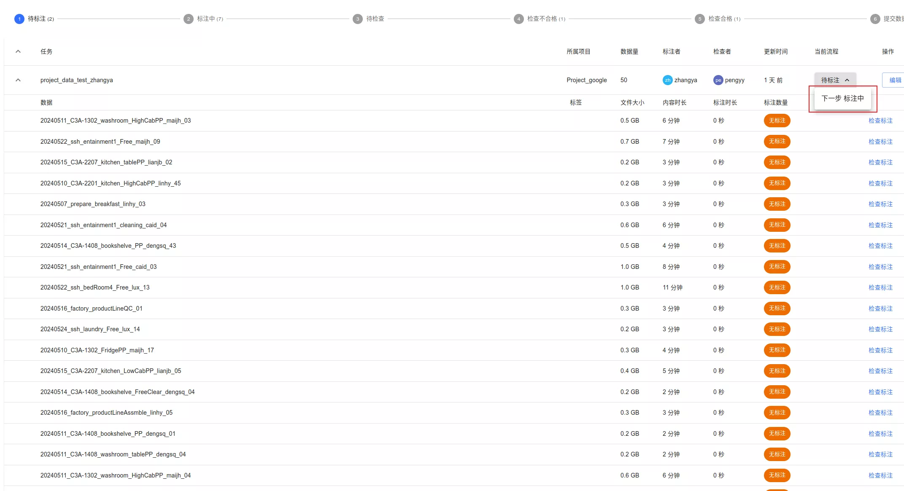
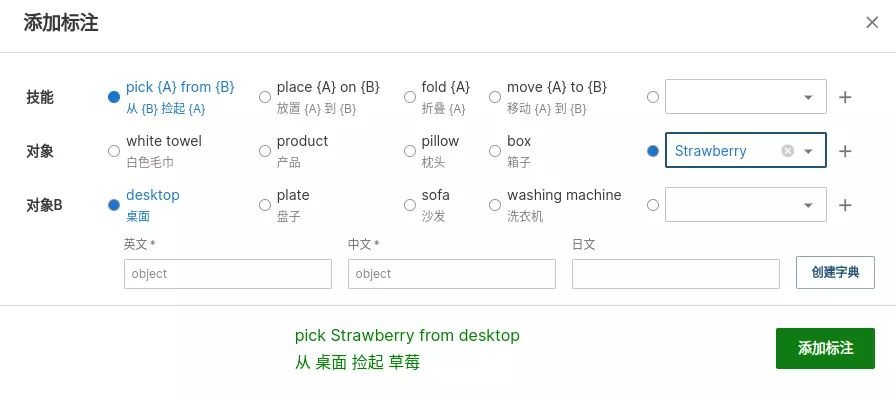
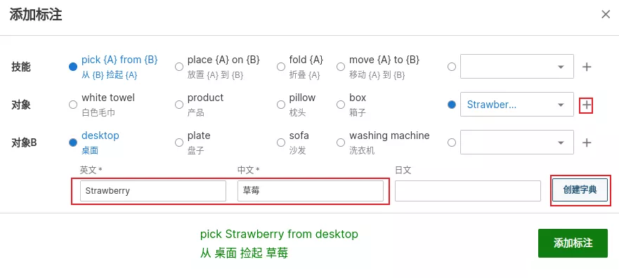
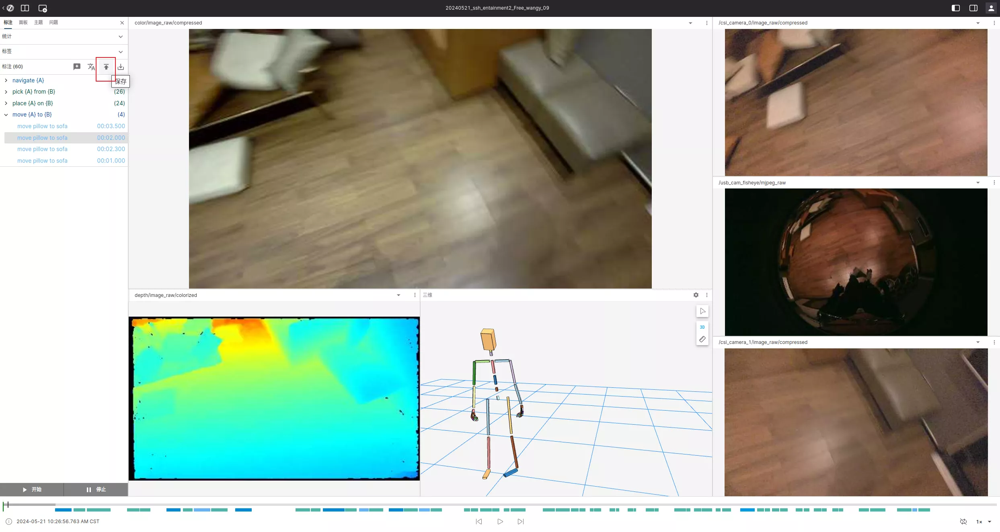

# Annotator Guide

Source: https://io-ai.tech/platform/en/guides/Workflow/Annotator/#5-save

- Workflow

- Annotator Guide

# Annotator Guide

## 1. Sign in​

If not signed in, you will be redirected to the login page.

## 2. View annotation tasks​

Go to "Annotation Tasks" to see your assigned tasks, and note the current status.

Before annotating, set status to "In Progress".

## 3. Start annotation​

Select data and click "Start Annotation". For grasp tasks, mark start (Q) and end (R), and add NL labels accordingly.

Example: hands approach the object = start (Q)

Object lifted and moved = end (R)

Then click "Add label", e.g., pick the strawberry from the desktop.

If the object queue lacks an item, add it (with at least EN/ZH).

Placing label example: place the strawberry on the desktop.

## 4. Data checks​

Check acquisition steps, multi-camera completeness, and mocap posture. Click the NL segment and choose issue labels:

- Invalid collection: acquisition not qualified

- Base data issues: multi-camera/tactile/mocap not qualified

- Tactile error: tactile feedback incorrect

- Invalid collection: incomplete data

## 5. Save​

Click "Save".

When all data is done, set the task to "To Review" so auditors can review.

## Images on this page

- 
- 
- 
- 
- 
- 
- 
- 
- 
- 
