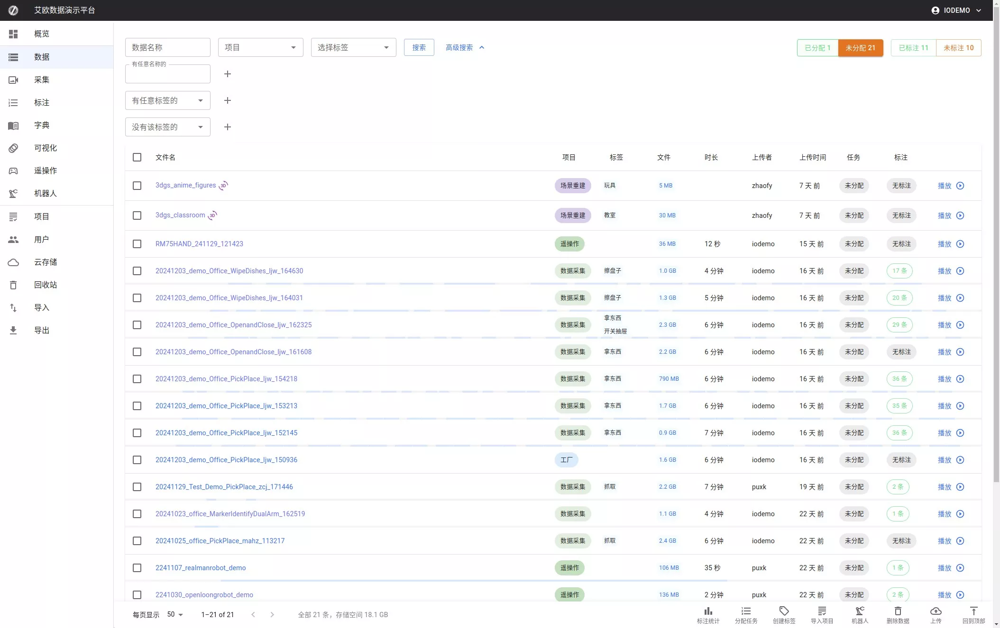
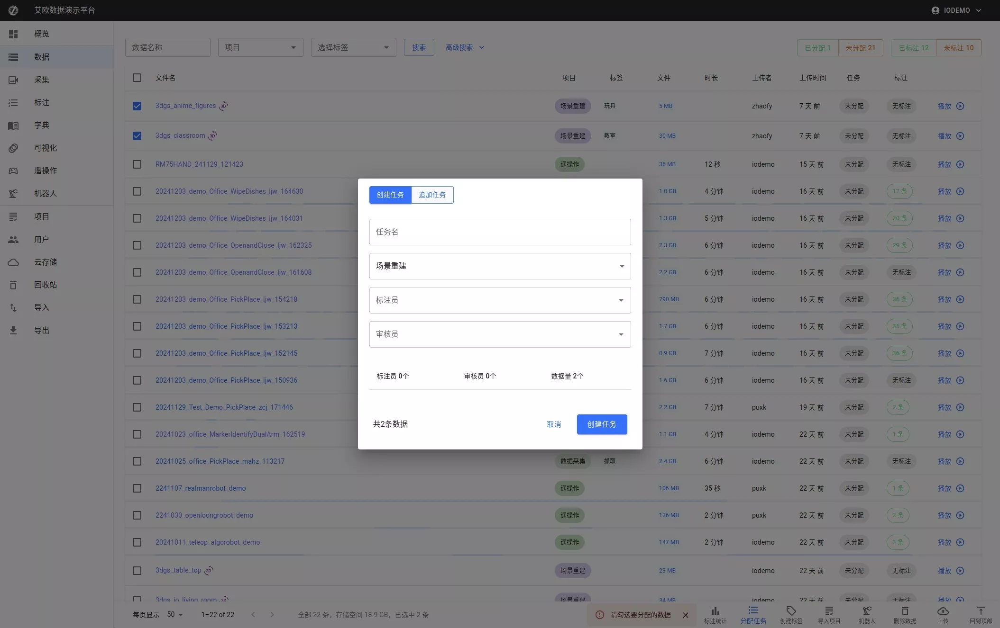

# Create Annotation Task

Source: https://io-ai.tech/platform/en/guides/Workflow/Manager/CreateTask/#3-append-data-to-existing-task

- Workflow

- Project Manager

- Create Annotation Task

# Create Annotation Task

## Project Manager Guide​

### 1. Select unassigned data​

Filter and select data with no task assigned.

### 2. Create a new task​

Click "Create Task", fill in task name, labels, and details, then save.

### 3. Append data to existing task​

Use "Append to Task" to add selected data into an existing task.

## Images on this page

- 
- 
- 
