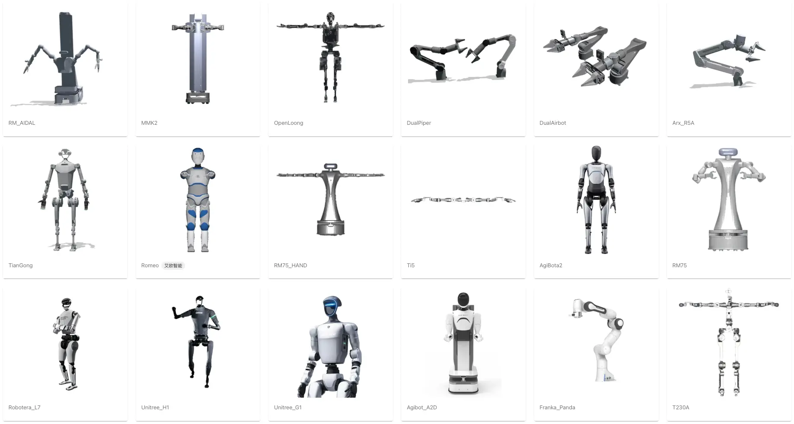
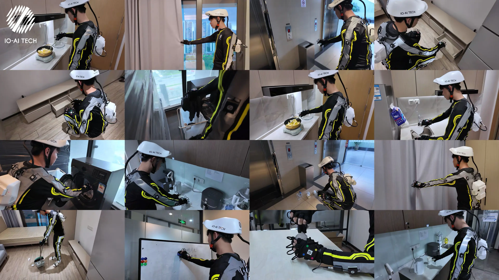

# 艾欧数据平台 | 具身智能数据的标注和管理

Source: https://io-ai.tech/platform/guides/

# 艾欧数据平台

## 数据全流程

## 平台优势

## 部署方式

## 核心功能一览

## 权限与数据安全

## 联系与支持

### 通用机器人与数据标准化

### 方法论与交付经验沉淀

### 无缝集成艾欧产品

### 数据安全保障

### 灵活个性化定制

### 1. SaaS 云端部署

### 2. 私有化镜像部署

艾欧数据平台面向企业级具身智能研发，提供覆盖“采集—标注—管理—导出—训练—部署”的一站式数据与模型工程能力。

平台支持多机器人、多传感器与多格式数据的标准化治理，帮助客户快速建立可持续的数据闭环与规模化交付流程。

多源异构数据经过标准化处理与标注后，可导出为 LeRobot、HDF5 等格式，进而用于 Pi0、SmolVLA、ACT 等模型训练。

训练

Pi0

Pi0.5

SmolVLA

ACT

...

输出

LeRobot

HDF5

JSON

YOLO

处理

格式转换

丢帧检测

人工标注

自动标注

输入

艾欧遥操作

艾欧动捕

松灵

智元

睿尔曼

平台以 ROS 为基准，面向不同构型与厂商设备提供可插拔的预处理/后处理能力，显著降低跨机器人、跨格式的数据治理成本。

已适配多家机器人采集系统（如智元、松灵、睿尔曼等）。不同格式数据可自动转换为标准 ROS 数据格式，便于统一管理、标注、导出与训练。

团队在数据采集与模型训练方面积累了大量实践经验，已累计处理并标注上千小时多模态数据，并将关键方法论产品化为平台标准能力，提升交付效率与结果一致性。

除数据流程外，平台也支持人员与设备的统一管理，例如对机器人设备进行集中监控与远程接管：

平台与艾欧全身动作捕捉 SenseXperience、遥操作 TeleXperience 深度集成，实现从采集到训练的无缝衔接。

购买艾欧通用机器人遥操作产品，即可获赠艾欧数据平台体验版。

平台提供企业级安全与合规能力：支持私有化离线部署、IP 白名单、访问与操作审计等，覆盖关键风险点。

平台采用存储与程序分离架构：数据可落在客户自有对象存储中，访问权限由客户侧完全掌控。

支持按企业需求进行品牌与能力定制，快速形成专属平台形态：

交付物清单：

以上部署方式均提供定期升级服务（如新增导出格式等），以合同约定的维保期限为准。

如需试用、采购或定制化方案，请联系我们：

欢迎注册体验免费开放的 艾欧数据开放平台，从项目经理视角了解平台功能。

- 艾欧数据平台

- 数据即服务

- 工作流程
快速上手
标注员操作指南
审核员操作指南
采集员操作指南
项目经理
新建采集任务
新建标注任务
数据统计与管理
权限说明

- 快速上手

- 标注员操作指南

- 审核员操作指南

- 采集员操作指南

- 项目经理
新建采集任务
新建标注任务
数据统计与管理

- 新建采集任务

- 新建标注任务

- 数据统计与管理

- 权限说明

- 数据流程
数据格式
数据标注
质量检测
HDF5数据集
LeRobot 数据集
模型训练
模型推理

- 数据格式

- 数据标注

- 质量检测

- HDF5数据集

- LeRobot 数据集

- 模型训练

- 模型推理

- 功能模块

- 扩展插件

- 常见问题

- 品牌视觉定制：自定义 Logo、Favicon、标题与介绍等。

- 主题样式定制：上传并管理自定义主题，实时预览效果。

- 机器人适配支持：将任意构型、任意格式数据统一转换为标准 ROS 格式并集中管理。

- 即开即用：无需本地安装，开通账号即可通过互联网访问平台。

- 自动升级：持续获得最新功能与安全更新。

- 弹性扩展：按需分配资源，适应不同规模项目。

- 平台访问专属子域名

- 各角色初始账号及初始密码

- 用户手册与使用文档

- 技术支持与服务联系方式

- 数据本地化：平台可部署于客户自有服务器或私有云，数据完全由客户掌控。

- 能力扩展：可根据业务需求进行功能定制与系统集成。

- 高可用性：独立运行，保障业务连续性与数据安全。

- 平台 Docker 镜像离线安装包

- 安装与部署说明文档

- 现场部署与技术支持服务

- 数据存储阵列服务器（可选，如有采购）

- 用户手册与运维文档

- 角色体系：管理员、项目经理、审核员、标注员、采集员；按需授权，遵循最小权限原则。

- 项目隔离：按项目隔离数据与成员；仅可访问被授权项目范围内的数据资产。

- 数据主权：平台可仅保存数据访问链接；数据实际存储在客户自有或指定对象存储/云存储中。

- 安全机制：IP 白名单、访问密钥、加密传输、细粒度权限控制与审计日志等。

- 邮箱：io@io-ai.tech

- 电话：(+86) 0755-88658665

- 地址：深圳市光明区凤凰街道凤凰社区观光路2533号招商智慧城C1栋5层

- 数据全流程

- 平台优势
通用机器人与数据标准化
方法论与交付经验沉淀
无缝集成艾欧产品
数据安全保障
灵活个性化定制

- 通用机器人与数据标准化

- 方法论与交付经验沉淀

- 无缝集成艾欧产品

- 数据安全保障

- 灵活个性化定制

- 部署方式
1. SaaS 云端部署
2. 私有化镜像部署

- 1. SaaS 云端部署

- 2. 私有化镜像部署

- 核心功能一览

- 权限与数据安全

- 联系与支持

- TeleXperience

- SenseXperience

- EmbodiFlow

- 资源中心

- 新闻动态

- 隐私政策

- 关于我们

- 联系我们

- 加入我们

- LinkedIn

- YouTube

- GitHub

- Hugging Face

用户与权限管理

账户与角色、权限控制、IP 白名单、访问审计

强化安全与合规，满足企业级管控要求

项目与任务管理

项目配置、任务分配、进度监控、统计分析、协作与队列管理

提升协作效率与过程透明度

数据采集与标注

多源采集（视频/图片/传感器）、标注工具、流程自动化、批量标注

提升效率与一致性，覆盖多样化数据源

数据预处理与后处理

可视化处理、格式转换（如视频/音频转 MCAP）、质量检查、标准化与兼容性检测

提升可用性与一致性，保障训练数据质量

审核与反馈

标注审核、打回返工、质量评估与反馈闭环

稳定质量标准，形成持续改进闭环

报告生成

进度与质量报表、导出与自动化报告生成

支撑管理决策，便于对内复盘与对外交付

数据导入

云存储对接、批量导入、多源接入、软删除恢复

快速接入与治理，降低迁移成本

数据导出

标注结果导出、LeRobot/HDF5/MCAP 等格式、导出历史与进度跟踪

便捷流转，适配多训练/评测链路

模型训练

PyTorch/JAX、多平台（CUDA/MPS/CPU）、参数配置、监控与检查点管理

打通训练闭环，提升实验可复现性与可控性

模型推理

一键部署、模拟测试、MCAP 测试、离线边缘部署与服务管理

从验证到上线的一体化推理交付

功能模块

主要功能

目标与价值

---
## Screenshots

