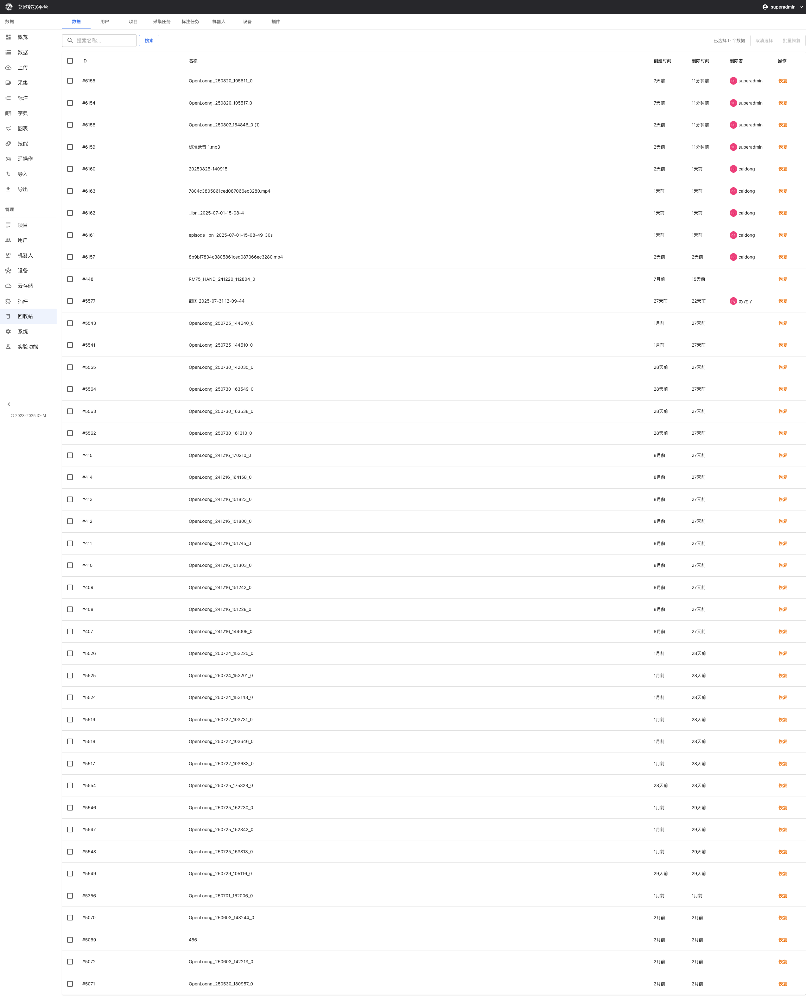

# 回收站 | 具身智能数据的标注和管理

Source: https://io-ai.tech/platform/guides/Modules/trash/

# 回收站

## 快速上手:恢复误删的数据

## 数据集中管理

## 搜索与筛选

## 批量操作功能

## 数据保护机制

## 审计与监控

## 常见问题

## 适用角色

## 相关功能

### 第 1 步:查找删除的数据

### 第 2 步:恢复数据

### 第 3 步:验证恢复结果

### 如何查看已删除的数据?

### 如何分类管理删除数据?

### 如何搜索删除的数据?

### 如何进行高级筛选?

### 如何批量恢复数据?

### 如何批量导出?

### 如何防止误删?

### 如何恢复数据?

### 权限控制

### 如何查看操作记录?

### 如何监控异常操作?

### 如何生成报告?

### 数据在回收站保留多久?

### 如何永久删除数据?

### 恢复数据会影响现有数据吗?

### 管理员

误删了重要数据怎么办?

典型场景:

回收站就是为了解决这些问题而设计的。通过集中展示各模块逻辑删除数据，支持搜索、批量恢复操作，有效避免误删导致的数据损失，为管理员提供统一的数据恢复管理界面。

数据展示:

查看方法:

分类方式:

管理方法:

搜索方式:

搜索方法:

筛选条件:

筛选方法:

批量恢复:

恢复方法:

导出功能:

导出方法:

防护机制:

防护措施:

恢复功能:

权限类型:

权限管理:

操作记录:

异常监控:

监控方法:

报告内容:

生成方法:

保留时间:

平台暂不支持在回收站界面直接永久删除数据。如需永久删除数据，请联系系统运维人员，在存储管理后台进行操作。

永久删除说明:

影响说明:

你可以:

完成回收站管理后，你可能还需要:

- 艾欧数据平台

- 数据即服务

- 工作流程
快速上手
标注员操作指南
审核员操作指南
采集员操作指南
项目经理
新建采集任务
新建标注任务
数据统计与管理
权限说明

- 快速上手

- 标注员操作指南

- 审核员操作指南

- 采集员操作指南

- 项目经理
新建采集任务
新建标注任务
数据统计与管理

- 新建采集任务

- 新建标注任务

- 数据统计与管理

- 权限说明

- 数据流程
数据格式
数据标注
质量检测
HDF5数据集
LeRobot 数据集
模型训练
模型推理

- 数据格式

- 数据标注

- 质量检测

- HDF5数据集

- LeRobot 数据集

- 模型训练

- 模型推理

- 功能模块
首页概览
数据管理
数据上传
采集任务
标注任务
字典管理
分析图表
技能库
遥操作
数据导入
数据导出
项目管理
用户管理
机器人
设备管理
云存储
插件管理
回收站
数据质检
系统设置
视频质检
动作重定向
流程管理
额度管理
运维监控

- 首页概览

- 数据管理

- 数据上传

- 采集任务

- 标注任务

- 字典管理

- 分析图表

- 技能库

- 遥操作

- 数据导入

- 数据导出

- 项目管理

- 用户管理

- 机器人

- 设备管理

- 云存储

- 插件管理

- 回收站

- 数据质检

- 系统设置

- 视频质检

- 动作重定向

- 流程管理

- 额度管理

- 运维监控

- 扩展插件

- 常见问题

- 功能模块

- 不小心删除了重要数据，需要恢复

- 需要查看已删除的数据，了解删除历史

- 需要清理不需要的数据，释放存储空间

- 需要遵循数据保留策略，定期清理过期数据

- 进入回收站页面

- 使用搜索功能查找要恢复的数据:
按数据类型筛选
按删除时间筛选
按操作人员筛选
使用关键词搜索

- 按数据类型筛选

- 按删除时间筛选

- 按操作人员筛选

- 使用关键词搜索

- 找到要恢复的数据

- 选择要恢复的数据

- 点击"恢复"按钮

- 确认恢复操作

- 数据恢复到原来的位置

- 在原始位置查看恢复的数据

- 确认数据完整无误

- 检查数据关联关系

- 完成恢复

- 统一展示:集中展示各模块的逻辑删除数据

- 分类管理:按数据类型和来源模块分类

- 状态跟踪:显示删除时间、删除原因、操作人员等信息

- 查看已删除的数据列表

- 使用筛选功能查看特定类型的数据

- 点击数据查看详细信息

- 数据类型:用户数据、项目数据、任务数据、标注数据等

- 来源模块:数据来自哪个功能模块

- 删除时间:按删除时间分类

- 在回收站中使用分类筛选

- 查看特定类型的数据

- 按来源模块查看数据

- 按时间范围查看数据

- 多维度搜索:按数据类型、删除时间、操作人员、来源模块等搜索

- 关键词搜索:通过数据名称、描述、标签等搜索

- 高级筛选:组合多个条件进行精确筛选

- 在回收站页面使用搜索框

- 输入关键词或选择筛选条件

- 查看搜索结果

- 精确定位目标数据

- 时间范围:选择删除时间范围

- 数据类型:选择要查看的数据类型

- 操作类型:选择操作类型(删除、恢复等)

- 操作人员:选择操作人员

- 点击"高级筛选"按钮

- 设置筛选条件

- 应用筛选

- 查看筛选结果

- 选择多个数据项

- 系统自动处理恢复结果

- 在回收站中选择要恢复的数据

- 点击"批量恢复"按钮

- 等待恢复完成

- 导出数据列表

- 导出删除记录

- 导出操作日志

- 选择要导出的数据

- 点击"批量导出"按钮

- 选择导出格式

- 下载导出的文件

- 删除确认:删除操作需要确认

- 权限验证:验证操作权限

- 操作记录:记录所有删除操作

- 删除前系统会要求确认

- 验证用户权限

- 记录操作日志

- 提供恢复功能

- 恢复验证:验证数据是否可以恢复

- 冲突处理:处理恢复时的冲突

- 恢复通知:通知恢复结果

- 系统验证并恢复数据

- 查看恢复结果

- 查看权限:查看回收站数据的权限

- 恢复权限:恢复数据的权限

- 不同角色具有不同的权限

- 管理员可以查看和恢复所有数据

- 普通用户只能查看和恢复自己的数据

- 永久删除操作仅限系统运维人员在存储管理后台执行

- 查看记录:记录所有查看操作

- 恢复记录:记录所有恢复操作

- 删除记录:记录所有删除操作

- 在回收站中查看操作记录

- 筛选特定类型的操作

- 查看操作详情

- 导出操作记录

- 异常访问:监控异常访问行为

- 批量操作:监控批量操作

- 权限异常:监控权限异常

- 系统自动监控异常操作

- 发送告警通知

- 查看异常详情

- 采取处理措施

- 操作统计:统计操作次数和类型

- 数据变化:统计数据变化情况

- 安全事件:记录安全事件

- 在回收站中选择"生成报告"

- 选择报告类型和时间范围

- 生成报告

- 查看或导出报告

- 数据在回收站中保留一定时间(通常为 30 天)

- 超过保留时间的数据会自动永久删除

- 可以根据数据保留策略调整保留时间

- 永久删除操作不可恢复，请谨慎操作

- 只有系统运维人员可以在存储管理后台执行永久删除

- 普通用户和管理员只能恢复数据，无法执行永久删除

- 如果原位置存在同名数据，恢复时会提示冲突

- 可以选择覆盖或跳过

- 建议先检查原位置数据，再决定是否恢复

- 统一恢复或清理数据

- 遵循公司数据保留策略

- 监控数据删除情况

- 处理数据恢复请求

- 数据管理:查看恢复后的数据

- 用户管理:恢复用户数据

- 项目管理:恢复项目数据

- 快速上手:恢复误删的数据
第 1 步:查找删除的数据
第 2 步:恢复数据
第 3 步:验证恢复结果

- 第 1 步:查找删除的数据

- 第 2 步:恢复数据

- 第 3 步:验证恢复结果

- 数据集中管理
如何查看已删除的数据?
如何分类管理删除数据?

- 如何查看已删除的数据?

- 如何分类管理删除数据?

- 搜索与筛选
如何搜索删除的数据?
如何进行高级筛选?

- 如何搜索删除的数据?

- 如何进行高级筛选?

- 批量操作功能
如何批量恢复数据?
如何批量导出?

- 如何批量恢复数据?

- 如何批量导出?

- 数据保护机制
如何防止误删?
如何恢复数据?
权限控制

- 如何防止误删?

- 如何恢复数据?

- 权限控制

- 审计与监控
如何查看操作记录?
如何监控异常操作?
如何生成报告?

- 如何查看操作记录?

- 如何监控异常操作?

- 如何生成报告?

- 常见问题
数据在回收站保留多久?
如何永久删除数据?
恢复数据会影响现有数据吗?

- 数据在回收站保留多久?

- 如何永久删除数据?

- 恢复数据会影响现有数据吗?

- 适用角色
管理员

- 管理员

- 相关功能

- TeleXperience

- SenseXperience

- EmbodiFlow

- 资源中心

- 新闻动态

- 隐私政策

- 关于我们

- 联系我们

- 加入我们

- LinkedIn

- YouTube

- GitHub

- Hugging Face

---
## Screenshots

