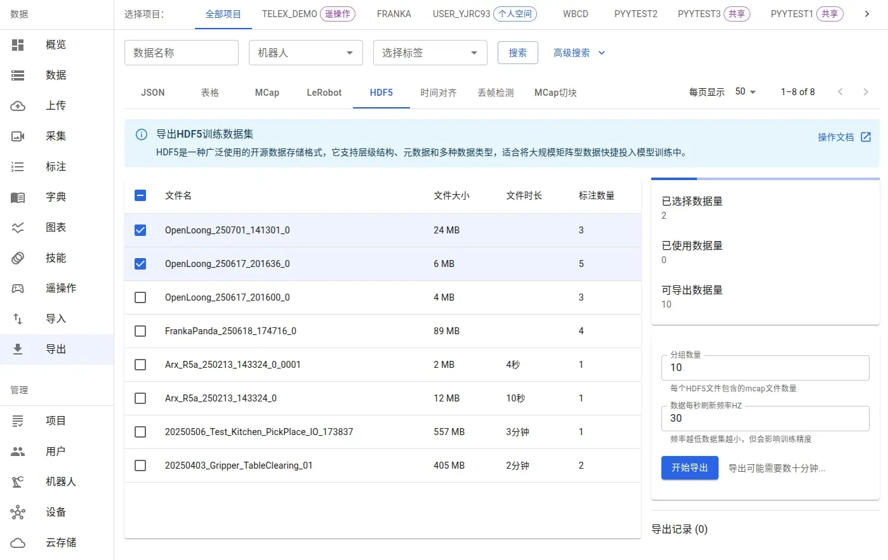

# HDF5数据集

Source: https://io-ai.tech/platform/guides/Pipeline/HDF5/#机器人模型训练

- 数据流程

- HDF5数据集

# HDF5数据集

HDF5（Hierarchical Data Format version 5）是一种高效、灵活的数据存储格式，广泛应用于具身智能领域。其分层结构（组和数据集）便于组织和管理多模态复杂数据，支持高效的数据读写和跨平台共享。

## HDF5数据导入​

在具身智能领域，HDF5文件的结构和命名方式因设备厂商而异。平台已适配主流外部数据采集系统（如松灵Piper），可直接导入相关HDF5文件并进行可视化。

如果您的HDF5数据暂未支持，请联系我们告知数据结构，我们将快速完成适配，让您的多模态数据完美地在平台上可视化、标注和导出。

## HDF5数据导出​

平台支持将mcap、bag、hdf5等格式的数据标注后导出为HDF5文件，便于后续机器学习模型训练。标注过程将动作与自然语言指令关联，确保VLA模型能够理解并执行语言命令。

标注操作详见：数据标注

标注完成后，可在导出界面选择所需数据子集进行导出。

- 分组数量：设置每个HDF5文件包含的原始文件数量。若需一一对应，可设为1。

- 数据刷新频率：控制每秒数据采集次数，影响文件大小。

导出后，您可在界面查看结果：

下载后的数据：

## 导出数据结构说明​

导出的HDF5文件按原始文件分组命名（如chunk_001.hdf5），采用树状结构组织数据：

chunk_001.hdf5

- 根组（/）：顶层目录。

- 子组：如/data、/meta。/data下按标注任务序列划分为子组（如episode_001、episode_002）。

/data

/meta

- /data下按标注任务序列划分为子组（如episode_001、episode_002）。

/data

episode_001

episode_002

- 数据集：如/data/episode_001属性值包括task标注的自然语言(英文)task_zh标注的自然语言(中文)score动作质量评分存储的数据包括action下发的关节指令 (多维数组)observation.images.*各个视角的压缩图像 (JPEG)observation.state传感器的观测值 (多维数组)observation.gripper夹爪闭合状态的观测值 (多维数组)

/data/episode_001

- 属性值包括task标注的自然语言(英文)task_zh标注的自然语言(中文)score动作质量评分

- task标注的自然语言(英文)

task

- task_zh标注的自然语言(中文)

task_zh

- score动作质量评分

score

- 存储的数据包括action下发的关节指令 (多维数组)observation.images.*各个视角的压缩图像 (JPEG)observation.state传感器的观测值 (多维数组)observation.gripper夹爪闭合状态的观测值 (多维数组)

- action下发的关节指令 (多维数组)

action

- observation.images.*各个视角的压缩图像 (JPEG)

observation.images.*

- observation.state传感器的观测值 (多维数组)

observation.state

- observation.gripper夹爪闭合状态的观测值 (多维数组)

observation.gripper

示例结构如下：

HDF5 "./chunk_001.hdf5" {FILE_CONTENTS {group      /group      /datagroup      /data/episode_001dataset    /data/episode_001/actiondataset    /data/episode_001/observation.gripperdataset    /data/episode_001/observation.images.camera_01dataset    /data/episode_001/observation.images.camera_02dataset    /data/episode_001/observation.images.camera_03dataset    /data/episode_001/observation.images.camera_04dataset    /data/episode_001/observation.stategroup      /data/episode_002dataset    /data/episode_002/actiondataset    /data/episode_002/observation.gripperdataset    /data/episode_002/observation.images.camera_01dataset    /data/episode_002/observation.images.camera_02dataset    /data/episode_002/observation.images.camera_03dataset    /data/episode_002/observation.images.camera_04dataset    /data/episode_002/observation.state......group      /meta}}

HDF5 "./chunk_001.hdf5" {FILE_CONTENTS {group      /group      /datagroup      /data/episode_001dataset    /data/episode_001/actiondataset    /data/episode_001/observation.gripperdataset    /data/episode_001/observation.images.camera_01dataset    /data/episode_001/observation.images.camera_02dataset    /data/episode_001/observation.images.camera_03dataset    /data/episode_001/observation.images.camera_04dataset    /data/episode_001/observation.stategroup      /data/episode_002dataset    /data/episode_002/actiondataset    /data/episode_002/observation.gripperdataset    /data/episode_002/observation.images.camera_01dataset    /data/episode_002/observation.images.camera_02dataset    /data/episode_002/observation.images.camera_03dataset    /data/episode_002/observation.images.camera_04dataset    /data/episode_002/observation.state......group      /meta}}

## HDF5文件读取示例​

推荐使用 Python 的h5py库读取和操作HDF5文件。基本用法如下：

importh5py# 以只读模式打开 HDF5 文件withh5py.File('chunk_001.hdf5','r')asf:# 查看顶层组print("顶层组：",list(f.keys()))# 访问 /data/episode_001 组下的数据集episode_001=f['/data/episode_001']print("episode_001 下的数据集：",list(episode_001.keys()))# 读取 action 数据集action_data=episode_001['action'][:]print("action 数据：",action_data)

importh5py# 以只读模式打开 HDF5 文件withh5py.File('chunk_001.hdf5','r')asf:# 查看顶层组print("顶层组：",list(f.keys()))# 访问 /data/episode_001 组下的数据集episode_001=f['/data/episode_001']print("episode_001 下的数据集：",list(episode_001.keys()))# 读取 action 数据集action_data=episode_001['action'][:]print("action 数据：",action_data)

## 应用场景与优势​

HDF5格式在具身智能领域具有以下优势：

- 支持大规模多模态数据存储（如高分辨率图像、传感器数据等）

- 内置数据压缩，节省存储空间

- 跨平台兼容，便于数据共享和迁移

- 灵活的数据层次结构，适合复杂任务和多样化数据管理

合理设计HDF5结构，结合平台工具，能高效管理和处理具身智能相关的复杂数据，助力科学研究和模型训练。

## 机器人模型训练​

导出的HDF5数据可以直接用于各种机器人学习模型的训练，包括模仿学习、强化学习和视觉-语言-动作（VLA）模型等。

详细的训练方法和代码示例请参考：HDF5数据用于机器人模型训练

## Images on this page

- 
- 
