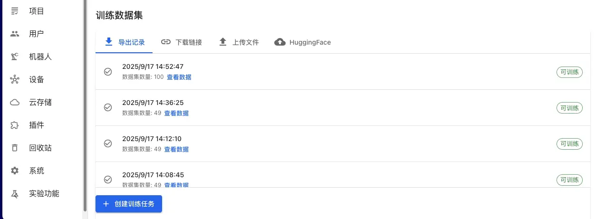
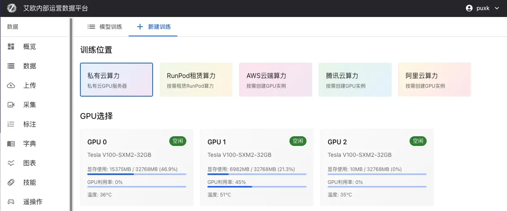
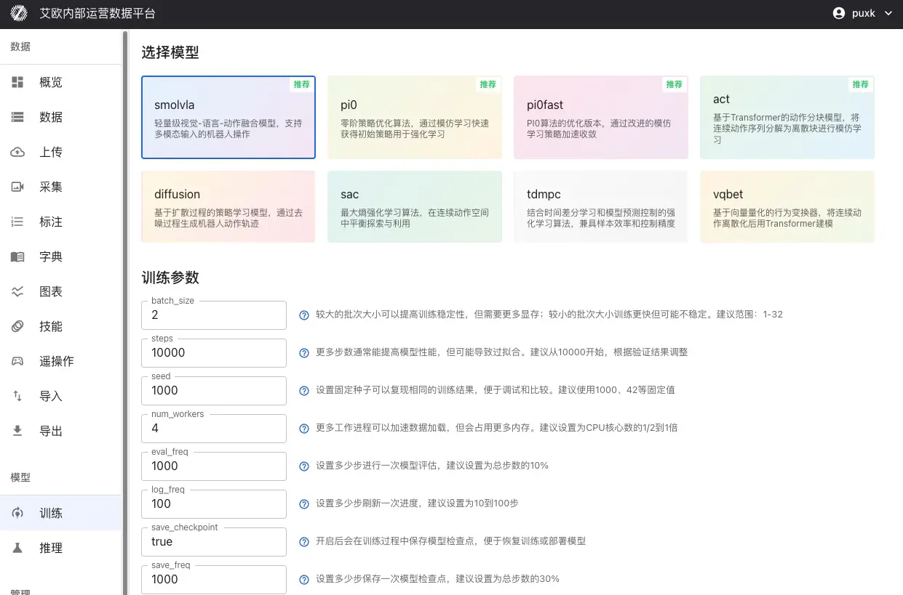
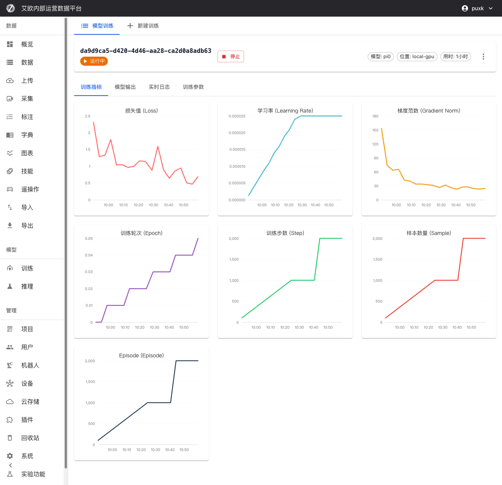

# 模型训练

Source: https://io-ai.tech/platform/guides/Pipeline/ModelTraining/#相关功能

- 数据流程

- 模型训练

# 模型训练

训练机器人学习模型通常需要处理数据、配置环境、编写训练脚本、监控训练过程等多个步骤。对于非技术人员来说，这个过程既复杂又容易出错。

平台提供了产品化的训练流程，无需编写代码，通过网页界面就能完成从数据准备到模型部署的完整操作。你只需要选择数据、选择模型、配置参数，然后点击开始训练。

## 快速上手:3 步开始训练​

### 第 1 步:准备训练数据​

训练数据可以来自多个来源。对平台内已入库的ROS 录制数据（如 MCAP，后续亦支持 bag、db3 等），建议在导出或发起训练前完成质量检测中的规则配置与结果确认（预处理完成后自动执行，支持全局与项目范围），以降低劣质数据进入训练的概率。

平台导出数据(推荐):

- 在数据导出页面，选择已标注的数据集

- 选择 LeRobot 或 HDF5 格式导出

- 导出完成后，在训练页面选择"平台导出数据"

- 从导出历史中选择对应的导出记录

其他数据来源:

- 外部数据集:通过 URL 链接导入公开数据集

- 本地数据上ä¼:支持 HDF5、LeRobot 等标准格式

- HuggingFace 数据集:直接从 HuggingFace Hub 获取公开数据

### 第 2 步:选择模型和计算资源​

选择模型类型:

根据你的任务需求选择合适的模型:

任务类型

推荐模型

说明

理解自然语言指令

SmolVLA、OpenVLA、Pi0

机器人可理解"请整理桌面"等指令并执行

模仿专家演示

ACT、Pi0、Pi0.5

通过学习专家演示学习操作技能

复杂操作序列

Diffusion Policy

学习如组装、烹饪等需要精确控制的任务

动态环境适应

SAC、TDMPC

在动态环境中学习最优控制策略

选择计算资源:

- 本地 GPU:使用本地机房的 GPU 服务器支持多 GPU 并行训练实时显示 GPU 状态(显存使用、温度、利用率)适合大规模数据集和长时间训练

本地 GPU:使用本地机房的 GPU 服务器

- 支持多 GPU 并行训练

- 实时显示 GPU 状态(显存使用、温度、利用率)

- 适合大规模数据集和长时间训练

- 公有云资源:按需租赁云服务商的算力RunPod、AWS EC2/SageMaker、腾讯云、阿里云等按实际训练时长计费适合临时性训练任务或资源扩展需求

公有云资源:按需租赁云服务商的算力

- RunPod、AWS EC2/SageMaker、腾讯云、阿里云等

- 按实际训练时长计费

- 适合临时性训练任务或资源扩展需求

### 第 3 步:配置参数并开始训练​

基础参数:

- batch_size(批次大小):建议范围 1-32，根据 GPU 显存调整

- steps(训练步数):建议从 10000 开始，根据验证结果调整

- eval_freq(评估频率):每多少步进行一次评估，建议为总步数的 10%

学习率设置:

- optimizer_lr(学习率):建议范围 1e-4 到 1e-5

- 过大导致训练不稳定，过小收敛慢

- 对于预训练模型微调，建议降低学习率(1e-5)

模型特定参数:

不同模型有各自的特定参数，系统会根据选择的模型显示对应的参数配置项。

配置完成后，点击"开始训练"即可。

## 支持的模型类型​

平台支持机器人领域的主流学习模型，涵盖多种技术路线:

### 视觉-语言-动作模型​

SmolVLA:轻量级多模态模型，将自然语言指令、视觉感知和机器人动作进行端到端学习。适合资源受限的场景，实时响应，资源友好。

OpenVLA:大规模预训练的视觉-语言-动作模型，支持复杂的场景理解和操作规划。适合需要强大理解能力的任务。

GR00T:多模态 GR00T 策略，支持视觉与语言联合规划，具备强大的通用操作能力。

### 模仿学习模型​

ACT (Action Chunking Transformer):基于 Transformer 架构的动作分块模型，将连续动作序列分解为离散块进行学习。适合有专家演示数据的任务。

Pi0:PhysicalIntelligence 开源的旗舰 VLA 模型，通过 OpenPI 框架进行微调，具备极强的通用操作能力。详见:Pi0 微调指南

Pi0.5:增强版 Pi 模型，具有更好的泛化能力和开放世界适应性，支持更复杂的操作任务。

### 策略学习模型​

Diffusion Policy:基于扩散过程的策略学习，通过去噪过程生成连续的机器人动作轨迹。生成的动作平滑自然。

VQBET:向量量化行为变换器，将连续动作空间离散化后使用 Transformer 进行建模。

### 强化学习模型​

SAC (Soft Actor-Critic):最大熵强化学习算法，在连续动作空间中平衡探索与利用。

TDMPC:时间差分模型预测控制，结合基于模型的规划和无模型的学习优势。

### 奖励学习模型​

Reward Classifier:奖励函数学习模型，从标注数据学习奖励信号，用于强化学习训练。

## 训练工作流程​

平台覆盖了从数据采集到模型部署的完整流程:

## 进阶使用​

### 如何配置训练参数?​

通用训练参数:

- batch_size(批次大小):控制每次训练使用的样本数量建议范围:1-32较大批次提高训练稳定性但需要更多显存根据 GPU 显存大小调整，避免显存溢出

batch_size(批次大小):控制每次训练使用的样本数量

- 建议范围:1-32

- 较大批次提高训练稳定性但需要更多显存

- 根据 GPU 显存大小调整，避免显存溢出

- steps(训练步数):模型训练的总步数建议从 10000 开始根据验证结果调整，避免过拟合或欠拟合

steps(训练步数):模型训练的总步数

- 建议从 10000 开始

- 根据验证结果调整，避免过拟合或欠拟合

- seed(随机种子):确保训练结果可重现性建议使用 1000、42 等固定值

seed(随机种子):确保训练结果可重现性

- 建议使用 1000、42 等固定值

- eval_freq(评估频率):每多少步进行一次模型评估建议为总步数的 10%评估过频繁会影响训练速度

eval_freq(评估频率):每多少步进行一次模型评估

- 建议为总步数的 10%

- 评估过频繁会影响训练速度

- save_freq(保存频率):每多少步保存一次检查点建议为总步数的 30%保存过频繁会占用存储空间

save_freq(保存频率):每多少步保存一次检查点

- 建议为总步数的 30%

- 保存过频繁会占用存储空间

优化器参数:

- optimizer_lr(学习率):控制参数更新幅度建议范围:1e-4 到 1e-5过大导致训练不稳定，过小收敛慢对于预训练模型微调，建议降低学习率(1e-5)

optimizer_lr(学习率):控制参数更新幅度

- 建议范围:1e-4 到 1e-5

- 过大导致训练不稳定，过小收敛慢

- 对于预训练模型微调，建议降低学习率(1e-5)

- optimizer_weight_decay(权重衰减):防止过拟合的正则化参数建议范围:0.0 到 0.01

optimizer_weight_decay(权重衰减):防止过拟合的正则化参数

- 建议范围:0.0 到 0.01

- optimizer_grad_clip_norm(梯度裁剪阈值):防止梯度爆炸建议设置为 1.0

optimizer_grad_clip_norm(梯度裁剪阈值):防止梯度爆炸

- 建议设置为 1.0

模型特定参数:

不同模型支持各自的特定参数:

ACT 模型:

- chunk_size(动作块大小):一次预测的动作序列长度，建议范围 10-50

chunk_size

- n_action_steps(执行步数):实际执行的动作步数，通常等于 chunk_size

n_action_steps

- vision_backbone(视觉 backbone):可选 resnet18/34/50/101/152

vision_backbone

Diffusion Policy 模型:

- horizon(预测时间跨度):扩散模型的动作预测长度，建议 16

horizon

- num_inference_steps(推理步数):采样步数，建议 10

num_inference_steps

SmolVLA/OpenVLA 模型:

- max_input_seq_len(最大输入序列长度):限制输入 token 数量，建议 256-512

max_input_seq_len

- freeze_lm_head(冻结语言模型头部):微调时建议开启

freeze_lm_head

- freeze_vision_encoder(冻结视觉编码器):微调时建议开启

freeze_vision_encoder

💡参数设置建议:

- 首次训练建议使用默认参数，确保训练正常进行

- 根据 GPU 显存大小调整 batch_size

- 对于预训练模型微调，建议降低学习率并冻结部分层

- 定期查看训练日志，根据损失曲线调整学习率

### 如何监控训练过程?​

训练指标可视化:

在训练详情页面可以实时查看:

- 损失函数曲线:实时显示训练损失和验证损失，便于判断模型收敛情况

- 验证精度指标:显示模型在验证集上的性能表现

- 学习率变化:可视化学习率调度策略的执行情况

- 训练进度:显示已完成步数、总步数、预计剩余时间等信息

资源监控:

- GPU 利用率、显存占用实时监控

- CPU 和内存使用情况跟踪

- 网络 IO 和磁盘 IO 监控(如适用)

系统日志:

- 详细的训练日志记录，包括每个训练步骤的详细信息

- 错误和警告信息实时显示，便于快速定位问题

- 支持日志实时流式传输，可随时查看最新训练状态

### 如何管理训练任务?​

进程控制:

- 暂停训练:临时暂停训练任务，保留当前进度

- 恢复训练:从暂停点恢复训练，无缝继续

- 停止训练:安全停止训练任务，保存当前检查点

- 重启训练:重新启动训练任务

检查点管理:

训练过程中和训练完成后，所有保存的检查点都会在训练详情页面显示:

检查点信息:

- 检查点名称:自动生成或自定义的检查点名称(如"step_1000"、"last"等)

- 训练步数:该检查点对应的训练步数

- 保存时间:检查点的保存时间戳

- 文件大小:检查点文件的大小

- 性能指标:该检查点在验证集上的性能表现

检查点操作:

- 查看详æƒ:查看检查点的详细信息和评估结果

- 下载检查点:下载检查点文件到本地，用于离线部署或进一步分析

- 标记为最佳:将性能最好的检查点标记为最佳模型

- 部署推理:直接从检查点一键部署为推理服务

检查点说明:

- last:最后一个保存的检查点，通常是最新的模型状态

- best:在验证集上表现最好的检查点，通常用于生产部署

- step_xxx:按训练步数保存的检查点，可用于分析训练过程

任务操作:

- 参数调整:训练过程中可查看和调整部分训练参数(需谨慎使用)

- 任务复制:基于成功的训练配置快速创建新任务，复用最佳配置

- 任务删除:删除不需要的训练任务，释放存储空间

### 如何从失败的训练中恢复?​

如果训练任务失败:

- 查看错误信息:在训练详情页面查看详细的错误日志

- 分析失败原å›:常见原因包括:显存不足:降低 batch_size 或使用更大的 GPU数据格式错误:检查数据格式是否符合要求参数配置错误:检查参数设置是否合理

- 显存不足:降低 batch_size 或使用更大的 GPU

- 数据格式错误:检查数据格式是否符合要求

- 参数配置错误:检查参数设置是否合理

- 修改参数:在训练详情页面点击"修改参数"，调整配置后重新训练

- 从检查点恢复:如果之前保存了检查点，可以从检查点继续训练

💡建议:定期保存检查点，避免训练中断导致数据丢失。

## 训练配额管理​

### 什么是训练配额?​

训练配额用于控制资源使用，确保系统资源合理分配。

配额类型:

- 用户配额:每个用户有独立的训练配额限制

- 全局配额:系统级别的总配额限制(管理员配置)

- 配额统计:实时显示已使用配额和剩余配额

配额显示:

- 训练页面显示当前用户的配额使用情况

- 显示已使用数量和总配额限制

- 超出配额时无法创建新的训练任务

配额管理(管理员):

管理员可以:

- 查看所有用户的训练配额使用情况

- 配置全局训练配额限制

- 调整单个用户的配额

## 常见问题​

### 如何选择合适的模型?​

选择建议:

- 确定任务类型:是理解指令、模仿学习还是强化学习?

- 查看模型说明:每个模型都有详细说明，了解适用场景

- 参考应用案例:查看模型的应用案例，选择最接近你任务的模型

- 从小规模开始:先用小数据集测试，确认模型效果后再大规模训练

### 训练需要多长时间?​

时间估算:

训练时间取决于:

- 数据量:数据越多，训练时间越长

- 模型复杂度:复杂模型需要更长时间

- 计算资源:GPU性能越好，训练越快

- 训练步数:步数越多，训练时间越长

一般情况:

- 小数据集(1000 条以下):1-3 小时

- 中等数据集(1000-10000 条):3-12 小时

- 大数据集(10000 条以上):12 小时以上

优化建议:

- 使用多 GPU 并行训练可以显著缩短时间

- 适当降低 batch_size 可以加快单步速度

- 使用更强大的 GPU 可以提升训练速度

### 如何判断训练是否正常?​

正常训练的指标:

- 损失下降:训练损失应该逐渐下降

- 验证指标提升:验证集上的性能应该逐渐提升

- 资源稳定:GPU利用率应该保持稳定，不会频繁波动

- 无错误日志:日志中不应该有大量错误信息

异常情况:

- 损失不下降:可能是学习率过大或过小，需要调整

- 损失震荡:可能是 batch_size 太小，需要增大

- 显存溢出:需要降低 batch_size 或使用更大的 GPU

- 训练卡住:检查数据加载是否正常，网络是否稳定

### 训练失败怎么办?​

处理步骤:

- 查看错误日志:在训练详情页面查看详细的错误信息

- 分析失败原å›:根据错误信息判断是数据问题、参数问题还是资源问题

- 修复问题:根据原因采取相应措施

- 重新训练:修复后重新创建训练任务

常见错误:

- 显存不足:降低 batch_size 或使用更大的 GPU

- 数据格式错误:检查数据格式是否符合要求

- 参数配置错误:检查参数设置是否合理

- 网络问题:检查网络连接是否稳定

## 相关功能​

完成模型训练后，你可能还需要:

- 推理服务:部署训练好的模型用于推理

- 数据导出:导出训练数据

- 动作重定向:将动作适配到不同机器人

## Images on this page

- 
- 
- 
- 
- 
