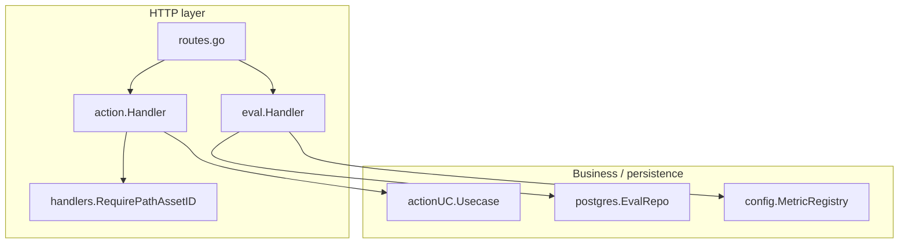
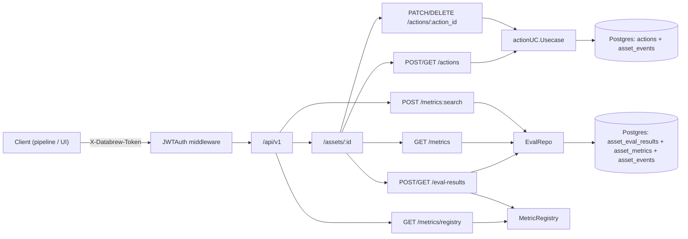
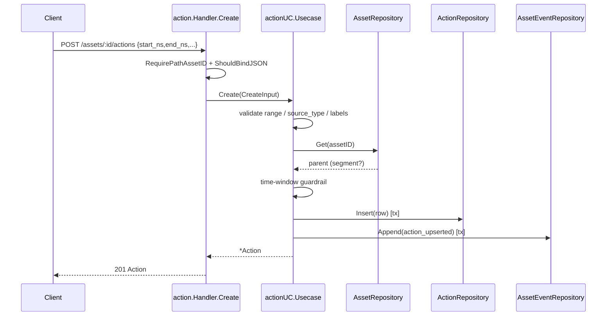
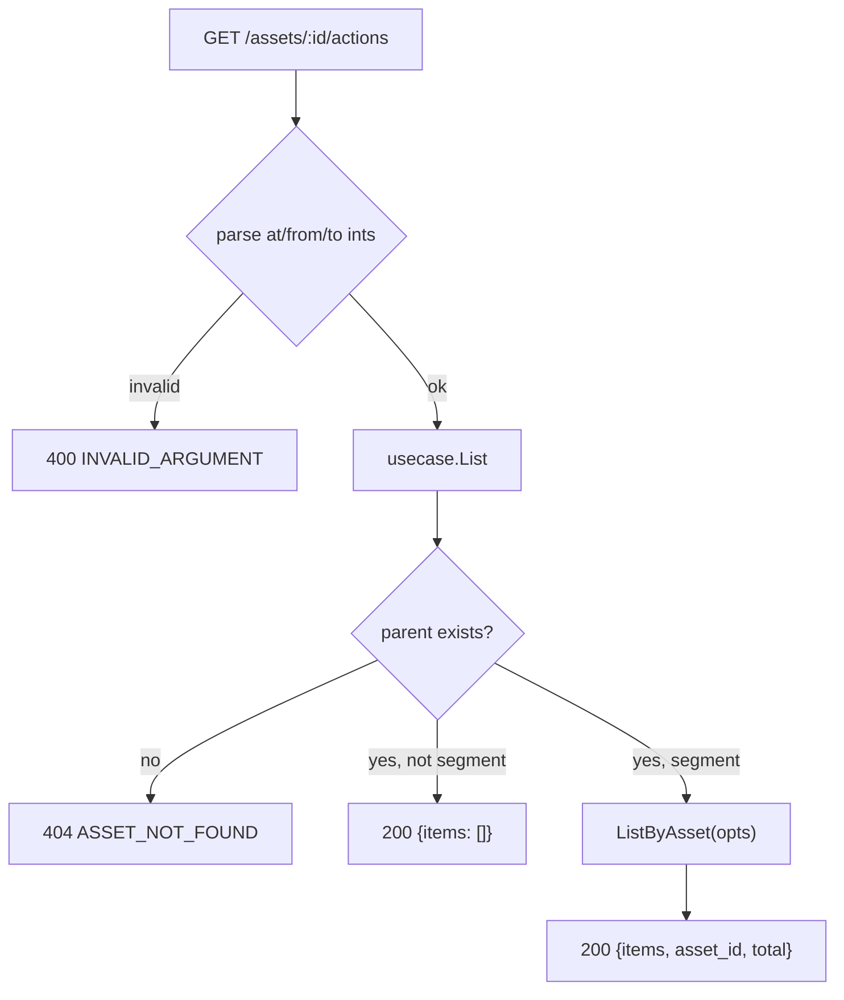
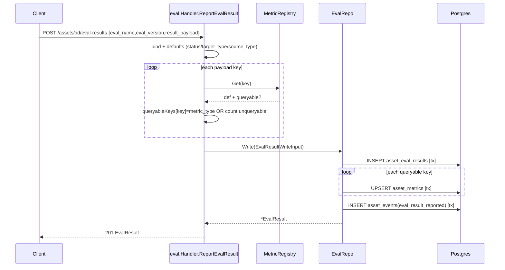
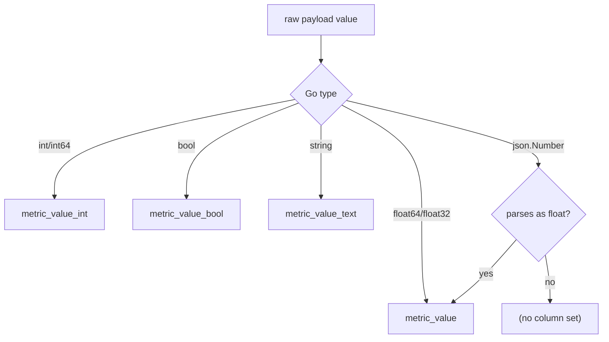
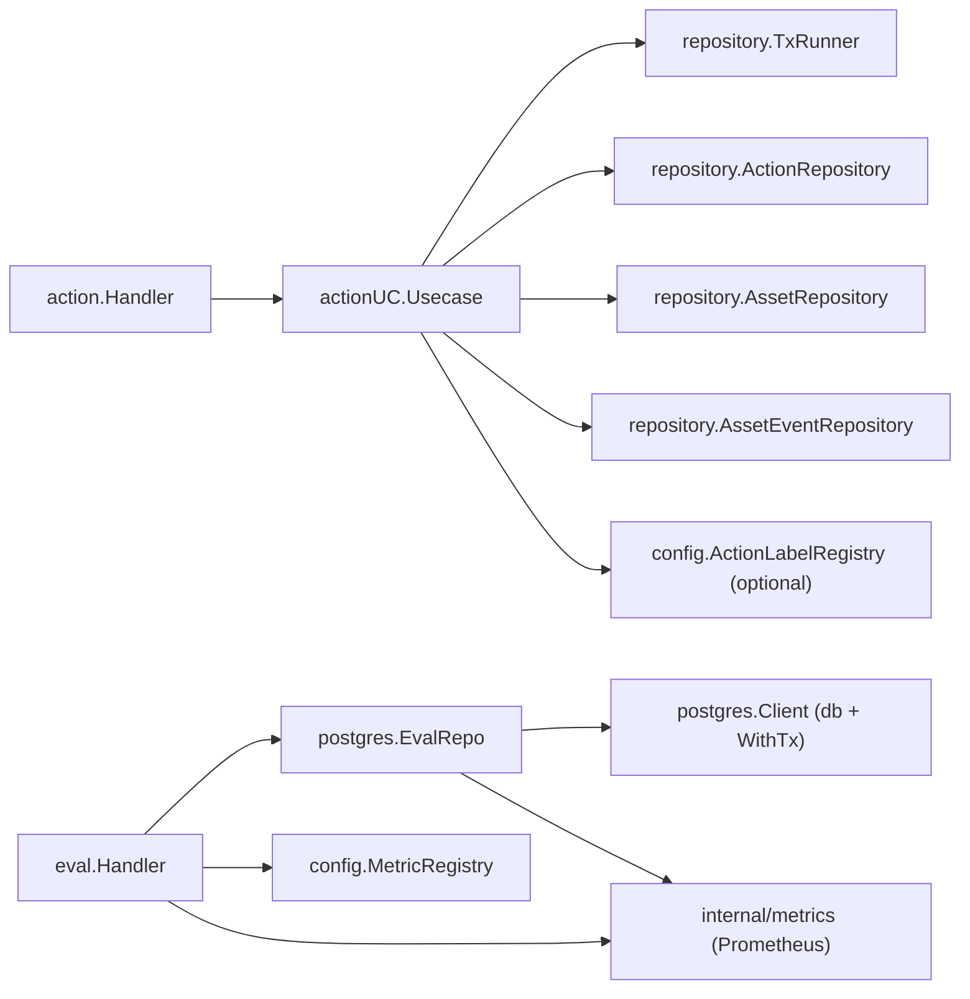

# Actions & Eval API

<cite>
**Referenced Files in This Document**

- [api/openapi.yaml](file://api/openapi.yaml)
- [backend/routes/routes.go](file://backend/routes/routes.go)
- [backend/internal/handlers/action/handler.go](file://backend/internal/handlers/action/handler.go)
- [backend/internal/handlers/eval/handler.go](file://backend/internal/handlers/eval/handler.go)
- [backend/internal/usecase/action/usecase.go](file://backend/internal/usecase/action/usecase.go)
- [backend/internal/postgres/eval_repos.go](file://backend/internal/postgres/eval_repos.go)
- [backend/internal/config/metric_registry.go](file://backend/internal/config/metric_registry.go)
- [backend/internal/models/action.go](file://backend/internal/models/action.go)
- [backend/internal/handlers/asset_id.go](file://backend/internal/handlers/asset_id.go)
</cite>

## Table of Contents
1. [Introduction](#introduction)
2. [Project Structure](#project-structure)
3. [Core Components](#core-components)
4. [Architecture Overview](#architecture-overview)
5. [Detailed Component Analysis](#detailed-component-analysis)
6. [Dependency Analysis](#dependency-analysis)
7. [Performance Considerations](#performance-considerations)
8. [Troubleshooting Guide](#troubleshooting-guide)
9. [Conclusion](#conclusion)
10. [Appendices](#appendices)

## Introduction

This page documents two adjacent HTTP surfaces of the cyber-databrew backend that both hang off the per-asset API tree:

- **Action annotations** — time-bounded labels on *segment* assets. Actions are the third layer of the `mcap → seg → action` business model: an MCAP file is split into segments (segs), and inside a seg an action is an interval `[start_ns, end_ns]` carrying labels, a source provenance, and free-form `attrs`. Actions never participate in lifecycle, deliveries, or asset listing — they are an annotation overlay.
- **Eval / metrics** — evaluation-result reporting and queryable metric projection. A producer (an algorithm run, a rule, or a human tool) reports an `eval_result` for an asset; the backend persists the full result payload and, for every payload key registered as *queryable* in the metric registry, projects a typed row into `asset_metrics`. Those projections back the asset-metrics listing, the metric registry endpoint, and a cross-asset metric search.

Both surfaces are consumed by ingestion/algorithm pipelines (machine producers writing actions and eval results) and by the frontend asset-detail UI (reading actions on a seg timeline, reading per-asset metrics, and running metric search to slice the asset catalog).

A naming note that matters for callers: the OpenAPI document publishes the action endpoints under `/api/v1/assets/{id}/action-annotations` (tag `ActionAnnotations`), while the live router in `routes.go` mounts the same handlers under `/api/v1/assets/:id/actions`. The handler code, request/response shapes, and semantics are identical; only the path prefix differs between the spec and the wired routes.

**Section sources**
- [backend/internal/models/action.go](file://backend/internal/models/action.go#L14-L49)
- [backend/internal/handlers/action/handler.go](file://backend/internal/handlers/action/handler.go#L1-L26)
- [backend/internal/handlers/eval/handler.go](file://backend/internal/handlers/eval/handler.go#L18-L27)
- [api/openapi.yaml](file://api/openapi.yaml#L19-L38)

## Project Structure

The Actions & Eval surfaces follow the project's layered convention: a thin Gin handler validates and decodes the request, a usecase (actions) or repository (eval) enforces business rules and persistence, and shared helpers handle id validation and HTTP error mapping.

- `backend/routes/routes.go` — mounts both surfaces under the JWT-guarded `/api/v1` tree; actions and eval handlers are each optional (nil-guarded).
- `backend/internal/handlers/action/handler.go` — the `Action` HTTP handler: `Create`, `List`, `Patch`, `Delete`, plus id/error-mapping helpers.
- `backend/internal/usecase/action/usecase.go` — action business rules: parent-seg validation, time-window guardrails, optimistic concurrency, and transactional outbox events.
- `backend/internal/handlers/eval/handler.go` — the eval/metrics HTTP handler: `ReportEvalResult`, `ListEvalResults`, `ListMetrics`, `GetRegistry`, `SearchByMetrics`.
- `backend/internal/postgres/eval_repos.go` — `EvalRepo`: writes eval results, projects queryable metrics, lists results/metrics, and runs metric search SQL.
- `backend/internal/config/metric_registry.go` — `MetricRegistry`: loads metric definitions from YAML and answers "is this key queryable, and of what type".
- `backend/internal/models/action.go` — the `Action` row model and `source_type` enum.
- `backend/internal/handlers/asset_id.go` — shared `:id` path validation (8-char alphanumeric asset id).
- `api/openapi.yaml` — the wire contract: `ActionAnnotations` and `EvalMetrics` tagged paths and their schemas.



**Diagram sources**
- [backend/routes/routes.go](file://backend/routes/routes.go#L287-L313)
- [backend/internal/handlers/action/handler.go](file://backend/internal/handlers/action/handler.go#L20-L26)
- [backend/internal/handlers/eval/handler.go](file://backend/internal/handlers/eval/handler.go#L18-L27)

**Section sources**
- [backend/routes/routes.go](file://backend/routes/routes.go#L189-L313)
- [backend/internal/handlers/action/handler.go](file://backend/internal/handlers/action/handler.go#L1-L26)
- [backend/internal/handlers/eval/handler.go](file://backend/internal/handlers/eval/handler.go#L1-L27)

## Core Components

### action.Handler

`action.Handler` wraps a single dependency, `actionUC.Usecase`, and exposes four endpoints (`Create`, `List`, `Patch`, `Delete`). Path parameters are validated by `handlers.RequirePathAssetID` (the `:id` asset) and `requirePathActionID` (the `:action_id`, also 8 alphanumeric characters). The handler decodes a JSON body for create/patch, forwards a typed input struct to the usecase, and maps usecase sentinel errors to HTTP status codes.

**Section sources**
- [backend/internal/handlers/action/handler.go](file://backend/internal/handlers/action/handler.go#L20-L184)
- [backend/internal/handlers/asset_id.go](file://backend/internal/handlers/asset_id.go#L13-L24)

### actionUC.Usecase

`actionUC.Usecase` coordinates four repositories: a `TxRunner` (transaction boundary), the `ActionRepository`, the `AssetRepository` (parent-seg lookup), and the `AssetEventRepository` (transactional outbox). It exposes `Create`, `List`, `Update`, `Delete`, each of which validates the parent asset is a non-deleted `segment`, enforces the time-window and range invariants, and — for mutations — appends an `action_upserted` or `action_deleted` event in the same transaction. An optional `ActionLabelRegistry` validates labels when wired.

**Section sources**
- [backend/internal/usecase/action/usecase.go](file://backend/internal/usecase/action/usecase.go#L24-L74)

### eval.Handler

`eval.Handler` holds an `*postgres.EvalRepo` and a `*config.MetricRegistry`. It exposes five endpoints: `ReportEvalResult` (write), `ListEvalResults`, `ListMetrics`, `GetRegistry`, and `SearchByMetrics`. The write path consults the registry to decide which payload keys are queryable, and emits Prometheus counters/histograms for write outcome and metric-key classification.

**Section sources**
- [backend/internal/handlers/eval/handler.go](file://backend/internal/handlers/eval/handler.go#L18-L154)

### postgres.EvalRepo

`EvalRepo` owns all eval SQL. `Write` runs a single transaction that inserts one `asset_eval_results` row, upserts one `asset_metrics` row per queryable key, and inserts an `eval_result_reported` row into `asset_events`. `ListByAsset` / `ListMetricsByAsset` are read paths. `SearchByMetrics` builds an `EXISTS`-per-filter query against `assets` to return matching asset ids with a total count.

**Section sources**
- [backend/internal/postgres/eval_repos.go](file://backend/internal/postgres/eval_repos.go#L87-L215)

### config.MetricRegistry

`MetricRegistry` loads `MetricDefinition` entries from a YAML file into a key→definition map. `Get` returns a definition and whether it exists; `IsQueryable` is a convenience for `ok && def.Queryable`; `All` returns every definition (the handler then sorts by key). Each definition carries `metric_type`, `metric_unit`, `target_type`, `higher_is_better`, `default_aggregation`, `queryable`, and `description`.

**Section sources**
- [backend/internal/config/metric_registry.go](file://backend/internal/config/metric_registry.go#L11-L85)

## Architecture Overview

Both surfaces sit behind `middleware.JWTAuth` on the `/api/v1` group. Actions and per-asset eval/metrics endpoints are nested under the `assets := api.Group("/assets")` subtree; the registry and metric-search endpoints are mounted directly on `api`.



**Diagram sources**
- [backend/routes/routes.go](file://backend/routes/routes.go#L189-L313)

**Section sources**
- [backend/routes/routes.go](file://backend/routes/routes.go#L189-L313)

## Detailed Component Analysis

### Create action annotation

`POST /assets/:id/actions` decodes a body requiring `start_ns` and `end_ns`; all other fields are optional. The handler forwards a `CreateInput` to the usecase, which:

1. Rejects `end_ns < start_ns` (`ErrInvalidRange`).
2. Defaults `source_type` to `human` and validates it against the enum `{human, algo, rule, system}` (`ErrInvalidSourceType`).
3. Validates labels against the optional `ActionLabelRegistry` (`ErrInvalidLabel`).
4. Loads the parent asset; a missing parent is `ErrSegNotFound`, a non-`segment` parent is `ErrParentNotSeg`.
5. Applies the time-window guardrail: when the parent seg declares both `start_timestamp_ns` and `end_timestamp_ns` (> 0), the action interval must fall inside it (`ErrRangeOutsideSeg`).
6. Within one transaction, inserts the `actions` row and appends an `action_upserted` event (transactional outbox).

On success the handler returns `201` with the full `Action` row (including the generated `action_id`, inherited `tenant_id`/`project_id`, and `version`).



**Diagram sources**
- [backend/internal/handlers/action/handler.go](file://backend/internal/handlers/action/handler.go#L41-L102)
- [backend/internal/usecase/action/usecase.go](file://backend/internal/usecase/action/usecase.go#L96-L166)

**Section sources**
- [backend/internal/handlers/action/handler.go](file://backend/internal/handlers/action/handler.go#L41-L102)
- [backend/internal/usecase/action/usecase.go](file://backend/internal/usecase/action/usecase.go#L76-L214)

### List action annotations

`GET /assets/:id/actions` supports a time-aware query: `at` (point-in-time), `from`/`to` (range), `label` (filter), and `limit` (default 200, accepted only when 1–1000; values outside that range fall back to the default). Each of `at`/`from`/`to` is parsed by `parseInt64Ptr`, which returns a `400 INVALID_ARGUMENT` on a non-integer value.

The usecase loads the parent first: a missing parent is `404 ASSET_NOT_FOUND`, but a parent that exists yet is *not* a segment returns an **empty list with 200** rather than an error — this lets asset-detail UIs load uniformly for any asset type. The response shape is `{ items, asset_id, total }` with `items` never null.



**Diagram sources**
- [backend/internal/handlers/action/handler.go](file://backend/internal/handlers/action/handler.go#L104-L150)
- [backend/internal/usecase/action/usecase.go](file://backend/internal/usecase/action/usecase.go#L216-L250)

**Section sources**
- [backend/internal/handlers/action/handler.go](file://backend/internal/handlers/action/handler.go#L104-L150)
- [backend/internal/usecase/action/usecase.go](file://backend/internal/usecase/action/usecase.go#L216-L250)

### Patch action annotation

`PATCH /assets/:id/actions/:action_id` accepts a partial body: every field is a pointer (or map), and a `nil`/absent field is left unchanged. `expected_version` enables optimistic concurrency; when omitted (or `<= 0`), the usecase loads the row and uses its current version as the expected value, so the patch behaves as a last-writer update.

The usecase re-runs label validation against the *effective* primary/labels after the patch, re-validates the parent seg, and recomputes the effective `[start, end]` to re-apply the range and time-window guardrails. The CAS update is performed inside the transaction; on a version mismatch the repository returns `ErrOptimisticLock`, which the handler maps to `409 CONCURRENT_CONFLICT`. A successful patch emits `action_upserted` and returns `200` with the updated row.

**Section sources**
- [backend/internal/handlers/action/handler.go](file://backend/internal/handlers/action/handler.go#L186-L241)
- [backend/internal/usecase/action/usecase.go](file://backend/internal/usecase/action/usecase.go#L252-L348)

### Delete action annotation

`DELETE /assets/:id/actions/:action_id` is a **soft delete**. `expected_version` is an optional query parameter (parsed as int64; a malformed value is `400 INVALID_ARGUMENT`); when omitted it defaults to the current row version. The usecase validates the parent seg, loads the row, soft-deletes via CAS, and appends an `action_deleted` event in the same transaction. On success the handler returns `204 No Content`.

**Section sources**
- [backend/internal/handlers/action/handler.go](file://backend/internal/handlers/action/handler.go#L243-L271)
- [backend/internal/usecase/action/usecase.go](file://backend/internal/usecase/action/usecase.go#L350-L414)

### Action error mapping

`mapActionMutationError` centralizes status mapping for patch/delete (create has a near-identical inline switch). The mapping:

| Sentinel error | HTTP status | Code |
| --- | --- | --- |
| `ErrSegNotFound`, `ErrActionNotFound` | 404 | `ASSET_NOT_FOUND` |
| `ErrParentNotSeg`, `ErrRangeOutsideSeg`, `ErrInvalidLabel` | 422 | `INVALID_ACTION` |
| `ErrInvalidRange`, `ErrInvalidSourceType` | 400 | `INVALID_ARGUMENT` |
| `ErrOptimisticLock` | 409 | `CONCURRENT_CONFLICT` |
| `ErrSchemaMismatch` | 500 | (schema mismatch message) |
| default | 500 | (error text) |

`Create` adds one extra case: an `ErrSchemaMismatch` there returns a `500` instructing the operator to run migration `018_actions_id_to_short_id.sql`.

**Section sources**
- [backend/internal/handlers/action/handler.go](file://backend/internal/handlers/action/handler.go#L83-L100)
- [backend/internal/handlers/action/handler.go](file://backend/internal/handlers/action/handler.go#L165-L184)

### Report eval result

`POST /assets/:id/eval-results` requires `eval_name` and `eval_version`; everything else is optional with defaults applied in the handler: `status` → `ok`, `target_type` → `segment`, `source_type` → `algo`, and a nil `result_payload` → `{}`.

The handler then walks each key of `result_payload` and asks the `MetricRegistry`: if the key is registered *and* `queryable`, its `metric_type` is captured into a `queryableKeys` map (`key → metric_type`); otherwise it is counted as `unregistered_or_unqueryable`. Both counts are exported as Prometheus metric-key counters. The handler forwards an `EvalResultWriteInput` (including `queryableKeys` and the `X-Request-ID` header) to `EvalRepo.Write`, returning `201` with the persisted `EvalResult` on success. A bind error is `400 INVALID_ARGUMENT`; a write error is `500`. Throughout, a deferred block records the request outcome label (`ok`, `invalid_argument`, `write_error`, or `error`) into write-count and write-duration metrics.



**Diagram sources**
- [backend/internal/handlers/eval/handler.go](file://backend/internal/handlers/eval/handler.go#L32-L113)
- [backend/internal/postgres/eval_repos.go](file://backend/internal/postgres/eval_repos.go#L96-L215)

**Section sources**
- [backend/internal/handlers/eval/handler.go](file://backend/internal/handlers/eval/handler.go#L29-L113)
- [backend/internal/postgres/eval_repos.go](file://backend/internal/postgres/eval_repos.go#L63-L215)

### Metric projection and typed columns

`EvalRepo.Write` upserts one `asset_metrics` row per queryable key. The conflict target is `(asset_id, target_type, target_id, metric_key, eval_name, eval_version)`, so re-reporting the same eval at the same version updates the existing projection in place rather than duplicating it. The raw payload value is split into typed columns by `extractMetricValues`:



Note that numeric metric search compares against `metric_value` (the float column) only — integer-only values stored in `metric_value_int` are not matched by the search SQL.

**Diagram sources**
- [backend/internal/postgres/eval_repos.go](file://backend/internal/postgres/eval_repos.go#L448-L472)

**Section sources**
- [backend/internal/postgres/eval_repos.go](file://backend/internal/postgres/eval_repos.go#L148-L186)
- [backend/internal/postgres/eval_repos.go](file://backend/internal/postgres/eval_repos.go#L448-L472)

### List eval results and metrics

`GET /assets/:id/eval-results` returns results newest-first. The handler reads `limit` from the query (default 20); the repository clamps it to 1–100 (out-of-range values reset to 20). The response is `{ items, total }`.

`GET /assets/:id/metrics` returns the projected `asset_metrics` rows ordered by `(metric_key, eval_version DESC)`. The response is `{ items, asset_id }` (no `total` field). Both endpoints return an empty `items` array rather than null when there are no rows.

**Section sources**
- [backend/internal/handlers/eval/handler.go](file://backend/internal/handlers/eval/handler.go#L115-L146)
- [backend/internal/postgres/eval_repos.go](file://backend/internal/postgres/eval_repos.go#L229-L301)

### Metric registry endpoint

`GET /metrics/registry` returns all `MetricDefinition` entries from the in-memory registry, sorted by `key`, as `{ items }`. This is a read-only reference endpoint that producers use to discover which keys are recognized and which are `queryable`.

**Section sources**
- [backend/internal/handlers/eval/handler.go](file://backend/internal/handlers/eval/handler.go#L148-L154)
- [backend/internal/config/metric_registry.go](file://backend/internal/config/metric_registry.go#L76-L85)

### Search assets by metrics

`POST /metrics:search` filters assets by a conjunction (AND) of numeric metric constraints. The body is `{ filters: { lifecycle_state, metrics: [{metric_key, op, value}] }, page, page_size }`. At least one metric filter is required (else `400 INVALID_ARGUMENT`). `page` defaults to 1 and `page_size` to 20 when below 1.

Each filter's `op` is normalized by `normalizeMetricOp`, which accepts both word forms (`eq, gt, gte, lt, lte`) and symbolic forms (`=, >, >=, <, <=`); an unrecognized op is a `400` whose `details.allowed` lists every accepted token. The repository builds one `EXISTS (SELECT 1 FROM asset_metrics ...)` subquery per filter against `assets a`, always excluding soft-deleted assets and optionally filtering by `lifecycle_state` (empty string disables that clause). It returns matching `asset_id`s ordered by `updated_at DESC, asset_id`, plus the total count.

The handler responds with `{ asset_ids, total, page, page_size }`. The OpenAPI schema advertises a richer `{ items: [Asset], total }` shape; the live handler returns asset ids (not hydrated `Asset` objects), so clients should resolve the ids against the assets API.

```mermaid
sequenceDiagram
  participant C as Client
  participant H as eval.Handler.SearchByMetrics
  participant ER as EvalRepo
  participant DB as Postgres
  C->>H: POST /metrics:search {filters:{metrics:[...]}, page, page_size}
  H->>H: require >=1 filter; normalizeMetricOp each
  alt invalid op
    H-->>C: 400 {details.allowed:[...]}
  end
  H->>ER: SearchByMetrics(filters, lifecycle_state, page, page_size)
  ER->>DB: COUNT(*) FROM assets WHERE EXISTS(...) AND ...
  ER->>DB: SELECT asset_id ... LIMIT/OFFSET
  ER-->>H: ids, total
  H-->>C: 200 {asset_ids, total, page, page_size}
```

**Diagram sources**
- [backend/internal/handlers/eval/handler.go](file://backend/internal/handlers/eval/handler.go#L156-L238)
- [backend/internal/postgres/eval_repos.go](file://backend/internal/postgres/eval_repos.go#L368-L446)

**Section sources**
- [backend/internal/handlers/eval/handler.go](file://backend/internal/handlers/eval/handler.go#L156-L238)
- [backend/internal/postgres/eval_repos.go](file://backend/internal/postgres/eval_repos.go#L361-L446)

## Dependency Analysis



The action surface depends only on repository interfaces (no direct DB access in the handler/usecase), keeping persistence swappable and testable. The eval surface depends concretely on `postgres.EvalRepo` and `config.MetricRegistry`. Both surfaces are nil-guarded in `routes.go`, so a deployment can disable either by passing a nil handler.

**Diagram sources**
- [backend/internal/usecase/action/usecase.go](file://backend/internal/usecase/action/usecase.go#L35-L67)
- [backend/internal/handlers/eval/handler.go](file://backend/internal/handlers/eval/handler.go#L18-L27)

**Section sources**
- [backend/internal/usecase/action/usecase.go](file://backend/internal/usecase/action/usecase.go#L35-L67)
- [backend/internal/handlers/eval/handler.go](file://backend/internal/handlers/eval/handler.go#L18-L27)
- [backend/routes/routes.go](file://backend/routes/routes.go#L287-L313)

## Performance Considerations

- **Action listing pagination.** `List` accepts `limit` in the range 1–1000 with a default of 200, and orders by `(start_ns ASC, action_id ASC)`. Time filters (`at`, `from`, `to`, `label`) are pushed into the repository query options rather than filtered in memory.
- **Eval write is one transaction.** A single `Write` performs `1 + N + 1` statements (insert result, N metric upserts for queryable keys, one outbox event). Only registered+queryable keys are projected, so a large `result_payload` with few queryable keys stays cheap. Per-upsert duration and count are tracked with Prometheus histograms/counters labelled `ok`/`error`.
- **Idempotent metric projection.** The `ON CONFLICT (...) DO UPDATE` on `asset_metrics` means re-reporting the same `(asset, target, key, eval_name, eval_version)` updates in place, avoiding unbounded row growth and keeping the metric set converged.
- **Eval result listing cap.** `ListByAsset` hard-caps `limit` at 100 to bound result-set size; the handler's default of 20 applies when the query omits `limit`.
- **Metric search query shape.** `SearchByMetrics` runs a `COUNT(*)` plus a `LIMIT/OFFSET` data query against `assets`, with one correlated `EXISTS` subquery per filter. Each `EXISTS` benefits from an index on `asset_metrics(metric_key, metric_value)`; high page offsets pay the usual OFFSET scan cost. `page_size` is clamped to 1–200 (default 20).
- **Registry reads are in-memory.** `GetRegistry` and the per-key `Get` lookups during eval writes read from a `sync.RWMutex`-guarded map with no DB round-trip.

**Section sources**
- [backend/internal/handlers/action/handler.go](file://backend/internal/handlers/action/handler.go#L122-L127)
- [backend/internal/postgres/eval_repos.go](file://backend/internal/postgres/eval_repos.go#L148-L186)
- [backend/internal/postgres/eval_repos.go](file://backend/internal/postgres/eval_repos.go#L229-L243)
- [backend/internal/postgres/eval_repos.go](file://backend/internal/postgres/eval_repos.go#L368-L446)

## Troubleshooting Guide

- **`409 CONCURRENT_CONFLICT` on patch/delete.** Two writers raced on the same action version. Reload the action to read the current `version`, then retry with the fresh `expected_version` (or omit it to take last-writer semantics).
- **`422 INVALID_ACTION` "action time range falls outside the parent seg".** The action's `[start_ns, end_ns]` is outside the parent seg's `[start_timestamp_ns, end_timestamp_ns]`. Verify the seg's window and that you are annotating the correct seg. The guardrail only applies when the seg declares both bounds (> 0).
- **`422 INVALID_ACTION` on a label.** Labels failed `ActionLabelRegistry` validation (only when a registry is wired). Check the primary/label values against the action-label registry.
- **`400 INVALID_ARGUMENT` "invalid at/from/to".** A time query parameter was non-numeric; these are nanosecond integers.
- **`404 ASSET_NOT_FOUND` vs empty list on `GET .../actions`.** A missing parent is a 404; a parent that exists but is not a `segment` returns `200 {items: []}` by design.
- **`500` "run migration 018_actions_id_to_short_id.sql".** The actions table schema predates the short-id migration; apply the migration.
- **Metric not returned by `/metrics:search`.** The metric value was stored as an integer (`metric_value_int`) rather than a float (`metric_value`); search compares only the float column. Also confirm the key is `queryable` in the registry — non-queryable keys are never projected to `asset_metrics`.
- **Reported payload key absent from `/metrics`.** The key was unregistered or `queryable=false`. Check `GET /metrics/registry`; the write path counts such keys under `unregistered_or_unqueryable` but stores them only inside `result_payload`, not as a projected metric.
- **`400` "invalid metric op" on search.** Use one of `eq, gt, gte, lt, lte` or the symbolic equivalents `=, >, >=, <, <=`.

**Section sources**
- [backend/internal/handlers/action/handler.go](file://backend/internal/handlers/action/handler.go#L83-L99)
- [backend/internal/handlers/action/handler.go](file://backend/internal/handlers/action/handler.go#L165-L184)
- [backend/internal/handlers/eval/handler.go](file://backend/internal/handlers/eval/handler.go#L74-L85)
- [backend/internal/handlers/eval/handler.go](file://backend/internal/handlers/eval/handler.go#L186-L201)

## Conclusion

The Actions and Eval/Metrics surfaces give cyber-databrew its annotation and measurement layers on top of the asset model. Actions are transactional, seg-scoped, version-checked time intervals with outbox events for downstream sync. Eval results are reported per asset and projected — through a registry-driven, type-aware upsert — into a queryable `asset_metrics` table that powers per-asset metric listing and a cross-asset conjunctive metric search. Both are JWT-guarded, nil-toggleable, and follow the project's handler → usecase/repo layering with centralized error-to-status mapping.

## Appendices

### A. Endpoint summary (as wired in routes.go)

| Method | Path | Handler | Success |
| --- | --- | --- | --- |
| POST | `/api/v1/assets/:id/actions` | `action.Handler.Create` | 201 Action |
| GET | `/api/v1/assets/:id/actions` | `action.Handler.List` | 200 `{items,asset_id,total}` |
| PATCH | `/api/v1/assets/:id/actions/:action_id` | `action.Handler.Patch` | 200 Action |
| DELETE | `/api/v1/assets/:id/actions/:action_id` | `action.Handler.Delete` | 204 |
| POST | `/api/v1/assets/:id/eval-results` | `eval.Handler.ReportEvalResult` | 201 EvalResult |
| GET | `/api/v1/assets/:id/eval-results` | `eval.Handler.ListEvalResults` | 200 `{items,total}` |
| GET | `/api/v1/assets/:id/metrics` | `eval.Handler.ListMetrics` | 200 `{items,asset_id}` |
| GET | `/api/v1/metrics/registry` | `eval.Handler.GetRegistry` | 200 `{items}` |
| POST | `/api/v1/metrics:search` | `eval.Handler.SearchByMetrics` | 200 `{asset_ids,total,page,page_size}` |

The OpenAPI document publishes the four action endpoints under `/api/v1/assets/{id}/action-annotations[/{action_id}]` (tag `ActionAnnotations`); the request/response schemas are identical.

**Section sources**
- [backend/routes/routes.go](file://backend/routes/routes.go#L287-L313)
- [api/openapi.yaml](file://api/openapi.yaml#L2450-L2523)
- [api/openapi.yaml](file://api/openapi.yaml#L3160-L3237)

### B. Action request/response fields

`ActionCreateRequest` (required: `start_ns`, `end_ns`):

| Field | Type | Notes |
| --- | --- | --- |
| `start_ns` / `end_ns` | int64 | nanoseconds; `end_ns >= start_ns` |
| `action_index` | int (nullable) | ordinal within seg |
| `primary_label` | string | optional |
| `labels` | string[] | validated if registry wired |
| `description` | string | free text |
| `attrs` | object | arbitrary key/values |
| `source_type` | string | `human` (default) \| `algo` \| `rule` \| `system` |
| `source_name` / `source_version` | string | provenance |
| `run_id` | string | producing run |
| `confidence` | double (nullable) | producer confidence |
| `external_id` | string | external correlation (create only) |

`ActionPatchRequest` mirrors these as optional pointers and adds `expected_version` (int64) for optimistic concurrency; `external_id` is not patchable. The `Action` response adds server-owned fields: `action_id`, `asset_id`, `tenant_id`, `project_id`, `is_deleted`, `version`, `created_at`, `updated_at`.

**Section sources**
- [api/openapi.yaml](file://api/openapi.yaml#L395-L470)
- [backend/internal/models/action.go](file://backend/internal/models/action.go#L21-L49)
- [backend/internal/handlers/action/handler.go](file://backend/internal/handlers/action/handler.go#L47-L61)
- [backend/internal/handlers/action/handler.go](file://backend/internal/handlers/action/handler.go#L198-L212)

### C. Eval/metric request/response fields

`EvalResultRequest` (required: `eval_name`, `eval_version`): `target_type` (default `segment`), `target_id`, `parameter_version`, `run_id`, `status` (default `ok`), `result_payload` (object; default `{}`), `output_uri`, `summary_uri`, `source_type` (default `algo`), `source_name`, `source_version`.

`EvalResult` response adds: `eval_result_id`, `asset_id`, `mcap_file_id`, `started_at`, `finished_at`, `created_at`, `updated_at`.

`AssetMetric` (the `/metrics` item) columns: `asset_id`, `target_type`, `target_id`, `metric_key`, `metric_type`, `metric_unit`, the four typed value columns (`metric_value`, `metric_value_int`, `metric_value_text`, `metric_value_bool`), `eval_name`, `eval_version`, `parameter_version`, `run_id`, `source_type`, `source_name`, `confidence`, `recorded_at`, `updated_at`.

`MetricDefinition` (registry item): `key`, `display_name`, `metric_type`, `metric_unit`, `target_type`, `higher_is_better`, `default_aggregation`, `queryable`, `description`.

**Section sources**
- [api/openapi.yaml](file://api/openapi.yaml#L1114-L1215)
- [backend/internal/postgres/eval_repos.go](file://backend/internal/postgres/eval_repos.go#L16-L85)
- [backend/internal/config/metric_registry.go](file://backend/internal/config/metric_registry.go#L11-L22)

### D. `source_type` enum

| Value | Constant |
| --- | --- |
| `human` | `ActionSourceHuman` (default on create) |
| `algo` | `ActionSourceAlgo` |
| `rule` | `ActionSourceRule` |
| `system` | `ActionSourceSystem` |

**Section sources**
- [backend/internal/models/action.go](file://backend/internal/models/action.go#L7-L12)
- [backend/internal/models/action.go](file://backend/internal/models/action.go#L51-L59)

### E. Metric-search operators

Accepted by `normalizeMetricOp`; all map to a single SQL comparison against `metric_value`:

| Word | Symbol | SQL |
| --- | --- | --- |
| `eq` | `=` | `=` |
| `gt` | `>` | `>` |
| `gte` | `>=` | `>=` |
| `lt` | `<` | `<` |
| `lte` | `<=` | `<=` |

**Section sources**
- [backend/internal/handlers/eval/handler.go](file://backend/internal/handlers/eval/handler.go#L223-L238)
- [backend/internal/postgres/eval_repos.go](file://backend/internal/postgres/eval_repos.go#L381-L407)
