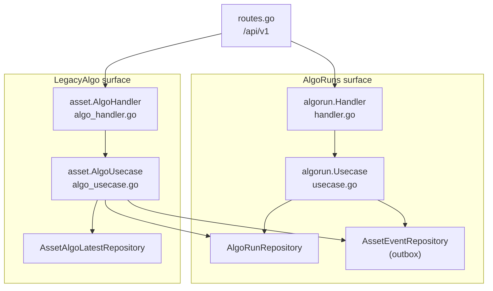
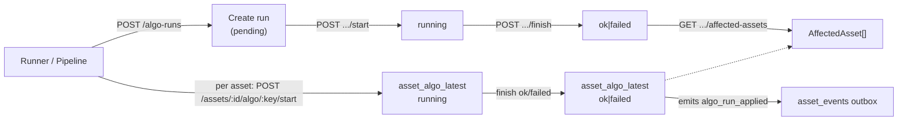
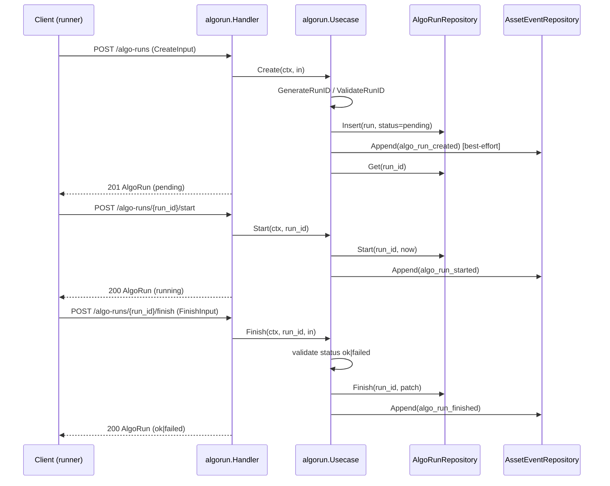
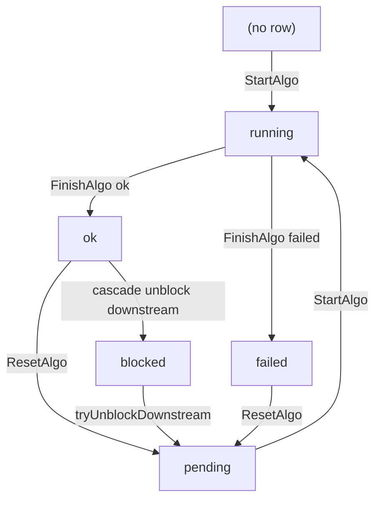
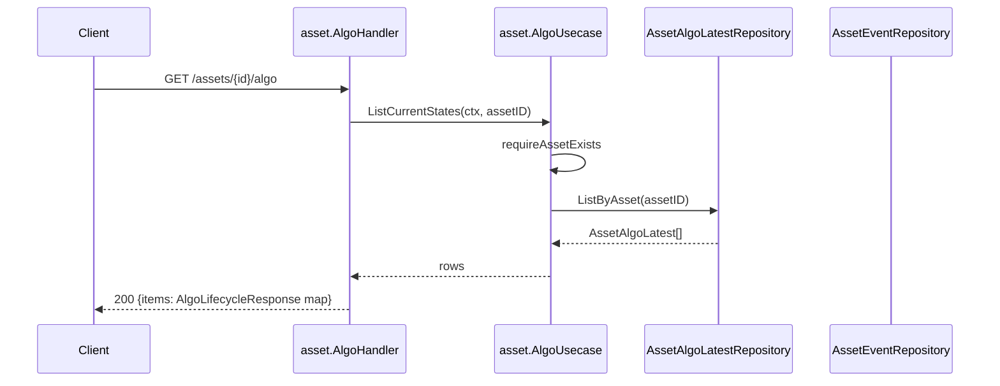
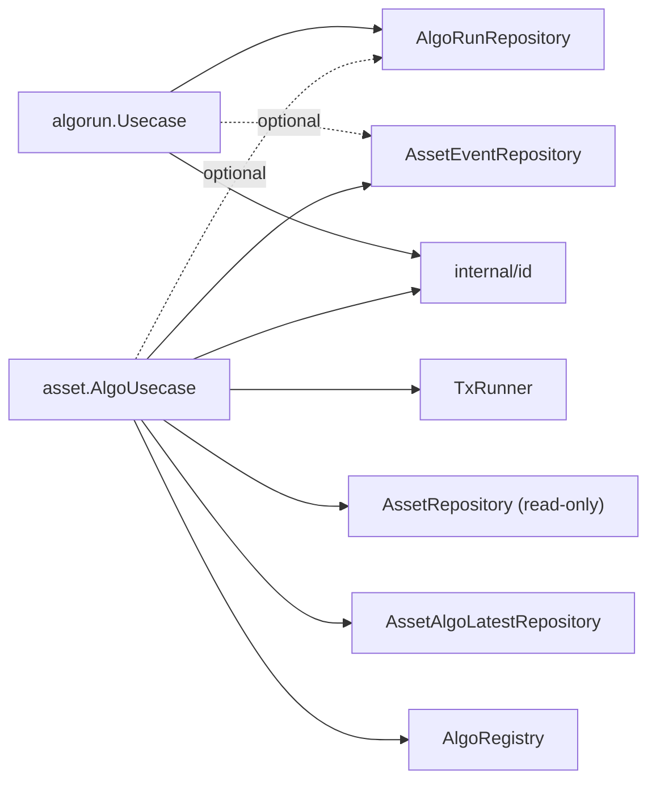

# Algorithm API

<cite>
**Referenced Files in This Document**
- [api/openapi.yaml](file://api/openapi.yaml)
- [backend/routes/routes.go](file://backend/routes/routes.go)
- [backend/internal/handlers/algorun/handler.go](file://backend/internal/handlers/algorun/handler.go)
- [backend/internal/handlers/asset/algo_handler.go](file://backend/internal/handlers/asset/algo_handler.go)
- [backend/internal/usecase/algorun/usecase.go](file://backend/internal/usecase/algorun/usecase.go)
- [backend/internal/usecase/asset/algo_usecase.go](file://backend/internal/usecase/asset/algo_usecase.go)
- [backend/internal/repository/algo_run_repository.go](file://backend/internal/repository/algo_run_repository.go)
- [backend/internal/models/algo_run.go](file://backend/internal/models/algo_run.go)
- [backend/internal/models/algo_event.go](file://backend/internal/models/algo_event.go)
- [backend/internal/models/schema_evolution.go](file://backend/internal/models/schema_evolution.go)
- [backend/internal/id/runid.go](file://backend/internal/id/runid.go)
- [backend/internal/httpresp/codes.go](file://backend/internal/httpresp/codes.go)
</cite>

## Table of Contents
1. [Introduction](#introduction)
2. [Project Structure](#project-structure)
3. [Core Components](#core-components)
4. [Architecture Overview](#architecture-overview)
5. [Detailed Component Analysis](#detailed-component-analysis)
6. [Dependency Analysis](#dependency-analysis)
7. [Performance Considerations](#performance-considerations)
8. [Troubleshooting Guide](#troubleshooting-guide)
9. [Conclusion](#conclusion)
10. [Appendices](#appendices)

## Introduction

The Algorithm API exposes two distinct but related surfaces that together track
how algorithms run against data assets in cyber-databrew.

1. **`AlgoRuns`** — the first-class, standalone *execution-event* API
   (introduced under CYB-1018). An algo run is a durable record of one
   invocation of an algorithm — possibly spanning many assets — with a full
   lifecycle (`pending → running → ok|failed|cancelled`), input selection,
   provenance (code commit, image digest, pipeline name/version) and outcome
   aggregates (assets processed/succeeded/failed, cost, CPU/GPU seconds).
   These runs live in their own `algo_runs` table and are addressed by a
   16-character alphanumeric `run_id`.

2. **`LegacyAlgo`** — the per-asset, per-algorithm *current-state* API
   (marked deprecated in the OpenAPI spec). It records the latest lifecycle
   state of a single algorithm on a single asset in the `asset_algo_latest`
   projection table, keyed by `(asset_id, algo_name)`. It carries its own
   state machine (`pending → running → ok|failed`, with `blocked` and `reset`),
   registry-driven payload validation, and downstream dependency unblocking.

The two surfaces are linked: a `LegacyAlgo` start/finish may carry a `run_id`
that references an `AlgoRuns` row, and finishing an asset-level algo with a
valid `run_id` emits an `algo_run_applied` event so the run can be associated
with the assets it touched. The `AlgoRuns` `affected-assets` endpoint reads
back the per-asset rows that share a run's `run_id`.

Consumers are primarily the data-processing pipeline (Dagster / runners that
create runs, mark them started/finished, and report per-asset outcomes) and
the frontend / operators (who list and inspect runs and per-asset state).

**Section sources**
- [api/openapi.yaml](file://api/openapi.yaml#L21-L24)
- [backend/internal/models/algo_run.go](file://backend/internal/models/algo_run.go#L1-L50)
- [backend/internal/usecase/asset/algo_usecase.go](file://backend/internal/usecase/asset/algo_usecase.go#L1-L18)

## Project Structure

The Algorithm API spans the standard handler → usecase → repository layering
used throughout the backend. The `AlgoRuns` surface and the `LegacyAlgo`
surface have separate handler/usecase pairs but share the
`AlgoRunRepository` and the `asset_events` outbox.

- **Route registration** — both surfaces are wired in
  `backend/routes/routes.go` under the `/api/v1` group, which is guarded by
  `middleware.JWTAuth` (the `DatabrewToken` security scheme).
- **AlgoRuns handler** — `backend/internal/handlers/algorun/handler.go`
  implements `Create`, `Start`, `Finish`, `Get`, `List`, `Cancel`,
  `GetAffectedAssets`, plus the `CancelRequest` body type and `mapAlgoRunErr`
  error mapper.
- **AlgoRuns usecase** — `backend/internal/usecase/algorun/usecase.go` holds
  the lifecycle logic, input validation, normalization, and best-effort
  outbox-event emission (`algo_run_*` events).
- **LegacyAlgo handler** — `backend/internal/handlers/asset/algo_handler.go`
  implements `Start`, `Finish`, `Reset`, `ListCurrent` plus its own
  `mapError`.
- **LegacyAlgo usecase** — `backend/internal/usecase/asset/algo_usecase.go`
  implements `StartAlgo`, `FinishAlgo`, `ResetAlgo`, `ListCurrentStates` and
  the downstream-unblock cascade, all transactional against
  `asset_algo_latest` + `asset_events`.
- **Repository & models** — `backend/internal/repository/algo_run_repository.go`
  defines the `AlgoRunRepository` interface, `AlgoRunFinishPatch`,
  `AlgoRunListFilter`, and `AffectedAsset`; `backend/internal/models/algo_run.go`
  defines the `AlgoRun` row and its status constants;
  `backend/internal/models/schema_evolution.go` defines the per-asset
  `AssetAlgoLatest` projection; `backend/internal/models/algo_event.go` defines
  the `AlgoStatus` enum and the `ValidAlgoTransitions` state machine.
- **ID & error codes** — `backend/internal/id/runid.go` validates/generates the
  16-char `run_id`; `backend/internal/httpresp/codes.go` defines the error code
  constants returned to clients.

**Diagram sources**
- [backend/routes/routes.go](file://backend/routes/routes.go#L215-L304)
- [backend/internal/usecase/algorun/usecase.go](file://backend/internal/usecase/algorun/usecase.go#L84-L97)
- [backend/internal/usecase/asset/algo_usecase.go](file://backend/internal/usecase/asset/algo_usecase.go#L89-L119)

**Section sources**
- [backend/routes/routes.go](file://backend/routes/routes.go#L189-L304)
- [backend/internal/handlers/algorun/handler.go](file://backend/internal/handlers/algorun/handler.go#L1-L24)
- [backend/internal/handlers/asset/algo_handler.go](file://backend/internal/handlers/asset/algo_handler.go#L1-L22)

## Core Components

### AlgoRun model

`AlgoRun` is the durable execution-event row. It carries identity
(`run_id`, `algo_name`, `algo_version`, `algo_kind`, `triggered_by`),
lifecycle (`status`, `started_at`, `finished_at`, `duration_ns`), inputs
(`input_filter`, `input_asset_ids`, `params`), provenance (`code_commit`,
`image_digest`, `pipeline_name`, `pipeline_version`), outcome aggregates
(`assets_processed/succeeded/failed`, `actions_created`, `metrics_written`,
`outputs`, `cpu_seconds`, `gpu_seconds`, `cost_usd_micros`), failure detail
(`error_class`, `error_message`), tenancy (`tenant_id`, `project_id`),
external-runtime links (`external_runtime`, `external_url`) and bookkeeping
(`created_at`, `updated_at`, `row_version`). The status enum is `pending`,
`running`, `ok`, `failed`, `cancelled`.

**Section sources**
- [backend/internal/models/algo_run.go](file://backend/internal/models/algo_run.go#L5-L50)

### AlgoRuns usecase inputs

`CreateInput` is the create-run body; `FinishInput` is the finish body (with
optional pointer aggregates so "not reported" is distinguishable from zero);
`ListFilter` carries list query parameters. `allowedAlgoKinds` restricts
`algo_kind` to `processing`, `split`, `qa`, `enrichment` (empty defaults to
`processing`). Sentinel errors (`ErrInvalidRunID`, `ErrInvalidAlgoKind`,
`ErrInvalidStatus`, `ErrMissingField`, `ErrRunNotFound`, `ErrBadTransition`)
drive the HTTP status mapping.

**Section sources**
- [backend/internal/usecase/algorun/usecase.go](file://backend/internal/usecase/algorun/usecase.go#L24-L82)

### AssetAlgoLatest projection (LegacyAlgo)

`AssetAlgoLatest` is the per-asset, per-algorithm current-state row keyed by
`(asset_id, algo_name)` with a monotonic guard on `algo_version`. It holds
`status`, `run_id`, `method`, `output_uri`, `result_tag/score/summary`,
`error_message` and timestamps. The `AlgoStatus` enum (`blocked`, `pending`,
`running`, `ok`, `failed`) and `ValidAlgoTransitions` define the legal state
machine.

**Section sources**
- [backend/internal/models/schema_evolution.go](file://backend/internal/models/schema_evolution.go#L29-L53)
- [backend/internal/models/algo_event.go](file://backend/internal/models/algo_event.go#L18-L53)

### AffectedAsset

`AffectedAsset` is the read model returned by `GET /algo-runs/{run_id}/affected-assets`:
`asset_id`, `algo_name`, `algo_version`, `status`, optional `result_tag`,
`result_score`, `run_id`, and `updated_at`.

**Section sources**
- [backend/internal/repository/algo_run_repository.go](file://backend/internal/repository/algo_run_repository.go#L45-L55)

## Architecture Overview

The two surfaces collaborate through the shared `AlgoRunRepository` and the
`asset_events` outbox. A run is created and driven through its lifecycle on the
`AlgoRuns` surface; per-asset work is recorded on the `LegacyAlgo` surface
carrying the same `run_id`. The repository's `GetAffectedAssets` joins the two
by `run_id`.

**Diagram sources**
- [backend/routes/routes.go](file://backend/routes/routes.go#L215-L304)
- [backend/internal/usecase/asset/algo_usecase.go](file://backend/internal/usecase/asset/algo_usecase.go#L440-L455)
- [backend/internal/repository/algo_run_repository.go](file://backend/internal/repository/algo_run_repository.go#L57-L67)

## Detailed Component Analysis

### AlgoRuns lifecycle (create / start / finish)

`Create` parses `CreateInput`. If `run_id` is blank it generates one via
`id.GenerateRunID`; otherwise it validates it with `id.ValidateRunID`
(`^[0-9A-Za-z]{16}$`). It requires `algo_name`, `algo_version`, `triggered_by`,
defaults `algo_kind` to `processing`, validates the kind, inserts the row with
`status=pending` and `row_version=1`, emits `algo_run_created`, and re-reads the
row. `Start` validates the `run_id`, calls `repo.Start` with `now` (UTC),
emits `algo_run_started`, and re-reads. `Finish` requires `status` to be `ok`
or `failed`, requires `error_message` when `failed`, builds an
`AlgoRunFinishPatch` (status, all optional aggregates, outputs, costs, error
fields, `finished_at`), calls `repo.Finish`, emits `algo_run_finished`, and
re-reads. `Cancel` requires a non-empty `reason`, calls `repo.Cancel`, emits
`algo_run_cancelled`. Outbox emission is best-effort: if `eventRepo` is nil or
`Append` fails, the state mutation is not blocked.

**Diagram sources**
- [backend/internal/handlers/algorun/handler.go](file://backend/internal/handlers/algorun/handler.go#L37-L96)
- [backend/internal/usecase/algorun/usecase.go](file://backend/internal/usecase/algorun/usecase.go#L117-L240)

**Section sources**
- [backend/internal/usecase/algorun/usecase.go](file://backend/internal/usecase/algorun/usecase.go#L99-L294)
- [backend/internal/handlers/algorun/handler.go](file://backend/internal/handlers/algorun/handler.go#L26-L221)

### AlgoRuns listing and affected assets

`List` reads `algo_name`, `status`, `started_after`/`started_before`
(parsed as RFC3339), `page`, `page_size`, normalizes the filter
(`page >= 1`; `page_size` in `1..200`, else defaults to 50) and returns
`{items, total, page, page_size}`, coercing a nil slice to `[]`.
`GetAffectedAssets` validates the `run_id`, confirms the run exists
(else `ErrRunNotFound`), then returns `AffectedAsset[]` (coerced to `[]` when
nil).

**Section sources**
- [backend/internal/handlers/algorun/handler.go](file://backend/internal/handlers/algorun/handler.go#L117-L221)
- [backend/internal/usecase/algorun/usecase.go](file://backend/internal/usecase/algorun/usecase.go#L252-L310)

### AlgoRuns error mapping

`mapAlgoRunErr` translates usecase/repository sentinels to HTTP responses:
invalid `run_id`/`algo_kind`/`status`/missing field → `400 INVALID_ARGUMENT`;
not-found sentinels → `404 ALGO_RUN_NOT_FOUND`; bad-state/bad-transition →
`400 INVALID_STATE`; duplicate `run_id` → `409`; anything else → `500`.

**Section sources**
- [backend/internal/handlers/algorun/handler.go](file://backend/internal/handlers/algorun/handler.go#L228-L244)
- [backend/internal/httpresp/codes.go](file://backend/internal/httpresp/codes.go#L5-L22)

### LegacyAlgo per-asset state machine

The per-asset surface is a strict state machine over `AssetAlgoLatest`.
`StartAlgo` validates the `algo_key` against the registry, requires the asset
to exist, optionally validates a referenced `run_id`, then within a transaction
checks the current status: only empty (no prior row) or `pending` may start;
`running` → `ErrAlgoAlreadyRunning`; `blocked`/`ok`/`failed` →
`ErrInvalidStateTransition`. It upserts the row to `running` and appends an
`algo_started` event. `FinishAlgo` accepts `ok` or `failed`; `ok` is validated
against registry required-fields (`output_uri`, extra fields, optional
`result_size_bytes`), `failed` requires a `reason`. It is idempotent when the
algo is already `ok` with the same `run_id`. On `ok` it cascades
`tryUnblockDownstream`, and when a valid `run_id` is present it also appends an
`algo_run_applied` event. `ResetAlgo` moves a finished (`ok`/`failed`) algo back
to `pending`. `ListCurrent` returns every projection row for the asset.

**Diagram sources**
- [backend/internal/models/algo_event.go](file://backend/internal/models/algo_event.go#L43-L53)
- [backend/internal/usecase/asset/algo_usecase.go](file://backend/internal/usecase/asset/algo_usecase.go#L278-L334)
- [backend/internal/handlers/asset/algo_handler.go](file://backend/internal/handlers/asset/algo_handler.go#L143-L152)

**Section sources**
- [backend/internal/usecase/asset/algo_usecase.go](file://backend/internal/usecase/asset/algo_usecase.go#L269-L540)
- [backend/internal/usecase/asset/algo_usecase.go](file://backend/internal/usecase/asset/algo_usecase.go#L712-L725)

### LegacyAlgo error mapping

`AlgoHandler.mapError` maps: `ErrInvalidAlgoKey` → `400 INVALID_ALGO_KEY`;
`ErrAssetNotFound` → `404 ASSET_NOT_FOUND`; `ErrAlgoAlreadyRunning` →
`409 ALGO_ALREADY_RUNNING`; `ErrInvalidStateTransition` →
`409 INVALID_STATE_TRANSITION`; `ErrConcurrentConflict` →
`409 CONCURRENT_CONFLICT`; `ErrMissingRequiredField` →
`422 MISSING_REQUIRED_FIELD`; `ErrMissingReason` → `422 MISSING_REASON`;
`ErrRunNotFound` → `400 ALGO_RUN_NOT_FOUND`; default → `500`.

**Section sources**
- [backend/internal/handlers/asset/algo_handler.go](file://backend/internal/handlers/asset/algo_handler.go#L154-L176)
- [backend/internal/httpresp/codes.go](file://backend/internal/httpresp/codes.go#L16-L22)

## Dependency Analysis

The `AlgoRuns` usecase depends on `AlgoRunRepository` and, optionally, on
`AssetEventRepository` (via `SetEventRepo`). The `LegacyAlgo` usecase depends on
a `TxRunner`, `AssetRepository` (existence checks only), an
`AssetAlgoLatestRepository`, an `AssetEventRepository`, the `AlgoRegistry`, and
optionally the same `AlgoRunRepository` (via `SetAlgoRunRepo`) for `run_id` FK
validation and `algo_run_applied` events. Both depend on `internal/id` for
`run_id` validation and `internal/httpresp` for error responses. Route
registration in `routes.go` conditionally wires each handler only when its
dependency is non-nil (`if algoHandler != nil`, `if algoRunHandler != nil`).

**Diagram sources**
- [backend/internal/usecase/algorun/usecase.go](file://backend/internal/usecase/algorun/usecase.go#L84-L119)
- [backend/internal/usecase/asset/algo_usecase.go](file://backend/internal/usecase/asset/algo_usecase.go#L89-L136)

**Section sources**
- [backend/internal/usecase/algorun/usecase.go](file://backend/internal/usecase/algorun/usecase.go#L84-L119)
- [backend/internal/usecase/asset/algo_usecase.go](file://backend/internal/usecase/asset/algo_usecase.go#L83-L136)
- [backend/routes/routes.go](file://backend/routes/routes.go#L215-L304)

## Performance Considerations

- **Pagination** — `AlgoRuns` list is paginated; `page_size` is clamped to
  `1..200` (default 50) by `NormalizeListFilter`, bounding result size and DB
  scan cost.
- **Projection table** — the per-asset `asset_algo_latest` table is a
  projection keyed by `(asset_id, algo_name)` with a monotonic `algo_version`
  guard, so concurrent finishes of different versions are safe without locking
  the `assets` row and without OCC contention on `assets.version`.
- **Outbox in-transaction** — every per-asset state transition appends its
  `asset_events` row inside the same transaction as the projection write, so
  downstream consumers (ES / Iceberg / audit) can replay deterministically with
  no separate write amplification on the hot path.
- **Best-effort run events** — `AlgoRuns` outbox emission is best-effort and
  never blocks or rolls back the primary state mutation.
- **Re-read after mutate** — `Create/Start/Finish/Cancel` re-read the row after
  the write, adding one extra round-trip in exchange for returning the
  canonical persisted representation.
- **Downstream unblock cascade** — `FinishAlgo(ok)` walks the registry and may
  upsert several downstream rows in the same transaction; cost scales with the
  number of dependent algorithm versions.

**Section sources**
- [backend/internal/usecase/algorun/usecase.go](file://backend/internal/usecase/algorun/usecase.go#L265-L273)
- [backend/internal/usecase/asset/algo_usecase.go](file://backend/internal/usecase/asset/algo_usecase.go#L4-L17)
- [backend/internal/usecase/asset/algo_usecase.go](file://backend/internal/usecase/asset/algo_usecase.go#L557-L606)

## Troubleshooting Guide

- **`400 INVALID_ARGUMENT` ("run_id must be 16 alphanumeric characters")** —
  a supplied `run_id` failed `id.ValidateRunID`. Use the server-generated id
  (omit `run_id` on create) or supply exactly 16 `[0-9A-Za-z]` characters.
- **`400 INVALID_ARGUMENT` ("algo_kind must be ...")** — `algo_kind` must be
  one of `processing`, `split`, `qa`, `enrichment` (blank defaults to
  `processing`).
- **`400 INVALID_ARGUMENT` on finish** — finish `status` must be `ok` or
  `failed`; a `failed` finish without `error_message` is rejected as a missing
  field.
- **`409` on create** — `run_id` already exists (`ErrDuplicateRunID`); generate
  a fresh id.
- **`400 INVALID_STATE`** — illegal `AlgoRuns` transition (e.g. start/finish in
  the wrong order); inspect current `status` via `GET /algo-runs/{run_id}`.
- **`404 ALGO_RUN_NOT_FOUND`** — the `run_id` does not exist; on
  `affected-assets` this is raised by the explicit existence check.
- **`409 ALGO_ALREADY_RUNNING` / `INVALID_STATE_TRANSITION` (LegacyAlgo)** —
  the per-asset algo is already running, or you tried to start an `ok`/`failed`
  algo without resetting first. Reset (`/reset`) before re-starting.
- **`422 MISSING_REQUIRED_FIELD` / `MISSING_REASON` (LegacyAlgo)** — an `ok`
  finish omitted a registry-required field (e.g. `output_uri`) or a `failed`
  finish omitted `reason`.
- **`400 INVALID_ALGO_KEY` (LegacyAlgo)** — `algo_key` is malformed (expected
  `name@version`) or not registered in the algo registry.

**Section sources**
- [backend/internal/handlers/algorun/handler.go](file://backend/internal/handlers/algorun/handler.go#L228-L244)
- [backend/internal/handlers/asset/algo_handler.go](file://backend/internal/handlers/asset/algo_handler.go#L154-L176)
- [backend/internal/usecase/algorun/usecase.go](file://backend/internal/usecase/algorun/usecase.go#L24-L31)

## Conclusion

The Algorithm API offers a clean separation between the *what ran* record
(`AlgoRuns`, a first-class lifecycle entity addressed by `run_id`) and the
*per-asset current state* (`LegacyAlgo`, a registry-driven state machine over
`asset_algo_latest`). They are stitched together by the shared `run_id` and the
`asset_events` outbox: per-asset finishes that carry a valid `run_id` emit
`algo_run_applied`, and the run's `affected-assets` endpoint reads those assets
back. New integrations should prefer `AlgoRuns`; `LegacyAlgo` remains for
backward-compatible per-asset bookkeeping and downstream-dependency unblocking.

## Appendices

### Appendix A — AlgoRuns endpoints

| Method | Path | Handler | Success | Notable errors |
| --- | --- | --- | --- | --- |
| POST | `/api/v1/algo-runs` | `Create` | `201 AlgoRun` | `400`, `409` |
| GET | `/api/v1/algo-runs` | `List` | `200 AlgoRunListResponse` | — |
| GET | `/api/v1/algo-runs/{run_id}` | `Get` | `200 AlgoRun` | `404` |
| POST | `/api/v1/algo-runs/{run_id}/start` | `Start` | `200 AlgoRun` | `400`, `404` |
| POST | `/api/v1/algo-runs/{run_id}/finish` | `Finish` | `200 AlgoRun` | `400`, `404` |
| POST | `/api/v1/algo-runs/{run_id}/cancel` | `Cancel` | `200 AlgoRun` | `400`, `404` |
| GET | `/api/v1/algo-runs/{run_id}/affected-assets` | `GetAffectedAssets` | `200 {items: AffectedAsset[]}` | `404` |

**Section sources**
- [api/openapi.yaml](file://api/openapi.yaml#L3739-L3868)
- [backend/routes/routes.go](file://backend/routes/routes.go#L295-L304)

### Appendix B — LegacyAlgo endpoints (deprecated)

| Method | Path | Handler | Success | Notable errors |
| --- | --- | --- | --- | --- |
| GET | `/api/v1/assets/{id}/algo` | `ListCurrent` | `200 {items}` | `404` |
| POST | `/api/v1/assets/{id}/algo/{algo_key}/start` | `Start` | `200` | `400`, `404`, `409` |
| POST | `/api/v1/assets/{id}/algo/{algo_key}/finish` | `Finish` | `200` | `400`, `404`, `409`, `422` |
| POST | `/api/v1/assets/{id}/algo/{algo_key}/reset` | `Reset` | `200` | `400`, `404`, `409` |

**Section sources**
- [api/openapi.yaml](file://api/openapi.yaml#L2525-L2601)
- [backend/routes/routes.go](file://backend/routes/routes.go#L215-L221)

### Appendix C — List query parameters (`GET /algo-runs`)

| Param | Type | Default | Notes |
| --- | --- | --- | --- |
| `algo_name` | string | — | Exact filter |
| `status` | string | — | One of `pending/running/ok/failed/cancelled` |
| `started_after` | string (RFC3339) | — | Lower bound on `started_at` |
| `started_before` | string (RFC3339) | — | Upper bound on `started_at` |
| `page` | int | 1 | Coerced to `>= 1` |
| `page_size` | int | 50 | Clamped to `1..200` |

**Section sources**
- [backend/internal/handlers/algorun/handler.go](file://backend/internal/handlers/algorun/handler.go#L117-L172)
- [backend/internal/usecase/algorun/usecase.go](file://backend/internal/usecase/algorun/usecase.go#L58-L66)
- [backend/internal/usecase/algorun/usecase.go](file://backend/internal/usecase/algorun/usecase.go#L265-L273)

### Appendix D — Request bodies

**Create algo run** (`AlgoRunCreateRequest` / `CreateInput`): `run_id`
(optional, generated if blank), `algo_name`*, `algo_version`*, `algo_kind`
(default `processing`), `triggered_by`*, `input_filter`, `input_asset_ids`,
`params`, `code_commit`, `image_digest`, `pipeline_name`, `pipeline_version`,
`tenant_id`, `project_id`. (`*` = required.)

**Finish algo run** (`AlgoRunFinishRequest` / `FinishInput`): `status`
(`ok`|`failed`)*, `assets_processed`, `assets_succeeded`, `assets_failed`,
`actions_created`, `metrics_written`, `outputs`, `cpu_seconds`, `gpu_seconds`,
`cost_usd_micros`, `error_class`, `error_message` (required when `failed`).

**Cancel algo run** (`AlgoRunCancelRequest` / `CancelRequest`): `reason`*.

**Start legacy algo** (`StartAlgoRequest`): `method`*, optional `run_id`.

**Finish legacy algo** (`FinishAlgoRequest`): `status`*, `output_uri`,
`run_id`, `reason`, `result_size_bytes`, `extra_fields`.

**Section sources**
- [backend/internal/usecase/algorun/usecase.go](file://backend/internal/usecase/algorun/usecase.go#L40-L82)
- [backend/internal/handlers/algorun/handler.go](file://backend/internal/handlers/algorun/handler.go#L223-L226)
- [backend/internal/handlers/asset/algo_handler.go](file://backend/internal/handlers/asset/algo_handler.go#L46-L96)
- [api/openapi.yaml](file://api/openapi.yaml#L530-L626)

### Appendix E — Status enums and transitions

`AlgoRun.status`: `pending`, `running`, `ok`, `failed`, `cancelled`.
Per-asset `AlgoStatus`: `blocked`, `pending`, `running`, `ok`, `failed`, with
`ValidAlgoTransitions` allowing `→running` from empty/pending, `running→ok|failed`,
`ok|failed|blocked→pending`.

**Section sources**
- [backend/internal/models/algo_run.go](file://backend/internal/models/algo_run.go#L5-L12)
- [backend/internal/models/algo_event.go](file://backend/internal/models/algo_event.go#L23-L53)
