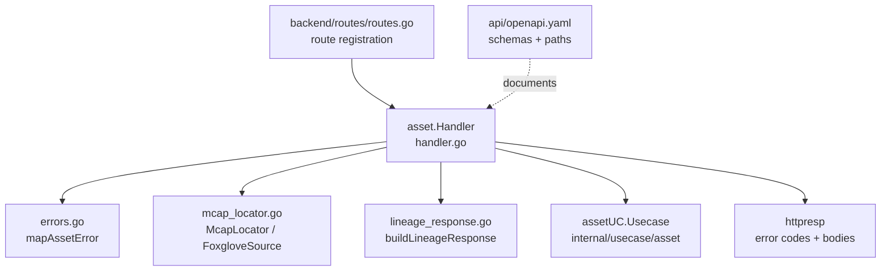
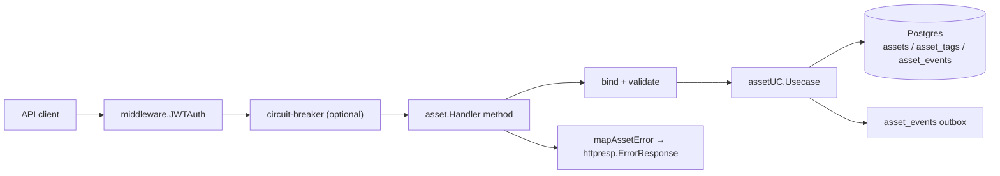
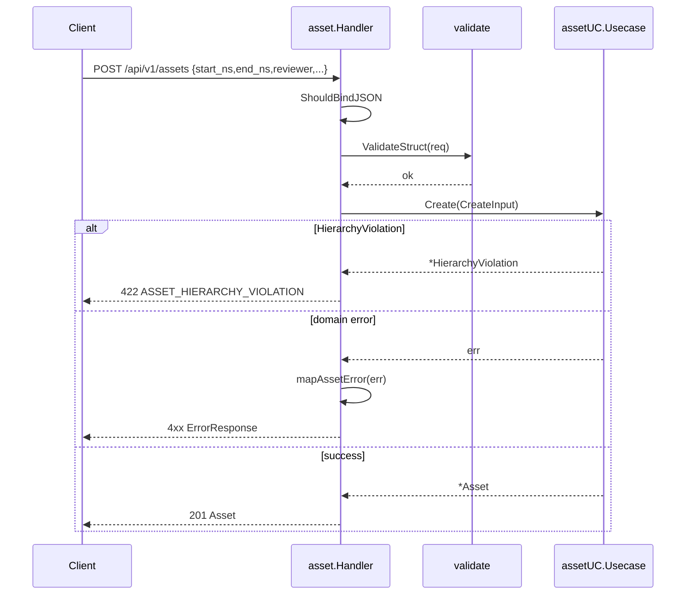
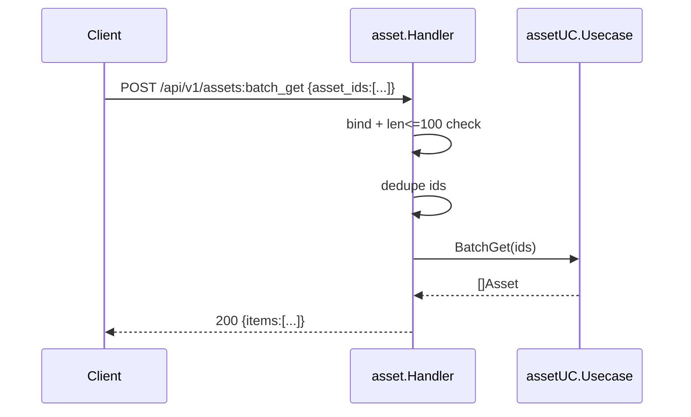
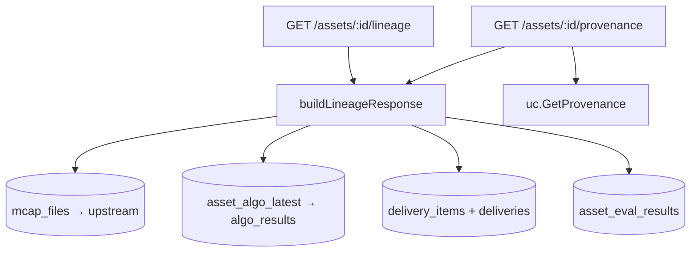
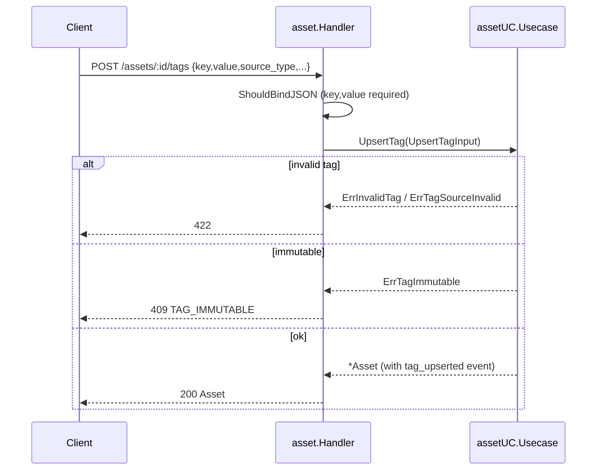
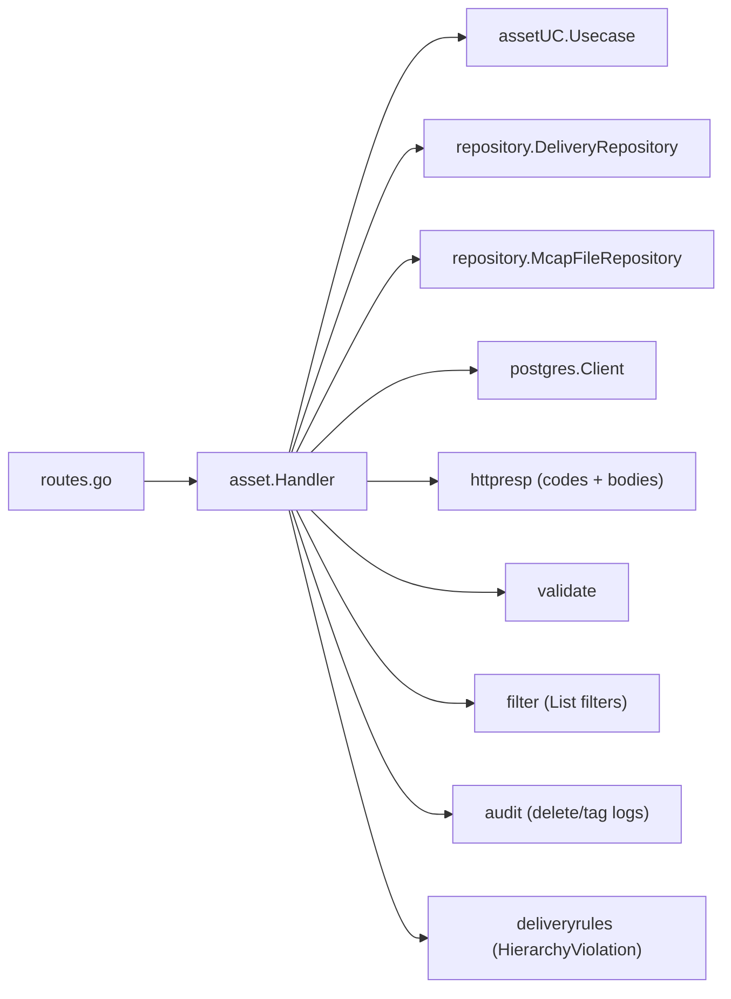

# Assets API

<cite>
**Referenced Files in This Document**

- [api/openapi.yaml](file://api/openapi.yaml)
- [backend/internal/handlers/asset/handler.go](file://backend/internal/handlers/asset/handler.go)
- [backend/internal/handlers/asset/errors.go](file://backend/internal/handlers/asset/errors.go)
- [backend/internal/handlers/asset/mcap_locator.go](file://backend/internal/handlers/asset/mcap_locator.go)
- [backend/internal/handlers/asset/lineage_response.go](file://backend/internal/handlers/asset/lineage_response.go)
- [backend/routes/routes.go](file://backend/routes/routes.go)
- [backend/internal/httpresp/codes.go](file://backend/internal/httpresp/codes.go)
- [docs/review/api-guide.md](file://docs/review/api-guide.md)
</cite>

## Table of Contents
1. [Introduction](#introduction)
2. [Project Structure](#project-structure)
3. [Core Components](#core-components)
4. [Architecture Overview](#architecture-overview)
5. [Detailed Component Analysis](#detailed-component-analysis)
6. [Dependency Analysis](#dependency-analysis)
7. [Performance Considerations](#performance-considerations)
8. [Troubleshooting Guide](#troubleshooting-guide)
9. [Conclusion](#conclusion)
10. [Appendices](#appendices)

## Introduction

The Assets API is the primary surface for creating, reading, mutating, and tracing **assets** in cyber-databrew. An asset is a time-bounded slice of an MCAP recording (a *segment*) plus the derived artifacts layered on top of it (clips, frames, tasks, actions). Each asset carries lifecycle state, ownership, tag projections, algorithm-result projections, an append-only event log, and structural lineage back to its source MCAP file.

The API is grouped under three OpenAPI tags: `Assets` (the asset lifecycle plus its read projections — events, timeline, lineage, provenance, mcap-locator, foxglove-source), `AssetTypes` (per-type metadata JSON Schema), and `AssetTags` (the multi-source tag store and its history). All routes live behind JWT/token authentication under the `/api/v1` prefix.

The `asset_id` is an 8-character alphanumeric primary key (`[0-9A-Za-z]{8}`), distinct from the same-format `mcap_file_id`. Asset creation requires the referenced `mcap_file_id` to already exist because the event-outbox write enforces the foreign key.

**Section sources**
- [api/openapi.yaml](file://api/openapi.yaml#L88-L193)
- [docs/review/api-guide.md](file://docs/review/api-guide.md#L192-L302)

## Project Structure

The Assets API is implemented as a thin HTTP handler layer that delegates all domain logic to an asset usecase, with route wiring in a central router file.



Key files:

- `backend/routes/routes.go` — registers every live Assets/AssetTags route on the `/api/v1` group and binds them to `assetHandler` methods.
- `backend/internal/handlers/asset/handler.go` — the `Handler` type and most endpoint methods (CRUD, batch, events, tags, lineage, provenance, child-asset creation).
- `backend/internal/handlers/asset/mcap_locator.go` — `McapLocator` and `FoxgloveSource` plus their response structs.
- `backend/internal/handlers/asset/lineage_response.go` — assembles the upstream/downstream lineage payload via raw SQL.
- `backend/internal/handlers/asset/errors.go` — central usecase-error → HTTP-status mapping.
- `api/openapi.yaml` — the single source-of-truth contract for request/response schemas and paths.

**Diagram sources**
- [backend/routes/routes.go](file://backend/routes/routes.go#L194-L213)
- [backend/internal/handlers/asset/handler.go](file://backend/internal/handlers/asset/handler.go#L30-L80)

**Section sources**
- [backend/routes/routes.go](file://backend/routes/routes.go#L189-L213)
- [backend/internal/handlers/asset/handler.go](file://backend/internal/handlers/asset/handler.go#L1-L80)

## Core Components

The central component is `asset.Handler`, a struct holding the asset usecase plus optional repositories used by preview and lineage endpoints:

- `uc *assetUC.Usecase` — all asset domain logic.
- `deliveryRepo` — backs `GET /assets/:id/deliveries`.
- `mcapRepo` (wired via `SetMcapRepo`) — backs `mcap-locator` / `foxglove-source`; when nil those endpoints return `503`.
- `pg` / `pgq` (wired via `SetPG`) — raw postgres access for lineage; when nil, lineage returns `503` (direct lineage handler) or an empty downstream block.

`New(uc, deliveryRepo)` constructs the handler; `SetMcapRepo` and `SetPG` inject the optional dependencies after construction.

The error-mapping helper `mapAssetError` is the second core component: every handler calls it on failure and falls back to a `500 Internal` only when the error is unrecognised. This centralizes the mapping of domain sentinels (`ErrNotFound`, `ErrInvalidTag`, `ErrAssetIDTaken`, `repository.ErrOptimisticLock`, etc.) to stable HTTP codes.

**Section sources**
- [backend/internal/handlers/asset/handler.go](file://backend/internal/handlers/asset/handler.go#L30-L80)
- [backend/internal/handlers/asset/errors.go](file://backend/internal/handlers/asset/errors.go#L16-L48)

## Architecture Overview

Every Assets request passes through Gin middleware (JWT/token auth, optional circuit breaker), reaches a `Handler` method, which validates input, calls the usecase, and renders either a domain object or a structured `ErrorResponse`.



The authenticated `/api/v1` group is created with `middleware.JWTAuth(cfg.DatabrewToken, cfg.JWTSecret)`; the asset subgroup `assets := api.Group("/assets")` hangs the per-asset routes off it.

**Diagram sources**
- [backend/routes/routes.go](file://backend/routes/routes.go#L189-L213)
- [backend/internal/handlers/asset/handler.go](file://backend/internal/handlers/asset/handler.go#L545-L646)

**Section sources**
- [backend/routes/routes.go](file://backend/routes/routes.go#L189-L213)

## Detailed Component Analysis

### Asset lifecycle: Create / Get / Update / Delete

`POST /api/v1/assets` (`Handler.Create`) binds a large JSON body whose only required fields are `start_timestamp_ns`, `end_timestamp_ns` (both `gt=0`), and `reviewer`. An explicit `asset_id` may be supplied (must be unique, else `409 DUPLICATE_ASSET_ID`). The handler validates with `validate.ValidateStruct`, then calls `uc.Create`. A `deliveryrules.HierarchyViolation` is mapped to `422 ASSET_HIERARCHY_VIOLATION` with `invariant`, `asset_type`, `parent_id`, and `expected` details; other domain errors flow through `mapAssetError`. Success returns `201` with the full `Asset`.

`GET /api/v1/assets/{id}` (`Handler.Get`) uses `uc.GetAll`, so soft-deleted (archived) assets remain readable. Missing assets return `404 ASSET_NOT_FOUND`.

`PATCH /api/v1/assets/{id}` (`Handler.Update`) accepts an optional-field body — `status`, `lifecycle_state`, `reviewer`, `owner`, and a `tags` map. An optimistic-lock failure surfaces as `409 CONCURRENT_CONFLICT`. When `tags` are supplied it also writes an `asset.batch_tag` audit entry.

`DELETE /api/v1/assets/{id}` (`Handler.Delete`) soft-deletes (archives) the asset, writes an `asset.delete` audit entry, and returns `200 {"deleted": true, "asset_id": ...}`. (The OpenAPI contract documents this delete as `204`; the handler currently returns `200` with a JSON body.)



**Diagram sources**
- [backend/internal/handlers/asset/handler.go](file://backend/internal/handlers/asset/handler.go#L545-L646)

**Section sources**
- [backend/internal/handlers/asset/handler.go](file://backend/internal/handlers/asset/handler.go#L93-L108)
- [backend/internal/handlers/asset/handler.go](file://backend/internal/handlers/asset/handler.go#L545-L771)
- [api/openapi.yaml](file://api/openapi.yaml#L1956-L2026)

### Batch get

`POST /api/v1/assets:batch_get` (`Handler.BatchGet`) is registered with the custom-method colon syntax directly on the `api` group. The body requires `asset_ids` (max 100, else `400 INVALID_ARGUMENT`). An empty list short-circuits to `200 {"items": []}`. IDs are deduplicated before calling `uc.BatchGet`, and the response is `200 {"items": [Asset, ...]}`.



**Diagram sources**
- [backend/internal/handlers/asset/handler.go](file://backend/internal/handlers/asset/handler.go#L886-L921)

**Section sources**
- [backend/internal/handlers/asset/handler.go](file://backend/internal/handlers/asset/handler.go#L886-L921)
- [backend/routes/routes.go](file://backend/routes/routes.go#L209-L210)
- [api/openapi.yaml](file://api/openapi.yaml#L2027-L2041)

### Asset events, timeline, and global events

`GET /api/v1/assets/{id}/events` (`Handler.ListEvents`) returns the event log ordered by `event_seq DESC`. Query parameters are parsed by `parseEventQuery`: `cursor` / `before_event_seq` (older than), `after_event_seq` (newer than), `start_time` / `end_time` (RFC3339 bounds, validated `start <= end`), and `limit` (bounded 1–200, default 50). Repeated `event_type` values support a `*` wildcard suffix that is translated into a SQL `%` LIKE pattern; `algo_key` filters `event_payload.algo_key`. The response is `{items, limit, next_cursor?}`.

`GET /api/v1/assets/{id}/timeline` (`Handler.Timeline`) is an exact alias of `ListEvents`, preserving identical query semantics.

`GET /api/v1/events` (`Handler.ListGlobalEvents`) returns recent events across all assets; when no time bound is supplied it defaults to the last 24 hours, and the default limit is 100.

**Section sources**
- [backend/internal/handlers/asset/handler.go](file://backend/internal/handlers/asset/handler.go#L177-L305)
- [backend/internal/handlers/asset/handler.go](file://backend/internal/handlers/asset/handler.go#L362-L414)
- [api/openapi.yaml](file://api/openapi.yaml#L2111-L2134)
- [api/openapi.yaml](file://api/openapi.yaml#L2371-L2395)

### Lineage and provenance

`GET /api/v1/assets/{id}/lineage` (`Handler.GetLineage`) validates the `asset_id` format (else `400 INVALID_ARGUMENT`), requires a configured postgres client (else `503 PG_DISABLED`), and calls `buildLineageResponse`. That builder issues raw SQL to populate:

- `upstream` — the source `mcap_file_id`, `mcap_uri`, and `ingest_state`.
- `downstream` — `algo_results` (from `asset_algo_latest`), `deliveries` (joined via `delivery_items`, newest 20), and `eval_results` (from `asset_eval_results`, newest 20).

A partial SQL failure is logged but still returns `200` with whatever was assembled.

`GET /api/v1/assets/{id}/provenance` (`Handler.GetProvenance`) calls `uc.GetProvenance` for the logical-asset revision list and version history, then appends a `lineage` snapshot from the same builder. The response is `{asset_id, logical_asset_id, revisions, version_history, lineage}`.



**Diagram sources**
- [backend/internal/handlers/asset/lineage_response.go](file://backend/internal/handlers/asset/lineage_response.go#L18-L142)

**Section sources**
- [backend/internal/handlers/asset/handler.go](file://backend/internal/handlers/asset/handler.go#L307-L360)
- [backend/internal/handlers/asset/lineage_response.go](file://backend/internal/handlers/asset/lineage_response.go#L11-L142)
- [api/openapi.yaml](file://api/openapi.yaml#L2160-L2189)
- [api/openapi.yaml](file://api/openapi.yaml#L1468-L1490)

### MCAP locator and Foxglove source

`GET /api/v1/assets/{id}/mcap-locator` (`Handler.McapLocator`) and `GET /api/v1/assets/{id}/foxglove-source` (`Handler.FoxgloveSource`) both require a wired `mcapRepo` (else `503 SERVICE_UNAVAILABLE`). They load the asset, check its `lifecycle_state` against `previewableLifecycleStates` (`created`, `ready`, `delivered`, `archived`, `superseded`) — otherwise `409 ASSET_NOT_PREVIEWABLE` — and require a linked `mcap_file_id` (else also `409`). The MCAP row is then fetched (missing → `404 MCAP_FILE_NOT_FOUND`).

`mcap-locator` returns a bundle of `{asset_id, lifecycle_state, mcap{mcap_file_id, mcap_uri, size_bytes, raw_hash_md5}, window{start_timestamp_ns, end_timestamp_ns, duration_ms}, version, updated_at}`. The locator is read-only and never signs URLs.

`foxglove-source` returns a direct-MCAP source contract (`ds=remote-file`) whose `ds_params.url` is a same-origin byte-proxy path `/api/v1/mcap-files/{id}/bytes`, plus `hints.window` echoing the same time slice for browser players.

**Section sources**
- [backend/internal/handlers/asset/mcap_locator.go](file://backend/internal/handlers/asset/mcap_locator.go#L19-L225)
- [api/openapi.yaml](file://api/openapi.yaml#L2066-L2095)
- [api/openapi.yaml](file://api/openapi.yaml#L209-L243)

### Asset tags (AssetTags tag)

`POST /api/v1/assets/{id}/tags` (`Handler.UpsertTag`) upserts a single tag and appends a `tag_upserted` event. **The handler request body binds `key` and `value`** (both `required`), plus optional `source_type`, `source_name`, `source_version`, `run_id` — note this differs from the OpenAPI `TagUpsertRequest`, which names the fields `tag_key`/`tag_value`. On success it returns `200` with the updated `Asset`. Tag-validation failures map to `422 INVALID_TAG` / `422 TAG_SOURCE_INVALID`, and immutable-tag conflicts to `409 TAG_IMMUTABLE`.

`DELETE /api/v1/assets/{id}/tags/{key}` (`Handler.DeleteTag`) removes a tag (optionally scoped by `?source_type=`) and returns `200` with the updated `Asset` (OpenAPI documents `204`).

`GET /api/v1/assets/{id}/tags/history` (`Handler.ListTagHistory`) returns `tag_upserted`/`tag_deleted` events sourced from `asset_events`, sharing the same cursor/limit query parsing as `ListEvents`.



**Diagram sources**
- [backend/internal/handlers/asset/handler.go](file://backend/internal/handlers/asset/handler.go#L431-L463)

**Section sources**
- [backend/internal/handlers/asset/handler.go](file://backend/internal/handlers/asset/handler.go#L416-L530)
- [backend/internal/handlers/asset/errors.go](file://backend/internal/handlers/asset/errors.go#L20-L25)
- [api/openapi.yaml](file://api/openapi.yaml#L2397-L2448)
- [api/openapi.yaml](file://api/openapi.yaml#L315-L347)

### Asset type schema (AssetTypes tag)

`GET /api/v1/asset-types/{type}/schema` (`Handler.GetAssetTypeSchema`) returns the registered JSON Schema describing `assets.metadata` for the given `asset_type`, served with content type `application/schema+json`. Unknown types return `404 ASSET_NOT_FOUND`.

**Section sources**
- [backend/internal/handlers/asset/handler.go](file://backend/internal/handlers/asset/handler.go#L110-L128)
- [api/openapi.yaml](file://api/openapi.yaml#L2043-L2065)
- [docs/review/api-guide.md](file://docs/review/api-guide.md#L31-L48)

### Layered child-asset creation

`POST /api/v1/assets/{id}/clips`, `/frames`, `/tasks`, and `/actions` all share `Handler.createChildAsset`, parameterized only by the literal asset type (`clip`, `frame`, `task`, `action`). The body is `ChildAssetCreateRequest`: required `start_timestamp_ns` and `end_timestamp_ns` (`gt=0`), optional `split_method`, `split_run_id`, and `metadata`. The `split_method` decides the lineage edge — `manual`/`rule:*` produce a `split_from` edge, `algo:*` a `derived_from` edge. Hierarchy violations return `422 ASSET_HIERARCHY_VIOLATION`; success returns `201` with the new `Asset`.

**Section sources**
- [backend/internal/handlers/asset/handler.go](file://backend/internal/handlers/asset/handler.go#L648-L710)
- [api/openapi.yaml](file://api/openapi.yaml#L2239-L2339)
- [api/openapi.yaml](file://api/openapi.yaml#L1597-L1620)

### Usage stats, revisions, and logical assets

The handler additionally defines `RecordView` (`POST /assets/{id}/view`), `ToggleFavorite` (`POST /assets/{id}/favorite`), `PromoteRevision` (`POST /assets/{id}/revisions`), `GetCurrentForLogical` (`GET /logical-assets/{id}/current`), and `HandleRatingsHistory` (`GET /logical-assets/{id}/ratings-history`). These methods and their OpenAPI paths exist, but are **not registered** in the asset route group shown in `routes.go` (lines 194–213); treat them as defined-but-not-wired in this router and confirm registration before relying on them.

**Section sources**
- [backend/internal/handlers/asset/handler.go](file://backend/internal/handlers/asset/handler.go#L923-L1049)
- [backend/internal/handlers/asset/handler.go](file://backend/internal/handlers/asset/handler.go#L1449-L1449)
- [backend/routes/routes.go](file://backend/routes/routes.go#L194-L213)

## Dependency Analysis



The handler depends on the asset usecase for all domain operations, on `httpresp` for stable error codes, on `validate` for struct validation, on `deliveryrules` for hierarchy-violation typing, and on `audit` for write logging. Preview and lineage features depend on the optionally-injected `mcapRepo` and `pg` client. Upstream, `routes.go` is the only registrar of these endpoints.

**Diagram sources**
- [backend/internal/handlers/asset/handler.go](file://backend/internal/handlers/asset/handler.go#L1-L80)
- [backend/internal/handlers/asset/errors.go](file://backend/internal/handlers/asset/errors.go#L1-L11)

**Section sources**
- [backend/internal/handlers/asset/handler.go](file://backend/internal/handlers/asset/handler.go#L1-L80)

## Performance Considerations

- **Batch get is capped at 100 IDs** and deduplicates before querying, bounding response size and avoiding duplicate rows.
- **Event pagination is cursor-based** on `event_seq` with a hard `limit` ceiling of 200 (default 50), preventing unbounded scans of `asset_events`.
- **Lineage downstream queries are bounded**: deliveries and eval results are each capped at the newest 20 rows, and the builder degrades gracefully (logs and returns partial data) instead of failing the request.
- **Global events default to a 24h window** when no time bound is given, avoiding full-table scans.
- **mcap-locator is read-only** and performs only two point lookups (asset + mcap file), making it cheap for preview hot paths; it never signs URLs.
- The deprecated `List` path builds dynamic WHERE clauses from validated filters; the recommended query entry point is `POST /api/v1/queries/run`, which uses ES recall + PG refine.

**Section sources**
- [backend/internal/handlers/asset/handler.go](file://backend/internal/handlers/asset/handler.go#L185-L222)
- [backend/internal/handlers/asset/handler.go](file://backend/internal/handlers/asset/handler.go#L886-L921)
- [backend/internal/handlers/asset/lineage_response.go](file://backend/internal/handlers/asset/lineage_response.go#L85-L119)

## Troubleshooting Guide

- **`404 ASSET_NOT_FOUND`** — the `asset_id` does not exist; note that `GET` still returns soft-deleted assets, so a 404 means the row is truly absent.
- **`409 DUPLICATE_ASSET_ID`** — a client-supplied `asset_id` is already taken; omit it to let the server generate one.
- **`409 CONCURRENT_CONFLICT`** — optimistic-lock failure on `PATCH`; reload the asset and retry.
- **`422 ASSET_HIERARCHY_VIOLATION`** — child-asset creation broke a layering invariant; inspect the `invariant`, `asset_type`, `parent_id`, `expected` details.
- **`422 INVALID_TAG` / `422 TAG_SOURCE_INVALID` / `409 TAG_IMMUTABLE`** — tag value, source, or immutability checks failed on upsert.
- **`409 ASSET_NOT_PREVIEWABLE`** — `mcap-locator`/`foxglove-source` called on an asset whose `lifecycle_state` is not previewable, or with no linked MCAP file.
- **`503 SERVICE_UNAVAILABLE` / `PG_DISABLED`** — the `mcapRepo` (preview) or `pg` client (lineage) was not wired into the handler.
- **Tag field name mismatch** — when upserting tags, the handler binds `key`/`value`, not the `tag_key`/`tag_value` shown in the OpenAPI `TagUpsertRequest`. Send `key`/`value`.
- **Create fails on MCAP FK** — the `mcap_file_id` must reference an existing MCAP record before creating an asset.

**Section sources**
- [backend/internal/handlers/asset/errors.go](file://backend/internal/handlers/asset/errors.go#L16-L48)
- [backend/internal/httpresp/codes.go](file://backend/internal/httpresp/codes.go#L5-L35)
- [backend/internal/handlers/asset/mcap_locator.go](file://backend/internal/handlers/asset/mcap_locator.go#L86-L130)

## Conclusion

The Assets API offers a complete asset lifecycle (create, read, update, soft-delete, batch-get), layered child-asset creation, a multi-source tag store with history, an append-only event/timeline feed, structural lineage and provenance, and MCAP preview locators. The handler layer stays thin: it validates input, delegates to the asset usecase, and uses a single `mapAssetError` mapper for stable error semantics. The OpenAPI contract is the authoritative schema reference, with two documented deviations worth noting — the delete/tag-delete handlers return `200` (OpenAPI says `204`), and the tag-upsert body uses `key`/`value` rather than `tag_key`/`tag_value`.

## Appendices

### API definitions

| Method & Path | Handler | Auth | Success | Notable errors |
| --- | --- | --- | --- | --- |
| `POST /api/v1/assets` | `Create` | JWT/token | `201 Asset` | `400 INVALID_ARGUMENT`, `422 ASSET_HIERARCHY_VIOLATION`, `409 DUPLICATE_ASSET_ID` |
| `GET /api/v1/assets/{id}` | `Get` | JWT/token | `200 Asset` | `404 ASSET_NOT_FOUND` |
| `PATCH /api/v1/assets/{id}` | `Update` | JWT/token | `200 Asset` | `404`, `409 CONCURRENT_CONFLICT` |
| `DELETE /api/v1/assets/{id}` | `Delete` | JWT/token | `200 {deleted,asset_id}` (OpenAPI: `204`) | `404` |
| `POST /api/v1/assets:batch_get` | `BatchGet` | JWT/token | `200 {items}` | `400` (>100 ids) |
| `GET /api/v1/asset-types/{type}/schema` | `GetAssetTypeSchema` | JWT/token | `200 schema+json` | `404 ASSET_NOT_FOUND` |
| `GET /api/v1/assets/{id}/deliveries` | `ListDeliveries` | JWT/token | `200 list` | `500` |
| `GET /api/v1/assets/{id}/mcap-locator` | `McapLocator` | JWT/token | `200 AssetMcapLocator` | `404`, `409 ASSET_NOT_PREVIEWABLE`, `503` |
| `GET /api/v1/assets/{id}/foxglove-source` | `FoxgloveSource` | JWT/token | `200 FoxgloveSourceResponse` | `404`, `409`, `503` |
| `GET /api/v1/assets/{id}/events` | `ListEvents` | JWT/token | `200 {items,limit,next_cursor?}` | `400`, `404` |
| `GET /api/v1/assets/{id}/timeline` | `Timeline` (alias) | JWT/token | `200 {items,...}` | `400`, `404` |
| `GET /api/v1/assets/{id}/lineage` | `GetLineage` | JWT/token | `200 LineageResponse` | `400 INVALID_ARGUMENT`, `503 PG_DISABLED` |
| `GET /api/v1/assets/{id}/provenance` | `GetProvenance` | JWT/token | `200 provenance` | `400`, `404` |
| `POST /api/v1/assets/{id}/tags` | `UpsertTag` | JWT/token | `200 Asset` | `422 INVALID_TAG/TAG_SOURCE_INVALID`, `409 TAG_IMMUTABLE` |
| `DELETE /api/v1/assets/{id}/tags/{key}` | `DeleteTag` | JWT/token | `200 Asset` (OpenAPI: `204`) | `404` |
| `GET /api/v1/assets/{id}/tags/history` | `ListTagHistory` | JWT/token | `200 {items,limit,next_cursor?}` | `400`, `404` |
| `POST /api/v1/assets/{id}/clips` | `CreateClip` | JWT/token | `201 Asset` | `422 ASSET_HIERARCHY_VIOLATION` |
| `POST /api/v1/assets/{id}/frames` | `CreateFrame` | JWT/token | `201 Asset` | `422` |
| `POST /api/v1/assets/{id}/tasks` | `CreateTask` | JWT/token | `201 Asset` | `422` |
| `POST /api/v1/assets/{id}/actions` | `CreateAction` | JWT/token | `201 Asset` | `422` |
| `GET /api/v1/events` | `ListGlobalEvents` | JWT/token | `200 {items,...}` | `400` |

> Endpoints documented in `api/openapi.yaml` but **not registered** in `routes.go` (lines 194–213): `POST /assets/{id}/view`, `POST /assets/{id}/favorite`, `POST /assets/{id}/revisions`, `GET /assets/{id}/events/stream`, `GET /logical-assets/{id}/current`, `GET /logical-assets/{id}/ratings-history`. Their handler methods exist (`RecordView`, `ToggleFavorite`, `PromoteRevision`, `GetCurrentForLogical`, `HandleRatingsHistory`).

### Example: create asset

```bash
curl -X POST "$BASE/api/v1/assets" \
  -H "Authorization: Bearer $TOKEN" \
  -H "Content-Type: application/json" \
  -d '{
    "mcap_file_id": "mcap0001",
    "start_timestamp_ns": 1000000000,
    "end_timestamp_ns": 5000000000,
    "reviewer": "alice",
    "owner": "team-a",
    "asset_type": "segment",
    "tags": {"scene": "indoor", "quality": "good"}
  }'
```

Returns `201` with the full `Asset` JSON (including the generated `asset_id`).

### Example: batch get

```bash
curl -X POST "$BASE/api/v1/assets:batch_get" \
  -H "Authorization: Bearer $TOKEN" \
  -H "Content-Type: application/json" \
  -d '{"asset_ids": ["aset0001", "aset0002"]}'
# → 200 {"items": [ {Asset}, {Asset} ]}
```

### Example: upsert tag (handler binds key/value)

```bash
curl -X POST "$BASE/api/v1/assets/aset0001/tags" \
  -H "Authorization: Bearer $TOKEN" \
  -H "Content-Type: application/json" \
  -d '{"key": "priority", "value": "high", "source_type": "manual"}'
# → 200 {Asset with updated tags + tag_upserted event}
```

### Key schemas (from api/openapi.yaml)

| Schema | Notable fields |
| --- | --- |
| `Asset` | `asset_id`, `mcap_file_id`, `start_timestamp_ns`, `end_timestamp_ns`, `lifecycle_state` (enum), `asset_type`, `owner`, `reviewer`, `tags`, `tags_detailed`, `algo_results`, `version`, `logical_asset_id`, `revision`, `is_current` |
| `AssetMcapLocator` | `asset_id`, `lifecycle_state`, `mcap{mcap_file_id,mcap_uri,size_bytes,raw_hash_md5}`, `window{start_timestamp_ns,end_timestamp_ns,duration_ms}`, `version`, `updated_at` |
| `FoxgloveSourceResponse` | `asset_id`, `source_id`, `ds`, `ds_params`, `hints`, `expires_at` |
| `AssetTag` | `asset_id`, `tag_key`, `tag_value`, `tag_type`, `source_type/name/version`, `run_id`, `confidence`, `applied_at` |
| `TagHistoryResponse` | `items[AssetTag]`, `total` |
| `AssetEventListResponse` | `items[AssetEvent]`, `limit`, `next_cursor` |
| `LineageResponse` | `asset_id`, `upstream`, `downstream` |
| `AssetProvenanceResponse` | `asset_id`, `root_asset_id`, `provenance[ProvenanceEntry]` |
| `ChildAssetCreateRequest` | required `start_timestamp_ns`, `end_timestamp_ns`; optional `split_method`, `split_run_id`, `metadata` |
| `ErrorResponse` | `code`, `message`, `request_id`, `details` |

**Section sources**
- [api/openapi.yaml](file://api/openapi.yaml#L78-L347)
- [api/openapi.yaml](file://api/openapi.yaml#L1468-L1490)
- [api/openapi.yaml](file://api/openapi.yaml#L1597-L1620)
- [api/openapi.yaml](file://api/openapi.yaml#L1955-L2448)
- [backend/routes/routes.go](file://backend/routes/routes.go#L194-L213)
