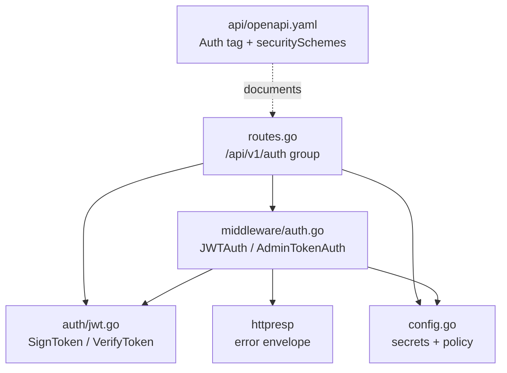
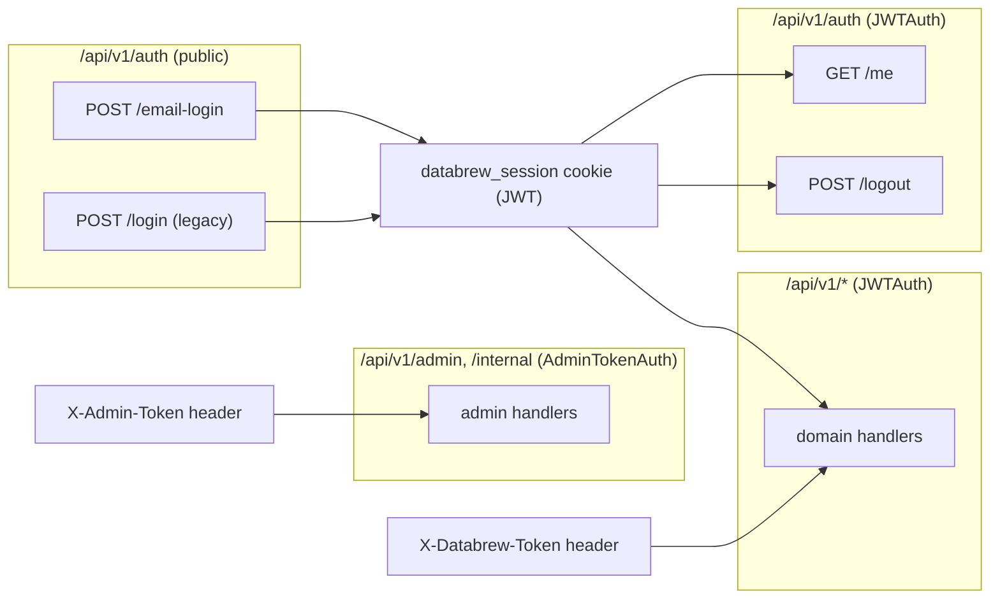
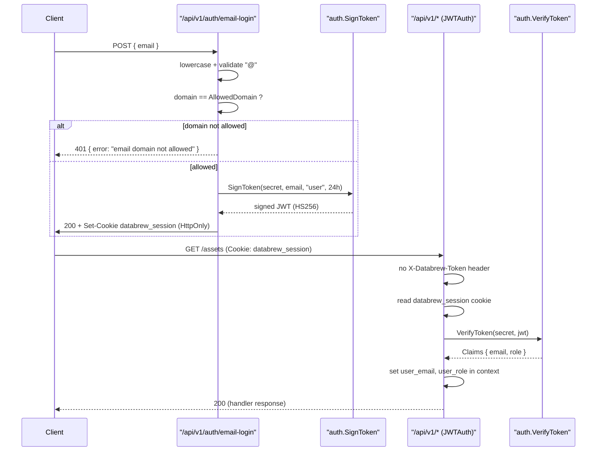
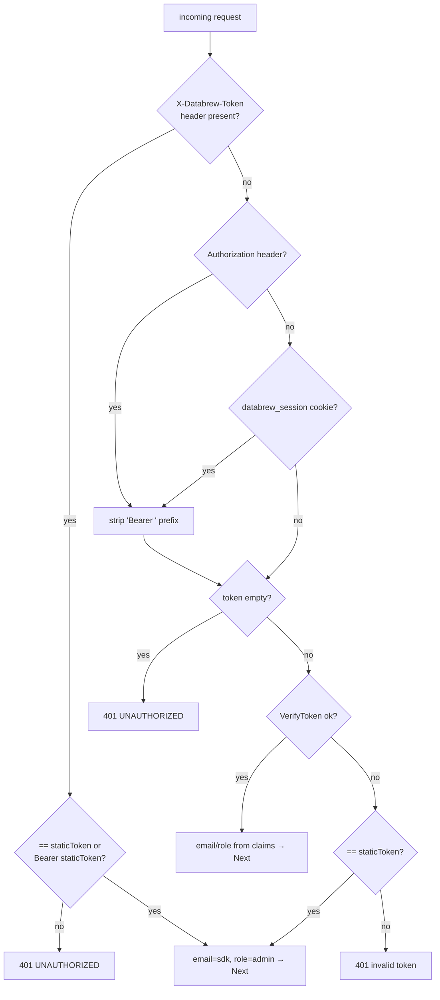
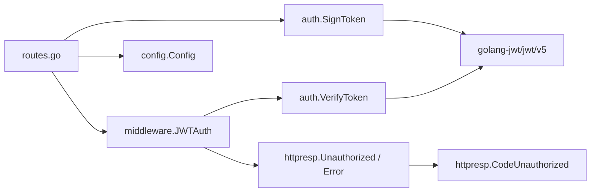

# Authentication & Authorization API

<cite>
**Referenced Files in This Document**
- [api/openapi.yaml](file://api/openapi.yaml)
- [backend/routes/routes.go](file://backend/routes/routes.go)
- [backend/internal/middleware/auth.go](file://backend/internal/middleware/auth.go)
- [backend/internal/auth/jwt.go](file://backend/internal/auth/jwt.go)
- [backend/internal/httpresp/response.go](file://backend/internal/httpresp/response.go)
- [backend/internal/httpresp/codes.go](file://backend/internal/httpresp/codes.go)
- [backend/internal/config/config.go](file://backend/internal/config/config.go)
</cite>

## Table of Contents
1. [Introduction](#introduction)
2. [Project Structure](#project-structure)
3. [Core Components](#core-components)
4. [Architecture Overview](#architecture-overview)
5. [Detailed Component Analysis](#detailed-component-analysis)
6. [Dependency Analysis](#dependency-analysis)
7. [Performance Considerations](#performance-considerations)
8. [Troubleshooting Guide](#troubleshooting-guide)
9. [Conclusion](#conclusion)
10. [Appendices](#appendices)

## Introduction

The Authentication & Authorization API governs how clients establish, inspect, and tear down an authenticated session against the cyber-databrew backend. It serves two distinct audiences with two distinct credential models:

- **Browser / frontend users** authenticate by email against an allowlisted corporate domain, receive a signed JSON Web Token (JWT) delivered as an `HttpOnly` `databrew_session` cookie, and subsequently ride that cookie on every request.
- **SDK / service-to-service clients** authenticate with a long-lived static token (the "Grace Token" / `DATABREW_TOKEN`) presented either through the legacy `POST /api/v1/auth/login` exchange or directly via the `X-Databrew-Token` request header.

Both models converge on a single request-time gatekeeper, the `JWTAuth` Gin middleware, which is mounted on the entire `/api/v1` route group. The middleware resolves the caller's identity (email + role) and injects it into the Gin request context so that downstream handlers can make authorization decisions. A separate, stricter `AdminTokenAuth` middleware guards admin and internal route groups.

This page documents the three Auth-tagged endpoints (`/login`, `/me`, `/logout`), the present-but-undocumented `/email-login` endpoint, the token header conventions, the JWT signing/verification primitives, and the security schemes declared in the OpenAPI specification.

**Section sources**
- [api/openapi.yaml](file://api/openapi.yaml#L1908-L1953)
- [backend/routes/routes.go](file://backend/routes/routes.go#L107-L187)
- [backend/internal/middleware/auth.go](file://backend/internal/middleware/auth.go#L41-L97)

## Project Structure

The authentication surface is split across the API contract, the route wiring, the middleware layer, the token primitives, and the shared HTTP response envelope.

- **`api/openapi.yaml`** — The OpenAPI 3.1.0 contract. It declares the `Auth` tag, the two `apiKey` security schemes (`DatabrewToken` via `X-Databrew-Token`, `AdminToken` via `X-Admin-Token`), the global default security requirement, and the three Auth-tagged path operations.
- **`backend/routes/routes.go`** — Wires the public auth route group (`/api/v1/auth`), the JWT-protected sub-group (`/me`, `/logout`), the legacy `/login`, and applies `JWTAuth` to the whole `/api/v1` group and `AdminTokenAuth` to admin/internal sub-groups.
- **`backend/internal/middleware/auth.go`** — Houses `JWTAuth`, `AdminTokenAuth`, and the legacy `StaticTokenAuth`, plus the context keys (`user_email`, `user_role`) injected on success.
- **`backend/internal/auth/jwt.go`** — The cryptographic core: `SignToken` and `VerifyToken` over HMAC-SHA256 with the `Claims` type (email, role, registered claims).
- **`backend/internal/config/config.go`** — Sources the secrets and policy values: `DatabrewToken`, `JWTSecret`, `AllowedDomain`, `AdminToken`, and `Env`.
- **`backend/internal/httpresp/response.go`** + **`codes.go`** — The standardized error envelope and the `UNAUTHORIZED` error code emitted on auth failure.



**Diagram sources**
- [backend/routes/routes.go](file://backend/routes/routes.go#L103-L189)
- [backend/internal/middleware/auth.go](file://backend/internal/middleware/auth.go#L41-L124)
- [backend/internal/auth/jwt.go](file://backend/internal/auth/jwt.go#L17-L50)

**Section sources**
- [api/openapi.yaml](file://api/openapi.yaml#L8-L64)
- [backend/routes/routes.go](file://backend/routes/routes.go#L103-L189)
- [backend/internal/config/config.go](file://backend/internal/config/config.go#L35-L37)

## Core Components

#### JWT Claims and Signing (`auth/jwt.go`)

The token model is a single struct, `Claims`, embedding the standard `jwt.RegisteredClaims` and adding two custom fields:

| Field | JSON key | Source | Purpose |
| --- | --- | --- | --- |
| `Email` | `email` | login email or `"legacy"` / `"sdk"` | caller identity |
| `Role` | `role` | `"user"` (email-login) or `"admin"` (legacy/SDK) | coarse authorization |

`SignToken(secret, email, role, ttl)` constructs the claims with `Issuer = "cyber-databrew"`, `Subject = email`, `IssuedAt = now`, and `ExpiresAt = now + ttl`, then signs with `SigningMethodHS256` (HMAC-SHA256). All callers in `routes.go` pass a 24-hour TTL.

`VerifyToken(secret, tokenString)` parses with `ParseWithClaims`, explicitly rejects any signing method that is not an HMAC variant (guarding against the classic `alg` confusion attack), and returns the typed `*Claims` only when the token is valid.

**Section sources**
- [backend/internal/auth/jwt.go](file://backend/internal/auth/jwt.go#L10-L50)

#### The `JWTAuth` Middleware (`middleware/auth.go`)

`JWTAuth(staticToken, jwtSecret)` is the single request-time gate for `/api/v1`. It resolves credentials in a fixed priority order and, on success, sets `CtxKeyEmail` (`user_email`) and `CtxKeyRole` (`user_role`) in the Gin context for downstream handlers.

1. **`X-Databrew-Token` header** (legacy SDK path): if present, it must equal `staticToken` or `"Bearer "+staticToken`; on match the caller is identified as `email="sdk"`, `role="admin"`.
2. **`Authorization` header** (preferred) — the `"Bearer "` prefix is trimmed; otherwise the **`databrew_session` cookie** is used.
3. The resolved string is verified as a JWT; valid JWTs set email/role from the claims.
4. **Fallback**: if JWT verification fails, the raw string is compared against `staticToken`; an exact match grants `email="sdk"`, `role="admin"`. Any other outcome returns `401` with code `UNAUTHORIZED`.

**Section sources**
- [backend/internal/middleware/auth.go](file://backend/internal/middleware/auth.go#L14-L97)

#### The `AdminTokenAuth` Middleware

`AdminTokenAuth(adminToken, databrewToken, env)` guards the admin/internal route groups. When `ADMIN_TOKEN` is empty: production returns `403 Forbidden`, while non-production falls back to `StaticTokenAuth(databrewToken)`. When set, it checks `X-Admin-Token` (or `Authorization`) against `adminToken` / `"Bearer "+adminToken`.

**Section sources**
- [backend/internal/middleware/auth.go](file://backend/internal/middleware/auth.go#L99-L124)

#### Configuration Inputs (`config.go`)

| Config field | Env var | Default | Role |
| --- | --- | --- | --- |
| `DatabrewToken` | `DATABREW_TOKEN` / `GRACE_TOKEN` | `dev-token` | legacy static / SDK token |
| `JWTSecret` | `JWT_SECRET` | `dev-jwt-secret` | HMAC signing secret |
| `AllowedDomain` | `ALLOWED_DOMAIN` | `cyberorigin.ai` | email-login domain allowlist |
| `AdminToken` | `ADMIN_TOKEN` | `""` | admin route gate |
| `Env` | `ENV` | `development` | toggles secure cookie + prod admin lockout |

**Section sources**
- [backend/internal/config/config.go](file://backend/internal/config/config.go#L10-L37)
- [backend/internal/config/config.go](file://backend/internal/config/config.go#L146-L213)

## Architecture Overview

Authentication is a layered concern. The public auth group issues credentials; the `JWTAuth` middleware consumes them on every protected request; `AdminTokenAuth` adds a second gate over the most sensitive routes.



**Diagram sources**
- [backend/routes/routes.go](file://backend/routes/routes.go#L107-L189)
- [backend/routes/routes.go](file://backend/routes/routes.go#L268-L282)

**Section sources**
- [backend/routes/routes.go](file://backend/routes/routes.go#L103-L189)
- [backend/internal/middleware/auth.go](file://backend/internal/middleware/auth.go#L41-L124)

## Detailed Component Analysis

### Login → Token → Authenticated Call

The canonical browser flow obtains a JWT cookie via `/email-login`, then reuses that cookie on every protected call. The sequence below traces the full round-trip, including the middleware's credential resolution.



**Diagram sources**
- [backend/routes/routes.go](file://backend/routes/routes.go#L110-L142)
- [backend/internal/auth/jwt.go](file://backend/internal/auth/jwt.go#L17-L50)
- [backend/internal/middleware/auth.go](file://backend/internal/middleware/auth.go#L49-L96)

**Section sources**
- [backend/routes/routes.go](file://backend/routes/routes.go#L110-L142)
- [backend/internal/middleware/auth.go](file://backend/internal/middleware/auth.go#L49-L96)

### Endpoint: `POST /api/v1/auth/email-login`

Frontend email-based login. Not Auth-tagged in the OpenAPI contract (it is implemented in `routes.go` only), but it is the primary browser entry point.

#### Request

```json
{ "email": "user@cyberorigin.ai" }
```

Handler normalization: the email is trimmed and lower-cased; it must contain `@`; the substring after the last `@` must exactly equal `cfg.AllowedDomain` (and `AllowedDomain` must be non-empty).

#### Response

| Status | Condition | Body |
| --- | --- | --- |
| `200 OK` | valid allowlisted email | `{ "authenticated": true, "email": "<email>", "role": "user" }` + `Set-Cookie: databrew_session` |
| `400 Bad Request` | missing / malformed email | `{ "error": "email is required" }` or `{ "error": "valid email is required" }` |
| `401 Unauthorized` | domain not allowlisted | `{ "error": "email domain not allowed" }` |
| `500 Internal Server Error` | token signing failed | `{ "error": "failed to sign token" }` |

The cookie is set with `SameSite=Lax`, a 24-hour (`86400` s) max-age, path `/`, the `secure` flag tied to `cfg.Env == "production"`, and `HttpOnly=true`.

**Section sources**
- [backend/routes/routes.go](file://backend/routes/routes.go#L110-L142)

### Endpoint: `POST /api/v1/auth/login` (legacy)

Static-token login for SDK backward compatibility. This is the endpoint documented under the `Auth` tag (`summary: Login with Grace Token`). It exchanges the long-lived `DATABREW_TOKEN` for a JWT cookie.

#### Request — `LoginRequest`

```json
{ "token": "<DATABREW_TOKEN>" }
```

`token` is required. The handler trims whitespace and compares it for exact equality against `cfg.DatabrewToken`.

#### Response — `LoginResponse`

| Status | Condition | Body |
| --- | --- | --- |
| `200 OK` | token matches `DatabrewToken` | `{ "authenticated": true }` + `Set-Cookie: databrew_session` |
| `400 Bad Request` | missing / empty token | `{ "error": "token is required" }` |
| `401 Unauthorized` | token mismatch | `{ "error": "invalid token" }` |
| `500 Internal Server Error` | signing failed | `{ "error": "failed to sign token" }` |

On success the JWT is minted with `email="legacy"`, `role="admin"`, a 24-hour TTL, and the same cookie semantics as `/email-login`.

**Section sources**
- [backend/routes/routes.go](file://backend/routes/routes.go#L161-L187)
- [api/openapi.yaml](file://api/openapi.yaml#L1909-L1927)
- [api/openapi.yaml](file://api/openapi.yaml#L1587-L1595)

### Endpoint: `GET /api/v1/auth/me`

Session inspection. Mounted under the JWT-protected sub-group, so it runs `JWTAuth` first; reaching the handler proves the caller is authenticated.

#### Request

No body. Credentials supplied via the `databrew_session` cookie, an `Authorization: Bearer <jwt>` header, or `X-Databrew-Token`.

#### Response

| Status | Condition | Body |
| --- | --- | --- |
| `200 OK` | authenticated | `{ "authenticated": true, "email": "<email>", "role": "<role>" }` |
| `401 Unauthorized` | no / invalid credential | `{ "code": "UNAUTHORIZED", "message": "unauthorized", "request_id": "..." }` |

The handler reads `user_email` and `user_role` from the Gin context (populated by `JWTAuth`). Note that the OpenAPI schema for `/me` documents only the `authenticated` boolean; the implementation additionally returns `email` and `role`.

**Section sources**
- [backend/routes/routes.go](file://backend/routes/routes.go#L144-L153)
- [api/openapi.yaml](file://api/openapi.yaml#L1928-L1940)
- [backend/internal/middleware/auth.go](file://backend/internal/middleware/auth.go#L14-L18)

### Endpoint: `POST /api/v1/auth/logout`

Clears the session. Also under the JWT-protected sub-group.

#### Request

No body. Requires a valid credential (the group runs `JWTAuth`).

#### Response

| Status | Condition | Body |
| --- | --- | --- |
| `200 OK` | session cleared | `{ "authenticated": false }` + `Set-Cookie: databrew_session=; Max-Age=-1` |
| `401 Unauthorized` | no / invalid credential | `{ "code": "UNAUTHORIZED", ... }` |

The handler overwrites `databrew_session` with an empty value and a negative max-age (`-1`), expiring it immediately, using the same `SameSite=Lax` / path / secure / HttpOnly settings.

**Section sources**
- [backend/routes/routes.go](file://backend/routes/routes.go#L154-L158)
- [api/openapi.yaml](file://api/openapi.yaml#L1941-L1953)

### Credential Resolution Decision Logic

`JWTAuth` applies a deterministic precedence. The flowchart below mirrors the branch order in the source exactly.



**Diagram sources**
- [backend/internal/middleware/auth.go](file://backend/internal/middleware/auth.go#L49-L96)

**Section sources**
- [backend/internal/middleware/auth.go](file://backend/internal/middleware/auth.go#L41-L97)

## Dependency Analysis

The auth layer is small but central — every `/api/v1` handler depends transitively on `JWTAuth`.



Upstream dependencies: the `golang-jwt/jwt/v5` library (HS256 signing/parsing), `config.Config` for secrets and policy, and the `httpresp` package for the standardized error envelope. Downstream dependents: every protected handler reads `user_email` / `user_role` from the context that `JWTAuth` populates, and `AdminTokenAuth`-guarded handlers add the `X-Admin-Token` requirement on top.

**Diagram sources**
- [backend/internal/middleware/auth.go](file://backend/internal/middleware/auth.go#L1-L97)
- [backend/internal/auth/jwt.go](file://backend/internal/auth/jwt.go#L1-L50)

**Section sources**
- [backend/internal/middleware/auth.go](file://backend/internal/middleware/auth.go#L1-L124)
- [backend/internal/httpresp/response.go](file://backend/internal/httpresp/response.go#L26-L41)
- [backend/internal/httpresp/codes.go](file://backend/internal/httpresp/codes.go#L24-L24)

## Performance Considerations

- **Stateless verification.** JWT validation (`VerifyToken`) is a pure CPU operation — an HMAC-SHA256 recomputation and claim check — with no database or network round-trip on the hot path. There is no session store to query, so auth adds negligible per-request latency and scales horizontally without shared state.
- **No revocation list.** Because sessions are not server-side, there is no per-request lookup cost; the trade-off is that tokens cannot be revoked before their 24-hour expiry (see Troubleshooting).
- **Header-first short circuit.** The `X-Databrew-Token` branch returns before any JWT parsing, making the SDK path the cheapest route through `JWTAuth`.
- **Secret access.** Secrets are read once from config at startup and captured in the middleware closure; they are not re-read per request.

**Section sources**
- [backend/internal/middleware/auth.go](file://backend/internal/middleware/auth.go#L49-L96)
- [backend/internal/auth/jwt.go](file://backend/internal/auth/jwt.go#L34-L50)

## Troubleshooting Guide

#### `401 UNAUTHORIZED` on every protected call

- **No credential present.** Ensure one of: the `databrew_session` cookie (set by `/login` or `/email-login`), `Authorization: Bearer <jwt>`, or `X-Databrew-Token: <DATABREW_TOKEN>`. With none, `JWTAuth` aborts with `unauthorized`.
- **Cookie not sent cross-site.** The cookie is `SameSite=Lax`; cross-site XHR may omit it. Use the `Authorization` header for cross-origin SDK calls.
- **`secure` cookie over HTTP.** In `production` (`ENV=production`) the cookie carries the `Secure` flag and will not be stored over plain HTTP.

#### `401 invalid token: <err>`

Returned when a non-empty credential fails JWT verification *and* does not equal the static token. Common causes: an expired token (>24 h old), a token signed with a different `JWT_SECRET`, or a malformed/truncated value. Re-login to mint a fresh token.

#### `401 email domain not allowed` from `/email-login`

The email's domain does not match `ALLOWED_DOMAIN` (default `cyberorigin.ai`), or `ALLOWED_DOMAIN` is empty. Confirm the configured allowlist domain.

#### `403 admin routes require ADMIN_TOKEN in production`

`AdminTokenAuth` refuses admin/internal routes in production when `ADMIN_TOKEN` is unset. Set `ADMIN_TOKEN` (and present it via `X-Admin-Token`).

#### A previously valid SDK token now returns `401`

The `X-Databrew-Token` value must exactly match `DATABREW_TOKEN` / `GRACE_TOKEN` (or be `Bearer <token>`). A trailing newline or rotated secret breaks the exact-equality check.

**Section sources**
- [backend/internal/middleware/auth.go](file://backend/internal/middleware/auth.go#L49-L123)
- [backend/routes/routes.go](file://backend/routes/routes.go#L110-L142)
- [backend/internal/config/config.go](file://backend/internal/config/config.go#L165-L213)

## Conclusion

The cyber-databrew auth API offers a deliberately dual-mode design: a modern, cookie-based JWT flow for browser users (`/email-login`, validated against a domain allowlist) and a backward-compatible static-token flow for SDK clients (`/login` plus the `X-Databrew-Token` header). Both feed a single stateless `JWTAuth` middleware that resolves identity and injects `user_email` / `user_role` into the request context, while `AdminTokenAuth` adds a stricter gate over admin and internal routes. The `/me` and `/logout` endpoints round out session inspection and teardown. Statelessness keeps the hot path fast at the cost of pre-expiry revocation.

## Appendices

### Appendix A — Security Schemes (OpenAPI)

| Scheme | Type | Location | Name |
| --- | --- | --- | --- |
| `DatabrewToken` (global default) | `apiKey` | header | `X-Databrew-Token` |
| `AdminToken` | `apiKey` | header | `X-Admin-Token` |

The global `security: [{ DatabrewToken: [] }]` applies the Databrew token requirement to all operations by default; public health/auth operations override it with `security: []`.

**Section sources**
- [api/openapi.yaml](file://api/openapi.yaml#L8-L64)

### Appendix B — Token Header & Cookie Conventions

| Mechanism | Carrier | Format | Set by |
| --- | --- | --- | --- |
| SDK static token | `X-Databrew-Token` header | `<token>` or `Bearer <token>` | client |
| JWT (header) | `Authorization` header | `Bearer <jwt>` | client |
| JWT (cookie) | `databrew_session` cookie | raw JWT, `HttpOnly`, `SameSite=Lax`, 24 h | `/login`, `/email-login` |
| Admin token | `X-Admin-Token` header | `<token>` or `Bearer <token>` | client |

**Section sources**
- [backend/internal/middleware/auth.go](file://backend/internal/middleware/auth.go#L21-L117)
- [backend/routes/routes.go](file://backend/routes/routes.go#L135-L186)

### Appendix C — Worked Request/Response Examples

#### C.1 Email login

```http
POST /api/v1/auth/email-login HTTP/1.1
Content-Type: application/json

{ "email": "alice@cyberorigin.ai" }
```

```http
HTTP/1.1 200 OK
Set-Cookie: databrew_session=eyJhbGciOiJIUzI1NiIsInR5cCI6IkpXVCJ9...; Path=/; Max-Age=86400; HttpOnly; SameSite=Lax
Content-Type: application/json

{ "authenticated": true, "email": "alice@cyberorigin.ai", "role": "user" }
```

#### C.2 Legacy SDK login

```http
POST /api/v1/auth/login HTTP/1.1
Content-Type: application/json

{ "token": "dev-token" }
```

```http
HTTP/1.1 200 OK
Set-Cookie: databrew_session=eyJhbGci...; Path=/; Max-Age=86400; HttpOnly; SameSite=Lax

{ "authenticated": true }
```

#### C.3 Session inspection

```http
GET /api/v1/auth/me HTTP/1.1
Cookie: databrew_session=eyJhbGci...
```

```http
HTTP/1.1 200 OK

{ "authenticated": true, "email": "alice@cyberorigin.ai", "role": "user" }
```

#### C.4 Authenticated SDK call (header path)

```http
GET /api/v1/assets/123 HTTP/1.1
X-Databrew-Token: dev-token
```

#### C.5 Logout

```http
POST /api/v1/auth/logout HTTP/1.1
Cookie: databrew_session=eyJhbGci...
```

```http
HTTP/1.1 200 OK
Set-Cookie: databrew_session=; Path=/; Max-Age=0; HttpOnly; SameSite=Lax

{ "authenticated": false }
```

#### C.6 Unauthorized error envelope

```http
HTTP/1.1 401 Unauthorized

{ "code": "UNAUTHORIZED", "message": "unauthorized", "request_id": "<id>" }
```

**Section sources**
- [backend/routes/routes.go](file://backend/routes/routes.go#L110-L187)
- [backend/internal/httpresp/response.go](file://backend/internal/httpresp/response.go#L9-L41)
- [backend/internal/httpresp/codes.go](file://backend/internal/httpresp/codes.go#L24-L24)

### Appendix D — JWT Claim Reference

| Claim | Value | Notes |
| --- | --- | --- |
| `iss` | `cyber-databrew` | fixed issuer |
| `sub` | login email | subject |
| `iat` | issue time | `now` |
| `exp` | `now + 24h` | TTL passed by all callers |
| `email` | login email / `legacy` / `sdk` | custom |
| `role` | `user` / `admin` | custom |

Signing algorithm: HMAC-SHA256 (`HS256`); verification rejects any non-HMAC `alg`.

**Section sources**
- [backend/internal/auth/jwt.go](file://backend/internal/auth/jwt.go#L10-L50)
- [backend/routes/routes.go](file://backend/routes/routes.go#L130-L130)
