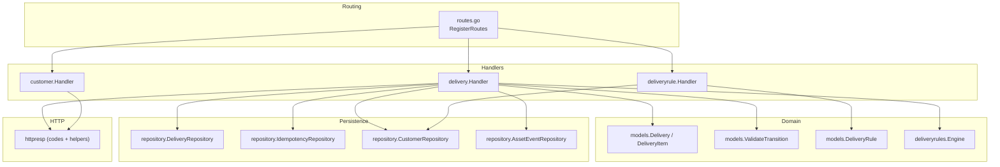
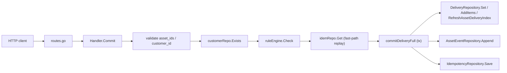
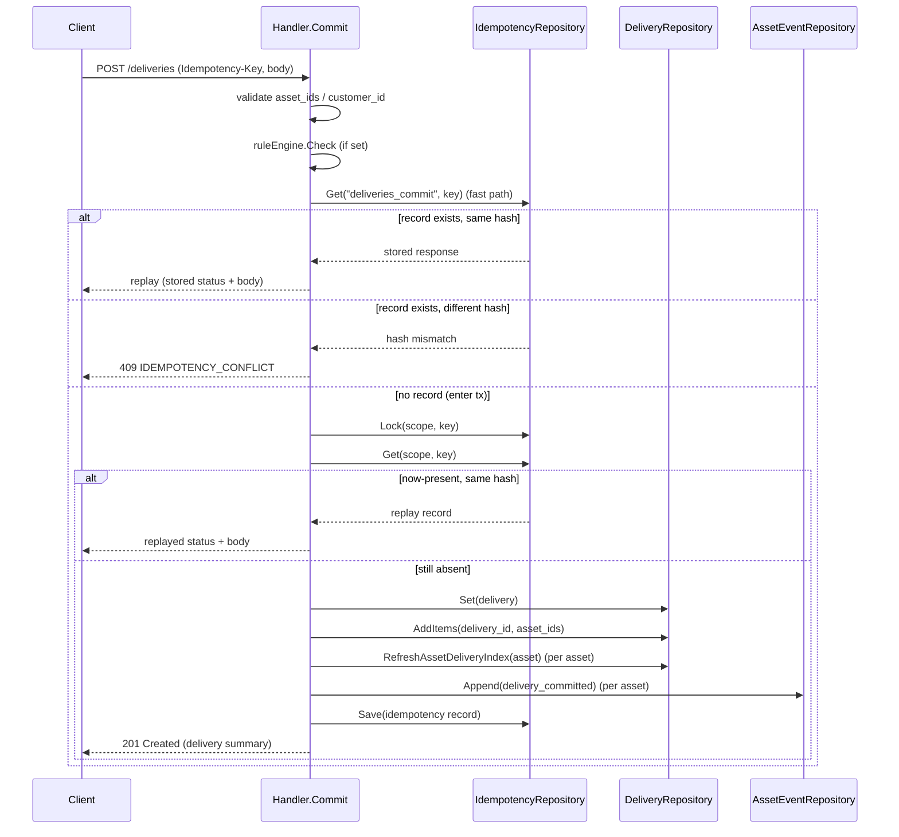
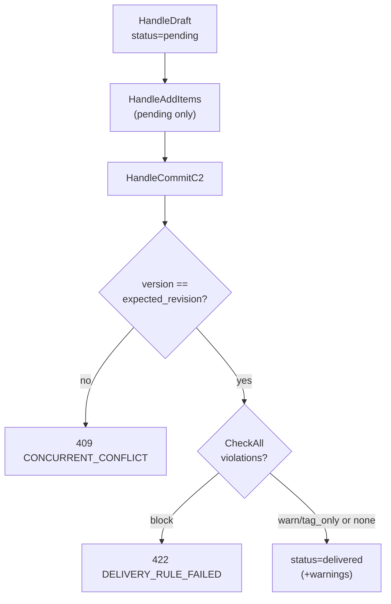
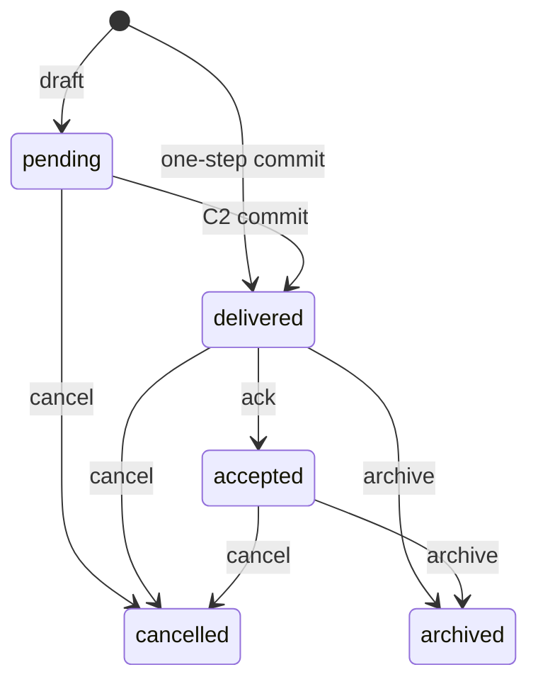
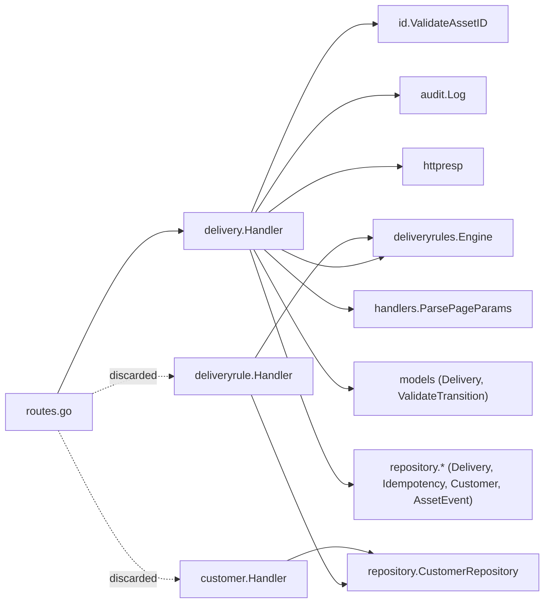

# Deliveries API

<cite>
**Referenced Files in This Document**

- [api/openapi.yaml](file://api/openapi.yaml)
- [backend/routes/routes.go](file://backend/routes/routes.go)
- [backend/internal/handlers/delivery/handler.go](file://backend/internal/handlers/delivery/handler.go)
- [backend/internal/handlers/delivery/errors.go](file://backend/internal/handlers/delivery/errors.go)
- [backend/internal/handlers/deliveryrule/handler.go](file://backend/internal/handlers/deliveryrule/handler.go)
- [backend/internal/handlers/customer/handler.go](file://backend/internal/handlers/customer/handler.go)
- [backend/internal/models/asset.go](file://backend/internal/models/asset.go)
- [backend/internal/models/delivery_transition.go](file://backend/internal/models/delivery_transition.go)
- [backend/internal/models/delivery_rule.go](file://backend/internal/models/delivery_rule.go)
- [backend/internal/httpresp/codes.go](file://backend/internal/httpresp/codes.go)
</cite>

## Table of Contents
1. [Introduction](#introduction)
2. [Project Structure](#project-structure)
3. [Core Components](#core-components)
4. [Architecture Overview](#architecture-overview)
5. [Detailed Component Analysis](#detailed-component-analysis)
6. [Dependency Analysis](#dependency-analysis)
7. [Performance Considerations](#performance-considerations)
8. [Troubleshooting Guide](#troubleshooting-guide)
9. [Conclusion](#conclusion)
10. [Appendices](#appendices)

## Introduction

The Deliveries API is the surface through which cyber-databrew packages a set of
assets, gates them against per-customer compliance rules, and hands them off to a
business partner ("customer"). It spans three related handler packages:

- **`delivery`** — the delivery lifecycle: a single-step idempotent commit, a
  two-step "C2" draft → add-items → commit workflow, cancel/retry/ack operations,
  and the read endpoints (list, detail, items, customer-scoped listing).
- **`deliveryrule`** — CRUD for the declarative compliance gates (delivery rules)
  that the commit path evaluates before a delivery is allowed to proceed.
- **`customer`** — CRUD for the customer/business-partner references that
  deliveries and rules are scoped to.

A central design concern is **exactly-once commit semantics**: the single-step
`POST /deliveries` path requires an `Idempotency-Key` header and folds the
idempotency record into the same database transaction as the delivery writes, so
a retried request after a partial failure never produces a duplicate delivery.

> **Wiring note — read this before using the spec as a contract.** The OpenAPI
> document (`api/openapi.yaml`) describes the *intended* full surface, but only a
> subset of those endpoints is actually mounted in `backend/routes/routes.go`
> today. The C2 workflow (`draft`, add-items, C2 `commit`), the `cancel` /
> `retry` / `ack` operations, **all** delivery-rule endpoints, and **all**
> customer CRUD endpoints have handler implementations but **no route
> registration**. The router file explicitly discards `customerHandler` and
> `deliveryRuleHandler` with a comment that "routes are registered in follow-up
> PRs". The [Mounted vs. unmounted endpoints](#mounted-vs-unmounted-endpoints)
> table is the authoritative list of what is live. Each unmounted endpoint is
> flagged inline below.

**Section sources**
- [backend/routes/routes.go](file://backend/routes/routes.go#L69-L72)
- [backend/routes/routes.go](file://backend/routes/routes.go#L233-L237)
- [backend/internal/handlers/delivery/handler.go](file://backend/internal/handlers/delivery/handler.go#L1-L58)
- [api/openapi.yaml](file://api/openapi.yaml#L29-L33)

## Project Structure

The delivery surface is split across handler packages, the shared response/code
helpers, the domain models, and the route registration that ties handlers to
HTTP paths.

**Diagram sources**
- [backend/routes/routes.go](file://backend/routes/routes.go#L233-L237)
- [backend/internal/handlers/delivery/handler.go](file://backend/internal/handlers/delivery/handler.go#L26-L63)
- [backend/internal/handlers/deliveryrule/handler.go](file://backend/internal/handlers/deliveryrule/handler.go#L16-L23)
- [backend/internal/handlers/customer/handler.go](file://backend/internal/handlers/customer/handler.go#L24-L30)

Relevant files:

- `backend/internal/handlers/delivery/handler.go` — the `Handler` type and every
  delivery endpoint, plus the transactional commit helpers.
- `backend/internal/handlers/delivery/errors.go` — `writeDeliveryError`, which
  maps repository errors (currently the optimistic-lock error) to HTTP responses.
- `backend/internal/handlers/deliveryrule/handler.go` — delivery-rule create/list.
- `backend/internal/handlers/customer/handler.go` — customer create/get/update/list
  and `customer_id` validation.
- `backend/internal/models/asset.go` — the `Delivery` and `DeliveryItem` structs
  and the `DeliveryStatus` enum.
- `backend/internal/models/delivery_transition.go` — the legal status-transition
  table used by cancel/ack.
- `backend/internal/models/delivery_rule.go` — the `DeliveryRule` struct.
- `backend/internal/httpresp/codes.go` — the canonical error-code strings.

**Section sources**
- [backend/internal/handlers/delivery/handler.go](file://backend/internal/handlers/delivery/handler.go#L1-L58)
- [backend/internal/handlers/deliveryrule/handler.go](file://backend/internal/handlers/deliveryrule/handler.go#L1-L23)
- [backend/internal/handlers/customer/handler.go](file://backend/internal/handlers/customer/handler.go#L1-L38)
- [backend/internal/models/asset.go](file://backend/internal/models/asset.go#L222-L268)

## Core Components

### delivery.Handler

`delivery.Handler` aggregates four repositories and the optional rule engine:

- `repo repository.DeliveryRepository` — delivery + item persistence.
- `idemRepo repository.IdempotencyRepository` — idempotency records.
- `customerRepo repository.CustomerRepository` — customer existence checks.
- `eventRepo repository.AssetEventRepository` — per-asset `delivery_committed`
  events (optional; the constructor takes it variadically).
- `ruleEngine *deliveryrules.Engine` — set separately via `SetRuleEngine`; when
  `nil`, the compliance gate is skipped.

Two transaction helpers underpin all writes: `withTx` runs `fn` inside a
transaction when the repository implements `repository.TxRunner` and otherwise
runs it directly, while `withTxRequired` returns an error if the repository does
not support transactions.

**Section sources**
- [backend/internal/handlers/delivery/handler.go](file://backend/internal/handlers/delivery/handler.go#L26-L63)

### Transactional commit helpers

Four private helpers centralize the multi-write commit paths so that either all
writes land or none do:

- `createDeliveryWithItems` — `Set` + `AddItems` (used by draft and retry).
- `commitDeliveryFull` — the single-step commit: idempotency `Lock` + recheck +
  `Set` + `AddItems` + `RefreshAssetDeliveryIndex` (per asset) + events +
  idempotency `Save`, all in one transaction.
- `commitC2Full` — the C2 commit: `Update` (with optimistic-lock revision) +
  index refresh + events.
- `commitDeliveryIndexesAndEvents` — index refresh + events only.

**Section sources**
- [backend/internal/handlers/delivery/handler.go](file://backend/internal/handlers/delivery/handler.go#L95-L186)

### Domain models and the status machine

`models.Delivery` carries the lifecycle (`Status`), counters (`AssetCount`,
`ItemCount`), optimistic-lock `Version`, and the timestamps/actors for each
operation (`DeliveredAt`, `CancelledBy`, `AcknowledgedAt`, …). `models.DeliveryItem`
is a thin `{delivery_id, asset_id, created_at}` row. `models.ValidateTransition`
enforces the legal status graph (see
[Delivery status machine](#cancel-retry-and-acknowledge)).

**Section sources**
- [backend/internal/models/asset.go](file://backend/internal/models/asset.go#L222-L268)
- [backend/internal/models/delivery_transition.go](file://backend/internal/models/delivery_transition.go#L8-L39)

## Architecture Overview

A delivery request flows from the router into a handler method, which validates
input, checks customer existence, runs the rule engine, and finally drives a
transactional commit helper that touches the delivery repository, the
idempotency repository, and the event repository.

**Diagram sources**
- [backend/internal/handlers/delivery/handler.go](file://backend/internal/handlers/delivery/handler.go#L202-L316)
- [backend/internal/handlers/delivery/handler.go](file://backend/internal/handlers/delivery/handler.go#L129-L168)

## Detailed Component Analysis

### Single-step commit and idempotency

`Handler.Commit` (`POST /api/v1/deliveries`) is the live, idempotent commit path.
Its sequence:

1. Bind the body (`asset_ids` required, `min=1`; `customer_id` required;
   `contract_id`, `note`, `owner` optional).
2. Validate each asset ID with `id.ValidateAssetID` (8 alphanumeric chars).
3. Trim `customer_id`; if `customerRepo` is set, require the customer to exist
   (`422 INVALID_ARGUMENT` "customer not found" otherwise).
4. If a rule engine is set, run `ruleEngine.Check`; any violations yield
   `422 DELIVERY_RULE_FAILED` with a `violations` detail.
5. Require the `Idempotency-Key` header (`400 MISSING_IDEMPOTENCY_KEY`).
6. Compute a SHA-256 hash of the request and consult `idemRepo.Get` on scope
   `deliveries_commit`. On a fast-path hit with the **same** hash, replay the
   stored response and status; on a **different** hash, return
   `409 IDEMPOTENCY_CONFLICT`.
7. De-duplicate asset IDs, build the `models.Delivery` (status `delivered`,
   `delivered_at`/`completed_at` = now), and call `commitDeliveryFull`.

`commitDeliveryFull` re-checks idempotency **inside** the transaction: it
`Lock`s the key, `Get`s it again, and if a record already exists with a matching
hash returns it as a `replay` (mismatched hash → `ErrIdempotencyConflict`).
Otherwise it performs `Set`, `AddItems`, a per-asset `RefreshAssetDeliveryIndex`,
appends `delivery_committed` events, and `Save`s the idempotency record — all in
the same transaction. The handler returns `201 Created` for a fresh commit, or
the replayed status/body when `replay != nil`.

**Diagram sources**
- [backend/internal/handlers/delivery/handler.go](file://backend/internal/handlers/delivery/handler.go#L202-L316)
- [backend/internal/handlers/delivery/handler.go](file://backend/internal/handlers/delivery/handler.go#L129-L168)

**Section sources**
- [backend/internal/handlers/delivery/handler.go](file://backend/internal/handlers/delivery/handler.go#L188-L316)

### Read endpoints: list, detail, items, customer-scoped

`Handler.List` (`GET /api/v1/deliveries`) parses `page`/`page_size` via
`handlers.ParsePageParams` and accepts `status` and `customer_id` filters; it
returns `{items, total, page, page_size}`, normalizing a `nil` slice to `[]`.

`Handler.Get` (`GET /api/v1/deliveries/:id`) requires `:id` to be a valid UUID
(`400 INVALID_ARGUMENT` otherwise), and returns `404 DELIVERY_NOT_FOUND` when
the row is absent.

`Handler.ListItems` (`GET /api/v1/deliveries/:id/items`) first loads the delivery
(404 if missing), then returns its items as `{items}`.

`Handler.ListByCustomer` (`GET /api/v1/customers/:customer_id/deliveries`)
fetches all delivery IDs for the customer via `repo.ListByCustomer`, then
applies in-memory pagination with `paginateIDs`, returning
`{delivery_ids, total, page, page_size, next_token}`. The `next_token` is simply
the next page number (as a string) when more pages remain.

**Section sources**
- [backend/internal/handlers/delivery/handler.go](file://backend/internal/handlers/delivery/handler.go#L318-L408)
- [backend/internal/handlers/delivery/handler.go](file://backend/internal/handlers/delivery/handler.go#L902-L919)

### C2 two-step workflow (draft → add items → commit)

> **Unmounted.** `HandleDraft`, `HandleAddItems`, and `HandleCommitC2` exist but
> are **not** registered in `routes.go`. The OpenAPI spec documents them at
> `/deliveries/draft`, `/deliveries/{id}/items` (POST), and `/deliveries/{id}/commit`.

`HandleDraft` creates a delivery in `pending` status **without** running the rule
engine. It validates `customer_id` (existence-checked when `customerRepo` is set)
and any provided `asset_ids`, derives `RequestedBy` from `owner` or the
`X-Request-ID` header, and persists via `createDeliveryWithItems`.

`HandleAddItems` batch-adds asset items to a `pending` delivery only
(`422 INVALID_STATE` otherwise). Inside a required transaction it calls
`AddItems`, re-counts items, and `Update`s the delivery with its current
`Version` (optimistic lock).

`HandleCommitC2` commits a `pending` delivery. It checks status (`422
INVALID_STATE`), checks `expected_revision` against the current `Version`
(`409 CONCURRENT_CONFLICT` on mismatch), collects asset IDs from the items, and
re-runs the rule engine with `CheckAll`. Enforcement is per-violation: if any
violation has `enforce_mode == "block"` it returns `422 DELIVERY_RULE_FAILED`;
otherwise (`warn` / `tag_only`) it commits and returns the violations as
`warnings`. The commit sets status `delivered` and runs `commitC2Full`.

**Diagram sources**
- [backend/internal/handlers/delivery/handler.go](file://backend/internal/handlers/delivery/handler.go#L415-L663)

**Section sources**
- [backend/internal/handlers/delivery/handler.go](file://backend/internal/handlers/delivery/handler.go#L410-L663)

### Cancel, retry, and acknowledge

> **Unmounted.** `HandleCancel`, `HandleRetry`, and `HandleAck` are implemented
> but **not** wired in `routes.go`. The OpenAPI spec documents them at
> `/deliveries/{id}/cancel`, `/deliveries/{id}/retry`, and `/deliveries/{id}/ack`.

`HandleCancel` requires `cancelled_by`, allows cancelling from `pending`,
`delivered`, or `accepted`, validates the transition with `ValidateTransition`,
and refreshes the asset-delivery index for every item when the previous status
was not `pending`. `HandleRetry` clones the items of a `failed` or `cancelled`
delivery into a new `pending` delivery and records the `original_delivery` for
traceability. `HandleAck` moves a `delivered` delivery to `accepted`, requiring
`acknowledged_by` and a legal transition.

The legal status graph enforced by `models.ValidateTransition`:

**Diagram sources**
- [backend/internal/models/delivery_transition.go](file://backend/internal/models/delivery_transition.go#L8-L26)

**Section sources**
- [backend/internal/handlers/delivery/handler.go](file://backend/internal/handlers/delivery/handler.go#L665-L900)
- [backend/internal/models/delivery_transition.go](file://backend/internal/models/delivery_transition.go#L1-L39)

### Delivery rules

> **Unmounted.** `deliveryrule.Handler` (`Create`, `List`) is implemented but
> **not** wired; `routes.go` discards `deliveryRuleHandler`. OpenAPI documents
> `POST`/`GET /delivery-rules`.

`Create` (`POST /api/v1/delivery-rules`) binds `name`, `owner`, and `query_dsl`
(all required), validates the DSL via `deliveryrules.ParseQueryDSL`, optionally
existence-checks `customer_id`, defaults `is_active` to `true`, and inserts a
`models.DeliveryRule`. `List` (`GET /api/v1/delivery-rules?customer_id=`) returns
`{items}` filtered by optional `customer_id`.

**Section sources**
- [backend/internal/handlers/deliveryrule/handler.go](file://backend/internal/handlers/deliveryrule/handler.go#L25-L90)
- [backend/internal/models/delivery_rule.go](file://backend/internal/models/delivery_rule.go#L9-L22)

### Customers

> **Unmounted.** `customer.Handler` (`Create`, `Get`, `Update`, `List`) is
> implemented but **not** wired; `routes.go` discards `customerHandler`. OpenAPI
> documents `/customers` (POST/GET) and `/customers/{customer_id}` (GET/PATCH).

`customer_id` must match `^[a-z][a-z0-9_-]{2,31}$` (`ValidateCustomerID`).
`Create` defaults `status` to `active` and `sla_tier` to `standard`, and maps a
duplicate ID to `409 INVALID_ARGUMENT` "customer_id already exists". `Update`
patches only the provided fields and maps the optimistic-lock error to
`409 CONCURRENT_CONFLICT`. `List` uses **cursor** pagination (`limit` default 50,
max 200; `cursor` = the `customer_id` to start after) and returns
`{items, limit, next_cursor}`. Note that the handler's `List` differs from the
OpenAPI spec, which documents `page`/`page_size` for `GET /customers`.

**Section sources**
- [backend/internal/handlers/customer/handler.go](file://backend/internal/handlers/customer/handler.go#L32-L264)

### Error mapping

`writeDeliveryError` recognizes `repository.ErrOptimisticLock` and returns
`409 CONCURRENT_CONFLICT`; for any other error it returns `false` so the caller
responds `500 INTERNAL_ERROR`. The C2/cancel/ack/add-items paths use this helper
on their `Update` calls.

**Section sources**
- [backend/internal/handlers/delivery/errors.go](file://backend/internal/handlers/delivery/errors.go#L15-L25)

## Dependency Analysis

The delivery handler depends on the rule engine (compliance gate), the asset-ID
validator, the audit logger, the shared HTTP helpers, the page-param parser, the
domain models, and four repositories. The rule handler depends on the rule
repository plus the customer repository (for existence checks). The customer
handler depends only on its repository. The router wires the delivery handler but
intentionally discards the rule and customer handlers (dotted edges).

**Diagram sources**
- [backend/internal/handlers/delivery/handler.go](file://backend/internal/handlers/delivery/handler.go#L1-L63)
- [backend/internal/handlers/deliveryrule/handler.go](file://backend/internal/handlers/deliveryrule/handler.go#L1-L23)
- [backend/routes/routes.go](file://backend/routes/routes.go#L69-L72)

**Section sources**
- [backend/internal/handlers/delivery/handler.go](file://backend/internal/handlers/delivery/handler.go#L1-L63)
- [backend/routes/routes.go](file://backend/routes/routes.go#L233-L237)

## Performance Considerations

- **Per-asset fan-out inside the commit transaction.** `commitDeliveryFull`,
  `commitC2Full`, and `commitDeliveryIndexesAndEvents` each loop over every asset
  ID calling `RefreshAssetDeliveryIndex` and `Append`. A large `asset_ids` list
  therefore widens the transaction and lengthens lock hold time; very large
  deliveries should be sized with this in mind.
- **De-duplication.** `uniqueAssetIDs` collapses duplicate IDs before counting
  and writing, so `asset_count` reflects distinct assets and duplicate work is
  avoided.
- **Idempotency double-check.** The fast-path `idemRepo.Get` before the
  transaction avoids opening a transaction for obvious replays; the in-transaction
  `Lock` + `Get` closes the race window for concurrent first-time requests.
- **In-memory customer pagination.** `ListByCustomer` fetches *all* delivery IDs
  for a customer and paginates them in memory via `paginateIDs`. For customers
  with very large delivery histories this is an O(N) fetch regardless of page
  size; the cursor-based customer `List` (in the customer handler) is the more
  scalable pattern but is unmounted.
- **Page params.** Deliveries list uses page/page_size (`handlers.ParsePageParams`);
  customer list uses cursor pagination with `limit` capped at 200.

**Section sources**
- [backend/internal/handlers/delivery/handler.go](file://backend/internal/handlers/delivery/handler.go#L112-L168)
- [backend/internal/handlers/delivery/handler.go](file://backend/internal/handlers/delivery/handler.go#L388-L408)
- [backend/internal/handlers/delivery/handler.go](file://backend/internal/handlers/delivery/handler.go#L902-L941)

## Troubleshooting Guide

- **`400 MISSING_IDEMPOTENCY_KEY`** — the commit call omitted the
  `Idempotency-Key` header. Always send a stable key per logical commit.
- **`409 IDEMPOTENCY_CONFLICT`** — the same idempotency key was reused with a
  *different* request payload. The body hash (SHA-256 of the bound request)
  must match the original. Either reuse the exact same payload (to replay) or
  use a new key.
- **`422 INVALID_ARGUMENT` "customer not found"** — `customer_id` does not exist
  in the customer store (checked only when `customerRepo` is configured).
- **`422 DELIVERY_RULE_FAILED`** — one or more assets failed a delivery rule.
  The `violations` detail enumerates them. On the C2 path, only `block`-mode
  violations fail the commit; `warn`/`tag_only` violations surface as `warnings`.
- **`400 INVALID_ARGUMENT` "invalid delivery_id"** — `:id` was not a valid UUID
  on Get/ListItems/AddItems/CommitC2/Cancel/Retry/Ack.
- **`409 CONCURRENT_CONFLICT`** — optimistic-lock failure (`ErrOptimisticLock`)
  or, on C2 commit, an `expected_revision` that does not match the stored
  `Version`. Re-read the delivery and retry with the fresh version.
- **`422 INVALID_STATE` / `INVALID_STATE_TRANSITION`** — the operation is not
  allowed from the delivery's current status (e.g. adding items to a non-pending
  delivery, or an illegal status transition rejected by `ValidateTransition`).
- **`404` on a documented endpoint** — verify the endpoint is actually mounted.
  Rule, customer, C2, cancel/retry/ack routes are documented in OpenAPI but not
  registered in `routes.go`.

**Section sources**
- [backend/internal/handlers/delivery/handler.go](file://backend/internal/handlers/delivery/handler.go#L210-L308)
- [backend/internal/handlers/delivery/handler.go](file://backend/internal/handlers/delivery/handler.go#L515-L589)
- [backend/internal/handlers/delivery/errors.go](file://backend/internal/handlers/delivery/errors.go#L15-L25)
- [backend/internal/httpresp/codes.go](file://backend/internal/httpresp/codes.go#L19-L34)

## Conclusion

The Deliveries API centers on an idempotent single-step commit with a
transaction that folds together delivery writes, per-asset index refresh,
event emission, and the idempotency record. A richer C2 two-step workflow,
lifecycle operations (cancel/retry/ack), delivery-rule CRUD, and customer CRUD
are all implemented in handler code and described in the OpenAPI spec, but only
five delivery read/commit endpoints are currently mounted in the router. When
treating the OpenAPI document as a contract, cross-check the
[Mounted vs. unmounted endpoints](#mounted-vs-unmounted-endpoints) table.

## Appendices

### Mounted vs. unmounted endpoints

The router registers exactly these delivery endpoints (lines 233–237 of
`routes.go`). Everything else in this section is documented in OpenAPI but **not
wired**.

| Method | Path | Handler | Mounted? |
| --- | --- | --- | --- |
| POST | `/api/v1/deliveries` | `delivery.Commit` | yes |
| GET | `/api/v1/deliveries` | `delivery.List` | yes |
| GET | `/api/v1/deliveries/:id` | `delivery.Get` | yes |
| GET | `/api/v1/deliveries/:id/items` | `delivery.ListItems` | yes |
| GET | `/api/v1/customers/:customer_id/deliveries` | `delivery.ListByCustomer` | yes |
| POST | `/api/v1/deliveries/draft` | `delivery.HandleDraft` | no (handler exists) |
| POST | `/api/v1/deliveries/:id/items` | `delivery.HandleAddItems` | no (handler exists) |
| POST | `/api/v1/deliveries/:id/commit` | `delivery.HandleCommitC2` | no (handler exists) |
| POST | `/api/v1/deliveries/:id/cancel` | `delivery.HandleCancel` | no (handler exists) |
| POST | `/api/v1/deliveries/:id/retry` | `delivery.HandleRetry` | no (handler exists) |
| POST | `/api/v1/deliveries/:id/ack` | `delivery.HandleAck` | no (handler exists) |
| POST | `/api/v1/delivery-rules` | `deliveryrule.Create` | no (handler exists) |
| GET | `/api/v1/delivery-rules` | `deliveryrule.List` | no (handler exists) |
| POST | `/api/v1/customers` | `customer.Create` | no (handler exists) |
| GET | `/api/v1/customers` | `customer.List` | no (handler exists) |
| GET | `/api/v1/customers/:customer_id` | `customer.Get` | no (handler exists) |
| PATCH | `/api/v1/customers/:customer_id` | `customer.Update` | no (handler exists) |

**Section sources**
- [backend/routes/routes.go](file://backend/routes/routes.go#L233-L237)
- [backend/routes/routes.go](file://backend/routes/routes.go#L69-L72)
- [api/openapi.yaml](file://api/openapi.yaml#L2746-L3035)

### Request/response shapes

**`POST /deliveries` request** (`DeliveryCommitRequest`):

| Field | Type | Required | Notes |
| --- | --- | --- | --- |
| `asset_ids` | string[] | yes | `min=1`; each must be 8 alphanumeric chars |
| `customer_id` | string | yes | must exist when `customerRepo` is set |
| `contract_id` | string | no | |
| `note` | string | no | |
| `owner` | string | no | |

Header: `Idempotency-Key` (required), `X-Request-ID` (optional; recorded on events).

**`POST /deliveries` response** (`201`):
`{delivery_id, customer_id, asset_count, delivered_at, status}`.

**`GET /deliveries` response** (`DeliveryListResponse`):
`{items: Delivery[], total, page, page_size}`.

**`GET /deliveries/:id/items` response** (`DeliveryItemsResponse`):
`{items: DeliveryItem[]}`.

**`GET /customers/:customer_id/deliveries` response**:
`{delivery_ids: string[], total, page, page_size, next_token}`.

**Section sources**
- [api/openapi.yaml](file://api/openapi.yaml#L919-L978)
- [backend/internal/handlers/delivery/handler.go](file://backend/internal/handlers/delivery/handler.go#L202-L408)

### DeliveryStatus enum

| Value | Constant |
| --- | --- |
| `pending` | `DeliveryStatusPending` |
| `delivered` | `DeliveryStatusDelivered` |
| `failed` | `DeliveryStatusFailed` |
| `accepted` | `DeliveryStatusAccepted` |
| `rejected` | `DeliveryStatusRejected` |
| `recalled` | `DeliveryStatusRecalled` |
| `cancelled` | `DeliveryStatusCancelled` |
| `archived` | `DeliveryStatusArchived` |

**Section sources**
- [backend/internal/models/asset.go](file://backend/internal/models/asset.go#L27-L38)

### Error codes used by this area

| HTTP | Code | When |
| --- | --- | --- |
| 400 | `INVALID_ARGUMENT` | bad body, bad asset ID, non-UUID id, missing required field |
| 400 | `MISSING_IDEMPOTENCY_KEY` | commit without `Idempotency-Key` |
| 404 | `DELIVERY_NOT_FOUND` | delivery row absent |
| 404 | `CUSTOMER_NOT_FOUND` | customer get/update target absent |
| 409 | `IDEMPOTENCY_CONFLICT` | same key, different payload |
| 409 | `CONCURRENT_CONFLICT` | optimistic-lock / revision mismatch |
| 422 | `INVALID_ARGUMENT` | customer not found (commit/draft/rule) |
| 422 | `INVALID_STATE` | operation not allowed from current status |
| 422 | `INVALID_STATE_TRANSITION` | illegal status transition |
| 422 | `DELIVERY_RULE_FAILED` | rule-engine violations (block mode) |
| 500 | `INTERNAL_ERROR` | unrecognized repository error |

**Section sources**
- [backend/internal/httpresp/codes.go](file://backend/internal/httpresp/codes.go#L5-L35)
- [backend/internal/handlers/delivery/handler.go](file://backend/internal/handlers/delivery/handler.go#L210-L308)
- [backend/internal/handlers/customer/handler.go](file://backend/internal/handlers/customer/handler.go#L92-L211)
