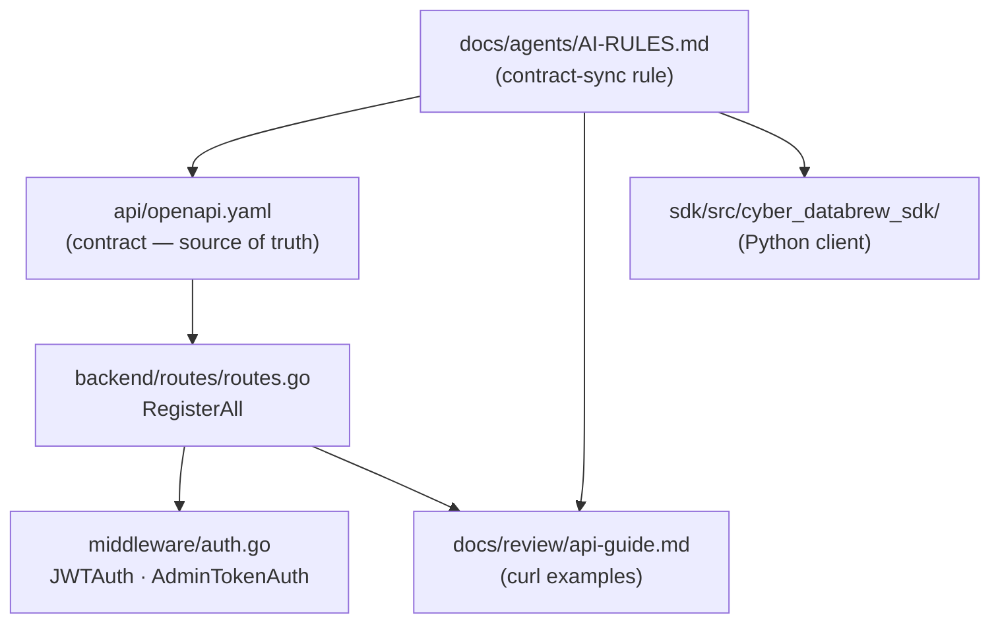
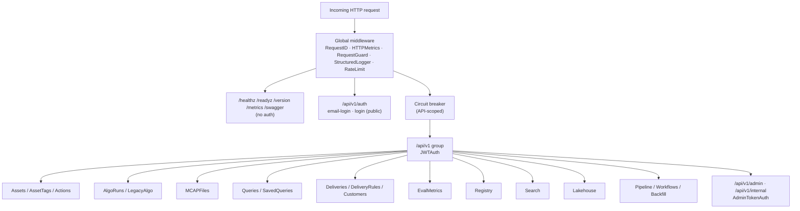
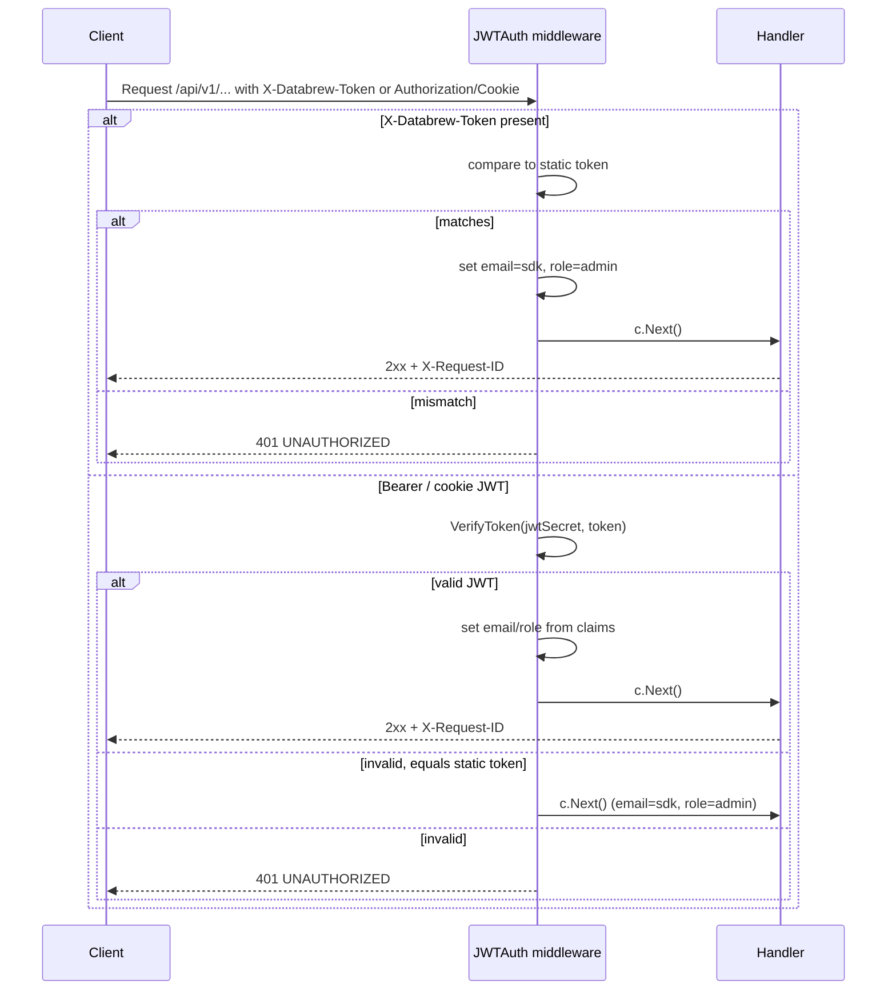
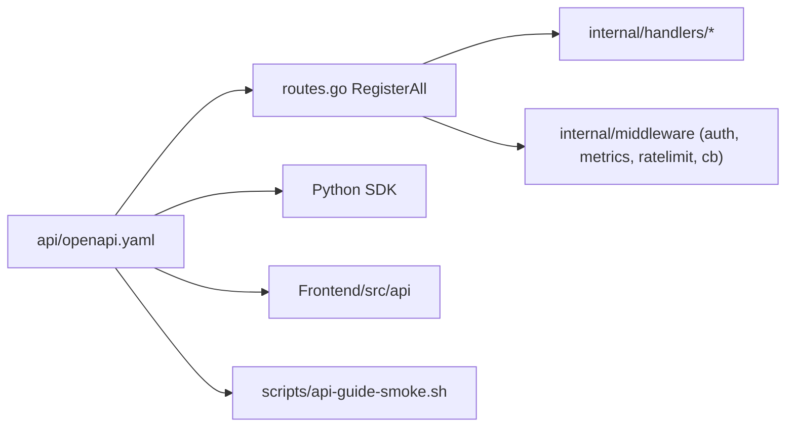

# Backend API Reference

<cite>
**Referenced Files in This Document**

- [api/openapi.yaml](file://api/openapi.yaml)
- [backend/routes/routes.go](file://backend/routes/routes.go)
- [backend/internal/middleware/auth.go](file://backend/internal/middleware/auth.go)
- [docs/review/api-guide.md](file://docs/review/api-guide.md)
- [docs/agents/AI-RULES.md](file://docs/agents/AI-RULES.md)
</cite>

## Table of Contents
1. [Introduction](#introduction)
2. [Project Structure](#project-structure)
3. [Core Components](#core-components)
4. [Architecture Overview](#architecture-overview)
5. [Detailed Component Analysis](#detailed-component-analysis)
6. [Dependency Analysis](#dependency-analysis)
7. [Performance Considerations](#performance-considerations)
8. [Troubleshooting Guide](#troubleshooting-guide)
9. [Conclusion](#conclusion)
10. [Appendices](#appendices)

## Introduction

The cyber-databrew backend exposes a single HTTP/JSON API that fronts the entire
data platform: asset lifecycle, MCAP file management, algorithm execution,
query, delivery, evaluation, lakehouse analytics, audit, search-sync, and
pipeline orchestration. The contract is published as an OpenAPI 3.1 document
(`api/openapi.yaml`, title `cyber-databrew API`, version `0.2.0`) and is the
**single source of truth** for request and response shapes; the Go router in
`backend/routes/routes.go` is the runtime that materialises those paths.

This page is the top-level reference for the API surface. It covers the base
URL and versioning scheme, the authentication model (static `X-Databrew-Token`,
`Authorization: Bearer`, and JWT session cookies), the full catalogue of API
families (grouped by OpenAPI tag), the unified error/response envelope, and the
**API-contract-sync rule** that keeps the spec, the docs, the SDK, and the smoke
tests aligned in the same change. Detailed per-family pages drill into the
individual endpoints; this page maps the territory.

The audience is backend engineers wiring new endpoints, SDK and frontend
authors consuming the API, and operators reasoning about auth, health, and
admin surfaces.

**Section sources**
- [api/openapi.yaml](file://api/openapi.yaml#L1-L54)
- [backend/routes/routes.go](file://backend/routes/routes.go#L40-L68)
- [docs/review/api-guide.md](file://docs/review/api-guide.md#L50-L73)

## Project Structure

The API is defined and served by three cooperating artifacts plus the supporting
documentation and SDK that must move with it:

- **`api/openapi.yaml`** — the OpenAPI 3.1 contract. The top of the file declares
  `info` (title, version), `servers` (the base URL), the global `security`
  requirement, the `tags` list (one per API family), `components/securitySchemes`
  (`DatabrewToken`, `AdminToken`), shared `parameters`
  (`X-Request-ID`, `Idempotency-Key`), and `components/schemas` (the canonical
  `ErrorResponse`, `Asset`, `AlgoRun`, `Delivery`, etc.). The remainder of the
  file is the `paths` block.
- **`backend/routes/routes.go`** — `RegisterAll` wires every handler group onto a
  `gin.Engine`. It mounts global middleware, the public infrastructure and auth
  routes, and the authenticated `/api/v1` group that carries the bulk of the API.
- **`backend/internal/middleware/auth.go`** — `JWTAuth` and `AdminTokenAuth`
  implement the auth schemes referenced by the OpenAPI `securitySchemes`.
- **`docs/review/api-guide.md`** — narrative usage guide with `curl` examples,
  headers, success and error paths per endpoint family.
- **`docs/agents/AI-RULES.md`** — codifies the API-contract-sync rule that binds
  these artifacts together.



**Diagram sources**
- [api/openapi.yaml](file://api/openapi.yaml#L1-L77)
- [backend/routes/routes.go](file://backend/routes/routes.go#L40-L189)
- [docs/agents/AI-RULES.md](file://docs/agents/AI-RULES.md#L50-L61)

**Section sources**
- [api/openapi.yaml](file://api/openapi.yaml#L1-L77)
- [backend/routes/routes.go](file://backend/routes/routes.go#L1-L38)

## Core Components

### Base URL and versioning

The OpenAPI `servers` block declares one server, `http://localhost:8080`
(`Local development`). All business endpoints live under the path prefix
`/api/v1`; the major version is carried in the URL path rather than a header. The
api-guide documents the same base URL plus the dev HTTPS gateway
`https://api-cyber-databrew-dev.cyberorigin.ai`, which currently requires only
`X-Databrew-Token` with no extra IAP Bearer.

Infrastructure endpoints (`/healthz`, `/readyz`, `/version`, `/metrics`) sit
outside the `/api/v1` prefix and outside authentication.

### Security schemes

Two API-key schemes are declared in `components/securitySchemes`:

| Scheme | Type | Location | Header |
|--------|------|----------|--------|
| `DatabrewToken` | apiKey | header | `X-Databrew-Token` |
| `AdminToken` | apiKey | header | `X-Admin-Token` |

The global `security` requirement is `DatabrewToken: []`, so every endpoint
requires the databrew token unless it overrides `security: []` (the four
infrastructure endpoints and the auth endpoints do).

### Shared headers

Two reusable parameters are defined: `X-Request-ID` (optional request correlation
header, echoed back on every response) and `Idempotency-Key` (required where
declared, e.g. `POST /deliveries`).

### Unified error envelope

Every error response uses the `ErrorResponse` schema — a JSON object with
required fields `code`, `message`, `request_id`, plus an optional free-form
`details` object. The `code` is a stable machine-readable string
(`INVALID_ARGUMENT`, `ASSET_NOT_FOUND`, `CONCURRENT_CONFLICT`, …); `request_id`
matches the `X-Request-ID` response header for log correlation.

**Section sources**
- [api/openapi.yaml](file://api/openapi.yaml#L5-L9)
- [api/openapi.yaml](file://api/openapi.yaml#L55-L87)
- [docs/review/api-guide.md](file://docs/review/api-guide.md#L50-L97)

## Architecture Overview

`RegisterAll` constructs the route tree in layers. Global middleware
(`RequestID`, `HTTPMetrics`, `RequestGuard(2048)`, `StructuredLogger`, optional
rate limiting) runs for every request. A circuit breaker, when enabled, is scoped
to the `/api/v1` group only so that infrastructure endpoints stay reachable when
the breaker is open. Public routes (infrastructure + auth) are registered first;
then the authenticated `api := r.Group("/api/v1", middleware.JWTAuth(...))` group
carries all business families. Admin and internal sub-groups apply
`AdminTokenAuth` on top of the API group and are only mounted when
`AdminRoutesEnabled()` is true.



**Diagram sources**
- [backend/routes/routes.go](file://backend/routes/routes.go#L74-L189)
- [backend/routes/routes.go](file://backend/routes/routes.go#L267-L285)

**Section sources**
- [backend/routes/routes.go](file://backend/routes/routes.go#L74-L373)

## Detailed Component Analysis

### API families (OpenAPI tags)

The OpenAPI `tags` list enumerates 21 API families. Each is a logical domain with
its own detailed wiki page. The endpoint counts below are the routes actually
registered in `RegisterAll`; some families are gated on a non-nil handler or on
`AdminRoutesEnabled()`.

| Tag (family) | Purpose | Representative endpoints | Registered routes |
|--------------|---------|--------------------------|-------------------|
| Infrastructure | Health, readiness, metrics, version, swagger | `GET /healthz`, `/readyz`, `/version`, `/metrics`, `/swagger/*any` | 5 |
| Auth | Token/email login, session cookies | `POST /auth/email-login`, `/auth/login`, `GET /auth/me`, `POST /auth/logout` | 4 |
| Assets | Asset CRUD, lifecycle, locator, events, lineage, timeline, child-asset creation | `POST/GET/PATCH/DELETE /assets[/:id]`, `/assets:batch_get`, `/assets/:id/mcap-locator`, `/assets/:id/lineage` | ~13 + batch + global events |
| AssetTypes | Asset-type metadata JSON Schemas | `GET /asset-types/{type}/schema` | (documented) |
| AssetTags | Multi-source tag upsert/delete/history | `POST /assets/:id/tags`, `DELETE /assets/:id/tags/:key`, `GET /assets/:id/tags/history` | 3 |
| ActionAnnotations | Time-bounded annotations on segment assets | `POST/GET /assets/:id/actions`, `PATCH/DELETE /assets/:id/actions/:action_id` | 4 |
| AlgoRuns | First-class algorithm execution events | `POST/GET /algo-runs`, `/algo-runs/:run_id[/start\|finish\|cancel\|affected-assets]` | 7 |
| LegacyAlgo | Deprecated per-asset algo lifecycle | `GET /assets/:id/algo`, `POST .../algo/:algo_key/[start\|finish\|reset]` | 4 |
| Queries | Query IR validate + run | `POST /queries/validate`, `POST /queries/run` | 2 |
| SavedQueries | Saved query CRUD | `GET/POST /saved-queries`, `GET/PATCH/DELETE /saved-queries/:id` | 5 |
| Customers | Customer/business partner references | `GET /customers/:customer_id/deliveries` (+ CRUD per OpenAPI) | 1 wired here |
| Deliveries | Delivery workflows (commit, list, items) | `POST/GET /deliveries`, `/deliveries/:id`, `/deliveries/:id/items` | 4 |
| DeliveryRules | Pre-delivery compliance gate rules | (DeliveryRule CRUD per OpenAPI) | gated |
| MCAPFiles | MCAP metadata + upload management | `POST/GET /mcap-files`, `/mcap-files/:id`, `/mcap-files/:id/bytes`, `POST /mcap/upload/finalize`, `GET /mcap/:id/messages` | 7 |
| EvalMetrics | Eval results + metric registry/search | `POST/GET /assets/:id/eval-results`, `/assets/:id/metrics`, `GET /metrics/registry`, `POST /metrics:search` | 5 |
| Registry | Read-only reference data | `GET /algo-registry`, `/tag-registry`, `/metric-registry`, `/action-label-registry`, `/lifecycle-states` | 5 |
| Search | Elasticsearch sync status/progress | `GET /search/sync-status`, `/search/sync-progress` | 2 |
| Lakehouse | Data lakehouse reports + sync status | `GET /lakehouse/report\|status\|overview\|asset-growth\|tables\|…` | 12 |
| Audit | Audit search + asset lineage | `GET /audit/search`, `/audit/lineage-search` (per OpenAPI/api-guide) | documented |
| Admin | Admin-only ops (reindex, outbox, audit) | `POST /admin/search/reindex`, `GET /admin/search/outbox-stats` | 9 (gated) |
| Internal | Service-to-service endpoints | `DELETE /internal/assets/:id`, `POST /internal/assets:batch_delete`, `POST /internal/commit-segments` | 3 (gated) |
| Pipeline | Pipeline orchestration (Argo Workflows) | `POST/GET /pipelines`, `/deploy`, `/deployments`, `/workflows`, `/backfill`, `/pipeline-components` | ~30 |

Note: counts reflect the registrations visible in `RegisterAll`; the OpenAPI
`paths` block additionally documents endpoints (e.g. AssetTypes schema, full
Customer/DeliveryRule CRUD) whose registration lives in conditional blocks or
follow-up wiring. Treat OpenAPI as the authoritative inventory.

**Section sources**
- [api/openapi.yaml](file://api/openapi.yaml#L10-L54)
- [backend/routes/routes.go](file://backend/routes/routes.go#L193-L373)

### Authentication flow (JWTAuth)

`JWTAuth(staticToken, jwtSecret)` guards the `/api/v1` group. It resolves the
caller's identity through a fixed precedence:

1. **`X-Databrew-Token` header** — the legacy SDK path. The value must equal the
   static token (raw or `Bearer `-prefixed); on match the context is set to
   `email=sdk`, `role=admin`.
2. **`Authorization: Bearer <jwt>`** — verified against the JWT secret; on success
   the context carries the token's `email` and `role` claims.
3. **`databrew_session` cookie** — a JWT issued by `/auth/email-login` or the
   legacy `/auth/login`; verified the same way as the bearer JWT.

If no `X-Databrew-Token` is present and the bearer/cookie value is not a valid
JWT, the middleware falls back to comparing it against the static token before
finally returning `401 UNAUTHORIZED`.



**Diagram sources**
- [backend/internal/middleware/auth.go](file://backend/internal/middleware/auth.go#L41-L97)

**Section sources**
- [backend/internal/middleware/auth.go](file://backend/internal/middleware/auth.go#L13-L97)
- [backend/routes/routes.go](file://backend/routes/routes.go#L107-L192)

### Admin / internal authentication (AdminTokenAuth)

`AdminTokenAuth(adminToken, databrewToken, env)` protects the `/api/v1/admin` and
`/api/v1/internal` sub-groups and the standalone `/internal/commit-segments`
route. When `ADMIN_TOKEN` is unset: in `production` every admin route returns
`403`; in non-production it falls back to static-token auth using the databrew
token. When `ADMIN_TOKEN` is set, the caller must present it via `X-Admin-Token`
(or `Authorization`), raw or `Bearer `-prefixed. These groups are only mounted at
all when `cfg.AdminRoutesEnabled()` is true.

**Section sources**
- [backend/internal/middleware/auth.go](file://backend/internal/middleware/auth.go#L99-L124)
- [backend/routes/routes.go](file://backend/routes/routes.go#L103-L105)
- [backend/routes/routes.go](file://backend/routes/routes.go#L267-L372)

### Login endpoints

Three public auth entry points are registered under `/api/v1/auth`:

- **`POST /auth/email-login`** — accepts `{email}`; validates the domain against
  `cfg.AllowedDomain`, signs a 24h JWT (`role=user`) and writes it to the
  `databrew_session` cookie (`SameSite=Lax`, `HttpOnly`, secure in production).
- **`POST /auth/login`** — legacy static-token login for SDK backward compat;
  accepts `{token}`, compares to `cfg.DatabrewToken`, and on match issues a 24h
  JWT (`role=admin`) into the same cookie.
- **`GET /auth/me`** / **`POST /auth/logout`** — sit behind `JWTAuth`; `me`
  echoes the authenticated `email`/`role`, `logout` clears the session cookie.

**Section sources**
- [backend/routes/routes.go](file://backend/routes/routes.go#L107-L187)
- [api/openapi.yaml](file://api/openapi.yaml#L1908-L1953)

### Response and pagination conventions

List endpoints return an envelope object rather than a bare array. The common
shapes are `{items, total, page, page_size}` (e.g. `AssetListResponse`,
`AlgoRunListResponse`, `CustomerListResponse`, `DeliveryListResponse`,
`McapFileListResponse`) and cursor-style `{items, limit, next_cursor}` for event
streams (`AssetEventListResponse`, `AuditSearchResponse`). Defining the
`{items: [...]}` envelope up front is mandated by the contract-first rule to
avoid backend/frontend shape mismatches.

**Section sources**
- [api/openapi.yaml](file://api/openapi.yaml#L194-L202)
- [api/openapi.yaml](file://api/openapi.yaml#L374-L382)
- [docs/agents/AI-RULES.md](file://docs/agents/AI-RULES.md#L122-L130)

## Dependency Analysis

The API surface depends on the handler packages imported by `routes.go` (asset,
mcap, delivery, customer, deliveryrule, algorun, audit, lakehouse, registry,
search, admin, eval, action, pipeline, pipeline_component, query, workflow,
backfill) and on the auth/config/middleware packages. Each handler is injected
into `RegisterAll` as a constructor parameter, so the router has no direct
dependency on persistence — only on handler interfaces.

Downstream, the contract feeds the Python SDK (`sdk/src/cyber_databrew_sdk/`),
the frontend API layer (`Frontend/src/api/`), and the smoke tests
(`scripts/api-guide-smoke.sh`). The contract-sync rule treats all of these as a
single change unit.



**Diagram sources**
- [backend/routes/routes.go](file://backend/routes/routes.go#L15-L38)
- [backend/routes/routes.go](file://backend/routes/routes.go#L44-L68)

**Section sources**
- [backend/routes/routes.go](file://backend/routes/routes.go#L1-L72)
- [docs/agents/AI-RULES.md](file://docs/agents/AI-RULES.md#L50-L61)

## Performance Considerations

- **Request guard** — `RequestGuard(2048)` caps URL length; over-long URLs return
  `414 URI_TOO_LONG` before reaching a handler.
- **Rate limiting** — disabled by default; `RATE_LIMIT_RPS` / `RATE_LIMIT_BURST`
  enable a token-bucket middleware applied globally.
- **Circuit breaker** — when `CB_ENABLED=true`, a breaker scoped to `/api/v1`
  short-circuits the API after `CB_THRESHOLD` failures in `CB_WINDOW_SEC`,
  cooling down for `CB_COOLDOWN_SEC`. Infrastructure endpoints stay reachable.
- **Pagination** — list endpoints normalise out-of-range `page`/`page_size` to
  server defaults and echo the effective values; event/audit endpoints use
  `next_cursor` (descending `event_seq`) to avoid deep-offset scans.
- **Optimistic concurrency** — asset PATCH and action PATCH use a version CAS;
  conflicts surface as `409 CONCURRENT_CONFLICT` rather than blocking.
- **Streaming** — `GET /assets/:id/events/stream` is SSE; `mcap-files/:id/bytes`
  supports `HEAD` and `Range` reads so large MCAP blobs are not buffered.

**Section sources**
- [backend/routes/routes.go](file://backend/routes/routes.go#L74-L101)
- [docs/review/api-guide.md](file://docs/review/api-guide.md#L713-L716)
- [docs/review/api-guide.md](file://docs/review/api-guide.md#L2168-L2170)

## Troubleshooting Guide

- **`401 UNAUTHORIZED` on `/api/v1/*`** — missing/incorrect `X-Databrew-Token`, an
  expired session cookie, or an invalid JWT. Confirm the token matches the
  deployment's `DATABREW_TOKEN`; on the dev gateway only `X-Databrew-Token` is
  required.
- **`403` on `/api/v1/admin/*` in production** — `ADMIN_TOKEN` is unset; admin
  routes require it in production. Set it and present `X-Admin-Token`.
- **404 on an admin/internal route** — `AdminRoutesEnabled()` is false, so the
  sub-group was never mounted; the route does not exist rather than 401/403.
- **`400 INVALID_ARGUMENT` on IDs** — `asset_id`/`mcap_file_id`/`action_id` must be
  8 alphanumerics, `run_id` 16; copying a malformed ID trips validation.
- **`409 CONCURRENT_CONFLICT`** — a concurrent write bumped the version between
  GET and PATCH; re-fetch and retry.
- **`503` on Lakehouse/Search** — BigQuery/Elasticsearch not configured; in 1.0
  the lakehouse chain is offline and some endpoints return `503` or empty
  `items` with a `note`.
- **Missing `request_id` correlation** — every error carries `request_id` equal
  to the `X-Request-ID` response header; use it to grep structured logs.

**Section sources**
- [backend/internal/middleware/auth.go](file://backend/internal/middleware/auth.go#L99-L124)
- [docs/review/api-guide.md](file://docs/review/api-guide.md#L2156-L2175)
- [docs/review/api-guide.md](file://docs/review/api-guide.md#L107-L190)

## Conclusion

The cyber-databrew API is a versioned (`/api/v1`), token-authenticated JSON
surface spanning 21 families, defined by `api/openapi.yaml` and served by
`RegisterAll` in `backend/routes/routes.go`. Authentication accepts a static
`X-Databrew-Token`, an `Authorization: Bearer` JWT, or a `databrew_session`
cookie, with a separate `X-Admin-Token` scheme for admin/internal routes. Errors
follow one envelope (`code` / `message` / `request_id`). The non-negotiable
operating rule is API-contract-sync: any HTTP change updates the OpenAPI spec,
the api-guide, the SDK/frontend, and the smoke tests in the same PR.

## Appendices

### Appendix A — Security schemes

| Name | Type | In | Header | Used by |
|------|------|----|--------|---------|
| `DatabrewToken` | apiKey | header | `X-Databrew-Token` | global default (all `/api/v1`) |
| `AdminToken` | apiKey | header | `X-Admin-Token` | `/api/v1/admin`, `/api/v1/internal` |

Bearer JWT (`Authorization: Bearer <jwt>`) and the `databrew_session` cookie are
accepted by `JWTAuth` as alternative carriers of the same identity.

**Section sources**
- [api/openapi.yaml](file://api/openapi.yaml#L55-L64)
- [backend/internal/middleware/auth.go](file://backend/internal/middleware/auth.go#L49-L72)

### Appendix B — Error envelope (`ErrorResponse`) and common codes

```jsonc
{ "code": "ASSET_NOT_FOUND", "message": "asset not found", "request_id": "..." }
```

| HTTP | Code | Meaning |
|------|------|---------|
| 400 | `INVALID_ARGUMENT` | Malformed request / bad ID format |
| 400 | `INVALID_FILTER` | Invalid filter expression |
| 400 | `INVALID_ALGO_KEY` | Unknown / malformed algo key |
| 401 | `UNAUTHORIZED` | Authentication failed |
| 404 | `ASSET_NOT_FOUND` | Asset does not exist |
| 404 | `MCAP_FILE_NOT_FOUND` | Underlying MCAP file missing |
| 409 | `ASSET_NOT_PREVIEWABLE` | Lifecycle state does not allow preview |
| 409 | `DUPLICATE_ASSET_ID` | Supplied `asset_id` already exists |
| 409 | `ALGO_ALREADY_RUNNING` | Algorithm already running |
| 409 | `CONCURRENT_CONFLICT` | Optimistic-lock version conflict |
| 414 | `URI_TOO_LONG` | URL exceeds 2048 chars |
| 422 | `INVALID_STATE` | Business state error (e.g. start > end) |
| 422 | `INVALID_TAG` | Tag key unregistered / value invalid |
| 422 | `MISSING_REQUIRED_FIELD` | Algo finish missing required field |
| 422 | `MISSING_REASON` | `status=failed` without `reason` |
| 500 | `INTERNAL_ERROR` | Server-side error |

**Section sources**
- [api/openapi.yaml](file://api/openapi.yaml#L77-L114)
- [docs/review/api-guide.md](file://docs/review/api-guide.md#L2156-L2175)

### Appendix C — API-contract-sync rule (mandatory)

Any new or changed HTTP API — route, handler, request/response body, query/path
param, status code, or auth/idempotency header — MUST sync the following
artifacts in the **same PR** as the `backend/` change (not a follow-up). This is
the AI-RULES "API contract sync" rule; CYB-1014-style gaps (handler shipped,
OpenAPI/api-guide/SDK empty) are treated as process failures.

| # | Artifact | Required when | What to update |
|---|----------|---------------|----------------|
| 1 | `api/openapi.yaml` | Always | paths, schemas, params, request/response bodies, error envelope |
| 2 | `docs/review/api-guide.md` | Always | curl example, headers, success + ≥1 error path, validation notes |
| 3 | `sdk/src/cyber_databrew_sdk/` | New/changed public REST surface | Resource client + exports |
| 4 | `sdk/tests/unit/` | SDK client changed | Unit tests (mock HTTP) |
| 5 | `scripts/api-guide-smoke.sh` or `scripts/smoke-<feature>-dev.sh` | Always | Happy path + one error path per endpoint |
| 6 | `backend/internal/handlers/*/*.go` | Swagger-annotated handlers | `@Summary`/`@Router`/`@Param` consistent (OpenAPI is source of truth) |
| 7 | `openspec/changes/CYB-*/specs/*/spec.md` | Always (runtime feature) | Given/When/Then behavior delta |
| 8 | `Frontend/src/api/` | UI calls the new API | Typed client/hook aligned with OpenAPI |

Verification runs at **Tier L** whenever OpenAPI or public API changes; run the
SDK unit tests if the SDK is touched and a targeted smoke script for the feature.
A backend-only spike that defers SDK/Frontend must still satisfy rows 1, 2, 5, 7.

**Section sources**
- [docs/agents/AI-RULES.md](file://docs/agents/AI-RULES.md#L44-L73)
- [docs/agents/AI-RULES.md](file://docs/agents/AI-RULES.md#L122-L130)

### Appendix D — Infrastructure endpoints (unauthenticated)

| Method | Path | Purpose |
|--------|------|---------|
| GET | `/healthz` | Liveness — returns `{status, service}` |
| GET | `/readyz` | Readiness — PG ping + lakehouse status; `503` when unhealthy |
| GET | `/version` | Build version / commit / time / service |
| GET | `/metrics` | Prometheus metrics |
| GET | `/swagger/*any` | Swagger UI for the generated docs |

**Section sources**
- [backend/routes/routes.go](file://backend/routes/routes.go#L96-L101)
- [backend/routes/routes.go](file://backend/routes/routes.go#L375-L434)
- [api/openapi.yaml](file://api/openapi.yaml#L1832-L1906)
