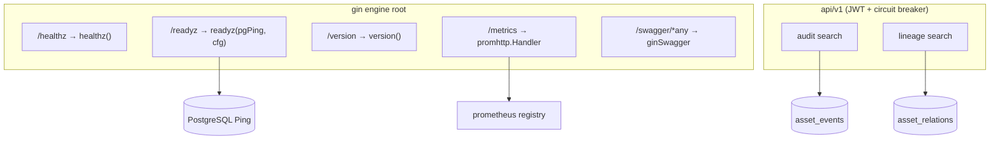
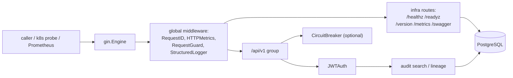
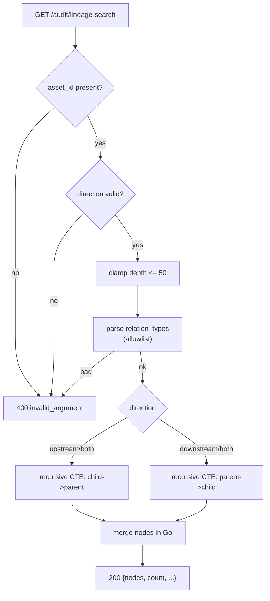
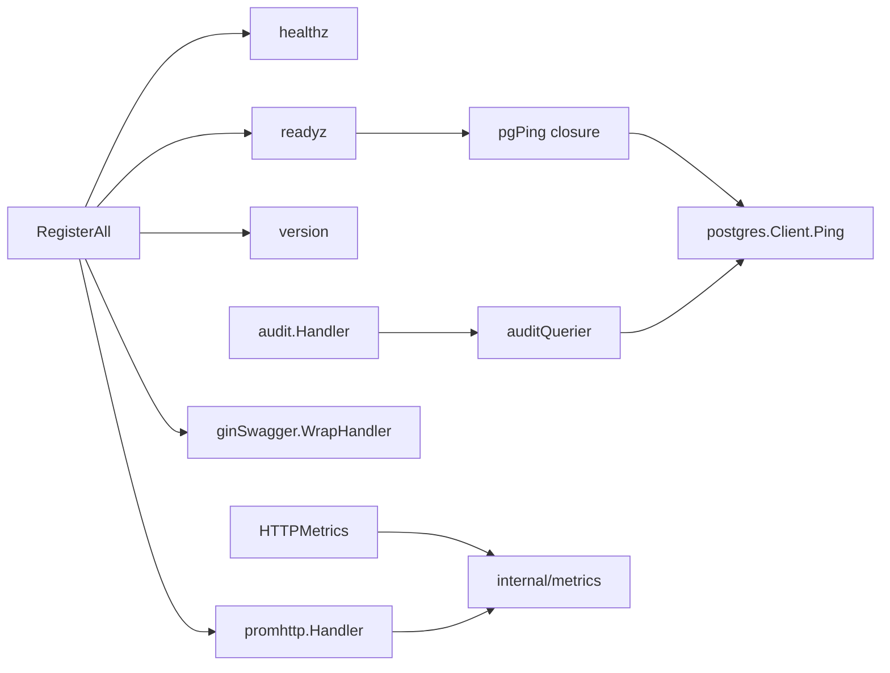

# Infrastructure & Audit API

<cite>
**Referenced Files in This Document**
- [backend/routes/routes.go](file://backend/routes/routes.go)
- [backend/cmd/server/server.go](file://backend/cmd/server/server.go)
- [backend/cmd/server/infra.go](file://backend/cmd/server/infra.go)
- [backend/cmd/server/main.go](file://backend/cmd/server/main.go)
- [backend/internal/handlers/audit/handler.go](file://backend/internal/handlers/audit/handler.go)
- [backend/internal/middleware/metrics.go](file://backend/internal/middleware/metrics.go)
- [backend/internal/metrics/backend.go](file://backend/internal/metrics/backend.go)
- [backend/internal/postgres/client.go](file://backend/internal/postgres/client.go)
- [backend/Dockerfile](file://backend/Dockerfile)
- [api/openapi.yaml](file://api/openapi.yaml)
</cite>

## Table of Contents
1. [Introduction](#introduction)
2. [Project Structure](#project-structure)
3. [Core Components](#core-components)
4. [Architecture Overview](#architecture-overview)
5. [Detailed Component Analysis](#detailed-component-analysis)
6. [Dependency Analysis](#dependency-analysis)
7. [Performance Considerations](#performance-considerations)
8. [Troubleshooting Guide](#troubleshooting-guide)
9. [Conclusion](#conclusion)
10. [Appendices](#appendices)

## Introduction

This page documents the **infrastructure** and **audit** surfaces of the
cyber-databrew backend. These are the unauthenticated operational endpoints that
container orchestrators, load balancers, and observability stacks rely on
(`/healthz`, `/readyz`, `/version`, `/metrics`, `/swagger/*any`), together with
the authenticated audit/discovery endpoints that trace event history and asset
lineage across the whole dataset.

The infrastructure endpoints exist so that the process can declare three
independent facts to the outside world: *I am alive* (liveness, `/healthz`), *I
can serve traffic* (readiness, `/readyz`, which actively pings PostgreSQL), and
*here is exactly which build I am* (`/version`, populated from linker flags at
build time). The `/metrics` endpoint exposes the Prometheus registry, and
`/swagger/*any` serves the generated OpenAPI UI. All five are registered at the
gin engine root — outside the `/api/v1` group — so they stay reachable even when
JWT auth, the circuit breaker, or rate limiting would otherwise reject requests.

The audit endpoints (`HandleAuditSearch`, `HandleLineageSearch`) provide
cross-asset event search and recursive lineage traversal over the
`asset_events` and `asset_relations` PostgreSQL tables, intended for forensic
and provenance use cases (CYB-1097 / CYB-1098).

**Section sources**
- [backend/routes/routes.go](file://backend/routes/routes.go#L96-L101)
- [backend/internal/handlers/audit/handler.go](file://backend/internal/handlers/audit/handler.go#L17-L51)

## Project Structure

The infrastructure and audit surfaces span four areas of the backend:

- **Route registration** lives in `backend/routes/routes.go`. The infrastructure
  endpoints are registered directly on the gin engine in `RegisterAll`, and the
  handler closures `healthz`, `readyz`, and `version` are defined in the same
  file. Build-time version variables (`buildVersion`, `buildCommit`,
  `buildTime`) are package-level vars overridden by linker flags.
- **Process wiring** lives in `backend/cmd/server/`. `infra.go` constructs the
  PostgreSQL client and sets `backend_dependency_up` gauges; `server.go` derives
  the `pgPing` callback from `inf.pg.Ping` and hands it to `RegisterAll`;
  `main.go` orchestrates the four wiring layers.
- **Audit handler** lives in `backend/internal/handlers/audit/handler.go`. It is
  a thin SQL layer over an `auditQuerier` interface that wraps
  `*postgres.Client`.
- **Metrics** are declared in `backend/internal/metrics/backend.go` (the
  Prometheus collector definitions) and recorded by the `HTTPMetrics`
  middleware in `backend/internal/middleware/metrics.go`.



**Diagram sources**
- [backend/routes/routes.go](file://backend/routes/routes.go#L96-L101)
- [backend/internal/handlers/audit/handler.go](file://backend/internal/handlers/audit/handler.go#L100-L255)

**Section sources**
- [backend/routes/routes.go](file://backend/routes/routes.go#L96-L101)
- [backend/cmd/server/server.go](file://backend/cmd/server/server.go#L21-L57)
- [backend/cmd/server/infra.go](file://backend/cmd/server/infra.go#L76-L94)

## Core Components

### Infrastructure handler closures

Three of the five infrastructure endpoints are backed by closures defined in
`routes.go`:

- `healthz(service string)` returns a static `{"status":"ok","service":...}`
  body with HTTP 200. It performs no dependency checks — it is a pure liveness
  signal. It is wired with the service name `"backend"`.
- `readyz(pgPing, cfg)` builds a `checks` map, actively pings PostgreSQL through
  the injected `pgPing` callback, and reports lakehouse configuration when
  enabled. It returns 200 only when every required dependency is healthy,
  otherwise 503.
- `version()` returns the build-time identity (`version`, `commit`, `time`) plus
  a fixed `service` field of `cyber-databrew-backend`.

The remaining two are third-party handlers wrapped into gin: `/metrics` wraps
`promhttp.Handler()` via `gin.WrapH`, and `/swagger/*any` wraps the swaggo
`ginSwagger.WrapHandler(swaggerFiles.Handler)`.

**Section sources**
- [backend/routes/routes.go](file://backend/routes/routes.go#L375-L434)

### Build-time version variables

`buildVersion`, `buildCommit`, and `buildTime` default to `"dev"`,
`"unknown"`, and `"unknown"` respectively, and are overridden at link time. The
backend `Dockerfile` injects them via `-ldflags="-X ...routes.buildVersion=...
-X ...routes.buildCommit=... -X ...routes.buildTime=..."`.

**Section sources**
- [backend/routes/routes.go](file://backend/routes/routes.go#L419-L434)
- [backend/Dockerfile](file://backend/Dockerfile#L16-L16)

### Audit handler

`audit.Handler` holds a single `auditQuerier` field. `New(pg *postgres.Client)`
returns a handler with `db == nil` when `pg` is nil (so endpoints respond 503),
otherwise wraps the client in a `postgresQuerier`. The querier interface exposes
exactly one method, `Query(ctx, sql, args...) (auditRows, error)`, decoupling
the SQL handlers from the concrete pool for testability.

The handler exposes two methods:

- `HandleAuditSearch` — paginated cross-asset search over `asset_events`.
- `HandleLineageSearch` — recursive CTE traversal over `asset_relations`.

**Section sources**
- [backend/internal/handlers/audit/handler.go](file://backend/internal/handlers/audit/handler.go#L19-L51)

### HTTP metrics middleware

`HTTPMetrics()` is a gin middleware registered globally in `RegisterAll`. It
increments an in-flight gauge, times each request, and records a counter and a
latency histogram labelled by `method`, `route` (`c.FullPath()`), and
`status_class` (e.g. `2xx`, `5xx`). It deliberately skips `/metrics` and
`/healthz` to avoid self-instrumentation noise.

**Section sources**
- [backend/internal/middleware/metrics.go](file://backend/internal/middleware/metrics.go#L12-L51)
- [backend/routes/routes.go](file://backend/routes/routes.go#L74-L77)

## Architecture Overview

The infrastructure endpoints are mounted *before* any authenticated group, and
the comment in `RegisterAll` makes the design intent explicit: the circuit
breaker is scoped to API routes only so that `/healthz`, `/readyz`, and
`/metrics` remain reachable when the breaker is open. The global middleware
chain (`RequestID`, `HTTPMetrics`, `RequestGuard`, `StructuredLogger`, optional
rate limit) wraps everything, but JWT auth and the circuit breaker apply only
inside the `/api/v1` group.



The `pgPing` callback is the single seam between the process layer and the
readiness endpoint. `runServer` sets `pgPingFn = inf.pg.Ping` only when
`inf.pg != nil`; otherwise it passes nil, and `readyz` reports PG as
`"unhealthy" / "not configured"`.

**Diagram sources**
- [backend/routes/routes.go](file://backend/routes/routes.go#L74-L101)
- [backend/cmd/server/server.go](file://backend/cmd/server/server.go#L27-L57)

**Section sources**
- [backend/routes/routes.go](file://backend/routes/routes.go#L74-L101)
- [backend/cmd/server/server.go](file://backend/cmd/server/server.go#L21-L57)
- [backend/cmd/server/main.go](file://backend/cmd/server/main.go#L119-L128)

## Detailed Component Analysis

### Liveness: `/healthz`

`healthz` is a constant-time, dependency-free handler. It never returns a
non-200 status while the process is running, which makes it suitable as a
Kubernetes liveness probe: a failure means the process itself is gone, not that
a downstream is degraded. The response is `{"status":"ok","service":"backend"}`.
It is intentionally excluded from HTTP metrics.

**Section sources**
- [backend/routes/routes.go](file://backend/routes/routes.go#L375-L379)
- [backend/internal/middleware/metrics.go](file://backend/internal/middleware/metrics.go#L37-L44)

### Readiness: `/readyz` and the PG ping

`readyz` is the gate for "can this instance serve traffic". It opens a 5-second
timeout context derived from the request context, then:

1. If `pgPing != nil`, it calls the ping. Success records
   `checks.pg = {"status":"healthy"}`; failure records
   `{"status":"unhealthy","error":<err>}` and flips `healthy = false`.
2. If `pgPing == nil`, PG is reported `{"status":"unhealthy","error":"not configured"}`
   and the overall result is unhealthy.
3. If the lakehouse backend is configured (not empty and not `"none"`), it adds
   an informational `checks.lakehouse` block containing the backend, project,
   and dataset. This block is purely informational — it does **not** affect the
   `healthy` flag.
4. The status code is 200 when healthy, else 503. The body is always
   `{"status":{"healthy":bool},"checks":{...}}`.

The injected `pgPing` ultimately resolves to `(*postgres.Client).Ping`, which
guards against a nil client and delegates to the pgx pool ping.

```mermaid
sequenceDiagram
  participant Probe as "Orchestrator / LB"
  participant Readyz as "readyz handler"
  participant Ctx as "5s timeout ctx"
  participant PG as "pgPing → Client.Ping → pool.Ping"
  Probe->>Readyz: GET /readyz
  Readyz->>Ctx: WithTimeout(req.ctx, 5s)
  alt pgPing != nil
    Readyz->>PG: pgPing(ctx)
    alt ping ok
      PG-->>Readyz: nil
      Readyz->>Readyz: checks.pg = healthy
    else ping error
      PG-->>Readyz: err
      Readyz->>Readyz: checks.pg = unhealthy(err); healthy=false
    end
  else pgPing == nil
    Readyz->>Readyz: checks.pg = unhealthy("not configured"); healthy=false
  end
  opt lakehouse configured
    Readyz->>Readyz: checks.lakehouse = {backend,project,dataset}
  end
  alt healthy
    Readyz-->>Probe: 200 {status:{healthy:true}, checks}
  else not healthy
    Readyz-->>Probe: 503 {status:{healthy:false}, checks}
  end
```

**Diagram sources**
- [backend/routes/routes.go](file://backend/routes/routes.go#L381-L417)
- [backend/internal/postgres/client.go](file://backend/internal/postgres/client.go#L182-L187)

**Section sources**
- [backend/routes/routes.go](file://backend/routes/routes.go#L381-L417)
- [backend/cmd/server/server.go](file://backend/cmd/server/server.go#L27-L30)
- [backend/internal/postgres/client.go](file://backend/internal/postgres/client.go#L181-L187)

### Version: `/version`

`version()` emits a four-field JSON object: `version`, `commit`, `time`, and the
constant `service: "cyber-databrew-backend"`. The first three default to
placeholder values for local `go run` builds and are overwritten in container
builds via Go linker `-X` flags targeting the `routes` package variables.

**Section sources**
- [backend/routes/routes.go](file://backend/routes/routes.go#L419-L434)
- [backend/Dockerfile](file://backend/Dockerfile#L16-L16)

### Metrics: `/metrics`

`/metrics` exposes the default Prometheus registry through `promhttp.Handler()`.
The metric families are declared in `backend/internal/metrics/backend.go` using
`promauto` (so they self-register), and are populated from two sources:

- The `HTTPMetrics` middleware emits `backend_http_requests_total`,
  `backend_http_request_duration_seconds`, and `backend_http_in_flight_requests`.
- Process wiring and background workers set gauges such as
  `backend_dependency_up{dependency=...}` (toggled in `setupInfra` as each
  dependency connects), the lakehouse sync gauges, and the outbox watermark
  gauges.

**Section sources**
- [backend/routes/routes.go](file://backend/routes/routes.go#L100-L100)
- [backend/internal/metrics/backend.go](file://backend/internal/metrics/backend.go#L8-L39)
- [backend/cmd/server/infra.go](file://backend/cmd/server/infra.go#L44-L47)

### Swagger UI: `/swagger/*any`

`/swagger/*any` serves the interactive OpenAPI UI through swaggo's gin handler.
The generated docs package is imported for side effects in `routes.go`
(`_ "...docs/swagger"`). The wildcard `*any` catches the index page, asset
files, and the `doc.json` spec under the same prefix.

**Section sources**
- [backend/routes/routes.go](file://backend/routes/routes.go#L37-L37)
- [backend/routes/routes.go](file://backend/routes/routes.go#L101-L101)

### Audit search: cross-asset event query

`HandleAuditSearch` returns paginated `asset_events` rows across all assets. If
the handler has no DB (`h == nil || h.db == nil`), it responds 503
`service_unavailable`. Otherwise it builds a parameterized `WHERE` clause from
optional filters:

- `actor` → `actor_id ILIKE '%...%'` (case-insensitive substring)
- `event_type` → exact match
- `run_id` → exact match
- `time_from` / `time_to` → RFC3339 bounds on `occurred_at`; if both are present
  and `time_from > time_to`, it returns 400
- `cursor` → keyset pagination, `event_seq < cursor`

`limit` defaults to 50, is clamped to a maximum of 200, and must be a positive
integer (else 400). The query fetches `limit+1` rows ordered by `event_seq DESC`
to detect a next page; when more than `limit` rows come back, the last
in-window `event_seq` is returned as `next_cursor` and the extra row is trimmed.
The response is `{"items":[...],"limit":N}` plus `next_cursor` when another page
exists.

Note that the handler's keyset/`actor` model is richer than the OpenAPI
`/api/v1/audit/search` stub, which currently documents `cursor`, `limit`,
`asset_id`, and `event_type` only — the handler is the authoritative contract.

**Section sources**
- [backend/internal/handlers/audit/handler.go](file://backend/internal/handlers/audit/handler.go#L73-L255)

### Lineage search: recursive CTE traversal

`HandleLineageSearch` traces lineage over `asset_relations`. `asset_id` is
required (else 400). `direction` is `upstream`, `downstream`, or `both`
(default `both`); `depth` defaults to 10 and is clamped to 50; `relation_types`
is a comma-separated allowlist validated against the supported set
(`split_from`, `contains`, `derived_from`, `merged_from`, `sampled_from`,
`revision_of`), defaulting to the first five.

For each requested direction it runs a `WITH RECURSIVE` CTE that walks parent
→ child (downstream) or child → parent (upstream), tracking a `path` array to
prevent cycles and capping recursion at `depth`. Results from both directions
are merged in Go and emitted as
`{"asset_id","direction","depth","relation_types","nodes":[...],"count"}`.



**Diagram sources**
- [backend/internal/handlers/audit/handler.go](file://backend/internal/handlers/audit/handler.go#L312-L450)

**Section sources**
- [backend/internal/handlers/audit/handler.go](file://backend/internal/handlers/audit/handler.go#L257-L476)

### Internal service-to-service endpoints

The `Internal` tag in the OpenAPI spec covers privileged endpoints guarded by
`AdminTokenAuth`. Two are mounted in the `/api/v1/internal` group when admin
routes are enabled — `DELETE /assets/:id` (`purgeHandler.DeleteAssetHard`) and
`POST /assets:batch_delete` (`purgeHandler.BatchDeleteAssets`) — and one at the
engine root, `POST /internal/commit-segments` (`assetHandler.CommitSegments`).
All require `ADMIN_TOKEN` to be set in production; when unset, the routes are
not mounted and `setupInfra` logs a warning.

**Section sources**
- [backend/routes/routes.go](file://backend/routes/routes.go#L280-L285)
- [backend/routes/routes.go](file://backend/routes/routes.go#L369-L372)
- [backend/cmd/server/infra.go](file://backend/cmd/server/infra.go#L40-L42)

## Dependency Analysis

The infrastructure endpoints depend on very little by design — that is what
keeps them reachable during partial outages. `/healthz` and `/version` have no
runtime dependencies. `/readyz` depends only on the injected `pgPing` closure
(and reads lakehouse config from `cfg`). `/metrics` depends on the global
Prometheus registry. The audit endpoints depend on the PostgreSQL client through
the `auditQuerier` interface.



The audit handler is constructed in `server.go` via `auditH.New(inf.pg)` and
passed into `RegisterAll` as `auditHandler`. Note that in the current
`RegisterAll`, `auditHandler` is among the parameters explicitly assigned to
`_` to suppress the unused warning — its route registrations are wired in a
follow-up PR — while the OpenAPI spec already documents the audit paths as the
intended contract.

**Diagram sources**
- [backend/routes/routes.go](file://backend/routes/routes.go#L96-L101)
- [backend/cmd/server/server.go](file://backend/cmd/server/server.go#L43-L43)

**Section sources**
- [backend/routes/routes.go](file://backend/routes/routes.go#L44-L72)
- [backend/cmd/server/server.go](file://backend/cmd/server/server.go#L32-L57)

## Performance Considerations

- **Readiness cost.** `/readyz` issues a real network round trip to PostgreSQL
  on every call, bounded by a 5-second context timeout. Tune probe intervals so
  the pool is not flooded by aggressive probing; the ping reuses the existing
  connection pool rather than opening a fresh connection.
- **Metrics cardinality.** `backend_http_requests_total` and the duration
  histogram are labelled by `route` using `c.FullPath()` (the parameterized
  template, e.g. `/api/v1/assets/:id`), which keeps cardinality bounded.
  Unmatched routes collapse to the literal label `unmatched`. `/metrics` and
  `/healthz` are excluded entirely.
- **Audit pagination.** Audit search uses keyset pagination on `event_seq`
  (ordered `DESC`) rather than `OFFSET`, so deep pages do not degrade. It fetches
  one extra row per page to detect continuation. Ensure an index supporting
  `event_seq DESC` and the filter columns (`event_type`, `run_id`, `actor_id`,
  `occurred_at`) exists for large `asset_events` tables.
- **Lineage recursion.** The recursive CTE is bounded by `depth` (clamped to 50)
  and carries a `path` array to short-circuit cycles, preventing runaway
  traversal on densely connected graphs. `both` runs two CTEs sequentially.

**Section sources**
- [backend/routes/routes.go](file://backend/routes/routes.go#L381-L417)
- [backend/internal/middleware/metrics.go](file://backend/internal/middleware/metrics.go#L24-L44)
- [backend/internal/handlers/audit/handler.go](file://backend/internal/handlers/audit/handler.go#L194-L242)

## Troubleshooting Guide

- **`/readyz` returns 503 with `pg: not configured`.** The process started
  without a PostgreSQL client, so `pgPingFn` was nil. Check `STORAGE_BACKEND` and
  the PG connection settings; `setupInfra` exits the process if `postgres.New`
  fails, so a running process with a nil PG is unusual but possible if wiring
  changes.
- **`/readyz` returns 503 with `pg.error`.** The pool ping failed within 5s —
  inspect the embedded `error` string. The lakehouse block, even when present,
  never causes a 503.
- **`/version` shows `dev` / `unknown`.** The binary was built without the
  `-ldflags -X` injection (e.g. local `go run`/`go build`). Use the Docker build
  or pass the linker flags to populate real values.
- **Audit endpoints return 503.** The handler was constructed without a DB
  (`auditH.New(nil)`), so `h.db == nil`. Confirm PostgreSQL is wired.
- **Audit search 400s.** Causes include a non-positive `limit`, a non-RFC3339
  `time_from`/`time_to`, `time_from` after `time_to`, or a non-int64 `cursor`.
- **Lineage search 400s.** Missing `asset_id`, an invalid `direction`, a
  non-positive `depth`, or an unsupported `relation_type` value.
- **A metric is missing from `/metrics`.** `promauto` registers families at
  package init, but a label combination only appears after it is first observed;
  trigger the relevant code path before scraping.

**Section sources**
- [backend/routes/routes.go](file://backend/routes/routes.go#L381-L434)
- [backend/internal/handlers/audit/handler.go](file://backend/internal/handlers/audit/handler.go#L100-L187)
- [backend/internal/handlers/audit/handler.go](file://backend/internal/handlers/audit/handler.go#L312-L351)

## Conclusion

The infrastructure surface is deliberately minimal and unauthenticated:
`/healthz` for liveness, `/readyz` for readiness with an active PostgreSQL ping,
`/version` for build identity, `/metrics` for the Prometheus registry, and
`/swagger/*any` for the API UI. Their placement at the engine root — ahead of
JWT auth and the circuit breaker — guarantees they stay observable during
degraded operation. The audit surface adds authenticated, keyset-paginated event
search and bounded recursive lineage traversal over PostgreSQL, giving operators
forensic and provenance tooling without sacrificing query safety.

## Appendices

### A. Infrastructure endpoints

| Method | Path | Auth | Handler | Success | Notes |
|--------|------|------|---------|---------|-------|
| GET | `/healthz` | none | `healthz("backend")` | 200 | `{status, service}`; metrics-skipped |
| GET | `/readyz` | none | `readyz(pgPing, cfg)` | 200 / 503 | PG ping; 503 when unhealthy |
| GET | `/version` | none | `version()` | 200 | `{version, commit, time, service}` |
| GET | `/metrics` | none | `promhttp.Handler` | 200 | Prometheus exposition; metrics-skipped |
| GET | `/swagger/*any` | none | `ginSwagger.WrapHandler` | 200 | OpenAPI UI |

**Section sources**
- [backend/routes/routes.go](file://backend/routes/routes.go#L96-L101)
- [api/openapi.yaml](file://api/openapi.yaml#L1832-L1906)

### B. Audit & internal endpoints

| Method | Path | Auth | Handler | Notes |
|--------|------|------|---------|-------|
| GET | `/api/v1/audit/search` | DatabrewToken | `Handler.HandleAuditSearch` | keyset pagination on `event_seq` |
| GET | `/api/v1/audit/lineage-search` | DatabrewToken | `Handler.HandleLineageSearch` | recursive CTE on `asset_relations` |
| GET | `/api/v1/admin/search/audit` | DatabrewToken + AdminToken | `adminHandler.SearchAudit` | PG vs ES consistency |
| DELETE | `/api/v1/internal/assets/{id}` | DatabrewToken + AdminToken | `purgeHandler.DeleteAssetHard` | hard delete |
| POST | `/api/v1/internal/assets:batch_delete` | DatabrewToken + AdminToken | `purgeHandler.BatchDeleteAssets` | batch hard delete |
| POST | `/internal/commit-segments` | DatabrewToken + AdminToken | `assetHandler.CommitSegments` | engine-root route |

**Section sources**
- [backend/routes/routes.go](file://backend/routes/routes.go#L277-L285)
- [backend/routes/routes.go](file://backend/routes/routes.go#L369-L372)
- [api/openapi.yaml](file://api/openapi.yaml#L3512-L3735)

### C. Audit search query parameters (`HandleAuditSearch`)

| Param | Type | Default | Semantics |
|-------|------|---------|-----------|
| `actor` | string | — | `actor_id ILIKE '%actor%'` |
| `time_from` | RFC3339 | — | `occurred_at >= time_from` |
| `time_to` | RFC3339 | — | `occurred_at <= time_to` |
| `event_type` | string | — | exact match |
| `run_id` | string | — | exact match |
| `limit` | int | 50 | clamped to max 200; must be positive |
| `cursor` | int64 | — | `event_seq < cursor` (keyset) |

**Section sources**
- [backend/internal/handlers/audit/handler.go](file://backend/internal/handlers/audit/handler.go#L84-L124)

### D. Lineage search query parameters (`HandleLineageSearch`)

| Param | Type | Default | Semantics |
|-------|------|---------|-----------|
| `asset_id` | string | — (required) | start node |
| `direction` | enum | `both` | `upstream` \| `downstream` \| `both` |
| `depth` | int | 10 | clamped to max 50 |
| `relation_types` | csv | dependency set | allowlist: `split_from`, `contains`, `derived_from`, `merged_from`, `sampled_from`, `revision_of` |

**Section sources**
- [backend/internal/handlers/audit/handler.go](file://backend/internal/handlers/audit/handler.go#L273-L345)
- [backend/internal/handlers/audit/handler.go](file://backend/internal/handlers/audit/handler.go#L452-L476)

### E. Response schemas

| Schema | Key fields | Source |
|--------|-----------|--------|
| `healthz` body | `status`, `service` | routes.go#L375-L379 |
| `readyz` body | `status.healthy`, `checks.pg{status,error}`, `checks.lakehouse{status,backend,project,dataset}` | routes.go#L381-L417 |
| `version` body | `version`, `commit`, `time`, `service` | routes.go#L425-L434 |
| `auditEventRow` | `event_id`, `event_seq`, `event_type`, `aggregate_type`, `asset_id`, `mcap_file_id`, `tenant_id`, `project_id`, `event_source`, `actor_type`, `actor_id`, `run_id`, `occurred_at`, `created_at` | handler.go#L56-L71 |
| `lineageNode` | `asset_id`, `parent_asset_id`, `child_asset_id`, `relation_type`, `direction`, `depth`, `method`, `algo_name`, `algo_version`, `run_id`, `created_at` | handler.go#L259-L271 |

**Section sources**
- [backend/routes/routes.go](file://backend/routes/routes.go#L375-L434)
- [backend/internal/handlers/audit/handler.go](file://backend/internal/handlers/audit/handler.go#L56-L71)
- [backend/internal/handlers/audit/handler.go](file://backend/internal/handlers/audit/handler.go#L259-L271)
- [api/openapi.yaml](file://api/openapi.yaml#L1422-L1467)

### F. Key metric families (`/metrics`)

| Metric | Type | Labels | Source |
|--------|------|--------|--------|
| `backend_http_requests_total` | counter | method, route, status_class | backend.go#L9-L15 |
| `backend_http_request_duration_seconds` | histogram | method, route, status_class | backend.go#L17-L24 |
| `backend_http_in_flight_requests` | gauge | — | backend.go#L26-L31 |
| `backend_dependency_up` | gauge | dependency | backend.go#L33-L39 |

**Section sources**
- [backend/internal/metrics/backend.go](file://backend/internal/metrics/backend.go#L8-L39)
- [backend/internal/middleware/metrics.go](file://backend/internal/middleware/metrics.go#L12-L51)
