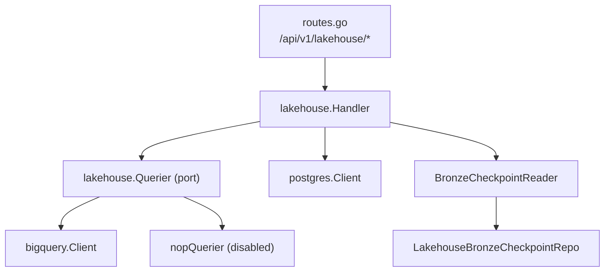
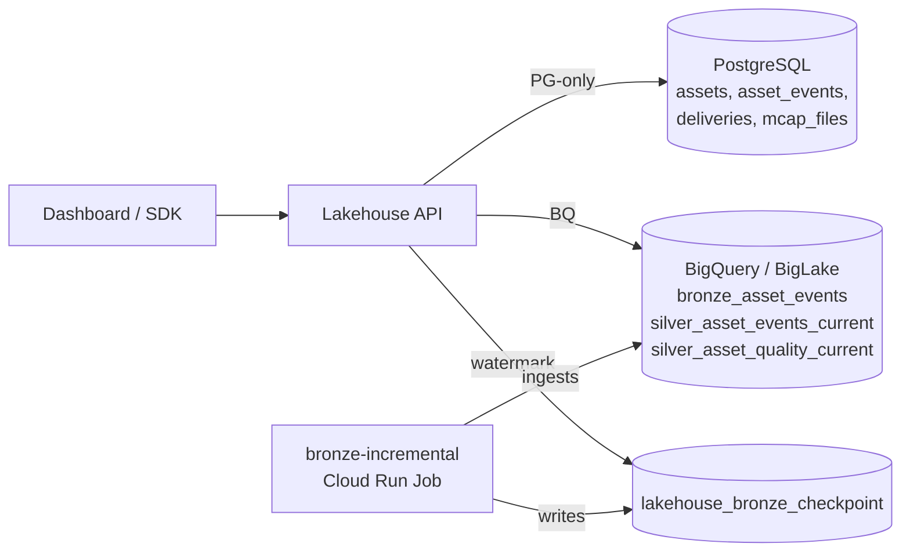
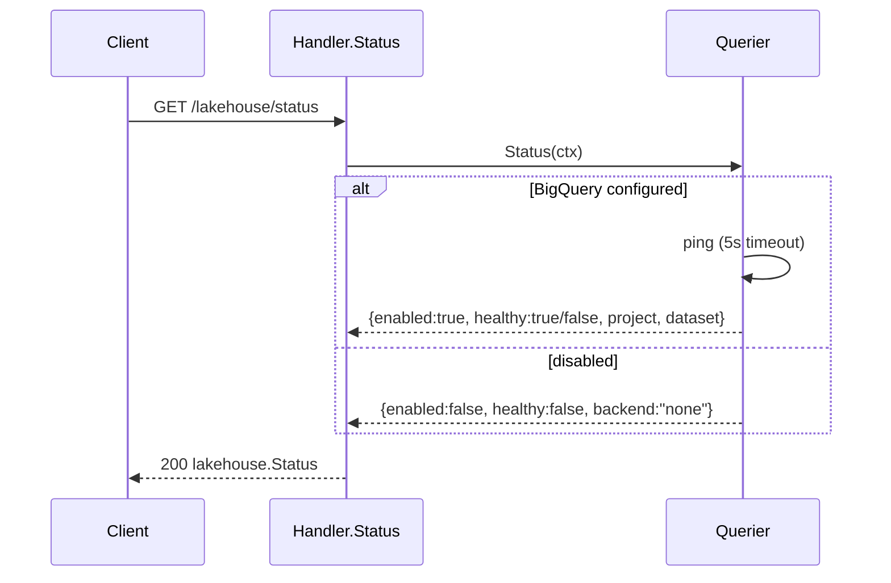
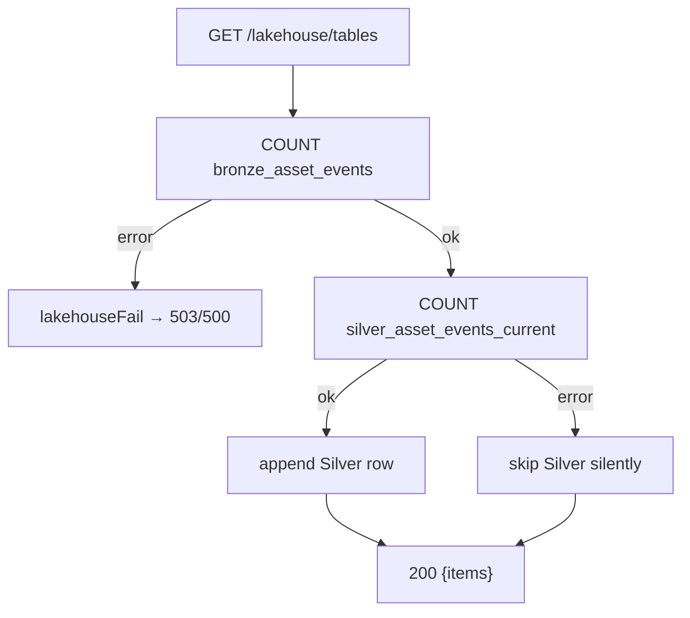
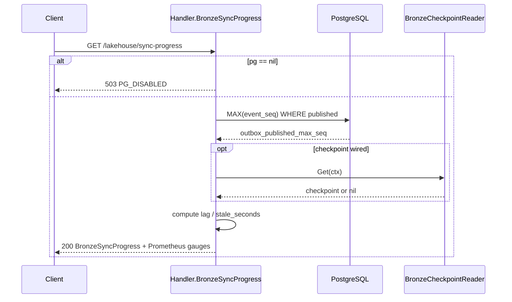
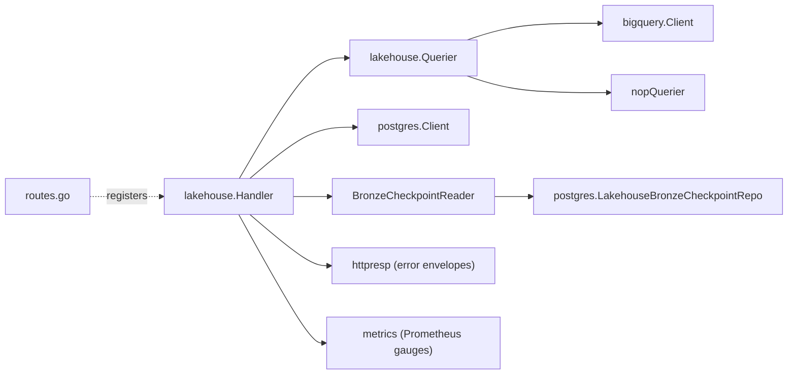

# Lakehouse API

<cite>
**Referenced Files in This Document**
- [backend/internal/handlers/lakehouse/handler.go](file://backend/internal/handlers/lakehouse/handler.go)
- [backend/internal/lakehouse/lakehouse.go](file://backend/internal/lakehouse/lakehouse.go)
- [backend/internal/lakehouse/nop.go](file://backend/internal/lakehouse/nop.go)
- [backend/internal/lakehouse/bigquery/client.go](file://backend/internal/lakehouse/bigquery/client.go)
- [backend/internal/postgres/lakehouse_bronze_checkpoint.go](file://backend/internal/postgres/lakehouse_bronze_checkpoint.go)
- [backend/routes/routes.go](file://backend/routes/routes.go)
- [api/openapi.yaml](file://api/openapi.yaml)
</cite>

## Table of Contents
1. [Introduction](#introduction)
2. [Project Structure](#project-structure)
3. [Core Components](#core-components)
4. [Architecture Overview](#architecture-overview)
5. [Detailed Component Analysis](#detailed-component-analysis)
6. [Dependency Analysis](#dependency-analysis)
7. [Performance Considerations](#performance-considerations)
8. [Troubleshooting Guide](#troubleshooting-guide)
9. [Conclusion](#conclusion)
10. [Appendices](#appendices)

## Introduction

The **Lakehouse API** is the analytical read surface of cyber-databrew. It powers the
Dashboard's top-card statistics, asset-growth curves, event-stream aggregations,
quality distributions, customer delivery replays, and pipeline-health watermarks. It
exposes the state of the lakehouse data plane — BigQuery acting as the query engine over
BigLake-managed Iceberg tables (`bronze_asset_events`, `silver_asset_events_current`,
`silver_asset_quality_current`) — alongside cheaper PostgreSQL-backed aggregations that
serve the same dashboards without touching the analytical engine.

A defining characteristic of this API is **graceful degradation**. The lakehouse plane is
optional: it may be disabled (`LAKEHOUSE_BACKEND=none` or missing BigQuery config), a Silver
table may not yet have been materialized, or the Postgres client may be absent. Rather than
failing hard, every endpoint chooses one of three documented behaviors when a dependency is
absent: return **200 with empty `items`**, return **200 with an `available:false` note**, or
return **503** with a stable error code. The handler is built around this contract so that a
partially-provisioned environment still renders a usable dashboard.

The API splits responsibilities across three backends, documented in the package header:

- **PG-backed** (always-on, indexed, fast): `/overview`, `/asset-growth`, `/failure-clusters`,
  `/sync-progress`, `/sync-status`, `/customer-replay`.
- **BigQuery-backed** (Iceberg aggregations): `/event-daily`, `/event-type-share`, `/tables`,
  `/quality-distribution`.
- **Static file**: `/report` (the local notebook-based MVP snapshot).

**Section sources**
- [backend/internal/handlers/lakehouse/handler.go](file://backend/internal/handlers/lakehouse/handler.go#L1-L62)
- [backend/internal/lakehouse/lakehouse.go](file://backend/internal/lakehouse/lakehouse.go#L1-L20)

## Project Structure

The Lakehouse API is implemented as a single Gin handler package backed by two collaborating
internal packages: the analytical query port (`internal/lakehouse`) and the OLTP client
(`internal/postgres`). Routes are wired centrally in `backend/routes/routes.go`.

- **`backend/internal/handlers/lakehouse/handler.go`** — the HTTP layer. Defines the `Handler`
  struct, all twelve endpoint methods, the response DTOs (`FailureClusterItem`,
  `BronzeSyncProgress`, `SyncStatusData`, `SyncStatusResponse`), the SQL each endpoint runs, the
  degradation logic, and the BigQuery type-coercion helpers (`asString`, `asInt64`, `asFloat64`,
  `asDateString`).
- **`backend/internal/lakehouse/lakehouse.go`** — the `Querier` port and the `Status` DTO. This
  is the engine-agnostic interface the handler depends on.
- **`backend/internal/lakehouse/nop.go`** — the `Nop()` no-op `Querier` returned when the
  analytical layer is disabled. Its `Query` returns `ErrLakehouseDisabled`, which the handler maps
  to HTTP 503.
- **`backend/internal/lakehouse/bigquery/client.go`** — the production BigQuery adapter that
  implements `Querier`, including the `Status` health probe.
- **`backend/internal/postgres/lakehouse_bronze_checkpoint.go`** — the read-only repository for
  the single-row Bronze checkpoint that feeds `/sync-progress`, `/sync-status`, and the
  `data_lag_hours` field of `/overview`.
- **`backend/routes/routes.go`** — registers each lakehouse route under `/api/v1/lakehouse/*`,
  guarded by `if lakehouseHandler != nil`.
- **`api/openapi.yaml`** — the contract: schemas and response bodies for every endpoint.



**Diagram sources**
- [backend/routes/routes.go](file://backend/routes/routes.go#L252-L265)
- [backend/internal/handlers/lakehouse/handler.go](file://backend/internal/handlers/lakehouse/handler.go#L42-L70)

**Section sources**
- [backend/internal/handlers/lakehouse/handler.go](file://backend/internal/handlers/lakehouse/handler.go#L1-L62)
- [backend/routes/routes.go](file://backend/routes/routes.go#L252-L265)

## Core Components

### The `Handler` struct and its dependencies

The handler holds four fields, all injected at construction. `lake` is **always non-nil** —
`New` substitutes `lakehouse.Nop()` when the caller passes `nil` — so BigQuery-backed endpoints
never need a nil-check on the engine; they rely on `ErrLakehouseDisabled` instead. `pg` may be
nil, in which case PG-backed endpoints degrade. `bronzeCheckpoint` is optional and is wired in
separately via `WithBronzeCheckpoint`.

```go
type Handler struct {
	reportPath       string
	lake             lakehouse.Querier
	pg               *postgres.Client
	bronzeCheckpoint BronzeCheckpointReader
}
```

**Section sources**
- [backend/internal/handlers/lakehouse/handler.go](file://backend/internal/handlers/lakehouse/handler.go#L42-L70)

### The `Querier` port and the disabled no-op

The handler depends on the `lakehouse.Querier` interface, not on BigQuery directly. `Querier`
exposes `Status`, `Query`, and `Close`. The disabled implementation, `nopQuerier`, reports
`Enabled:false, Healthy:false, Backend:"none"` from `Status`, and returns
`ErrLakehouseDisabled` from `Query`. This single sentinel error is what drives the 503
degradation path for every analytical endpoint.

**Section sources**
- [backend/internal/lakehouse/lakehouse.go](file://backend/internal/lakehouse/lakehouse.go#L12-L37)
- [backend/internal/lakehouse/nop.go](file://backend/internal/lakehouse/nop.go#L8-L28)

### The central failure mapper `lakehouseFail`

Every BigQuery-backed endpoint funnels query errors through `lakehouseFail`. It inspects the
error: `ErrLakehouseDisabled` becomes `503 LAKEHOUSE_DISABLED`; any other error is logged via
`c.Error(err)` and returned as a stable `500` with the message
`"lakehouse query service temporarily unavailable"`, hiding engine internals from clients.

**Section sources**
- [backend/internal/handlers/lakehouse/handler.go](file://backend/internal/handlers/lakehouse/handler.go#L756-L766)

## Architecture Overview

The Lakehouse API sits at the read edge of the data platform. PG-backed endpoints query the
OLTP source of truth directly (the `assets`, `asset_events`, `deliveries`, `mcap_files` tables),
which is fast and always available. BigQuery-backed endpoints query Iceberg external tables
through the `Querier` port. The Bronze checkpoint row — written every 5 minutes by the
`bronze-incremental` Cloud Run Job — provides the watermarks that join the two worlds in
`/sync-progress`, `/sync-status`, and `/overview`'s `data_lag_hours`.



**Diagram sources**
- [backend/internal/handlers/lakehouse/handler.go](file://backend/internal/handlers/lakehouse/handler.go#L1-L17)
- [backend/internal/postgres/lakehouse_bronze_checkpoint.go](file://backend/internal/postgres/lakehouse_bronze_checkpoint.go#L12-L36)

**Section sources**
- [backend/internal/handlers/lakehouse/handler.go](file://backend/internal/handlers/lakehouse/handler.go#L1-L17)

## Detailed Component Analysis

### GET /api/v1/lakehouse/status — backend health

`Status` delegates straight to `h.lake.Status(ctx)` and always returns **200**. The body is the
`lakehouse.Status` DTO: `enabled`, `healthy`, `backend`, `project`, `dataset`, and an optional
`error`. When the backend is BigQuery, `Status` runs a 5-second-bounded `ping` probe; success
sets `Healthy:true`, failure sets `Healthy:false` and fills `error` with the probe message.
When disabled, `nopQuerier.Status` returns `enabled:false, healthy:false, backend:"none"`. This
endpoint never degrades to 503 — it is the canonical way to discover whether the analytical
plane is up.



**Diagram sources**
- [backend/internal/handlers/lakehouse/handler.go](file://backend/internal/handlers/lakehouse/handler.go#L96-L99)
- [backend/internal/lakehouse/bigquery/client.go](file://backend/internal/lakehouse/bigquery/client.go#L65-L82)

**Section sources**
- [backend/internal/handlers/lakehouse/handler.go](file://backend/internal/handlers/lakehouse/handler.go#L96-L99)
- [backend/internal/lakehouse/bigquery/client.go](file://backend/internal/lakehouse/bigquery/client.go#L65-L82)
- [backend/internal/lakehouse/nop.go](file://backend/internal/lakehouse/nop.go#L20-L22)

### GET /api/v1/lakehouse/overview — dashboard top cards

`Overview` is **PG-only** so it survives a BigQuery outage. It requires `h.pg`: when nil it
returns **503 `PG_DISABLED`** with message `"postgres not available for overview"`. Otherwise it
runs one aggregate query against `assets` producing `asset_total`, `active_assets` (excluding
`archived`/`superseded`/`rejected`), `today_new_assets`, and `week_new_assets`, then derives
`day7_avg_new_assets = week_new_assets / 7.0`.

Three further fields are **best-effort** and only appear when their source resolves cleanly:
`mcap_total` (`COUNT(*)` on `mcap_files`), `bronze_event_rows` (`MAX(event_seq)` from
`asset_events` — cheaper than `COUNT(*)` and identical for the append-only stream), and
`data_lag_hours` (computed from the Bronze checkpoint's `IngestedAt`, only when
`bronzeCheckpoint` is set and returns a non-nil row). Errors on these secondary queries are
swallowed (`err == nil` guards), so a missing checkpoint table simply omits the field rather
than failing the request.

**Section sources**
- [backend/internal/handlers/lakehouse/handler.go](file://backend/internal/handlers/lakehouse/handler.go#L329-L384)

### GET /api/v1/lakehouse/asset-growth — per-day growth curve

`AssetGrowth` is **PG-only**. Nil `pg` → **503 `PG_DISABLED`**. It parses `days` (default `30`,
capped at `365`, must be a positive integer or it returns `400 INVALID_ARGUMENT`). The query
generates a contiguous date series so days with no new assets still appear as zeros, computes a
`baseline` count of assets created before the window, and emits a running `cumulative_assets`
window sum. Each item is `{event_date, new_assets, cumulative_assets}`. When the window has no
activity, `items` is a populated zero-filled series rather than empty.

**Section sources**
- [backend/internal/handlers/lakehouse/handler.go](file://backend/internal/handlers/lakehouse/handler.go#L386-L454)

### GET /api/v1/lakehouse/quality-distribution — Silver-backed quality histogram

`QualityDistribution` is **BigQuery-backed**, reading the `silver_asset_quality_current` table.
It parses `window`, accepting only `7d`/`30d`/`60d`/`90d` (default `30d`); any other value yields
`400 INVALID_ARGUMENT` with message `"window must be one of 7d/30d/60d/90d"`. The SQL takes the
latest row per `asset_id` (`ROW_NUMBER` over `updated_at DESC, _ingested_at DESC`), filters
`is_deleted = FALSE` and the creation window, and groups by `quality` (NULL/empty coalesced to
`unknown`). On any query error it calls `lakehouseFail`: if the Silver table is absent the
adapter surfaces an error mapped to **500**; if the whole backend is disabled it degrades to
**503 `LAKEHOUSE_DISABLED`**.

**Section sources**
- [backend/internal/handlers/lakehouse/handler.go](file://backend/internal/handlers/lakehouse/handler.go#L594-L662)

### GET /api/v1/lakehouse/tables — Iceberg row counts with Silver tolerance

`Tables` is **BigQuery-backed** and demonstrates the "Silver optional" pattern most directly. It
first counts `bronze_asset_events`; if that fails it calls `lakehouseFail` (503 when disabled,
500 otherwise) — Bronze is mandatory for the endpoint. It then *attempts*
`silver_asset_events_current` and **only appends those rows when the count succeeds** (`if ... err
== nil`). When the Silver external table has not been materialized, the response simply omits the
Silver row instead of erroring. The body is `{items:[{table_name,row_count}, ...]}`.



**Diagram sources**
- [backend/internal/handlers/lakehouse/handler.go](file://backend/internal/handlers/lakehouse/handler.go#L456-L486)

**Section sources**
- [backend/internal/handlers/lakehouse/handler.go](file://backend/internal/handlers/lakehouse/handler.go#L456-L486)

### GET /api/v1/lakehouse/event-daily and /event-type-share — Bronze aggregations

`EventDaily` is **BigQuery-backed**. `days` defaults to `14`, is capped at `90`, and must be a
positive integer (`400 INVALID_ARGUMENT` otherwise). It groups `bronze_asset_events` by
`DATE(occurred_at) × event_type`, driven by `occurred_at` so re-ingested rows do not skew the
curve. Each item carries both `count` and a legacy alias `asset_count` for older Dashboard/SDK
readers. Query failure routes through `lakehouseFail` (503 when disabled).

`EventTypeShare` is **BigQuery-backed**. The `date` query param is validated by
`parseEventTypeShareDate`: empty or `latest` resolves to today (UTC); otherwise it must parse as
`YYYY-MM-DD` or returns `400 INVALID_ARGUMENT`. The validated value is embedded as a typed
`DATE` literal — the only user input that reaches the SQL. The query **gracefully falls back**:
if the requested date has no events, a CTE picks the most recent date within the last 30 days
that does, keeping the pie chart populated. The response echoes the `effective_date` actually
used and per-type `count`/`asset_count`/`ratio` (via `SAFE_DIVIDE`). If the fallback also finds
nothing, `items` is empty and `date` reflects the originally requested string.

**Section sources**
- [backend/internal/handlers/lakehouse/handler.go](file://backend/internal/handlers/lakehouse/handler.go#L488-L592)

### GET /api/v1/lakehouse/failure-clusters — PG-backed failure aggregation

`FailureClusters` is **PG-only**. Nil `pg` → **503 `PG_DISABLED`**. `days` defaults to `7`,
capped at `90`. It aggregates `asset_events WHERE event_type = 'algo_failed'` by
`failure_mode × algo_name` (both extracted from `event_payload` JSON, coalesced to `unknown`),
counting `DISTINCT asset_id` so retries on the same asset don't inflate impact, and computes each
group's `ratio` of the total. The body is `{days, items:[{failure_mode, algo_name,
affected_assets, ratio}]}`. With no failures in the window, `items` is an empty array (it is
initialized with `make(...)`), never null.

**Section sources**
- [backend/internal/handlers/lakehouse/handler.go](file://backend/internal/handlers/lakehouse/handler.go#L101-L186)

### GET /api/v1/lakehouse/customer-replay — delivery timeline replay

`CustomerReplay` is **PG-only**, reading `deliveries` directly (no Silver/Gold dependency). Nil
`pg` → **503 `PG_DISABLED`**. It is deliberately forgiving about `customer_id`: if omitted, it
auto-picks the customer with the most recent delivery; if a `customer_id` is supplied but has no
deliveries, it falls back to that same most-recent customer — so the dashboard tile is rarely
empty in non-prod. If after all that no customer can be resolved (empty `deliveries` table), it
returns **200** with `{customer_id:"", items:[]}`. Otherwise it returns up to 100 deliveries
ordered by `created_at DESC`, each with status-timeline fields (`created_at`, `delivered_at`,
`completed_at`).

**Section sources**
- [backend/internal/handlers/lakehouse/handler.go](file://backend/internal/handlers/lakehouse/handler.go#L664-L754)

### GET /api/v1/lakehouse/sync-progress — PG→Bronze watermarks

`BronzeSyncProgress` is **PG-only**. Nil `pg` → **503 `PG_DISABLED`** with message
`"postgres not available for bronze sync progress"`. It computes O(1) watermarks via
`loadBronzeSyncProgress`: `outbox_published_max_seq` is `MAX(event_seq)` over
`asset_events WHERE publish_state='published'`; the Bronze numbers come from the
single-row checkpoint. When `bronzeCheckpoint` is unset or returns a nil row, Bronze fields stay
at their zero defaults and `bronze_stale_seconds` remains `-1` ("Bronze unknown"). On success it
also publishes Prometheus gauges (`LakehouseBronzeMaxEventSeq`, `LakehouseBronzeLagEvents`,
`LakehouseBronzeLastIngestedUnixSeconds`). Body fields: `outbox_published_max_seq`,
`bronze_max_event_seq`, `bronze_lag_events`, `bronze_last_ingested_at` (nullable),
`bronze_stale_seconds`, `checked_at`.



**Diagram sources**
- [backend/internal/handlers/lakehouse/handler.go](file://backend/internal/handlers/lakehouse/handler.go#L245-L293)

**Section sources**
- [backend/internal/handlers/lakehouse/handler.go](file://backend/internal/handlers/lakehouse/handler.go#L188-L293)
- [backend/internal/postgres/lakehouse_bronze_checkpoint.go](file://backend/internal/postgres/lakehouse_bronze_checkpoint.go#L36-L54)

### GET /api/v1/lakehouse/sync-status — realtime sync snapshot

`SyncStatus` is **PG-only** but never returns 503. When `pg` is nil it returns **200** with
`{available:false, source:"realtime", message:"postgres not available"}`. Otherwise it loads the
same watermarks and calls `buildRealtimeSyncStatus`: if the Bronze checkpoint is unavailable
(`bronze_last_ingested_at == nil`) it returns `{available:false, source:"realtime",
message:"bronze checkpoint not available"}`; when available it returns `available:true` plus a
`SyncStatusData` block mapping PG/Bronze watermarks onto the legacy Iceberg-comparison shape
(`pg_total_count`, `iceberg_total_count`, `count_diff_pct`, `is_alert = lag > 0`, etc.). The
distribution maps are emitted as empty objects in the realtime path.

**Section sources**
- [backend/internal/handlers/lakehouse/handler.go](file://backend/internal/handlers/lakehouse/handler.go#L205-L243)
- [backend/internal/handlers/lakehouse/handler.go](file://backend/internal/handlers/lakehouse/handler.go#L295-L327)

### GET /api/v1/lakehouse/report — static MVP snapshot

`Report` reads the pre-generated JSON at `reportPath`. A missing file yields **404
`LAKEHOUSE_REPORT_NOT_FOUND`** with the hint `"run make iceberg-mvp first"`; a read or
JSON-parse error yields **500**; success returns the raw payload as **200**. This endpoint is
kept for backward compatibility with the local notebook MVP flow and has no PG or BigQuery
dependency.

**Section sources**
- [backend/internal/handlers/lakehouse/handler.go](file://backend/internal/handlers/lakehouse/handler.go#L72-L94)

### BigQuery type coercion

Because BigQuery returns native Go types through `Querier.Query` (which yields `[]Row`,
i.e. `map[string]any`), the handler coerces values before JSON-encoding. `asString`,
`asInt64`, and `asFloat64` defensively switch over the underlying type and fall back to a zero
value, and `asDateString` handles BigQuery's `civil.Date` via the `fmt.Stringer` interface
without importing the package. These helpers make the JSON shape stable regardless of how the
engine materializes a column.

**Section sources**
- [backend/internal/handlers/lakehouse/handler.go](file://backend/internal/handlers/lakehouse/handler.go#L768-L821)

## Dependency Analysis

The handler depends on three internal collaborators and is wired into the router conditionally.



The `BronzeCheckpointReader` interface declared in the handler package is satisfied in
production by `postgres.LakehouseBronzeCheckpointRepo`, whose `Get` returns `(nil, nil)` both
when the checkpoint row is missing (fresh deployment) and when the table itself is absent
(migration not yet applied) — both treated by the handler as "Bronze unknown" rather than an
error. The router only mounts the routes when `lakehouseHandler != nil`.

**Diagram sources**
- [backend/internal/handlers/lakehouse/handler.go](file://backend/internal/handlers/lakehouse/handler.go#L19-L70)
- [backend/internal/postgres/lakehouse_bronze_checkpoint.go](file://backend/internal/postgres/lakehouse_bronze_checkpoint.go#L36-L54)

**Section sources**
- [backend/internal/handlers/lakehouse/handler.go](file://backend/internal/handlers/lakehouse/handler.go#L19-L70)
- [backend/routes/routes.go](file://backend/routes/routes.go#L252-L265)

## Performance Considerations

- **Watermark over COUNT(\*)**: `/overview` and `/sync-progress` use `MAX(event_seq)` instead of
  `COUNT(*)` on the append-only `asset_events` stream — O(1) on the indexed sequence column and
  numerically identical for that table.
- **Indexed PG aggregations**: `/asset-growth` and `/overview` rely on the `created_at` index on
  `assets`; `/asset-growth` uses a single `generate_series` join rather than per-day round trips.
- **Distinct-asset failure counting**: `/failure-clusters` counts `DISTINCT asset_id` to keep
  impact numbers meaningful under retry storms.
- **Day caps**: `event-daily` ≤ 90, `failure-clusters` ≤ 90, `asset-growth` ≤ 365, and the
  `quality-distribution` window is restricted to a fixed enum — bounding worst-case scan cost.
- **Result caps**: `/customer-replay` is hard-capped at 100 rows ordered by `created_at DESC`.
- **Bounded health probe**: BigQuery `Status` uses a 5-second probe timeout so `/status` cannot
  hang the caller when the engine is slow.
- **Best-effort secondary fields**: `/overview` swallows errors on `mcap_total`,
  `bronze_event_rows`, and `data_lag_hours`, so a degraded secondary source never blocks the
  primary card stats.

**Section sources**
- [backend/internal/handlers/lakehouse/handler.go](file://backend/internal/handlers/lakehouse/handler.go#L329-L384)
- [backend/internal/lakehouse/bigquery/client.go](file://backend/internal/lakehouse/bigquery/client.go#L65-L82)

## Troubleshooting Guide

- **`503 LAKEHOUSE_DISABLED` on `/tables`, `/event-daily`, `/event-type-share`,
  `/quality-distribution`**: the analytical backend is the `Nop()` querier
  (`LAKEHOUSE_BACKEND=none` or missing BigQuery project/dataset). Confirm via `/status` —
  `enabled:false, backend:"none"`. Configure BigQuery to re-enable.
- **`503 PG_DISABLED` on `/overview`, `/asset-growth`, `/failure-clusters`, `/sync-progress`,
  `/customer-replay`**: the handler was constructed with a nil `postgres.Client`. These endpoints
  cannot degrade further.
- **`500 "lakehouse query service temporarily unavailable"`**: a real BigQuery query error
  (e.g. a referenced table such as `silver_asset_quality_current` does not exist). The underlying
  error is logged via `c.Error`; check server logs. For `/tables`, a missing
  `silver_asset_events_current` is tolerated and does NOT cause a 500 — only a missing
  `bronze_asset_events` does.
- **`/status` shows `healthy:false` with an `error`**: the BigQuery `ping` probe failed within
  5 s — check credentials, project/dataset config, and network egress.
- **`/sync-progress` returns `bronze_stale_seconds:-1` and zeroed Bronze fields**: the checkpoint
  reader is unset, or the row/table is absent (fresh deployment / migration 023 not applied).
  `/sync-status` reports the same condition as `available:false,
  message:"bronze checkpoint not available"`.
- **`/overview` missing `data_lag_hours`**: same root cause — no checkpoint wired or no row yet.
- **`404 LAKEHOUSE_REPORT_NOT_FOUND` on `/report`**: the static snapshot has not been generated;
  run `make iceberg-mvp`.
- **`400 INVALID_ARGUMENT`**: a bad `days` (non-positive integer), `window` (not 7d/30d/60d/90d),
  or `date` (not `YYYY-MM-DD`/`latest`) query param.

**Section sources**
- [backend/internal/handlers/lakehouse/handler.go](file://backend/internal/handlers/lakehouse/handler.go#L756-L766)
- [backend/internal/lakehouse/nop.go](file://backend/internal/lakehouse/nop.go#L8-L28)
- [backend/internal/postgres/lakehouse_bronze_checkpoint.go](file://backend/internal/postgres/lakehouse_bronze_checkpoint.go#L32-L54)

## Conclusion

The Lakehouse API is a degradation-first analytical surface. By depending on the
engine-agnostic `Querier` port (with a `Nop()` fallback), keeping the most-used dashboard cards
on always-available PostgreSQL, and treating missing Silver tables, missing checkpoints, and
empty result sets as expected states rather than errors, it delivers a usable dashboard across
fully-provisioned, partially-provisioned, and BigQuery-disabled environments. The three
degradation idioms — 200 with empty `items`, 200 with an `available:false` note, and 503 with a
stable code — are applied consistently and are the key contract for any client integrating
against it.

## Appendices

### A. Endpoint reference

| Method & Path | Handler | Backend | Key params | Success body |
|---|---|---|---|---|
| GET `/api/v1/lakehouse/report` | `Report` | Static file | — | `LakehouseReport` payload |
| GET `/api/v1/lakehouse/status` | `Status` | Querier | — | `LakehouseStatus` |
| GET `/api/v1/lakehouse/overview` | `Overview` | PG | — | `LakehouseOverviewResponse` |
| GET `/api/v1/lakehouse/asset-growth` | `AssetGrowth` | PG | `days` (def 30, ≤365) | `{days, items[]}` |
| GET `/api/v1/lakehouse/tables` | `Tables` | BigQuery | — | `{items:[{table_name,row_count}]}` |
| GET `/api/v1/lakehouse/event-daily` | `EventDaily` | BigQuery | `days` (def 14, ≤90) | `{days, items[]}` |
| GET `/api/v1/lakehouse/event-type-share` | `EventTypeShare` | BigQuery | `date` (YYYY-MM-DD/latest) | `{date, items[]}` |
| GET `/api/v1/lakehouse/quality-distribution` | `QualityDistribution` | BigQuery (Silver) | `window` (7d/30d/60d/90d) | `{window, items[]}` |
| GET `/api/v1/lakehouse/failure-clusters` | `FailureClusters` | PG | `days` (def 7, ≤90) | `{days, items[]}` |
| GET `/api/v1/lakehouse/customer-replay` | `CustomerReplay` | PG | `customer_id` (optional) | `{customer_id, items[]}` |
| GET `/api/v1/lakehouse/sync-progress` | `BronzeSyncProgress` | PG + checkpoint | — | `BronzeSyncProgress` |
| GET `/api/v1/lakehouse/sync-status` | `SyncStatus` | PG + checkpoint | — | `SyncStatusResponse` |

### B. Degradation matrix

| Condition | Affected endpoints | Response |
|---|---|---|
| `pg == nil` | overview, asset-growth, failure-clusters, sync-progress, customer-replay | `503 PG_DISABLED` |
| `pg == nil` | sync-status | `200 {available:false, message:"postgres not available"}` |
| Lakehouse disabled (`Nop`) | tables, event-daily, event-type-share, quality-distribution | `503 LAKEHOUSE_DISABLED` |
| BigQuery query error (table missing, etc.) | same BQ endpoints | `500 "lakehouse query service temporarily unavailable"` |
| Silver table missing | tables | `200` with Bronze row only (Silver omitted) |
| Requested date has no events | event-type-share | `200` with fallback `effective_date` |
| No matching customer | customer-replay | `200 {customer_id:"", items:[]}` |
| Checkpoint unset / row missing | sync-progress | `200` with zeroed Bronze fields, `bronze_stale_seconds:-1` |
| Checkpoint unset / row missing | sync-status | `200 {available:false, message:"bronze checkpoint not available"}` |
| Report file missing | report | `404 LAKEHOUSE_REPORT_NOT_FOUND` |
| Invalid query param | days/window/date validators | `400 INVALID_ARGUMENT` |

### C. Status & error codes

| HTTP | Code | Where |
|---|---|---|
| 200 | — | all endpoints (success and several degraded states) |
| 400 | `INVALID_ARGUMENT` | `parseDaysQuery`, `parseQualityWindow`, `parseEventTypeShareDate` |
| 404 | `LAKEHOUSE_REPORT_NOT_FOUND` | `Report` (missing file) |
| 503 | `PG_DISABLED` | PG-only endpoints when `pg == nil` |
| 503 | `LAKEHOUSE_DISABLED` | BQ endpoints via `lakehouseFail` + `ErrLakehouseDisabled` |
| 500 | (stable message) | BQ query errors, JSON/IO errors |

### D. Key response schemas (from openapi.yaml)

- **`LakehouseStatus`**: `healthy`, `enabled`, `backend`, `project`, `dataset`.
- **`LakehouseOverviewResponse`**: `asset_total`, `active_assets`, `today_new_assets`,
  `week_new_assets`, `day7_avg_new_assets`, `mcap_total`, `bronze_event_rows`, `data_lag_hours`.
- **`BronzeSyncProgress`**: `outbox_published_max_seq`, `bronze_max_event_seq`,
  `bronze_lag_events`, `bronze_last_ingested_at` (nullable), `bronze_stale_seconds`, `checked_at`.
- **`SyncStatusResponse`**: `available`, `source`, `message` (nullable), `data` (`SyncStatusData`).
- **`FailureClusterItem`**: `failure_mode`, `algo_name`, `affected_assets`, `ratio`.

**Section sources**
- [api/openapi.yaml](file://api/openapi.yaml#L1312-L1420)
- [api/openapi.yaml](file://api/openapi.yaml#L3377-L3510)
