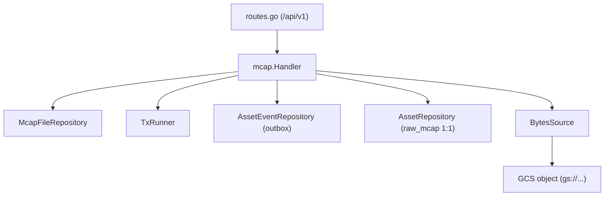
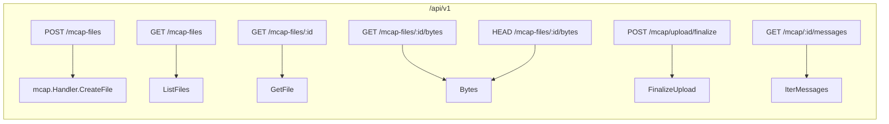
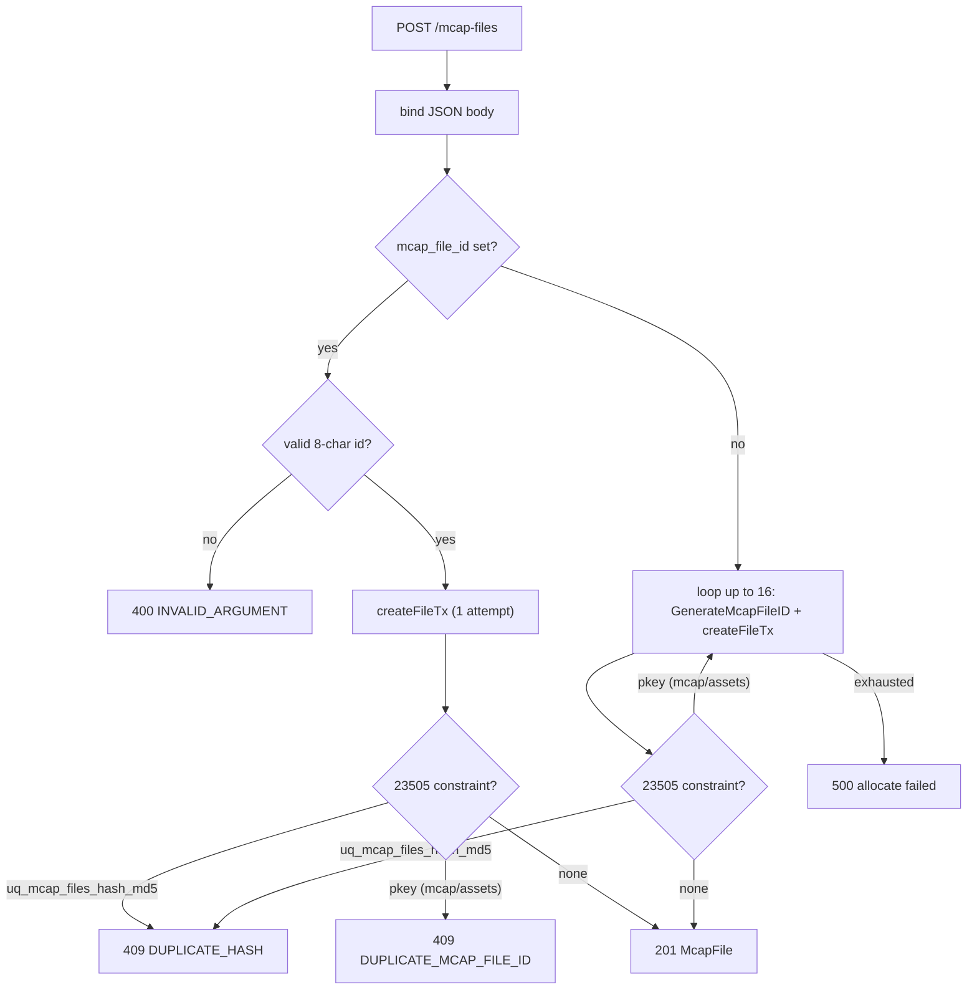
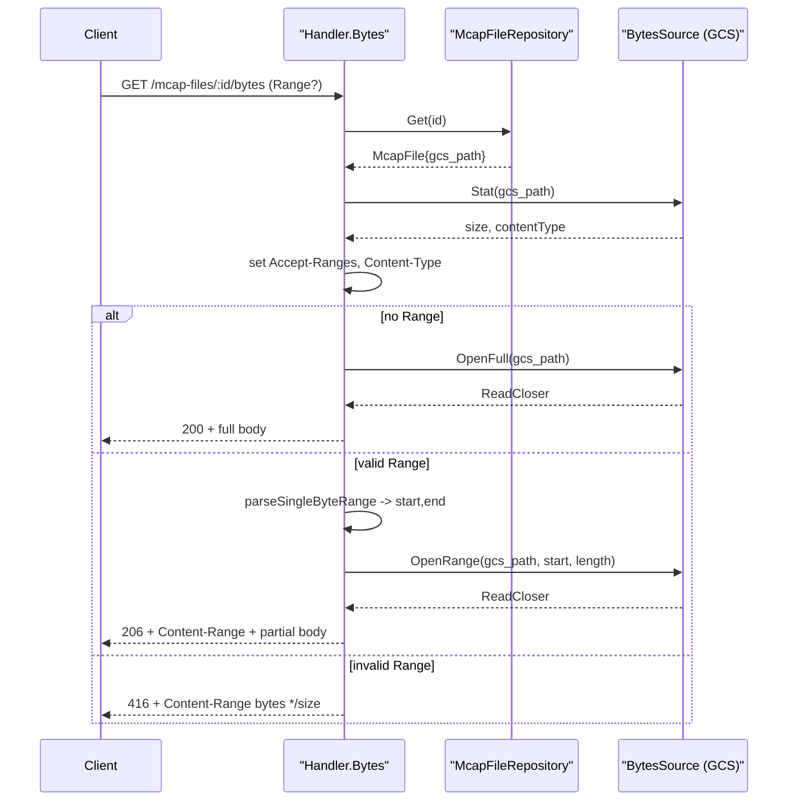
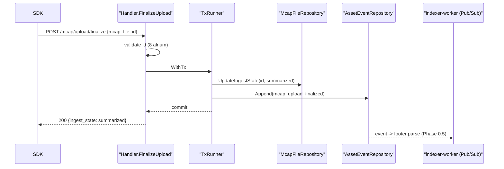
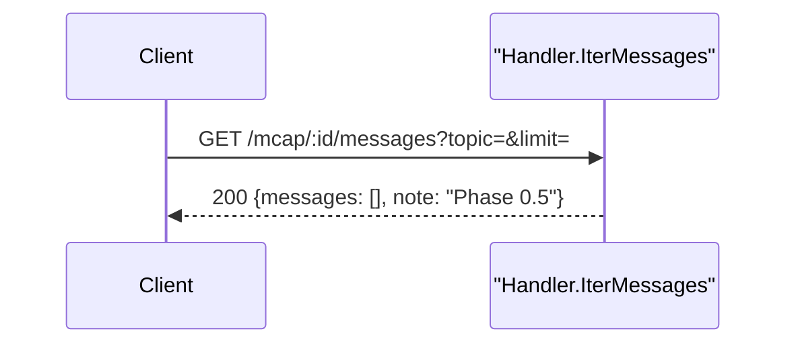
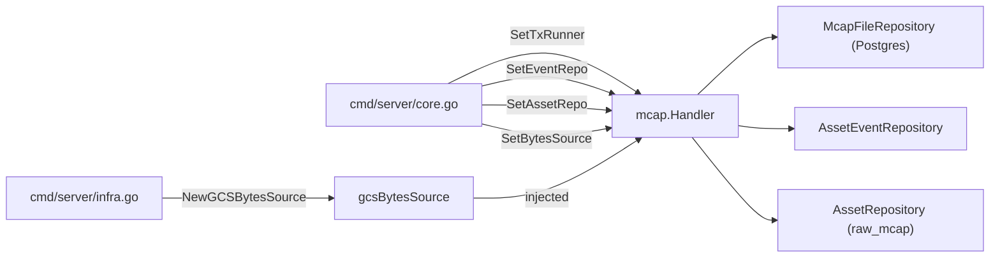

# MCAP Files API

<cite>
**Referenced Files in This Document**
- [api/openapi.yaml](file://api/openapi.yaml)
- [backend/internal/handlers/mcap/handler.go](file://backend/internal/handlers/mcap/handler.go)
- [backend/internal/handlers/mcap/bytes.go](file://backend/internal/handlers/mcap/bytes.go)
- [backend/internal/handlers/mcap/bytes_source.go](file://backend/internal/handlers/mcap/bytes_source.go)
- [backend/routes/routes.go](file://backend/routes/routes.go)
- [backend/internal/id/assetid.go](file://backend/internal/id/assetid.go)
- [backend/internal/models/asset.go](file://backend/internal/models/asset.go)
- [backend/cmd/server/core.go](file://backend/cmd/server/core.go)
- [backend/cmd/server/infra.go](file://backend/cmd/server/infra.go)
</cite>

## Table of Contents
1. [Introduction](#introduction)
2. [Project Structure](#project-structure)
3. [Core Components](#core-components)
4. [Architecture Overview](#architecture-overview)
5. [Detailed Component Analysis](#detailed-component-analysis)
6. [Dependency Analysis](#dependency-analysis)
7. [Performance Considerations](#performance-considerations)
8. [Troubleshooting Guide](#troubleshooting-guide)
9. [Conclusion](#conclusion)
10. [Appendices](#appendices)

## Introduction

The MCAP Files API is the backend surface that manages metadata records for raw
MCAP recordings and serves their underlying bytes from Google Cloud Storage
(GCS). MCAP is the container format used to capture multi-channel robot/sensor
logs; in cyber-databrew an MCAP file is the *root* of the asset lineage — every
`raw_mcap` asset is created 1:1 with an MCAP file row (CYB-1217).

The API covers five concerns:

- **Create** — register a metadata entry for a new (or pre-existing) MCAP object
  in GCS, allocating an 8-character `mcap_file_id` when none is supplied.
- **List / Detail** — paginated browsing of MCAP metadata and single-record
  lookup by ID.
- **Bytes (range)** — an HTTP byte proxy in front of the GCS object that
  supports `Range` requests (`200`, `206`, `416`) and `HEAD` probes.
- **Upload finalize** — flips a freshly-uploaded file from `pending` to
  `summarized`, emitting an outbox event that downstream workers consume.
- **Message iteration** — a placeholder endpoint that will stream decoded MCAP
  messages once footer parsing lands (Phase 0.5).

The producers are the SDK and ingestion tooling that push MCAP files into GCS;
the consumers are the asset pipeline, the frontend (file browser / byte
streaming), and the indexer worker triggered on finalize.

**Section sources**
- [backend/internal/handlers/mcap/handler.go](file://backend/internal/handlers/mcap/handler.go#L21-L58)
- [api/openapi.yaml](file://api/openapi.yaml#L3037-L3159)

## Project Structure

The MCAP API lives entirely under the `mcap` handler package, wired into the
Gin router by `routes.go`, with storage abstracted behind a small
`BytesSource` interface so handlers can be unit-tested without real GCS.

- `backend/internal/handlers/mcap/handler.go` — the `Handler` struct plus the
  JSON endpoints: `CreateFile`, `ListFiles`, `GetFile`, `FinalizeUpload`,
  `IterMessages`.
- `backend/internal/handlers/mcap/bytes.go` — the `Bytes` handler and the
  `parseSingleByteRange` range parser used by the byte proxy.
- `backend/internal/handlers/mcap/bytes_source.go` — the `BytesSource`
  interface and its GCS-backed implementation (`gcsBytesSource`).
- `backend/routes/routes.go` — registers all MCAP routes under `/api/v1`.
- `backend/internal/id/assetid.go` — `ValidateMcapFileID` / `GenerateMcapFileID`
  (8 alphanumeric chars, shared with `asset_id`).
- `backend/internal/models/asset.go` — the `IngestState` enum.
- `backend/cmd/server/core.go` / `infra.go` — dependency injection that wires
  the transaction runner, event repo, asset repo, and the GCS byte source.



**Diagram sources**
- [backend/internal/handlers/mcap/handler.go](file://backend/internal/handlers/mcap/handler.go#L21-L58)
- [backend/routes/routes.go](file://backend/routes/routes.go#L223-L231)

**Section sources**
- [backend/routes/routes.go](file://backend/routes/routes.go#L223-L231)
- [backend/internal/handlers/mcap/bytes_source.go](file://backend/internal/handlers/mcap/bytes_source.go#L13-L33)

## Core Components

### Handler

`Handler` holds the repository plus optional collaborators that are wired at
startup. Only `repo` is mandatory: `New(repo)` constructs a handler whose
`nowFn` returns UTC now, and the setters attach the rest.

- `repo repository.McapFileRepository` — CRUD over the `mcap_files` table.
- `tx repository.TxRunner` — atomic commit of writes + outbox appends.
- `eventRepo repository.AssetEventRepository` — appends `asset_events`.
- `assetRepo repository.AssetRepository` — inserts the 1:1 `raw_mcap` asset.
- `bytesSrc BytesSource` — backing storage for the byte proxy; if `nil`, the
  bytes endpoint returns `503`.

The `withTx` helper runs `fn` inside `tx.WithTx` when a runner is set, falls
back to the repo if it implements `TxRunner`, and otherwise runs `fn` directly —
so the handler degrades gracefully in tests with no transaction support.

**Section sources**
- [backend/internal/handlers/mcap/handler.go](file://backend/internal/handlers/mcap/handler.go#L21-L68)
- [backend/cmd/server/core.go](file://backend/cmd/server/core.go#L72-L76)

### BytesSource

`BytesSource` abstracts the object store with three methods — `Stat` (size +
content type), `OpenRange` (`[start, start+length)`), and `OpenFull` (whole
object). The production implementation, `gcsBytesSource`, parses a
`gs://bucket/object` URI and delegates to the GCS client's `Attrs`,
`NewRangeReader`, and `NewReader`.

**Section sources**
- [backend/internal/handlers/mcap/bytes_source.go](file://backend/internal/handlers/mcap/bytes_source.go#L13-L76)

### IngestState

`IngestState` is a string enum with three values: `pending`, `summarized`,
`failed`. New files default to `pending`; `FinalizeUpload` transitions them to
`summarized`.

**Section sources**
- [backend/internal/models/asset.go](file://backend/internal/models/asset.go#L19-L24)

## Architecture Overview

All MCAP routes are registered inside the `/api/v1` group. Note that the
metadata routes (`/mcap-files...`) and the workflow routes (`/mcap/...`) live in
two different sub-trees of the same group.



A typical lifecycle: the SDK PUTs an MCAP file to GCS, calls `POST /mcap-files`
to register metadata (state `pending`), then calls `POST /mcap/upload/finalize`
to flip the state to `summarized` and emit an outbox event. The frontend reads
metadata via `GET /mcap-files/:id` and streams bytes via the range-aware
`/bytes` proxy.

**Diagram sources**
- [backend/routes/routes.go](file://backend/routes/routes.go#L223-L231)

**Section sources**
- [backend/routes/routes.go](file://backend/routes/routes.go#L223-L231)
- [backend/internal/handlers/mcap/handler.go](file://backend/internal/handlers/mcap/handler.go#L131-L345)

## Detailed Component Analysis

### Create file — `POST /api/v1/mcap-files`

`CreateFile` binds a large JSON body into an anonymous request struct, then
normalizes and validates it:

1. `mcap_file_id` is trimmed. If non-empty, it must pass
   `id.ValidateMcapFileID` (exactly 8 alphanumeric chars) or the handler returns
   `400 INVALID_ARGUMENT`.
2. `gcs_path` defaults to `mcap_uri` when empty — the two fields are
   interchangeable inputs for the object location.
3. `ingest_state` defaults to `pending` when empty.

The model is then persisted via `createFileTx`, which inside a single
transaction: (a) `repo.Set` writes the `mcap_files` row; (b) when `assetRepo` is
wired, inserts a placeholder `raw_mcap` asset sharing the same ID with
`lifecycle_state = "created"` and `version = 1` (the 1:1 extension); (c) appends
a `mcap_file_created` outbox event.

A `23505` unique violation is classified by constraint name via
`uniqueViolationKind`:

- `uq_mcap_files_hash_md5` → `409 DUPLICATE_HASH` (unresolvable by
  picking a new ID; the auto-generated-ID path does **not** retry)
- `mcap_files_pkey` / `assets_pkey` → `409 DUPLICATE_MCAP_FILE_ID` on the
  caller-supplied-ID path, or a fresh-ID retry on the auto-generated path

Two ID paths exist:

- **Caller-supplied ID** — one `createFileTx` attempt. Hash conflicts return
  `409 DUPLICATE_HASH`; ID collisions return `409 DUPLICATE_MCAP_FILE_ID`.
- **Auto-generated ID** — loops up to `maxMcapFileIDRetries` (16) times calling
  `GenerateMcapFileID`. Hash conflicts short-circuit with `409 DUPLICATE_HASH`;
  ID collisions retry with a fresh ID. Any other error is `500`, and exhausting
  retries returns `500 "failed to allocate unique mcap_file_id"`.

On success the handler responds `201` with the full `McapFile` JSON.



**Diagram sources**
- [backend/internal/handlers/mcap/handler.go](file://backend/internal/handlers/mcap/handler.go#L131-L247)

**Section sources**
- [backend/internal/handlers/mcap/handler.go](file://backend/internal/handlers/mcap/handler.go#L86-L247)
- [backend/internal/id/assetid.go](file://backend/internal/id/assetid.go#L37-L46)

### List files — `GET /api/v1/mcap-files`

`ListFiles` reads `page` (default `1`) and `page_size` (default `20`, clamped to
`1..100`) from the query string; out-of-range or non-numeric values fall back to
the defaults. It also accepts `ingest_state` and `owner` as optional repository
filters. The repository returns `(items, total)`; a `nil` slice is normalized to
an empty array so the JSON `items` is never `null`. The response is a flat object
`{ items, total, page, page_size }`.

**Section sources**
- [backend/internal/handlers/mcap/handler.go](file://backend/internal/handlers/mcap/handler.go#L299-L331)

### Detail — `GET /api/v1/mcap-files/:id`

`GetFile` calls `repo.Get` for the path `id`. A repository error maps to `500`;
a `nil` result maps to `404 MCAP_FILE_NOT_FOUND`; otherwise the `McapFile` is
returned with `200`.

**Section sources**
- [backend/internal/handlers/mcap/handler.go](file://backend/internal/handlers/mcap/handler.go#L333-L345)

### Bytes proxy and range semantics — `GET`/`HEAD /api/v1/mcap-files/:id/bytes`

The `Bytes` handler proxies the GCS object with full HTTP `Range` support. Note
that although the OpenAPI summary describes a `302` redirect to a signed GCS URL,
the implemented behavior is a **streaming proxy**, not a redirect — the code is
the source of truth.

Preconditions and lookups:

- If `repo` is `nil` or `bytesSrc` is `nil`, returns `503 SERVICE_UNAVAILABLE`
  (the byte source is only wired when a GCS client initializes — see
  Dependency Analysis).
- Loads the file via `repo.Get`. A missing record or empty `gcs_path` is
  `404 MCAP_FILE_NOT_FOUND`.
- A `gcs_path` that does not start with `gs://` is `400 INVALID_ARGUMENT`.
- `Stat` returns the object size and content type; a `storage.ErrObjectNotExist`
  maps to `404`, other stat errors to `500`; a negative size is `500`.

Response shaping always sets `Accept-Ranges: bytes` and a `Content-Type` (the
GCS content type, or `application/octet-stream` when unknown). Then:

- **No `Range` header** — sets `Content-Length = size`, status `200`. For `GET`
  it streams the full object via `OpenFull`; for `HEAD` it returns headers only.
- **Valid `Range`** — `parseSingleByteRange` resolves an inclusive
  `[start, end]`. The handler sets `Content-Range: bytes start-end/size`,
  `Content-Length = end-start+1`, status `206`, and streams
  `OpenRange(start, length)` (or headers-only for `HEAD`).
- **Invalid / unsatisfiable `Range`** — sets `Content-Range: bytes */size` and
  returns `416 INVALID_RANGE` (`CodeInvalidRange`).

`parseSingleByteRange` supports exactly one range and these forms:

| Form | Meaning | Resolution |
| --- | --- | --- |
| `bytes=start-end` | explicit window | `end` clamped to `size-1`; reject when `end < start` |
| `bytes=start-` | open-ended from `start` | `end = size-1` |
| `bytes=-N` | last `N` bytes (suffix) | `N` clamped to `size`; `start = size-N` |

It rejects (`ok=false`, leading to `416`): a missing `bytes=` prefix, multiple
ranges (a comma), a missing `-`, `size <= 0`, signed numbers (a leading `+`/`-`),
non-numeric or negative values, an empty suffix, and `start >= size`.



**Diagram sources**
- [backend/internal/handlers/mcap/bytes.go](file://backend/internal/handlers/mcap/bytes.go#L26-L127)

**Section sources**
- [backend/internal/handlers/mcap/bytes.go](file://backend/internal/handlers/mcap/bytes.go#L17-L221)
- [backend/internal/handlers/mcap/bytes_source.go](file://backend/internal/handlers/mcap/bytes_source.go#L13-L76)

### Upload finalize — `POST /api/v1/mcap/upload/finalize`

`FinalizeUpload` is the SDK callback after the GCS PUT completes. It resolves the
target ID from either the path param `:id` (RESTful variant) or, as a fallback,
the JSON body field `mcap_file_id` (the `/mcap/upload/finalize` route). The
resolved ID must pass `ValidateMcapFileID` or the handler returns
`400 INVALID_ARGUMENT`.

Inside a transaction the handler flips the ingest state to `summarized` via
`repo.UpdateIngestState` and appends a `mcap_upload_finalized` outbox event. This
event is what fans out (Pub/Sub) to the indexer worker that performs the real
MCAP footer parse in a later phase. A transaction error returns `500`; success
returns `200` with `{ mcap_file_id, ingest_state: "summarized" }`.

> Routing note: only `POST /api/v1/mcap/upload/finalize` is registered in
> `routes.go`. The `/mcap-files/:id/finalize` (RESTful) variant appears in
> OpenAPI and the handler supports the `:id` param, but no route currently binds
> it — finalize is driven through the body-based route.



**Diagram sources**
- [backend/internal/handlers/mcap/handler.go](file://backend/internal/handlers/mcap/handler.go#L249-L288)

**Section sources**
- [backend/internal/handlers/mcap/handler.go](file://backend/internal/handlers/mcap/handler.go#L249-L288)
- [backend/internal/models/asset.go](file://backend/internal/models/asset.go#L19-L24)

### Message iteration — `GET /api/v1/mcap/:id/messages`

`IterMessages` is a Phase-0 placeholder. It accepts (per OpenAPI) the query
params `start_ns`, `end_ns`, `topic`, and `limit`, but currently always returns
`200` with an empty `messages` array and a `note` indicating real iteration is
available in Phase 0.5. Real decoding will require the `go-mcap` reader and a
range-aware GCS reader.



**Diagram sources**
- [backend/internal/handlers/mcap/handler.go](file://backend/internal/handlers/mcap/handler.go#L290-L297)

**Section sources**
- [backend/internal/handlers/mcap/handler.go](file://backend/internal/handlers/mcap/handler.go#L290-L297)
- [api/openapi.yaml](file://api/openapi.yaml#L3135-L3158)

## Dependency Analysis

The handler is constructed with only a repository and gains its remaining
collaborators through setters at server startup. `core.go` wires the Postgres
transaction runner, the asset-event (outbox) repository, the asset repository,
and — when a GCS client is available — the byte source built in `infra.go`.



If the GCS client fails to initialize, `infra.go` logs a warning and leaves the
byte source unset; `core.go` then skips `SetBytesSource`, and the `/bytes`
endpoint returns `503`. All other endpoints continue to function because they do
not depend on `bytesSrc`.

**Diagram sources**
- [backend/cmd/server/core.go](file://backend/cmd/server/core.go#L72-L76)
- [backend/cmd/server/infra.go](file://backend/cmd/server/infra.go#L98-L115)

**Section sources**
- [backend/cmd/server/core.go](file://backend/cmd/server/core.go#L72-L76)
- [backend/cmd/server/infra.go](file://backend/cmd/server/infra.go#L98-L115)
- [backend/internal/handlers/mcap/handler.go](file://backend/internal/handlers/mcap/handler.go#L37-L58)

## Performance Considerations

- **Range streaming.** The byte proxy uses `io.Copy` from a GCS reader straight
  to the response writer, so memory stays bounded regardless of object size.
  `OpenRange` issues a `NewRangeReader` so only the requested window is fetched
  from GCS — large MCAP files can be partially scrubbed without a full download.
- **`Stat` per request.** Every `/bytes` call performs one `Attrs` round-trip to
  size the object before streaming; this is required to validate `Range` and set
  `Content-Range`/`Content-Length`.
- **Pagination clamp.** `ListFiles` caps `page_size` at `100`, bounding result
  set size and avoiding unbounded scans.
- **Atomic writes.** Create and finalize wrap the row write and the outbox
  append in one transaction, so an event is never emitted without its committed
  state change (no dual-write skew).
- **Auto-ID retries.** Auto-generated IDs retry on collision up to 16 times;
  with an 8-char alphanumeric keyspace, collisions are rare and the loop is
  effectively O(1) in practice.

**Section sources**
- [backend/internal/handlers/mcap/bytes.go](file://backend/internal/handlers/mcap/bytes.go#L50-L126)
- [backend/internal/handlers/mcap/handler.go](file://backend/internal/handlers/mcap/handler.go#L299-L331)

## Troubleshooting Guide

| Symptom | Likely cause | Where to look |
| --- | --- | --- |
| `503` from `/bytes` | GCS client / byte source not wired | `infra.go` GCS init warning; `core.go` `SetBytesSource` guard |
| `400 INVALID_ARGUMENT` on create/finalize | `mcap_file_id` not 8 alphanumeric chars | `ValidateMcapFileID` |
| `400` "gcs_path must be a gs:// URI" | stored `gcs_path` is not a `gs://` URI | `Bytes` prefix check |
| `404 MCAP_FILE_NOT_FOUND` on `/bytes` | no row, empty `gcs_path`, or GCS object missing | `repo.Get` result; `storage.ErrObjectNotExist` mapping |
| `409 DUPLICATE_MCAP_FILE_ID` | caller-supplied ID already exists | `mcap_files_pkey` / `assets_pkey` in `createFileTx` (see `uniqueViolationKind`) |
| `409 DUPLICATE_HASH` | `raw_hash_md5` already exists (idempotency signal) | `uq_mcap_files_hash_md5` in `createFileTx` (see `uniqueViolationKind`) |
| `416` on a range request | malformed/unsatisfiable `Range` (multi-range, signed, `start >= size`) | `parseSingleByteRange` |
| Empty `messages` array | iteration is a Phase-0 placeholder | `IterMessages` |
| Finalize returns `200` but state unchanged | wrong route, or footer parse not yet run | only body-route is wired; `summarized` is set immediately, parse is async |

**Section sources**
- [backend/internal/handlers/mcap/bytes.go](file://backend/internal/handlers/mcap/bytes.go#L26-L48)
- [backend/internal/handlers/mcap/bytes.go](file://backend/internal/handlers/mcap/bytes.go#L129-L221)
- [backend/internal/handlers/mcap/handler.go](file://backend/internal/handlers/mcap/handler.go#L164-L246)

## Conclusion

The MCAP Files API is a thin, well-isolated handler layer over a metadata
repository and a pluggable byte source. It registers files (creating the 1:1
`raw_mcap` asset), lists and fetches metadata, proxies object bytes with correct
HTTP range semantics (`200`/`206`/`416` + `Accept-Ranges`/`Content-Range`), and
finalizes uploads by transitioning state to `summarized` while emitting an outbox
event that drives downstream indexing. Message iteration is scaffolded for a
later phase. The transactional create/finalize paths and the dependency-injected
byte source make the surface both atomic and testable.

## Appendices

### Endpoint reference

| Method | Path | Handler | Success | Errors |
| --- | --- | --- | --- | --- |
| POST | `/api/v1/mcap-files` | `CreateFile` | `201 McapFile` | `400`, `409`, `500` |
| GET | `/api/v1/mcap-files` | `ListFiles` | `200 McapFileListResponse` | `500` |
| GET | `/api/v1/mcap-files/:id` | `GetFile` | `200 McapFile` | `404`, `500` |
| GET | `/api/v1/mcap-files/:id/bytes` | `Bytes` | `200` / `206` | `400`, `404`, `416`, `503`, `500` |
| HEAD | `/api/v1/mcap-files/:id/bytes` | `Bytes` | `200` / `206` (no body) | as above |
| POST | `/api/v1/mcap/upload/finalize` | `FinalizeUpload` | `200` | `400`, `500` |
| GET | `/api/v1/mcap/:id/messages` | `IterMessages` | `200` (placeholder) | — |

**Section sources**
- [backend/routes/routes.go](file://backend/routes/routes.go#L223-L231)
- [api/openapi.yaml](file://api/openapi.yaml#L3037-L3159)

### Schemas

`McapFile` (response) and `McapCreateFileRequest` (input) share the metadata
fields below; `McapFile` additionally carries `created_at`, `updated_at`, and
`version`. `McapFileID` is `^[0-9A-Za-z]{8}$`.

| Field | Type | Notes |
| --- | --- | --- |
| `mcap_file_id` | string(8) | auto-generated when omitted on create |
| `gcs_path` / `mcap_uri` | string | object location; `mcap_uri` aliases `gcs_path` on create |
| `size_bytes` | int64 | |
| `raw_hash_md5` / `raw_hash_sha256` | string | |
| `ingest_state` | enum | `pending` \| `summarized` \| `failed` (default `pending`) |
| `file_duration_ms` | int64 | |
| `start_timestamp_ns` / `end_timestamp_ns` | int64 | |
| `channel_count` / `chunk_count` | int | |
| `vendor_id`, `collector_id`, `task_id`, `device_id` | string | provenance |
| `camera_model`, `data_source`, `location_id`, `scene_id`, `environment_id`, `collection_method` | string | capture context |
| `owner`, `retention_tier`, `expire_at` | string / date-time | lifecycle |
| `metadata` | object | free-form |
| `process_state` | map<string,string> | |
| `tenant_id`, `project_id` | string | |

`McapFileListResponse`: `{ items: McapFile[], total, page, page_size }`.
`McapFinalizeUploadRequest`: `{ mcap_file_id }` (required).

**Section sources**
- [api/openapi.yaml](file://api/openapi.yaml#L100-L105)
- [api/openapi.yaml](file://api/openapi.yaml#L1024-L1111)
- [backend/internal/handlers/mcap/handler.go](file://backend/internal/handlers/mcap/handler.go#L133-L209)

### Range request examples

```http
# Full object
GET /api/v1/mcap-files/Ab12Cd34/bytes
=> 200, Accept-Ranges: bytes, Content-Length: <size>

# First 1 KiB
GET /api/v1/mcap-files/Ab12Cd34/bytes
Range: bytes=0-1023
=> 206, Content-Range: bytes 0-1023/<size>, Content-Length: 1024

# Last 512 bytes
Range: bytes=-512
=> 206, Content-Range: bytes <size-512>-<size-1>/<size>

# Open-ended
Range: bytes=2048-
=> 206, Content-Range: bytes 2048-<size-1>/<size>

# Unsatisfiable
Range: bytes=99999999999-
=> 416, Content-Range: bytes */<size>
```

**Section sources**
- [backend/internal/handlers/mcap/bytes.go](file://backend/internal/handlers/mcap/bytes.go#L70-L194)
