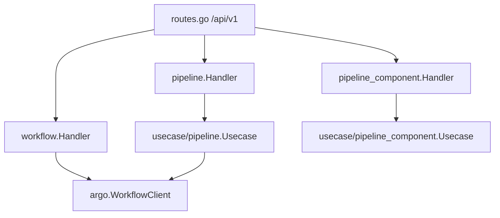
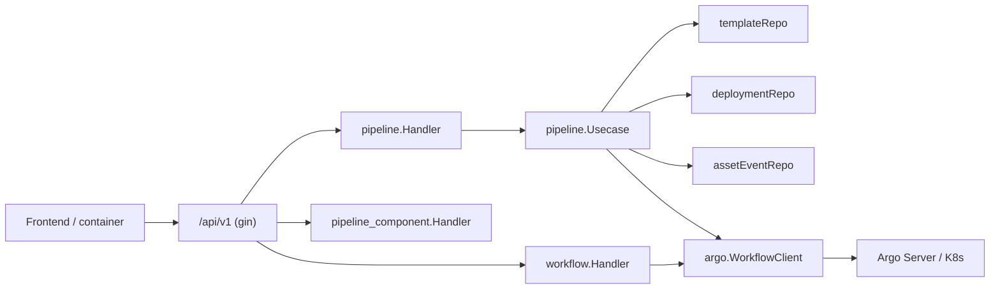
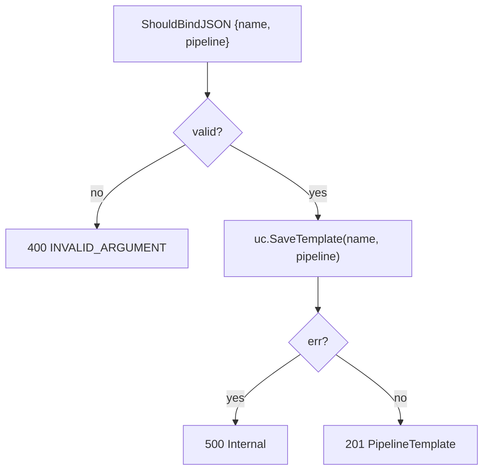
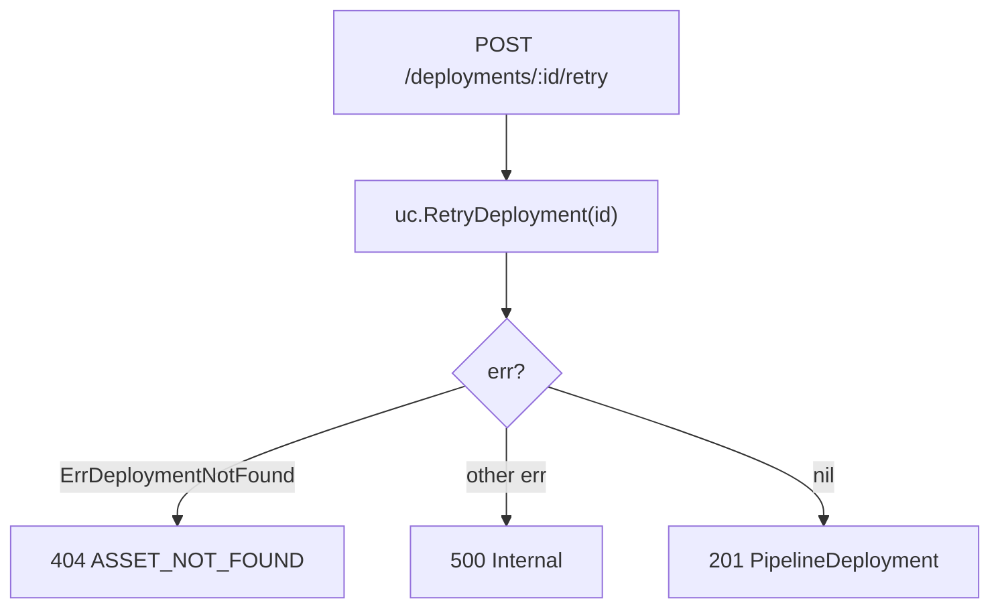
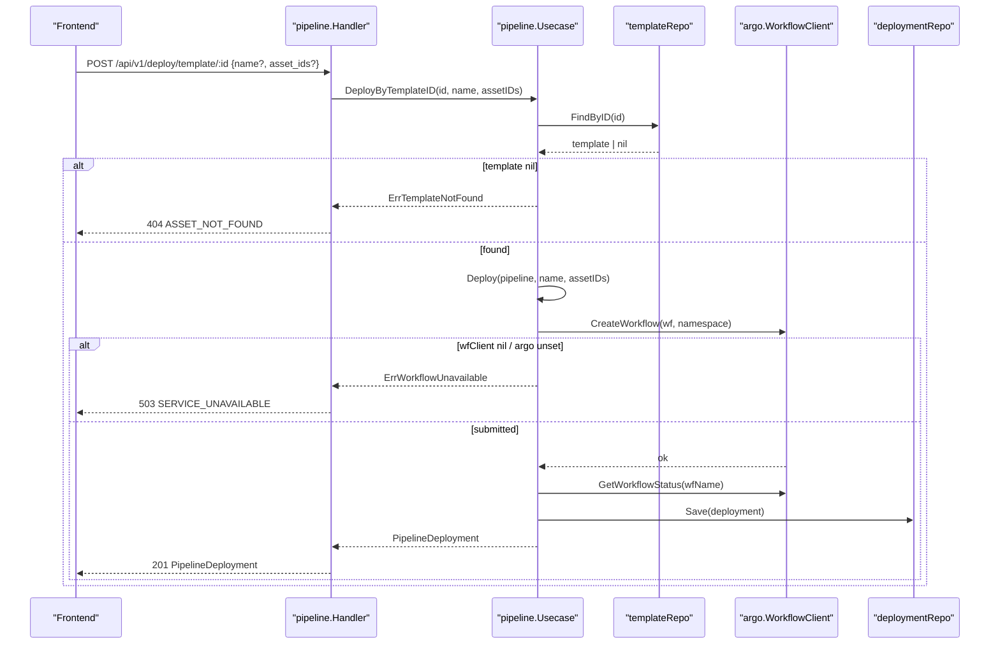
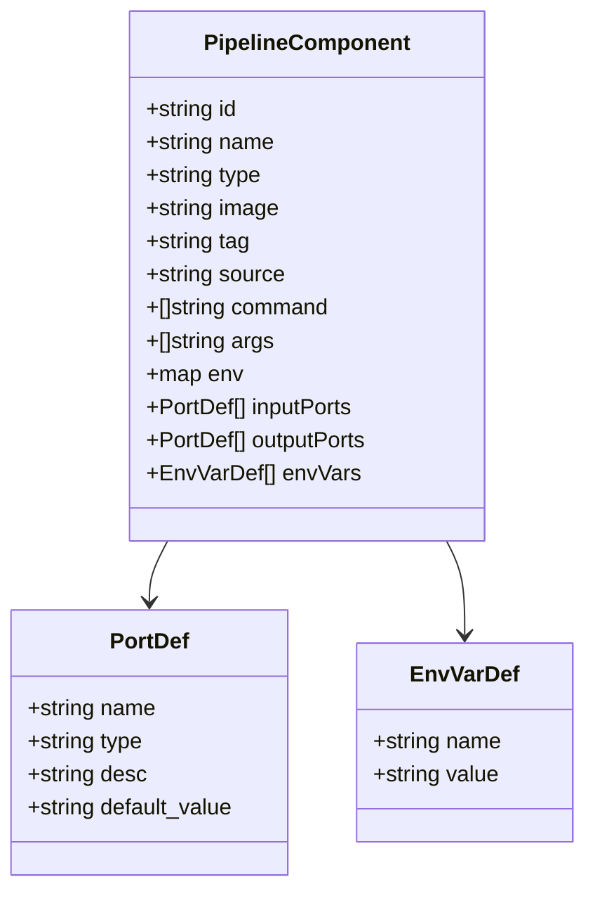
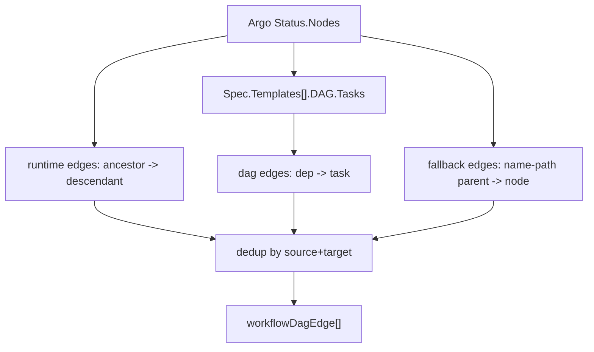
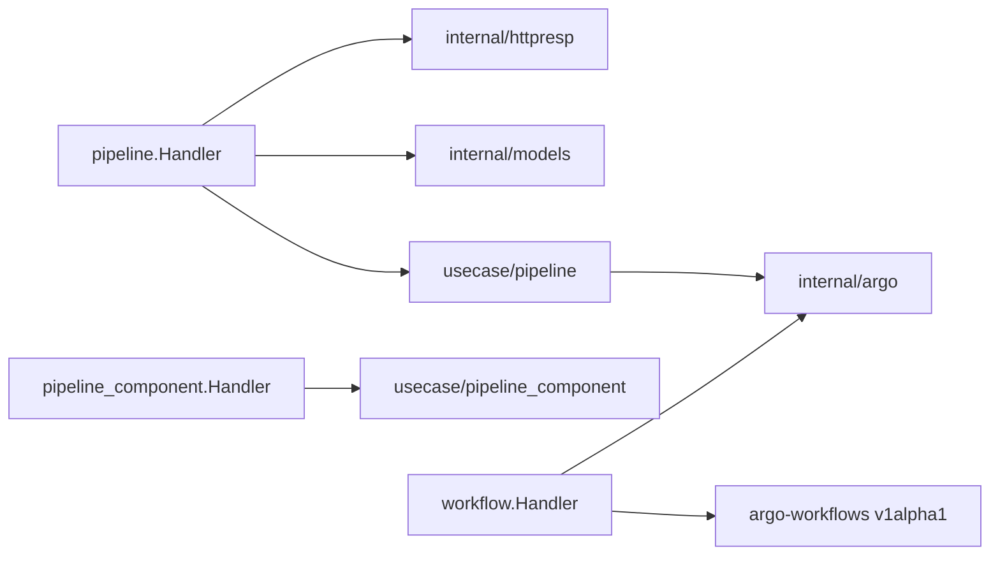

# Pipeline & Workflow API

<cite>
**Referenced Files in This Document**

- [api/openapi.yaml](file://api/openapi.yaml)
- [backend/routes/routes.go](file://backend/routes/routes.go)
- [backend/internal/handlers/pipeline/handler.go](file://backend/internal/handlers/pipeline/handler.go)
- [backend/internal/handlers/pipeline_component/handler.go](file://backend/internal/handlers/pipeline_component/handler.go)
- [backend/internal/handlers/workflow/handler.go](file://backend/internal/handlers/workflow/handler.go)
- [backend/internal/handlers/workflow/dag_edges.go](file://backend/internal/handlers/workflow/dag_edges.go)
- [backend/internal/handlers/workflow/logs_sse.go](file://backend/internal/handlers/workflow/logs_sse.go)
- [backend/internal/handlers/workflow/query_time.go](file://backend/internal/handlers/workflow/query_time.go)
- [backend/internal/usecase/pipeline/usecase.go](file://backend/internal/usecase/pipeline/usecase.go)
</cite>

## Table of Contents
1. [Introduction](#introduction)
2. [Project Structure](#project-structure)
3. [Core Components](#core-components)
4. [Architecture Overview](#architecture-overview)
5. [Detailed Component Analysis](#detailed-component-analysis)
6. [Dependency Analysis](#dependency-analysis)
7. [Performance Considerations](#performance-considerations)
8. [Troubleshooting Guide](#troubleshooting-guide)
9. [Conclusion](#conclusion)
10. [Appendices](#appendices)

## Introduction

The Pipeline & Workflow API is the largest surface in the cyber-databrew backend.
It groups every HTTP endpoint that lets clients author reusable **pipeline
templates**, **deploy** those templates (or inline definitions) to the Argo
Workflows engine, manage the resulting **deployments** (retry / stop / delete /
save-as-template), register reusable **pipeline components**, and read the
**Argo workflows** that back each deployment (list / detail with DAG / node
logs). All operations are exposed under the `/api/v1` prefix and carry the
`Pipeline` OpenAPI tag.

Conceptually the area spans three layers:

- A pipeline is a graph of **components** (containers / scripts / resources /
  suspend steps) connected by edges.
- A **template** captures a named, versioned snapshot of that graph.
- A **deployment** transpiles a template (or inline pipeline) into an Argo
  `Workflow` manifest, submits it to Kubernetes via the Argo server, and records
  a `PipelineDeployment` row linking the deployment to its `workflowName`.

Callers are the databrew frontend (pipeline editor, deployment dashboard,
workflow monitor) and pipeline containers themselves, which call back to
`POST /api/v1/pipeline-assets` to register their outputs for lineage.

**Section sources**
- [api/openapi.yaml](file://api/openapi.yaml#L53-L54)
- [backend/internal/handlers/pipeline/handler.go](file://backend/internal/handlers/pipeline/handler.go#L24-L41)
- [backend/internal/usecase/pipeline/usecase.go](file://backend/internal/usecase/pipeline/usecase.go#L246-L303)

## Project Structure

The API is implemented across three handler packages, all driven from a single
route block. Each handler is a thin HTTP adapter that binds/validates the
request, delegates to a usecase, and maps domain errors to `httpresp` helpers.

- `backend/internal/handlers/pipeline/handler.go` — templates, deploy,
  deployments, resource usage, diff, lineage, and the container output callback.
- `backend/internal/handlers/pipeline_component/handler.go` — the component
  registry CRUD.
- `backend/internal/handlers/workflow/` — Argo workflow reads and (in code)
  mutations:
  - `handler.go` — list/detail/logs plus the `workflowOperation` helper.
  - `dag_edges.go` — normalizes Argo node graphs into renderable DAG edges.
  - `logs_sse.go` — server-sent-events log streaming.
  - `query_time.go` — RFC3339 query-param parsing for time filters.
- `backend/routes/routes.go` — registers the live routes (lines 315–346).

**Diagram sources**
- [backend/routes/routes.go](file://backend/routes/routes.go#L315-L346)
- [backend/internal/handlers/pipeline/handler.go](file://backend/internal/handlers/pipeline/handler.go#L16-L22)
- [backend/internal/handlers/workflow/handler.go](file://backend/internal/handlers/workflow/handler.go#L17-L24)

**Section sources**
- [backend/routes/routes.go](file://backend/routes/routes.go#L315-L346)
- [backend/internal/handlers/pipeline_component/handler.go](file://backend/internal/handlers/pipeline_component/handler.go#L13-L19)

## Core Components

| Component | Type | Role |
| --- | --- | --- |
| `pipeline.Handler` | HTTP handler | Wraps `usecase/pipeline.Usecase`; owns templates, deploy, deployments, lineage |
| `pipeline_component.Handler` | HTTP handler | Wraps `usecase/pipeline_component.Usecase`; component registry CRUD |
| `workflow.Handler` | HTTP handler | Holds an `argo.WorkflowClient` and a default `namespace`; reads Argo workflows |
| `mapDeployError` | error mapper | Translates deploy usecase errors to 404 / 400 / 503 |
| `writeComponentError` | error mapper | String-matches component usecase errors to 404 / 400 |
| `buildWorkflowDagEdges` | helper | Builds normalized `runtime` / `dag` / `fallback` edges from an Argo workflow |
| `parseRFC3339QueryParam` | helper | Parses `createdAfter` / `finishedBefore` RFC3339 query filters |

The pipeline handler constructor takes only the usecase, keeping the handler
stateless beyond its dependency. The workflow handler additionally carries the
configured Argo `namespace`, overridable per-request via the gin context key
`namespace` through `namespaceFor`.

**Section sources**
- [backend/internal/handlers/pipeline/handler.go](file://backend/internal/handlers/pipeline/handler.go#L16-L22)
- [backend/internal/handlers/pipeline/handler.go](file://backend/internal/handlers/pipeline/handler.go#L213-L227)
- [backend/internal/handlers/pipeline_component/handler.go](file://backend/internal/handlers/pipeline_component/handler.go#L104-L116)
- [backend/internal/handlers/workflow/handler.go](file://backend/internal/handlers/workflow/handler.go#L264-L269)

## Architecture Overview

Every request flows handler → usecase → repository / Argo client. The pipeline
handler talks to a single `pipelineUC.Usecase` that owns persistence and the
Argo client; the workflow handler talks to the Argo client directly for live
cluster state. Deployments are the bridge: a `PipelineDeployment` row stores the
`workflowName`, so workflow reads can be correlated to deployments.

**Diagram sources**
- [backend/internal/handlers/pipeline/handler.go](file://backend/internal/handlers/pipeline/handler.go#L110-L163)
- [backend/internal/usecase/pipeline/usecase.go](file://backend/internal/usecase/pipeline/usecase.go#L246-L303)
- [backend/internal/handlers/workflow/handler.go](file://backend/internal/handlers/workflow/handler.go#L49-L53)

## Detailed Component Analysis

### Pipelines & Templates

Templates are the durable, versioned definition of a pipeline graph.

**`POST /api/v1/pipelines` — SaveTemplate.** Binds `{name, pipeline}` (both
required); on success returns `201` with a `PipelineTemplate`. Invalid bodies
yield `400 INVALID_ARGUMENT`.

**`GET /api/v1/pipelines` — ListTemplates.** Returns `{items: [PipelineTemplate]}`;
a nil result is normalized to an empty array so the field is always present.

**`GET /api/v1/pipelines/:id` — GetTemplate.** Returns the template or
`404 ASSET_NOT_FOUND` when the usecase returns nil.

**`DELETE /api/v1/pipelines/:id` — DeleteTemplate.** Returns `204` on success.

**`GET /api/v1/pipelines/:id/versions` — ListVersions.** The `:id` param is
treated as the template **name** (not ID) and returns all versions for that
name as `{items: [...]}`.

**`GET /api/v1/pipelines/:id/diff/:id2` — DiffTemplates.** Returns a structural
diff (added/removed/modified nodes and edges) between two templates; `404` if
either template is missing.

**Diagram sources**
- [backend/internal/handlers/pipeline/handler.go](file://backend/internal/handlers/pipeline/handler.go#L24-L41)

**Section sources**
- [backend/internal/handlers/pipeline/handler.go](file://backend/internal/handlers/pipeline/handler.go#L24-L108)
- [backend/internal/handlers/pipeline/handler.go](file://backend/internal/handlers/pipeline/handler.go#L311-L330)
- [api/openapi.yaml](file://api/openapi.yaml#L4169-L4279)

### Deployments

A deployment turns a pipeline into a running Argo workflow.

**`POST /api/v1/deploy` — Deploy.** Binds `{pipeline (required), name, asset_ids}`.
A `dryRun=true` query param (parsed with `strconv.ParseBool`; invalid values are
`400`) returns the transpiled manifest with status `Preview` at `200` without
submitting a workflow. A normal deploy submits to Argo and returns `201` with a
`PipelineDeployment`. Errors are routed through `mapDeployError`.

**`POST /api/v1/deploy/template/:id` — DeployByTemplate.** The recommended path.
The body (`{name, asset_ids}`) is optional. The usecase loads the template,
defaults the name to the template's name, then delegates to `Deploy` with the
template ID attached. Returns `201`; `404` when the template is missing.

**`GET /api/v1/deployments` / `GET /api/v1/deployments/:id`** — list and detail,
with nil-list normalization and `404` for a missing deployment.

**`DELETE /api/v1/deployments/:id`** — `204` on success.

**`POST /api/v1/deployments/:id/retry` — RetryDeployment.** Re-submits the Argo
workflow; intended for `failed`/`stopped` deployments. Returns `201`; `404` on
`ErrDeploymentNotFound`.

**`POST /api/v1/deployments/:id/stop` — StopDeployment.** Terminates the
underlying Argo workflow via `wfClient.StopWorkflow` and returns
`200 {"message": "workflow stopped"}`; `404` when unknown.

**`POST /api/v1/deployments/:id/save-template` — SaveFromDeployment.** Creates a
new template from the deployment's stored `pipelineJSON`; the name defaults to
`<pipelineName>-from-deployment`. Returns `201`.

**`GET /api/v1/deployments/:id/resources` — GetResourceUsage.** Returns per-pod
CPU/memory usage vs requests/limits.

**Diagram sources**
- [backend/internal/handlers/pipeline/handler.go](file://backend/internal/handlers/pipeline/handler.go#L229-L264)

**Section sources**
- [backend/internal/handlers/pipeline/handler.go](file://backend/internal/handlers/pipeline/handler.go#L110-L309)
- [backend/internal/usecase/pipeline/usecase.go](file://backend/internal/usecase/pipeline/usecase.go#L305-L337)
- [api/openapi.yaml](file://api/openapi.yaml#L4282-L4491)

#### Deploy-by-template sequence

**Diagram sources**
- [backend/internal/handlers/pipeline/handler.go](file://backend/internal/handlers/pipeline/handler.go#L143-L163)
- [backend/internal/usecase/pipeline/usecase.go](file://backend/internal/usecase/pipeline/usecase.go#L246-L318)
- [backend/internal/handlers/pipeline/handler.go](file://backend/internal/handlers/pipeline/handler.go#L213-L227)

### Pipeline Components

The component registry stores reusable building blocks. The live routes are
under `/api/v1/pipeline-components`; `/api/v1/components` is a deprecated
compatibility alias documented in OpenAPI. Note: the handler's Go doc-comments
reference `/components`, but `routes.go` wires the handler methods under
`/pipeline-components` (lines 336–340).

**`POST /api/v1/pipeline-components` — CreateComponent.** Binds a full
`PipelineComponent`; returns `201`. Validation/typing errors are mapped by
`writeComponentError`.

**`GET /api/v1/pipeline-components?q=&source=` — ListComponents.** Optional
case-insensitive `q` name search and `source` filter; nil-list normalized.

**`GET /api/v1/pipeline-components/:id` — GetComponent.** `404` when nil.

**`PUT /api/v1/pipeline-components/:id` — UpdateComponent.** Forces the path `id`
onto the body before update; returns `200` with the updated component.

**`DELETE /api/v1/pipeline-components/:id` — DeleteComponent.** `204` on success.

`writeComponentError` string-matches the usecase error: `"not found"` → `404`;
`"required"` / `"type must be"` / `"system components cannot"` → `400`;
otherwise `500`.

**Diagram sources**
- [api/openapi.yaml](file://api/openapi.yaml#L1652-L1730)

**Section sources**
- [backend/internal/handlers/pipeline_component/handler.go](file://backend/internal/handlers/pipeline_component/handler.go#L21-L116)
- [backend/routes/routes.go](file://backend/routes/routes.go#L334-L341)
- [api/openapi.yaml](file://api/openapi.yaml#L4493-L4683)

### Workflow Reads

The workflow handler exposes live Argo state. Only three routes are wired in
`routes.go`: list, detail, and node logs.

**`GET /api/v1/workflows` — ListWorkflows.** Lists workflows in the namespace
and filters in-process by `name` (case-insensitive substring), `status`
(exact `wf.Status.Phase`), repeated `label=key=value` pairs, and the RFC3339
time bounds `createdAfter` / `finishedBefore`. Each item carries `name`,
`status`, `nodeCount`, `createdAt`, optional `finishedAt`, and `labels`. Time
filters are parsed by `parseRFC3339QueryParam`, which short-circuits with a
`400` on malformed input.

**`GET /api/v1/workflows/:name` — GetWorkflow.** Returns the full workflow:
flattened `nodes`, normalized DAG `edges`, status, message, labels, progress,
and timestamps. Missing workflows map to `404 WORKFLOW_NOT_FOUND` via
`argo.ErrNotFound`.

**`GET /api/v1/workflows/:name/logs?nodeId=xxx` — GetWorkflowLogs.** Returns
`{logs: string}` for a single node; both `name` and `nodeId` are required
(`400` otherwise).

A `StreamWorkflowLogs` SSE handler (`GET .../log/stream`) and the workflow
mutation handlers (retry, resubmit, suspend, resume, terminate, stop, delete)
exist in code but are **not currently registered** in `routes.go`; the OpenAPI
spec documents the mutation paths under the `Pipeline` tag for forward
compatibility. The shared `workflowOperation` helper returns `200 {"message":
"ok"}`.

#### DAG edge normalization

`buildWorkflowDagEdges` produces three edge kinds from the Argo node graph:
`runtime` (from each node's resolved-visible ancestor to each child's
resolved-visible descendant), `dag` (from the spec's DAG task dependencies,
preserving logical edges such as failed-upstream → omitted-downstream), and
`fallback` (name-path parent edges for displayable nodes that gained none of
the above). Edges are deduplicated by `source\x00target` and given a stable
`e-<source>-<target>` ID. Only "displayable" nodes (pods, templates, skipped or
omitted phases, excluding root DAG nodes) participate.

**Diagram sources**
- [backend/internal/handlers/workflow/dag_edges.go](file://backend/internal/handlers/workflow/dag_edges.go#L17-L88)

**Section sources**
- [backend/internal/handlers/workflow/handler.go](file://backend/internal/handlers/workflow/handler.go#L27-L214)
- [backend/internal/handlers/workflow/handler.go](file://backend/internal/handlers/workflow/handler.go#L216-L262)
- [backend/internal/handlers/workflow/dag_edges.go](file://backend/internal/handlers/workflow/dag_edges.go#L99-L216)
- [backend/internal/handlers/workflow/query_time.go](file://backend/internal/handlers/workflow/query_time.go#L12-L26)

#### Workflow log streaming (SSE)

`StreamWorkflowLogs` validates `name`+`nodeId`, confirms the node exists in
`Status.Nodes` (else `400`), and opens an Argo log stream against the `main`
container, using the node ID as the pod name. On stream-open failure it falls
back to a one-shot `GetWorkflowLogs` fetch. Both paths set
`text/event-stream` headers (`no-cache`, `keep-alive`, `X-Accel-Buffering: no`)
and emit `data: <line>\n\n` frames. `extractLogLine` unwraps Argo's
`{result:{content,podName}}` JSON envelope; unparseable lines are forwarded raw.

**Section sources**
- [backend/internal/handlers/workflow/logs_sse.go](file://backend/internal/handlers/workflow/logs_sse.go#L24-L162)

### Container Output Callback & Lineage

**`POST /api/v1/pipeline-assets` — RegisterOutput.** Pipeline containers call
back to register processing results as new assets. Requires `deployment_id`
(explicitly checked after binding) and `storage_uri`. Returns `201` with the
new `Asset`; `404` when the deployment is unknown.

**`GET /api/v1/assets/:id/pipeline-lineage` — GetLineage.** Returns which
pipeline run/step produced the asset plus its input assets, derived from
`asset_events`.

**Section sources**
- [backend/internal/handlers/pipeline/handler.go](file://backend/internal/handlers/pipeline/handler.go#L332-L369)
- [api/openapi.yaml](file://api/openapi.yaml#L4035-L4130)

## Dependency Analysis

The pipeline handler depends on `usecase/pipeline`, `httpresp`, and `models`.
The workflow handler depends on the `argo` adapter and the upstream
`argo-workflows/v3` types (`wfv1.Workflow`, `NodeStatus`, `Nodes`). Error codes
referenced throughout come from `httpresp` (`CodeInvalidArgument`,
`CodeAssetNotFound`, `CodeServiceUnavailable`) and the usecase sentinel errors
(`ErrTemplateNotFound`, `ErrAssetNotFound`, `ErrWorkflowUnavailable`,
`ErrDeploymentNotFound`).

**Section sources**
- [backend/internal/handlers/pipeline/handler.go](file://backend/internal/handlers/pipeline/handler.go#L1-L14)
- [backend/internal/handlers/workflow/handler.go](file://backend/internal/handlers/workflow/handler.go#L1-L15)
- [backend/internal/usecase/pipeline/usecase.go](file://backend/internal/usecase/pipeline/usecase.go#L29-L29)

## Performance Considerations

- **In-process workflow filtering.** `ListWorkflows` fetches all workflows in
  the namespace from Argo and filters by name/status/label/time in Go. With
  large namespaces this is O(N) per call and has no server-side pagination.
- **Deployment status polling.** `ListDeployments` caps Argo status refreshes
  per call (`maxActiveDeploymentStatusRefresh = 50`) to bound the number of
  live Argo polls when many deployments are active.
- **Node flattening.** `GetWorkflow` materializes every node in `Status.Nodes`
  into a `nodeItem` and recomputes DAG edges on each request; cost scales with
  workflow size.
- **Log streaming buffer.** The SSE scanner uses a 10 MiB max token buffer to
  tolerate long log lines without truncation.
- **Dry-run path.** `POST /deploy?dryRun=true` returns the transpiled manifest
  without touching Argo or the deployment repo, making it cheap for validation.

**Section sources**
- [backend/internal/handlers/workflow/handler.go](file://backend/internal/handlers/workflow/handler.go#L49-L116)
- [backend/internal/handlers/workflow/logs_sse.go](file://backend/internal/handlers/workflow/logs_sse.go#L54-L55)
- [backend/internal/usecase/pipeline/usecase.go](file://backend/internal/usecase/pipeline/usecase.go#L341-L349)

## Troubleshooting Guide

| Symptom | Likely cause | Where to look |
| --- | --- | --- |
| `400 INVALID_ARGUMENT` on save/deploy | Missing required `name`/`pipeline`, or malformed `dryRun` bool | `SaveTemplate` / `Deploy` binding |
| `503 SERVICE_UNAVAILABLE` on deploy | Argo server not configured (`wfClient == nil` or empty URL) | `ErrWorkflowUnavailable` mapping |
| `404 ASSET_NOT_FOUND` on deploy-by-template | Template ID does not exist | `DeployByTemplateID` → `ErrTemplateNotFound` |
| `404 WORKFLOW_NOT_FOUND` on workflow detail | Workflow absent from namespace | `GetWorkflow` → `argo.ErrNotFound` |
| Empty / 400 on logs | Missing `nodeId` query param | `GetWorkflowLogs` / `StreamWorkflowLogs` |
| Workflow mutation returns 404 (route) | retry/stop/etc. handlers are not registered in `routes.go` | use deployment-level `/deployments/:id/stop` and `/retry` instead |
| Missing edges in DAG view | Node not "displayable" (root DAG node or non-pod/template) | `isWorkflowDagDisplayableNode` |
| `400` registering output | `deployment_id` empty or body invalid | `RegisterOutput` guard |

When a deploy fails, `mapDeployError` is the single funnel: `ErrTemplateNotFound`
→ 404, `ErrAssetNotFound` → 400, `ErrWorkflowUnavailable` → 503, everything else
→ 500.

**Section sources**
- [backend/internal/handlers/pipeline/handler.go](file://backend/internal/handlers/pipeline/handler.go#L213-L227)
- [backend/internal/handlers/workflow/handler.go](file://backend/internal/handlers/workflow/handler.go#L119-L213)
- [backend/internal/handlers/pipeline_component/handler.go](file://backend/internal/handlers/pipeline_component/handler.go#L104-L116)

## Conclusion

The Pipeline & Workflow API cleanly separates authoring (templates,
components), execution (deploy / deployments), and observation (Argo workflow
reads). Handlers stay thin and delegate to usecases, with consistent
`httpresp` error mapping. The deployment record is the linchpin connecting a
saved template to a live Argo workflow, and the DAG-edge normalizer plus SSE
log streamer make the workflow monitor render real cluster state. The most
common gotcha is that several workflow mutation handlers are implemented but
not yet wired into routes; deployment-level retry/stop are the supported
controls today.

## Appendices

### A. Live endpoint reference (registered in routes.go)

| Method | Path | Handler | Success |
| --- | --- | --- | --- |
| POST | `/api/v1/pipelines` | SaveTemplate | 201 |
| GET | `/api/v1/pipelines` | ListTemplates | 200 |
| GET | `/api/v1/pipelines/:id` | GetTemplate | 200 / 404 |
| DELETE | `/api/v1/pipelines/:id` | DeleteTemplate | 204 / 404 |
| GET | `/api/v1/pipelines/:id/versions` | ListVersions | 200 |
| GET | `/api/v1/pipelines/:id/diff/:id2` | DiffTemplates | 200 / 404 |
| POST | `/api/v1/deploy` | Deploy | 201 (200 dry-run) |
| POST | `/api/v1/deploy/template/:id` | DeployByTemplate | 201 / 404 |
| GET | `/api/v1/deployments` | ListDeployments | 200 |
| GET | `/api/v1/deployments/:id` | GetDeployment | 200 / 404 |
| GET | `/api/v1/deployments/:id/resources` | GetResourceUsage | 200 / 404 |
| POST | `/api/v1/deployments/:id/retry` | RetryDeployment | 201 / 404 |
| POST | `/api/v1/deployments/:id/stop` | StopDeployment | 200 / 404 |
| POST | `/api/v1/deployments/:id/save-template` | SaveFromDeployment | 201 / 404 |
| DELETE | `/api/v1/deployments/:id` | DeleteDeployment | 204 / 404 |
| POST | `/api/v1/pipeline-assets` | RegisterOutput | 201 / 400 / 404 |
| GET | `/api/v1/assets/:id/pipeline-lineage` | GetLineage | 200 |
| POST | `/api/v1/pipeline-components` | CreateComponent | 201 / 400 |
| GET | `/api/v1/pipeline-components` | ListComponents | 200 |
| GET | `/api/v1/pipeline-components/:id` | GetComponent | 200 / 404 |
| PUT | `/api/v1/pipeline-components/:id` | UpdateComponent | 200 / 404 |
| DELETE | `/api/v1/pipeline-components/:id` | DeleteComponent | 204 / 404 |
| GET | `/api/v1/workflows` | ListWorkflows | 200 |
| GET | `/api/v1/workflows/:name` | GetWorkflow | 200 / 404 |
| GET | `/api/v1/workflows/:name/logs` | GetWorkflowLogs | 200 / 400 / 404 |

**Section sources**
- [backend/routes/routes.go](file://backend/routes/routes.go#L315-L346)

### B. Implemented-but-unrouted / documented endpoints

| Method | Path | Status |
| --- | --- | --- |
| GET | `/api/v1/workflows/:name/log/stream` | `StreamWorkflowLogs` handler exists; not in routes |
| POST | `/api/v1/workflows/:name/retry` | handler + OpenAPI; not in routes |
| POST | `/api/v1/workflows/:name/resubmit` | handler + OpenAPI; not in routes |
| POST | `/api/v1/workflows/:name/suspend` | handler + OpenAPI; not in routes |
| POST | `/api/v1/workflows/:name/resume` | handler + OpenAPI; not in routes |
| POST | `/api/v1/workflows/:name/terminate` | handler + OpenAPI; not in routes |
| DELETE | `/api/v1/workflows/:name` | handler + OpenAPI; not in routes |
| GET/POST/PUT/DELETE | `/api/v1/components`, `/api/v1/components/:id` | deprecated OpenAPI alias |

**Section sources**
- [backend/internal/handlers/workflow/handler.go](file://backend/internal/handlers/workflow/handler.go#L216-L262)
- [backend/internal/handlers/workflow/logs_sse.go](file://backend/internal/handlers/workflow/logs_sse.go#L98-L106)
- [api/openapi.yaml](file://api/openapi.yaml#L4591-L4683)
- [api/openapi.yaml](file://api/openapi.yaml#L4728-L4858)

### C. Key schemas

- **PipelineTemplate** — `id`, `name`, `version`, `pipeline`, `nodeCount`,
  `createdAt`, `updatedAt`.
- **PipelineDeployment** — `id`, `templateId?`, `pipelineName`, `workflowName`,
  `status`, `nodeCount`, `manifest?`, `pipelineJSON?`, `createdAt`, `updatedAt`,
  `finishedAt?`.
- **PipelineComponent / PipelineComponentRequest** — `name`, `type`
  (`container | script | resource | suspend`), `image`, `tag`, `source`,
  `command`, `args`, `env`, `inputPorts`/`outputPorts` (`PortDef`), `resources`,
  `envVars` (`EnvVarDef`). Request requires `name`, `type`, `image`.
- **WorkflowSummary** — `name`, `status`, `nodeCount`, `createdAt`, `finishedAt?`.
- **WorkflowDetail** — `name`, `status`, `message`, `labels`,
  `estimatedDuration`, `progress`, `nodes` (`WorkflowNodeStatus`), `edges`
  (`WorkflowDagEdge`), timestamps.
- **WorkflowDagEdge** — `id`, `source`, `target`, `kind`
  (`runtime | dag | fallback`).

**Section sources**
- [api/openapi.yaml](file://api/openapi.yaml#L1623-L1768)
