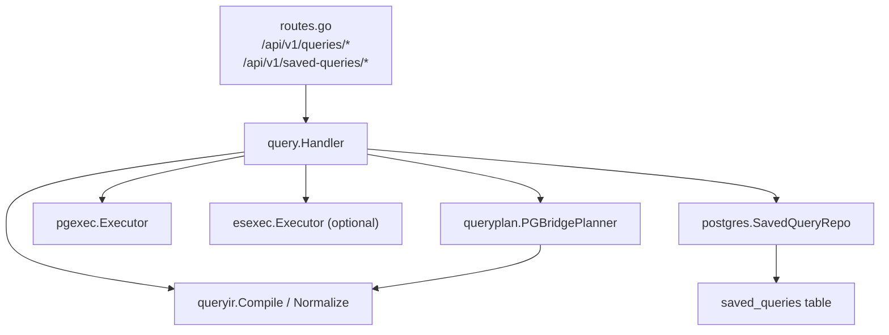
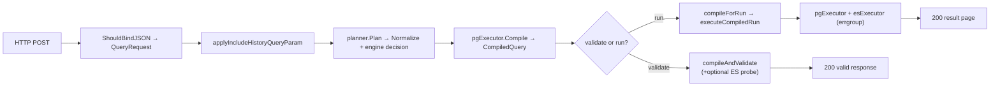
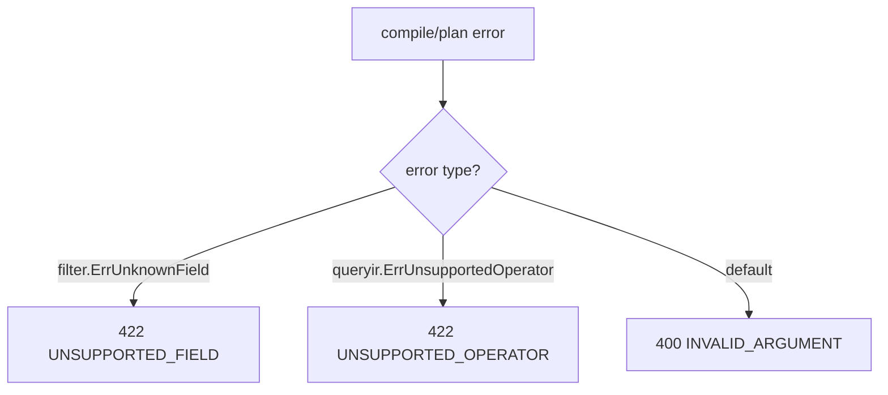
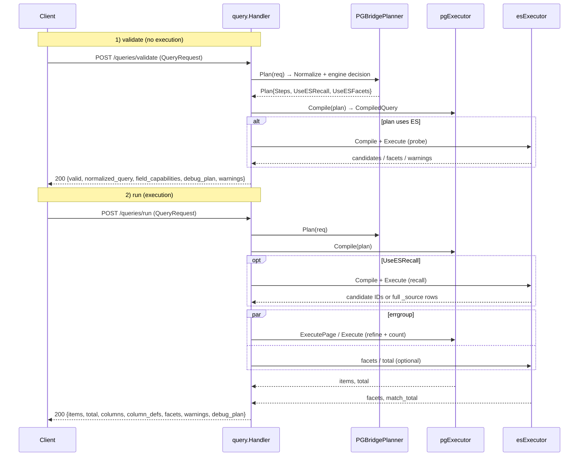
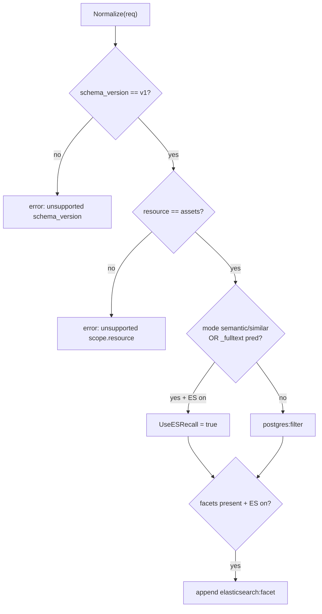
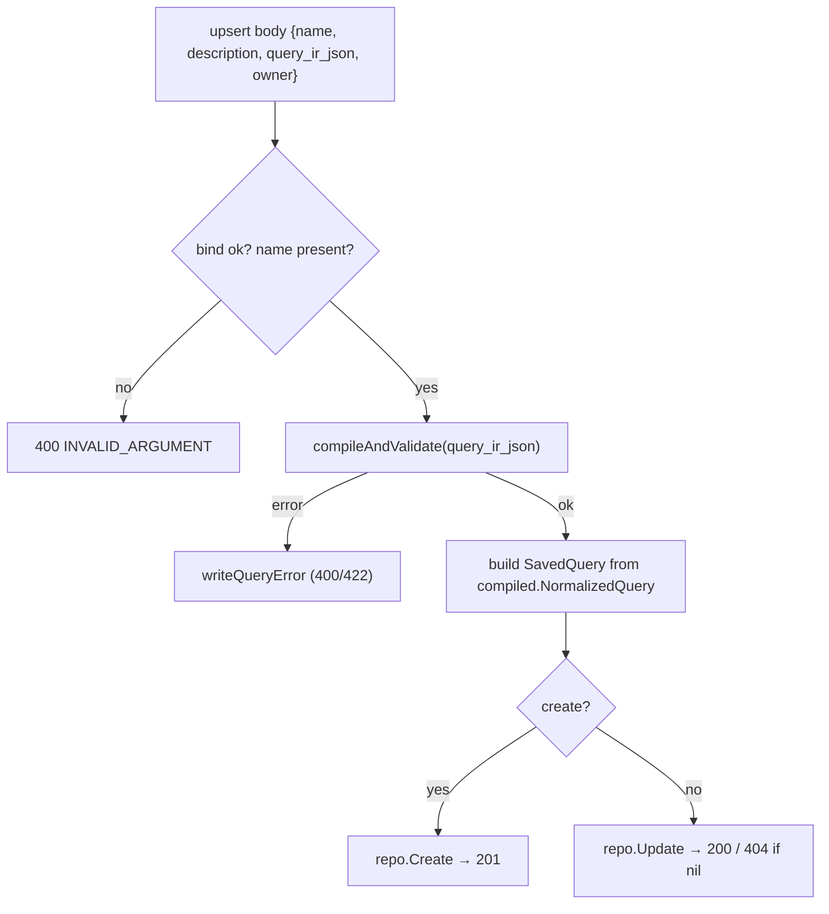
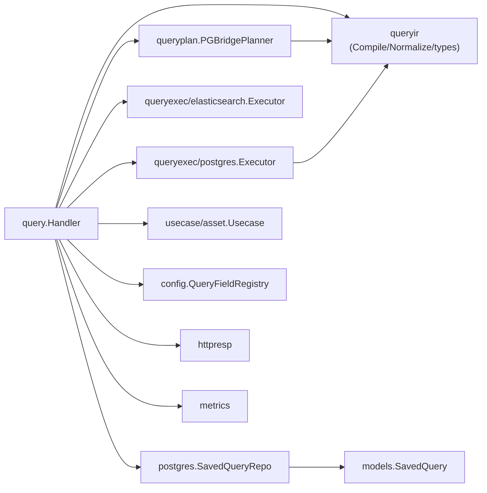

# Query Workbench API

<cite>
**Referenced Files in This Document**

- [api/openapi.yaml](file://api/openapi.yaml)
- [backend/internal/handlers/query/handler.go](file://backend/internal/handlers/query/handler.go)
- [backend/internal/queryir/types.go](file://backend/internal/queryir/types.go)
- [backend/internal/queryir/compile.go](file://backend/internal/queryir/compile.go)
- [backend/internal/queryplan/planner.go](file://backend/internal/queryplan/planner.go)
- [backend/internal/models/saved_query.go](file://backend/internal/models/saved_query.go)
- [backend/internal/postgres/saved_queries.go](file://backend/internal/postgres/saved_queries.go)
- [backend/routes/routes.go](file://backend/routes/routes.go)
</cite>

## Table of Contents
1. [Introduction](#introduction)
2. [Project Structure](#project-structure)
3. [Core Components](#core-components)
4. [Architecture Overview](#architecture-overview)
5. [Detailed Component Analysis](#detailed-component-analysis)
6. [Dependency Analysis](#dependency-analysis)
7. [Performance Considerations](#performance-considerations)
8. [Troubleshooting Guide](#troubleshooting-guide)
9. [Conclusion](#conclusion)
10. [Appendices](#appendices)

## Introduction

The **Query Workbench API** is the public, versioned surface that lets the
frontend workbench and external API consumers express asset queries as a
structured **Query IR** (intermediate representation) rather than as ad-hoc
URL filter strings. A single JSON envelope — the `QueryRequest` — carries the
schema version, the query mode, the resource scope, the projected columns, a
recursive boolean `where` tree, sort, paging, facets, and a debug flag. The API
exposes two verbs over this envelope:

- `POST /api/v1/queries/validate` — compile and validate an IR **without
  executing** it. Returns the normalized query, field capabilities, warnings,
  and the debug plan. This powers live editor feedback in the workbench.
- `POST /api/v1/queries/run` — compile, plan, and **execute** the IR against
  the asset store, returning a page of result rows, a total count, column
  definitions, facets, warnings, and the debug plan.

A second resource group, **Saved Queries** (`/api/v1/saved-queries`), persists
named IR documents so users can store, list, retrieve, update, and delete
reusable queries. Every write to a saved query re-validates its embedded IR
through the same compile path, so a stored query is always a query the engine
can run.

The engine is a **PG-bridge planner**: PostgreSQL is the system of record and
the default execution engine, while Elasticsearch is an optional accelerator
used for full-text recall and facets. The IR therefore degrades gracefully —
if Elasticsearch is unavailable or cannot compile a clause, execution falls
back to a PostgreSQL-only scan and a warning is surfaced.

**Section sources**
- [backend/internal/handlers/query/handler.go](file://backend/internal/handlers/query/handler.go#L53-L124)
- [backend/routes/routes.go](file://backend/routes/routes.go#L358-L366)

## Project Structure

The Query Workbench feature is split across four backend packages plus the
route wiring and the OpenAPI contract.

- **`backend/internal/handlers/query/handler.go`** — the HTTP layer. Binds the
  request body, applies the `include_history` query param, drives the
  compile/plan/execute pipeline, maps domain errors to HTTP codes, and
  implements all five saved-query handlers.
- **`backend/internal/queryir/types.go`** — the IR type definitions:
  `QueryRequest`, `QueryScope`, `QuerySelect`, `QueryExpr`, `QueryPredicate`,
  `CompiledQuery`, `DebugPlan`, and result helpers.
- **`backend/internal/queryir/compile.go`** — normalization, validation,
  leaf-operator allow-list, sort compilation, page normalization, and field
  capability collection.
- **`backend/internal/queryplan/planner.go`** — the `PGBridgePlanner`, which
  decides whether to use Elasticsearch recall/facets and emits the debug plan
  steps.
- **`backend/internal/postgres/saved_queries.go`** + **`backend/internal/models/saved_query.go`**
  — persistence and model for saved queries.
- **`backend/routes/routes.go`** — mounts the seven endpoints under
  `/api/v1`, guarded by a non-nil `queryHandler`.
- **`api/openapi.yaml`** — the published contract (schemas and status codes).



**Diagram sources**
- [backend/internal/handlers/query/handler.go](file://backend/internal/handlers/query/handler.go#L27-L45)
- [backend/routes/routes.go](file://backend/routes/routes.go#L358-L366)

**Section sources**
- [backend/internal/handlers/query/handler.go](file://backend/internal/handlers/query/handler.go#L1-L45)
- [backend/routes/routes.go](file://backend/routes/routes.go#L358-L366)

## Core Components

### The `Handler` type

The `query.Handler` aggregates everything the endpoints need: the asset
use-case (for PG execution), the field registry (for engine capability
lookups), the PG-bridge planner, the PostgreSQL and Elasticsearch executors,
and the saved-query repository. The constructor wires the planner with a flag
indicating whether an Elasticsearch client is present, and creates an ES
executor that may be a no-op when `esClient` is nil.

```go
type Handler struct {
    assetUC       *assetUC.Usecase
    fieldRegistry *config.QueryFieldRegistry
    planner       *queryplan.PGBridgePlanner
    pgExecutor    *pgexec.Executor
    esExecutor    *esexec.Executor
    savedQueries  *postgres.SavedQueryRepo
}
```

**Section sources**
- [backend/internal/handlers/query/handler.go](file://backend/internal/handlers/query/handler.go#L27-L45)

### The Query IR envelope

`QueryRequest` is the canonical v1 envelope. Note that the live IR shape is
richer than the simplified OpenAPI sketch: `where` is a **recursive boolean
tree** built from `and` / `or` / `not` / `pred` nodes, sort uses `direction`
(not `order`), and the debug toggle is `debug.explain`.

| Field            | JSON key         | Type                | Notes |
|------------------|------------------|---------------------|-------|
| Schema version   | `schema_version` | string (required)   | Must normalize to `v1`. |
| Mode             | `mode`           | string              | `""`, `semantic`, or `similar`; lower-cased. |
| Scope            | `scope`          | object              | `resource` (must be `assets`), `include_history`. |
| Select           | `select`         | object              | `fields`: array of column names. |
| Where            | `where`          | object (recursive)  | One of `and[]`, `or[]`, `not`, `pred`. |
| Sort             | `sort`           | array               | `field` + `direction` (`asc`/`desc`). |
| Page             | `page`           | object              | `page`/`page_size` or `offset`/`limit`. |
| Facets           | `facets`         | array               | `field` + `size`. |
| Debug            | `debug`          | object              | `explain` boolean. |

**Section sources**
- [backend/internal/queryir/types.go](file://backend/internal/queryir/types.go#L3-L59)

### The `where` predicate tree

A `QueryExpr` node sets **exactly one** of `and`, `or`, `not`, or `pred`. A
leaf (`pred`) is a `QueryPredicate` with `field`, `op`, and `value`. The
supported leaf operators are a fixed allow-list:
`eq`, `ne`, `lt`, `gt`, `lte`, `gte`, `like`, `ilike`, `in`, `nin`,
`contains`, `between`. A predicate whose `field` is the reserved
`_fulltext` token triggers Elasticsearch recall.

**Section sources**
- [backend/internal/queryir/types.go](file://backend/internal/queryir/types.go#L48-L59)
- [backend/internal/queryir/compile.go](file://backend/internal/queryir/compile.go#L20-L33)

### Saved query model

A `SavedQuery` stores the validated, **normalized** IR as a JSONB document
(`query_ir_json`) alongside metadata (`name`, `description`, `resource`,
`schema_version`, `owner`, timestamps). The `resource` and `schema_version`
columns are derived from the compiled query, not taken verbatim from the
client.

**Section sources**
- [backend/internal/models/saved_query.go](file://backend/internal/models/saved_query.go#L5-L15)
- [backend/internal/handlers/query/handler.go](file://backend/internal/handlers/query/handler.go#L494-L504)

## Architecture Overview

Both `validate` and `run` share a common front half: bind the body, apply
`include_history`, normalize, and validate. `run` then plans, executes, and
shapes a result page. The planner decides the engine mix; the PG executor is
always invoked, with Elasticsearch layered in for recall and facets.



**Diagram sources**
- [backend/internal/handlers/query/handler.go](file://backend/internal/handlers/query/handler.go#L53-L124)
- [backend/internal/queryplan/planner.go](file://backend/internal/queryplan/planner.go#L24-L51)

**Section sources**
- [backend/internal/handlers/query/handler.go](file://backend/internal/handlers/query/handler.go#L126-L200)

## Detailed Component Analysis

### `POST /api/v1/queries/validate`

`Handler.Validate` binds the body into a `QueryRequest`. A bind failure returns
**400** with code `INVALID_ARGUMENT`. It then applies `include_history` and
calls `compileAndValidate`, which: plans the query, compiles it through the PG
executor, optionally probes Elasticsearch (when the plan calls for recall or
facets), and finally re-checks the `where` clause and sort resolution. On
success it returns **200** with `valid: true`, the normalized query, warnings,
field capabilities (resolved against the field registry), and the debug plan.

The `include_history` query parameter (`?include_history=true`) sets
`scope.include_history` on the request before compilation, allowing
non-current asset revisions to participate.

Error mapping is centralized in `writeQueryError`:



**Diagram sources**
- [backend/internal/handlers/query/handler.go](file://backend/internal/handlers/query/handler.go#L410-L419)

**Section sources**
- [backend/internal/handlers/query/handler.go](file://backend/internal/handlers/query/handler.go#L47-L74)
- [backend/internal/handlers/query/handler.go](file://backend/internal/handlers/query/handler.go#L126-L182)

### `POST /api/v1/queries/run`

`Handler.Run` is instrumented with Prometheus metrics for request count,
duration, and per-phase timing (`compile_validate`, `pg_refine`,
`es_recall`, `es_facet`, `es_total`). It binds the body (400 on failure,
outcome `bad_request`), then calls `compileForRun` — a leaner sibling of
`compileAndValidate` that plans, compiles, and validates the where/sort but
does **not** run the ES probe inline. A compile error sets outcome
`compile_error` and is mapped by `writeQueryError`.

Execution is delegated to `executeCompiledRun`. The successful response
(**200**) carries the result rows (`items`), the `total`, paging echo
(`page`, `page_size`, `offset`, `limit`), the requested `columns`, derived
`column_defs`, `facets`, `warnings`, and `debug_plan`. An execution failure
returns **500** (`httpresp.Internal`) with outcome `execute_error`.

**Section sources**
- [backend/internal/handlers/query/handler.go](file://backend/internal/handlers/query/handler.go#L76-L124)
- [backend/internal/handlers/query/handler.go](file://backend/internal/handlers/query/handler.go#L184-L200)

### Execution: the PG/ES bridge

`executeCompiledRun` orchestrates the two engines. It first applies ES recall
(`applyESRecall`): when the plan requires recall and ES is present, it compiles
the ES body, executes it, and either transfers candidate asset IDs to the PG
refine step or — when ES already returned full `_source` rows (e.g. >10k
matches where candidate transfer is skipped) — returns those normalized ES rows
directly. If ES recall reports zero matches, the result short-circuits to an
empty page (ES is the authoritative full-text oracle).

When falling back to PG, the handler runs the PG page query and an optional ES
facet/total query **concurrently** via `errgroup`. A subtle correctness detail:
the original request context is saved as `reqCtx` before `errgroup.WithContext`
derives a cancellable context, because the derived context is cancelled by
`eg.Wait()` — any post-`Wait` PG fallback must use `reqCtx` to avoid
`context canceled`. ES failures here are non-fatal: the code appends a warning
and uses the PostgreSQL count instead.

`canSkipPGCount` decides whether the expensive PG `COUNT(*)` can be avoided:
it can be skipped when there is no `where` clause and no ES candidate set, in
which case the total is taken from the ES `track_total_hits` watermark when
available.



**Diagram sources**
- [backend/internal/handlers/query/handler.go](file://backend/internal/handlers/query/handler.go#L212-L364)
- [backend/internal/queryplan/planner.go](file://backend/internal/queryplan/planner.go#L24-L51)

**Section sources**
- [backend/internal/handlers/query/handler.go](file://backend/internal/handlers/query/handler.go#L202-L364)

### The planner and engine decision

`PGBridgePlanner.Plan` normalizes the request, rejects any schema version other
than `v1` and any resource other than `assets`, then computes two booleans:
`UseESRecall` (when ES is configured and the query is `semantic`/`similar`
mode, or contains a `_fulltext` predicate) and `UseESFacets` (when ES is
configured and the request declares facets). It emits the matching debug plan
steps — `[postgres:filter]` by default, `[elasticsearch:recall, postgres:refine]`
for recall, with `elasticsearch:facet` appended when faceting.



**Diagram sources**
- [backend/internal/queryplan/planner.go](file://backend/internal/queryplan/planner.go#L24-L82)

**Section sources**
- [backend/internal/queryplan/planner.go](file://backend/internal/queryplan/planner.go#L24-L82)

### Compilation, normalization, and validation

`queryir.Compile` (and the shared `Normalize`) enforce the IR contract:

- **Normalize** trims and defaults `schema_version` to `v1`, lower-cases
  `mode`, trims `scope.resource`, recursively normalizes the `where` tree,
  trims/lower-cases sort entries, and normalizes paging.
- **Page normalization** bridges `offset`/`limit` into `page`/`page_size`,
  defaults page size to 20, and caps it at 200.
- **`validateExpr`** asserts that each node sets exactly one of
  `and`/`or`/`not`/`pred`; an empty node or multiple kinds is an error.
- **`compileLeaf`** requires non-empty field and operator, checks the operator
  against the allow-list (else `ErrUnsupportedOperator`), and encodes the value.
- **`compileSort`** defaults to `-created_at`, maps `asc`/empty to the bare
  field and `desc` to a `-`-prefixed field, and rejects other directions.
- **Bridge paging guard**: when `limit > 0`, `offset` must be a multiple of
  `limit`.

**Section sources**
- [backend/internal/queryir/compile.go](file://backend/internal/queryir/compile.go#L35-L200)

### Field capabilities and result columns

`collectFieldCapabilities` walks the `where` tree, sort, and facets to gather
every referenced field, de-duplicates and sorts them, and tags each with the
engines that can serve it (default `["postgres"]`). The handler then refines
this through `fieldCapabilitiesFor`, which consults the `QueryFieldRegistry`
to report the real engine set per `(resource, field)`.

`buildResultColumns` derives `column_defs` from the selected `fields`: it
marks `asset_id`/`mcap_file_id`/`created_at`/`updated_at` as non-nullable,
types numeric fields (e.g. `duration_ms`, `version`, `delivery_count`) as
`number`, and timestamp fields as `timestamp`.

**Section sources**
- [backend/internal/handlers/query/handler.go](file://backend/internal/handlers/query/handler.go#L366-L408)
- [backend/internal/queryir/compile.go](file://backend/internal/queryir/compile.go#L272-L307)

### Saved query CRUD

Five handlers back the saved-query resource. All of them first guard on a
non-nil repository, returning **503** `SERVICE_UNAVAILABLE` when saved queries
are not configured.

| Handler | Route | Success | Notes |
|---------|-------|---------|-------|
| `ListSavedQueries` | `GET /saved-queries` | 200 `{items}` | Ordered by `updated_at DESC`; nil normalized to `[]`. |
| `GetSavedQuery` | `GET /saved-queries/:id` | 200 `SavedQuery` | 404 `ASSET_NOT_FOUND` when missing. |
| `CreateSavedQuery` | `POST /saved-queries` | 201 `SavedQuery` | Calls `upsertSavedQuery(create=true)`. |
| `UpdateSavedQuery` | `PATCH /saved-queries/:id` | 200 `SavedQuery` | 404 when the id does not exist. |
| `DeleteSavedQuery` | `DELETE /saved-queries/:id` | 200 `{deleted:true}` | OpenAPI lists 204; the handler returns 200 JSON. |

`upsertSavedQuery` binds `{name (required), description, query_ir_json, owner}`,
**re-validates** the embedded `query_ir_json` through `compileAndValidate`, and
stores the **normalized** query plus the derived `resource` and
`schema_version`. This means a saved query is always re-checked for validity on
every write, and the persisted IR is the canonical normalized form rather than
the raw client input.



**Diagram sources**
- [backend/internal/handlers/query/handler.go](file://backend/internal/handlers/query/handler.go#L454-L525)

**Section sources**
- [backend/internal/handlers/query/handler.go](file://backend/internal/handlers/query/handler.go#L421-L525)
- [backend/internal/postgres/saved_queries.go](file://backend/internal/postgres/saved_queries.go#L17-L133)

### ES result normalization

When a `run` returns rows directly from Elasticsearch, `normalizeESAsset`
reshapes each ES `_source` document into the PostgreSQL asset JSON the frontend
expects: it copies shared root fields, maps `tags_flat → tags`, expands ES
`tags[]` into PG `tags_detailed[]` (renaming `key`/`value` to
`tag_key`/`tag_value`), and flattens ES `algos[]` into the PG `algo_results`
map using composite `name@version:field` keys.

**Section sources**
- [backend/internal/handlers/query/handler.go](file://backend/internal/handlers/query/handler.go#L527-L619)

## Dependency Analysis



The handler is the integration point. It depends on `queryir` for the IR
contract, `queryplan` for engine selection, the two `queryexec` executors for
execution, `postgres.SavedQueryRepo` for persistence, the asset use-case for
the PG data path, the field registry for capability resolution, and `httpresp`
+ `metrics` for cross-cutting concerns. Routes mount the handler only when it
is non-nil, so the whole feature is optional at the deployment level.

**Diagram sources**
- [backend/internal/handlers/query/handler.go](file://backend/internal/handlers/query/handler.go#L1-L45)

**Section sources**
- [backend/internal/handlers/query/handler.go](file://backend/internal/handlers/query/handler.go#L1-L45)
- [backend/routes/routes.go](file://backend/routes/routes.go#L358-L366)

## Performance Considerations

- **Skip PG COUNT.** `canSkipPGCount` avoids a full `COUNT(*)` when there is no
  `where` clause and no ES candidate set, deriving the total from ES
  `track_total_hits` instead. This keeps unfiltered list views cheap.
- **Concurrent PG + ES.** `executeCompiledRun` runs the PG page query and the
  optional ES facet/total query in parallel via `errgroup`, overlapping their
  latencies. The original context is preserved (`reqCtx`) for any post-`Wait`
  fallback.
- **ES short-circuit.** A zero-match ES recall returns an empty page without a
  PG scan, trusting ES as the full-text oracle.
- **Large match sets.** When ES recall matches more than ~10k assets, candidate
  ID transfer is skipped and ES `_source` rows are returned directly (via
  `normalizeESAsset`), avoiding a huge `IN (...)` PG query.
- **Page caps.** Page size defaults to 20 and is capped at 200 during
  normalization, bounding result payloads.
- **Saved query ordering.** `List` is indexed-friendly, ordering by
  `updated_at DESC, saved_query_id DESC`.

**Section sources**
- [backend/internal/handlers/query/handler.go](file://backend/internal/handlers/query/handler.go#L202-L364)
- [backend/internal/queryir/compile.go](file://backend/internal/queryir/compile.go#L178-L200)
- [backend/internal/postgres/saved_queries.go](file://backend/internal/postgres/saved_queries.go#L17-L21)

## Troubleshooting Guide

- **400 `INVALID_ARGUMENT` on validate/run.** The body failed JSON binding
  (e.g. missing required `schema_version`), or a generic compile error such as
  an empty `where` node, a node with multiple kinds set, a missing
  predicate field, a bad sort direction, or an `offset` that is not a multiple
  of `limit`.
- **422 `UNSUPPORTED_FIELD`.** A referenced field is unknown to the filter
  layer (`filter.ErrUnknownField`). Check the field name against the registry.
- **422 `UNSUPPORTED_OPERATOR`.** The predicate `op` is not in the allow-list
  (`eq, ne, lt, gt, lte, gte, like, ilike, in, nin, contains, between`).
- **500 on run.** PG execution failed (`execute_error` outcome); ES failures
  alone are non-fatal and instead surface as warnings.
- **`"elasticsearch unavailable; ..."` warning.** ES was selected by the plan
  but could not compile or execute; results came from PostgreSQL only. Genuine
  index lag is observable via the `/search/sync-progress` watermark and the
  `elasticsearch_sync_*` Prometheus metrics — the handler deliberately does
  **not** warn on a zero-candidate recall to avoid false positives.
- **503 `SERVICE_UNAVAILABLE` on saved queries.** The saved-query repository is
  nil (not configured for this deployment).
- **404 `ASSET_NOT_FOUND` on get/update.** No saved query exists for the id.

**Section sources**
- [backend/internal/handlers/query/handler.go](file://backend/internal/handlers/query/handler.go#L76-L124)
- [backend/internal/handlers/query/handler.go](file://backend/internal/handlers/query/handler.go#L410-L472)
- [backend/internal/queryir/compile.go](file://backend/internal/queryir/compile.go#L68-L176)

## Conclusion

The Query Workbench API turns a structured Query IR into validated,
executable asset queries over a PostgreSQL/Elasticsearch bridge. The `validate`
endpoint gives editors instant, execution-free feedback; the `run` endpoint
executes with concurrent PG/ES phases, graceful ES fallback, and rich result
metadata. Saved queries reuse the exact same compile path, guaranteeing every
persisted query stays runnable. The planner's small, explicit engine-decision
logic and the IR's strict normalization/validation keep the contract
predictable and easy to extend.

## Appendices

### Appendix A — Endpoint summary

| Method | Path | Tag | Success | Errors |
|--------|------|-----|---------|--------|
| POST | `/api/v1/queries/validate` | Queries | 200 | 400, 422 |
| POST | `/api/v1/queries/run` | Queries | 200 | 400, 422, 500 |
| GET | `/api/v1/saved-queries` | SavedQueries | 200 | 503 |
| POST | `/api/v1/saved-queries` | SavedQueries | 201 | 400, 422, 503 |
| GET | `/api/v1/saved-queries/{id}` | SavedQueries | 200 | 404, 503 |
| PATCH | `/api/v1/saved-queries/{id}` | SavedQueries | 200 | 400, 404, 422, 503 |
| DELETE | `/api/v1/saved-queries/{id}` | SavedQueries | 200 | 503 |

**Section sources**
- [api/openapi.yaml](file://api/openapi.yaml#L2603-L2744)
- [backend/routes/routes.go](file://backend/routes/routes.go#L358-L366)

### Appendix B — Supported leaf operators

`eq`, `ne`, `lt`, `gt`, `lte`, `gte`, `like`, `ilike`, `in`, `nin`,
`contains`, `between`.

**Section sources**
- [backend/internal/queryir/compile.go](file://backend/internal/queryir/compile.go#L20-L33)

### Appendix C — Example `run` request body (IR `where` tree)

```json
{
  "schema_version": "v1",
  "mode": "",
  "scope": { "resource": "assets", "include_history": false },
  "select": { "fields": ["asset_id", "mcap_file_id", "lifecycle_state", "created_at"] },
  "where": {
    "and": [
      { "pred": { "field": "lifecycle_state", "op": "eq", "value": "processed" } },
      {
        "or": [
          { "pred": { "field": "asset_type", "op": "in", "value": ["clip", "segment"] } },
          { "pred": { "field": "duration_ms", "op": "gte", "value": 5000 } }
        ]
      },
      { "not": { "pred": { "field": "is_deleted", "op": "eq", "value": true } } }
    ]
  },
  "sort": [ { "field": "created_at", "direction": "desc" } ],
  "page": { "page": 1, "page_size": 50 },
  "facets": [ { "field": "asset_type", "size": 10 } ],
  "debug": { "explain": true }
}
```

### Appendix D — Example `validate` response

```json
{
  "valid": true,
  "normalized_query": {
    "schema_version": "v1",
    "scope": { "resource": "assets" },
    "select": { "fields": ["asset_id", "mcap_file_id", "lifecycle_state", "created_at"] },
    "where": { "and": [ "...normalized predicate tree..." ] },
    "sort": [ { "field": "created_at", "direction": "desc" } ],
    "page": { "page": 1, "page_size": 50 }
  },
  "warnings": [],
  "field_capabilities": [
    { "field": "asset_type", "engines": ["postgres"] },
    { "field": "duration_ms", "engines": ["postgres"] },
    { "field": "lifecycle_state", "engines": ["postgres"] }
  ],
  "debug_plan": { "steps": [ { "engine": "postgres", "mode": "filter" } ] }
}
```

### Appendix E — Example `run` response

```json
{
  "items": [
    { "asset_id": "a-123", "mcap_file_id": "m-9", "lifecycle_state": "processed", "created_at": "2026-05-01T12:00:00Z" }
  ],
  "total": 1,
  "page": 1,
  "page_size": 50,
  "columns": ["asset_id", "mcap_file_id", "lifecycle_state", "created_at"],
  "column_defs": [
    { "name": "asset_id", "type": "string", "nullable": false },
    { "name": "mcap_file_id", "type": "string", "nullable": false },
    { "name": "lifecycle_state", "type": "string", "nullable": true },
    { "name": "created_at", "type": "timestamp", "nullable": false }
  ],
  "offset": 0,
  "limit": 50,
  "facets": { "asset_type": [ { "value": "clip", "count": 1 } ] },
  "warnings": [],
  "debug_plan": { "steps": [ { "engine": "postgres", "mode": "filter" } ] }
}
```

**Section sources**
- [backend/internal/handlers/query/handler.go](file://backend/internal/handlers/query/handler.go#L66-L123)
- [backend/internal/handlers/query/handler.go](file://backend/internal/handlers/query/handler.go#L366-L390)

### Appendix F — `SavedQuery` upsert request / response

Request (`POST`/`PATCH`):

```json
{
  "name": "Recent processed clips",
  "description": "Clips processed in the last week",
  "query_ir_json": { "schema_version": "v1", "scope": { "resource": "assets" }, "where": { "pred": { "field": "asset_type", "op": "eq", "value": "clip" } } },
  "owner": "alice"
}
```

Response (`SavedQuery`):

```json
{
  "saved_query_id": "sq-7",
  "name": "Recent processed clips",
  "description": "Clips processed in the last week",
  "resource": "assets",
  "schema_version": "v1",
  "query_ir_json": { "schema_version": "v1", "scope": { "resource": "assets" }, "where": { "...normalized..." } },
  "owner": "alice",
  "created_at": "2026-05-01T12:00:00Z",
  "updated_at": "2026-05-01T12:00:00Z"
}
```

**Section sources**
- [backend/internal/handlers/query/handler.go](file://backend/internal/handlers/query/handler.go#L474-L525)
- [backend/internal/models/saved_query.go](file://backend/internal/models/saved_query.go#L5-L15)
- [api/openapi.yaml](file://api/openapi.yaml#L735-L754)
