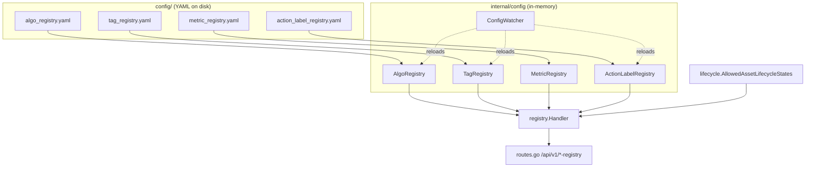
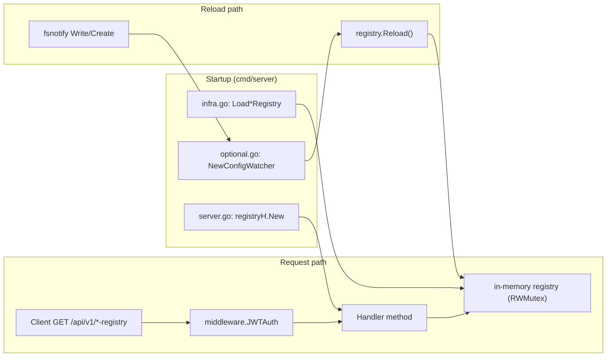
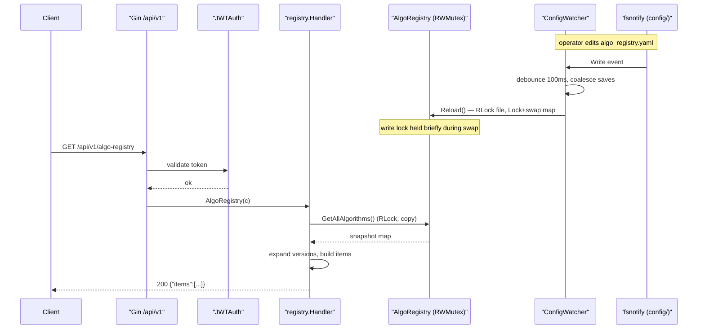
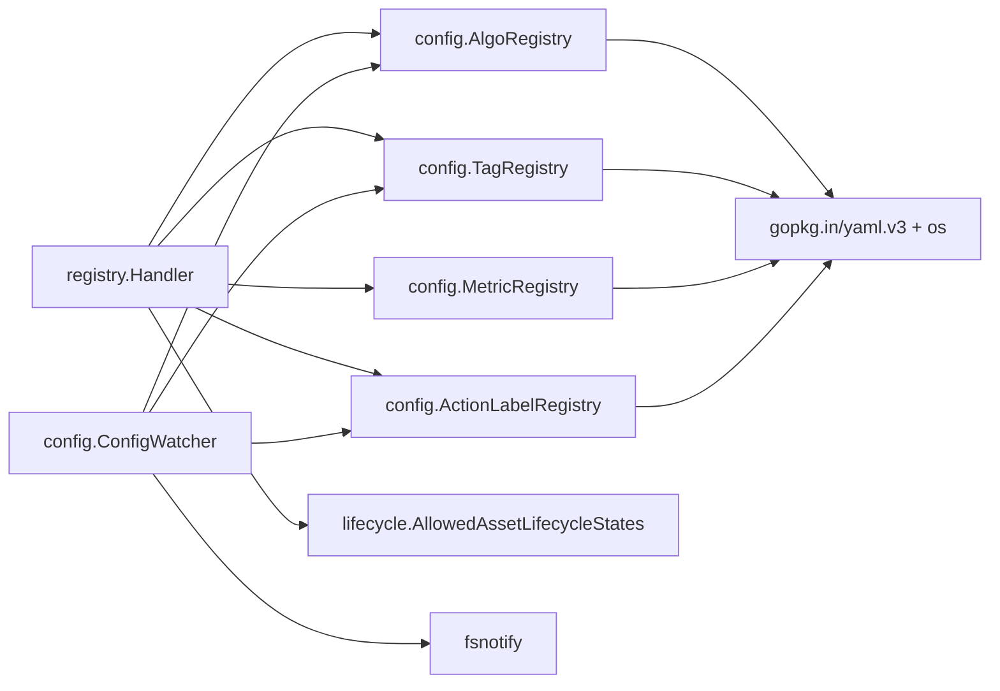

# Registry API

<cite>
**Referenced Files in This Document**

- [api/openapi.yaml](file://api/openapi.yaml)
- [backend/internal/handlers/registry/handler.go](file://backend/internal/handlers/registry/handler.go)
- [backend/internal/config/algo_registry.go](file://backend/internal/config/algo_registry.go)
- [backend/internal/config/tag_registry.go](file://backend/internal/config/tag_registry.go)
- [backend/internal/config/metric_registry.go](file://backend/internal/config/metric_registry.go)
- [backend/internal/config/action_label_registry.go](file://backend/internal/config/action_label_registry.go)
- [backend/internal/config/watcher.go](file://backend/internal/config/watcher.go)
- [backend/internal/lifecycle/states.go](file://backend/internal/lifecycle/states.go)
- [backend/routes/routes.go](file://backend/routes/routes.go)
- [backend/cmd/server/infra.go](file://backend/cmd/server/infra.go)
- [backend/cmd/server/optional.go](file://backend/cmd/server/optional.go)
- [backend/cmd/server/server.go](file://backend/cmd/server/server.go)
</cite>

## Table of Contents
1. [Introduction](#introduction)
2. [Project Structure](#project-structure)
3. [Core Components](#core-components)
4. [Architecture Overview](#architecture-overview)
5. [Detailed Component Analysis](#detailed-component-analysis)
6. [Dependency Analysis](#dependency-analysis)
7. [Performance Considerations](#performance-considerations)
8. [Troubleshooting Guide](#troubleshooting-guide)
9. [Conclusion](#conclusion)
10. [Appendices](#appendices)

## Introduction

The Registry API is the read-only surface that exposes cyber-databrew's
**YAML-backed reference data** to API clients and the frontend. Where most of
the platform's data lives in PostgreSQL, the registry data is configuration:
the set of algorithms that may produce assets, the controlled vocabulary of
tags, the catalogue of evaluation metrics, the allowed action labels, and the
enumerated asset lifecycle states. These definitions are loaded from files in
the `config/` directory at server start, held in memory behind read-write
locks, and — for three of the four file-backed registries — hot-reloaded when
the underlying YAML changes on disk.

The API exists so that clients never hard-code these vocabularies. A frontend
form that lets a user pick a tag value, an ingest client that needs to send a
valid `algo_key`, or a dashboard that renders metric display names all read the
authoritative list from the registry endpoints rather than embedding a stale
copy. Because the registries are also the validators used elsewhere in the
backend (tag writes, asset creation, metric queries), the same in-memory data
that answers these GET requests is the data that enforces correctness on the
write path. The Registry API is therefore a window onto the live validation
state of the running server.

All five endpoints are mounted under the authenticated `/api/v1` group, are
HTTP `GET` only, and return JSON. They take no path or query parameters.

**Section sources**
- [backend/internal/handlers/registry/handler.go](file://backend/internal/handlers/registry/handler.go#L1-L33)
- [backend/routes/routes.go](file://backend/routes/routes.go#L239-L244)

## Project Structure

The Registry API spans three layers: the HTTP handler, the in-memory registry
types that the handler reads, and the wiring in `cmd/server` that loads the
YAML files and starts the hot-reload watcher.

- **Handler** — `backend/internal/handlers/registry/handler.go` defines a single
  `Handler` struct holding pointers to four registries plus five Gin handler
  methods. The lifecycle-state list is sourced from the `lifecycle` package
  rather than a file-backed registry.
- **Registry types** — `backend/internal/config/` holds one Go file per
  registry: `algo_registry.go`, `tag_registry.go`, `metric_registry.go`,
  `action_label_registry.go`. Each defines a YAML schema, a `Load*` constructor,
  a `Reload` method, validation helpers used by the write path, and the
  read accessors (`GetAllAlgorithms`, `GetAllTags`, `All`, `PrimaryLabels`/`Labels`)
  consumed by the handler.
- **Lifecycle states** — `backend/internal/lifecycle/states.go` holds a static
  Go slice, `AllowedAssetLifecycleStates`, kept in sync with the PostgreSQL
  `chk_lifecycle_state` CHECK constraint.
- **Hot-reload watcher** — `backend/internal/config/watcher.go` watches the
  `config/` directory and reloads the tag, algo, and action-label registries
  when their files change.
- **Wiring** — `backend/cmd/server/infra.go` loads each YAML at boot;
  `backend/cmd/server/server.go` constructs the handler; `optional.go` starts
  the watcher; `backend/routes/routes.go` mounts the five routes.



**Diagram sources**
- [backend/internal/handlers/registry/handler.go](file://backend/internal/handlers/registry/handler.go#L13-L33)
- [backend/internal/config/watcher.go](file://backend/internal/config/watcher.go#L13-L43)
- [backend/cmd/server/infra.go](file://backend/cmd/server/infra.go#L49-L74)

**Section sources**
- [backend/internal/handlers/registry/handler.go](file://backend/internal/handlers/registry/handler.go#L1-L33)
- [backend/cmd/server/infra.go](file://backend/cmd/server/infra.go#L49-L74)
- [backend/routes/routes.go](file://backend/routes/routes.go#L239-L244)

## Core Components

The central component is the `Handler` struct, which is constructed once at
server start with the four file-backed registries injected:

- `algoRegistry *config.AlgoRegistry`
- `tagRegistry *config.TagRegistry`
- `metricRegistry *config.MetricRegistry`
- `actionLabelRegistry *config.ActionLabelRegistry`

`New` simply stores these pointers; it performs no loading itself, because the
registries are already populated by the `Load*` calls in `infra.go`. The five
handler methods are thin read adapters: each takes the relevant registry's
snapshot accessor, optionally sorts it for stable output, shapes it into a JSON
DTO, and writes HTTP 200. None of them returns a non-200 status — the registries
are always present (or nil-guarded), and there is no input to reject.

The five registries break into three kinds:

1. **File-backed with hot-reload** — algo and tag and action-label. Their YAML
   files are watched and reloaded live.
2. **File-backed without hot-reload** — metric. The file is loaded once at boot
   but is **not** watched by `ConfigWatcher`, so metric changes require a
   server restart (see [Performance Considerations](#performance-considerations)).
3. **Code-backed** — lifecycle states, a static Go slice with no file and no
   reload path.

**Section sources**
- [backend/internal/handlers/registry/handler.go](file://backend/internal/handlers/registry/handler.go#L13-L33)
- [backend/cmd/server/server.go](file://backend/cmd/server/server.go#L46-L46)
- [backend/cmd/server/infra.go](file://backend/cmd/server/infra.go#L49-L74)

## Architecture Overview

Every registry endpoint follows the same request lifecycle: Gin routes the
request through the `/api/v1` group (JWT-authenticated), dispatches to the
handler method, which acquires the registry's read lock, copies a snapshot,
releases the lock, marshals JSON, and responds. The registries are populated
once at boot and (for three of them) refreshed asynchronously by the watcher
goroutine. Reads and reloads are serialised by a `sync.RWMutex` per registry,
so a hot-reload in flight never produces a torn read.



**Diagram sources**
- [backend/cmd/server/infra.go](file://backend/cmd/server/infra.go#L49-L74)
- [backend/cmd/server/optional.go](file://backend/cmd/server/optional.go#L405-L411)
- [backend/routes/routes.go](file://backend/routes/routes.go#L189-L244)
- [backend/internal/config/watcher.go](file://backend/internal/config/watcher.go#L45-L107)

**Section sources**
- [backend/routes/routes.go](file://backend/routes/routes.go#L189-L244)
- [backend/internal/config/watcher.go](file://backend/internal/config/watcher.go#L45-L107)

## Detailed Component Analysis

### Algorithm Registry — `GET /api/v1/algo-registry`

The algo registry lists every registered algorithm, **expanded per version**.
The underlying `AlgoDefinition` holds a `Versions []string` slice, and the
handler emits one item per `(name, version)` pair, building a synthetic
`key` of the form `<name>@<version>` — the same `algo_key` format that
`Validate` and `parseAlgoKey` parse on the write path. A `depends_on` slice is
always present in the response: when the definition has no dependencies the
handler substitutes an empty array rather than `null`.

The response is **not sorted**; items are appended while ranging over a Go map,
so order is non-deterministic across requests. Clients that need a stable order
should sort by `key`.

Response shape:

```json
{
  "items": [
    {
      "key": "object_detection@v2",
      "name": "object_detection",
      "version": "v2",
      "depends_on": ["frame_extraction"]
    }
  ]
}
```

| Field        | Type       | Notes                                              |
| ------------ | ---------- | -------------------------------------------------- |
| `key`        | string     | `name@version`, one item per version               |
| `name`       | string     | Algorithm name (the YAML map key)                  |
| `version`    | string     | A single entry from the definition's `versions[]`  |
| `depends_on` | string[]   | Never null; empty array when no dependencies       |

**Section sources**
- [backend/internal/handlers/registry/handler.go](file://backend/internal/handlers/registry/handler.go#L35-L63)
- [backend/internal/config/algo_registry.go](file://backend/internal/config/algo_registry.go#L19-L47)
- [backend/internal/config/algo_registry.go](file://backend/internal/config/algo_registry.go#L135-L154)

### Tag Registry — `GET /api/v1/tag-registry`

The tag registry returns the controlled vocabulary for asset tags. Unlike the
algo endpoint, the handler explicitly **sorts the keys** before emitting, so
output order is stable. Each `TagDef` has a `type` of `enum` or `string`:

- For `enum` types, the `values[]` list of allowed values is included (an empty
  array when the YAML omits values).
- The `max_length` field is included only when greater than zero — it is
  meaningful for `string` types that cap value length.
- `values` and `max_length` use `omitempty`, so they are absent from items
  where they do not apply.

Note that two `TagDef` fields are intentionally **not** exposed by this
endpoint: `propagation` (the CYB-1068 descendant-propagation flag) and the
separate `tag_sources[]` source-contract block. The endpoint surfaces the tag
vocabulary, not the write-side governance rules.

Response shape:

```json
{
  "items": [
    {
      "key": "quality",
      "description": "Asset quality rating",
      "type": "enum",
      "values": ["low", "medium", "high"]
    },
    {
      "key": "note",
      "type": "string",
      "max_length": 256
    }
  ]
}
```

| Field         | Type     | Notes                                                  |
| ------------- | -------- | ------------------------------------------------------ |
| `key`         | string   | Tag key; results sorted ascending by this field        |
| `description` | string   | Omitted when empty                                      |
| `type`        | string   | `enum` or `string`                                      |
| `values`      | string[] | Present only for `enum`; empty array if none defined    |
| `max_length`  | integer  | Present only when `> 0`                                 |

**Section sources**
- [backend/internal/handlers/registry/handler.go](file://backend/internal/handlers/registry/handler.go#L65-L105)
- [backend/internal/config/tag_registry.go](file://backend/internal/config/tag_registry.go#L11-L18)
- [backend/internal/config/tag_registry.go](file://backend/internal/config/tag_registry.go#L118-L127)

### Metric Registry — `GET /api/v1/metric-registry`

The metric registry returns evaluation-metric definitions loaded from
`metric_registry.yaml`. The handler is **nil-guarded**: if `metricRegistry` is
nil it returns `{"items": []}` with an empty typed slice. Otherwise it calls
`All()` to copy the definitions, then **sorts the slice by `key`** for stable
output. Each item is the `MetricDefinition` struct serialised directly via its
JSON tags, so the response carries the full definition rather than a reduced DTO.

Response shape:

```json
{
  "items": [
    {
      "key": "map_50",
      "display_name": "mAP@0.5",
      "metric_type": "accuracy",
      "metric_unit": "ratio",
      "target_type": "model",
      "higher_is_better": true,
      "default_aggregation": "mean",
      "queryable": true,
      "description": "Mean average precision at IoU 0.5"
    }
  ]
}
```

| Field                 | Type    | Notes                                       |
| --------------------- | ------- | ------------------------------------------- |
| `key`                 | string  | Metric key; results sorted ascending        |
| `display_name`        | string  | Human-facing label                          |
| `metric_type`         | string  | Category of metric                          |
| `metric_unit`         | string  | Unit of measure                             |
| `target_type`         | string  | What the metric scores                      |
| `higher_is_better`    | boolean | Direction of "better"                       |
| `default_aggregation` | string  | Aggregation used when none specified        |
| `queryable`           | boolean | Whether the metric is filterable in queries |
| `description`         | string  | Free-text description                       |

> Although the OpenAPI document defines a `MetricsRegistryResponse` schema with
> exactly these properties, the metric path in `openapi.yaml` declares only a
> bare `'200': description: OK` with no `content` block. The schema above is
> verified from the Go `MetricDefinition` struct tags, which are authoritative.

**Section sources**
- [backend/internal/handlers/registry/handler.go](file://backend/internal/handlers/registry/handler.go#L114-L124)
- [backend/internal/config/metric_registry.go](file://backend/internal/config/metric_registry.go#L11-L22)
- [backend/internal/config/metric_registry.go](file://backend/internal/config/metric_registry.go#L76-L85)
- [api/openapi.yaml](file://api/openapi.yaml#L1199-L1215)

### Action-Label Registry — `GET /api/v1/action-label-registry`

The action-label registry differs from the others: it returns **two flat string
arrays** rather than an `items` list. `primary_labels` is the set of allowed
primary action labels, and `labels` is the broader set of allowed labels; both
are sorted ascending by the registry accessors. The handler is nil-guarded and
returns two empty arrays when the registry failed to load (action-label loading
is a soft failure at boot — see Troubleshooting).

Response shape:

```json
{
  "primary_labels": ["pick", "place"],
  "labels": ["grasp", "move", "pick", "place", "release"]
}
```

| Field            | Type     | Notes                                         |
| ---------------- | -------- | --------------------------------------------- |
| `primary_labels` | string[] | Sorted; empty array when registry is nil       |
| `labels`         | string[] | Sorted; empty array when registry is nil       |

**Section sources**
- [backend/internal/handlers/registry/handler.go](file://backend/internal/handlers/registry/handler.go#L126-L140)
- [backend/internal/config/action_label_registry.go](file://backend/internal/config/action_label_registry.go#L90-L110)

### Lifecycle-State Registry — `GET /api/v1/lifecycle-states`

The lifecycle-state endpoint is **code-backed**: it returns
`lifecycle.AllowedAssetLifecycleStates`, a static, ordered Go slice that mirrors
the PostgreSQL `chk_lifecycle_state` CHECK constraint defined in
`migrations/009_lifecycle_state_check.sql`. There is no YAML file and no
hot-reload; changing the set requires a code change plus a database migration.

The handler wraps the slice as `{"items": [...]}` — a flat array of strings.

```json
{
  "items": [
    "created", "processing", "ready", "delivered",
    "archived", "superseded", "failed", "rejected"
  ]
}
```

> The OpenAPI document describes this response as an object with a `states`
> array of `{state}` objects, but the handler actually returns an `items` array
> of plain strings. This is a documented mismatch between `openapi.yaml` and the
> implementation — see the Appendices and Troubleshooting Guide. The Go
> implementation is authoritative.

**Section sources**
- [backend/internal/handlers/registry/handler.go](file://backend/internal/handlers/registry/handler.go#L107-L112)
- [backend/internal/lifecycle/states.go](file://backend/internal/lifecycle/states.go#L1-L17)
- [api/openapi.yaml](file://api/openapi.yaml#L3284-L3301)

### Read flow with hot-reload

The sequence below shows a registry read concurrent with a hot-reload of the
backing YAML. The per-registry `RWMutex` guarantees a request observes either
the pre-reload or post-reload snapshot, never a partial state. The watcher
debounces rapid saves (100 ms) and reloads atomically by swapping the internal
map under the write lock.



**Diagram sources**
- [backend/internal/config/watcher.go](file://backend/internal/config/watcher.go#L45-L107)
- [backend/internal/config/algo_registry.go](file://backend/internal/config/algo_registry.go#L70-L80)
- [backend/internal/config/algo_registry.go](file://backend/internal/config/algo_registry.go#L135-L145)
- [backend/internal/handlers/registry/handler.go](file://backend/internal/handlers/registry/handler.go#L43-L63)

**Section sources**
- [backend/internal/config/watcher.go](file://backend/internal/config/watcher.go#L45-L107)
- [backend/internal/handlers/registry/handler.go](file://backend/internal/handlers/registry/handler.go#L43-L63)

## Dependency Analysis

The Registry API has a deliberately shallow dependency graph. The handler
depends only on the `config` registry types and the `lifecycle` package; it has
no database, cache, or network dependency. The registries depend on the
filesystem (via `os.ReadFile`) and `gopkg.in/yaml.v3` for parsing, plus
`fsnotify` for the watcher.



Crucially, the same registry instances injected into the handler are the ones
used as **validators** elsewhere: `AlgoRegistry.Validate`,
`TagRegistry.Validate`/`ValidateSource`/`ShouldPropagate`,
`MetricRegistry.IsQueryable`, and `ActionLabelRegistry.Validate` all read from
the very map this API serves. A client can therefore treat a registry response
as the exact ruleset the write path will enforce.

**Diagram sources**
- [backend/internal/handlers/registry/handler.go](file://backend/internal/handlers/registry/handler.go#L13-L33)
- [backend/internal/config/watcher.go](file://backend/internal/config/watcher.go#L13-L43)

**Section sources**
- [backend/internal/config/algo_registry.go](file://backend/internal/config/algo_registry.go#L82-L103)
- [backend/internal/config/tag_registry.go](file://backend/internal/config/tag_registry.go#L90-L116)
- [backend/internal/config/metric_registry.go](file://backend/internal/config/metric_registry.go#L60-L66)
- [backend/internal/config/action_label_registry.go](file://backend/internal/config/action_label_registry.go#L73-L88)

## Performance Considerations

- **All reads are in-memory.** No endpoint touches the database or disk on the
  request path; the YAML is read only at boot and on reload. Latency is bounded
  by map iteration, an optional sort, and JSON marshalling. The payloads are
  small (config-scale), so this is effectively constant work.
- **Lock contention is negligible.** Each registry uses a `sync.RWMutex`. Reads
  take the read lock and copy a snapshot, so concurrent requests do not block
  one another; the only exclusive lock is the brief map swap during `Reload`.
- **Snapshots are defensive copies.** `GetAllAlgorithms`, `GetAllTags`, and
  `All` return fresh maps/slices, so the handler shapes the response without
  holding the lock and without risk of a reload mutating data mid-marshal.
- **Sort vs. no-sort.** Tag, metric, and action-label responses are sorted for
  stable output; the algo response is **not** sorted and its order is
  non-deterministic across requests. Treat algo order as unspecified.
- **Metric registry has no hot-reload.** `ConfigWatcher` only watches
  `algo_registry.yaml`, `tag_registry.yaml`, and `action_label_registry.yaml`.
  Editing `metric_registry.yaml` has no effect until the server is restarted.
- **Debounced reloads.** The watcher coalesces rapid saves within a 100 ms
  window into a single reload, avoiding reload storms from editors that write
  files in multiple steps.

**Section sources**
- [backend/internal/config/algo_registry.go](file://backend/internal/config/algo_registry.go#L135-L145)
- [backend/internal/config/watcher.go](file://backend/internal/config/watcher.go#L48-L72)
- [backend/internal/handlers/registry/handler.go](file://backend/internal/handlers/registry/handler.go#L114-L124)

## Troubleshooting Guide

- **Empty `metric-registry` or `action-label-registry` response.** A nil
  registry yields `{"items": []}` (metric) or two empty arrays (action-label).
  Action-label loading is a **soft failure**: if `action_label_registry.yaml`
  is missing or its `labels` list is empty, `infra.go` logs a warning and sets
  the registry to nil rather than exiting. Check boot logs for
  `failed to load action label registry`. The metric registry, by contrast, is
  a **hard failure** at boot (`os.Exit(1)`) if the file is missing or invalid —
  so an empty metric response in a running server means it was started without
  the registry wired, not a load failure.
- **Server won't start.** `LoadAlgoRegistry`, `LoadTagRegistry`, and
  `LoadMetricRegistry` are fatal on error in `infra.go`. Common causes:
  malformed YAML, a missing file under `config/`, or an algorithm with an empty
  `versions` list (rejected by `loadAlgosFromFile`).
- **Edited YAML but the API didn't change.** For metric data this is expected —
  it is not watched; restart the server. For algo/tag/action-label, confirm the
  watcher started (`config watcher started for hot-reload` in logs) and that the
  edited file's basename exactly matches one of the watched names; check for a
  `*_reload failed` error log indicating the new file failed validation (in
  which case the previous in-memory data is retained).
- **Algo items appear in random order.** Expected — the algo endpoint does not
  sort. Sort client-side by `key` if you need determinism.
- **OpenAPI vs. reality for lifecycle states.** The spec advertises a `states`
  array of objects, but the server returns an `items` array of strings. Code
  parse against `items`, not `states`. The same caveat applies to the metric
  path, whose spec omits a response body schema.
- **401 Unauthorized.** All registry routes sit behind `middleware.JWTAuth` on
  the `/api/v1` group; a missing or invalid bearer token / databrew token is
  rejected before the handler runs.

**Section sources**
- [backend/cmd/server/infra.go](file://backend/cmd/server/infra.go#L49-L74)
- [backend/cmd/server/optional.go](file://backend/cmd/server/optional.go#L405-L411)
- [backend/internal/config/watcher.go](file://backend/internal/config/watcher.go#L78-L104)
- [backend/internal/config/algo_registry.go](file://backend/internal/config/algo_registry.go#L60-L65)
- [backend/routes/routes.go](file://backend/routes/routes.go#L189-L189)

## Conclusion

The Registry API is a small, dependency-light, read-only surface that publishes
cyber-databrew's configuration vocabularies — algorithms, tags, metrics, action
labels, and lifecycle states. Four registries are YAML-backed and one is
code-backed; three of the four files are hot-reloaded by a debounced fsnotify
watcher, while the metric file requires a restart. Because the same in-memory
data also drives the write-path validators, registry responses are an accurate
mirror of the rules the server enforces. The two notable caveats are the
unsorted algo response and the OpenAPI/implementation mismatch on the lifecycle
and metric response shapes, both of which are resolved in favour of the Go
implementation above.

## Appendices

### A. Endpoint summary

| Method | Path                             | Handler              | Backing source                    | Hot-reload | Response root         |
| ------ | -------------------------------- | -------------------- | --------------------------------- | ---------- | --------------------- |
| GET    | `/api/v1/algo-registry`          | `AlgoRegistry`       | `algo_registry.yaml`              | Yes        | `items[]`             |
| GET    | `/api/v1/tag-registry`           | `TagRegistry`        | `tag_registry.yaml`               | Yes        | `items[]` (sorted)    |
| GET    | `/api/v1/metric-registry`        | `MetricRegistry`     | `metric_registry.yaml`            | **No**     | `items[]` (sorted)    |
| GET    | `/api/v1/action-label-registry`  | `ActionLabelRegistry`| `action_label_registry.yaml`      | Yes        | `primary_labels[]`, `labels[]` |
| GET    | `/api/v1/lifecycle-states`       | `LifecycleStates`    | `lifecycle.AllowedAssetLifecycleStates` (code) | n/a | `items[]` |

All five are mounted on the JWT-authenticated `/api/v1` group, take no
parameters, and always respond `200 OK`.

**Section sources**
- [backend/routes/routes.go](file://backend/routes/routes.go#L239-L244)
- [backend/internal/handlers/registry/handler.go](file://backend/internal/handlers/registry/handler.go#L43-L140)

### B. OpenAPI schema definitions (Registry tag)

| Schema             | Location                | Notes                                          |
| ------------------ | ----------------------- | ---------------------------------------------- |
| `AlgoRegistryItem` | `openapi.yaml` 1218–1226 | `key`, `name`, `version`, `depends_on[]`        |
| `TagRegistryItem`  | `openapi.yaml` 1227–1236 | `key`, `description`, `type`, `values[]`, `max_length` |
| `LifecycleState`   | `openapi.yaml` 1237–1240 | `{state}` — note: handler returns plain strings |
| `MetricsRegistryResponse` | `openapi.yaml` 1199–1215 | Defined but not referenced by the metric path body |

**Section sources**
- [api/openapi.yaml](file://api/openapi.yaml#L1199-L1240)
- [api/openapi.yaml](file://api/openapi.yaml#L3239-L3301)

### C. Lifecycle-state enumeration

In stable display order, mirroring the PostgreSQL `chk_lifecycle_state` check:
`created`, `processing`, `ready`, `delivered`, `archived`, `superseded`,
`failed`, `rejected`.

**Section sources**
- [backend/internal/lifecycle/states.go](file://backend/internal/lifecycle/states.go#L8-L17)

### D. Registries without a dedicated endpoint

Two registries are loaded at boot but **not** exposed by the Registry API:

- **Query-field registry** (`query_field_registry.yaml`,
  `config.LoadQueryFieldRegistry`) — loaded in `infra.go` but has no
  `*-registry` GET route in the Registry tag.
- **Tag sources / propagation** — `tag_sources[]` and the per-tag `propagation`
  flag live inside `tag_registry.yaml` but are deliberately omitted from the
  `tag-registry` response shape; only the tag vocabulary is published.

These are flagged here per the "registry without an endpoint" requirement.

**Section sources**
- [backend/cmd/server/infra.go](file://backend/cmd/server/infra.go#L65-L69)
- [backend/internal/config/tag_registry.go](file://backend/internal/config/tag_registry.go#L24-L44)
