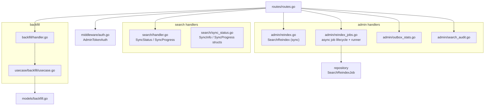
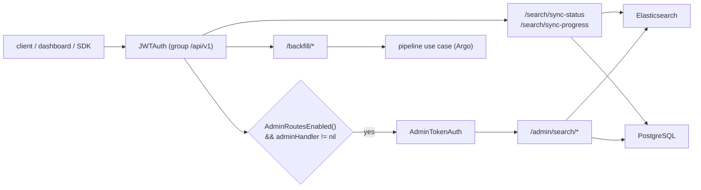
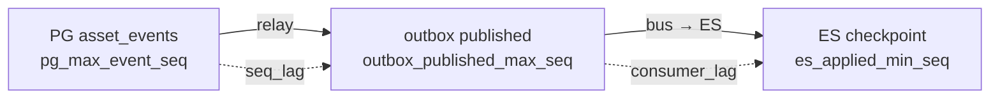
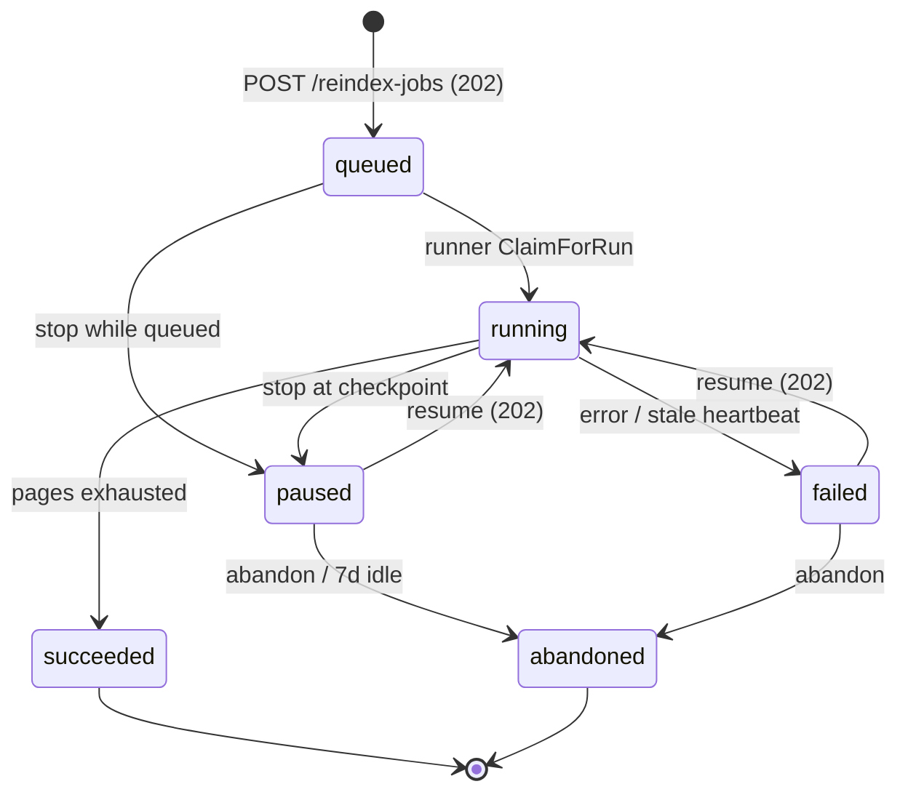
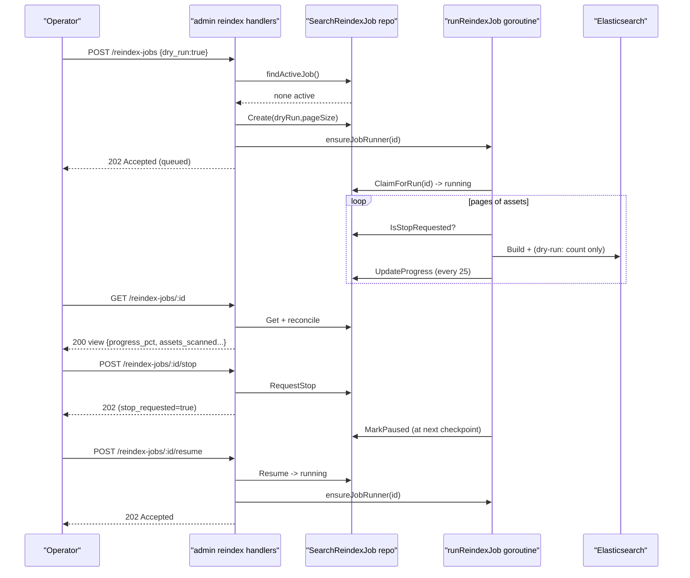
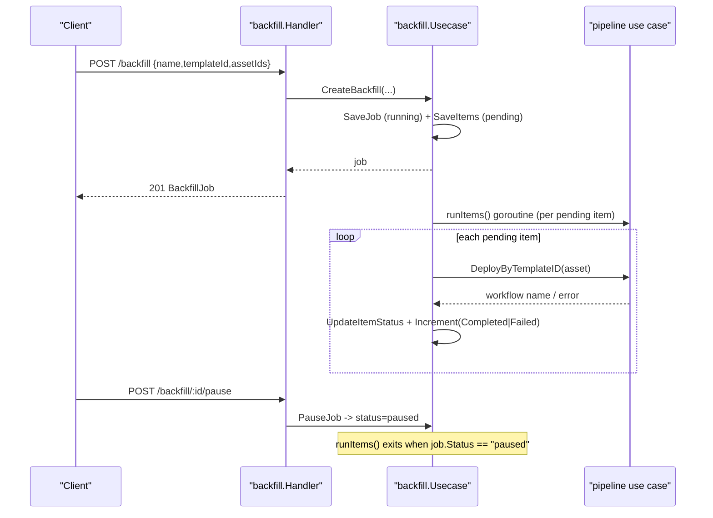
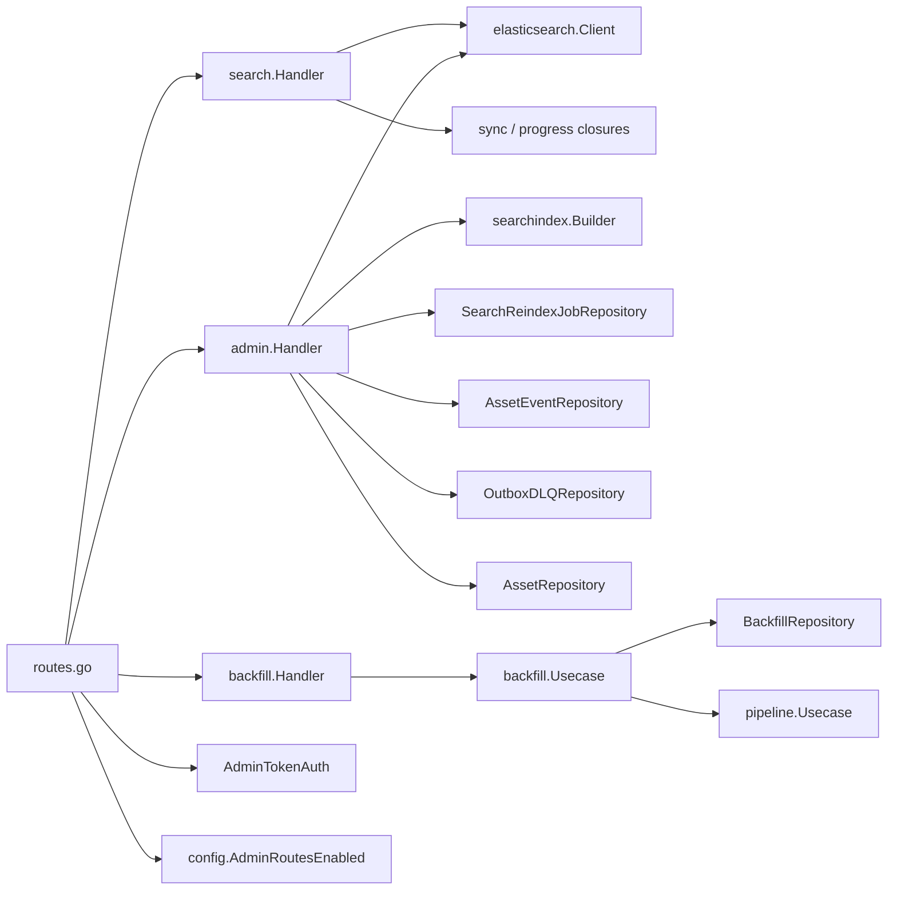

# Search & Admin API

<cite>
**Referenced Files in This Document**

- [api/openapi.yaml](file://api/openapi.yaml)
- [backend/routes/routes.go](file://backend/routes/routes.go)
- [backend/internal/handlers/search/handler.go](file://backend/internal/handlers/search/handler.go)
- [backend/internal/handlers/search/sync_status.go](file://backend/internal/handlers/search/sync_status.go)
- [backend/internal/handlers/admin/reindex.go](file://backend/internal/handlers/admin/reindex.go)
- [backend/internal/handlers/admin/reindex_jobs.go](file://backend/internal/handlers/admin/reindex_jobs.go)
- [backend/internal/handlers/admin/outbox_stats.go](file://backend/internal/handlers/admin/outbox_stats.go)
- [backend/internal/handlers/admin/search_audit.go](file://backend/internal/handlers/admin/search_audit.go)
- [backend/internal/handlers/backfill/handler.go](file://backend/internal/handlers/backfill/handler.go)
- [backend/internal/usecase/backfill/usecase.go](file://backend/internal/usecase/backfill/usecase.go)
- [backend/internal/models/backfill.go](file://backend/internal/models/backfill.go)
- [backend/internal/middleware/auth.go](file://backend/internal/middleware/auth.go)
- [backend/internal/config/config.go](file://backend/internal/config/config.go)
- [backend/internal/repository/search_reindex_job_repository.go](file://backend/internal/repository/search_reindex_job_repository.go)
</cite>

## Table of Contents
1. [Introduction](#introduction)
2. [Project Structure](#project-structure)
3. [Core Components](#core-components)
4. [Architecture Overview](#architecture-overview)
5. [Detailed Component Analysis](#detailed-component-analysis)
6. [Dependency Analysis](#dependency-analysis)
7. [Performance Considerations](#performance-considerations)
8. [Troubleshooting Guide](#troubleshooting-guide)
9. [Conclusion](#conclusion)
10. [Appendices](#appendices)

## Introduction

This page documents the operational surface of the cyber-databrew search subsystem: the read-only **sync observability** endpoints under `/api/v1/search/*`, the privileged **admin reindex / audit / outbox-stats** endpoints under `/api/v1/admin/search/*`, and the **backfill** job endpoints under `/api/v1/backfill/*`.

These endpoints exist because asset documents live in two stores that must converge: the system of record is PostgreSQL, and a denormalized projection of each asset is mirrored into Elasticsearch (ES) for full-text and faceted search. Writes flow PG → outbox → message bus → ES subscriber. Because that pipeline is asynchronous, operators need to (a) observe the lag (`sync-status`, `sync-progress`), (b) repair drift when it occurs (`admin/search/reindex`, async reindex jobs, `admin/search/audit`), and (c) inspect the durable queue (`admin/search/outbox-stats`). The backfill endpoints are a separate but adjacent operation: they re-run a pipeline template across a batch of assets.

The intended consumers are the operations dashboard (frontend), SDK automation, and human operators issuing curl calls with an admin token. The sync endpoints are safe for any authenticated user; the admin endpoints are guarded by an admin-token middleware and are only mounted when admin routes are enabled.

**Section sources**
- [api/openapi.yaml](file://api/openapi.yaml#L3303-L3375)
- [backend/internal/handlers/search/sync_status.go](file://backend/internal/handlers/search/sync_status.go#L1-L54)
- [backend/routes/routes.go](file://backend/routes/routes.go#L246-L285)

## Project Structure

The relevant code is split across handlers, a use case, repositories, models, routing, and middleware:

- `backend/internal/handlers/search/` — the search domain HTTP layer. `handler.go` holds `SearchAssets`, `SyncStatus`, and `SyncProgress`; `sync_status.go` defines the `SyncInfo` and `SyncProgress` response structs.
- `backend/internal/handlers/admin/` — privileged maintenance handlers. `reindex.go` (synchronous reindex), `reindex_jobs.go` (async job lifecycle), `outbox_stats.go`, and `search_audit.go`.
- `backend/internal/handlers/backfill/` — `handler.go` wires the six backfill endpoints onto a use case.
- `backend/internal/usecase/backfill/usecase.go` — backfill orchestration (create, list, get, pause, resume, retry-failed).
- `backend/internal/repository/search_reindex_job_repository.go` — the persisted async reindex job model, its status enum, and the repository interface the async runner drives.
- `backend/internal/models/backfill.go` — `BackfillJob` / `BackfillItem` domain models.
- `backend/routes/routes.go` — mounts all of the above and applies the admin-token guard.
- `backend/internal/middleware/auth.go` — `AdminTokenAuth`, the guard applied to the `/admin` and `/internal` groups.
- `backend/internal/config/config.go` — `AdminRoutesEnabled()` decides whether the admin groups are mounted at all.
- `api/openapi.yaml` — the published contract for each endpoint and schema.

**Diagram sources**
- [backend/routes/routes.go](file://backend/routes/routes.go#L246-L285)
- [backend/internal/handlers/admin/reindex_jobs.go](file://backend/internal/handlers/admin/reindex_jobs.go#L131-L313)

**Section sources**
- [backend/routes/routes.go](file://backend/routes/routes.go#L246-L356)
- [backend/internal/handlers/search/sync_status.go](file://backend/internal/handlers/search/sync_status.go#L1-L54)

## Core Components

### Search sync handlers

`search.Handler` is constructed with an ES client and two optional closures: `sync func() SyncInfo` and `progress func(context.Context) (SyncProgress, error)`. Both `SyncStatus` and `SyncProgress` degrade gracefully when their closure is nil. `SyncStatus` falls back to a minimal `SyncInfo` derived only from whether ES is wired; `SyncProgress` returns `503` when no progress provider is configured.

### Admin maintenance handler

`admin.Handler` aggregates the repositories and the ES client needed for index maintenance. It carries a `searchindex.Builder` (`indexer`) that rebuilds an asset's ES document from PG, plus a `jobMu`/`runningJobs` pair used to deduplicate background reindex runners. Several dependencies may be nil — `es`, `events`, `dlq`, and `jobs` — and the handlers return `503` when the dependency a given endpoint needs is missing.

### Async reindex job model

`repository.SearchReindexJob` is the durable representation of a long-running reindex. Its `Status` is one of `queued | running | paused | succeeded | failed | abandoned`. Progress fields (`AssetsScanned`, `DocumentsIndexed`, `DocumentsDeleted`, `Failed`, `NextPage`, `IndexCleared`) let a runner resume from a checkpoint. `StopRequested` is a cooperative cancellation flag.

### Backfill use case

`backfill.Usecase` orchestrates batch re-runs of a pipeline template. `CreateBackfill` persists a `BackfillJob` and one `BackfillItem` per asset, then launches a background goroutine that deploys the template per item. Job status is `running | paused | completed | failed`; item status is `pending | running | completed | failed | cancelled`.

**Section sources**
- [backend/internal/handlers/search/handler.go](file://backend/internal/handlers/search/handler.go#L23-L36)
- [backend/internal/handlers/admin/reindex.go](file://backend/internal/handlers/admin/reindex.go#L19-L66)
- [backend/internal/repository/search_reindex_job_repository.go](file://backend/internal/repository/search_reindex_job_repository.go#L8-L65)
- [backend/internal/usecase/backfill/usecase.go](file://backend/internal/usecase/backfill/usecase.go#L18-L61)

## Architecture Overview

All three endpoint families are mounted under the JWT-authenticated `/api/v1` group. Within that group, the search-sync endpoints are mounted unconditionally (when a search handler is wired), the backfill endpoints when a backfill handler is wired, and the admin endpoints only when `cfg.AdminRoutesEnabled()` is true **and** an admin handler exists. The admin group additionally layers the `AdminTokenAuth` middleware on top of the JWT auth, so an admin call must satisfy both the session JWT (or static databrew token) and the admin token.

The admin gate is governed by `AdminRoutesEnabled()`: it returns true whenever `ADMIN_TOKEN` is set, and otherwise true only outside production. `AdminTokenAuth` mirrors this: with no admin token configured it 403s in production and falls back to the static databrew token elsewhere; with a token configured it requires `X-Admin-Token` (or `Authorization: Bearer <token>`) to match.

**Diagram sources**
- [backend/routes/routes.go](file://backend/routes/routes.go#L189-L285)
- [backend/internal/middleware/auth.go](file://backend/internal/middleware/auth.go#L99-L124)
- [backend/internal/config/config.go](file://backend/internal/config/config.go#L224-L231)

**Section sources**
- [backend/routes/routes.go](file://backend/routes/routes.go#L103-L105)
- [backend/routes/routes.go](file://backend/routes/routes.go#L189-L285)
- [backend/internal/middleware/auth.go](file://backend/internal/middleware/auth.go#L99-L124)

## Detailed Component Analysis

### GET /api/v1/search/sync-status

Returns a `SyncInfo` snapshot describing how the index is kept in sync. When the handler was constructed with a `sync` closure it returns whatever that closure reports; otherwise it returns a minimal snapshot where `search_index_mode` is `manual` if ES is wired or `unavailable` if not. The endpoint never errors — it always returns `200`.

`SyncInfo` fields:

| Field | Type | Meaning |
| --- | --- | --- |
| `elasticsearch_ok` | bool | ES client reachable / wired |
| `outbox_relay_enabled` | bool | PG → bus relay is running |
| `outbox_es_subscriber_enabled` | bool | bus → ES subscriber is running |
| `search_index_mode` | string | `unavailable` \| `outbox_es_subscriber` \| `local_reconcile` \| `manual` |
| `env` | string | deployment environment (omitted when empty) |
| `admin_search_enabled` | bool | whether admin search ops are available |

**Section sources**
- [backend/internal/handlers/search/handler.go](file://backend/internal/handlers/search/handler.go#L214-L229)
- [backend/internal/handlers/search/sync_status.go](file://backend/internal/handlers/search/sync_status.go#L5-L14)

### GET /api/v1/search/sync-progress

Returns a `SyncProgress` value computed at request time by the `progress` closure. If no closure is configured the endpoint returns `503` (`service unavailable`); if the closure itself errors, the endpoint returns `503` with `failed to read sync progress: <err>`.

`SyncProgress` exposes both the PG↔ES gap and the internal pipeline lag broken into stages. The headline alerting signal is `seq_lag` = `pg_max_event_seq` − `outbox_published_max_seq` (events still pending/processing on the PG side). `consumer_lag` = `outbox_published_max_seq` − `es_applied_min_seq` reflects the bus → ES segment, and is reported as 0 until at least one ES checkpoint exists. The watermark-based fields (`pg_max_event_seq`, `outbox_published_max_seq`, `es_applied_min_seq`) are deliberately O(1) so this endpoint stays cheap at very large scale rather than running `COUNT(*)` over assets.

**Diagram sources**
- [backend/internal/handlers/search/sync_status.go](file://backend/internal/handlers/search/sync_status.go#L16-L54)

**Section sources**
- [backend/internal/handlers/search/handler.go](file://backend/internal/handlers/search/handler.go#L231-L247)
- [backend/internal/handlers/search/sync_status.go](file://backend/internal/handlers/search/sync_status.go#L16-L54)

### POST /api/v1/admin/search/reindex (synchronous)

`SearchReindex` rebuilds **all** ES documents from PG synchronously within the request. It accepts a `SearchReindexRequest` body and/or `dry_run` and `page_size` query parameters; `page_size` is clamped to `1..500`, defaulting to `200`. It returns `503` when ES is not configured and `400` when the request body cannot be parsed.

Behavior:
- When not a dry run, it first calls `DeleteAllDocuments` to clear the index (returns `502` on failure), counting cleared docs into `Deleted`.
- It pages through assets ordered by `asset_id ASC`. For each asset it calls `indexer.Build`; on build error it increments `Failed` and records a sample. If the builder reports the asset should not be indexed (`!ok`) it deletes the doc (or, in dry-run, counts a notional delete).
- Indexable docs are accumulated and flushed with `BulkIndex`; succeeded/failed counts roll up, with up to `maxReportedReindexErrors` (20) error samples retained.
- After completion (non-dry-run) it calls `Count` for `elasticsearch_doc_count` (`-1` on count failure).

Because this handler runs the whole rebuild inside one HTTP request, it does not move outbox cursors and is only appropriate for demo-sized datasets. For production-scale rebuilds use the async job endpoints below.

**Section sources**
- [backend/internal/handlers/admin/reindex.go](file://backend/internal/handlers/admin/reindex.go#L68-L237)

### Async reindex jobs (`/api/v1/admin/search/reindex-jobs`)

The async API turns a reindex into a resumable, observable job. The five operations are:

- `POST /reindex-jobs` — `SearchReindexCreateJob`. Requires the jobs repository and ES to be configured (`503` otherwise). It rejects creation with `409 Conflict` if `findActiveJob` finds an existing queued/running job (after reconciliation), embedding the active job in the error detail. On success it persists a job, launches the background runner via `ensureJobRunner`, and responds `202 Accepted` with the job view.
- `GET /reindex-jobs` — `SearchReindexListJobs`. Returns recent jobs (default limit 20, max 100). For each it reconciles state and, if a paused job has been idle past `reindexPausedExpireAfter` (7 days), marks it abandoned.
- `GET /reindex-jobs/:id` — `SearchReindexGetJob`. Returns one job after reconciliation; `404` if not found.
- `POST /reindex-jobs/:id/stop` — `SearchReindexStopJob`. Calls `RequestStop`; if the job is still `queued` (never claimed) it is paused immediately for deterministic UX. Responds `202`.
- `POST /reindex-jobs/:id/resume` — `SearchReindexResumeJob`. Calls `Resume`; if the job is not resumable it returns `400` with the current status, or `404` if absent. On success relaunches the runner and responds `202`.
- `POST /reindex-jobs/:id/abandon` — `SearchReindexAbandonJob`. Marks the job abandoned and returns `200 {"status":"abandoned"}`.

State reconciliation (`reconcileReindexJobState`) repairs stuck `running` jobs without a live runner: if a stop was requested and the job has been idle ≥ `reindexStopForcePauseAfter` (20s) it is force-paused; if no stop was requested but the job has been idle ≥ `reindexRunningStaleAfter` (2m) it is marked failed (recording a stale-heartbeat sample) so it can be manually resumed.

The background runner `runReindexJob` is the engine. It claims the job (`ClaimForRun`), resumes from `NextPage`, optionally clears the index once (`IndexCleared` guard), then pages through assets. Every `reindexProgressCheckpointN` (25) scanned assets it persists progress via `UpdateProgress` and re-checks `IsStopRequested`; a requested stop marks the job paused and returns. Per-page indexable docs are bulk-indexed; on completion (non-dry-run) it counts ES docs and calls `MarkSucceeded`. The `jobMu`/`runningJobs` map in the handler ensures only one runner goroutine per job ID exists in-process.

**Diagram sources**
- [backend/internal/handlers/admin/reindex_jobs.go](file://backend/internal/handlers/admin/reindex_jobs.go#L131-L313)
- [backend/internal/handlers/admin/reindex_jobs.go](file://backend/internal/handlers/admin/reindex_jobs.go#L321-L574)

**Section sources**
- [backend/internal/handlers/admin/reindex_jobs.go](file://backend/internal/handlers/admin/reindex_jobs.go#L19-L110)
- [backend/internal/handlers/admin/reindex_jobs.go](file://backend/internal/handlers/admin/reindex_jobs.go#L131-L301)
- [backend/internal/handlers/admin/reindex_jobs.go](file://backend/internal/handlers/admin/reindex_jobs.go#L303-L574)

### GET /api/v1/admin/search/outbox-stats

`SearchOutboxStats` returns read-only durable-queue metrics: `publish_state_counts` (counts of `asset_events` rows grouped by `publish_state`, via `events.PublishStateCounts`) and `outbox_dlq_rows` (archived permanently-failed events, via `dlq.Count`). It returns `503` when the `asset_events` repository is not configured, and `500` if either count query fails. When no DLQ repository is wired, `outbox_dlq_rows` is reported as 0. This endpoint complements `sync-progress`: where `sync-progress` reports lag derived from sequence watermarks, this endpoint reports raw row-state counts.

**Section sources**
- [backend/internal/handlers/admin/outbox_stats.go](file://backend/internal/handlers/admin/outbox_stats.go#L11-L44)

### GET /api/v1/admin/search/audit

`SearchAudit` performs a PG↔ES consistency check for the assets index. It first calls `es.Refresh` so recent CDC writes are visible, then obtains a cheap PG `COUNT(*)` and an ES `Count`. When both counts are within `fullDiffMax` (5000), it performs a full per-id set diff: it pages all PG asset IDs (page size 500) and lists all ES document IDs (`ListAllDocumentIDs`, batch 1000), then computes `missing_in_elasticsearch` (in PG, absent from ES) and `orphan_in_elasticsearch` (in ES, absent from PG), keeping up to 10 sample IDs of each. Above that threshold it falls back to a count-only audit that attributes the absolute gap to missing or orphan by direction. `consistency` is `1 - missing/pg_assets` and `target` is fixed at `0.999`. It returns `503` when ES is not configured and `502` when an ES call fails.

The full diff is explicitly described as O(N) over both stores and is therefore demo-sized only; the count-only fallback keeps the endpoint snappy at scale.

**Section sources**
- [backend/internal/handlers/admin/search_audit.go](file://backend/internal/handlers/admin/search_audit.go#L14-L142)

### Backfill endpoints (`/api/v1/backfill`)

The backfill handler exposes six endpoints backed by `backfill.Usecase`:

- `POST /backfill` — `CreateJob`. Binds a JSON body requiring `name`, `templateId`, and `assetIds` (min 1). It creates the job plus one item per asset and launches a background goroutine that deploys the pipeline template per pending item. Responds `201` with the job. Note: the handler binds `assetIds`, while the OpenAPI document instead lists `filterJson`; the running contract is `assetIds`.
- `GET /backfill` — `ListJobs`. Returns `{"items":[...]}` (never null).
- `GET /backfill/:id` — `GetJob`. Returns `{"job":..., "items":[...]}`; `400` if `id` is blank, `404` if the job does not exist.
- `POST /backfill/:id/pause` — `PauseJob`. Sets status `paused`, returns `{"status":"paused"}`. The running goroutine checks job status and stops scheduling further items once paused.
- `POST /backfill/:id/resume` — `ResumeJob`. Sets status `running` and re-schedules pending items, returns `{"status":"resumed"}`.
- `POST /backfill/:id/retry-failed` — `RetryFailed`. Re-executes every item currently in `failed` status; returns `{"status":"retrying"}`, mapping `ErrNotFound` to `404`.

**Diagram sources**
- [backend/internal/handlers/backfill/handler.go](file://backend/internal/handlers/backfill/handler.go#L22-L119)
- [backend/internal/usecase/backfill/usecase.go](file://backend/internal/usecase/backfill/usecase.go#L29-L100)

**Section sources**
- [backend/internal/handlers/backfill/handler.go](file://backend/internal/handlers/backfill/handler.go#L22-L128)
- [backend/internal/usecase/backfill/usecase.go](file://backend/internal/usecase/backfill/usecase.go#L29-L172)
- [backend/internal/models/backfill.go](file://backend/internal/models/backfill.go#L5-L31)

## Dependency Analysis

The search-sync endpoints depend only on an ES client and the optional sync/progress closures, so they are cheap to mount and survive missing infrastructure by returning minimal/`503` responses. The admin handler is the most heavily wired: it needs the assets/tags/algos/mcap/actions repositories (for the index builder), the ES client, and — for the async jobs, outbox-stats, and DLQ counts — the jobs/events/dlq repositories. Any of `es`, `events`, `dlq`, `jobs` being nil degrades the corresponding endpoint to `503` rather than panicking. Backfill depends on a `BackfillRepository` and the pipeline use case; when the pipeline use case is nil, jobs are created but no items execute.

**Diagram sources**
- [backend/routes/routes.go](file://backend/routes/routes.go#L44-L68)
- [backend/internal/handlers/admin/reindex.go](file://backend/internal/handlers/admin/reindex.go#L19-L66)
- [backend/internal/usecase/backfill/usecase.go](file://backend/internal/usecase/backfill/usecase.go#L18-L27)

**Section sources**
- [backend/routes/routes.go](file://backend/routes/routes.go#L44-L68)
- [backend/internal/handlers/admin/reindex.go](file://backend/internal/handlers/admin/reindex.go#L19-L66)

## Performance Considerations

- **`sync-progress` is O(1) by design.** It relies on sequence watermarks (`MAX(event_seq)`, `MIN(applied_seq)`) instead of `COUNT(*)` over assets/ES, which is why it scales to large datasets. Treat `seq_lag` as the primary alert and `consumer_lag` as the bus→ES sub-alert.
- **Synchronous reindex is demo-scale only.** `POST /admin/search/reindex` clears and rebuilds the entire index inside one request; it has no checkpointing and holds the HTTP connection for the whole run. Prefer async jobs for anything non-trivial.
- **Async reindex checkpoints every 25 assets.** `reindexProgressCheckpointN` balances write amplification against resumability; it also bounds how far a job rewinds on resume (back to the last persisted `NextPage`).
- **`search/audit` per-id diff is capped at 5000 rows per store.** Beyond that it degrades to a count-only gap, trading precision for a bounded response time. The full diff loads all IDs from both stores into memory.
- **Bulk indexing.** Both reindex paths accumulate docs per page and flush via `BulkIndex`, which amortizes round trips; `page_size` is clamped to `1..500`.
- **Concurrency guard.** `findActiveJob` plus `409 Conflict` prevents multiple overlapping reindex jobs (e.g. double-clicks across browser tabs) from causing index thrash.
- **Backfill fan-out.** `CreateBackfill` spawns a single background goroutine that processes items sequentially, re-reading job status before each item so a pause takes effect promptly.

**Section sources**
- [backend/internal/handlers/search/sync_status.go](file://backend/internal/handlers/search/sync_status.go#L33-L54)
- [backend/internal/handlers/admin/reindex_jobs.go](file://backend/internal/handlers/admin/reindex_jobs.go#L19-L26)
- [backend/internal/handlers/admin/search_audit.go](file://backend/internal/handlers/admin/search_audit.go#L54-L122)

## Troubleshooting Guide

- **`/admin/search/*` returns 404 "admin disabled" or 403.** Admin routes are unmounted when `AdminRoutesEnabled()` is false — that happens in production when `ADMIN_TOKEN` is unset. With a token configured, a `403` means the request lacked a matching `X-Admin-Token`/`Authorization: Bearer` header.
- **Reindex/audit returns 503 "Elasticsearch is not configured".** The ES client was nil at construction; search infra is not wired. `outbox-stats` 503 likewise means the `asset_events` repository is nil; async-job 503 means the jobs repository is nil.
- **`POST /reindex-jobs` returns 409.** Another queued/running job already exists (after reconciliation). Inspect the embedded `active_job`, then stop/abandon it before creating a new one.
- **A reindex job is stuck in `running` with no progress.** Reconciliation auto-repairs it: after 20s of idle with a pending stop it force-pauses; after 2m of idle without a stop it is marked `failed` with a stale-heartbeat sample so you can resume it.
- **Resume returns 400 "job is not resumable".** Only `paused`/`failed` jobs can resume; the response includes the current status. `succeeded`/`abandoned` jobs cannot be resumed.
- **`sync-progress` returns 503.** No progress provider is configured, or the provider query failed (the message carries the underlying error).
- **`search/audit` reports nonzero `orphan_in_elasticsearch`.** ES holds docs whose PG asset is gone; a non-dry-run reindex deletes orphans because the index builder reports `!ok` for missing/soft-deleted assets.
- **Backfill returns 404 on retry/get.** The job ID does not exist (`ErrNotFound` → `CodeAssetNotFound`); verify the ID from `GET /backfill`.

**Section sources**
- [backend/internal/middleware/auth.go](file://backend/internal/middleware/auth.go#L99-L124)
- [backend/internal/config/config.go](file://backend/internal/config/config.go#L224-L231)
- [backend/internal/handlers/admin/reindex_jobs.go](file://backend/internal/handlers/admin/reindex_jobs.go#L54-L78)
- [backend/internal/handlers/admin/reindex_jobs.go](file://backend/internal/handlers/admin/reindex_jobs.go#L148-L166)

## Conclusion

The search/admin/backfill surface is the operational control plane for keeping the PG and ES views of assets consistent and for re-running pipelines in bulk. The sync endpoints provide cheap, always-available observability; the admin endpoints provide both a simple synchronous repair tool and a robust, resumable async reindex with cooperative stop/resume and self-healing reconciliation; the backfill endpoints provide batch pipeline re-execution. The admin family is consistently guarded by `AdminTokenAuth` and only mounted when `AdminRoutesEnabled()` permits, and every dependency-sensitive handler degrades to `503` rather than failing hard.

## Appendices

### A. Endpoint reference

| Method & Path | Handler | Auth | Success | Notes |
| --- | --- | --- | --- | --- |
| GET `/api/v1/search/sync-status` | `search.Handler.SyncStatus` | JWT | 200 `SyncInfo` | Never errors; minimal fallback when no sync provider |
| GET `/api/v1/search/sync-progress` | `search.Handler.SyncProgress` | JWT | 200 `SyncProgress` | 503 if no provider / provider error |
| POST `/api/v1/admin/search/reindex` | `admin.Handler.SearchReindex` | JWT + AdminToken | 200 `SearchReindexResponse` | Synchronous; 503/400/502 |
| POST `/api/v1/admin/search/reindex-jobs` | `SearchReindexCreateJob` | JWT + AdminToken | 202 job view | 409 if active job exists |
| GET `/api/v1/admin/search/reindex-jobs` | `SearchReindexListJobs` | JWT + AdminToken | 200 list | limit default 20, max 100 |
| GET `/api/v1/admin/search/reindex-jobs/{id}` | `SearchReindexGetJob` | JWT + AdminToken | 200 job view | 404 if missing |
| POST `/api/v1/admin/search/reindex-jobs/{id}/stop` | `SearchReindexStopJob` | JWT + AdminToken | 202 job view | Pauses immediately if still queued |
| POST `/api/v1/admin/search/reindex-jobs/{id}/resume` | `SearchReindexResumeJob` | JWT + AdminToken | 202 job view | 400 if not resumable |
| POST `/api/v1/admin/search/reindex-jobs/{id}/abandon` | `SearchReindexAbandonJob` | JWT + AdminToken | 200 `{status:abandoned}` | |
| GET `/api/v1/admin/search/outbox-stats` | `SearchOutboxStats` | JWT + AdminToken | 200 `SearchOutboxStatsResponse` | 503 if events repo nil |
| GET `/api/v1/admin/search/audit` | `SearchAudit` | JWT + AdminToken | 200 `SearchAuditResponse` | full diff ≤ 5000, else count-only |
| POST `/api/v1/backfill` | `backfill.Handler.CreateJob` | JWT | 201 `BackfillJob` | binds `name,templateId,assetIds` |
| GET `/api/v1/backfill` | `ListJobs` | JWT | 200 `{items:[]}` | |
| GET `/api/v1/backfill/{id}` | `GetJob` | JWT | 200 `{job,items}` | 400 blank id, 404 missing |
| POST `/api/v1/backfill/{id}/pause` | `PauseJob` | JWT | 200 `{status:paused}` | |
| POST `/api/v1/backfill/{id}/resume` | `ResumeJob` | JWT | 200 `{status:resumed}` | re-schedules pending items |
| POST `/api/v1/backfill/{id}/retry-failed` | `RetryFailed` | JWT | 200 `{status:retrying}` | 404 if job missing |

**Section sources**
- [backend/routes/routes.go](file://backend/routes/routes.go#L246-L356)
- [api/openapi.yaml](file://api/openapi.yaml#L3556-L3688)
- [api/openapi.yaml](file://api/openapi.yaml#L4873-L5013)

### B. Reindex job status enum

| Status | Constant | Meaning |
| --- | --- | --- |
| `queued` | `SearchReindexJobStatusQueued` | created, not yet claimed by a runner |
| `running` | `SearchReindexJobStatusRunning` | runner is paging/indexing |
| `paused` | `SearchReindexJobStatusPaused` | cooperatively stopped at a checkpoint |
| `succeeded` | `SearchReindexJobStatusSucceeded` | all pages processed |
| `failed` | `SearchReindexJobStatusFailed` | error or stale heartbeat |
| `abandoned` | `SearchReindexJobStatusAbandoned` | manually abandoned or expired after 7 days idle |

Reconciliation timers: stop force-pause after `20s`; running-stale fail after `2m`; paused expire-to-abandoned after `7 days`; progress checkpoint every `25` assets.

**Section sources**
- [backend/internal/repository/search_reindex_job_repository.go](file://backend/internal/repository/search_reindex_job_repository.go#L8-L65)
- [backend/internal/handlers/admin/reindex_jobs.go](file://backend/internal/handlers/admin/reindex_jobs.go#L19-L26)

### C. Key response schemas

`SearchReindexResponse` (synchronous): `dry_run`, `total_assets`, `indexed`, `deleted`, `failed`, `duration_ms`, `errors[]`, `elasticsearch_doc_count`, `assets_scanned`, `documents_indexed`, `documents_deleted`.

`SearchReindexJobView` (async): `id`, `status`, `dry_run`, `page_size`, `next_page`, `stop_requested`, `total_assets`, `assets_scanned`, `documents_indexed`, `documents_deleted`, `failed`, `error`, `error_samples[]`, `elasticsearch_doc_count`, `progress_pct`, `created_at`, `updated_at`, `started_at`, `finished_at`.

`SearchOutboxStatsResponse`: `publish_state_counts{}`, `outbox_dlq_rows`.

`SearchAuditResponse`: `pg_assets`, `elasticsearch_docs`, `missing_in_elasticsearch`, `orphan_in_elasticsearch`, `consistency`, `target`, `sample_missing_ids[]`, `sample_orphan_ids[]`, `duration_ms`.

`BackfillJob`: `id`, `name`, `templateId`, `filterJson`, `totalCount`, `completedCount`, `failedCount`, `status`, `createdAt`, `updatedAt`.

**Section sources**
- [backend/internal/handlers/admin/reindex.go](file://backend/internal/handlers/admin/reindex.go#L74-L86)
- [backend/internal/handlers/admin/reindex_jobs.go](file://backend/internal/handlers/admin/reindex_jobs.go#L28-L52)
- [backend/internal/handlers/admin/outbox_stats.go](file://backend/internal/handlers/admin/outbox_stats.go#L11-L15)
- [backend/internal/handlers/admin/search_audit.go](file://backend/internal/handlers/admin/search_audit.go#L14-L24)
- [backend/internal/models/backfill.go](file://backend/internal/models/backfill.go#L5-L18)
