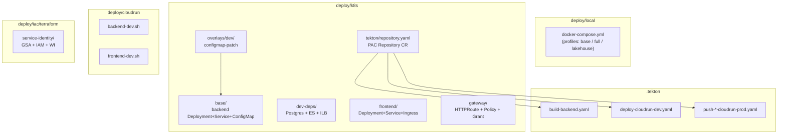
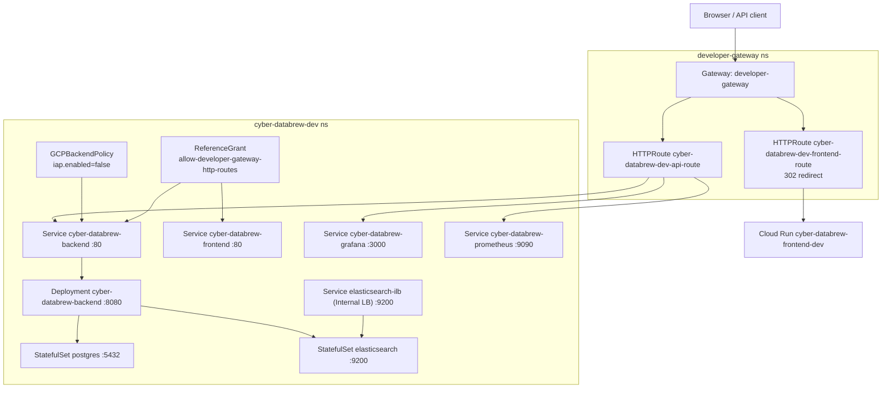
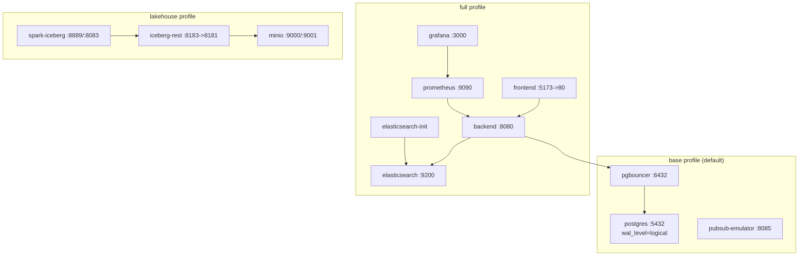
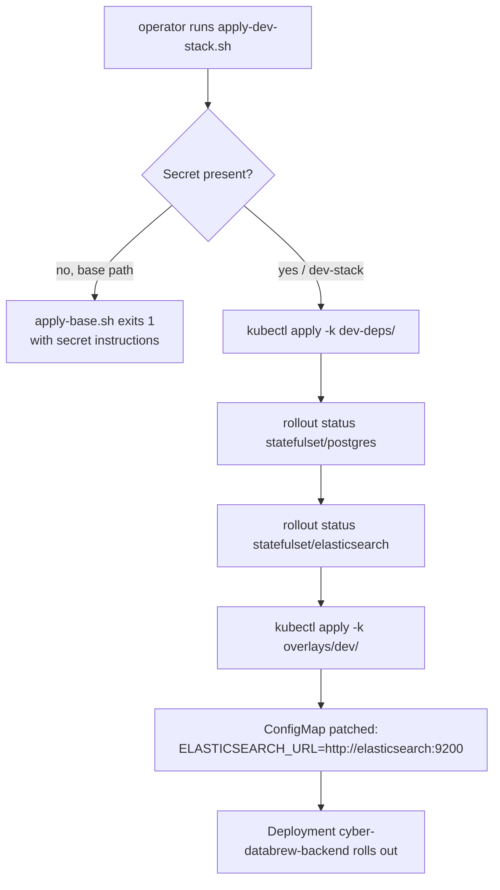
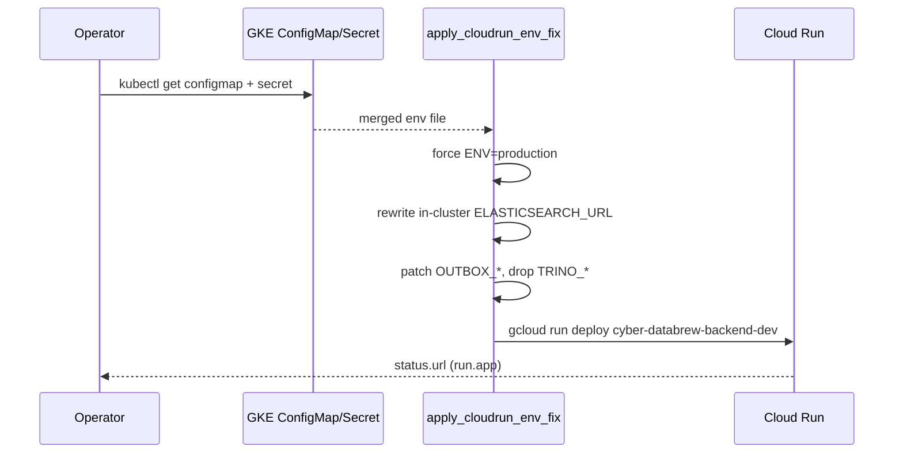
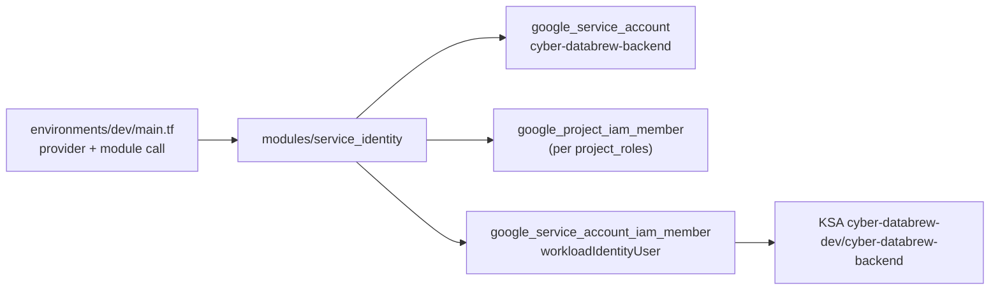
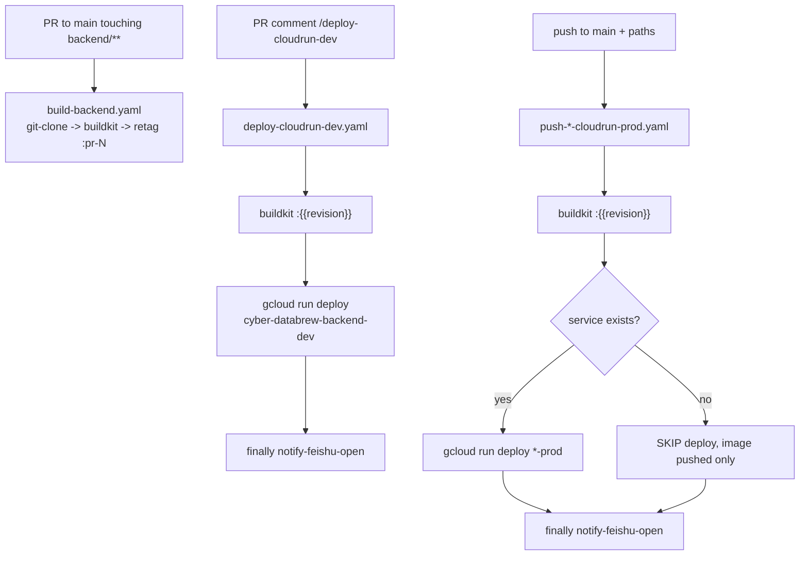
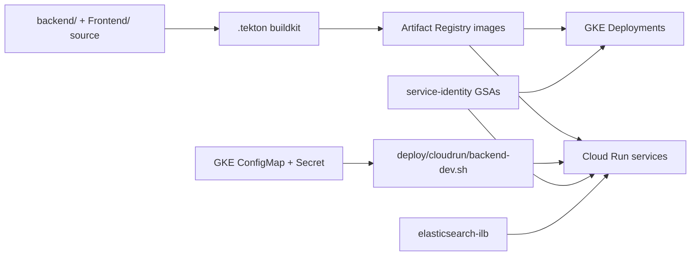

# Deployment Architecture

<cite>
**Referenced Files in This Document**

- [deploy/local/docker-compose.yml](file://deploy/local/docker-compose.yml)
- [deploy/local/README.md](file://deploy/local/README.md)
- [deploy/k8s/README.md](file://deploy/k8s/README.md)
- [deploy/k8s/namespaces.yaml](file://deploy/k8s/namespaces.yaml)
- [deploy/k8s/apply-base.sh](file://deploy/k8s/apply-base.sh)
- [deploy/k8s/apply-dev-stack.sh](file://deploy/k8s/apply-dev-stack.sh)
- [deploy/k8s/base/kustomization.yaml](file://deploy/k8s/base/kustomization.yaml)
- [deploy/k8s/base/configmap.yaml](file://deploy/k8s/base/configmap.yaml)
- [deploy/k8s/base/deployment.yaml](file://deploy/k8s/base/deployment.yaml)
- [deploy/k8s/base/service.yaml](file://deploy/k8s/base/service.yaml)
- [deploy/k8s/overlays/dev/kustomization.yaml](file://deploy/k8s/overlays/dev/kustomization.yaml)
- [deploy/k8s/overlays/dev/configmap-patch.yaml](file://deploy/k8s/overlays/dev/configmap-patch.yaml)
- [deploy/k8s/dev-deps/postgres.yaml](file://deploy/k8s/dev-deps/postgres.yaml)
- [deploy/k8s/dev-deps/elasticsearch-internal-lb.yaml](file://deploy/k8s/dev-deps/elasticsearch-internal-lb.yaml)
- [deploy/k8s/dev-deps/kustomization.yaml](file://deploy/k8s/dev-deps/kustomization.yaml)
- [deploy/k8s/frontend/deployment.yaml](file://deploy/k8s/frontend/deployment.yaml)
- [deploy/k8s/frontend/kustomization.yaml](file://deploy/k8s/frontend/kustomization.yaml)
- [deploy/k8s/frontend/ingress.yaml](file://deploy/k8s/frontend/ingress.yaml)
- [deploy/k8s/gateway/kustomization.yaml](file://deploy/k8s/gateway/kustomization.yaml)
- [deploy/k8s/gateway/frontend-route.yaml](file://deploy/k8s/gateway/frontend-route.yaml)
- [deploy/k8s/gateway/backend-route.yaml](file://deploy/k8s/gateway/backend-route.yaml)
- [deploy/k8s/gateway/backend-backend-policy.yaml](file://deploy/k8s/gateway/backend-backend-policy.yaml)
- [deploy/k8s/gateway/reference-grant.yaml](file://deploy/k8s/gateway/reference-grant.yaml)
- [deploy/k8s/tekton/repository.yaml](file://deploy/k8s/tekton/repository.yaml)
- [deploy/cloudrun/README.md](file://deploy/cloudrun/README.md)
- [deploy/cloudrun/backend-dev.sh](file://deploy/cloudrun/backend-dev.sh)
- [deploy/cloudrun/frontend-dev.sh](file://deploy/cloudrun/frontend-dev.sh)
- [deploy/cloudrun/frontend-cloudrun.Dockerfile](file://deploy/cloudrun/frontend-cloudrun.Dockerfile)
- [deploy/iac/terraform/README.md](file://deploy/iac/terraform/README.md)
- [deploy/iac/terraform/service-identity/environments/dev/main.tf](file://deploy/iac/terraform/service-identity/environments/dev/main.tf)
- [deploy/iac/terraform/service-identity/modules/service_identity/main.tf](file://deploy/iac/terraform/service-identity/modules/service_identity/main.tf)
- [.tekton/README.md](file://.tekton/README.md)
- [.tekton/build-backend.yaml](file://.tekton/build-backend.yaml)
- [.tekton/deploy-cloudrun-dev.yaml](file://.tekton/deploy-cloudrun-dev.yaml)
- [.tekton/push-backend-cloudrun-prod.yaml](file://.tekton/push-backend-cloudrun-prod.yaml)
- [.tekton/push-frontend-cloudrun-prod.yaml](file://.tekton/push-frontend-cloudrun-prod.yaml)
</cite>

## Table of Contents
1. [Introduction](#introduction)
2. [Project Structure](#project-structure)
3. [Core Components](#core-components)
4. [Architecture Overview](#architecture-overview)
5. [Detailed Component Analysis](#detailed-component-analysis)
6. [Dependency Analysis](#dependency-analysis)
7. [Performance Considerations](#performance-considerations)
8. [Troubleshooting Guide](#troubleshooting-guide)
9. [Conclusion](#conclusion)
10. [Appendices](#appendices)

## Introduction

The cyber-databrew deployment surface spans five distinct targets, each suited to a
different point in the development-to-production lifecycle. The same two application
artifacts — a Go API server (`backend/`, Gin, listening on `:8080`) and a React SPA
served by Nginx (`Frontend/`, port `80`) — are packaged and shipped through:

- **Local Docker Compose** (`deploy/local/`) — a single Compose file with profiles for
  the base data layer, the full product stack, and the standalone lakehouse. This is the
  day-to-day developer environment.
- **Kubernetes / GKE** (`deploy/k8s/`) — Kustomize bases and overlays for backend,
  frontend, in-cluster dev dependencies, Gateway API routing, jobs, lakehouse, and
  monitoring, applied to the `cyber-databrew-dev` and `cyber-databrew-prod` namespaces.
- **Cloud Run scripts** (`deploy/cloudrun/`) — a non-breaking migration path that
  deploys selected services (backend, frontend, mcap-preview) to managed Cloud Run, often
  sourcing env from the existing GKE ConfigMap/Secret. `backend-dev.sh` is the canonical
  deployer; `backend-prod.sh` (CYB-4427) is a thin wrapper that exports prod overrides and
  `exec`s it, so both environments share one code path. See
  [Cloud Run](../operations/cloud-run.md) for the full env-override contract.
- **Terraform IaC** (`deploy/iac/terraform/`) — Layer A infrastructure whose lifecycle is
  independent of application releases (Google service accounts, IAM, Workload Identity).
- **Tekton Pipelines-as-Code** (`.tekton/`) — CI/CD that builds backend/frontend images
  with BuildKit and deploys to Cloud Run on PR comment or push to `main`.

The audience for this page is anyone provisioning a new environment, debugging a failed
rollout, or reasoning about how a code change reaches a running service. Each target is
described with its real resource names, image references, and the GCP project
(`green-valley-442103`, region `us-central1`) that hosts them.

**Section sources**
- [deploy/local/README.md](file://deploy/local/README.md#L1-L45)
- [deploy/k8s/README.md](file://deploy/k8s/README.md#L1-L33)
- [deploy/cloudrun/README.md](file://deploy/cloudrun/README.md#L1-L31)
- [deploy/iac/terraform/README.md](file://deploy/iac/terraform/README.md#L1-L36)
- [.tekton/README.md](file://.tekton/README.md#L1-L23)

## Project Structure

The deployment assets live in two top-level locations: `deploy/` (manifests, scripts,
Compose, Terraform) and `.tekton/` (Pipelines-as-Code definitions). The layered split is
deliberate: Terraform owns release-independent infrastructure (Layer A) and Kubernetes
manifests own the application (Layer B), as documented in the Terraform README.

- `deploy/local/` — `docker-compose.yml` (one file, profile-driven), Elasticsearch index
  init scripts, Iceberg notebooks, PgBouncer config, local Prometheus/Grafana provisioning,
  and a loadtest harness.
- `deploy/k8s/base/` — backend `Deployment` + `Service` + `ConfigMap`, plus a gitignored
  `secret.local.yaml` derived from `secret.example.yaml`.
- `deploy/k8s/overlays/dev/` — Kustomize overlay that layers the base and patches the
  ConfigMap with an in-cluster `ELASTICSEARCH_URL`.
- `deploy/k8s/dev-deps/` — in-cluster Postgres + Elasticsearch `StatefulSet`s and an
  internal LoadBalancer exposing ES to VPC callers such as Cloud Run.
- `deploy/k8s/prod-deps/` (CYB-4427) — the prod equivalent, **Elasticsearch only** (prod
  Postgres is CloudSQL): ES `StatefulSet` + headless `Service` + internal LoadBalancer,
  pinned to namespace `cyber-databrew-prod`.
- `deploy/k8s/frontend/` — frontend `Deployment` + `Service` + `Ingress` + Nginx ConfigMap.
- `deploy/k8s/gateway/` — Gateway API `HTTPRoute`s, `ReferenceGrant`, and `GCPBackendPolicy`
  manifests bound to a shared `developer-gateway`.
- `deploy/k8s/jobs/`, `deploy/k8s/lakehouse-gcs/`, `deploy/k8s/lakehouse-minio/`,
  `deploy/k8s/monitoring/`, `deploy/k8s/mcap-preview/` — supporting one-off jobs, lakehouse
  stacks, observability, and the mcap-preview service.
- `deploy/k8s/tekton/repository.yaml` — the PAC `Repository` CR that registers the GitHub
  repo with the controller.
- `deploy/cloudrun/` — `backend-dev.sh`, `frontend-dev.sh`, `mcap-preview-dev.sh`, the
  Cloud Run-specific frontend Dockerfile/Nginx config, and Cloud Build configs.
- `deploy/iac/terraform/service-identity/` — the only live Terraform stack, with a reusable
  `service_identity` module and a `dev` environment instantiation.
- `.tekton/` — `build-backend.yaml`, `deploy-cloudrun-dev.yaml`, and the four
  `push-*-cloudrun-{dev,prod}.yaml` pipelines.

**Diagram sources**
- [deploy/local/docker-compose.yml](file://deploy/local/docker-compose.yml#L1-L10)
- [deploy/k8s/base/kustomization.yaml](file://deploy/k8s/base/kustomization.yaml#L1-L8)
- [deploy/k8s/overlays/dev/kustomization.yaml](file://deploy/k8s/overlays/dev/kustomization.yaml#L1-L6)
- [deploy/k8s/tekton/repository.yaml](file://deploy/k8s/tekton/repository.yaml#L11-L17)
- [deploy/iac/terraform/service-identity/environments/dev/main.tf](file://deploy/iac/terraform/service-identity/environments/dev/main.tf#L22-L39)

**Section sources**
- [deploy/k8s/README.md](file://deploy/k8s/README.md#L1-L120)
- [deploy/iac/terraform/README.md](file://deploy/iac/terraform/README.md#L1-L83)
- [.tekton/README.md](file://.tekton/README.md#L1-L33)

## Core Components

The two shipped artifacts and the resource names they map to across targets:

- **Backend API** — image
  `us-central1-docker.pkg.dev/green-valley-442103/rick-cyber-databrew-images/cyber-databrew-backend:dev-latest`
  in GKE, exposed as `Deployment/cyber-databrew-backend` behind `Service/cyber-databrew-backend`
  (ClusterIP, port `80` → container `8080`). On Cloud Run the same code runs as service
  `cyber-databrew-backend-dev` / `cyber-databrew-backend-prod`. Health contract is
  `GET /healthz → 200`, used by both readiness and liveness probes.
- **Frontend SPA** — image
  `us-central1-docker.pkg.dev/green-valley-442103/video-proc-images/cyber-databrew-frontend:dev-latest`,
  `Deployment/cyber-databrew-frontend` + `Service/cyber-databrew-frontend` (port `80`), with a
  Kubernetes-specific Nginx ConfigMap that proxies `/api/*` to the backend Service. The Cloud
  Run variant is `cyber-databrew-frontend-dev` / `-prod`.
- **In-cluster dev dependencies** — `StatefulSet/postgres` (Postgres 16, 20Gi PVC) and
  `StatefulSet/elasticsearch` (single-node, no HTTP auth), plus `Service/elasticsearch-ilb`
  (internal LoadBalancer) for VPC callers.
- **Configuration** — `ConfigMap/cyber-databrew-config` (non-sensitive defaults from
  `backend/.env.example`) and `Secret/cyber-databrew-secrets` (DB credentials +
  `DATABREW_TOKEN`). Env keys are shared across all targets.
- **CI/CD primitives** — reusable cluster Tasks `git-clone`, `buildkit`, and `retag-image`
  in the `tekton-pipelines` namespace, driven by the `tekton-builder` ServiceAccount.

**Section sources**
- [deploy/k8s/base/deployment.yaml](file://deploy/k8s/base/deployment.yaml#L16-L65)
- [deploy/k8s/base/service.yaml](file://deploy/k8s/base/service.yaml#L1-L18)
- [deploy/k8s/base/configmap.yaml](file://deploy/k8s/base/configmap.yaml#L1-L45)
- [deploy/k8s/frontend/deployment.yaml](file://deploy/k8s/frontend/deployment.yaml#L1-L48)
- [deploy/k8s/dev-deps/postgres.yaml](file://deploy/k8s/dev-deps/postgres.yaml#L17-L72)

## Architecture Overview

The runtime topology differs by target, but the request path is always the same shape:
an edge proxy (Nginx, Ingress, or Gateway) fronts the frontend, and `/api/*` is proxied to
the backend, which talks to Postgres, Elasticsearch, and optionally the lakehouse.

In **GKE production routing**, the shared `developer-gateway` (in namespace
`developer-gateway`) hosts two hostnames. `cyber-databrew-dev.cyberorigin.ai` is an
`HTTPRoute` that **redirects (302)** to the frontend Cloud Run URL, while
`api-cyber-databrew-dev.cyberorigin.ai` routes by path prefix into the cluster:
`/ops/grafana` → Grafana, `/ops/prometheus` → Prometheus, and `/` → the backend Service.
A `ReferenceGrant` in `cyber-databrew-dev` authorizes the cross-namespace route to target
the frontend and backend Services, and a `GCPBackendPolicy` toggles IAP.

**Diagram sources**
- [deploy/k8s/gateway/frontend-route.yaml](file://deploy/k8s/gateway/frontend-route.yaml#L1-L24)
- [deploy/k8s/gateway/backend-route.yaml](file://deploy/k8s/gateway/backend-route.yaml#L1-L44)
- [deploy/k8s/gateway/reference-grant.yaml](file://deploy/k8s/gateway/reference-grant.yaml#L1-L17)
- [deploy/k8s/gateway/backend-backend-policy.yaml](file://deploy/k8s/gateway/backend-backend-policy.yaml#L1-L13)
- [deploy/k8s/dev-deps/elasticsearch-internal-lb.yaml](file://deploy/k8s/dev-deps/elasticsearch-internal-lb.yaml#L4-L24)

**Section sources**
- [deploy/k8s/README.md](file://deploy/k8s/README.md#L100-L173)
- [deploy/k8s/gateway/kustomization.yaml](file://deploy/k8s/gateway/kustomization.yaml#L1-L9)

## Detailed Component Analysis

#### Local Docker Compose

`deploy/local/docker-compose.yml` is a single Compose file whose optional stacks are
selected with Compose v2 **profiles** rather than multiple files. Three usage modes are
documented at the top of the file:

- `docker compose up -d` — the base data layer only: `postgres` (Postgres 16 with
  `wal_level=logical`, `:5432`), `pgbouncer` (`:6432`), and the `pubsub-emulator` (`:8085`).
  Postgres mounts `backend/migrations` into `/docker-entrypoint-initdb.d` so DDL is applied
  on first boot.
- `docker compose --profile full up -d --build` — adds `backend` (`:8080`), `frontend`
  (`:5173` → container `80`), `elasticsearch` (`:9200`) plus an `elasticsearch-init` job that
  creates the `assets` index mapping, the lakehouse services, and the full observability
  stack (`postgres-exporter`, `elasticsearch-exporter`, `blackbox-exporter`, `prometheus`
  on `:9090`, `grafana` on `:3000`).
- `docker compose --profile lakehouse up -d` — the standalone Iceberg stack: `minio`
  (`:9000`/`:9001`), `minio-init` (creates `warehouse`/`datalake` buckets), `iceberg-rest`
  (`apache/iceberg-rest-fixture`, host `:8183` → `8181`), and `spark-iceberg` (Jupyter
  `:8889`, Spark UI `:8083`).

The backend service wires its DB through PgBouncer (`DB_HOST=pgbouncer`, `DB_PORT=6432`),
waits for `nc -z pgbouncer 6432` before `exec ./server`, and only starts after
`elasticsearch-init` and `lakehouse-mvp-init` complete successfully. Health is checked via
`wget http://localhost:8080/healthz`. Named volumes (`pgdata`, `elasticsearch-data`,
`iceberg-minio-data`, etc.) persist data across restarts; `down -v` is the destructive reset.

The README documents a recommended day-to-day flow that skips Compose entirely for
frontend/backend iteration (host `go run ./cmd/server` + Vite dev server proxying `/api`),
reserving `--profile full` for the Nginx-packaged frontend and the full dependency set.

**Diagram sources**
- [deploy/local/docker-compose.yml](file://deploy/local/docker-compose.yml#L11-L126)
- [deploy/local/docker-compose.yml](file://deploy/local/docker-compose.yml#L128-L266)
- [deploy/local/docker-compose.yml](file://deploy/local/docker-compose.yml#L382-L463)

**Section sources**
- [deploy/local/docker-compose.yml](file://deploy/local/docker-compose.yml#L1-L126)
- [deploy/local/README.md](file://deploy/local/README.md#L1-L45)

#### Kubernetes (Kustomize bases and overlays)

The backend is deployed from `deploy/k8s/base/` via Kustomize, which composes `configmap.yaml`,
`deployment.yaml`, and `service.yaml`. The `Deployment/cyber-databrew-backend` runs a single
replica, pulls config from `ConfigMap/cyber-databrew-config` and `Secret/cyber-databrew-secrets`
via `envFrom`, and exposes container port `8080` named `http`. Readiness and liveness both hit
`/healthz`, and the pod template carries Prometheus scrape annotations (`prometheus.io/scrape`,
`port: 8080`, `path: /metrics`). The `ClusterIP` Service maps port `80` → targetPort `http`.

`apply-base.sh` is the recommended entrypoint: it defaults the namespace to
`cyber-databrew-dev`, fails fast if `Secret/cyber-databrew-secrets` is missing (unless
`SKIP_SECRET_CHECK=1`), validates the kustomize render, and applies (or dry-runs with
`DRY_RUN=1`).

The `overlays/dev/` Kustomization layers `../../base` and applies `configmap-patch.yaml`,
which overrides only `ELASTICSEARCH_URL=http://elasticsearch:9200` so the dev backend points
at the in-cluster ES Service. The base ConfigMap ships production defaults (`ENV: production`,
`LAKEHOUSE_BACKEND: none`, empty `ELASTICSEARCH_URL`, outbox relay tuning, rate limiting off).

`apply-dev-stack.sh` provisions a complete in-cluster environment: it applies `dev-deps/`
(Postgres + Elasticsearch StatefulSets), waits for both StatefulSets to roll out
(`--timeout=300s`), then applies the `overlays/dev/` backend. The two namespaces
`cyber-databrew-dev` and `cyber-databrew-prod` are created once from `namespaces.yaml`; the
header note records the promotion model — dev gets PR-driven rollouts, prod gets
merge-to-main promotion.

**Diagram sources**
- [deploy/k8s/apply-dev-stack.sh](file://deploy/k8s/apply-dev-stack.sh#L9-L20)
- [deploy/k8s/apply-base.sh](file://deploy/k8s/apply-base.sh#L11-L38)
- [deploy/k8s/overlays/dev/configmap-patch.yaml](file://deploy/k8s/overlays/dev/configmap-patch.yaml#L1-L6)

**Section sources**
- [deploy/k8s/base/deployment.yaml](file://deploy/k8s/base/deployment.yaml#L16-L65)
- [deploy/k8s/base/service.yaml](file://deploy/k8s/base/service.yaml#L1-L18)
- [deploy/k8s/base/configmap.yaml](file://deploy/k8s/base/configmap.yaml#L1-L45)
- [deploy/k8s/overlays/dev/kustomization.yaml](file://deploy/k8s/overlays/dev/kustomization.yaml#L1-L6)
- [deploy/k8s/namespaces.yaml](file://deploy/k8s/namespaces.yaml#L1-L18)

#### Kubernetes frontend and Gateway routing

The frontend Kustomization (`deploy/k8s/frontend/`) renders a `Deployment`, `Service`,
`Ingress`, and an Nginx ConfigMap. `Deployment/cyber-databrew-frontend` runs the
`cyber-databrew-frontend:dev-latest` image with `imagePullPolicy: Always`, serves on port
`80`, probes `/`, and mounts `ConfigMap/cyber-databrew-frontend-nginx` at
`/etc/nginx/conf.d/default.conf` so `/api/*` is proxied to `Service/cyber-databrew-backend`.
The legacy `Ingress` (ingressClassName `gce`, host `cyber-databrew-dev.example.com`) is an
alternative to the Gateway path.

The Gateway path (`deploy/k8s/gateway/`) is the documented production exposure. Its
Kustomization bundles `frontend-route.yaml`, `backend-route.yaml`, `reference-grant.yaml`,
and three `GCPBackendPolicy`/HealthCheckPolicy manifests. The frontend `HTTPRoute` performs a
`302` redirect to the frontend Cloud Run `run.app` host; the backend `HTTPRoute`
path-routes `/ops/grafana`, `/ops/prometheus`, and `/` into the cluster. The
`bootstrap-like-iac.sh` script mirrors the `cyber-iac` sequence: ensure Certificate Manager
DNS authorization/cert/cert-map, print Cloudflare records, then apply the route + grant +
policy set (idempotent).

**Section sources**
- [deploy/k8s/frontend/deployment.yaml](file://deploy/k8s/frontend/deployment.yaml#L1-L48)
- [deploy/k8s/frontend/kustomization.yaml](file://deploy/k8s/frontend/kustomization.yaml#L1-L7)
- [deploy/k8s/frontend/ingress.yaml](file://deploy/k8s/frontend/ingress.yaml#L1-L20)
- [deploy/k8s/gateway/kustomization.yaml](file://deploy/k8s/gateway/kustomization.yaml#L1-L9)
- [deploy/k8s/README.md](file://deploy/k8s/README.md#L65-L120)

#### In-cluster dev dependencies

`deploy/k8s/dev-deps/` provisions the stateful backing services for test environments. The
Kustomization assembles `postgres.yaml`, `elasticsearch.yaml`, and
`elasticsearch-internal-lb.yaml`. `StatefulSet/postgres` runs `postgres:16-alpine` with a
20Gi `volumeClaimTemplate`, fixed dev credentials (`postgres`/`postgres`/`cyber_databrew_dev`),
and `pg_isready` probes; its headless `Service/postgres` exposes `:5432`. Elasticsearch is a
single-node StatefulSet without HTTP auth (matching the local Compose dev template).

Because Cloud Run cannot resolve cluster DNS (`elasticsearch`) or reach a plain ClusterIP from
the VPC, `Service/elasticsearch-ilb` is an internal `LoadBalancer` (annotation
`networking.gke.io/load-balancer-type: Internal`) that re-exposes ES on `:9200` to VPC callers
while staying private. The README notes that migrations are not auto-applied by
`apply-dev-stack.sh` — the operator runs the migration workflow against `svc/postgres`
separately.

**Section sources**
- [deploy/k8s/dev-deps/postgres.yaml](file://deploy/k8s/dev-deps/postgres.yaml#L1-L72)
- [deploy/k8s/dev-deps/elasticsearch-internal-lb.yaml](file://deploy/k8s/dev-deps/elasticsearch-internal-lb.yaml#L1-L24)
- [deploy/k8s/dev-deps/kustomization.yaml](file://deploy/k8s/dev-deps/kustomization.yaml#L1-L6)
- [deploy/k8s/README.md](file://deploy/k8s/README.md#L34-L63)

#### Cloud Run dev scripts

`deploy/cloudrun/` is an explicitly non-breaking migration path: deploy a Cloud Run service,
verify with its generated `run.app` URL, then switch ingress later. `backend-dev.sh` deploys
`cyber-databrew-backend-dev` (project `green-valley-442103`, region `us-central1`). By default
it sources env from the GKE `cyber-databrew-config` ConfigMap and `cyber-databrew-secrets`
Secret (`SOURCE_K8S_ENV=true`), then runs `apply_cloudrun_env_fix` to rewrite cluster-only
footguns: it forces `ENV=production`, detects in-cluster `ELASTICSEARCH_URL` values
(`://elasticsearch:` etc.) and replaces them with a VPC-reachable URL, patches `OUTBOX_*`
defaults, and strips legacy Trino keys. It warns when `DB_HOST=postgres` (cluster DNS) and can
auto-fall back to the Postgres pod IP. Secrets like `DB_PASSWORD` are bound via
`--set-secrets` from Secret Manager rather than plaintext. The deploy uses
`--no-cpu-throttling`, `--cpu 1`, `--memory 512Mi`, `--max-instances 5`, and optional
`--vpc-connector`/`--vpc-egress`.

`frontend-dev.sh` builds a two-stage image: first the SPA base image from `Frontend/Dockerfile`
(injecting `VITE_APP_VERSION`/`VITE_BUILD_REF` from git), then the Cloud Run image from
`frontend-cloudrun.Dockerfile` which `FROM`s the base, swaps in
`deploy/cloudrun/frontend-nginx.conf` (routing `/api/v1/preview/` → mcap-preview-dev and
`/api/` → cyber-databrew-backend-dev), and overlays the Argo UI bundle. It deploys
`cyber-databrew-frontend-dev` on port `80`.

**Diagram sources**
- [deploy/cloudrun/backend-dev.sh](file://deploy/cloudrun/backend-dev.sh#L167-L178)
- [deploy/cloudrun/backend-dev.sh](file://deploy/cloudrun/backend-dev.sh#L111-L141)
- [deploy/cloudrun/backend-dev.sh](file://deploy/cloudrun/backend-dev.sh#L263-L308)

**Section sources**
- [deploy/cloudrun/backend-dev.sh](file://deploy/cloudrun/backend-dev.sh#L14-L77)
- [deploy/cloudrun/frontend-dev.sh](file://deploy/cloudrun/frontend-dev.sh#L1-L67)
- [deploy/cloudrun/frontend-cloudrun.Dockerfile](file://deploy/cloudrun/frontend-cloudrun.Dockerfile#L1-L6)
- [deploy/cloudrun/README.md](file://deploy/cloudrun/README.md#L1-L72)

#### Terraform IaC (service-identity)

The Terraform layer is intentionally narrow: only resources whose lifecycle is independent of
application releases live here. The single live stack is `service-identity/`. The reusable
`modules/service_identity` creates one `google_service_account` per workload, attaches
`google_project_iam_member` for each role in `var.project_roles`, and binds a
`google_service_account_iam_member` with `roles/iam.workloadIdentityUser` so the matching
Kubernetes ServiceAccount (`<project>.svc.id.goog[<namespace>/<ksa>]`) can impersonate the GSA
via Workload Identity. The `environments/dev/main.tf` pins `google ~> 7.29.0`, configures the
provider for `var.project_id`, and instantiates the module for the backend
(`account_id = cyber-databrew-backend`, KSA `cyber-databrew-backend`) with `project_roles`
currently commented out pending least-privilege review.

State is per-stack-per-env in GCS (dev → `gs://terraform_staging_state_store/...`), secrets
stay in Secret Manager (not tfvars), and quality gates (TFLint, gitleaks, detect-secrets,
pre-commit) mirror the `cyber-iac` org standard.

**Diagram sources**
- [deploy/iac/terraform/service-identity/environments/dev/main.tf](file://deploy/iac/terraform/service-identity/environments/dev/main.tf#L22-L41)
- [deploy/iac/terraform/service-identity/modules/service_identity/main.tf](file://deploy/iac/terraform/service-identity/modules/service_identity/main.tf#L16-L36)

**Section sources**
- [deploy/iac/terraform/README.md](file://deploy/iac/terraform/README.md#L1-L83)
- [deploy/iac/terraform/service-identity/modules/service_identity/main.tf](file://deploy/iac/terraform/service-identity/modules/service_identity/main.tf#L1-L36)

#### Tekton Pipelines-as-Code (CI/CD)

`.tekton/` defines Pipelines-as-Code (PAC) pipelines. The PAC controller in the
`pipelines-as-code` namespace only acts on the repo once `deploy/k8s/tekton/repository.yaml`
(the `Repository` CR for `https://github.com/CyberOrigin2077/cyber-databrew`) is applied;
without it, webhooks are dropped silently. All build pipelines run as the `tekton-builder`
ServiceAccount and reuse cluster Tasks `git-clone`, `buildkit`, and `retag-image` from
`tekton-pipelines`, scheduling the heavy build step onto the `build-pool-tier=warm` node pool.

The active pipelines:

- **`build-backend.yaml`** — fires on `pull_request` targeting `main` when `backend/**` or the
  pipeline file changes. It clones, BuildKit-builds `backend/Dockerfile` into
  `cyber-databrew-backend:{{revision}}` (with a `:buildcache` cache image), then retags to
  `:pr-{{pull_request_number}}-{{revision}}`.
- **`deploy-cloudrun-dev.yaml`** — manual: triggered by the PR comment
  `/deploy-cloudrun-dev` on a PR to `main` or `dev` touching `backend/**` or
  `deploy/cloudrun/**`. It builds the image then runs a `gcloud run deploy` step for
  `cyber-databrew-backend-dev` (port `8080`, `--cpu 1`, `--memory 512Mi`, `--max-instances 5`,
  `--no-cpu-throttling`, `--cpu-boost`, `--vpc-connector cr-central-conn`,
  `--vpc-egress private-ranges-only`), with no `--set-env-vars` so existing revision env and
  Secret Manager bindings are preserved.
- **`push-backend-cloudrun-prod.yaml`** / **`push-frontend-cloudrun-prod.yaml`** — fire on push
  to `main` (or `/deploy-cloudrun-prod-*` comment). They build, then deploy
  `cyber-databrew-backend-prod` / `cyber-databrew-frontend-prod` **only if the service already
  exists**; otherwise the run succeeds image-only after the Artifact Registry push.
- **`push-backend-cloudrun-dev.yaml`** / **`push-frontend-cloudrun-dev.yaml`** — disabled
  templates (`on-cel-expression: false`); use the comment deploy or the local `*-dev.sh`
  scripts instead.

Each Cloud Run pipeline ends with a `finally` task `notify-feishu-open` that posts a Feishu
message (webhook or app-token path) and prints `SKIP` if the `feishu-open-notify` Secret is
absent, so the run still succeeds.

**Diagram sources**
- [.tekton/build-backend.yaml](file://.tekton/build-backend.yaml#L13-L120)
- [.tekton/deploy-cloudrun-dev.yaml](file://.tekton/deploy-cloudrun-dev.yaml#L20-L146)
- [.tekton/push-frontend-cloudrun-prod.yaml](file://.tekton/push-frontend-cloudrun-prod.yaml#L104-L138)

**Section sources**
- [.tekton/README.md](file://.tekton/README.md#L1-L118)
- [.tekton/deploy-cloudrun-dev.yaml](file://.tekton/deploy-cloudrun-dev.yaml#L1-L146)
- [.tekton/push-backend-cloudrun-prod.yaml](file://.tekton/push-backend-cloudrun-prod.yaml#L1-L60)
- [deploy/k8s/tekton/repository.yaml](file://deploy/k8s/tekton/repository.yaml#L1-L17)

## Dependency Analysis

The deployment targets share artifacts and config but are otherwise independent. The
strongest cross-target dependency is the Cloud Run scripts reading GKE state: `backend-dev.sh`
pulls the `cyber-databrew-config` ConfigMap and `cyber-databrew-secrets` Secret directly from
the `cyber-databrew-dev` namespace and reuses the in-cluster Postgres/Elasticsearch (via the
ILB) as managed dependencies. Tekton depends on the cluster's reusable Tasks, the
`tekton-builder` SA, the PAC `Repository` CR, and Artifact Registry repos
(`rick-cyber-databrew-images` for backend, `video-proc-images` for frontend). Terraform
service-identity produces the GSAs that GKE ServiceAccounts and Cloud Run runtime identities
consume.

**Diagram sources**
- [deploy/cloudrun/backend-dev.sh](file://deploy/cloudrun/backend-dev.sh#L167-L178)
- [.tekton/build-backend.yaml](file://.tekton/build-backend.yaml#L93-L119)
- [deploy/iac/terraform/service-identity/modules/service_identity/main.tf](file://deploy/iac/terraform/service-identity/modules/service_identity/main.tf#L30-L36)

**Section sources**
- [deploy/cloudrun/README.md](file://deploy/cloudrun/README.md#L73-L145)
- [deploy/iac/terraform/README.md](file://deploy/iac/terraform/README.md#L73-L83)

## Performance Considerations

- **Cloud Run scale-to-zero** — both backend and frontend dev services use
  `--min-instances 0 --max-instances 5`, accepting cold-start latency in exchange for cost.
  The backend dev pipeline adds `--cpu-boost` and `--no-cpu-throttling` to mitigate cold start;
  prod frontend allows `--max-instances 10`.
- **PgBouncer pooling (local)** — the local backend connects through PgBouncer (`:6432`) rather
  than Postgres directly, and Postgres runs with `wal_level=logical` plus raised replication
  slots/senders to support the outbox/CDC path.
- **Outbox relay tuning** — the base ConfigMap sets relay batch size `500`, interval `500ms`,
  `OUTBOX_RELAY_PARALLEL_KEYS=8`, and `OUTBOX_INTERNAL_SUBSCRIBER_WORKERS=16`; Cloud Run
  preserves these defaults via the env-fix unless explicitly patched.
- **BuildKit cache** — every Tekton build references a `:buildcache` cache image and runs on a
  warm node pool with `2` CPU / `6Gi` requests and `10Gi` ephemeral storage for the buildkitd
  sidecar, keeping rebuilds fast.
- **Internal LoadBalancer** — exposing Elasticsearch via an internal LB (rather than a public
  endpoint) keeps cross-target traffic on the VPC; `loadBalancerSourceRanges` is omitted so GCP
  health-check ranges succeed while the VIP stays private.

**Section sources**
- [deploy/cloudrun/backend-dev.sh](file://deploy/cloudrun/backend-dev.sh#L27-L37)
- [.tekton/deploy-cloudrun-dev.yaml](file://.tekton/deploy-cloudrun-dev.yaml#L130-L146)
- [deploy/k8s/base/configmap.yaml](file://deploy/k8s/base/configmap.yaml#L29-L45)
- [deploy/k8s/dev-deps/elasticsearch-internal-lb.yaml](file://deploy/k8s/dev-deps/elasticsearch-internal-lb.yaml#L11-L24)

## Troubleshooting Guide

The K8s README ships a `diagnose.sh` helper (`K8S_NAMESPACE=... ./deploy/k8s/diagnose.sh`) and
a symptom table:

- **`ImagePullBackOff`** — Artifact Registry auth, wrong tag, or an image that exists only on
  a laptop; configure `docker-credential-gcloud` / AR IAM.
- **`CrashLoopBackOff` with Postgres errors** — `DB_HOST`, firewall, Cloud SQL authorized
  networks, or Private Service Connect.
- **`CreateContainerConfigError`** — `Secret/cyber-databrew-secrets` missing or misnamed; this
  is also why `apply-base.sh` refuses to apply without the Secret present.

Cloud Run specifics from `backend-dev.sh` and the README:

- **`DB_HOST=postgres` unreachable** — the in-cluster DNS name does not resolve from Cloud Run.
  Set `DB_HOST_OVERRIDE` (and likely `VPC_CONNECTOR`); the script auto-falls back to the
  Postgres pod IP as a temporary convenience.
- **In-cluster `ELASTICSEARCH_URL` carried into Cloud Run** — `apply_cloudrun_env_fix` rewrites
  it to `CLOUDRUN_ELASTICSEARCH_URL`; point it at the ES ILB VIP read from
  `svc/elasticsearch-ilb`.
- **`Schema 'robot' does not exist`** — lakehouse namespace skew; pass
  `LAKEHOUSE_BQ_DATASET_OVERRIDE` matching the BigLake Iceberg namespace.

For local Compose, AppleDouble sidecar files (`._*`) created on macOS break the BigQuery
catalog dir; the README prescribes `find deploy/local -name '._*' -delete` before
`docker compose up`. For Tekton, a pipeline that never fires usually means the PAC
`Repository` CR was not applied.

**Section sources**
- [deploy/k8s/README.md](file://deploy/k8s/README.md#L175-L189)
- [deploy/cloudrun/backend-dev.sh](file://deploy/cloudrun/backend-dev.sh#L231-L244)
- [deploy/cloudrun/README.md](file://deploy/cloudrun/README.md#L113-L145)
- [deploy/local/README.md](file://deploy/local/README.md#L46-L52)
- [deploy/k8s/tekton/repository.yaml](file://deploy/k8s/tekton/repository.yaml#L1-L10)

## Conclusion

cyber-databrew deploys one backend and one frontend artifact across five targets that map to
the development lifecycle: Docker Compose for local iteration, Kustomize-based GKE for the
canonical clustered environment, Cloud Run scripts as a non-breaking migration path that reuses
GKE config, Terraform for release-independent identity/IAM, and Tekton PAC for build-and-deploy
automation. Resource names, the GCP project `green-valley-442103`, and region `us-central1` are
consistent across targets, and the env contract (`cyber-databrew-config` + `cyber-databrew-secrets`,
`GET /healthz`) is shared. The dev/prod namespace split and the "deploy only if service exists"
guard in the prod pipelines reflect an incremental, safety-first rollout posture.

## Appendices

### Image references

| Artifact | Registry image |
|---|---|
| Backend (GKE) | `us-central1-docker.pkg.dev/green-valley-442103/rick-cyber-databrew-images/cyber-databrew-backend:dev-latest` |
| Backend (Tekton build) | `.../rick-cyber-databrew-images/cyber-databrew-backend:{{revision}}` (+ `:pr-N`, `:buildcache`) |
| Frontend (GKE) | `us-central1-docker.pkg.dev/green-valley-442103/video-proc-images/cyber-databrew-frontend:dev-latest` |

### Cloud Run services

| Service | Script / pipeline | Port |
|---|---|---|
| `cyber-databrew-backend-dev` | `backend-dev.sh`, `deploy-cloudrun-dev.yaml` | 8080 |
| `cyber-databrew-frontend-dev` | `frontend-dev.sh` | 80 |
| `cyber-databrew-backend-prod` | `push-backend-cloudrun-prod.yaml` (if exists) | 8080 |
| `cyber-databrew-frontend-prod` | `push-frontend-cloudrun-prod.yaml` (if exists) | 80 |

### Compose profile → ports

| Profile | Key services (host ports) |
|---|---|
| base (default) | postgres 5432, pgbouncer 6432, pubsub-emulator 8085 |
| full | backend 8080, frontend 5173, elasticsearch 9200, prometheus 9090, grafana 3000 |
| lakehouse | minio 9000/9001, iceberg-rest 8183, spark 8889/8083 |

### Namespaces

| Namespace | Role |
|---|---|
| `cyber-databrew-dev` | PR `/deploy-dev` rollouts; in-cluster dev deps |
| `cyber-databrew-prod` | merge→main promote rollouts |
| `developer-gateway` | shared Gateway + HTTPRoutes |
| `tekton-pipelines` | PAC Repository CR, reusable Tasks, builds |

**Section sources**
- [deploy/k8s/base/deployment.yaml](file://deploy/k8s/base/deployment.yaml#L42-L44)
- [deploy/cloudrun/backend-dev.sh](file://deploy/cloudrun/backend-dev.sh#L14-L17)
- [deploy/local/README.md](file://deploy/local/README.md#L32-L45)
- [deploy/k8s/namespaces.yaml](file://deploy/k8s/namespaces.yaml#L1-L18)
