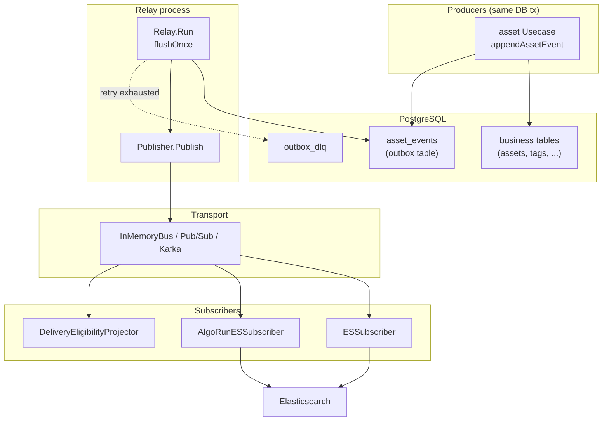
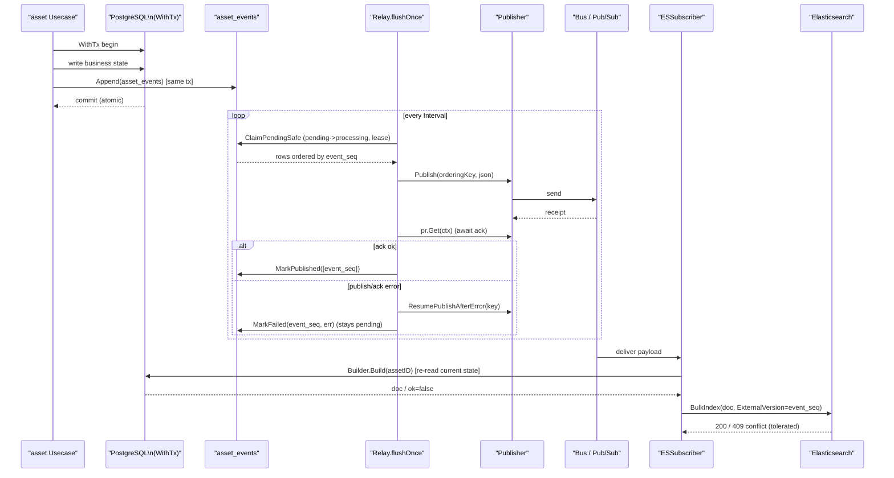
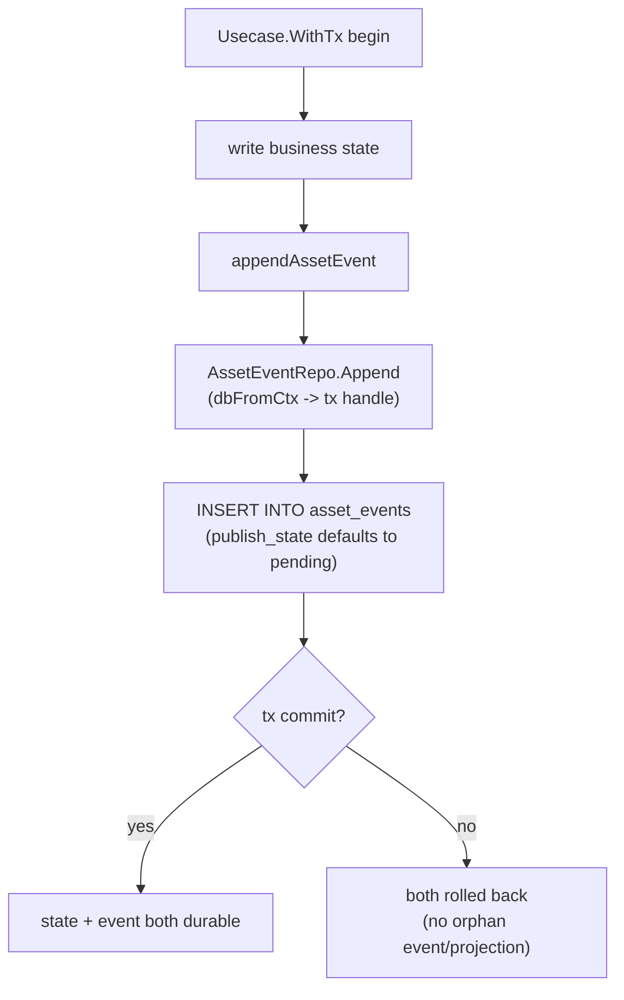
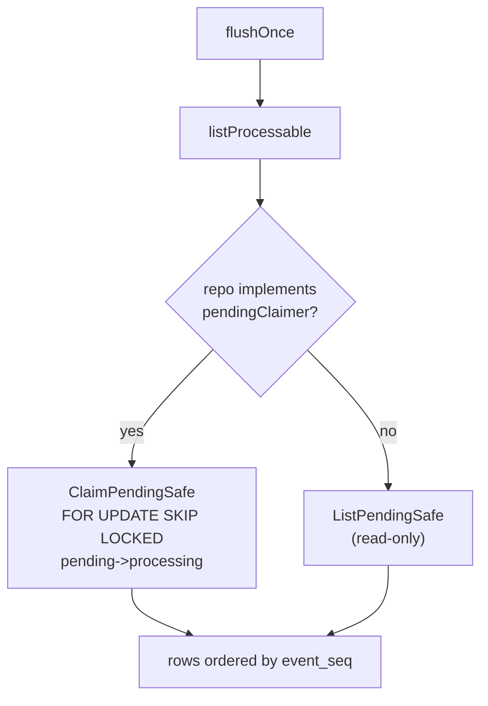
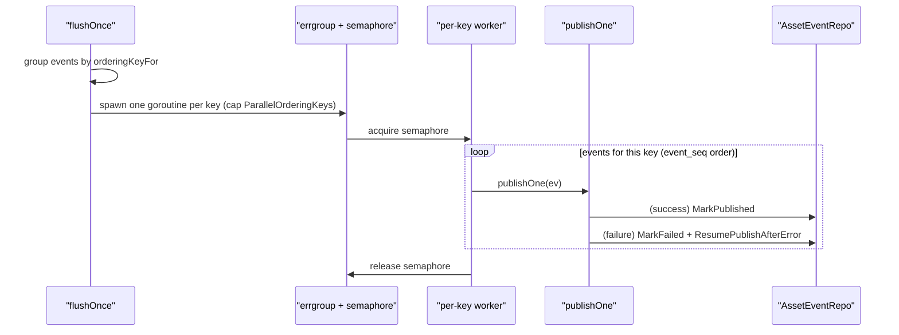
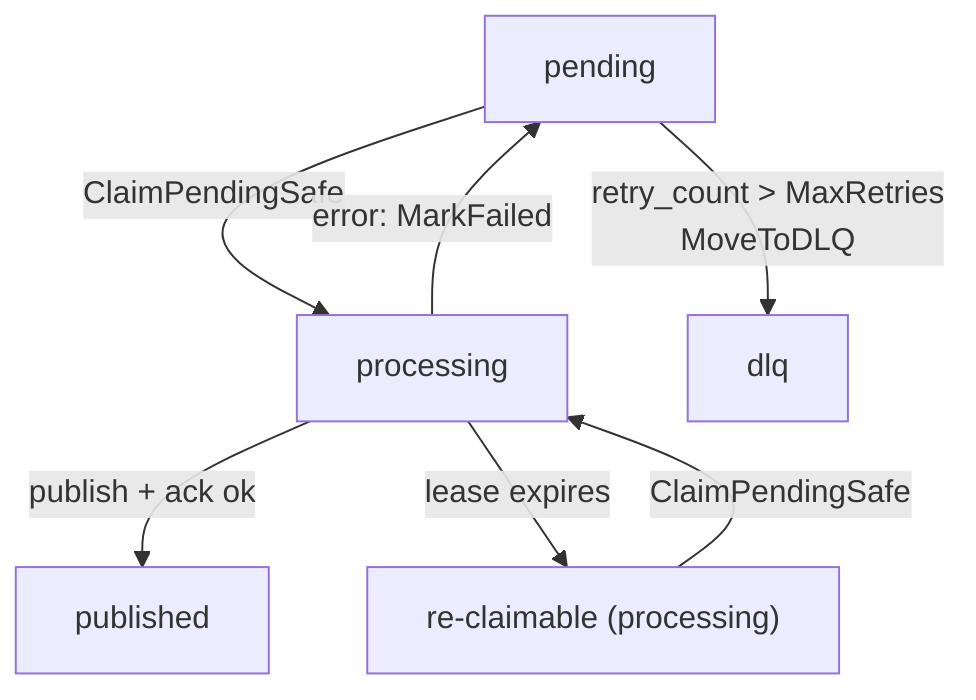
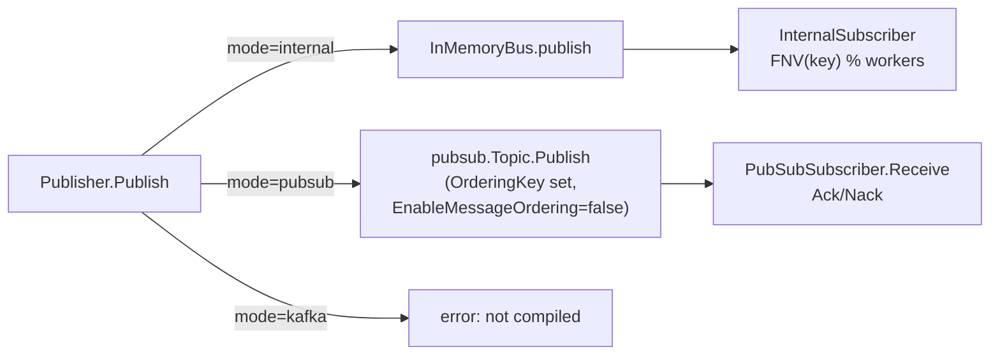
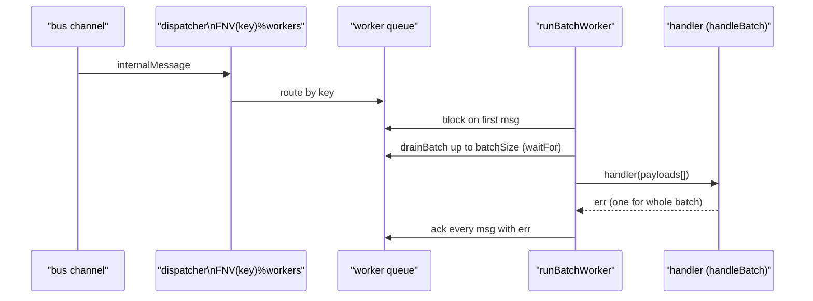
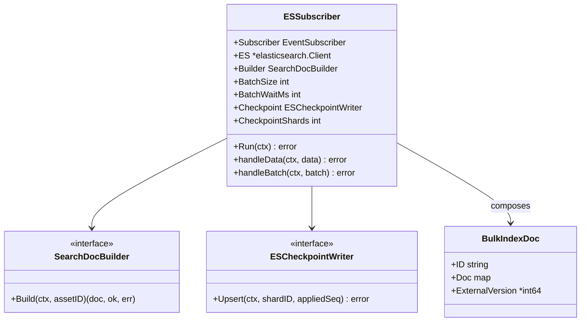
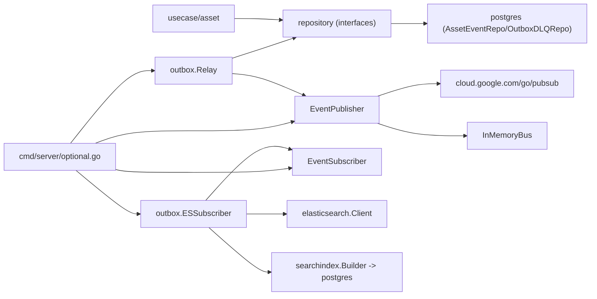

# Event & CDC Architecture

<cite>
**Referenced Files in This Document**

- [backend/internal/outbox/relay.go](file://backend/internal/outbox/relay.go)
- [backend/internal/outbox/publisher.go](file://backend/internal/outbox/publisher.go)
- [backend/internal/outbox/bus.go](file://backend/internal/outbox/bus.go)
- [backend/internal/outbox/internal_bus.go](file://backend/internal/outbox/internal_bus.go)
- [backend/internal/outbox/es_subscriber.go](file://backend/internal/outbox/es_subscriber.go)
- [backend/internal/outbox/pubsub_subscriber.go](file://backend/internal/outbox/pubsub_subscriber.go)
- [backend/internal/outbox/kafka_subscriber.go](file://backend/internal/outbox/kafka_subscriber.go)
- [backend/internal/outbox/algo_run_subscriber.go](file://backend/internal/outbox/algo_run_subscriber.go)
- [backend/internal/outbox/delivery_eligibility_projector.go](file://backend/internal/outbox/delivery_eligibility_projector.go)
- [backend/internal/models/schema_evolution.go](file://backend/internal/models/schema_evolution.go)
- [backend/internal/repository/common.go](file://backend/internal/repository/common.go)
- [backend/internal/postgres/repos.go](file://backend/internal/postgres/repos.go)
- [backend/internal/usecase/asset/usecase.go](file://backend/internal/usecase/asset/usecase.go)
- [backend/internal/elasticsearch/client.go](file://backend/internal/elasticsearch/client.go)
- [backend/cmd/server/optional.go](file://backend/cmd/server/optional.go)
- [backend/schemas/events/VERSIONING.md](file://backend/schemas/events/VERSIONING.md)
- [backend/schemas/events/registry.json](file://backend/schemas/events/registry.json)
- [backend/schemas/events/asset_created.v1.json](file://backend/schemas/events/asset_created.v1.json)
</cite>

## Table of Contents
1. [Introduction](#introduction)
2. [Project Structure](#project-structure)
3. [Core Components](#core-components)
4. [Architecture Overview](#architecture-overview)
5. [Detailed Component Analysis](#detailed-component-analysis)
6. [Dependency Analysis](#dependency-analysis)
7. [Performance Considerations](#performance-considerations)
8. [Troubleshooting Guide](#troubleshooting-guide)
9. [Conclusion](#conclusion)
10. [Appendices](#appendices)

## Introduction

The event and change-data-capture (CDC) spine is the mechanism by which
cyber-databrew keeps its derived read models — primarily Elasticsearch search
indices and downstream projections — eventually consistent with the
authoritative PostgreSQL state. It is built on the **transactional outbox**
pattern. Instead of dual-writing to PostgreSQL and a message broker (which can
fail between the two writes and lose events), every business-state mutation
appends exactly one row to the `asset_events` table **inside the same database
transaction** as the state write. Because both writes commit or roll back
atomically, no consumer can ever observe a projection without its event, or an
event without the corresponding state.

A background **relay** then polls `asset_events` for unpublished rows and pushes
them onto a transport (an in-process bus by default, Google Pub/Sub or Kafka in
production). Several **subscribers** consume those messages and rebuild derived
state from the current PostgreSQL tables: the asset search index, the algo-run
search index, the delivery-eligibility tag projection, and (in production) an
OpenLineage emitter. The whole pipeline is designed for **at-least-once
delivery**: a message may be delivered more than once, so every consumer is
idempotent, and ordering correctness is enforced by Elasticsearch external
versioning keyed on the monotonic `event_seq` rather than by strict transport
ordering.

The invariant is documented directly on the repository interface: "Every
business state mutation must Append exactly one event in the SAME transaction as
the state write (transactional outbox)."

**Section sources**
- [backend/internal/repository/common.go](file://backend/internal/repository/common.go#L22-L30)
- [backend/internal/repository/common.go](file://backend/internal/repository/common.go#L156-L199)
- [backend/internal/postgres/repos.go](file://backend/internal/postgres/repos.go#L2055-L2058)

## Project Structure

The event/CDC code lives almost entirely under `backend/internal/outbox/`, with
the persistence layer in `backend/internal/postgres/`, the data model in
`backend/internal/models/`, the contract definitions in
`backend/schemas/events/`, and the runtime wiring in `backend/cmd/server/`.

- **`backend/internal/outbox/relay.go`** — the `Relay`: a polling loop that
  claims pending `asset_events` rows and publishes them, with retry, lease,
  per-key parallelism, and DLQ sweeping.
- **`backend/internal/outbox/publisher.go`** — the `Publisher`: a transport
  adapter that sends a payload to Pub/Sub, Kafka (not compiled in), or the
  in-process bus.
- **`backend/internal/outbox/bus.go`** — the transport-agnostic interfaces
  (`EventPublisher`, `EventSubscriber`, `BatchEventSubscriber`, `PublishReceipt`).
- **`backend/internal/outbox/internal_bus.go`** — `InMemoryBus` and
  `InternalSubscriber`: the default in-process transport with routing-key worker
  sharding and batch delivery.
- **`backend/internal/outbox/es_subscriber.go`** — `ESSubscriber`: rebuilds the
  asset search document from PostgreSQL and writes it to Elasticsearch.
- **`backend/internal/outbox/algo_run_subscriber.go`** — `AlgoRunESSubscriber`:
  the same idea for the `algo_runs` index.
- **`backend/internal/outbox/delivery_eligibility_projector.go`** — a projection
  that maintains `delivery_ready:*` tags from tag-change events.
- **`backend/internal/outbox/pubsub_subscriber.go`** /
  **`kafka_subscriber.go`** — the production transport subscribers.
- **`backend/internal/postgres/repos.go`** — `AssetEventRepo` and
  `OutboxDLQRepo`: the SQL behind `Append`, `ClaimPendingSafe`, `MarkPublished`,
  `MarkFailed`, and `MoveToDLQ`.
- **`backend/schemas/events/`** — JSON Schema files, the `registry.json` pinning
  the current version per event type, and `VERSIONING.md`.

**Diagram sources**
- [backend/internal/usecase/asset/usecase.go](file://backend/internal/usecase/asset/usecase.go#L258-L273)
- [backend/internal/outbox/relay.go](file://backend/internal/outbox/relay.go#L117-L181)
- [backend/internal/outbox/publisher.go](file://backend/internal/outbox/publisher.go#L55-L82)
- [backend/internal/outbox/es_subscriber.go](file://backend/internal/outbox/es_subscriber.go#L100-L114)

**Section sources**
- [backend/internal/outbox/relay.go](file://backend/internal/outbox/relay.go#L1-L54)
- [backend/internal/outbox/bus.go](file://backend/internal/outbox/bus.go#L1-L63)
- [backend/cmd/server/optional.go](file://backend/cmd/server/optional.go#L60-L150)

## Core Components

### The `asset_events` row (`AssetEvent`)

`AssetEvent` models one row in the outbox table. The fields that drive the CDC
spine are `EventSeq` (a monotonic `bigint`, also the ordering and idempotency
token), `EventType`, `AggregateType` (the downstream routing dimension —
`asset`, `algo_run`, `mcap`, …), `AssetID` / `McapFileID` (the aggregate
identity and ordering key), `PublishState` (`pending` → `processing` →
`published` / `dlq`), `RetryCount`, `LastError`, and the timestamps
`OccurredAt`, `CreatedAt`, `PublishedAt`.

**Section sources**
- [backend/internal/models/schema_evolution.go](file://backend/internal/models/schema_evolution.go#L55-L74)

### `AssetEventRepository` and the transactional append

`AssetEventRepository.Append` is the producer-side API. The corresponding
`AssetEventAppendInput` lets a producer set the event type, aggregate identity,
payload, and provenance; `event_id`, `event_seq`, `occurred_at`, `created_at`,
and `publish_state` are assigned by the database. The repo is **tx-aware via
context**: when invoked inside `Client.WithTx`, the insert runs on the
transaction so the state write and the event row commit together.

`TxRunner.WithTx` carries the contract in its doc comment: a business-state
write and its `asset_events` append must land in the same transaction so
consumers never see the projection without the event or vice versa.

**Section sources**
- [backend/internal/repository/common.go](file://backend/internal/repository/common.go#L122-L199)
- [backend/internal/postgres/repos.go](file://backend/internal/postgres/repos.go#L2055-L2118)

### `Relay`

`Relay` holds an `AssetEventRepository`, an optional `OutboxDLQRepository`, an
`EventPublisher`, and a `RelayConfig`. `Run` ticks on `Config.Interval`, calls
`flushOnce`, and periodically sweeps the DLQ and logs progress. `flushOnce`
claims a batch, groups events by ordering key, and publishes each event,
marking it published or failed.

**Section sources**
- [backend/internal/outbox/relay.go](file://backend/internal/outbox/relay.go#L47-L115)

### `Publisher` and the transport interfaces

`EventPublisher` exposes `Publish(ctx, orderingKey, data) (PublishReceipt, error)`,
`ResumePublishAfterError`, and `Close`. `Publish` is asynchronous: it returns a
`PublishReceipt` whose `Get(ctx)` blocks until the broker acknowledges. The
concrete `Publisher` switches on a mode string between `pubsub`, `kafka`, and
`internal`.

**Section sources**
- [backend/internal/outbox/bus.go](file://backend/internal/outbox/bus.go#L8-L24)
- [backend/internal/outbox/publisher.go](file://backend/internal/outbox/publisher.go#L12-L82)

### Subscribers

`ESSubscriber` is the primary read-model builder. `AlgoRunESSubscriber` indexes
`algo_run` aggregates. `DeliveryEligibilityProjector` maintains
`delivery_ready:*` tags from tag-change events. All three implement a `Run` loop
that delegates to `Subscriber.Receive` (or `ReceiveBatch`).

**Section sources**
- [backend/internal/outbox/es_subscriber.go](file://backend/internal/outbox/es_subscriber.go#L38-L114)
- [backend/internal/outbox/algo_run_subscriber.go](file://backend/internal/outbox/algo_run_subscriber.go#L26-L40)
- [backend/internal/outbox/delivery_eligibility_projector.go](file://backend/internal/outbox/delivery_eligibility_projector.go#L24-L54)

## Architecture Overview

The end-to-end flow is: a use case opens a transaction, writes business state
and appends one `asset_events` row, and commits. The relay later claims the
pending row (flipping it to `processing` under a lease), serializes it to JSON,
publishes it on the ordering key, waits for the broker ack, and marks it
`published`. A subscriber receives the payload, **re-reads current state from
PostgreSQL** (it does not trust the event payload as the source of truth), and
writes the rebuilt document to Elasticsearch with `version_type=external` set to
`event_seq`, so a stale retry is rejected as a version conflict.

**Diagram sources**
- [backend/internal/usecase/asset/usecase.go](file://backend/internal/usecase/asset/usecase.go#L150-L156)
- [backend/internal/usecase/asset/usecase.go](file://backend/internal/usecase/asset/usecase.go#L258-L273)
- [backend/internal/outbox/relay.go](file://backend/internal/outbox/relay.go#L194-L227)
- [backend/internal/postgres/repos.go](file://backend/internal/postgres/repos.go#L1989-L2053)
- [backend/internal/outbox/es_subscriber.go](file://backend/internal/outbox/es_subscriber.go#L116-L163)

**Section sources**
- [backend/internal/outbox/relay.go](file://backend/internal/outbox/relay.go#L117-L227)
- [backend/internal/outbox/es_subscriber.go](file://backend/internal/outbox/es_subscriber.go#L100-L163)

## Detailed Component Analysis

#### Transactional outbox write (producer side)

The asset use case wraps its mutations in `WithTx` and calls
`appendAssetEvent`, which delegates to `eventRepo.Append`. The append populates
`EventType`, `AssetID`, `McapFileID`, `TenantID`, `ProjectID`,
`EventSource="backend"`, the request id for provenance, the JSON payload, and
`AggregateType="asset"`.

`AssetEventRepo.Append` resolves defaults (`payload_schema_version="v1"`,
`event_source="backend"`, `aggregate_type="asset"`, empty payload → `{}`),
converts empty strings to SQL `NULL` for nullable columns, and inserts via
`dbFromCtx(ctx, r.c.db)` so it uses the transaction handle when one is present.
`gen_random_uuid()` produces `event_id`; the database assigns `event_seq` and
the timestamps.

**Diagram sources**
- [backend/internal/usecase/asset/usecase.go](file://backend/internal/usecase/asset/usecase.go#L258-L273)
- [backend/internal/postgres/repos.go](file://backend/internal/postgres/repos.go#L2059-L2118)

**Section sources**
- [backend/internal/usecase/asset/usecase.go](file://backend/internal/usecase/asset/usecase.go#L150-L156)
- [backend/internal/usecase/asset/usecase.go](file://backend/internal/usecase/asset/usecase.go#L258-L273)
- [backend/internal/postgres/repos.go](file://backend/internal/postgres/repos.go#L2059-L2118)
- [backend/internal/repository/common.go](file://backend/internal/repository/common.go#L122-L141)

#### Claiming pending events (`ClaimPendingSafe`)

The relay's `listProcessable` feature-detects a `pendingClaimer` on the events
repository. When present (the production path), it calls `ClaimPendingSafe`,
which atomically transitions rows to `processing` and stamps `published_at`.
A row is processable when it is `pending` and older than `safetyLag`, **or**
`processing` with an expired lease (`published_at` older than
`processingLease`). The lease path lets a crashed relay's in-flight rows be
re-claimed after the lease expires — the basis of at-least-once redelivery.

The SQL uses a CTE with `FOR UPDATE SKIP LOCKED` so multiple relay instances can
claim disjoint batches concurrently without blocking each other, ordered by
`event_seq ASC` so the oldest events go first. If the repository does **not**
implement `pendingClaimer`, the relay falls back to `ListPendingSafe`, a plain
read that does not claim — used for simpler/single-process setups.

**Diagram sources**
- [backend/internal/outbox/relay.go](file://backend/internal/outbox/relay.go#L183-L192)
- [backend/internal/postgres/repos.go](file://backend/internal/postgres/repos.go#L1989-L2053)

**Section sources**
- [backend/internal/outbox/relay.go](file://backend/internal/outbox/relay.go#L183-L192)
- [backend/internal/postgres/repos.go](file://backend/internal/postgres/repos.go#L1937-L2053)

#### Relay flush, ordering keys, and per-key parallelism

`flushOnce` claims a batch, then groups events by `orderingKeyFor(ev)`: the
`AssetID` if set, otherwise `mcap:<McapFileID>`, otherwise `_na`. Events sharing
a key are always processed **in `event_seq` order on the same goroutine**, while
different keys can be processed concurrently up to
`Config.ParallelOrderingKeys` (default 8) via a `semaphore.Weighted` and an
`errgroup`. When `parallel <= 1` or there is a single key, it falls back to a
fully sequential flush.

`publishOne` skips events past `MaxRetries`, marshals the row to JSON, publishes
on the ordering key, awaits the receipt, and on any error calls
`ResumePublishAfterError(orderingKey)` and `MarkFailed` (the row reverts to
`pending` for a later retry). On success it calls `MarkPublished` and records the
`OutboxRelayPublishedTotal` counter and the `OutboxEventLagSeconds` histogram
(time since `CreatedAt`).

**Diagram sources**
- [backend/internal/outbox/relay.go](file://backend/internal/outbox/relay.go#L117-L181)
- [backend/internal/outbox/relay.go](file://backend/internal/outbox/relay.go#L194-L250)

**Section sources**
- [backend/internal/outbox/relay.go](file://backend/internal/outbox/relay.go#L117-L250)

#### Retry, lease expiry, and the DLQ

`MarkFailed` increments `retry_count`, stores `last_error`, and resets
`publish_state` to `pending` (only for rows currently `pending`/`processing`),
so the next flush retries them. After `MaxRetries` (default 20) is exceeded,
`publishOne` simply skips the row (returns nil without publishing). Every
`DLQEveryNBatches` flush cycles (default 20), the relay calls
`OutboxDLQRepo.MoveToDLQ(MaxRetries)`, which copies rows with
`retry_count > threshold` into `outbox_dlq` and then flips their
`publish_state` to `dlq` so the relay stops retrying them.

**Diagram sources**
- [backend/internal/outbox/relay.go](file://backend/internal/outbox/relay.go#L93-L115)
- [backend/internal/postgres/repos.go](file://backend/internal/postgres/repos.go#L2120-L2152)
- [backend/internal/postgres/repos.go](file://backend/internal/postgres/repos.go#L2732-L2750)

**Section sources**
- [backend/internal/outbox/relay.go](file://backend/internal/outbox/relay.go#L93-L115)
- [backend/internal/outbox/relay.go](file://backend/internal/outbox/relay.go#L194-L227)
- [backend/internal/postgres/repos.go](file://backend/internal/postgres/repos.go#L2120-L2152)
- [backend/internal/postgres/repos.go](file://backend/internal/postgres/repos.go#L2732-L2750)

#### Transports: in-process bus, Pub/Sub, Kafka

The in-process bus (`InMemoryBus`) is the default transport. `publish` copies
the payload, pushes an `internalMessage` (with a 1-buffered `ack` channel) onto
a buffered Go channel, and returns an `internalReceipt` whose `Get` blocks on the
ack — mirroring the asynchronous broker contract. The `InternalSubscriber`
dispatches by `routingWorkerIndex` = `FNV(routing key) % workers`, so all events
for one asset land on the same worker queue and stay ordered; with `workers<=1`
it runs a serial loop.

For production, `Publisher` in `pubsub` mode publishes to a single Pub/Sub topic.
**Pub/Sub message ordering is intentionally disabled** (`EnableMessageOrdering =
false`): the ES subscriber is idempotent and dedupes per asset within a batch,
takes `max(event_seq)`, rebuilds from PG, and writes with
`ExternalVersion=event_seq`, so any out-of-order retry is rejected by ES's
version conflict. Enabling ordering would force serial publish per key and cap
relay throughput. The `PubSubSubscriber` sets `MaxOutstandingMessages=64` and
`NumGoroutines=4`, and acks on handler success / nacks on handler error. The
Kafka adapters compile but return "not compiled in this build".

**Diagram sources**
- [backend/internal/outbox/publisher.go](file://backend/internal/outbox/publisher.go#L20-L82)
- [backend/internal/outbox/internal_bus.go](file://backend/internal/outbox/internal_bus.go#L32-L136)
- [backend/internal/outbox/pubsub_subscriber.go](file://backend/internal/outbox/pubsub_subscriber.go#L41-L59)

**Section sources**
- [backend/internal/outbox/publisher.go](file://backend/internal/outbox/publisher.go#L20-L113)
- [backend/internal/outbox/internal_bus.go](file://backend/internal/outbox/internal_bus.go#L14-L154)
- [backend/internal/outbox/pubsub_subscriber.go](file://backend/internal/outbox/pubsub_subscriber.go#L41-L66)
- [backend/internal/outbox/kafka_subscriber.go](file://backend/internal/outbox/kafka_subscriber.go#L30-L39)

#### Batched delivery (`BatchEventSubscriber`)

`BatchEventSubscriber` is an optional extension of `EventSubscriber` that
delivers messages in short-window batches and acks them as a unit. Per
routing-key ordering is preserved: a batch may span keys, but two events sharing
a key go to the same worker in publish order. The handler's error applies to
**all** messages in the batch ("at-least-once"); implementations must not split
partial successes across individual acks. `InternalSubscriber` satisfies this
interface (asserted at compile time).

`InternalSubscriber.ReceiveBatch` fans messages to per-worker queues by routing
key, and each worker runs `runBatchWorker`: block on the first message, then
`drainBatch` up to `batchSize` more, bounded by `waitFor` (a fresh timer per
batch; `waitFor==0` means non-blocking drain). The handler is invoked once with
the slice, and every message in the batch is acked with the handler's returned
error. If `batchSize<=1` it falls back to the single-message `Receive` path with
a 1-element slice.

**Diagram sources**
- [backend/internal/outbox/bus.go](file://backend/internal/outbox/bus.go#L26-L63)
- [backend/internal/outbox/internal_bus.go](file://backend/internal/outbox/internal_bus.go#L174-L323)

**Section sources**
- [backend/internal/outbox/bus.go](file://backend/internal/outbox/bus.go#L26-L63)
- [backend/internal/outbox/internal_bus.go](file://backend/internal/outbox/internal_bus.go#L156-L350)

#### `ESSubscriber`: idempotent re-projection to Elasticsearch

`ESSubscriber.Run` picks the batched path when `BatchSize>1` and the transport
implements `BatchEventSubscriber`; otherwise it uses the single-message path.
Both paths share the same idempotency model.

In `handleData` (single event), the subscriber unmarshals the event, skips it if
`AssetID==""`, calls `Builder.Build(assetID)` to rebuild the document from
PostgreSQL, and either deletes the ES document (`ok=false`, asset gone) or
indexes it with `ExternalVersion=&seq` where `seq=event_seq`.

In `handleBatch`, events are deduped per asset (latest `event_seq` wins), Build
is called once per unique asset (re-reading full state, so collapsing N events
into one rebuild is equivalent to processing them sequentially as long as the doc
carries `max(event_seq)`), and a single `_bulk` request is composed for the
upserts plus sequential `DeleteDocument` calls for assets that vanished. Any
error fails the whole batch and the relay retries each `event_seq`
independently. 409 conflicts are counted (`OutboxSubscriberESErrorsTotal{conflict}`)
and tolerated.

The correctness key: `BulkIndex` sets `version` and `version_type=external` when
`ExternalVersion` is non-nil, so Elasticsearch rejects any write whose
`event_seq` is not greater than the stored version — older retries cannot
overwrite newer state.

**Checkpointing.** After successful actions, `advanceCheckpoint` upserts
per-shard `max(event_seq)` into `es_sync_checkpoint`. `shardForEvent` hashes the
same ordering key (`FNV(asset_id|mcap:<id>|_na) % CheckpointShards`) the relay
uses, so one asset always updates one shard row. Checkpoint failures are logged
but never propagate — it powers `consumer_lag` observability and must not stall
the data path.

**Diagram sources**
- [backend/internal/outbox/es_subscriber.go](file://backend/internal/outbox/es_subscriber.go#L21-L98)
- [backend/internal/elasticsearch/client.go](file://backend/internal/elasticsearch/client.go#L963-L969)

**Section sources**
- [backend/internal/outbox/es_subscriber.go](file://backend/internal/outbox/es_subscriber.go#L100-L296)
- [backend/internal/elasticsearch/client.go](file://backend/internal/elasticsearch/client.go#L984-L1012)

#### `AlgoRunESSubscriber` and `DeliveryEligibilityProjector`

`AlgoRunESSubscriber` shares the same bus but filters for
`AggregateType=="algo_run"`, treating `AssetID` as the `run_id`. It rebuilds the
run document and indexes it into the `algo_runs` index (without external
versioning), deleting on `ok=false`.

`DeliveryEligibilityProjector` consumes tag-change events (`EventType` prefixed
`tag.`), guards against its own `delivery_ready:` writes to avoid a feedback
loop, loads the asset and its tags, evaluates active delivery rules via the
engine, and reconciles the desired vs current `delivery_ready:<scope>` tags by
upserting additions and deleting removals. Tag writes go through the
`AssetTagRepository`, which themselves append further events — so this is a
projection that both consumes and (indirectly) produces events.

**Section sources**
- [backend/internal/outbox/algo_run_subscriber.go](file://backend/internal/outbox/algo_run_subscriber.go#L42-L94)
- [backend/internal/outbox/delivery_eligibility_projector.go](file://backend/internal/outbox/delivery_eligibility_projector.go#L56-L184)

#### Runtime wiring

`cmd/server/optional.go` wires the spine. `OUTBOX_TRANSPORT` defaults to
`internal`; a lazily-created `InMemoryBus` (buffer from
`OutboxInternalBusBuffer`, default 1024) is shared by the internal publisher and
all internal subscribers. The relay is constructed only when
`OutboxRelayEnabled=="true"`, with `RelayConfig` populated from
`OUTBOX_RELAY_*` settings (batch size, interval, safety lag, lease, max retries,
progress log interval, parallel keys) and `DLQEveryNBatches` hard-set to 20. The
ES subscriber is constructed when `OutboxESSubscriberEnabled=="true"`, with its
`searchindex.Builder` reading assets, tags, algos, mcap, and actions from
PostgreSQL, plus batch size / wait and checkpoint shard configuration. Each
component runs in its own goroutine under `outboxCtx`.

**Section sources**
- [backend/cmd/server/optional.go](file://backend/cmd/server/optional.go#L60-L243)

## Dependency Analysis

The outbox package depends on `repository` (the `AssetEventRepository` /
`OutboxDLQRepository` interfaces), `models` (`AssetEvent`), `elasticsearch` (the
bulk client), `metrics`, and `golang.org/x/sync` (`errgroup`, `semaphore`). The
postgres package provides the concrete repositories. The use cases depend on
`repository` for `Append` and `WithTx`. The transports depend on
`cloud.google.com/go/pubsub` (Pub/Sub) — Kafka is stubbed.

**Diagram sources**
- [backend/internal/outbox/relay.go](file://backend/internal/outbox/relay.go#L1-L17)
- [backend/internal/outbox/es_subscriber.go](file://backend/internal/outbox/es_subscriber.go#L1-L16)
- [backend/cmd/server/optional.go](file://backend/cmd/server/optional.go#L81-L223)

**Section sources**
- [backend/internal/outbox/relay.go](file://backend/internal/outbox/relay.go#L1-L17)
- [backend/internal/outbox/es_subscriber.go](file://backend/internal/outbox/es_subscriber.go#L1-L16)
- [backend/internal/repository/common.go](file://backend/internal/repository/common.go#L156-L208)

## Performance Considerations

- **Polling cadence vs latency.** The relay flushes every `Interval` (default
  500ms) and does one immediate flush at startup. Lower intervals reduce
  end-to-end lag at the cost of more PostgreSQL queries. `OutboxEventLagSeconds`
  (time from `CreatedAt` to publish) is the headline lag metric.
- **Safety horizon.** `SafetyLag` (default 2s) holds back rows whose
  `occurred_at` is too recent, avoiding publishing events whose transaction may
  still be settling visibility windows.
- **Batch size.** `BatchSize` (default 200) bounds how many rows are claimed per
  flush. `ClaimPendingSafe` uses `FOR UPDATE SKIP LOCKED`, so multiple relay
  replicas scale horizontally without contention.
- **Per-key parallelism.** `ParallelOrderingKeys` (default 8) publishes
  different assets concurrently while preserving per-asset order — the main
  throughput lever on the relay.
- **Batched ES indexing.** With `BatchSize>1`, the ES subscriber coalesces
  same-asset events to one `Build` and composes one `_bulk` round-trip per worker
  batch, the main subscriber-side throughput win. `Build` is serial per unique
  asset in v1 (a documented TODO to parallelize via errgroup if PG read latency
  becomes the bottleneck).
- **Checkpoint sharding.** `CheckpointShards` (production default 16) spreads
  watermark upserts across `es_sync_checkpoint` rows so the checkpoint write is
  not a single-row hotspot. Setting it to 1 degrades granularity to "any one
  event was applied".
- **Bus buffer.** The in-process bus is a buffered channel
  (`OutboxInternalBusBuffer`, default 1024); `OutboxInternalBusDepth` exposes
  current depth. A full buffer back-pressures `Publisher.Publish`.

**Section sources**
- [backend/internal/outbox/relay.go](file://backend/internal/outbox/relay.go#L33-L45)
- [backend/internal/outbox/relay.go](file://backend/internal/outbox/relay.go#L130-L181)
- [backend/internal/outbox/es_subscriber.go](file://backend/internal/outbox/es_subscriber.go#L165-L188)
- [backend/cmd/server/optional.go](file://backend/cmd/server/optional.go#L190-L223)

## Troubleshooting Guide

- **Pending count keeps climbing.** Check `CountPending` / the relay progress log
  (`outbox relay progress`, including `pending`, `oldest_pending_sec`, `eta_min`).
  Likely causes: relay disabled (`OUTBOX_RELAY_ENABLED != "true"`), a publisher
  init failure, or a transport that is rejecting publishes. The progress log is
  emitted every `ProgressLogInterval`.
- **Events stuck in `processing`.** A relay crashed mid-flush; rows are
  re-claimed automatically once `ProcessingLease` (default 30s) expires via the
  lease branch of `ClaimPendingSafe`. If they never clear, confirm a relay is
  running and the lease is not set absurdly high.
- **Events landing in `outbox_dlq`.** A row exceeded `MaxRetries` (default 20)
  and `MoveToDLQ` archived it (and set its state to `dlq`). Inspect
  `outbox_dlq.last_error`; the relay logs "outbox relay moved rows to dlq".
- **Search index stale / missing a document.** Confirm the ES subscriber is
  enabled and running, that `Builder.Build` returns a doc (not `ok=false`), and
  watch `OutboxSubscriberESErrorsTotal`. A high `conflict` count is usually
  benign (external-version rejection of stale retries); a high `other` count
  indicates real ES failures.
- **`consumer_lag` stalls but data is current.** Checkpoint upserts are
  best-effort; an `es_sync_checkpoint` write failure is logged
  ("checkpoint upsert failed (consumer_lag may stall)") but does not stop
  indexing.
- **Out-of-order updates suspected.** The system does not rely on transport
  ordering; correctness comes from `ExternalVersion=event_seq` and per-key
  worker affinity. If an asset shows a stale doc, verify the latest event's
  `event_seq` is greater than the indexed `_version`.

**Section sources**
- [backend/internal/outbox/relay.go](file://backend/internal/outbox/relay.go#L93-L115)
- [backend/internal/outbox/relay.go](file://backend/internal/outbox/relay.go#L252-L294)
- [backend/internal/outbox/es_subscriber.go](file://backend/internal/outbox/es_subscriber.go#L86-L98)
- [backend/internal/postgres/repos.go](file://backend/internal/postgres/repos.go#L2732-L2750)

## Conclusion

cyber-databrew's event/CDC spine is a textbook transactional outbox refined for
search-index synchronization. Atomic same-transaction appends to `asset_events`
guarantee no lost or orphaned events; a leased, `SKIP LOCKED` relay provides
horizontally scalable at-least-once publishing with retry and DLQ safety nets;
and consumers achieve correctness without strict transport ordering by rebuilding
state from PostgreSQL and writing to Elasticsearch under external versioning keyed
on the monotonic `event_seq`. Per-key worker affinity preserves per-aggregate
ordering, while per-key parallelism and `_bulk` batching deliver throughput. The
pluggable transport (in-process bus, Pub/Sub, Kafka) lets the same logic run from
a laptop to production.

## Appendices

### Event publish-state machine

| State        | Meaning                                              | Set by |
|--------------|------------------------------------------------------|--------|
| `pending`    | Appended, awaiting publish (or retry after failure)  | `Append` default / `MarkFailed` |
| `processing` | Claimed by a relay under a lease                     | `ClaimPendingSafe` |
| `published`  | Successfully published to the transport              | `MarkPublished` |
| `dlq`        | Exceeded `MaxRetries`, archived to `outbox_dlq`      | `MoveToDLQ` |

**Section sources**
- [backend/internal/postgres/repos.go](file://backend/internal/postgres/repos.go#L2059-L2152)
- [backend/internal/postgres/repos.go](file://backend/internal/postgres/repos.go#L2732-L2750)

### Registered event types

The `registry.json` pins the current payload schema version per event type. As
of this revision all types are at `v1`: `action_upserted`, `action_deleted`,
`asset_created`, `asset_updated`, `asset_lifecycle_changed`, `tag_upserted`,
`tag_deleted`, `algo_started`, `algo_finished`, `algo_failed`, `algo_reset`,
`algo_unblocked`, `algo_run_applied`, `eval_result_reported`,
`delivery_committed`, `mcap_file_created`, `mcap_upload_finalized`. Many entries'
descriptions reaffirm the "same-tx with the … write" invariant (for example,
`asset_created` is "Emitted when an asset row is created. Same-tx with assets
insert.").

**Section sources**
- [backend/schemas/events/registry.json](file://backend/schemas/events/registry.json#L4-L90)

### Schema versioning rules

Schema files are named `<event_type>.v<N>.json`. A **minor** bump adds optional
fields in place (no version change, `additionalProperties: true` preserved so
consumers ignore unknown fields). A **major** bump creates a new file with an
incremented version, updates `registry.json` and the producer's
`payload_schema_version`, and keeps the old file for historical events. An
example schema (`asset_created.v1.json`) declares `additionalProperties: true`
and a `required` set including `asset_id`, `mcap_file_id`, `segment_locator`,
`lifecycle_state`, `asset_type`, `owner`, and `reviewer`.

**Section sources**
- [backend/schemas/events/VERSIONING.md](file://backend/schemas/events/VERSIONING.md#L1-L107)
- [backend/schemas/events/asset_created.v1.json](file://backend/schemas/events/asset_created.v1.json#L1-L47)

### Key configuration knobs (`cmd/server/optional.go`)

| Setting                              | Effect | Default |
|--------------------------------------|--------|---------|
| `OUTBOX_TRANSPORT`                   | `internal` / `pubsub` / `kafka` | `internal` |
| `OUTBOX_RELAY_ENABLED`               | starts the relay | — |
| `OUTBOX_RELAY_BATCH_SIZE`            | rows claimed per flush | 200 |
| `OUTBOX_RELAY_INTERVAL_MS`           | flush cadence | 500ms |
| `OUTBOX_RELAY_SAFETY_LAG_SEC`        | publish horizon | 2s |
| `OUTBOX_RELAY_LEASE_SEC`             | processing lease | 30s |
| `OUTBOX_RELAY_MAX_RETRIES`           | retries before DLQ | 20 |
| `OUTBOX_RELAY_PARALLEL_KEYS`         | concurrent ordering keys | 8 |
| `OUTBOX_ES_SUBSCRIBER_ENABLED`       | starts ES subscriber | — |
| `OUTBOX_INTERNAL_SUBSCRIBER_WORKERS` | in-process worker count | — |
| `OUTBOX_INTERNAL_SUBSCRIBER_BATCH_SIZE` | ES coalescing batch | 1 |
| `OUTBOX_ES_CHECKPOINT_SHARDS`        | checkpoint shard modulus | 1 (prod 16) |

**Section sources**
- [backend/cmd/server/optional.go](file://backend/cmd/server/optional.go#L120-L223)
- [backend/internal/outbox/relay.go](file://backend/internal/outbox/relay.go#L33-L45)
</content>
</invoke>
