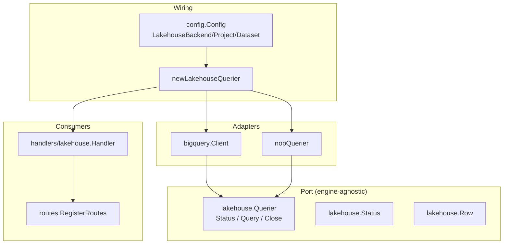
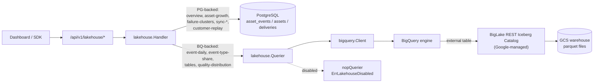
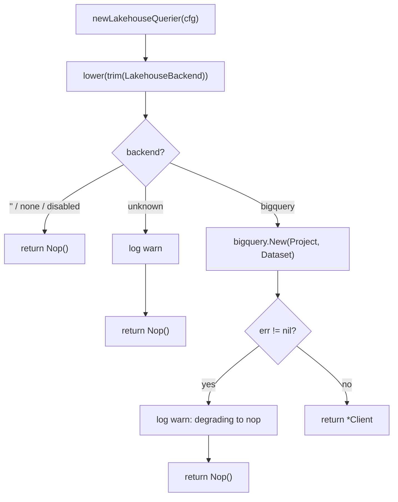
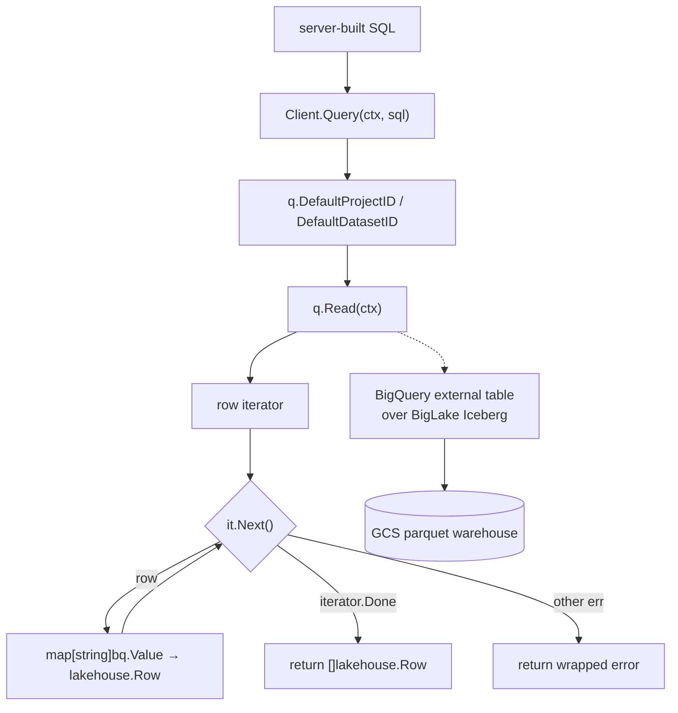
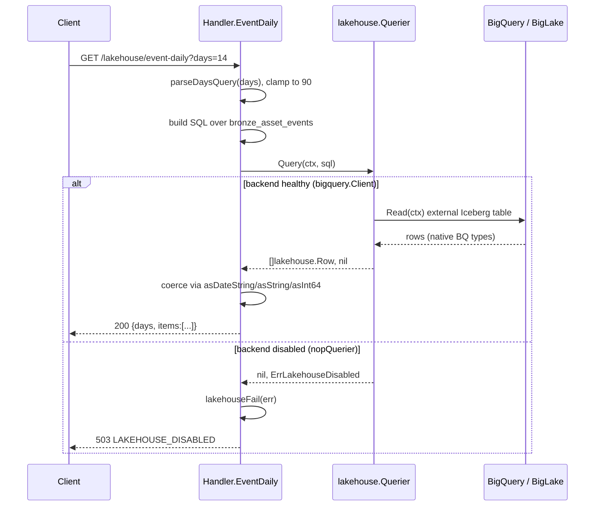
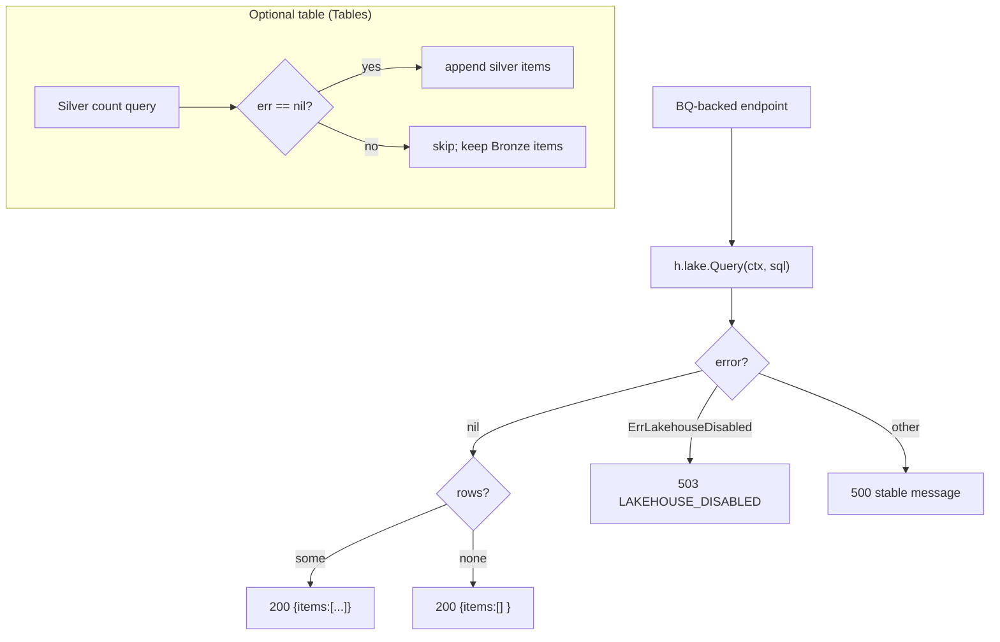
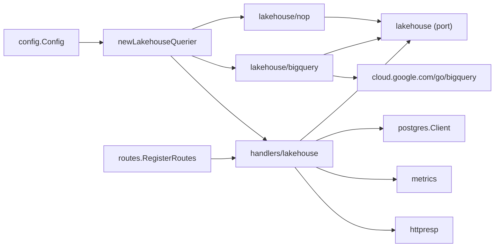

# Lakehouse Architecture

<cite>
**Referenced Files in This Document**

- [backend/internal/lakehouse/lakehouse.go](file://backend/internal/lakehouse/lakehouse.go)
- [backend/internal/lakehouse/nop.go](file://backend/internal/lakehouse/nop.go)
- [backend/internal/lakehouse/bigquery/client.go](file://backend/internal/lakehouse/bigquery/client.go)
- [backend/internal/handlers/lakehouse/handler.go](file://backend/internal/handlers/lakehouse/handler.go)
- [backend/cmd/server/helpers.go](file://backend/cmd/server/helpers.go)
- [backend/cmd/server/infra.go](file://backend/cmd/server/infra.go)
- [backend/internal/config/config.go](file://backend/internal/config/config.go)
- [backend/routes/routes.go](file://backend/routes/routes.go)
- [docs/review/lakehouse-incremental-ingestion.md](file://docs/review/lakehouse-incremental-ingestion.md)
</cite>

## Table of Contents
1. [Introduction](#introduction)
2. [Project Structure](#project-structure)
3. [Core Components](#core-components)
4. [Architecture Overview](#architecture-overview)
5. [Detailed Component Analysis](#detailed-component-analysis)
6. [Dependency Analysis](#dependency-analysis)
7. [Performance Considerations](#performance-considerations)
8. [Troubleshooting Guide](#troubleshooting-guide)
9. [Conclusion](#conclusion)
10. [Appendices](#appendices)

## Introduction

The lakehouse read layer is the analytical query port of cyber-databrew. It
gives the backend a single, engine-agnostic way to run read-only SQL against
the project's Medallion-style data lake — today a BigLake-managed Apache
Iceberg lake whose tables are exposed to BigQuery as external tables — without
coupling the HTTP handler or usecase layers to any particular query engine.

The layer exists for three reasons. First, the analytical store is an
*optional* dependency: the system must boot and serve its OLTP-backed
endpoints even when BigQuery is unconfigured, unreachable, or deliberately
turned off. Second, the engine choice has changed over the project's life
(Trino historically, BigQuery + BigLake-managed Iceberg today), so the calling
code is written against a stable `Querier` interface rather than a concrete
client. Third, several dashboard surfaces need event-stream aggregations that
are far cheaper to compute over columnar Iceberg files than over the
transactional PostgreSQL source of truth.

The package header records the design intent: implementations "adapt different
query engines (BigQuery today, historically Trino) behind a stable interface so
the handler / usecase layers do not depend on the engine choice," with the
rationale for the current BigQuery + BigLake pairing captured in
`docs/adr/001-iceberg-catalog-selection.md`.

The primary consumers are the lakehouse HTTP handlers under
`/api/v1/lakehouse/*`, which power the Dashboard's analytical tiles (event
daily curve, event-type share, Iceberg table row counts, quality
distribution) and the PG→Bronze sync watermark views.

**Section sources**
- [backend/internal/lakehouse/lakehouse.go](file://backend/internal/lakehouse/lakehouse.go#L1-L37)
- [backend/internal/handlers/lakehouse/handler.go](file://backend/internal/handlers/lakehouse/handler.go#L1-L17)

## Project Structure

The lakehouse read layer is split into a small interface package, a concrete
BigQuery adapter, a no-op fallback adapter, and the HTTP handler that consumes
them. Wiring lives in the server bootstrap.

- `backend/internal/lakehouse/lakehouse.go` — the port. Declares the `Querier`
  interface, the `Status` health snapshot, and the `Row` result type. No
  engine code lives here.
- `backend/internal/lakehouse/nop.go` — the `nopQuerier` fallback returned when
  the analytical layer is disabled or fails to initialize. Reports
  `Enabled=false` and fails `Query` with `ErrLakehouseDisabled`.
- `backend/internal/lakehouse/bigquery/client.go` — the BigQuery-backed
  `Querier`. Wraps `cloud.google.com/go/bigquery`, queries BigLake-managed
  Iceberg external tables, and preserves native BQ Go types in each `Row`.
- `backend/internal/handlers/lakehouse/handler.go` — the HTTP layer. Holds a
  `lakehouse.Querier` (always non-nil), a `*postgres.Client`, and a Bronze
  checkpoint reader, and routes each endpoint to either PostgreSQL or the
  lakehouse engine.
- `backend/cmd/server/helpers.go` — `newLakehouseQuerier`, the factory that
  selects the engine from config and degrades to `Nop()` on any error.
- `backend/cmd/server/infra.go` — boot-time construction and health logging.
- `backend/internal/config/config.go` — the `LAKEHOUSE_*` environment keys.
- `backend/routes/routes.go` — registration of the `/api/v1/lakehouse/*`
  routes.

**Diagram sources**
- [backend/internal/lakehouse/lakehouse.go](file://backend/internal/lakehouse/lakehouse.go#L12-L37)
- [backend/internal/lakehouse/nop.go](file://backend/internal/lakehouse/nop.go#L15-L28)
- [backend/internal/lakehouse/bigquery/client.go](file://backend/internal/lakehouse/bigquery/client.go#L19-L24)
- [backend/cmd/server/helpers.go](file://backend/cmd/server/helpers.go#L269-L291)

**Section sources**
- [backend/internal/lakehouse/lakehouse.go](file://backend/internal/lakehouse/lakehouse.go#L1-L37)
- [backend/internal/lakehouse/nop.go](file://backend/internal/lakehouse/nop.go#L1-L28)
- [backend/internal/lakehouse/bigquery/client.go](file://backend/internal/lakehouse/bigquery/client.go#L1-L24)

## Core Components

### The `Querier` port

`Querier` is the minimum surface every lakehouse adapter must implement. It has
three methods: `Status(ctx)` returns an engine-level health snapshot,
`Query(ctx, sql)` runs an arbitrary read-only SQL statement and returns rows,
and `Close()` releases the underlying client.

`Query` carries an explicit security contract documented on the interface: it
is "intended for server-built SQL only — handlers must NOT interpolate
untrusted user input. Parameterized inputs should be validated on the handler
side and embedded as typed literals (e.g. `DATE '2026-05-15'`)." The interface
deliberately exposes raw SQL rather than a query builder because the set of
analytical queries is small, server-authored, and engine-dialect specific.

### `Status` and `Row`

`Status` is the snapshot surfaced by `GET /lakehouse/status`. Its fields —
`Enabled`, `Healthy`, `Backend`, `Project`, `Dataset`, `Error` — let the
frontend and health checks distinguish "intentionally off" (`Enabled=false`)
from "configured but unhealthy" (`Enabled=true, Healthy=false`).

`Row` is `map[string]any` keyed by column name. Values keep the engine's native
Go types — for BigQuery that means `int64`, `float64`, `string`, `time.Time`,
and `civil.Date`. The handler is responsible for any JSON-safe coercion, which
it does through the `asString` / `asInt64` / `asFloat64` / `asDateString`
helpers.

### The BigQuery adapter

`bigquery.Client` wraps a `*bq.Client` plus the target `project` and `dataset`.
It is constructed by `New`, which requires both `Project` and `Dataset`, builds
the underlying client, and runs a lightweight `SELECT 1` health probe so a
broken configuration fails fast at boot instead of producing a
silently-broken client.

### The no-op adapter

`nopQuerier` is the disabled-state implementation. `Nop()` returns it; its
`Status` reports `Enabled=false, Healthy=false, Backend:"none"`, and its
`Query` always returns `ErrLakehouseDisabled`, which handlers map to HTTP 503.

**Section sources**
- [backend/internal/lakehouse/lakehouse.go](file://backend/internal/lakehouse/lakehouse.go#L12-L37)
- [backend/internal/lakehouse/nop.go](file://backend/internal/lakehouse/nop.go#L8-L28)
- [backend/internal/lakehouse/bigquery/client.go](file://backend/internal/lakehouse/bigquery/client.go#L19-L51)
- [backend/internal/handlers/lakehouse/handler.go](file://backend/internal/handlers/lakehouse/handler.go#L768-L821)

## Architecture Overview

The read layer is a port-and-adapter. At boot, `newLakehouseQuerier` inspects
`LakehouseBackend` and returns one of two implementations behind the same
`Querier` interface. The handler holds whichever it gets and never branches on
the concrete type — it only reacts to the *error* a `Query` returns
(`ErrLakehouseDisabled` → 503) and to the `Status` it reports.

Two distinct data paths reach the handler. PostgreSQL-backed endpoints
(`/overview`, `/asset-growth`, `/failure-clusters`, `/sync-status`,
`/sync-progress`, `/customer-replay`) read the OLTP source of truth directly
and have no lakehouse dependency, so they stay alive even when BigQuery is
down. BigQuery-backed endpoints (`/event-daily`, `/event-type-share`,
`/tables`, `/quality-distribution`) run server-built SQL against the
BigLake-managed Iceberg external tables. The package header for the handler
enumerates exactly this split.

The read path on the right mirrors the write path described in
`docs/review/lakehouse-incremental-ingestion.md`: a Cloud Run Job appends
Bronze parquet files to GCS through the BigLake REST catalog, and the backend
reads the same tables back through BigQuery.

**Diagram sources**
- [backend/internal/handlers/lakehouse/handler.go](file://backend/internal/handlers/lakehouse/handler.go#L1-L17)
- [backend/routes/routes.go](file://backend/routes/routes.go#L252-L265)
- [backend/internal/lakehouse/bigquery/client.go](file://backend/internal/lakehouse/bigquery/client.go#L1-L17)
- [docs/review/lakehouse-incremental-ingestion.md](file://docs/review/lakehouse-incremental-ingestion.md#L40-L78)

**Section sources**
- [backend/internal/handlers/lakehouse/handler.go](file://backend/internal/handlers/lakehouse/handler.go#L1-L62)
- [backend/cmd/server/helpers.go](file://backend/cmd/server/helpers.go#L269-L291)

## Detailed Component Analysis

### Engine selection and graceful boot

`newLakehouseQuerier` is the single point where the engine is chosen. It
lower-cases and trims `cfg.LakehouseBackend` and switches:

- `""`, `"none"`, `"disabled"` → `lakehouse.Nop()`.
- `"bigquery"` → `lakehousebq.New(...)`; on error it logs a warning and
  returns `Nop()` instead of propagating the failure.
- any other value → logs an "unknown lakehouse backend" warning and returns
  `Nop()`.

The crucial property is that this function *never returns an error and never
returns nil*. A misconfigured project, an unreachable BigQuery, or a typo'd
backend name all collapse to the no-op adapter, so the server always boots.

`infra.go` then calls `Status` once and records dependency health: when
`Enabled && Healthy` it sets the `lakehouse` dependency gauge to 1 and logs the
backend/project/dataset; otherwise it logs "lakehouse query layer disabled or
unhealthy" with the status error. This is observational only — an unhealthy
lakehouse does not block startup.

**Diagram sources**
- [backend/cmd/server/helpers.go](file://backend/cmd/server/helpers.go#L269-L291)

**Section sources**
- [backend/cmd/server/helpers.go](file://backend/cmd/server/helpers.go#L269-L291)
- [backend/cmd/server/infra.go](file://backend/cmd/server/infra.go#L117-L126)
- [backend/internal/config/config.go](file://backend/internal/config/config.go#L57-L65)

### The BigQuery / BigLake read path

`bigquery.Client.Query` builds a query from the server-authored SQL, sets
`DefaultProjectID` and `DefaultDatasetID` so unqualified table names resolve
against the configured dataset, runs `Read`, and iterates the result. Each
BigQuery row arrives as `map[string]bq.Value`; the client copies it into a
`lakehouse.Row` (`map[string]any`) without coercion, preserving native types.
Iteration ends on `iterator.Done`; any other error is wrapped and returned.

`Status` runs the same `ping` (`SELECT 1 AS one`) under a 5-second timeout and
fills `Healthy`/`Error` from the result, always reporting
`Enabled=true, Backend:"bigquery"` plus the project and dataset. `ping` itself
tolerates an immediate `iterator.Done` (an empty result is still healthy).

The package comment ties this to the lake topology: the client "queries
BigLake-managed Iceberg tables registered as BigQuery external tables," and the
external-table pointer is refreshed at the end of every ingest run by
`deploy/cloudrun/bronze-incremental/`.

**Diagram sources**
- [backend/internal/lakehouse/bigquery/client.go](file://backend/internal/lakehouse/bigquery/client.go#L84-L112)
- [backend/internal/lakehouse/bigquery/client.go](file://backend/internal/lakehouse/bigquery/client.go#L53-L82)

**Section sources**
- [backend/internal/lakehouse/bigquery/client.go](file://backend/internal/lakehouse/bigquery/client.go#L1-L119)

### A lakehouse query, end to end

The following sequence traces `GET /lakehouse/event-daily`, a representative
BigQuery-backed endpoint, from request to JSON response — including the
disabled-backend branch.

`EventDaily` clamps `days` to a maximum of 90, formats the day×event_type
aggregation SQL over `bronze_asset_events` (driven by `occurred_at` so
re-ingested rows do not skew the curve), calls `h.lake.Query`, and on success
maps each row to `{event_date, event_type, count, asset_count}` — `asset_count`
is a legacy alias older SDKs and the DashboardPage still read.

**Diagram sources**
- [backend/internal/handlers/lakehouse/handler.go](file://backend/internal/handlers/lakehouse/handler.go#L490-L524)
- [backend/internal/lakehouse/nop.go](file://backend/internal/lakehouse/nop.go#L24-L26)

**Section sources**
- [backend/internal/handlers/lakehouse/handler.go](file://backend/internal/handlers/lakehouse/handler.go#L490-L524)
- [backend/internal/handlers/lakehouse/handler.go](file://backend/internal/handlers/lakehouse/handler.go#L756-L766)

### Graceful degradation strategy

The handler degrades along two independent axes — engine availability and data
presence — and the response shape depends on which axis is involved.

**Disabled / unhealthy engine.** Every BigQuery-backed endpoint routes its
`Query` error through `lakehouseFail`. When the error is
`lakehouse.ErrLakehouseDisabled` (the no-op adapter's sentinel) it returns HTTP
503 with code `LAKEHOUSE_DISABLED` and message "lakehouse backend not
configured"; any other error is logged for diagnostics and returned as a stable
HTTP 500 "lakehouse query service temporarily unavailable" so internal SQL
detail never leaks to the client. `GET /lakehouse/status` itself never fails:
it always returns 200 with the `Status` snapshot, letting the frontend decide
how to render a disabled or unhealthy lakehouse.

**Optional tables absent — partial 200.** `Tables` shows the most explicit
graceful-degradation pattern. Bronze (`bronze_asset_events`) is required for
the endpoint, but the Silver table (`silver_asset_events_current`) is optional:
its count query is attempted and *appended only when it succeeds* (`if
silverItems, err := ...; err == nil`). If Silver has not been materialized, the
endpoint still returns 200 with just the Bronze item rather than failing — the
absence of an optional table degrades to fewer items, not an error.

**No data — 200 with empty `items`.** Where the engine is up but a query
returns no rows, endpoints return 200 with an explicitly empty, non-nil slice
(`items := make([]..., 0)`), so the JSON is always `"items": []` rather than
`null`. PG-backed endpoints follow the same convention; `CustomerReplay` goes
further and returns `200 {customer_id:"", items:[]}` when no customer has any
deliveries.

**PG-backed `/sync-status` notes.** `SyncStatus` returns 200 even when its
dependencies are missing, carrying a human-readable note in the response: when
`h.pg == nil` it returns `{available:false, source:"realtime",
message:"postgres not available"}`, and when the Bronze checkpoint is absent
`buildRealtimeSyncStatus` returns `{available:false, source:"realtime",
message:"bronze checkpoint not available"}`. This is the "200 with empty/absent
data plus an explanatory note" form of degradation for the sync surface, as
opposed to the hard 503 used by the BQ-backed analytics endpoints.

The retired Silver/Gold surfaces (training-assets, recompute-candidates,
tag-timeline) are simply not registered as routes until their materializations
exist, per the handler package header.

**Diagram sources**
- [backend/internal/handlers/lakehouse/handler.go](file://backend/internal/handlers/lakehouse/handler.go#L459-L486)
- [backend/internal/handlers/lakehouse/handler.go](file://backend/internal/handlers/lakehouse/handler.go#L756-L766)

**Section sources**
- [backend/internal/handlers/lakehouse/handler.go](file://backend/internal/handlers/lakehouse/handler.go#L96-L99)
- [backend/internal/handlers/lakehouse/handler.go](file://backend/internal/handlers/lakehouse/handler.go#L225-L243)
- [backend/internal/handlers/lakehouse/handler.go](file://backend/internal/handlers/lakehouse/handler.go#L295-L327)
- [backend/internal/handlers/lakehouse/handler.go](file://backend/internal/handlers/lakehouse/handler.go#L459-L486)
- [backend/internal/handlers/lakehouse/handler.go](file://backend/internal/handlers/lakehouse/handler.go#L668-L754)

### Type coercion at the JSON boundary

Because `Row` carries native BigQuery Go types, the handler converts them
before JSON encoding. `asString` returns `""` for nil and falls back to
`fmt.Sprintf("%v", v)`; `asInt64` and `asFloat64` accept `int64`/`int`/`float64`
inputs and return 0 otherwise; `asDateString` handles a plain string, a
`time.Time` (formatted `2006-01-02`), or anything implementing `fmt.Stringer`
— this is how BigQuery's `civil.Date` is rendered without importing the civil
package. `QualityDistribution` and `EventTypeShare` apply these helpers per
row, and `EventTypeShare` additionally uses BigQuery `SAFE_DIVIDE` and a
COALESCE-based fallback to the most recent populated date so a pie chart stays
populated even before today's ingest lands.

**Section sources**
- [backend/internal/handlers/lakehouse/handler.go](file://backend/internal/handlers/lakehouse/handler.go#L768-L821)
- [backend/internal/handlers/lakehouse/handler.go](file://backend/internal/handlers/lakehouse/handler.go#L529-L592)
- [backend/internal/handlers/lakehouse/handler.go](file://backend/internal/handlers/lakehouse/handler.go#L600-L647)

## Dependency Analysis

The interface package (`lakehouse.go`) depends only on the standard library
`context`. The BigQuery adapter depends on `cloud.google.com/go/bigquery`,
`google.golang.org/api/iterator`, and the interface package. The no-op adapter
depends only on `context` and `errors`. The handler depends on the interface
package, `postgres.Client`, `metrics`, `httpresp`, and gin — but never on the
BigQuery adapter directly; the concrete engine is injected.

The direction of dependency is the key design outcome: the handler and the
factory depend on the *port*, and only the factory (in `helpers.go`) imports
the concrete BigQuery package. Swapping engines means adding a new adapter and
one `case` in `newLakehouseQuerier` — no handler change.

**Diagram sources**
- [backend/internal/lakehouse/bigquery/client.go](file://backend/internal/lakehouse/bigquery/client.go#L7-L17)
- [backend/internal/handlers/lakehouse/handler.go](file://backend/internal/handlers/lakehouse/handler.go#L19-L36)
- [backend/cmd/server/helpers.go](file://backend/cmd/server/helpers.go#L269-L291)

**Section sources**
- [backend/internal/lakehouse/lakehouse.go](file://backend/internal/lakehouse/lakehouse.go#L8-L10)
- [backend/internal/lakehouse/nop.go](file://backend/internal/lakehouse/nop.go#L1-L6)
- [backend/internal/lakehouse/bigquery/client.go](file://backend/internal/lakehouse/bigquery/client.go#L1-L17)
- [backend/routes/routes.go](file://backend/routes/routes.go#L252-L265)

## Performance Considerations

- **PG-first for hot tiles.** The most frequently hit Dashboard surfaces
  (`/overview`, `/asset-growth`, `/failure-clusters`) deliberately read
  PostgreSQL, not the lakehouse, so they are fast and indexed and survive a
  BigQuery outage. `Overview` even substitutes `MAX(event_seq)` for a Bronze
  `COUNT(*)` because the event stream is append-only, making the two
  equivalent while avoiding a full scan.
- **Bounded query windows.** BQ-backed endpoints clamp their `days` window —
  `EventDaily` to 90, `AssetGrowth` to 365, `FailureClusters` to 90 — capping
  the columnar scan footprint per request.
- **Cheap health probes.** Both `New` and `Status` run `SELECT 1` under a
  5-second timeout, so health checks never trigger a heavy scan.
- **Row-count over Iceberg.** `Tables` issues `COUNT(*)` per table, which is
  cheap on a partitioned Iceberg scan; the ingestion review notes such
  watermark/count queries run in roughly ≤ 100 ms.
- **Duplicate-aware consumption.** Bronze can contain duplicate `event_seq`
  rows from ingest 429-retries; consumers must count `DISTINCT event_id` or
  read a deduped Silver view, per the consumer contract. `quality-distribution`
  follows this by reading the deduped `silver_asset_quality_current` current-
  state table.
- **No N+1.** Each endpoint issues at most a small fixed number of queries
  (`Tables` issues two: Bronze required, Silver best-effort).

**Section sources**
- [backend/internal/handlers/lakehouse/handler.go](file://backend/internal/handlers/lakehouse/handler.go#L329-L384)
- [backend/internal/handlers/lakehouse/handler.go](file://backend/internal/handlers/lakehouse/handler.go#L459-L524)
- [backend/internal/lakehouse/bigquery/client.go](file://backend/internal/lakehouse/bigquery/client.go#L44-L82)
- [docs/review/lakehouse-incremental-ingestion.md](file://docs/review/lakehouse-incremental-ingestion.md#L102-L139)

## Troubleshooting Guide

- **`/lakehouse/event-daily` (and other BQ endpoints) return 503
  `LAKEHOUSE_DISABLED`.** The active adapter is `nopQuerier`. Check
  `LAKEHOUSE_BACKEND` (must be `bigquery`) and that `LAKEHOUSE_BQ_PROJECT` /
  `LAKEHOUSE_BQ_DATASET` are set; then check the boot log for "lakehouse
  bigquery init failed; degrading to nop" — `New` returns an error when
  project or dataset is empty or when the `SELECT 1` ping fails.
- **`/lakehouse/status` shows `enabled:true, healthy:false` with an error.**
  The client built but the live `ping` failed — typically auth or network to
  BigQuery. The `Error` field carries the wrapped cause (`bigquery: ping
  read/next: ...`).
- **`/lakehouse/tables` returns only Bronze.** Expected when
  `silver_asset_events_current` is not materialized; the Silver count is
  best-effort and silently skipped on error.
- **`/lakehouse/sync-status` returns `available:false`.** Either PostgreSQL is
  unavailable (`message:"postgres not available"`) or the Bronze checkpoint row
  is missing (`message:"bronze checkpoint not available"`); both are 200, not
  errors. Verify the `bronze-incremental` Cloud Run Job has run and written the
  checkpoint.
- **Counts look inflated.** Bronze allows duplicate rows by design; never
  `COUNT(*) FROM bronze_asset_events` to count business events — use
  `COUNT(DISTINCT event_id)` or a Silver view.
- **500 "lakehouse query service temporarily unavailable".** A non-disabled
  `Query` error (malformed SQL, BQ quota, transient 5xx). The real error is
  written to the gin error log via `c.Error(err)`; inspect server logs.

**Section sources**
- [backend/internal/handlers/lakehouse/handler.go](file://backend/internal/handlers/lakehouse/handler.go#L756-L766)
- [backend/internal/handlers/lakehouse/handler.go](file://backend/internal/handlers/lakehouse/handler.go#L225-L243)
- [backend/internal/lakehouse/bigquery/client.go](file://backend/internal/lakehouse/bigquery/client.go#L35-L82)
- [docs/review/lakehouse-incremental-ingestion.md](file://docs/review/lakehouse-incremental-ingestion.md#L87-L112)

## Conclusion

The lakehouse read layer is a deliberately thin port-and-adapter over an
optional analytical engine. A three-method `Querier` interface isolates the
backend from the engine; the BigQuery adapter reads BigLake-managed Iceberg
external tables and preserves native types; the no-op adapter guarantees the
server boots and that disabled-state failures are a clean 503. The handler
layers graceful degradation on top: PG-backed tiles survive a lakehouse outage,
optional Silver tables degrade to fewer items, empty results return `items:[]`,
and the sync surface returns 200 with an explanatory note rather than an error.
The net effect is an analytical capability that is powerful when present and
invisible when absent.

## Appendices

### A. `Querier` interface

| Method | Signature | Purpose |
|---|---|---|
| `Status` | `Status(ctx) Status` | Engine health snapshot for `GET /lakehouse/status` |
| `Query` | `Query(ctx, sql) ([]Row, error)` | Run server-built read-only SQL |
| `Close` | `Close()` | Release the underlying client |

### B. `Status` fields

| Field | JSON | Meaning |
|---|---|---|
| `Enabled` | `enabled` | Backend is configured (not the no-op) |
| `Healthy` | `healthy` | Live `SELECT 1` ping succeeded |
| `Backend` | `backend` | `"bigquery"` or `"none"` |
| `Project` | `project` | GCP project (BigQuery) |
| `Dataset` | `dataset` | Dataset of Iceberg external tables |
| `Error` | `error` | Wrapped probe error when unhealthy |

### C. Configuration keys

| Env var | Config field | Default |
|---|---|---|
| `LAKEHOUSE_BACKEND` | `LakehouseBackend` | `bigquery` |
| `LAKEHOUSE_BQ_PROJECT` | `LakehouseBQProject` | `GCS_PROJECT` or `""` |
| `LAKEHOUSE_BQ_DATASET` | `LakehouseBQDataset` | `lakehouse_bronze` |
| `LAKEHOUSE_REPORT_PATH` | `LakehouseReportPath` | local notebook report path |

### D. `/api/v1/lakehouse/*` routes and backend

| Route | Handler | Backend |
|---|---|---|
| `GET /lakehouse/report` | `Report` | static file |
| `GET /lakehouse/status` | `Status` | engine (always 200) |
| `GET /lakehouse/sync-status` | `SyncStatus` | PG + checkpoint |
| `GET /lakehouse/sync-progress` | `BronzeSyncProgress` | PG + checkpoint |
| `GET /lakehouse/failure-clusters` | `FailureClusters` | PG |
| `GET /lakehouse/overview` | `Overview` | PG |
| `GET /lakehouse/asset-growth` | `AssetGrowth` | PG |
| `GET /lakehouse/tables` | `Tables` | BigQuery |
| `GET /lakehouse/event-daily` | `EventDaily` | BigQuery |
| `GET /lakehouse/event-type-share` | `EventTypeShare` | BigQuery |
| `GET /lakehouse/quality-distribution` | `QualityDistribution` | BigQuery (Silver) |
| `GET /lakehouse/customer-replay` | `CustomerReplay` | PG |

**Section sources**
- [backend/internal/lakehouse/lakehouse.go](file://backend/internal/lakehouse/lakehouse.go#L12-L37)
- [backend/internal/config/config.go](file://backend/internal/config/config.go#L57-L65)
- [backend/internal/config/config.go](file://backend/internal/config/config.go#L181-L185)
- [backend/routes/routes.go](file://backend/routes/routes.go#L252-L265)
