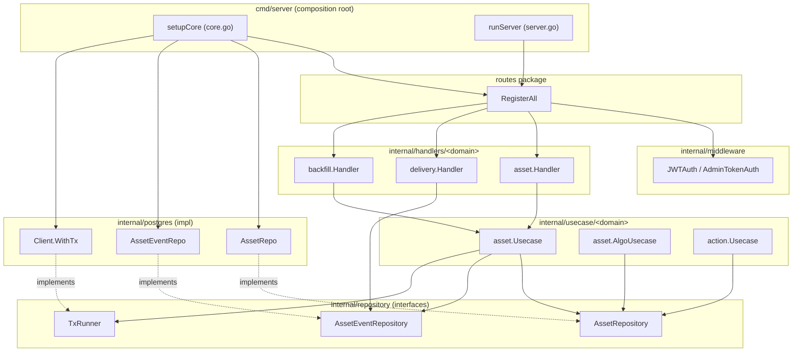
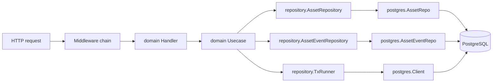
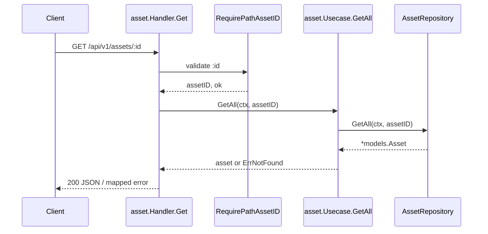
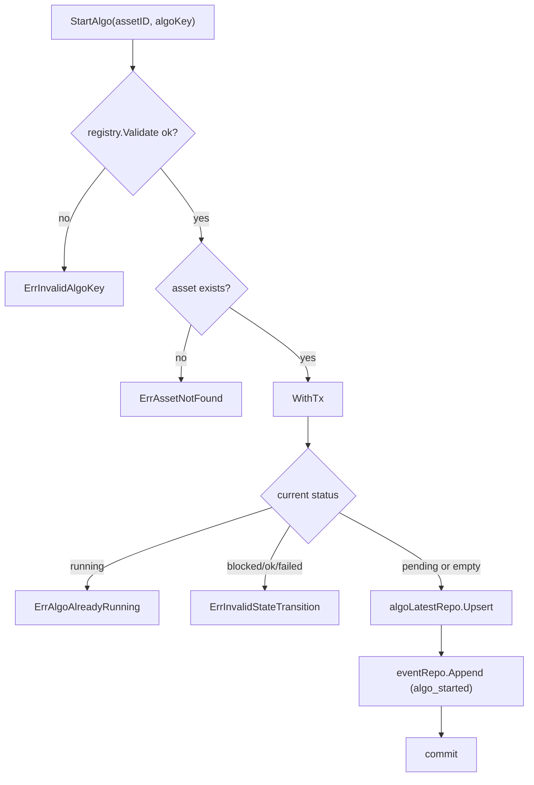
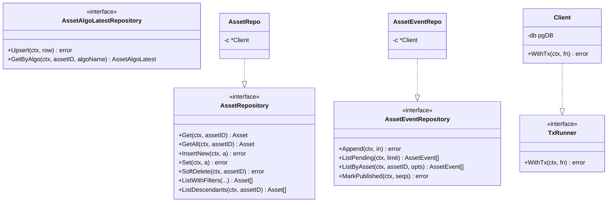
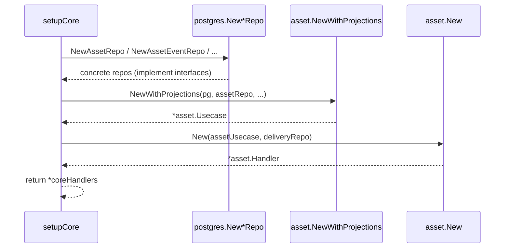
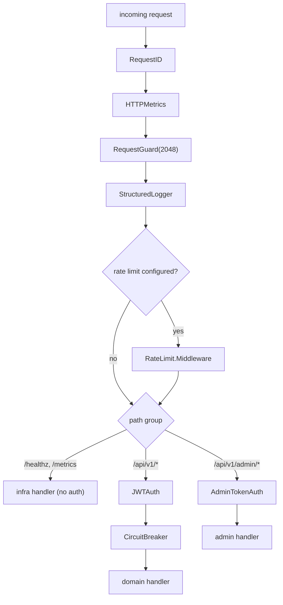
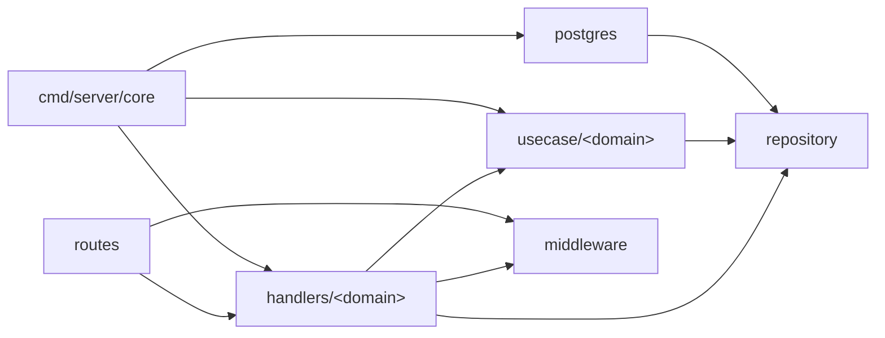

# Modular Design

<cite>
**Referenced Files in This Document**

- [backend/routes/routes.go](file://backend/routes/routes.go)
- [backend/cmd/server/server.go](file://backend/cmd/server/server.go)
- [backend/cmd/server/core.go](file://backend/cmd/server/core.go)
- [backend/internal/handlers/asset/handler.go](file://backend/internal/handlers/asset/handler.go)
- [backend/internal/handlers/asset/errors.go](file://backend/internal/handlers/asset/errors.go)
- [backend/internal/handlers/asset_id.go](file://backend/internal/handlers/asset_id.go)
- [backend/internal/handlers/pagination.go](file://backend/internal/handlers/pagination.go)
- [backend/internal/handlers/delivery/handler.go](file://backend/internal/handlers/delivery/handler.go)
- [backend/internal/handlers/backfill/handler.go](file://backend/internal/handlers/backfill/handler.go)
- [backend/internal/usecase/asset/usecase.go](file://backend/internal/usecase/asset/usecase.go)
- [backend/internal/usecase/asset/algo_usecase.go](file://backend/internal/usecase/asset/algo_usecase.go)
- [backend/internal/usecase/action/usecase.go](file://backend/internal/usecase/action/usecase.go)
- [backend/internal/repository/asset_repository.go](file://backend/internal/repository/asset_repository.go)
- [backend/internal/repository/common.go](file://backend/internal/repository/common.go)
- [backend/internal/postgres/repos.go](file://backend/internal/postgres/repos.go)
- [backend/internal/postgres/client.go](file://backend/internal/postgres/client.go)
- [backend/internal/middleware/auth.go](file://backend/internal/middleware/auth.go)
</cite>

## Table of Contents
1. [Introduction](#introduction)
2. [Project Structure](#project-structure)
3. [Core Components](#core-components)
4. [Architecture Overview](#architecture-overview)
5. [Detailed Component Analysis](#detailed-component-analysis)
6. [Dependency Analysis](#dependency-analysis)
7. [Performance Considerations](#performance-considerations)
8. [Troubleshooting Guide](#troubleshooting-guide)
9. [Conclusion](#conclusion)
10. [Appendices](#appendices)

## Introduction

The cyber-databrew backend is a single Go process that exposes a REST API over Gin
and persists state in PostgreSQL. Internally it is decomposed into four layers and a
set of per-domain modules. The layering follows a strict dependency direction:

```
HTTP request → middleware → handler → usecase → repository (interface) → postgres (impl)
```

Each layer has one responsibility. **Handlers** translate HTTP to/from Go: they bind
and validate request bodies, parse path and query parameters, call exactly one usecase
method, and map domain errors to HTTP status codes. **Usecases** hold the business
rules — invariant checks, state-machine transitions, and the rule that every business
state mutation appends its corresponding `asset_events` row in the *same* transaction
(the transactional outbox). **Repositories** are Go interfaces declared in the
`repository` package; they describe persistence operations in storage-agnostic terms.
**Postgres** implements those interfaces with concrete SQL.

The key architectural property is **dependency inversion**: usecases depend on
repository *interfaces*, never on the `postgres` package. The concrete `postgres`
types implement those interfaces and are injected at process startup in
`cmd/server/core.go`. This keeps business logic testable with fakes and keeps the SQL
confined to one package. Middleware wraps the whole chain at the router level so that
cross-cutting concerns (request IDs, metrics, auth, rate limiting, circuit breaking)
apply uniformly without leaking into handler code.

**Section sources**
- [backend/cmd/server/core.go](file://backend/cmd/server/core.go#L30-L135)
- [backend/routes/routes.go](file://backend/routes/routes.go#L44-L101)
- [backend/internal/repository/asset_repository.go](file://backend/internal/repository/asset_repository.go#L14-L52)

## Project Structure

The backend uses parallel package trees, one per layer, with the same per-domain
subdivision repeated in each. A domain such as `asset`, `delivery`, or `backfill`
appears as a directory under `handlers/`, again under `usecase/`, with its persistence
contract declared in `repository/` and implemented in `postgres/`.

- `cmd/server/` — composition root. `core.go` constructs every repo, usecase, and
  handler and wires them together; `server.go` builds the Gin engine and calls
  `routes.RegisterAll`.
- `routes/routes.go` — the single place that mounts route groups and applies
  middleware. It receives already-constructed handlers as parameters.
- `internal/handlers/<domain>/handler.go` — per-domain HTTP handlers. Shared helpers
  (`RequirePathAssetID`, `ParsePageParams`) live directly in the `handlers` package.
  Current domains (25 packages): `action`, `admin`, `algorun`, `apikey`, `asset`,
  `audit`, `backfill`, `customer`, `dashboard`, `delivery`, `deliveryrule`, `eval`,
  `lakehouse`, `mcap`, `pipeline`, `pipeline_component`, `pipeline_config`, `query`,
  `registry`, `runs`, `search`, `storage`, `subtask`, `workflow` (plus shared
  `asset_id.go` / `pagination.go`).
- `internal/usecase/<domain>/usecase.go` — per-domain business logic.
- `internal/repository/*.go` — interface declarations (`AssetRepository`, `TxRunner`,
  `AssetEventRepository`, `APIKeyRepository`, `ClusterRepository`,
  `TagRegistryRepository`, `AssetRelationWriter`, …). No SQL.
- `internal/postgres/*.go` — concrete implementations (`AssetRepo`, `DeliveryRepo`,
  `APIKeyRepo`, `ClusterRepo`, `BackfillSubmitQueue`, `DispatcherConfigRepo`, …)
  plus the `Client` that owns the connection pool and `WithTx`.
- `internal/middleware/` — Gin middleware: `auth.go` (identity resolution),
  `authz.go` (principal/scopes context, `CtxKeyPrincipal`), `request_id.go`,
  `metrics.go`, `ratelimit.go`, `circuitbreaker.go`, `request_guard.go`, `logger.go`.



**Diagram sources**
- [backend/cmd/server/core.go](file://backend/cmd/server/core.go#L32-L135)
- [backend/routes/routes.go](file://backend/routes/routes.go#L44-L101)
- [backend/internal/repository/asset_repository.go](file://backend/internal/repository/asset_repository.go#L26-L52)
- [backend/internal/postgres/repos.go](file://backend/internal/postgres/repos.go#L19-L25)

**Section sources**
- [backend/cmd/server/core.go](file://backend/cmd/server/core.go#L1-L135)
- [backend/routes/routes.go](file://backend/routes/routes.go#L1-L101)

## Core Components

### The four layers per domain

Take the `asset` domain as the canonical example. The same shape recurs for every
domain.

**Handler** — `asset.Handler` holds a usecase plus a few optional collaborator repos.
It does no SQL. Its struct fields are the usecase and the repositories it needs only
for read joins:

```go
type Handler struct {
    uc           *assetUC.Usecase
    deliveryRepo repository.DeliveryRepository
    mcapRepo     repository.McapFileRepository
    pg           *postgres.Client
    pgq          assetSQLQuerier
}
```

`New(uc, deliveryRepo)` constructs the base handler; optional dependencies are wired
through setters (`SetMcapRepo`, `SetPG`) so the handler can be built incrementally and
degrade gracefully when a dependency is absent.

**Usecase** — `asset.Usecase` depends only on repository interfaces and config
registries, never on `postgres`. Its constructor `NewWithProjections` takes a
`TxRunner` plus the `AssetRepository`, `AssetTagRepository`, `AssetAlgoLatestRepository`
and `AssetEventRepository` interfaces.

**Repository interface** — `repository.AssetRepository` describes the persistence
surface in storage-agnostic terms (`Get`, `GetAll`, `InsertNew`, `Set`, `SoftDelete`,
`ListWithFilters`, `ListDescendants`, …). The doc comment explicitly states that
concrete implementations live in `internal/postgres`.

**Postgres impl** — `postgres.AssetRepo` implements that interface. The compile-time
assertion `var _ repository.AssetRepository = (*AssetRepo)(nil)` guarantees the
implementation stays in sync with the interface.

**Section sources**
- [backend/internal/handlers/asset/handler.go](file://backend/internal/handlers/asset/handler.go#L30-L80)
- [backend/internal/usecase/asset/usecase.go](file://backend/internal/usecase/asset/usecase.go#L62-L114)
- [backend/internal/repository/asset_repository.go](file://backend/internal/repository/asset_repository.go#L26-L52)
- [backend/internal/postgres/repos.go](file://backend/internal/postgres/repos.go#L19-L25)

### Shared handler helpers

Cross-domain HTTP concerns live in the top-level `handlers` package, not duplicated per
domain. `RequirePathAssetID` validates the `:id` path parameter as an 8-character
alphanumeric asset id and writes a `BadRequest` response on failure, returning a
boolean the caller checks before proceeding. `ParsePageParams` normalises `page` and
`pageSize` query strings, defaulting to page 1 / size 20 and capping size at 200.

**Section sources**
- [backend/internal/handlers/asset_id.go](file://backend/internal/handlers/asset_id.go#L13-L24)
- [backend/internal/handlers/pagination.go](file://backend/internal/handlers/pagination.go#L7-L21)

### Transaction boundary

`TxRunner` is the abstraction that lets a usecase open a transaction without depending
on `postgres`. It has a single method `WithTx(ctx, fn)`. The postgres `Client`
implements it: `WithTx` begins a pgx transaction, stashes a tx-bound `pgDB` into the
context under `txKey{}`, runs `fn(txCtx)`, and commits or rolls back. Inside `fn`, every
repo method calls `dbFromCtx(ctx, c.db)` so it transparently runs on the transaction
rather than the pool — the same repo code path serves both pooled and transactional
execution.

**Section sources**
- [backend/internal/repository/common.go](file://backend/internal/repository/common.go#L22-L30)
- [backend/internal/postgres/client.go](file://backend/internal/postgres/client.go#L48-L62)
- [backend/internal/postgres/client.go](file://backend/internal/postgres/client.go#L220-L239)

## Architecture Overview

A request travels through the router middleware stack, lands on a handler method, which
delegates to exactly one usecase method, which orchestrates repository interfaces. Only
the postgres implementations touch SQL. The composition root in `core.go` is the only
place the layers are joined to concrete types.



The arrows above are *compile-time dependency* arrows from usecase to interface. The
runtime dependency from interface to implementation is inverted: it is supplied by the
composition root, so nothing in `usecase/` imports `postgres`.

**Diagram sources**
- [backend/internal/usecase/asset/usecase.go](file://backend/internal/usecase/asset/usecase.go#L62-L114)
- [backend/internal/repository/common.go](file://backend/internal/repository/common.go#L22-L30)
- [backend/internal/postgres/repos.go](file://backend/internal/postgres/repos.go#L19-L25)

## Detailed Component Analysis

#### Handler layer — HTTP adaptation only

A handler method is small and uniform. It (1) extracts and validates inputs, (2) calls
one usecase method, (3) maps errors, (4) writes the response. The `asset.Handler.Get`
method is representative: it validates the path id via the shared `RequirePathAssetID`
helper, calls `h.uc.GetAll`, and on error tries `mapAssetError` before falling back to
a 500.



Error mapping is itself a per-domain concern. `asset.errors.go` defines `mapAssetError`,
which translates the usecase sentinel errors (`assetUC.ErrNotFound`,
`assetUC.ErrInvalidRange`, …) into the right `httpresp` codes and returns `false` when
the error is unrecognised, letting the handler emit a 500. The `backfill` handler shows
the same pattern with its own `mapBackfillError`.

**Section sources**
- [backend/internal/handlers/asset/handler.go](file://backend/internal/handlers/asset/handler.go#L93-L108)
- [backend/internal/handlers/asset_id.go](file://backend/internal/handlers/asset_id.go#L13-L24)
- [backend/internal/handlers/asset/errors.go](file://backend/internal/handlers/asset/errors.go#L16-L48)
- [backend/internal/handlers/backfill/handler.go](file://backend/internal/handlers/backfill/handler.go#L121-L127)

#### Usecase layer — business rules and the transactional outbox

The usecase owns the invariant that a business write and its event append happen
atomically. `asset.Usecase` exposes `withMutationTx`, a thin wrapper that runs `fn`
inside `u.tx.WithTx` when a `TxRunner` is configured, or directly otherwise:

```go
func (u *Usecase) withMutationTx(ctx context.Context, fn func(context.Context) error) error {
    if u.tx == nil {
        return fn(ctx)
    }
    return u.tx.WithTx(ctx, fn)
}
```

`persistNewAsset` calls `withMutationTx` and inside the closure inserts the asset row,
then calls `appendAssetEvent` to write the `asset_created` event — both in the same
transaction. The `action.Usecase` carries the identical pattern with its own `withTx`
helper, documenting in its package comment that "every Create writes both the `actions`
row and an `action_upserted` event in the same transaction".

The algorithm-state usecase, `asset.AlgoUsecase`, demonstrates the state-machine aspect
of the usecase layer. `StartAlgo` validates the algo key against the registry, checks
asset existence, then opens `u.tx.WithTx` and enforces the legal prior-state set
(`pending` or empty), rejecting `running`, `blocked`, `ok`, and `failed` with
`ErrInvalidStateTransition` / `ErrAlgoAlreadyRunning` before upserting the projection
and appending the `algo_started` event.



**Section sources**
- [backend/internal/usecase/asset/usecase.go](file://backend/internal/usecase/asset/usecase.go#L151-L156)
- [backend/internal/usecase/asset/usecase.go](file://backend/internal/usecase/asset/usecase.go#L351-L404)
- [backend/internal/usecase/action/usecase.go](file://backend/internal/usecase/action/usecase.go#L1-L74)
- [backend/internal/usecase/asset/algo_usecase.go](file://backend/internal/usecase/asset/algo_usecase.go#L278-L334)

**Diagram sources**
- [backend/internal/usecase/asset/algo_usecase.go](file://backend/internal/usecase/asset/algo_usecase.go#L278-L334)

#### Repository layer — storage-agnostic contracts

The `repository` package contains only interfaces and the value types they exchange
(`AssetEventAppendInput`, `AssetEventListOptions`, `IdempotencyRecord`, …). Interfaces
are sliced by responsibility, not by table: `AssetRepository` owns the `assets` row,
`AssetAlgoLatestRepository` owns per-algorithm state, `AssetTagRepository` owns the tag
projection, and `AssetEventRepository` owns the `asset_events` outbox. The
`AssetRepository` doc comment records that algo-state mutations were deliberately moved
*out* of this interface to `AssetAlgoLatestRepository` to avoid contention on
`assets.version` — a module-boundary decision encoded directly in the contract.



**Section sources**
- [backend/internal/repository/asset_repository.go](file://backend/internal/repository/asset_repository.go#L14-L52)
- [backend/internal/repository/common.go](file://backend/internal/repository/common.go#L106-L199)

**Diagram sources**
- [backend/internal/repository/asset_repository.go](file://backend/internal/repository/asset_repository.go#L26-L52)
- [backend/internal/repository/common.go](file://backend/internal/repository/common.go#L22-L30)
- [backend/internal/postgres/repos.go](file://backend/internal/postgres/repos.go#L19-L25)

#### Postgres layer — the only place SQL lives

Each repo is a tiny struct wrapping a `*Client`, e.g. `AssetRepo{ c *Client }`, built by
`NewAssetRepo(c)`. Methods obtain the active `pgDB` with `dbFromCtx(ctx, r.c.db)` so the
same method runs against the pool or, when called inside `WithTx`, against the live
transaction. The compile-time interface assertions (`var _ repository.AssetRepository =
(*AssetRepo)(nil)`) at the top of each repo guarantee the postgres types satisfy the
contracts the usecases compile against.

The `Client` itself abstracts the database through the `pgDB` interface
(`QueryRow`, `Query`, `Exec`, `ExecResult`, `Ping`, `Close`), which is what lets tests
substitute a fake `pgDB` and lets `WithTx` swap a transaction-bound `realTx` for the
pooled `realDB` transparently.

**Section sources**
- [backend/internal/postgres/repos.go](file://backend/internal/postgres/repos.go#L19-L25)
- [backend/internal/postgres/client.go](file://backend/internal/postgres/client.go#L19-L62)

#### Composition root — wiring the modules together

`setupCore` in `cmd/server/core.go` is the dependency-injection point. It constructs
every concrete postgres repo from the shared `*postgres.Client`, then injects those repos
into the usecases, then injects the usecases into the handlers. Optional collaborators
are attached through setters (`SetAlgoRunRepo`, `SetLogicalAssetRepo`, `SetMcapRepo`,
`SetRuleEngine`). The assembled `coreHandlers` struct is later handed to
`routes.RegisterAll`.



Notably, the same `assetRepo` instance is shared read-only across modules: the
`AlgoUsecase` takes it as an `existenceRepo` for "asset must exist" guards, the delivery
rule engine takes it, and the pipeline usecase takes it as a relation writer. The
interface boundary makes this safe — each consumer sees only the methods its parameter
type exposes.

**Section sources**
- [backend/cmd/server/core.go](file://backend/cmd/server/core.go#L32-L113)
- [backend/internal/usecase/asset/algo_usecase.go](file://backend/internal/usecase/asset/algo_usecase.go#L89-L114)

#### Middleware — wrapping the chain

Middleware is applied centrally in `routes.RegisterAll`, never inside handlers. Global
middleware (`RequestID`, `HTTPMetrics`, `RequestGuard`, `StructuredLogger`, and the
optional `RateLimit`) is registered on the engine with `r.Use(...)`. Route-group
middleware narrows scope: the API group is created with `r.Group("/api/v1",
middleware.JWTAuth(...))` so authentication applies to every business route but not to
`/healthz`, `/readyz`, `/metrics`, or `/swagger`. The circuit breaker is added to the
API group only (`api.Use(cbMiddleware)`), keeping infrastructure endpoints reachable
when the breaker is open. Admin routes use a separate `AdminTokenAuth` group.

`JWTAuth` resolves identity from one of three sources — the `X-Databrew-Token` header
(legacy SDK static token), an `Authorization: Bearer <jwt>`, or the `databrew_session`
cookie — and sets `user_email` / `user_role` in the gin context for downstream handlers.
`authz.go` (added CYB-3417) sits after `JWTAuth` and populates `CtxKeyPrincipal` (a
`*Principal` struct with identity + scopes) and `CtxKeyScopes` in the context, letting
handlers enforce fine-grained permission checks without duplicating identity resolution.



**Section sources**
- [backend/routes/routes.go](file://backend/routes/routes.go#L74-L105)
- [backend/routes/routes.go](file://backend/routes/routes.go#L189-L210)
- [backend/internal/middleware/auth.go](file://backend/internal/middleware/auth.go#L41-L124)

**Diagram sources**
- [backend/routes/routes.go](file://backend/routes/routes.go#L74-L105)
- [backend/internal/middleware/auth.go](file://backend/internal/middleware/auth.go#L49-L97)

## Dependency Analysis

The import direction is strictly inward toward `repository`. Handlers import their
usecase and `repository` (for collaborator types); usecases import `repository` plus
config/model packages; `postgres` imports `repository` (to satisfy and reference its
interfaces). Crucially, `usecase` never imports `postgres`, which is the inversion that
makes the layering work.



The only package that depends on *all* layers is the composition root `cmd/server`,
which is by design: it is the single allowed place that knows about both interfaces and
implementations. A few handlers (e.g. `asset.Handler.pg`) hold a `*postgres.Client`
directly for ad-hoc read-only SQL such as lineage queries, accessed through the small
`assetSQLQuerier` interface so the bulk of the handler stays decoupled.

**Section sources**
- [backend/internal/handlers/asset/handler.go](file://backend/internal/handlers/asset/handler.go#L1-L58)
- [backend/internal/usecase/asset/usecase.go](file://backend/internal/usecase/asset/usecase.go#L1-L19)
- [backend/internal/postgres/repos.go](file://backend/internal/postgres/repos.go#L1-L25)

## Performance Considerations

- **Single transaction per mutation.** `withMutationTx` and `WithTx` ensure the state
  write and event append commit together, avoiding a second round-trip and guaranteeing
  consumers never observe a projection without its event. The cost is one transaction
  per write; the benefit is outbox correctness.
- **Pool vs. transaction reuse.** Because repos resolve their `pgDB` via
  `dbFromCtx`, there is no separate "transactional repo" type to allocate per request —
  the same instance serves both modes, reducing object churn.
- **Algo-state contention removed.** Moving per-algorithm writes off `assets.version`
  into `AssetAlgoLatestRepository` (whose `Upsert` is monotonic on `algo_version` and
  needs no lock on `assets`) was a deliberate hotspot fix documented in the
  `AssetRepository` interface comment.
- **Pagination guardrails.** `ParsePageParams` caps `pageSize` at 200, bounding the
  worst-case page size for every list endpoint that uses it.
- **Optional COUNT(\*) skip.** `asset.Usecase.ListWithFiltersPage` type-asserts the repo
  for an `assetListPageRepo` capability and, when present, fetches one page without a
  `COUNT(*)`, falling back to the counting path otherwise — an interface-driven
  optimisation that doesn't change the base contract.

**Section sources**
- [backend/internal/postgres/client.go](file://backend/internal/postgres/client.go#L220-L239)
- [backend/internal/repository/asset_repository.go](file://backend/internal/repository/asset_repository.go#L17-L26)
- [backend/internal/handlers/pagination.go](file://backend/internal/handlers/pagination.go#L7-L21)
- [backend/internal/usecase/asset/usecase.go](file://backend/internal/usecase/asset/usecase.go#L696-L719)

## Troubleshooting Guide

- **Handler returns 500 instead of a domain status.** The handler's `map*Error`
  function did not recognise the sentinel error. Check that the usecase returns a known
  sentinel (e.g. `assetUC.ErrNotFound`) and that `mapAssetError` has a branch for it;
  unrecognised errors fall through to `httpresp.Internal`.
- **Event written but state not (or vice versa).** A write path bypassed
  `withMutationTx` / `WithTx`. Every mutation that appends an event must run both inside
  the same `WithTx` closure; verify the usecase constructor was given a non-nil
  `TxRunner` (the no-tx fallback runs `fn(ctx)` directly and gives no atomicity).
- **Repo method silently runs outside the intended transaction.** The method used
  `r.c.db` directly instead of `dbFromCtx(ctx, r.c.db)`; only the latter picks up the
  tx-bound `pgDB` placed in the context by `WithTx`.
- **Endpoint returns 503 for an optional feature.** The corresponding setter was never
  called in `core.go` (e.g. `SetMcapRepo` left the `mcapRepo` nil). Optional collaborators
  degrade rather than panic.
- **Auth unexpectedly rejects/accepts.** `JWTAuth` checks `X-Databrew-Token` first, then
  Bearer JWT, then the `databrew_session` cookie; a stale static token or missing
  `JWTSecret` changes which branch succeeds.
- **`*Repo does not implement repository.*` compile error.** An interface method was
  added without updating the postgres impl; the `var _ repository.X = (*XRepo)(nil)`
  assertion surfaces this at build time.

**Section sources**
- [backend/internal/handlers/asset/errors.go](file://backend/internal/handlers/asset/errors.go#L16-L48)
- [backend/internal/usecase/asset/usecase.go](file://backend/internal/usecase/asset/usecase.go#L151-L156)
- [backend/internal/postgres/client.go](file://backend/internal/postgres/client.go#L51-L62)
- [backend/internal/middleware/auth.go](file://backend/internal/middleware/auth.go#L49-L97)

## Conclusion

cyber-databrew's backend realises a clean, repeatable modular design: a four-layer chain
(handler → usecase → repository interface → postgres impl) replicated per domain, with
dependency inversion at the repository boundary and a single composition root that wires
concrete types together. Middleware wraps the chain centrally at the router, so
cross-cutting concerns never leak into business code. The transactional-outbox invariant
— state write plus event append in one `WithTx` — is enforced in the usecase layer and
made possible by the `TxRunner` interface and `dbFromCtx` context plumbing. The result is
a codebase where each domain is independently understandable, the SQL is confined to one
package, and the business logic is testable against interface fakes.

## Appendices

### Appendix A — Layer responsibilities

| Layer | Package | Responsibility | Knows about |
| --- | --- | --- | --- |
| Handler | `internal/handlers/<domain>` | HTTP bind/validate, error mapping | usecase, `repository` types |
| Usecase | `internal/usecase/<domain>` | business rules, tx orchestration | `repository` interfaces only |
| Repository | `internal/repository` | persistence contracts | `models`, `filter` |
| Postgres | `internal/postgres` | SQL implementation | `repository`, `models` |
| Middleware | `internal/middleware` | cross-cutting concerns | gin, `auth`, `httpresp` |
| Composition root | `cmd/server` | dependency injection | all of the above |

### Appendix B — Key interface methods (selected)

| Interface | Methods (subset) | Source |
| --- | --- | --- |
| `TxRunner` | `WithTx(ctx, fn)` | [common.go#L28-L30](file://backend/internal/repository/common.go#L28-L30) |
| `AssetRepository` | `Get`, `GetAll`, `InsertNew`, `Set`, `SoftDelete`, `ListWithFilters`, `ListDescendants` | [asset_repository.go#L26-L52](file://backend/internal/repository/asset_repository.go#L26-L52) |
| `AssetEventRepository` | `Append`, `ListPending`, `ListByAsset`, `MarkPublished` | [common.go#L165-L199](file://backend/internal/repository/common.go#L165-L199) |
| `AssetAlgoLatestRepository` | `Upsert`, `GetByAlgo`, `ListByAsset` | [common.go#L117-L121](file://backend/internal/repository/common.go#L117-L121) |
| `APIKeyRepository` | `Create`, `FindByPrefix`, `List`, `Revoke` | [api_key_repository.go](file://backend/internal/repository/api_key_repository.go) |
| `ClusterRepository` | `Create`, `Get`, `List`, `Update`, `Delete` | [cluster_repository.go](file://backend/internal/repository/cluster_repository.go) |
| `TagRegistryRepository` | `Count`, `Seed`, `Load`, `Create`, `Update`, `Delete` | [tag_registry_repository.go](file://backend/internal/repository/tag_registry_repository.go) |
| `AssetRelationWriter` | `InsertRelation`, `InsertRelationWithMetadata` | [asset_relation_writer.go](file://backend/internal/repository/asset_relation_writer.go) |

### Appendix C — Constructor / setter wiring (asset domain)

| Step | Call | Source |
| --- | --- | --- |
| build repos | `postgres.NewAssetRepo(pg)`, `NewAssetEventRepo(pg)`, … | [core.go#L35-L49](file://backend/cmd/server/core.go#L35-L49) |
| build usecase | `assetUC.NewWithProjections(pg, assetRepo, …)` | [core.go#L53](file://backend/cmd/server/core.go#L53) |
| attach optionals | `SetLogicalAssetRepo`, `SetCustomerRepo`, `SetValidator`, `SetUsageStatsRepo` | [core.go#L56-L63](file://backend/cmd/server/core.go#L56-L63) |
| build handler | `assetH.New(assetUsecase, deliveryRepo)` + `SetMcapRepo`, `SetPG` | [core.go#L65-L67](file://backend/cmd/server/core.go#L65-L67) |
| mount routes | `routes.RegisterAll(r, …)` | [server.go#L32-L57](file://backend/cmd/server/server.go#L32-L57) |
